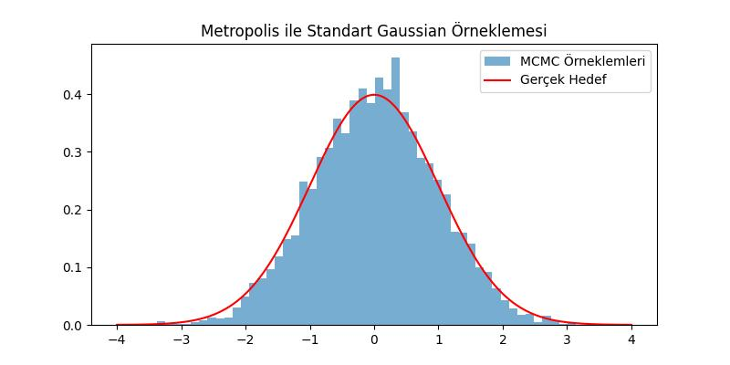
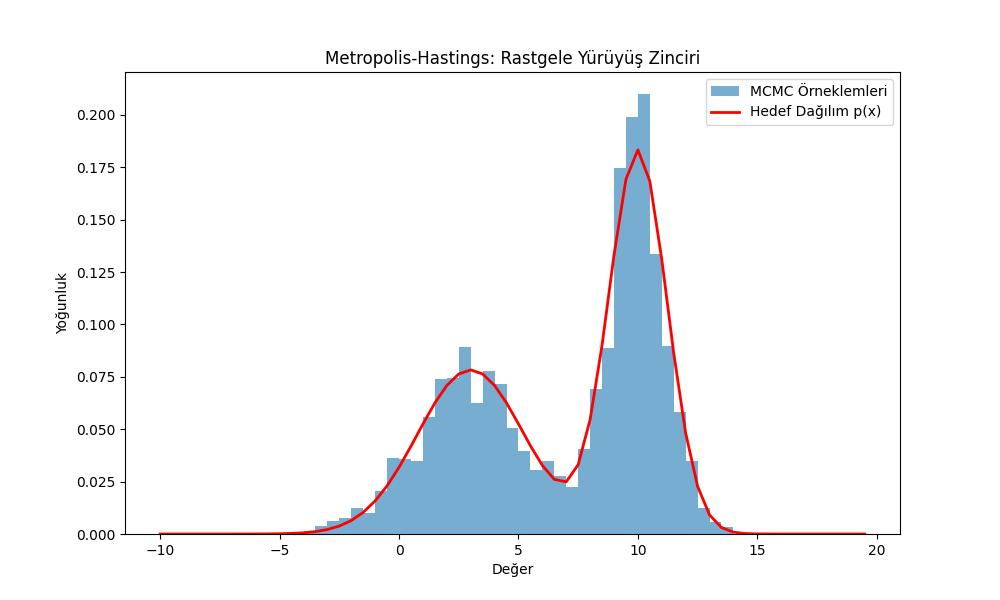
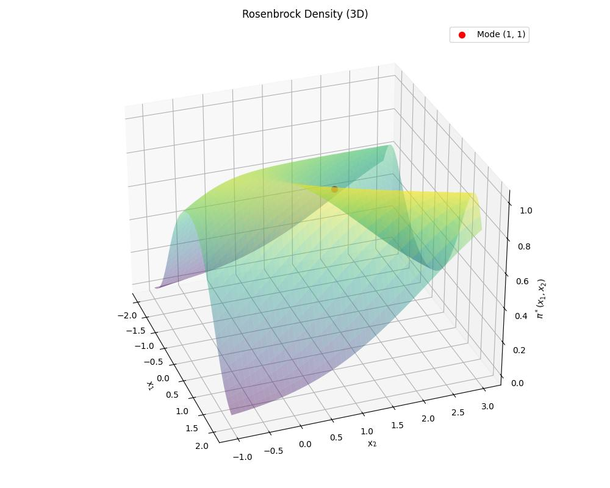
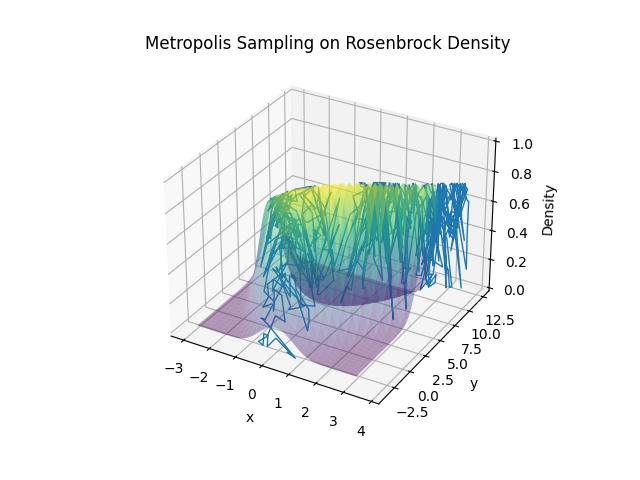

# Markov Zincirleri Monte Carlo, Metropolis-Hastings, Gibbs

Bir hedef dağılım $\pi(x)$'ten örneklem almak istiyoruz,  diyelim ki
değerlendirebildiğimiz (evaluate) ama doğrudan örnekleyemediğimiz
karmaşık bir olasılık dağılımı elimizde var. MH'nin büyük fikri şu:
doğrudan örneklemek yerine, uzun vadeli davranışı $\pi(x)$'i taklit
eden bir Markov zinciri inşa et. Sonra zinciri çalıştırıp konum
bilgisini topla [1].

"$\pi$'yi değerlendirebiliyoruz ama örnekleyemiyoruz" gibi ifadeler
ilk duyulduğunda sezgiye aykırı gelebilir. Peki değerlendirmesi kolay
ama örneklemesi zor olan bir dağılıma örnek nedir? Zorluk yalnızca
Bayesçi bağlamdan (paydada çözümsüz entegraller yaratan) ibaret
değildir. Değerlendirmesi kolay ama doğrudan örneklemesi zor olan pek
çok açık, kapalı-form dağılım vardır. İşte çirkin bir karışım
örneği. $\mathbb{R}^{10}$'da 100 Gaussian'ın karışımını ele alalım:

$$\pi^*(x) = \frac{1}{100} \sum_{k=1}^{100} \mathcal{N}(x \mid \mu_k,
\Sigma_k)$$

Bu tamamen açık, normalize edilmiş bir olasılık yoğunluk fonksiyonudur
— anında değerlendirilebilir. Ancak örnekleme zordur; çünkü modlar
birbirinden çok uzak ve neredeyse sıfır olasılıklı bölgelerle ayrılmış
olabilir. Naif / basit bir örnekleyici bir modda sıkışır ve
diğerlerini hiç keşfedemez. Bu genel soruna çok modluluk denir. Asıl
sorun ise "boyutluluğun laneti"dir. Daha temelde, bilinen bir
olasılıksal yoğunluk fonksiyonundan örneklemenin standart numaraları
yüksek boyutlarda ise yaramaz:

- Ters CDF: $F^{-1}(u)$'yu hesaplamayı gerektirir; bu da $\pi^*$'yi
  entegre etmek demektir,  yüksek boyutta çözümsüzdür.

- Reddetme örneklemesi: Her yerde $q(x) \geq c \cdot \pi^*(x)$
  koşulunu sağlayan bir öneri $q(x)$ gerekir. Yüksek boyutlarda
  $\pi^*(x)/q(x)$ oranı neredeyse her yerde astronomik biçimde
  küçülür; kabul oranı $d$'de üstel olarak sıfıra gider.

- Izgara tabanlı yöntemler: $d$ boyutlu uzayı boyut başına $n$ kutuya
  bölmek $n^d$ nokta gerektirir,  orta büyüklükteki $d$ değerleri için
  bile tamamen olanaksızdır.

Değerlendirilebilirlik bize yerel bilgi verir (bu noktadaki yoğunluk
nedir?), örnekleme ise küresel bilgi gerektirir (yoğunluk uzayın
tamamında nasıl davranıyor?). Bu uçurumu kapatmak tam olarak MCMC'nin
yaptığı şeydir: yalnızca yerel değerlendirmeleri kullanarak uzayı
keşfeden bir Markov zinciri inşa eder.

Metropolis Yöntemi: Temel Mantık

Metropolis algoritması, karmaşık bir $\pi(x)$ hedef dağılımından
doğrudan örneklem çekemediğimizde imdadımıza yetişir. Yöntemin kalbi
şu 3 adımdan oluşan döngüye dayanır:

1. Aday Önerisi (Proposal): Mevcut konumumuz $x$ iken, kolayca
örnekleyebileceğimiz simetrik bir $q(y|x)$ dağılımından (örneğin
mevcut konuma Gaussian gürültüsü ekleyerek: $y = x + \mathcal{N}(0,
\sigma^2)$) yeni bir $y$ adayı öneririz.

2. Kabul Oranı (Acceptance Ratio) Hesaplama: Önerilen noktanın mevcut
noktaya göre ne kadar "iyi" olduğunu anlamak için hedef yoğunlukların
oranına bakarız:

$$\alpha(x,y) = \min\left(1, \frac{\pi(y)}{\pi(x)}\right)$$

3. Zar Atma (Kabul/Ret): $[0, 1]$ aralığından rastgele bir $u$ sayısı
çekeriz. Eğer $u < \alpha$ ise öneriyi kabul edip $y$ konumuna
geçeriz; aksi takdirde teklifi reddeder ve mevcut $x$ konumumuzda
kalıp bu konumu tekrar sayarız.

En Büyük Numara: Normalleştirme Sabitinden Kurtulmak. Bayes usulü
analizde veya karmaşık fizik modellerinde hedef dağılımımız genellikle
$\pi(x) = \frac{\pi^*(x)}{Z}$ biçimindedir. Burada $\pi^*(x)$
formülünü kolayca hesaplayabildiğimiz ham fonksiyon, $Z$ ise
hesaplaması imkansız olan normalleştirme sabitidir (entegral veya
payda).

Metropolis yönteminin asıl dehası kabul oranında gizlidir. Orana
koyduğumuzda $Z$ sabiti tamamen sadeleşir:

$$
\alpha(x,y) = \min\left(1, \frac{\pi^*(y) / Z}{\pi^*(x) / Z}\right)
= \min\left(1, \frac{\pi^*(y)}{\pi^*(x)}\right)
$$

Yani dağılımın uzayda toplamda 1'e entegre olup olmaması MCMC'nin
umurunda değildir; algoritma sadece o an tırmandığı tepelerin
birbirine oranına (eğimine) bakar.

Önsel (Prior) Seçimiyle Sınırları Yönetmek. Aynı sadeleşme mantığı
Bayes modellerinde parametrelere sınır koymak için de mükemmel bir
araçtır. Diyelim ki sonsal (posterior) dağılımdan örneklem
çekiyoruz. Bayes kuralı gereği $\text{Sonsal} \propto
\text{Olabilirlik (Likelihood)} \times \text{Önsel (Prior)}$ olduğunu
biliyoruz.

Kabul oranını yazarken bu çarpımı kullanırız. Eğer bulmaya
uğraştığımız bir katsayının muhakkak belli bir aralıkta kalmasını
istiyorsak bunu onsel dağılıma birörnek (uniform) bir sınır koyarak
çözebiliriz. Aday adım bu sınırların dışına çıktığı an önsel değeri
$0$ (log uzayında $-\infty$) döndürebilir, bu da $\alpha$ kabul
oranını anında sıfırlayarak zincirin o yasaklı bölgeye basmasını
engeller. Algoritma içerisinde olasılıkların çarpımı yerine sayısal
taşmaları önlemek için logarıtmik toplamlar ($\ln(\text{Likelihood}) +
\ln(\text{Prior})$) kullanılabilir.

Basit Bir Örnek: Standart Gaussian Dağılımından Örnekleme

Metropolis mantığını görmek için hedefimizin sadece standart bir
normal dağılım ($\mu=0, \sigma=1$) olduğu en basit senaryoyu
kodlayalım:

```python
import numpy as np
import matplotlib.pyplot as plt

# 1. Hedef Dağılım (Normalleştirme sabiti olmadan sadece şekli yeterli!)
def hedef_pi(x):
    return np.exp(-0.5 * x**2)

# Parametreler
N = 10000
adim_genisligi = 0.5
zincir = np.zeros(N)
zincir[0] = 5.0 # Kötü bir başlangıç noktası seçelim (Dağılımın çok uzağı)

# Metropolis Döngüsü
for i in range(N-1):
    mevcut = zincir[i]
    
    # Adım 1: Rastgele bir aday öner (Simetrik Gaussian Rastgele Yürüyüş)
    aday = mevcut + np.random.normal(0, adim_genisligi)
    
    # Adım 2: Kabul oranını hesapla (Z'ler zaten yok, pi'ler oranlanıyor)
    alpha = min(1, hedef_pi(aday) / hedef_pi(mevcut))
    
    # Adım 3: Kabul / Ret mekanizması
    if np.random.uniform(0, 1) < alpha:
        zincir[i+1] = aday
    else:
        zincir[i+1] = mevcut

# Görselleştirme
plt.figure(figsize=(8, 4))
plt.hist(zincir[1000:], bins=50, density=True, alpha=0.6, label='MCMC Örneklemleri')
x_ekseni = np.linspace(-4, 4, 200)
plt.plot(x_ekseni, 1/np.sqrt(2*np.pi)*np.exp(-0.5 * x_ekseni**2), 'r', label='Gerçek Hedef')
plt.title("Metropolis ile Standart Gaussian Örneklemesi")
plt.legend()
plt.savefig('stat_097_mcmc_04.jpg')
```



Biraz önce önsel dağılımlarda sınır tanımlamaktan bahsettik, bunu
sıfır log uzayda sonsuz değer döndürerek yapabiliyoruz. Fakat bu durum
1'e entegre olması gereken dağılımlar bağlamında problem çıkarmıyor
mu? Olmuyor, nedeninden bahsedelim. Önsel ve olurluk fonksiyonlarının
kendi içlerinde de olasılık dağılımı olmalarından kaynaklanan
normalleştirme sabitleri (örneğin Gaussian formülünün başındaki
$\frac{1}{\sigma\sqrt{2\pi}}$ gibi ifadeler) var. Bu sabitleri
$c_{\text{olurluk}}$ ve $c_{\text{önsel}}$ olarak ayıralım
ve fonksiyonları ham halleriyle yazalım:

* $P(D | \theta) = c_{\text{olurluk}} \times P^*(D | \theta)$

* $P(\theta) = c_{\text{önsel}} \times P^*(\theta)$

Şimdi bu ifadeleri Metropolis kabul oranına ($\alpha$) yerleştirelim
ve mevcut bir $\theta_{\text{mevcut}}$ konumundan önerilen bir
$\theta_{\text{aday}}$ konumuna geçiş cebirini inceleyelim:

$$\alpha = \min\left(1,
\frac{\pi(\theta_{\text{aday}})}{\pi(\theta_{\text{mevcut}})}\right) =
\min\left(1, \frac{\frac{P(D | \theta_{\text{aday}})
P(\theta_{\text{aday}})}{P(D)}}{\frac{P(D | \theta_{\text{mevcut}})
P(\theta_{\text{mevcut}})}{P(D)}}\right)$$

Paydadaki hesaplanamaz $P(D)$ terimleri parametreye bağlı olmadıkları
için birbirini doğrudan götürür:

$$\alpha = \min\left(1, \frac{P(D | \theta_{\text{aday}})
P(\theta_{\text{aday}})}{P(D | \theta_{\text{mevcut}})
P(\theta_{\text{mevcut}})}\right)$$

Şimdi fonksiyonların içindeki normalleştirme sabitlerini de yerine
koyalım:

$$
\alpha = \min\left(1, \frac{\left[c_{\text{olurluk}} \times P^*(D |
\theta_{\text{aday}})\right] \times \left[c_{\text{önsel}} \times
P^*(\theta_{\text{aday}})\right]}{\left[c_{\text{olurluk}} \times P^*(D |
\theta_{\text{mevcut}})\right] \times \left[c_{\text{önsel}} \times
P^*(\theta_{\text{mevcut}})\right]}\right)
$$

Görüldüğü üzere hem olurluktan gelen $c_{\text{olurluk}}$ sabitleri hem
de önselden gelen $c_{\text{prior}}$ sabitleri kesrin pay ve
paydasında sadeleşir. Sonuç olarak kabul oranı sadece ham
fonksiyonların çarpımına eşitlenir:

$$\alpha = \min\left(1, \frac{P^*(D | \theta_{\text{aday}}) \times
P^*(\theta_{\text{aday}})}{P^*(D | \theta_{\text{mevcut}}) \times
P^*(\theta_{\text{mevcut}})}\right)$$

Yani MCMC simülasyonu yaparken ne $P(D)$ paydasını entegre etmek
zorundayız ne de önsel dağılımın alanının 1'e eşit olmasını sağlayan o
karmaşık katsayıları hesaplamak zorundayız. Algoritma sadece o an
tırmandığı tepelerin birbirine oranına (eğimine) bakar. Bu yüzden kod
yazarken önsel dağılımın sadece "şeklini" korumamız matematiksel
olarak tamamen geçerlidir.

Zincire Kaydedilenler

Üstteki koda dikkat edilirse her adımda `zincir[i+1]` ile zincire
kayıt yapılıyor, bu öneri kabul edilsin / edilmesin muhakkak
yapılıyor. Eğer öneri kabul edilirse yeni adımın kaydedilmesini
bekleriz fakat ret durumunda niye kayıt yapılıyor acaba? Bu aslında
istatistiki olarak doğru bir adım. Eğer öneri red edilmişse, o an
üzerinde olduğumuz noktanın yine kaydedilmesini isteriz çünkü bu
yüksek olasılığı olan bir bölgede olduğumuzun işareti olacaktır.  O
bölgedeki noktaların frekansı zincir üzerinde artarsa bu bizim için
doğru bir sonuç olur, çünkü bu frekans artışı o zincir üzerinden bizim
döngü bittiğinde yapacağımız özet istatistiklerine direk yansır. Eğer
zincirde 10 değeri etrafında bir sürü değer var ise, zincir
değerlerinde `mean` hesabı yapınca 10'a yakın bir sonuç elde
edebiliriz.

MH Yakınsaklığının Kanıtı

Bu görev için durağanlık, indirgenemezlik ve aperiyodikliğin
kanıtlanması gerekir. Durağanlık için geçişlerin Markov özelliğine
sahip olması gerekir; gelecek yalnızca bugüne bağlıdır. Bu kalem
oldukca basit, eğer bir sonraki adım için sadece o andaki konum
bilgisini kullanırsak bunu otomatik olarak elde etmiş oluruz.

Ayrıntılı denge üzerinden durağanlığı elde ederiz. Ancak durağanlık
tek başına, zincirin rastgele bir başlangıç noktasından $\pi$'ye
yakınsadığını garanti etmez. Bunlara ek olarak şunlar gerekir:

İndirgenemezlik: Zincir, pozitif olasılıklı herhangi bir bölgeye her
yerden ulaşabilmelidir. Bu olmazsa birden fazla durağan dağılım
olabilirdi (her bağlantısız bileşen için bir tane) ve hangisinde
sonuçlanacağınız başlangıç noktanıza bağlı olurdu. Gaussian öneri
kullanan MH'de indirgenezlik neredeyse bedavaya gelir; Gaussian her
yere ulaşabilirlik sağlar.

Aperiyodiklik: Zincir bir döngüde salınmamalıdır. $A \to B \to A \to B
\to \cdots$ şeklinde giden bir zincirin $\pi$ durağan dağılımı
olabilir, ama ergodik anlamda asla ona yakınsamaz. MH bunu "yerinde
kal" adımıyla otomatik olarak çözer: bir öneri reddedildiğinde mevcut
durum tekrar sayılır. Bu öz-döngü her türlü periyodu kırar.

İndirgenemezlik + aperiyodiklik + durağanlık bize ergodikliği verir,

$$\frac{1}{T} \sum_{t=1}^{T} f(x_t) \xrightarrow{T \to \infty} \mathbb{E}_\pi[f]$$

başlangıç noktası $x_0$'dan bağımsız olarak. Gerçek kazanım bu,
yalnızca $\pi$'nin durağan olması değil, zinciri çalıştırmanın
$\pi$'nin kendisinden örneklem vermesi.

- Ayrıntılı denge → $\pi$ bir durağan dağılımdır
- İndirgenemezlik + aperiyodiklik → $\pi$ tek durağan dağılımdır ve zincir ona yakınsar
- Ergodiklik → zaman ortalamaları $\pi$-beklentilerine eşittir (yani örnekleriniz gerçekten işe yarar)

$\alpha$ yapısı ayrıntılı dengeyi güvence altına alır. Gaussian öneri
ile reddet/yerinde-kal mekanizması, indirgenemezliği ve aperiyodikliği
neredeyse bedavaya güvence altına alır (bu sebeple [1] yazısında bu
konuya çok vurgu yapıldığını görmüyoruz, arka planda sessizce işlerini
yapıyorlar)

Durağanlık

Ayrık durumda durağan bir dağılım şu koşulu sağlar:

$$\pi(j) = \sum_i \pi(i)\, p_{ij}$$

Sürekli durumda bu şöyle olur:

$$\pi(y) = \int \pi(x)\, p(x, y)\, dx$$

$\pi$'nin durağan dağılımı olacağı bir $p(x, y)$ inşa etmek
istiyoruz. Bu temel hedef.

Durağanlık için ispat edilmesi, kullanılması daha kolay olan yeterli
bir koşul ayrıntılı denge olarak adlandırılır:

$$\pi(x)\, p(x, y) = \pi(y)\, p(y, x)$$

Bu şunu söyler: $x$'te olup $y$'ye atlama olasılığı, $y$'de olup $x$'e
atlama olasılığına eşittir. İki durum arasındaki akış her iki yönde
dengelenmiştir. Bunun durağanlığı ima ettiğini, her iki tarafı da $x$
üzerinden entegre ederek doğrulayabiliriz:

$$\int \pi(x)\, p(x, y)\, dx = \int \pi(y)\, p(y, x)\, dx = \pi(y) \int p(y, x)\, dx = \pi(y)$$

Bu tam olarak durağanlık koşuludur. Not: $\int p(y,x)\,dx = 1$; çünkü
$p(y,x)$ bir geçiş yoğunluğu ve tüm olası sonraki durumlar üzerinden
entegre edilince toplam olasılık 1 vermeli.

Dolayısıyla hedef $\pi$'ye göre ayrıntılı dengeyi sağlayan bir geçiş
kuralı $p(x,y)$ inşa edebilirsek işimiz biter.

Öneri Dağılımı

Bir öneri dağılımı $q(y \mid x)$ tanıtıyoruz,  mevcut durum $x$'e
koşullu olarak örnekleyebileceğimiz basit bir dağılım. Bunu şöyle
düşünebiliriz: "$x$'teyken bir sonraki sıçramayı nereye düşünmeliyim?"
Yaygın bir seçim, mevcut konuma Gaussian gürültüsü eklemektir:

$$y = x + \mathcal{N}(0, \sigma^2)$$

Öneriyi her zaman kabul etseydik, zincir $\pi$'ye göre değil $q$'ya
göre yürürdü. Dolayısıyla bir düzeltmeye ihtiyacımız var.

Kabul Kriteri

Öneri yoğunluğu $q$'nun kendi başına ayrıntılı dengeyi sağlamadığını
varsayalım. Örneğin:

$$q(y \mid x)\, \pi(x) > q(x \mid y)\, \pi(y)$$

yani $x$'ten $y$'ye çok sık atlıyoruz. Bunu düzeltmek için sıçramayı
her zaman kabul etmiyoruz. $\alpha(x, y)$ olasılığıyla kabul ediyoruz;
bu olasılığı dengeyi yeniden sağlayacak şekilde seçiyoruz:

$$\pi(x)\, q(y \mid x)\, \alpha(x, y) = \pi(y)\, q(x \mid y)$$

En zekice çözüm:

$$\alpha(x, y) = \min\!\left(1,\, \frac{\pi(y)\, q(x \mid y)}{\pi(x)\, q(y \mid x)}\right)$$

Kabaca olanları anlamak basit: önerilen $y$ durumu $\pi$ altında
mevcut $x$ durumundan daha yüksek olasılığa sahipse her zaman kabul
et. Daha düşükse yalnızca bazen kabul et, ne kadar düşük olduğuyla
orantılı olarak. Bu, "yanlış" yöndeki hareketleri dengeyi yeniden
sağlayacak kadar düşürür.

Özetle, geçiş yoğunluğu şöyle yazılır:

$$p_{\text{MH}}(x, y) = \alpha(x, y)\, q(y \mid x), \quad x \neq y$$

Metropolis Özel Durumu

Öneri simetrikse, yani $q(y \mid x) = q(x \mid y)$, Gaussian gürültüde
olduğu gibi, $q$ terimleri sadeleşir ve kabul şu hale gelir:

$$\alpha(x, y) = \min\!\left(1,\, \frac{\pi(y)}{\pi(x)}\right)$$

Bu orijinal Metropolis algoritmasıdır. MH ise bunun asimetrik
önerilere genellemesidir.

Algoritma

1. Bir başlangıç noktası seç, buna $x$ de
2. $q(y \mid x)$'ten yeni bir durum $y$ öner
3. $\alpha(x, y)$'yi hesapla
4. Birönek dağılımdan sayı örnekle
4. $\alpha$ olasılığıyla $y$'yi kabul et (birörnek sayıyla karşılaştır); aksi takdirde $x$'te kal
5. Tekrarla

Yeterince uzun süre çalıştıktan sonra ziyaret edilen durumlar $\pi$'ye
göre dağılmış olur. Isınma süresi, zincirin nereden başladığını
"unutmadan" önceki başlangıç sürecidir, bu örnekler henüz $\pi$'yi
temsil etmediğinden atılır.

Not: $\alpha(x, y)$ hesaplandıktan sonra onu birörnek dağılımdan
alınan sayı ile karşılaştırmak önemli, ancak o şekilde $\alpha$
olasılığına bağlı zar atabilmiş oluyoruz. Eğer $\alpha$ değeri 0.2 ise
10 örneklem içinden 2 tane kabul olmalı 8 tane ret olmalı. Bunu tarif
edilen örneklem aşaması ile gerçekleştirmiş oluyoruz.

Örnek: Gaussian Karışımı

Alttaki örnek [3, sf. 336]'dan alınmıştır, iki Gaussian karışımından
örneklem almayı başarıyor.

```python
import numpy as np
import matplotlib.pyplot as plt

# Örneklemek istediğimiz hedef dağılım (Bimodal Gauss Karışımı)
def p(x):
    mu1 = 3; mu2 = 10; v1 = 10; v2 = 3
    return 0.3 * np.exp(-(x - mu1)**2 / v1) + 0.7 * np.exp(-(x - mu2)**2 / v2)

# Parametreler
adim_boyutu = 0.5
x = np.arange(-10, 20, adim_boyutu)
px = p(x)
N = 5000  # Örneklem sayısı

# Rastgele Yürüyüş (Random Walk) Metropolis-Hastings
u2 = np.random.rand(N)
sigma_rw = 10  # Rastgele yürüyüşün adım genişliği
y2 = np.zeros(N)
y2[0] = np.random.normal(0, sigma_rw)  # Başlangıç durumu

for i in range(N - 1):
    # Mevcut duruma bağlı olarak yeni bir aday durum öner (Rastgele Yürüyüş)
    y2new = y2[i] + np.random.normal(0, sigma_rw)
    
    # Kabul olasılığını hesapla (alpha)
    # Öneri dağılımı simetrik olduğu için q(y|y_yeni) / q(y_yeni|y) = 1 olur.
    alpha = min(1, p(y2new) / p(y2[i]))
    
    # Kabul etme veya reddetme adımı
    if u2[i] < alpha:
        y2[i+1] = y2new
    else:
        y2[i+1] = y2[i]

# Görselleştirme: Rastgele Yürüyüş Zinciri
plt.figure(figsize=(10, 6))
# density=True kullanarak histogramı olasılık yoğunluğuna normalize ediyoruz
plt.hist(y2, bins=x, density=True, alpha=0.6, label='MCMC Örneklemleri')

# Hedef dağılımı normalize ederek çizdiriyoruz (np.trapezoid kullanımı)
plt.plot(x, px / np.trapezoid(px, x), color='r', linewidth=2, label='Hedef Dağılım p(x)')

plt.title("Metropolis-Hastings: Rastgele Yürüyüş Zinciri")
plt.xlabel("Değer")
plt.ylabel("Yoğunluk")
plt.legend()

plt.savefig('stat_097_mcmc_03.jpg')
```




Örnek: Rosenbrock

Bir yoğunluk fonksiyonu yaratalım, onun üzerinden alttaki örneği
kodlayacağız.

$$
\pi^*(x_1, x_2) = \frac{1}{Z} \exp\!\left(-\frac{f(x_1, x_2)}{20}\right), \quad Z =
\int \exp\!\left(-\frac{f(x_1, x_2)}{20}\right) dx
$$

Geçerli bir yoğunluk için iki koşul gerekli: 1) Negatif olmama:
$\pi^*(x) \geq 0$, evet, üstel bunu garanti eder çünkü $\exp(\cdot) >
0$ her zaman. 2) 1'e entegre olma: $\int \pi^*(x)\, dx = 1$, burada
$\propto$ sembolü önemli iş yapıyor. Ham $\exp(-f/20)$ zorunlu olarak
1'e entegre olmaz, dolayısıyla örtük bir normalleştirme sabiti $Z$
vardır:

MH'nin güzelliği burada: $Z$'yi hiç hesaplamak zorunda
değilsiniz. Kabul oranı şöyledir:

$$\alpha(x, y) = \min\!\left(1,\, \frac{\exp(-f(y)/20)/Z}{\exp(-f(x)/20)/Z}\right)$$

$Z$'ler sadeleşir; dolayısıyla MH yalnızca normalleştirme sabitine
kadar bilinen dağılımlardan örnekleyebilir.

`exp`, normalleştirmeyi hesaplamayı kolaylaştırmaz. Rosenbrock
yoğunluğu için $Z$'nin kapalı formu yoktur. `exp`'in kullanılmasının
asıl nedeni entegralin sonlu olmasını (yani $Z < \infty$) güvence
altına almaktır. $f(x_1, x_2) \geq 0$ her yerde sağlandığından:

$$\exp\!\left(-\frac{f(x_1, x_2)}{20}\right) \in (0, 1]$$

dolayısıyla entegre edilen 1 ile sınırlı ve moddan uzaklaştıkça 0'a
yaklaşır; bu da entegrali sonlu kılar. $f$'yi doğrudan yoğunluk olarak
kullansaydınız, $f \geq 0$ sınırsız büyüdüğünden anında başarısız
olurdu. Özetle `exp` üç şey yapar: 1) Pozitifliği garanti eder 2)
Manzarayı çevirir (küçük $f$ → yüksek yoğunluk) 3) Aralığı $(0,1]$'e
sıkıştırır; entegrali sonlu kılar

1'e gerçek normalleştirme ise $Z$'ye bölmektir; MH'nin bunu
hesaplaması gerekmez.

Kod

```python
a, b = 1, 3

x1 = np.linspace(-2, 2, 500)
x2 = np.linspace(-1, 3, 500)
X1, X2 = np.meshgrid(x1, x2)

Z = np.exp(-((a - X1)**2 + b*(X2 - X1**2)**2) / 20)

fig = plt.figure(figsize=(10, 8))
ax = fig.add_subplot(111, projection='3d')

ax.plot_surface(X1, X2, Z, cmap='viridis', linewidth=0, antialiased=True,alpha=0.4)
ax.scatter(a, a**2, 1.0, color='red', s=50, zorder=5, label=f'Mode ({a}, {a**2})')

ax.set_xlabel('$x_1$')
ax.set_ylabel('$x_2$')
ax.set_zlabel('$\\pi^*(x_1, x_2)$')
ax.set_title('Rosenbrock Yogunlugu')
ax.view_init(azim=340, elev=30)
ax.legend()
plt.tight_layout()
plt.savefig('stat_097_mcmc_01.jpg')
```



```python
from numpy.random import multivariate_normal as mvn
from mpl_toolkits.mplot3d import Axes3D

n_iters = 1000          # Metropolis adımlarının sayısı
proposal_var = 0.1      # öneri varyansı
burn_in = 100           # erken örnekleri at
a,b = 1,4

def rosen(x, y): return np.exp( -((a - x)**2 + b*(y - x**2)**2) / 20)
    
samples = np.empty((n_iters, 2))

# Rastgele başlangıç noktası
samples[0] = np.random.uniform(low=[-3, -3],high=[3, 10],size=2 )

for i in range(1, n_iters):
    curr = samples[i - 1]
    # Yeni nokta öner
    prop = curr + mvn(mean=np.zeros(2),cov=np.eye(2) * proposal_var)
    
    # Kabul olasılığı
    alpha = min(1, rosen(*prop) / rosen(*curr))
    
    # Kabul et ya da reddet
    if np.random.uniform() < alpha:
        curr = prop
    samples[i] = curr
    
# Burn-in'i çıkar
samples = samples[burn_in:]
x = np.linspace(-3, 3, 60)
y = np.linspace(-3, 10, 60)
X, Y = np.meshgrid(x, y)
Z = rosen(X, Y)

# Örnek yükseklikleri
Z_samples = rosen(samples[:, 0], samples[:, 1])
fig = plt.figure()
ax = fig.add_subplot(111, projection='3d')

# Yüzey
ax.plot_surface(X, Y, Z, cmap='viridis', linewidth=0, antialiased=True,alpha=0.4)
ax.plot(samples[:, 0],samples[:, 1],Z_samples,linewidth=1)
ax.set_xlabel("x")
ax.set_ylabel("y")
ax.set_zlabel("Density")
plt.title("Rosenbrock Yogunlugu Uzerinde Metropolis Orneklemesi")
plt.savefig('stat_097_mcmc_02.jpg')
```



Üstteki grafikte Rosenbrock yoğunluğunun nasıl gezildiğini görüyoruz,
mavi çizgilerin her biri önceki bir konumdan diğer sonraki konuma
geçişi gösteriyor, bu geçişler sırasında durağan dağılımdan
örneklemler toplamış oluyoruz.

Gibbs Örneklemesi

Gibbs örneklemesi, Metropolis-Hastings'in özel bir durumudur [2]; yeni
önerilen durum her zaman bire eşit olasılıkla kabul edilir. $D$
boyutlu bir sonsal dağılımı $x = (x_1, \ldots, x_D)$ parametreleriyle
ele alalım. Gibbs örneklemesinin temel fikri, $x_{-d}$'nin $d$-inci
parametre olmaksızın $x$ olduğu koşullu dağılım $\pi(x_d \mid x_{-d},
X)$'ten yinelemeli olarak örneklemektir.

Algoritma

$t = 1, \ldots, T$ için:

- $x_1^{(t+1)} := y_1 \sim \pi(x_1 \mid x_2^{(t)}, x_3^{(t)}, \ldots, x_D^{(t)}, X)$
- $x_2^{(t+1)} := y_2 \sim \pi(x_2 \mid x_1^{(t+1)}, x_3^{(t)}, \ldots, x_D^{(t)}, X)$
- $\ldots$
- $x_d^{(t+1)} := y_d \sim \pi(x_d \mid x_1^{(t+1)}, \ldots, x_{d-1}^{(t+1)}, x_{d+1}^{(t)}, \ldots, x_D^{(t)}, X)$
- $x_D^{(t+1)} := y_D \sim \pi(x_D \mid x_1^{(t+1)}, x_2^{(t+1)}, \ldots, x_{D-1}^{(t+1)}, X)$

Üsttekinin neden çalıştığını görmek için

$$\pi(x \mid X) = \pi(x_d, x_{-d} \mid X) = \pi(x_d \mid x_{-d}, X)\,\pi(x_{-d} \mid X)$$

olduğuna dikkat edelim. Geçiş olasılığı, daha önceki notasyona da
bağlı kalacak şekilde, şu şekilde yazılabilir,

$$\alpha(x, y) = \min\left\{1, \frac{\pi(y) \pi(x_d | x_{-d}, X)}{\pi(x) \pi(y_d | y_{-d}, X)}\right\}$$

Dikkat edersek $q$ simdi $\pi$, Gibbs örneklemesinde öneri dağılımı
koşulun kendisi seçilir:

$$q(y \mid x) = \pi(y_d \mid x_{-d}, X)$$

"yani $d$ koordinatı için yeni bir değer önerirken, diğer tüm
koordinatları sabit tutarak (yani $y_{-d} = x_{-d}$) doğrudan koşullu
dağılımından örnekleme yaparsınız."

Ters yönde, $q(x \mid y)$: $y$'deyken $x$'e geçmeyi önerirsek, aynı
mekanizma geçerli; $d$ dışındaki tüm koordinatları $y_{-d}$'de sabit
tutup $x_d$'yi koşullu dağılımdan çekiyoruz. Dolayısıyla:

$$q(x \mid y) = \pi(x_d \mid y_{-d}, X)$$

Not: $y_{-d} = x_{-d}$ olduğundan (Gibbs adımı diğer koordinatları
hiçbir zaman değiştirmez), bu şu hale gelir:

$$q(x \mid y) = \pi(x_d \mid y_{-d}, X) = \pi(x_d \mid x_{-d}, X)$$

Bunları genel MH kabul oranına koyarsak:

$$
\alpha(y \mid x) = \min\!\left(1,\, \frac{\pi(y)\, q(x \mid y)}{\pi(x)\, q(y \mid x)}\right) = \min\!\left(1,\, \frac{\pi(y)\,\pi(x_d \mid y_{-d}, X)}{\pi(x)\,\pi(y_d \mid x_{-d}, X)}\right)
$$

$\pi(y) = \pi(y_d \mid y_{-d}, X)\,\pi(y_{-d} \mid X)$ ve $\pi(x) = \pi(x_d \mid x_{-d}, X)\,\pi(x_{-d} \mid X)$ açılımını kullanarak ve $y_{-d} = x_{-d}$ olduğundan her şey sadeleşir:

$$= \min\!\left(1,\, \frac{\pi(y_d \mid y_{-d}, X)\,\pi(y_{-d} \mid X)\,\pi(x_d \mid x_{-d}, X)}{\pi(x_d \mid x_{-d}, X)\,\pi(x_{-d} \mid X)\,\pi(y_d \mid y_{-d}, X)}\right) = 1$$

Demek ki öneriler her zaman kabul edilecek. 

Gibbs örneklemesinin her adımında, önerilen sonraki durum her zaman
geri dönüşlülük kısıtını sağlayan bir Metropolis-Hastings benzeri
rastgele yürüyüş gerçekleştiriyoruz.

Gibbs örneklemesinin temel avantajı basittir: öneriler her zaman kabul
edilir. Temel dezavantajı ise yukarıdaki koşullu olasılık
dağılımlarını türetebilmemiz gerektiğidir. Bu, öncelin sonsal ile
eşlenik olduğu durumlarda kolay idare edilebilir.

Gibbs örneklemesini yalnızca Metropolis-Hastings algoritmasının özel
bir durumu olarak görebiliriz. Her iki algoritmanın da kavramsal
açıdan zor kısmı, geri dönüşlülük kısıtının doğruluğunu ve örtük bir
Markov zincirinin durağan dağılımı olması garantili bir dağılımı nasıl
belirleyebileceğimizi anlamaktır.

Not: Yukarıdaki ispat, Gibbs örneklemesinde önerilerin her zaman kabul
edileceğini ($\alpha=1$) gösterdi. Metropolis-Hastings bağlamında ise
genellikle reddetme mekanizmasının (öneri reddedilince yerinde kalma)
aperiyodikliği garanti ettiğini belirtmiştik. Peki reddetme olmadan
aperiyodiklik nasıl sağlanıyor? MH cebiri bize şunu söyler: "Herhangi
bir öneri dağılımı $q$ kullanabilirsin, kabul oranını buna göre
ayarla." Gibbs'te biz $q$'yu koşullu dağılım olarak seçtiğimizde,
cebirsel olarak ayarlanacak bir şey kalmıyor ($\alpha=1$). Bu seçim,
reddetme mekanizmasına ihtiyaç duymadan, geçiş çekirdeğinin kendisi
üzerinden ergodikliği (indirgenemezlik ve aperiyodiklik) sağlar. Yani
MH kuralları içinde kalarak, reddetme olmadan da yakınsama garantisi
verebiliriz; çünkü aperiyodiklik reddetmeye değil, seçilen $q$'nun
yapısına bağlıdır.

Kaynaklar

[1] Gundersen, <a href="https://gregorygundersen.com/blog/2019/11/02/metropolis-hastings/">Why Metropolis–Hastings Works</a>

[2] Gundersen, <a href="https://gregorygundersen.com/blog/2020/02/23/gibbs-sampling/">Gibbs Sampling Is a Special Case of Metropolis–Hastings</a>

[3] Marsland, *Machine Learning An Algorithmic Perspective*