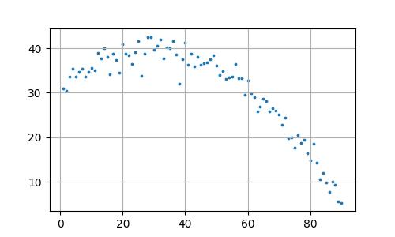

# Bayes Usulü Parçalı Regresyon

Diyelim ki alttaki veri üzerinde lineer regresyon işletmek istiyoruz, yani
veriye bir çizgi uydurma problemi olarak yaklaşacağız.

```python
import pandas as pd
df = pd.read_csv('../../compscieng/compscieng_app20cfit/cave.csv')
plt.figure(figsize=(5, 3))
plt.scatter(df.Temp, df.C,s=3)
plt.grid(True)
plt.savefig('stat_102_regchpt_01.jpg')
```



```python
import statsmodels.formula.api as smf
results = smf.ols('C ~ Temp', data=df).fit()
print ("R^2 = %0.2f (%0.2f, %0.2f)" % (results.rsquared, results.params[0],results.params[1],))
```

```text
R^2 = 0.62 (44.26, -0.30)
```

Uyum (fit) başarısı üstteki gibi rapor edildi. Sonuç fena değil ama
daha iyi olabilirdi. Şunu soralım, üstteki veriye tek bir çizgi
uydurmak uygun mudur? Aslında iki (ya da daha fazla) çizgi daha uygun
olmaz mıydı? Biz kabaca bakarak bile bunu görebiliyoruz. Kontrol
edelim, veriyi iki parça olarak alalım, ve her parça üzerinde ayrı bir
regresyon işletelim.


```python
results = smf.ols('C ~ Temp', data=df[0:15]).fit()
print ("R^2 = %0.2f" % results.rsquared)
results = smf.ols('C ~ Temp', data=df[15:-1]).fit()
print ("R^2 = %0.2f" % results.rsquared)
```

```text
R^2 = 0.77
R^2 = 0.80
```

Parçalı uyum sonucu daha iyi olarak rapor edildi. Demek ki üstteki
veride tek değil (en az) iki ve birbirinden farklı doğrusal ilişki
var.

### Normal Regresyon, Bayes Yaklaşımı

Nerede olduklarını bilmediğimiz parçalı regresyonu çözmenin iyi bir
yöntemi bunu olasılıksal olarak yapmak, ve Bayes yöntemine başvurmak.
İlk önce normal regresyonu Bayes usulü nasıl yaparız onu görelim.

Herhangi bir değişim noktası içermeyen basit bir doğrusal regresyon
için, her bir $y_t$ gözleminin, sabit bir artık varyansı $\sigma^2$
ile birlikte, tahmin edilen bir ortalama $\mu_t$ etrafında normal
dağıldığını varsayıyoruz:

$$y_t \sim N(\mu_t, \sigma^2)$$

Serinin hem taban yüksekliği hem de zaman içindeki gidişatı, doğrudan
bu tahmin edilen ortalamanın, yani $\mu_t$'nin içine
gömülüdür. Verinin ham biçimde tutulduğu klasik bir basit doğrusal
regresyon modelinde, herhangi bir $t$ zaman adımındaki beklenen
ortalama için hem bir taban kesme noktası ($\alpha$) hem de bir eğim
katsayısı ($\beta$) gereklidir:

$$\mu_t = \alpha + \beta x_t$$

- $x_t$, $t$ zamanındaki bağımsız değişkeninizdir (örneğin, Sıcaklık (`Temp`)).

- $\alpha$, kesme noktası (intercept) katsayısıdır ve $X = 0$
  olduğunda $Y$'nin taban değerini temsil eder.

- $\beta$, eğim katsayısıdır ve $X$'teki birim değişim başına $Y$'deki
  değişim oranını belirler.

- $\mu_t$, o belirli veri noktası için elde edilen ders kitabı
  tahminidir.

Yani, $y_t \sim N(\mu_t, \sigma^2)$ yazdığımızda, çan eğrisinin
merkezine kodlanmış her iki parametreyi de açıkça görmek için bunu
tamamen açabilirsiniz:

$$y_t \sim N(\alpha + \beta x_t, \sigma^2)$$

Bu, modelin, veri noktalarınız $y_t$'nin, taban yüksekliği $\alpha$
tarafından kontrol edilen ve dikliği tamamen eğim parametresi $\beta$
tarafından belirlenen düz bir çizgi etrafında rastgele sıçradığını
varsaydığı anlamına gelir.

Tek bir bağımsız gözlem $y_t$ için Olasılık Yoğunluk Fonksiyonu (PDF) şudur:

$$P(y_t|x_t, \alpha, \beta, \sigma) = \frac{1}{\sqrt{2\pi\sigma^2}}
\exp\left(-\frac{(y_t - \mu_t)^2}{2\sigma^2}\right)$$

Tüm gözlemlerin, parametreler verildiğinde bağımsız olduğunu
varsayarsak, $D$ veri kümesinin tamamının ortak olurluğu, bireysel
olasılıklarının çarpımıdır:

$$P(D|\alpha, \beta, \sigma) = \prod_{t=1}^{N}
\frac{1}{\sqrt{2\pi\sigma^2}} \exp\left(-\frac{(y_t -
\mu_t)^2}{2\sigma^2}\right)$$

Doğal Logaritmanın Alınması

Log-olurluğu bulmak için, parametrelerimizi Gauss PDF'sinin içine
yerleştirir ve doğal logaritmasını (ln) alırız. Logaritmayı almak,
çarpımımızı ($\prod$) bir toplama dönüştürür; bu da sayısal olarak
kararlıdır ve hesaplaması daha kolaydır.

Önce tek bir veri noktasının log-olurluğuna bakalım:

$$\ln P(y_t|\mu_t, \sigma) = \ln\left[\frac{1}{\sqrt{2\pi\sigma^2}}
\exp\left(-\frac{(y_t - \mu_t)^2}{2\sigma^2}\right)\right]$$

Standart logaritma kurallarını kullanarak — $\ln(A \cdot B) = \ln A + \ln B$ ve $\ln(A^B) = B \ln A$ — bunu genişletiriz:

$$\ln P(y_t|\mu_t, \sigma) = \ln\left[(2\pi\sigma^2)^{-1/2}\right] +
\ln\left[\exp\left(-\frac{(y_t - \mu_t)^2}{2\sigma^2}\right)\right]$$

$$\ln P(y_t|\mu_t, \sigma) = -\frac{1}{2}\ln(2\pi) - \ln(\sigma) -
\frac{(y_t - \mu_t)^2}{2\sigma^2}$$

Daha fazla sadeleştirme bize standart, yerelleştirilmiş log-olurluk
denklemini verir:

$$\ln P(y_t|\mu_t, \sigma) = -\frac{1}{2}\ln(2\pi) - \ln(\sigma) -
\frac{1}{2\sigma^2}(y_t - (\alpha + \beta x_t))^2$$

Önsellerin Tanımlanması

Normal regresyonda, $\alpha$, $\beta$ ve $\sigma$, sabit, bilinmeyen
sabitler olarak ele alınır. Bayes regresyonunda bunları rastgele
değişkenler olarak ele alır ve onlara önsel dağılımlar $P(\alpha,
\beta, \sigma)$ atarız. Önseller, veriyi gözlemlemeden önce parametre
değerleri hakkındaki inançlarımızı (ya da bunların yokluğunu) ölçer.

Parametrelerimizin başlangıçta birbirinden bağımsız olduğunu
varsayarsak, ortak önsel olasılık şu şekilde çarpanlarına ayrılır:

$$P(\alpha, \beta, \sigma) = P(\alpha) \cdot P(\beta) \cdot P(\sigma)$$

Bu önseller için yaygın standart seçimler şunları içerir:

- Kesme Noktası ($\alpha$): Bilinen bir taban yönelimi yoksa
  genellikle sıfırda merkezlenmiş geniş bir Gauss önseli atanır:
  $\alpha \sim N(0, \sigma_\alpha^2)$.

- Eğim ($\beta$): Benzer şekilde bir Gauss önseli atanır: $\beta \sim
  N(0, \sigma_\beta^2)$.

- Artık Varyans ($\sigma$): Standart sapma kesinlikle pozitif olması
  gerektiğinden, tipik olarak bir Yarı-Normal, Üstel veya Ters-Gamma
  dağılımı kullanılarak modellenir: $\sigma \sim
  \text{Yarı-Normal}(\sigma_0)$.

Sonsal (Posterior) Dağılımın Türetilmesi

Bayes Teoremi, önsel inançlarımızı verinin olurluğunu kullanarak
güncellemek ve sonsal dağılımı $P(\alpha, \beta, \sigma|D)$ elde etmek
için matematiksel köprüyü sağlar.

Bayes Teoremi şu şekilde yazılır:

$$P(\alpha, \beta, \sigma|D) = \frac{P(D|\alpha, \beta, \sigma) \cdot P(\alpha, \beta, \sigma)}{P(D)}$$

Burada:

- $P(\alpha, \beta, \sigma|D)$, Sonsal'dır (veriyi gördükten sonraki
  güncellenmiş inançlarımız).

- $P(D|\alpha, \beta, \sigma)$, Ortak Olurluk'tur (parametreler
  verildiğinde verinin olasılığı).

- $P(\alpha, \beta, \sigma)$, Ortak Önsel'dir (başlangıçtaki
  inançlarımız).

- $P(D)$, Marjinal Olurluk'tur (ya da kanıt), pay kısmının tüm olası
  parametre uzayları üzerinden integrali alınarak hesaplanır:

$$P(D) = \int\int\int P(D|\alpha, \beta, \sigma) P(\alpha, \beta, \sigma)\, d\alpha\, d\beta\, d\sigma$$

Orantısal Form

Payda $P(D)$, $\alpha$, $\beta$ veya $\sigma$ parametrelerine bağlı
olmadığından, yalnızca sonsalin 1'e integre olmasını sağlayan bir
normalleştirme sabiti işlevi görür. Bu nedenle, analitik türetmeler
sırasında bunu atlarız ve orantısal formülasyonla çalışırız:

Sonsal $\propto$ Olurluk × Önsel

$$P(\alpha, \beta, \sigma|D) \propto P(D|\alpha, \beta, \sigma) \cdot P(\alpha) \cdot P(\beta) \cdot P(\sigma)$$

Log-Sonsal Formülasyonu

Hesaplamalı uygulama için (Markov Zinciri Monte Carlo örneklemesi
gibi), sonsalın doğal logaritmasını alırız. Bu, kalan tüm çarpımları
toplamlara dönüştürerek kararlılığı en üst düzeye çıkarır:

$$\ln P(\alpha, \beta, \sigma|D) \propto \ln P(D|\alpha, \beta, \sigma) + \ln P(\alpha) + \ln P(\beta) + \ln P(\sigma)$$

Bölüm 2'deki ortak log-olurluk türetmemizi yerine koyarak, genişletilmiş amaç fonksiyonu şu hale gelir:

$$\ln P(\alpha, \beta, \sigma|D) \propto \sum_{t=1}^{N}\left[-\frac{1}{2}\ln(2\pi) - \ln(\sigma) - \frac{1}{2\sigma^2}(y_t - (\alpha + \beta x_t))^2\right] + \ln P(\alpha) + \ln P(\beta) + \ln P(\sigma)$$

Üstteki yaklaşımın kodları `bayes_ols.py` içinde bulunabilir.

```python
import bayes_ols

x_data = df['Temp'].values
y_data = df['C'].values
N = len(x_data)

iterations = 25000
burn_in = 5000

alpha_chain, beta_chain, sigma_chain = bayes_ols.metropolis_sampler(x_data, y_data, iterations=iterations)

final_beta = beta_chain[burn_in:]
final_sigma = sigma_chain[burn_in:]

print(f"\n--- Posterior Estimates (Standardized Scale) ---")
print(f"Beta: {np.mean(final_beta):.4f} ± {np.std(final_beta):.4f}")
print(f"Sigma (Residual Noise):      {np.mean(final_sigma):.4f} ± {np.std(final_sigma):.4f}")
```

```text
Acceptance Rate: 20.30%

--- Posterior Estimates (Standardized Scale) ---
Beta: -0.2975 ± 0.0242
Sigma (Residual Noise):      6.1331 ± 0.4661
```

Görüldüğü gibi OLS hesabına yakın bir sonuç elde ettik.

Formüllerin Kod ile Bağlantıları

Türetmenin sonunda, tek bir veri noktasının log-olurluğu için kapalı
biçimli bir ifadeye ulaşmıştık: Bu ifadenin tam olarak üç toplamsal
parçaya sahip olduğuna dikkat edelim. Bu, yazılış şeklinin bir
tesadüfü değildir — bu, bir üstel ile bir normalleştirme sabitinin
çarpımının logaritmasının alınmasının doğrudan cebirsel bir sonucudur;
bu da bir çarpımı toplamaya böler (hatırlayın: $\ln(A \cdot B) = \ln A
+ \ln B$). Bu üç parça şunlardır:

$-\frac{1}{2}\ln(2\pi)$ — bir sabit. $\alpha$, $\beta$, $\sigma$'ya ya da veriye hiç bağlı değildir. Bu sadece Gauss'un normalleştirme sabitinden gelen bir yük.

$-\ln(\sigma)$ — yalnızca $\sigma$'ya, yani varsaydığınız gürültü düzeyine bağlıdır.

$-\frac{1}{2\sigma^2}(y_t - \mu_t)^2$ — gerçek "uyum" terimi. Bu, modelin tahmini $\mu_t = \alpha + \beta x_t$, gözlemlenen $y_t$'den uzak olduğunda modeli cezalandıran parçadır.

log_likelihood içinde bunun nerede göründüğü

İşte fonksiyon tekrar:

```
def log_likelihood(alpha, beta, sigma, x, y):
    if sigma <= 0:
        return -np.inf
    mu = alpha + beta * x
    term1 = -0.5 * np.log(2 * np.pi)
    term2 = -np.log(sigma)
    term3 = -((y - mu)2) / (2 * (sigma2))
    return np.sum(term1 + term2 + term3)
```

`mu = alpha + beta * x`, tüm gözlemler için aynı anda hesaplanan $\mu_t = \alpha + \beta x_t$'den başka bir şey değildir (NumPy, $t$ üzerinden açık bir döngü yazmadan bunu yapmanıza izin verir; `x`, tek bir skaler değil, `x_data` dizisinin tamamıdır).

`term1 = -0.5 * np.log(2 * np.pi)`, sözcük anlamıyla $-\frac{1}{2}\ln(2\pi)$'dir; sembollerin yerine kod ile yazılmıştır. Burada gizli hiçbir şey yoktur — bu, birebir bir transkripsiyondur.

`term2 = -np.log(sigma)`, yine doğrudan bir transkripsiyon olan $-\ln(\sigma)$'dır.

`term3 = -((y - mu)2) / (2 * (sigma2))`, $-\frac{1}{2\sigma^2}(y_t - \mu_t)^2$'dir. `y` ve `mu` her ikisi de $N$ uzunluğunda diziler olduğundan (her veri noktası için bir giriş), bu tek satır üçüncü terimi her gözlem için aynı anda, elemanlar bazında hesaplar.

`if sigma <= 0: return -np.inf` satırı, matematikte açıkça görünmeyen ama onunla örtük olarak ima edilen küçük ama önemli bir muhasebe parçasıdır: $\ln(\sigma)$, $\sigma \leq 0$ için tanımsızdır ve bir standart sapma zaten negatif ya da sıfır olamaz, bu yüzden kod kısa devre yaparak, programın anlamsız bir logaritma üzerinde çökmesine izin vermek yerine log-olurluğa negatif sonsuz değeri (yani "bu imkânsız") atar.

Tek bir noktadan tüm veri kümesine: toplam nereden geliyor?

Bu, kodda gözden kaçırılması kolay ama aslında gerçek kavramsal iş
yapan bir adımdır. Daha önceki türetmeden hatırlayın, bağımsızlık
varsayımı altında tüm veri kümesinin ortak olurluğu, veri noktaları
üzerinden bir çarpımdır:

$$P(D|\alpha, \beta, \sigma) = \prod_{t=1}^{N} P(y_t|x_t, \alpha,
\beta, \sigma)$$

Her iki tarafın logaritmasını almak, o çarpımı bir toplama dönüştürür;
bu, daha önce kullanılan aynı logaritma kuralıyla olur ($\ln(A \cdot
B) = \ln A + \ln B$, birçok çarpana genişletilmiş hâliyle):

$$\ln P(D|\alpha, \beta, \sigma) = \sum_{t=1}^{N} \ln P(y_t|x_t,
\alpha, \beta, \sigma)$$

`np.sum(term1 + term2 + term3)` ifadesinin yaptığı tam olarak
budur. `term1`, `term2`, `term3`'ün her biri $N$ uzunluğunda bir
dizidir (`term1` teknik olarak yayınlanan bir skalerdir, ama kavramsal
olarak "$N$ konumdan her birine eklenen aynı sabit" olarak
düşünebilirsiniz). Üç diziyi elemanlar bazında toplamak, size $t$
konumunda tam olarak $\ln P(y_t|x_t, \alpha, \beta, \sigma)$'yı verir
— nokta başına log-olurluk.

Ardından `np.sum(...)`, $N$ uzunluğundaki nokta-başına log-olurluk
dizisini, $\sum_{t=1}^{N} \ln P(y_t|\ldots)$ olan tek bir sayıya
indirger; bu da belirli bir aday $(\alpha, \beta, \sigma)$
verildiğinde tüm veri kümesinin toplam log-olurluğudur.

Yani `log_likelihood(alpha, beta, sigma, x, y)` fonksiyonu, belirsiz
bir anlamda "olurluk" adı verilen soyut bir niceliği hesaplamıyor —
çok gerçek anlamda, `alpha`, `beta` ve `sigma` olarak beslediğiniz
belirli sayılar için, toplanmış log-olurluk formülünün sağ tarafını
hesaplıyor.

Salt matematiksel türetmenin kapsamadığı parça: önsel

Orijinal türetme yalnızca olurlukla, $P(D|\alpha, \beta, \sigma)$ ile — yani "parametreler verildiğinde, veri ne kadar olasıdır?" sorusuyla ilgileniyordu. Ancak kod ayrıca şunu da tanımlıyor:

```
def log_prior(alpha, beta, sigma):
    if sigma <= 0 or sigma > 50:
        return -np.inf
    if not (-100 < alpha < 100):
        return -np.inf
    if not (-10 < beta < 10):
        return -np.inf
    return 0.0
```

Bu, daha önceki `smf.ols(...)` çağrılarındaki gibi sıradan bir
(Bayessel olmayan, "frekansçı") regresyonda karşılığı olmayan Bayessel
bileşendir. Bayessel çıkarımda, herhangi bir veriye bakmadan önce,
parametrelerin makul olarak hangi değerleri alabileceğine dair bir
önsel inanç ifade edersiniz. Burada seçilen önsel, sınırlı bir kutu
üzerinde "düz" ya da "tekdüze" önsel olarak adlandırılan şeydir:
$-100$ ile $100$ arasındaki herhangi bir $\alpha$, $-10$ ile $10$
arasındaki herhangi bir $\beta$ ve $0$ ile $50$ arasındaki herhangi
bir $\sigma$ eşit derecede olası kabul edilir (fonksiyonun sabit $0.0$
döndürmesinin nedeni budur — ve unutmayın, bu bir log-önseldir,
dolayısıyla $0$'lık bir log-olasılık, orantılı olarak $1$'lik bir
olasılığa karşılık gelir, yani "tekdüze olası"). Bu kutuların
dışındaki her şey imkânsız ilan edilir, dolayısıyla log-uzayında
$-\infty$ (bu da tam olarak $0$'lık bir olasılığa karşılık gelir).

Bu, pedagojik olarak önemlidir çünkü "Bayessel" sözcüğünün belgenin
başlığında neden yer aldığını gösterir: çıkarım yalnızca olurluğa
dayanmaz, bu olurluğu bu önselle Bayes kuralı aracılığıyla
birleştirmeye dayanır. Log-uzayında, (normalleştirilmemiş) sonsal için
Bayes kuralı yalnızca bir toplamadır:

$$\ln P(\alpha, \beta, \sigma|D) \propto \ln P(D|\alpha, \beta,
\sigma) + \ln P(\alpha, \beta, \sigma)$$

ve bu orantılılık (sağ taraftaki eksik normalleştirme sabiti, bazen
"kanıt" olarak adlandırılır, $\alpha$, $\beta$, $\sigma$'ya bağlı
olmadığı ve burada kullanılan örnekleme şeması için gerekli olmadığı
için atlanır) tam olarak şurada uygulanandır:

```
def log_posterior(alpha, beta, sigma, x, y):
    return log_prior(alpha, beta, sigma) + log_likelihood(alpha, beta, sigma, x, y)
```

Tek bir toplama satırı, ama belgenin tamamının doğru yönde inşa ettiği
toplama budur: log-olurluk (Gauss PDF'sinden uzun uzadıya türetilmiş)
artı log-önsel (basit bir sınır-kutusu varsayımı), log-sonsale
eşittir.

Neden örnekleme ve metropolis_sampler'ın gerçekte ne yaptığı

İşte üzerinde durmaya değer bir detay, çünkü bu "bir formülümüz
var"dan "25.000 kez bir döngü çalıştırıyoruz"a kavramsal
sıçramadır. Klasik bir regresyonda (daha önceki `smf.ols` çağrısı),
her parametre için tek bir en-iyi-uyum sayısı elde edersiniz; bu, tek
seferde analitik olarak hesaplanır. Bayessel ortamda ise tek bir sayı
istemezsiniz — $(\alpha, \beta, \sigma)$ üzerindeki sonsal dağılımın
tamamını istersiniz; bu da, veriyle ne kadar tutarlı olduklarına göre
ağırlıklandırılmış, veriyle tutarlı olan parametre değerlerinin tüm
aralığını bilmek istediğiniz anlamına gelir. En basit modellerin
ötesindeki her şey için, bu dağılımın yazıp doğrudan
değerlendirebileceğiniz temiz bir kapalı-form formülü yoktur; yalnızca
(normalleştirilmemiş) sonsal yoğunluğu belirli bir $(\alpha, \beta,
\sigma)$ noktasında, `log_posterior` aracılığıyla
değerlendirebilirsiniz. Bunun etrafından dolaşmanın yolu, dağılımı
doğrudan çözmek yerine ondan örneklem almaktır ve Metropolis
algoritması bunu yapmanın en basit yollarından biridir.

Döngünün içindeki mantık esasen $(\alpha, \beta, \sigma)$ değerlerinin
üç boyutlu uzayında yönlendirilmiş, rastgele bir yürüyüştür:

Her yinelemede, geçerli konumunuzdan küçük rastgele bir sıçrama
önerirsiniz — `proposed_alpha = np.random.normal(current_alpha,
proposal_width_alpha)` ve `beta` ile `sigma` için de benzer şekilde —
yani bir sonraki aday nokta, şu anda bulunduğunuz yerde merkezlenmiş
bir Gauss'tan çekilir.

Ardından `log_posterior`'ı hem geçerli noktada hem de önerilen noktada
değerlendirir ve aralarındaki farkı hesaplarsınız:
`log_acceptance_ratio = log_post_proposed - log_post_current`. Bunlar
log-sonsallar olduğundan, onları çıkarmak, (normalleştirilmemiş)
sonsal yoğunlukların oranının logaritmasını almaya eşdeğerdir — bu,
öncekiyle aynı logaritma kuralının tersinden çalıştırılmış hâlidir:
$\ln A - \ln B = \ln(A/B)$.

`if np.log(np.random.uniform(0, 1)) < log_acceptance_ratio:` satırı,
kabul/ret adımıdır. Önerilen noktanın geçerli noktadan daha yüksek
sonsal yoğunluğu varsa (oran 1'den büyük, yani log-oran 0'dan
büyükse), hareket her zaman kabul edilir. Önerilen noktanın yoğunluğu
daha düşükse, yalnızca o orana eşit bir olasılıkla belirli zamanlarda
kabul edilir — bu, tam olarak neden `log_acceptance_ratio` ile
birimleri eşleştirmek için log-biçiminde alınmış, $(0, 1)$ üzerinde
tekdüze bir dağılımdan rastgele bir çekilişle karşılaştırdığınızın
nedenidir. "Daha kötü" hareketlerin bu olasılıksal kabulü, tam olarak
zincirin, bir optimize edicinin yapacağı gibi doğrudan tek bir zirveye
yürüyüp orada durmak yerine, sonselin tüm şeklini keşfetmesine izin
veren şeydir.

Öneri kabul edilsin ya da reddedilsin, `alpha_trace[i]`,
`beta_trace[i]`, `sigma_trace[i]`'nin geçerli değerleri
kaydedilir. 25.000 yinelemenin ardından, fonksiyon "zincirler" ya da
"izler" olarak adlandırılan üç uzun sayı dizisini geri döndürür — ve
zincirin $(\alpha, \beta, \sigma)$-uzayının farklı bölgelerini ziyaret
ettiği göreceli sıklık, yeterli sayıda yinelemenin ardından, gerçek
sonsal dağılımın bir yaklaşımıdır.

Neden burn_in ve son yazdırılan tahminler   

Son parça, `burn_in = 5000`'i takiben `final_beta =
beta_chain[burn_in:]`, zincirle herhangi bir şey yapmadan önce ilk
5.000 örneği atmaktır. Bu, Metropolis algoritmasının bilinen bir
tuhaflığını ele alır: algoritma, keyfi bir noktadan başlar
(fonksiyonun içinde `current_alpha = 0.0`, `current_beta = 0.0`,
`current_sigma = 1.0` olarak ayarlanmıştır); bu nokta, sonselin
gerçekte kütlesinin çoğuna sahip olduğu yerden uzak olabilir,
dolayısıyla zincirin erken kısmı, ondan anlamlı bir şekilde örneklem
almak yerine yüksek-yoğunluklu bölgeye "yürüyerek yaklaşmakla"
geçer. Bu ilk geçici kısmı atıp yalnızca 5.001. yinelemeden itibaren
gelen örnekleri tutmak, gerçek sonselin daha temiz bir yaklaşımını
verir.

Son yazdırılan satırlar, `np.mean(final_beta)` ve
`np.std(final_beta)`, bu yaklaşık sonsal dağılımı, herhangi bir
dağılımı özetlediğiniz gibi $\beta$ için özetler: bir merkez (sonsal
ortalama, klasik nokta tahmininin Bayessel karşılığı) ve bir yayılım
(sonsal standart sapma, standart hatanın Bayessel
karşılığı). Gördüğünüz $-0.2970 \pm 0.0247$ sayısı budur — ve bunu,
belgenin çok daha önceki bir kısmında sıradan `smf.ols` uyumundan
çıkan $\beta = -0.30$ ile kavramsal olarak karşılaştırmaya değer:
tamamen o log-olurluk türetmesinden inşa edilen Bayessel makine,
esasen aynı eğime yakınsıyor, ama artık tek çıplak bir sayı yerine,
etrafındaki belirsizliği tanımlayan tam bir dağılımla birlikte
geliyor.

### Parçalı Regresyon

Eğer veriyi nerede olduklarını baştan bilmediğimiz noktalar arasında
bölmek, ve bu her bölüm üzerinde regresyonun farklı bir kesi ve eğime
sahip olmasına izin vermek istiyorsak o zaman formülasyonunu biraz
değiştirmek gerekecek. İdeal olarak hala tek bir sonsal fonksiyona,
dağılıma ulaşmak istiyoruz. Gereken değişkenleri tanımlayalım,

Veri $D=\{(x_{t},y_{t})\}_{t=1}^{N}$. 

* Değişim noktaları: $\tau=\{\tau_{1},\tau_{2}\}$ (where $1<\tau_{1}<\tau_{2}<N$) 

* Her blok için kesi: $\alpha=\{\alpha_{1},\alpha_{2},\alpha_{3}\}$

* Her bloğun eğim katsayısı: $\beta=\{\beta_{1},\beta_{2},\beta_{3}\}$ 

* Her blok için artık varyans (gürültü):
  $\sigma^{2}=\{\sigma_{1}^{2},\sigma_{2}^{2},\sigma_{3}^{2}\}$

Bayes formülasyonu artık şöyle,

$$P(\tau, \alpha, \beta, \sigma^2 | D) \propto P(D | \tau, \alpha, \beta, \sigma^2) P(\tau) P(\alpha) P(\beta) P(\sigma^2) \quad \text{}$$

Eğer elimizde üç blok olsaydı, o zaman iki değişim noktası $\tau_1$,
$\tau_2$ üzerinden $\hat{\mu}_t$, ve $\hat{\sigma}_t$ şöyle
olabilirdi,

$$
\hat{\mu}_{t}=w_{1}(t)\cdot(\alpha_{1} +
\beta_{1}x_{t})+w_{2}(t)\cdot(\alpha_{2} +
\beta_{2}x_{t})+w_{3}(t)\cdot(\alpha_{3} + \beta_{3}x_{t})
$$

$$
\hat{\sigma}_{t}^{2}= w_{1}(t)\cdot\sigma_{1}^{2} +
w_{2}(t)\cdot\sigma_{2}^{2} +
w_{3}(t)\cdot\sigma_{3}^{2} 
$$

Artık bu parametreler Gaussian hesabı için kullanılabilir,

$$
y_{t}\sim\mathcal{N}(\hat{\mu}_{t},\hat{\sigma}_{t}^{2}) 
$$

Formülde görülen ağırlıklar $w_1,w_2,w_3$ birleşik formülün belli
bölgelerinin açılıp / kapatılmasını sağlayan bir numara içeriyor,
çünkü o ağırlıkları şöyle tanımlıyoruz,

* $w_{1}(t)=1-\sigma(t,\tau_{1},k)$ 

* $w_{2}(t)=\sigma(t,\tau_{1},k)\cdot(1-\sigma(t,\tau_{2},k))$ 

* $w_{3}(t)=\sigma(t,\tau_{2},k)$ 

Görülen $\sigma$ fonksiyonu sigmoid fonksiyonudur, tanımı

$$
\sigma_{j}(t)=\frac{1}{1+e^{-k(t-\tau_{j})}} \quad \text{for }
j=1,2,...,M-1
$$

Bu formüllere göre $\sum_{j=1}^{M}w_{j}(t) \approx 1$ olduğu
görülebilir (yaklaşık dedik çünkü bazı şartlarda 1'e toplanamayabilir,
ileride daha sağlam, tam bire toplanan bir alternatif te göreceğiz).

Acip kapama isini yapan anahtar gibi is goren fonksiyon icin sigmoid
secildi. Bu fonksiyonun nasil davrandigina bazi orneklerle bakalim.


```python
import numpy as np

def sigmoid(t, tau, k=2.0):
    return 1.0 / (1.0 + np.exp(-k * (t - tau)))

print(1 - sigmoid(t=1, tau=2))
print(1 - sigmoid(t=2, tau=2))
print(1 - sigmoid(t=3, tau=2))
print(1 - sigmoid(t=6, tau=2))
```

```text
0.8807970779778824
0.5
0.11920292202211769
0.00033535013046637197
```

Örnekte değişim noktası olarak $\tau=2$ seçtik. Bu değer öncesi,
üstünde, sonrasında 1 - sigmoid'in nasıl davrandığı görülüyor, ki
regresyona vermeden önce çarpım için kullanılan ağırlıklar o sigmoid
hesabını kullandı. Sonuçlar diyor ki $\tau=2$ öncesi büyük bir değer
var, bu anahtarın açık olduğu anlamına gelir. Tam $\tau=2$ üzerinde
0.5 görüyoruz, bu da istediğimiz bir şey, o noktada önceki blok ve
sonraki blok aynı etkiye sahip. Değişim noktasını geçer geçmez sigmoid
değer kaybına başlıyor, ne kadar $\tau=2$'in uzağına gidilirse o kadar
sıfıra yaklaşılıyor, yani oralarda "anahtar kapanıyor", u bloğu tamsil
eden regresyon parçasının kuvveti azalıyor.


```python
import bayes_segmented

X = df['Temp'].values
Y = df['C'].values
N = len(df)
time_axis = np.arange(N)

NUM_BLOCKS = 3  
NUM_TAUS = NUM_BLOCKS - 1

trace_taus, trace_alphas, trace_betas, trace_sigmas = bayes_segmented.metropolis_sampler(
    X, Y, 
    iterations=50000, 
    burn_in=20000, 
    proposal_width_tau=0.3,    
    proposal_width_alpha=0.15, 
    proposal_width_beta=0.01,  
    proposal_width_sigma=0.05  
)
print("\n--- INFERENCE RESULTS ---")
for i in range(NUM_TAUS):
    print(f"Estimated Tau {i+1} (Timeline Index): {np.mean(trace_taus[:, i]):.2f} ± {np.std(trace_taus[:, i]):.2f}")
print("")
for i in range(NUM_BLOCKS):
    print(f"Block {i+1} -> Alpha (Intercept): {np.mean(trace_alphas[:, i]):.3f} | Beta (Slope): {np.mean(trace_betas[:, i]):.3f} | Sigma (Noise): {np.mean(trace_sigmas[:, i]):.3f}")

print("\n--- GOODNESS-OF-FIT METRICS ---")
est_taus = np.mean(trace_taus, axis=0)
est_alphas = np.mean(trace_alphas, axis=0)
est_betas = np.mean(trace_betas, axis=0)
est_sigmas = np.mean(trace_sigmas, axis=0)

max_log_lik = bayes_segmented.log_likelihood(est_taus, est_alphas, est_betas, est_sigmas, X, Y)

num_params = (NUM_BLOCKS - 1) + NUM_BLOCKS + NUM_BLOCKS + NUM_BLOCKS
aic = 2 * num_params - 2 * max_log_lik
bic = num_params * np.log(N) - 2 * max_log_lik

print(f"Maximized Log-Likelihood: {max_log_lik:.2f}")
print(f"Total Parameters (k):     {num_params}  (Expanded to 4M - 1 due to intercepts)")
print(f"AIC Score:                {aic:.2f}")
print(f"BIC Score:                {bic:.2f} <-- Best for identifying true block count")
```

```text
Loaded 90 data points from cave.csv.
Running intercept-aware Metropolis sampler for 3 blocks...
Post-Burn-in Acceptance Rate: 30.96%

Estimated Tau 1 (Timeline Index): 27.87 ± 3.74
Estimated Tau 2 (Timeline Index): 54.65 ± 2.43

Block 1 -> Alpha (Intercept): 33.007 | Beta (Slope): 0.246 | Sigma (Noise): 2.221
Block 2 -> Alpha (Intercept): 47.769 | Beta (Slope): -0.246 | Sigma (Noise): 2.290
Block 3 -> Alpha (Intercept): 79.923 | Beta (Slope): -0.808 | Sigma (Noise): 1.823

Maximized Log-Likelihood: -185.67
Total Parameters (k):     11  (Expanded to 4M - 1 due to intercepts)
AIC Score:                393.33
BIC Score:                420.83 <-- Best for identifying true block count
Running intercept-aware Metropolis sampler for 3 blocks...
Post-Burn-in Acceptance Rate: 39.02%

Estimated Tau 1 (Timeline Index): 29.65 ± 3.28
Estimated Tau 2 (Timeline Index): 72.10 ± 1.05

Block 1 -> Alpha (Intercept): 32.805 | Beta (Slope): 0.256 | Sigma (Noise): 2.309
Block 2 -> Alpha (Intercept): 53.794 | Beta (Slope): -0.390 | Sigma (Noise): 2.161
Block 3 -> Alpha (Intercept): 35.590 | Beta (Slope): -0.273 | Sigma (Noise): 3.623

Maximized Log-Likelihood: -203.35
Total Parameters (k):     11  (Expanded to 4M - 1 due to intercepts)
AIC Score:                428.70
BIC Score:                456.20 <-- Best for identifying true block count
```

Kodlar

[bayes_ols.py](bayes_ols.py),
[bayes_segmented.py](bayes_segmented.py),
[corr_segment.py](corr_segment.py)

Kaynaklar

[1] Bayramlı, İstatistik, *Lineer Regresyon*

[2] Bayramlı, Hesapsal Bilim, Eğri Uydurma, Aradeğerleme (Interpolation)