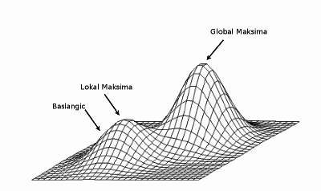
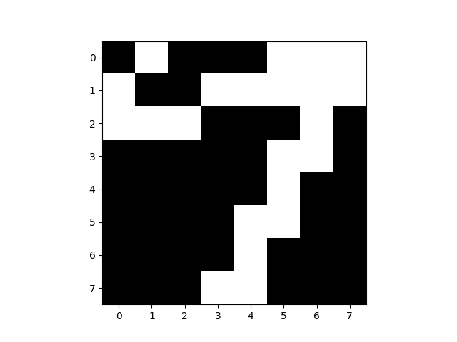
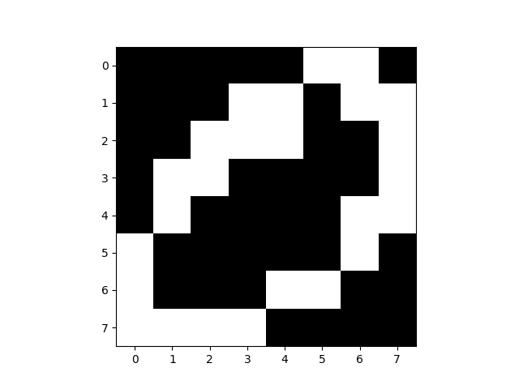

# Çok Değişkenli Bernoulli Karışımı (Mixture of Multivariate Bernoulli)

Eğer verimizi, her biri verinin değişik bir bölümünü, yönünü temsil eden bir
"dağılım grubu'' yani karışım ile modellemek istiyorsak, karışım modellemesi
kullanılabilir. Mesela boy ve ağırlık verisinde bayanlar ve erkekler ayrı
dağılımlara sahip olabilir, bu durumu modele dahil etmek modelin tahmin gücünü
arttırır. Karışım modellerinin güzel bir tarafı kümeleme teknikleri ile başta
"bilinmeyen'' kümelerinin neye benzediğini bulmaları, ayrıca her veri
noktasının bu kümelere olasılıksal olarak aidiyetini, "yakınlığını''
hesaplamamızı mümkün kılmaları.

Formel olarak bir karışım dağılımı $f$ her biri ayrı bir dağılım olan
$f_1,f_2,...,f_K$ ile $K$ öğeden oluşan, bir yeni dağılımdır diyoruz, eğer

$$ f(x) = \sum_{k=1}^{K} \lambda_k f_k(x)  $$

ise, ve $\lambda_k$ karışım oranları, $\lambda_k > 0, \sum_k \lambda_k = 1$
olacak şekilde.

Üstteki model üzerinden zar atılabilecek bir model aynı zamanda (tüm olasılıksal
dağılımlar simule edilebilir tabii, ama üstteki için simulasyon oldukça direk),
$\lambda$ içindeki olasılıklara göre zar atıp bir karışım öğesi seçilir, daha
sonra bu öğenin dağılımına gidilip ona zar attırılır. Bunun olabileceğini
ispatlamak için, $Z$ rasgele değişkeninin $\lambda_k$ ile dağıldığını (ayrıksal
dağılım) düşünelim, yani

$$ Z \sim Mult(\lambda_1,..,\lambda_k) $$

$f_k(x)$ bir diğer açıdan $f(x|Z=k)$'dir, notasyonel olarak böyle. O zaman,

$$ = \sum_{k=1}^{K} f(x|Z=k)\lambda_k $$

$$ = \sum_{k=1}^{K} f(x|Z=k)P(Z=k)  $$

$$ = \sum_{k=1}^{K} f(x,k)  $$

$$ = f(x)  $$

Yani $\lambda$ olasılıklarına göre $f_k$ seçmek üstteki ifadedeki koşullu
olasılık durumuna karşılık geliyor, koşullu olasılık $P(A|B)$ $B$'nin
verildiği / bilindiği durumda $A$'nin olasılığı hatırlayacağımız üzere.

Karışımın içindeki dağılımlar parametrik dağılımlar olduğu zaman onları
nasıl hesapsal olarak kestiririz? Bir dağılımın parametrelerini
kestirebilmek için en iyi yöntemlerden biri maksimum olurluk (maximum
likelihood) yöntemi. Olurluk eldeki verinin belli dağılım parametreleri
üzerinden olasılığı, yani "verinin olasılığı''. Örneklemlerin bağımsız
olduğundan hareketle $x_1,x_2,...,x_N$ verisi için olurluk,

$$ \prod_{i=1}^{N} f(x_i;\theta) $$

Her zaman olduğu gibi çarpımı toplam haline döndürmek için log alırız, 

$$ \ell(\theta) = \sum_{i=1}^{N} \log f(x_i;\theta) $$
Karışımları da dahil edersek,

$$ = \sum_{i=1}^{N} \log \sum_{k=1}^{K} \lambda_k f(x_i;\theta_k) 
\qquad (2)
$$

Şimdi log olurluğun mesela $\theta_j$'ye göre türevini almayı deneyelim,
yani $j$'inci öğenin parametresine göre bir kısmi türev. 

$$ \frac{\partial \ell}{\partial \theta_j}  = 
\sum_{i=1}^{N}  \frac{1}{\sum_{k=1}^{K} \lambda_k f(x_i;\theta_k) } 
\lambda_j
\frac{\partial f(x_i;\theta_j)}{\partial \theta_j}
$$

Bölüm ve bölene $f(x_i;\theta_j)$ ekleyelim, bu sonucu değiştirmez, 

$$ = \sum_{i=1}^{N}  
\frac{\lambda_j f(x_i;\theta_j)}{\sum_{k=1}^{K} \lambda_k f(x_i;\theta_k)}
\frac{1}{f(x_i;\theta_j)}
\frac{\partial f(x_i;\theta_j)}{\partial \theta_j}
$$

$$ = \sum_{i=1}^{N}  
\frac{\lambda_j f(x_i;\theta_j)}{\sum_{k=1}^{K} \lambda_k f(x_i;\theta_k)}
\frac{\partial \log f(x_i;\theta_j)}{\partial \theta_j}
$$

Eğer elimizdeki, karışım olmayan, basit bir parametrik model olsaydı, log
olurluk şuna benzeyecekti, 

$$ \frac{\partial \log f(x_i;\theta_j)}{\partial \theta_j} $$

Bu formül iki üstteki formülün en sağındaki çarpan sadece. Demek ki
"karışım olmak'' log olurluğu bir tür belli ağırlıklara göre ortalanan
(weighted) normal olurluk haline getirdi. Karışımın log olurluğunu
maksimize etmek istiyorsak, bu ağırlığı alınmış olurluğu maksimize etmemiz
gerekli. Bu ağırlığın alındığı kısmı iki üstteki formülden çekip
çıkartırsak, 

$$ w_{ij} = \frac{\lambda_j f(x_i;\theta_j)}{\sum_{k=1}^{K} \lambda_k f(x_i;\theta_k)} $$

Bu ağırlık hesabı $i,j$ için yapılacak. Bu noktaya niçin geldik
hatırlayalım, olurluk üzerinden parametreleri hesaplamak istiyoruz. Fakat
üstteki formülde $w_{ij}$ hesabı için $\theta_j$'in bilinmesi gerekiyor!

Ne yapacağız? Şu $w_{ij}$'ye yakından bakalım. Daha önce belirttiğimiz gibi
$\lambda_j$ $Z$'nin $j$ olma olasılığı, o zaman bölünendeki ifade $X = x_i$
$Z=j$ olmasının ortak (joint) dağılımıdır, yani $P(Z=j,X=x_i)$
diyelim. Koşullu dağılım durumundan başlayarak bu sonuca nasıl
erişildiğini görmüştük. Bölendeki ifade ise $f(x_i)$'dir, bir kısmı
dağılımdır - tüm $k$'ler üzerinden olasılığın bir bölümü toplanarak kısmen
çıkartılmış halidir (marginalized out) - o zaman tüm bölümden ele geçen
sonuç $Z=j$'nin $X=x_i$ verildiği, koşullu olasılığıdır,

$$  
 w_{ij} 
= \frac{\lambda_j f(x_i;\theta_j)}{\sum_{k=1}^{K} \lambda_k f(x_i;\theta_k)} 
= P(Z=j | X=x_i;\theta)
\qquad (1)
$$

O zaman 

$$ \frac{\partial \ell}{\partial \theta_j}  = \sum_{i=1}^{N}
w_{ij} \frac{\partial \log f(x_i;\theta_j)}{\partial \theta_j}
$$

$w_{ij}$ ile, veriye göre, $Z$'nin sonsal (posterior) hesaplamış oluyoruz. Yani
karışımsal modeli hesaplarken bir ağırlıksal olurluk hesabı yapıyoruz, ki bu
ağırlıklar sonsal dağılımlardan gelen değerlere ihtiyaç duyuyor. Ama bu sonsal
dağılımlar da aslında hesaplamaya çalıştığımız parametrelere ihtiyaç duyuyor,
yani bir kördüğüm!

Ama şöyle bir deyiş vardır; kimisine kördüğüm gibi gözüken, bir başkasına
ardışıl yaklaşıksal prosedür gibi gözükür (succcessive approximation procedure)
[hoca şakadan uydurdu bu deyişi, ama teknik doğru]. Demek istiyorum ki eğer
kördüğümde takılı kaldıysak, bir taraf için tahmin yapıp diğer tarafı
hesaplarız, sonra bu hesaplanan değerleri kullanarak ilk tarafı hesaplarız. Bunu
sürekli devam ettiririz.

Ünlü Beklenti-Maksimizasyon (Expectation-Maximization -EM-) prosedürü tam da
bunu yapıyor. Detaylar için [3, sf. 450]. EM özyinesel çalışan bir rutindir,
birkaç adımda sonuca erişir, ve her adımda olurluğu iyileştirmesi ve yerel
maksimuma erişmesi garantidir; Tabii başlangıç noktasına göre bu yerel maksimum
tamamın (global) maksimumu olmayabilir, o zaman EM yerel maksimumda takılıp
kalmış olur (stuck at local maxima), bu sebeple EM'i birkaç değişik rasgele
başlangıç noktasından başlatıp en iyi yerel maksimimumu, yani en iyi olurluğu
veren parametreleri bulmak iyi bir yaklaşımdır.



$w_{ij}$'ye Değişik bir Yönden Erişmek

$\theta_j$ hesabı için formülasyonu biraz değiştirmek lazım. Tüm ortak dağılımı
yazalım, ayrıca $z_{ik}$ değişkenini katalım, $Z$ değişkeni multinom idi, onu
0/1 değerleri içeren vektörel olarak tasarlayalım, yani $z$ veri noktası $i$ ve
bileşen $k$ için, $Z_i$ ise $i$'inci nokta için

$$  P(X_i = x_i, Z_i=k) =  
\prod_{k=1}^{K} \big( f(x_i;\theta_k)P(Z_i=k) \big)^{z_{ik}} $$

Şimdi log alalım, 

$$  = \sum_{k=1}^{K} z_{ij} \ln \big( f(x_i;\theta_k)P(Z_i=k) \big) $$

Tüm veri noktaları için

$$  \ell(\theta) = 
\sum_{i=1}^{N} \sum_{k=1}^{K} z_{ij} \ln \big( f(x_i;\theta_k)P(Z_i=k) \big) $$

$$ 
= \sum_{i=1}^{N} \sum_{k=1}^{K} z_{ik} 
\big( \ln f(x_i;\theta_j) + \ln(\lambda_j) \big)   
$$

Şimdi bu ifadenin beklentisini almamız lazım; bunun sebebi EM'in yakınsaması
(convergence) ile alakalı [3, sf. 450]. Beklentiyi "eksik'' olan yani
bilinmeyen küme ataması üzerinden alıyoruz, $\theta_k$,$P(Z_i=k)$ ve $x_i$ sabit
olarak kalıyor,

$$ 
E[l(\theta)] = \sum_{i=1}^{N} \sum_{k=1}^{K} E[z_{ik}]
\big( \ln f(x_i;\theta_j) + \ln(\lambda_j) \big)   
$$

Hesaplanacak tek şey burada $E[z_{ik}]$. Peki bu beklenti nedir? 

$$ E[z_{ik}] = 1 \cdot P(z_{ik}=1 | x_i) + 0 \cdot P(z_{ik}=1 | x_i)  $$

$$=  P(z_{ik}=1 | x_i)  $$

Bu formül (1)'deki formülün aynısıdır! Yeni notasyon üzerinden tabii; o
zaman 

$$  E[z_{ik}] = w_{ik} $$

Yani

$$ 
E[l(\theta)] = \sum_{i=1}^{N} \sum_{k=1}^{K} w_{ik}
\big( \ln f(x_i;\theta_j) + \ln(\lambda_j) \big) 
\qquad (4)
$$

EM Hesap Adımları

$w_{ij}$ hesabına EM'in "beklenti adımı (expectation step)'' ismi veriliyor,
çünkü görüldüğü gibi beklenti alıyoruz. Bu adım için $\theta$'nin bilindiği farz
edilir, bilinmiyorsa, ki hesap döngüsünün ilk adımında durum böyledir, o zaman
rasgele $\theta$ kullanılır. Döngünün diğer adımlarında döngünün bir önceki
adımındaki değerler kullanılır.

Maksimizasyon adımı için bilinen $w_{ij}$ için $\theta$'nin hesaplanması
gerekir; bu adıma maksimizasyon adı verilmesi de mantıklı, çünkü altta da
görüleceği üzere, kısmi türevler alıp sıfıra eşitleyerek maksimal değerler
hesaplayacağız.

Bu hesap şöyle: Eğer (4) çok değişkenli Bernoulli modeli içinse, ki $x_{id}$
$i$'inci veri noktasının $D$ boyutlu Bernoulli için $d$'inci hücresinin değeri,
$\theta_{jd}$ ise $j$'inci karışım öğesinin $D$ boyut içinden $d$'inci olasılık
değeri olsun, $f$ içinde yerine koyunca ve $f$ üzerinde log etki yapınca çarpım
yine toplam olur,

$$ 
= \sum_{i=1}^{N} \sum_{k=1}^{K} w_{ik}
\bigg[ \ln(\lambda_k)  + 
\sum_{d=1}^{D} \ln \big( \theta_{kd}^{x_{id}} (1-\theta_{kd})^{1-x_{id}} \big)
\bigg]
$$

$$ 
E[l(\theta)]= \sum_{i=1}^{N} \sum_{k=1}^{K} w_{ik}
\bigg[ \ln(\lambda_k)  + 
\sum_{d=1}^{D} x_{id} \ln \theta_{kd} + (1-x_{id}) \ln (1-\theta_{kd})
\bigg]
$$

Şimdi $\theta_{kd}$ hesabı için ona göre türevi alıp sıfıra eşitleriz,

$$ 
\frac{\partial }{\partial \theta_{kd}} E[l(\theta)] = 
w_{ik} \sum_{i=1}^{N} 
x_{id} \frac{\partial }{\partial \theta_{kd}} (\ln \theta_{kd}) + 
\frac{\partial }{\partial \theta_{kd}}\big[ (1-x_{id}) \ln (1-\theta_{kd})\big]
= 0
$$

$$ 
\sum_{i=1}^{N}  w_{ik} 
(
\frac{x_{id}}{\theta_{kd}}  -
\frac{1-x_{id}}{1-\theta_{kd}}
) = 0
$$

$$ 
\sum_{i=1}^{N} \frac{w_{ik}  x_{id}}{\theta_{kd}} =
\sum_{i=1}^{N} \frac{w_{ik}-w_{ik}x_{id}}{1-\theta_{kd}}
$$

$$ 
\frac{1}{\theta_{kd}}\sum_{i=1}^N w_{ik}  x_{id} =
\frac{1}{1-\theta_{kd}}\sum_{i=1}^{N} w_{ik}-w_{ik}x_{id}
$$


$$ 
\frac{1-\theta_{kd}}{\theta_{kd}}\sum_{i=1}^N w_{ik}  x_{id} =
\sum_{i=1}^{N} w_{ik}-w_{ik}x_{id}
$$


$$ 
\frac{1-\theta_{kd}}{\theta_{kd}} =
\frac{\sum_i w_{ik}-\sum_i w_{ik}x_{id}}{\sum_i w_{ik}  x_{id}}
$$


$$ 
\frac{1}{\theta_{kd}} - 1=
\frac{\sum_i w_{ik}}{\sum_i w_{ik}  x_{id}} - 1
$$

$$ 
\hat{\theta}_{kd}=
\frac{\sum_i w_{ik}  x_{id}}{\sum_i w_{ik}} 
$$

Ya da 

$$ 
\hat{\theta}_{k}=
\frac{\sum_i w_{ik}  x_{i}}{\sum_i w_{ik}} 
$$

$\lambda_j$ Hesabı

Şimdi $\lambda_j$'ye göre bir türev almamız, sıfıra eşitlememiz ve çözmemiz
lazım. Tek bir pürüz $\sum_k \lambda_k = 1$ olması şartı, yani tüm ağırlıkların
toplamı 1'e eşit olmalı ve bu şartı bir şekilde denklemlere dahil etmemiz
lazım. Lagrange çarpan tekniği burada kullanılır [1, sf. 395].

$$ \frac{\partial }{\partial \lambda_j} 
\big[ \ell(\theta)  + \alpha (\sum_k \lambda_k - 1) \big]
$$

Ondan önce olurluğun $\lambda_j$'ye göre kısmi türevi lazım, (1) formülüne
dönersek, ve kısmi türevi alırsak,

$$ 
\frac{\partial \ell}{\partial \lambda_j}  = 
\sum_{i=1}^{N}
\frac{f(x_i;\theta_j)}{\sum_{k=1}^{K} \lambda_k f(x_i;\theta_k) }
=
\sum_{i=1}^{N}
\frac{f(x_i;\theta_j)}{f(x_i) }
$$

O zaman iki üstteki türev su hale gelir, sıfıra da eşitlersek,

$$  
\sum_{i=1}^{N} \frac{f(x_i;\theta_j)}{f(x_i) } + \alpha = 0
$$

Biraz düzenleyip iki tarafı da $\lambda_j$ ile çarpalım,

$$
\sum_{i=1}^{N} \frac{f(x_i;\theta_j) \lambda_j}{f(x_i) } = - \alpha \lambda_j 
$$

Eşitliğin sol tarafında toplam içinde yine (1)'de görülen $w_{ij}$'ye eriştik!
Yerine koyalım,

$$
\sum_{i=1}^{N} w_{ij} = - \alpha \lambda_j 
\qquad (3) 
$$

Şimdi tüm öğeler / kümeler üzerinden bir toplam alalım (yani $\sum_k$'yi her iki
tarafa da uygulayalım),

$$
\sum_{k=1}^{K} \sum_{i=1}^{N} w_{ij} = - \alpha  \sum_{k=1}^{K} \lambda_j
$$


$\sum_k \lambda_j = 1$, $\sum_j w_{ij} = 1$ olduğu için,

$$ 
N = - \alpha 
$$

Üstteki formülü (3) içine koyarsak, ve tekrar düzenlersek,

$$ 
\lambda_j = \frac{\sum_{i=1}^{N} w_{ij}}{N} 
$$

```python
import numpy as np

def loginnerprodexp(t,a):
    eps=1e-15
    t[t>0.] = 1
    tmp = np.dot(t,np.exp(a)) + eps
    b=np.log(tmp)
    return b

def logsumexp(a):
    return np.log(np.sum(np.exp(a), axis=0))

def do_EMmixtureBernoulli(Y,K,iter,tol):
    N,D=Y.shape
    OMY=1+(-1*Y) #  "One minus Y", (1-Y)
    tmp=np.random.rand(N,K)
    tmp2=np.sum(tmp,axis=1).reshape((N,1))
    tmp3=np.tile(tmp2,(1,K))
    lR=np.log(np.divide(tmp, tmp3))
    L = []
    for i in range(iter):
        # lPi log Mixture params Kx1
	lPi=np.tile(-1 * np.log(N),(K,1))+logsumexp(lR).T.reshape((K,1))
        const=np.tile(logsumexp(lR).T.reshape((K,1)),(1,D))
        # lP log Bernoulli params KxD
        lP=loginnerprodexp(Y.T,lR).T - const
        # lOMP log(1-P), also KxD
        lOMP=loginnerprodexp(OMY.T,lR).T-const
	
	# *** E-step        
	lR=np.tile(lPi.T,(N,1))+np.dot(Y,lP.T) + np.dot(OMY,lOMP.T) # + const
        Z=logsumexp(lR.T)

        lR=lR-np.tile(Z.T.reshape((N,1)),(1,K))
        L.append(np.sum(Z))
        if (i>1):
            if np.abs(L[i]-L[i-1]) < tol: break
                        
    iters = i
    return lR,lPi,lP,L,iters


def EMmixtureBernoulli(Y,K,iter,tol,attempts):
    Lbest = -np.inf
    eps=1e-15
    # EM'i farkli noktalardan birkac kere (attempts kadar) baslat
    # En iyi sonucun sonuclarini elde tut
    for attempt in range(attempts):
        lRtmp,lPitmp,lPtmp,L,iters = do_EMmixtureBernoulli(Y,K,iter,eps)
        if L[iters]>Lbest:
            lR=lRtmp
            lPi=lPitmp
            lP=lPtmp
            Lbest=L[iters]
            itersbest=iters
    aic = -2*Lbest + 2*lP.shape[0]*lP.shape[1]
    return lR, lPi, lP, Lbest, aic
```

Kodda kullanılan log-toplam-exp numarası için *Ekler*'e bakılabilir.

Örnek olarak ikisel olarak siyah/beyaz olarak kodlanmış üç tane farklı sayının
8x8 boyutundaki imajlarını içeren veriyi kullanabiliriz. Küme sayısını 3 olarak
verdik.

Veriden bazı örnekler görelim,

```python
Y = np.loadtxt('binarydigits.txt')
plt.imshow(Y[4,:].reshape((8,8),order='C'), cmap=plt.cm.gray)
plt.savefig('mixbern_04.png')
plt.imshow(Y[7,:].reshape((8,8),order='C'), cmap=plt.cm.gray)
plt.savefig('mixbern_05.png')
```





```python
import numpy as np
import mixbern

K=3; iter=40; eps=1e-15; attempts=5
lR,lPi,lP,lbest,aic = mixbern.EMmixtureBernoulli(Y,K,iter,eps,attempts)
labels =  np.argmax(lR.T,axis=0)
print labels
print 'log olurluk', lbest, 'aic', aic
```

```
[0 0 0 2 2 1 2 0 2 2 1 1 2 1 0 0 0 1 0 1 1 0 0 1 0 2 0 2 1 1 1 2 0 0 0 0 0
 0 1 2 0 0 0 0 0 1 2 0 0 2 2 2 1 2 1 2 2 0 0 1 2 1 2 1 0 1 0 0 2 2 2 1 0 2
 2 2 0 1 1 2 2 0 1 0 2 0 0 2 2 0 0 2 0 2 1 2 0 1 0 2]
log olurluk -3049.95050527 aic 6483.90101054
```

Elde edilen sonuçlara göre, ve paylaştığımız say resimlerindeki sıraya bakarsak,
mesela ilk üç sayı imajını birbirine benziyor olması lazım.  Yine aynı sırada
gidersek Daha sonra 4. ve 6. sayıların birbirine benziyor olması lazım, ve
8. imajın ilk üç imaja benziyor olması lazım, vs. Resimlere bakınca bunun
hakikaten böyle olduğunu görüyoruz. Demek ki kümeleme başarıyla
gerçekleştirilmiş.

Her veri noktasının üyeliğini için $w_{ij}$'ye baktık (kodda `lR`, üyeliğin
log'u), $i$ hangi kümeye en fazla yakın ise (yüksek olasılık) bunu bir aidiyet
olarak kabul ettik.

Daha ilginç bir hesap şu; her $\theta_k$ (kodda `lP`, log'u alınmış
parametreler) artık bir kümeyi "temsil'' ediyor (multinom bir değişken bu
hatırlarsak) ve bu dağılımların her biri, bir nevi "şablon'' haline dönüşmüş
olmalı; öyle ya, $Z$ ile zar atıyoruz bir dağılım seçiyoruz, sonra o dağılıma
bir daha zar attırıyoruz, ve herhangi bir sayının imajını üretmek istiyorsak
şablon gerçeğine oldukça yakın olmalı! Yani mantıki olarak düşünürsek, eğer
model veriye iyi uymuş ise, her şablon dağılımının 0,7,5 sayılarının şeklini
aşağı yukarı temsil etmesini bekleriz. Kontrol edelim,

```python
dim = (8,8)
templates = np.exp(lP)
digit0 = np.reshape(templates[0,:], dim,order='C')
plt.imshow(digit0, cmap=plt.cm.gray)
plt.savefig('mixbern_01.png')
digit1 = np.reshape(templates[1,:], dim,order='C')
plt.imshow(digit1, cmap=plt.cm.gray)
plt.savefig('mixbern_02.png')
digit2 = np.reshape(templates[2,:], dim, order='C')
plt.imshow(digit2, cmap=plt.cm.gray)
plt.savefig('mixbern_03.png')
```


Hakikaten de şeklen benziyorlar!

Kodlar [mixbern.py](mixbern.py)

Kaynaklar

[1] Zaki, *Data Mining and Analysis: Fundamental Concepts and Algorithms*

[2] Alfons Juan, Enrique Vidal, *Bernoulli mixture models for binary images*

[3] Shalizi, *Advanced Data Analysis from an Elementary Point of View*

[4] Bishop, C., *Pattern Recognition and Machine Learning*


