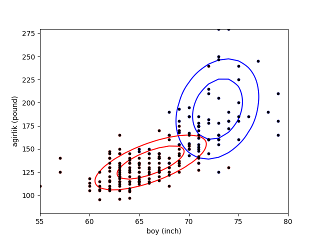

# Gaussian Karışım Modeli (GMM) ile Kümelemek

Gaussian (normal) dağılımı tek tepesi olan (unimodal) bir dağılımdır. Bu
demektir ki eğer birden fazla tepe noktası olan bir veriyi modellemek
istiyorsak, değişik yaklaşımlar kullanmamız gerekir. Birden fazla
Gaussian'ı "karıştırmak (mixing)" bu tür bir yaklaşım. Karıştırmak, karışım
içindeki her Gaussian'dan gelen sonuçları toplamaktır, yani kelimenin tam
anlamıyla her veri noktasını teker teker karışımdaki tüm dağılımlara geçip
sonuçları ve bir ağırlık üzerinden toplamaktır. Çok boyutlu Gaussian'lar
için mesela,

$$ f(x) = \sum_z \pi_k N(x | \mu_k,\Sigma_k) $$

$\pi_k$ karıştırma oranlarıdır (mixing proportions). Bernoulli
karışımlarını anlatan yazıya kıyasla, oradaki $\theta$'yi 0/1 hücreleri
için olasılıklar olarak aldık, şimdi $\theta$ içinde $\mu_k,\Sigma_k$ var,
yani $\theta=(\mu_k,\Sigma_k)$. 

İki Gaussian olsa $\pi_1,\pi_2$ oranları 0.2, 0.8 olabilir ve her
nokta her Gaussian'a verildikten sonra tekabül eden ağırlıkla mesela
sırayla $0.2,0.8$ ile çarpılıp toplanır. 

Maksimizasyon adımı için gereken hesapların türetilmesi [5, sf. 392]'de
bulunabilir.

Örnek olarak alttaki veriye bakalım.

```python
data = np.loadtxt('biometric_data_simple.txt',delimiter=',')

women = data[data[:,0] == 1]
men = data[data[:,0] == 2]

plt.xlim(55,80)
plt.ylim(80,280)
plt.plot (women[:,1],women[:,2], 'b.')
plt.hold(True)
plt.plot (men[:,1],men[:,2], 'r.')
plt.xlabel('boy (inch)')
plt.ylabel('agirlik (pound)')
plt.savefig('mixnorm_1.png')
```


Bu grafik kadınlar ve erkeklerin boy (height) ve kilolarını (weight) içeren
bir veri setinden geliyor, veri setinde erkekler ve kadınlara ait olan
ölçümler önceden işaretlenmiş / etiketlenmiş (labeled), biz de bu
işaretleri kullanarak kadınları kırmızı erkekleri mavi ile grafikledik. Ama
bu işaretler / etiketler verilmiş olsun ya da olmasın, kavramsal olarak
düşünürsek eğer bu veriye bir dağılım uydurmak (fit) istersek bir karışım
kullanılması gerekli, çünkü iki tepe noktasiyle daha rahat temsil
edileceğini düşündüğümüz bir durum var ortada.

```python
# Multivariate gaussian, contours
#
import scipy.stats
import em

data = np.loadtxt('biometric_data_simple.txt',delimiter=',')

women = data[data[:,0] == 1]
men = data[data[:,0] == 2]

plt.xlim(55,80)
plt.ylim(80,280)
plt.plot (women[:,1],women[:,2], 'b.')
plt.hold(True)
plt.plot (men[:,1],men[:,2], 'r.')
plt.xlabel('boy (inch)')
plt.ylabel('agirlik (pound)')
plt.hold(True)

x = np.arange(55., 80., 1)
y = np.arange(80., 280., 1)
X, Y = np.meshgrid(x, y)

Z = np.zeros(X.shape)
nx, ny = X.shape
mu1 = np.array([  72.89350086,  193.21741426])
sigma1 = np.matrix([[    7.84711283,    25.03111826],
                    [   25.03111826,  1339.70289046]])
for i in xrange(nx):
    for j in xrange(ny):
        Z[i,j] = em.norm_pdf(np.array([X[i,j], Y[i,j]]),mu1,sigma1)
        
levels = np.linspace(Z.min(), Z.max(), 4)

plt.contour(X, Y, Z, colors='b', levels=levels)
plt.hold(True)

Z = np.zeros(X.shape)
nx, ny = X.shape
mu2 = np.array([  66.15903841,  135.308125  ])
sigma2 = np.matrix([[  14.28189396,   51.48931033],
                    [  51.48931033,  403.09566456]])
for i in xrange(nx):
    for j in xrange(ny):
        Z[i,j] = em.norm_pdf(np.array([X[i,j], Y[i,j]]),mu2,sigma2)
        
levels = np.linspace(Z.min(), Z.max(), 4)

plt.contour(X, Y, Z, colors='r', levels=levels)
plt.savefig('mixnorm_2.png')
```


Bu karışım içindeki Gaussian'ları üstteki gibi çizebilirdik (gerçi üstteki
aslında ileride yapacağımız net bir hesaptan bir geliyor, ona birazdan
geliyoruz, ama çıplak gözle de bu şekil uydurulabilirdi). Modeli kontrol
edelim, elimizde bir karışım var, nihai olasılık değeri $p(x)$'i nasıl
kullanırız? Belli bir noktanın olasılığını hesaplamak için bu noktayı her
iki Gaussian'a teker teker geçeriz (örnekte iki tane), ve gelen olasılık
sonuçlarını karışım oranları ile çarparak toplarız.  Ağırlıklar sayesinde
karışım entegre edilince hala 1 değeri çıkıyor zaten bir dağılımın uyması
gereken şartlardan biri bu. Ayrıca bir dağılımın diğerinden daha önemli
olduğu ağırlıklar üzerinden modele verilmiş oluyor. 

Etiketler Bilinmiyorsa

Eğer etiketler bize önceden verilmemiş olsaydı, hangi veri noktalarının
kadınlara, hangilerinin erkeklere ait olduğunu bilmeseydik o zaman ne
yapardık? Bu veriyi grafiklerken etiketleri renkleyemezdik tabii ki, şöyle
bir resim çizebilirdik ancak,

```python
import scipy.stats
data = np.loadtxt('biometric_data_simple.txt',delimiter=',')

women = data[data[:,0] == 1]
men = data[data[:,0] == 2]

plt.xlim(55,80)
plt.ylim(80,280)
plt.plot (data[:,1],data[:,2], 'k.')
plt.xlabel('boy (inch)')
plt.ylabel('agirlik (pound)')
plt.savefig('mixnorm_3.png')
```



Fakat yine de şekil olarak iki kümeyi görebiliyoruz.  Acaba öyle bir yapay
öğrenim algoritması olsa da, biz bir karışım olduğunu tahmin edip, sonra o
karışımı veriye uydururken, etiket değerlerini de kendiliğinden tahmin
etse?

Alttaki kod Beklenti-Maksimizasyon üzerinden kümeleme yapar. Konunun teorik
kısmı altta ve [6] yazısında bulunabilir.

Türetmek 

Karışımda birden fazla çok boyutlu Gaussian olacak, bu Gaussian'lardan
$i$'inci Gaussian

$$ 
f_i(x) = f(x;\mu_i,\Sigma_i) = 
\frac{1}{(2\pi)^{d/2} |\Sigma_i|^{1/2}} \exp 
\bigg\{
-\frac{(x-\mu)^T\Sigma_i^{-1}(x-\mu_i)}{2} 
\bigg\} 
\qquad (1)
$$

olur, $x$ çok boyutlu veri noktasıdır, ve kümeleme başlamadan önce
$\mu_i,\Sigma_i$ bilinmez, küme sayısı $k$ bilinir. O zaman karışım modeli

$$ f(x) = \sum_{i=1}^{k} f_i(x)P(C_i) =
\sum_{i=1}^{k} f(x;\mu_i,\Sigma_i)P(C_i)
$$

$P(C_i)$'a karışım oranları deniyor, ki $\sum_i P(C_i) = 1$. Bazı
metinlerde bu $\pi_i$ olarak ta gösterilebiliyor.  Tüm veri için maksimum
olurluk

$$ 
L = \sum_{j=1}^{n} \ln f(x_j) = \sum_{j=1}^{n} \ln \bigg(
\sum_{i=1}^{k} f(x_j;\mu_i,\Sigma_i)P(C_i)
\bigg)
$$

Şimdi herhangi bir parametre $\theta_i$ için (yani $\mu_i$ ya da $\Sigma_i$), 

$$ 
\frac{\partial L}{\partial \theta_i} = 
\frac{\partial }{\partial \theta_i} 
\bigg(\sum_{j=1}^{n} \ln f(x_j) \bigg)
$$

$$ 
= \sum_{j=1}^{n} \big( \frac{1}{f(x_j)} \cdot
\frac{\partial f(x_j)}{\partial \theta_i} \big)
$$

$$ 
\sum_{j=1}^{n} \bigg(
\frac{1}{f(x_j)} \sum_{a=1}^{k} \frac{\partial }{\partial \theta_i}
\big( f(x_j;\sigma_a,\Sigma_a)P(C_a) \big)
\bigg)
$$

$$ 
\sum_{j=1}^{n} \bigg(
\frac{1}{f(x_j)} \cdot \frac{\partial }{\partial \theta_i}
\big( f(x_j;\sigma_i,\Sigma_i)P(C_i) \big)
\bigg)
$$

En son adım mümkün çünkü $\theta_i$ parametresi $i$'inci kümeye
(Gaussian'a) ait, ve diğer kümelerin bakış açısına göre (onlara göre kısmi
türev alınınca) bu parametre sabit sayılıyor. 

Şimdi $|\Sigma_i| = \frac{1}{|\Sigma^{-1}|}$ eşitliğinden hareketle
(1)'deki çok boyutlu Gaussian'ı şöyle yazabiliriz, 

$$ 
f(x_j;\sigma_i,\Sigma_i) = (2\pi)^{-d/2} |\Sigma^{-1}|^{1/2} 
\exp \big[ g(\mu_i,\Sigma_i) \big]
$$ 
ki

$$ g(\mu_i,\Sigma_i) = -\frac{1}{2}(x_j-\mu_i)^T\Sigma_i^{-1}(x_j-\mu_i) $$

Yani log-olurluk fonksiyonunun türevi şu şekilde yazılabilir,

$$ 
\frac{\partial L}{\partial \theta_i} =
\sum_{j=1}^{n} \bigg(
\frac{1}{f(x_j)} \frac{\partial }{\partial \theta_i} \big(
(2\pi)^{-d/2} |\Sigma_i^{-1}|^{1/2} \exp\big[ 
g(\mu_i,\Sigma_i) \big] P(C_i)
\big) \bigg)
\qquad (3)
$$

$\mu_i$ için maksimum-olurluk kestirme hesabı yapmak için log olurluğun
$\theta_i=\mu_i$'a göre türevini almamız gerekiyor. Üstteki formülde
gördüğümüz gibi $\mu_i$'a bağlı olan tek terim $\exp\big[ g(\mu_i,\Sigma_i)
\big]$. Şimdi 

$$ 
\frac{\partial }{\partial \theta_i} \exp \big[ g(\mu_i,\Sigma_i) \big] =
\exp \big[ g(\mu_i,\Sigma_i) \big] \cdot 
\frac{\partial }{\partial \theta_i} g(\mu_i,\Sigma_i)
\qquad (2)
$$

ve
$$ \frac{\partial }{\partial \mu_i}g(\mu_i,\Sigma_i) = 
\Sigma_i^{-1}(x_j-\mu_i)
$$

formüllerini kullanarak log olurluğun $\mu_i$'ya göre türevi

$$ \frac{\partial L}{\partial \mu_i} = 
\sum_{j=1}^{n} \bigg(
\frac{1}{f(x_j)} 
(2\pi)^{-d/2} |\Sigma_i^{-1}|^{1/2} \exp\big[ 
g(\mu_i,\Sigma_i) \big] P(C_i) \Sigma^{-1} 
(x_j-\mu_i)
\bigg)
$$

$$ 
= \sum_{j=1}^{n} \bigg(
\frac{f(x_j;\mu_i,\Sigma_i)P(C_i)}{f(x_j)} \cdot 
\Sigma_i^{-1} (x_j-\mu_i)
\bigg)
$$

$$ =
\sum_{j=1}^{n} w_{ij} \Sigma_i^{-1}(x_j-\mu_i)
$$

Üstteki forma erişmek için (2) ve alttaki formülü kullandık.

$$ P(C_i|x_j) = \frac{P(x_j|C_i)P(C_i)}{\sum_{a=1}^{k}P(x_j|C_a)P(C_a)}$$

ki bunun anlamı

$$ w_{ij} = P(C_i|x_j) = \frac{f(x_j;\mu_i,\Sigma_i)P(C_i)}{f(x_j)}$$

Üstteki kısmi türevi sıfıra eşitleyip çözer ve her iki tarafı $\Sigma_i$
ile çarparsak, 

$$ \sum_{j=1}^{n} w_{ij} (x_j-\mu_i) = 0 $$

elde ederiz, bu demektir ki 

$$ \sum_{j=1}^{n} w_{ij}x_j = \mu_i\sum_{j=1} w_{ij}  $$

o zaman 

$$ \mu_i = \frac{\sum_{j=1}^{n} w_{ij}x_j}{\sum_{j=1}^{n} w_{ij}}$$

Kovaryans Matrisi $\Sigma_i$'i Hesaplamak

$\Sigma_i$ hesabı için (3) kısmi türevinin $|\Sigma_i^{-1}|^{1/2}
\exp(g(\mu_i,\Sigma_i))$ üzerindeki çarpım 
kuralı (product rule) kullanılarak $\Sigma_i^{-1}$'ye göre alınması gerekiyor.

Her kare matris $A$ için $\frac{\partial |A|}{\partial A} = |A| \cdot
(A^{-1})^T$ olduğundan hareketle, $|\Sigma_i^{-1}|^{1/2}$'nin
$\Sigma_i^{-1}$'ya göre türevi  

$$ 
\frac{\partial |\Sigma_i^{-1}|^{1/2}}{\partial \Sigma_i^{-1}} = 
\frac{1}{2} \cdot |\Sigma_i^{-1}|^{-1/2} \cdot |\Sigma_i^{-1}| \cdot \Sigma_i  = 
\frac{1}{2} |\Sigma_i^{-1}|^{1/2} \cdot \Sigma_i
$$

Şimdi $A \in \mathbb{R}^{d \times d}$ ve vektörler $a,b \in \mathbb{R}^d$
için $\frac{\partial }{\partial A}a^TAb = ab^T$ olmasından hareketle
(3)'teki $\exp [g(\mu_i,\Sigma_i)]$'in $\Sigma_i^{-1}$ gore türevi,

$$ 
\frac{\partial }{\partial \Sigma^{-1}} \exp\big[ g(\mu_i,\Sigma_i)\big] = 
-\frac{1}{2} \exp \big[  g(\mu_i,\Sigma_i) (x_j-\mu_i)(x_j-\mu_i)^T \big]
$$

Üstteki ve iki üstteki formül üzerinde türev çarpım kuralını kullanırsak, 

$$ 
\frac{\partial }{\partial \Sigma_i^{-1}} |\Sigma_i^{-1}|^{1/2} 
\exp\big[ g(\mu_i,\Sigma_i) \big] =
$$

$$ 
= \frac{1}{2} |\Sigma_i^{-1}|^{1/2}  \Sigma_i \exp\big[ g(\mu_i,\Sigma_i) \big]-
\frac{1}{2} |\Sigma_i^{-1}|^{1/2} \exp\big[ g(\mu_i,\Sigma_i) \big]
(x_j-\mu_i)(x_j-\mu_i)^T
$$

$$ 
= \frac{1}{2} \cdot  |\Sigma_i^{-1}|^{1/2} \cdot 
\exp\big[ g(\mu_i,\Sigma_i) \big] \big( 
\Sigma_i - (x_j-\mu_i)(x_j-\mu_i)^T
\big)
$$

Üstteki son formülü (3)'e sokarsak, $\Sigma_i^{-1}$'e göre log olurluğun
türevi

$$ 
\frac{\partial L}{\partial \Sigma_i^{-1}} =
\frac{1}{2} \sum_{j=1}^{n} \frac
{(2\pi)^{-d/2} |\Sigma_i^{-1}|^{1/2}\exp\big[ g(\mu_i,\Sigma_i) P(C_i) }{f(x_j)}
\big( \Sigma_i - (x_j-\mu_i)(x_j-\mu_i)^T \big)
$$


$$ =
\frac{1}{2} \sum_{j=1}^{n} \frac{f(x_j;\mu_i,\Sigma_i) P(C_i)}{f(x_j)} \cdot
\big( \Sigma_i - (x_j-\mu_i)(x_j-\mu_i)^T \big)
$$

$$ 
= \frac{1}{2} \sum_{j=1}^{n} w_{ij} 
\big( \Sigma_i - (x_j-\mu_i)(x_j-\mu_i)^T \big)
$$

Türevi sıfıra eşitlersek,

$$ \sum_{j=1}^{n} w_{ij} \big( \Sigma_i - (x_j-\mu_i)(x_j-\mu_i)^T \big) = 0 $$

olur, ve devam edersek alttaki sonucu elde ederiz,

$$ 
\Sigma_i = \frac{\sum_{j=1}^{n} w_{ij} (x_j-\mu_i)(x_j-\mu_i)^T}
{\sum_{j=1}^{n} w_{ij}}
$$

Karışım Ağırlıkları $P(C_i)$'i Hesaplamak

Bu hesabı yapmak için (3) türevinin $P(C_i)$'a göre alınması lazım fakat 
$\sum_{a=1}^{k}P(C_a)=1$ şartını zorlamak için Lagrange çarpanları
tekniğini kullanmamız gerekiyor. Yani türevin alttaki gibi alınması lazım,

$$ 
\frac{\partial }{\partial P(C_i)} \bigg(
\ln L + \alpha \big( \sum_{a=1}^{k} P(C_a)-1 \big)
\bigg)
$$

Log olurluğun $P(C_i)$'a göre kısmi türevi alınınca,

$$ 
\frac{\partial L}{\partial P(C_i)} = 
\sum_{j=1}^{n} \frac{f(x_j;\mu_i,\Sigma_i)}{f(x_j)}
$$

O zaman iki üstteki türevin tamamı şu hale gelir,

$$ 
\bigg( \sum_{j=1}^{n} \frac{f(x_j;\mu_i,\Sigma_i)}{f(x_j)} \bigg) + \alpha
$$

Türevi sıfıra eşitlersek ve her iki tarafı $P(C_i)$ ile çarparsak, 

$$ 
\sum_{j=1}^{n} \frac{f(x_j;\mu_i,\Sigma_i) P(C_i)}{f(x_j)} = -\alpha P(C_i)
$$

$$ 
\sum_{j=1}^{n} w_{ij} = -\alpha P(C_i)
\qquad (4)
$$

Üstteki toplamı tüm kümeler üzerinden alırsak

$$ 
\sum_{i=1}^{k} \sum_{j=1}^{n} w_{ij} = -\alpha \sum_{i=1}^{k} P(C_i)
$$

ya da $n = -\alpha$. 


Son adım $\sum_{i=1}^{k}w_{ij}=1$ sayesinde mümkün oldu. $n = -\alpha$'yi
(4) içine sokunca $P(C_i)$'in maksimum olurluk hesabını elde ediyoruz, 

$$ P(C_i) = \frac{\sum_{j=1}^{n}w_{ij}}{n}$$


```python
from scipy.stats import multivariate_normal as mvn
import pandas as pd
import numpy as np
import matplotlib.pyplot as plt
import numpy.linalg as linalg
import math, random, copy, sys
import scipy.stats

class Cov_problem(Exception): pass

def norm_pdf(b,mean,cov):
   k = b.shape[0]
   part1 = np.exp(-0.5*k*np.log(2*np.pi))
   part2 = np.power(np.linalg.det(cov),-0.5)
   dev = b-mean
   part3 = np.exp(-0.5*np.dot(np.dot(dev.transpose(),np.linalg.inv(cov)),dev))
   dmvnorm = part1*part2*part3
   return dmvnorm

def gm_log_likelihood(X, center_list, cov_list, p_k):
    """Finds the likelihood for a set of samples belongin to a Gaussian mixture
    model.
    
    Return log likelighood
    """
    samples = X.shape[0]
    K =  len(center_list)
    log_p_Xn = np.zeros(samples)
    for k in range(K):
        p = logmulnormpdf(X, center_list[k], cov_list[k]) + np.log(p_k[k])
        if k == 0:
            log_p_Xn = p
        else:
            pmax = np.max(np.concatenate((np.c_[log_p_Xn], np.c_[p]), axis=1), axis=1)
            log_p_Xn = pmax + np.log( np.exp( log_p_Xn - pmax) + np.exp( p-pmax))
    logL = np.sum(log_p_Xn)
    return logL

def gm_assign_to_cluster(X, center_list, cov_list, p_k):
    samples = X.shape[0]
    K = len(center_list)
    log_p_Xn_mat = np.zeros((samples, K))
    for k in range(K):
        log_p_Xn_mat[:,k] = logmulnormpdf(X, center_list[k], cov_list[k]) + np.log(p_k[k])
    pmax = np.max(log_p_Xn_mat, axis=1)
    log_p_Xn = pmax + np.log( np.sum( np.exp(log_p_Xn_mat.T - pmax), axis=0).T)
    logL = np.sum(log_p_Xn)
    
    log_p_nk = np.zeros((samples, K))
    for k in range(K):
        log_p_nk[:,k] = log_p_Xn_mat[:,k] - log_p_Xn
    
    maxP_k = np.c_[np.max(log_p_nk, axis=1)] == log_p_nk
    maxP_k = maxP_k * (np.array(range(K))+1)
    return np.sum(maxP_k, axis=1) - 1

def logmulnormpdf(X, MU, SIGMA):
    if MU.ndim != 1:
        raise ValueError, "MU must be a 1 dimensional array"
    mu = MU
    x = X.T
    if x.ndim == 1:
        x = np.atleast_2d(x).T
    sigma = np.atleast_2d(SIGMA) # So we also can use it for 1-d distributions
    N = len(MU)
    ex1 = np.dot(linalg.inv(sigma), (x.T-mu).T)
    ex = -0.5 * (x.T-mu).T * ex1
    if ex.ndim == 2: ex = np.sum(ex, axis = 0)
    K = -(N/2)*np.log(2*np.pi) - 0.5*np.log(np.linalg.det(SIGMA))
    return ex + K

def gmm_init(X, K, verbose = False,
                    cluster_init = 'sample', \
                    cluster_init_prop = {}, \
                    max_init_iter = 5, \
                    cov_init = 'var'):
    samples, dim = np.shape(X)
    if cluster_init == 'sample':
        if verbose: print "Using sample GMM initalization."
        center_list = []
        for i in range(K):
            center_list.append(X[np.random.randint(samples), :])
    elif cluster_init == 'box':
        if verbose: print "Using box GMM initalization."
        center_list = []
        X_max = np.max(X, axis=0)
        X_min = np.min(X, axis=0)
        for i in range(K):
            init_point = ((X_max-X_min)*np.random.rand(1,dim)) + X_min
            center_list.append(init_point.flatten())            
    elif cluster_init == 'kmeans':
        if verbose: print "Using K-means GMM initalization."
        # Normalize data (K-means is isotropic)
        normalizerX = preproc.Normalizer(X)
        nX = normalizerX.transform(X)
        center_list = []
        best_icv = np.inf
        for i in range(max_init_iter):
            m, kcc = kmeans.kmeans(nX, K, iter=100, **cluster_init_prop)
            icv = kmeans.find_intra_cluster_variance(X, m, kcc)
            if best_icv > icv:
                membership = m
                cc = kcc
                best_icv = icv
        cc = normalizerX.invtransform(cc)
        for i in range(cc.shape[0]):
            center_list.append(cc[i,:])
        print cc
    else:
        raise "Unknown initialization of EM of MoG centers."

    # Initialize co-variance matrices
    cov_list = []
    if cov_init=='iso':
        for i in range(K):
            cov_list.append(np.diag(np.ones(dim)/1e10))
            #cov_list.append(np.diag(np.ones(dim)))
    elif cov_init=='var':
        for i in range(K):
            cov_list.append(np.diag(np.var(X, axis=0)/1e10))
    else:
        raise ValueError('Unknown option used for cov_init')

    p_k = np.ones(K) / K # Uniform prior on P(k)
    return (center_list, cov_list, p_k)


def em_gm(X, K, max_iter = 50, verbose = False, \
                iter_call = None,\
                delta_stop = 1e-6,\
                init_kw = {}, \
                max_tries = 10,\
                diag_add = 1e-3):

    samples, dim = np.shape(X)
    clusters_found = False
    while clusters_found==False and max_tries>0:
        max_tries -= 1
        # Initialized clusters
        center_list, cov_list, p_k = gmm_init(X, K, **init_kw)
        # Now perform the EM-steps:
        try:
            center_list, cov_list, p_k, logL = \
                gmm_em_continue(X, center_list, cov_list, p_k,
                        max_iter=max_iter, verbose=verbose,
                        iter_call=iter_call,
                        delta_stop=delta_stop,
                        diag_add=diag_add)
            clusters_found = True
        except Cov_problem:
            if verbose:
                print "Problems with the co-variance matrix, tries left ", max_tries

    if clusters_found:
        return center_list, cov_list, p_k, logL
    else:
        raise Cov_problem()


def gmm_em_continue(X, center_list, cov_list, p_k,
                    max_iter = 50, verbose = False, \
                    iter_call = None,\
                    delta_stop = 1e-6,\
                    diag_add = 1e-3,\
                    delta_stop_count_end=10):
    """
    """
    delta_stop_count = 0
    samples, dim = np.shape(X)
    K = len(center_list) # We should do some input checking
    if diag_add!=0:
        feature_var = np.var(X, axis=0)
        diag_add_vec = diag_add * feature_var
    old_logL = np.NaN
    logL = np.NaN
    for i in xrange(max_iter):
        try:
            center_list, cov_list, p_k, logL = __em_gm_step(X, center_list,\
                cov_list, p_k, K, diag_add_vec)
        except np.linalg.linalg.LinAlgError: # Singular cov matrix
            raise Cov_problem()
        if iter_call is not None:
            iter_call(center_list, cov_list, p_k, i)
        # Check if we have problems with cluster sizes
        for i2 in range(len(center_list)):
            if np.any(np.isnan(cov_list[i2])):
                print "problem"
                raise Cov_problem()

        if old_logL != np.NaN:
            if verbose:
                print "iteration=", i, " delta log likelihood=", \
                    old_logL - logL
            if np.abs(logL - old_logL) < delta_stop: #* samples:
                delta_stop_count += 1
                if verbose: print "gmm_em_continue: delta_stop_count =", delta_stop_count
            else:
                delta_stop_count = 0
            if delta_stop_count>=delta_stop_count_end:
                break # Sufficient precision reached
        old_logL = logL
    try:
        gm_log_likelihood(X, center_list, cov_list, p_k)
    except np.linalg.linalg.LinAlgError: # Singular cov matrix
        raise Cov_problem()
    return center_list, cov_list, p_k, logL

def __em_gm_step(X, center_list, cov_list, p_k, K, diag_add_vec):
    samples = X.shape[0]
    # New way of calculating the log likelihood:
    log_p_Xn_mat = np.zeros((samples, K))
    for k in range(K):
        log_p_Xn_mat[:,k] = logmulnormpdf(X, center_list[k], cov_list[k]) + np.log(p_k[k])
    pmax = np.max(log_p_Xn_mat, axis=1)
    log_p_Xn = pmax + np.log( np.sum( np.exp(log_p_Xn_mat.T - pmax), axis=0).T) # Maybe move this down
    logL = np.sum(log_p_Xn)

    log_p_nk = np.zeros((samples, K))
    for k in range(K):
        log_p_nk[:,k] = log_p_Xn_mat[:,k] - log_p_Xn

    p_Xn = np.e**log_p_Xn
    p_nk = np.e**log_p_nk
       
    # M-step:    
    for k in range(K):
        ck = np.sum(p_nk[:,k] * X.T, axis = 1) / np.sum(p_nk[:,k])
        center_list[k] = ck
        cov_list[k] = np.dot(p_nk[:,k] * ((X - ck).T), (X - ck)) / sum(p_nk[:,k])
        p_k[k] = np.sum(p_nk[:,k]) / samples

    return (center_list, cov_list, p_k, logL)
```

```python
data = np.loadtxt('biometric_data_simple.txt',delimiter=',')
data = data[:,1:3]
import em
mc = [0.4, 0.4, 0.2] 
centroids = [ np.array([0,0]), np.array([3,3]), np.array([0,4]) ]
ccov = [ np.array([[1,0.4],[0.4,1]]), np.diag((1,2)), np.diag((0.4,0.1)) ]
cen_lst, cov_lst, p_k, logL = em.em_gm(data, K = 2, max_iter = 400)
for cen in cen_lst: print cen
for cov in cov_lst: print cov
```

```
[  66.22733783  135.69250285]
[  72.92994695  194.55997484]
[[  14.62653617   53.38371315]
 [  53.38371315  414.95573112]]
[[    7.77047547    24.7439079 ]
 [   24.7439079   1369.68034031]]
```
Kod `biometric_data_simple.txt` verisi üzerinde işletildiğinde rapor
edilen $\mu,\Sigma$ değerlerini grafikleyince başta paylaştığımız grafik
görüntüleri çıkacaktır, yani kümeleme başarıyla işletilmiştir.

En İyi K Nasıl Bulunur

Bu sayıyı keşfetmek artık kolay; K-Means ile atılan bir sürü taklaya, ki
çoğu gayrı matematiksel, sezgisel, uydurulmuş (heuristic) yöntemlerdi,
artık gerek yok. Mesela 10 ila 30 arasındaki tüm küme sayılarını deneriz,
ve en iyi AIC vereni seçeriz.

```python
import pandas as pd
ff = '../../app_math/kmeans/synthetic.txt'
df = pd.read_csv(ff,comment='#',names=['a','b'],sep="   ")
```

```python
from sklearn.mixture import GMM
for i in range(10,30):
   g = GMM(n_components=i).fit(df)
   print i, 'clusters', g.aic(df)
```

```
10 clusters 124325.897319
11 clusters 124132.382945
12 clusters 123931.508911
13 clusters 123865.913489
14 clusters 123563.524338
15 clusters 123867.79925
16 clusters 123176.509776
17 clusters 123239.708813
18 clusters 123019.873822
19 clusters 122728.247239
20 clusters 122256.554363
21 clusters 122259.954752
22 clusters 122271.805211
23 clusters 122265.886637
24 clusters 122265.344662
25 clusters 122277.924153
26 clusters 122184.54412
27 clusters 122356.971927
28 clusters 122195.916167
29 clusters 122203.347265
```

Görüldüğü gibi AIC azalıyor, azalıyor, ve K=20'de azıcık artıyor, sonra
25'e kadar artmaya devam ediyor, sonra tekrar düşmeye başlıyor ama bizi
ilgilendiren uzun süreli düşüşten sonraki bu ilk çıkış. O nokta optimal K
değerini verecektir, ki bu sayı 20.

```python
from sklearn.mixture import GMM
g = GMM(n_components=20).fit(df)
```

```python
plt.scatter(df.a,df.b)
plt.hold(True)
plt.plot(g.means_[:,0], g.means_[:,1],'ro')
plt.savefig('stat_gmm_03.png')
```


Gaussian Karışımları ile Deri Rengi Saptamak

Bir projemizde dijital resimlerdeki deri rengi içeren kısımları çıkartmamız
gerekiyordu; çünkü fotoğrafın diğer renkleri ile ilgileniyorduk (resimdeki
kişinin üzerindeki kıyafetin renkleri) ve bu sebeple deri renklerini ve o
bölgeleri resimde saptamak gerekti. Bizim de önceden aklımızda kalan bir tembih
vardı, Columbia Üniversitesi'nde yapay öğrenim dersi veren Tony Jebara derste
paylaşmıştı bir kere (bu tür gayrı resmi, lakırdı seviyesinde tiyolar bazen çok
faydalı olur), deri rengi bulmak için bir projesinde tüm deri renklerini R,G,B
olarak grafiğe basmışlar, ve beyaz olsun, zenci olsun, ve sonuç grafikte deri
renklerinin çok ince bir bölgede yanyana durduğunu görmüşler. İlginç değil mi?

Buradan şu sonuç çıkıyor ki diğer renklerin arasında deri renklerine
odaklanan, onları "tanıyan'' bir yapay öğrenim algoritmasının oldukça
şansı vardır. Ama ondan önce veriye bakıp grafiksel olarak ne olduğunu
görelim. 

```python
import pandas as pd, zipfile
with zipfile.ZipFile('skin.zip', 'r') as z:
    d =  pd.read_csv(z.open('skin.csv'),sep=',')
print d[:3]
```

```
   Unnamed: 0   rgbhex   skin         r         g         b         h  \
0           0  #200e08  False  0.125490  0.054902  0.031373  0.041667   
1           1  #6d6565  False  0.427451  0.396078  0.396078  0.000000   
2           2  #1f2c4d  False  0.121569  0.172549  0.301961  0.619565   

          s         v  
0  0.750000  0.125490  
1  0.073394  0.427451  
2  0.597403  0.301961  
```

Burada önemli olan R,G,B ve H,S,V kolonları. Bu iki grup değişik renk
kodlama yöntemini temsil ediyorlar. Grafikleyelim,

```python
nd = d[d['skin'] == False]
sd = d[d['skin'] == True]
plt.plot(nd['r'],nd['g'],'.')
plt.hold(True)
plt.plot(sd['r'],sd['g'],'rx')
plt.savefig('stat_gmm_01.png')
```


Ya da H,S üzerinden

```python
nd = d[d['skin'] == False]
sd = d[d['skin'] == True]
plt.plot(nd['h'],nd['s'],'.')
plt.hold(True)
plt.plot(sd['h'],sd['s'],'rx')
plt.savefig('stat_gmm_02.png')
```


Demek ki Jebara haklıymış. Veriye bakınca bir kabaca / sezgisel (intuitive)
bazı çıkarımlar yapmak mümkün. Mesela her iki grafikte de deri renklerini
belirten bölgenin grafiği sanki 3 boyutlu bir Gaussian'ın üstten görünen /
kontur (contour) hali. Bunu bilmek bir avantaj, bu avantajı kullanmak
lazım. Modelimiz gerçek dünya verisine ne kadar yakınsa, yapay öğrenim
şansı o kadar fazlalaşacaktır. Eğer o bölgeye bir Gaussian uydurursak (fit)
tanıma şansımız artacaktır.

O zaman deri rengi tanıma şu şekilde yapılabilir. Scikit Learn
kütüphanesinin Gaussian Karışımları (GMM) paketini kullanabiliriz. Tek
problem bu karışımlar olasılık fonksiyonunu öğreniyorlar, sınıflama
(classification) yapmıyorlar. Önemli değil, şöyle bir ek kod ile bunu
halledebiliriz; iki tane GMM yaratırız, bir tanesi deri renk bölgeleri
için, diğeri diğer bölgeler için. Eğitim sırasında her iki GMM'i kendi
bölgeleri üzerinde eğitiriz. Sonra, test zamanında, her yeni (bilinmeyen)
veri noktasını her iki GMM'e veririz, hangisinden daha yüksek olasılık
değeri geliyorsa, etiket değeri olarak o GMM'in değerini alırız.

GMM'leri, ve onların içindeki Gaussian'ların kovaryanslarını kullanmak
faydalı, kovaryans bildiğimiz gibi bir Gaussian'ın hangi yönde daha fazla
ağırlığının olacağını belirler, eğer kovaryans hesabı yapılmazsa, yani
kovaryans matrisinin sadece çaprazında değerler varsa, mesela üç boyutta
Gaussian'ın konturu bir çember olarak gözükür [1, sf 90]. Tabii her yönde
aynı ağırlıkta olan bir Gaussian her türlü veriyi temsil edemez, en esneği
(ki grafiğe bakınca bu gerekliliği görüyoruz) tam kovaryans
kullanmaktır. Scikit Learn ile bu seçim GMM için `full` ile yapılır,
sadece çaprazı kullan anlamına gelen `diag` da olabilirdi.

```python
import zipfile
from sklearn.cross_validation import train_test_split
from sklearn.metrics import roc_curve, auc
from sklearn.metrics import roc_auc_score
from sklearn.mixture import GMM
import pandas as pd

class GMMClassifier():
   def __init__(self,k,var):
       self.clfs = [GMM(n_components=k,
                    covariance_type=var,thresh=0.1, 
                    min_covar=0.0001,n_iter=100) for i in range(2)]

   def fit(self,X,y):
       self.clfs[0].fit(X[y==0])
       self.clfs[1].fit(X[y==1])

   def predict(self,X):
       res0 = self.clfs[0].score(X)
       res1 = self.clfs[1].score(X)
       res = (res1 > res0)
       return res.astype(float)

if __name__ == "__main__": 
 
   with zipfile.ZipFile('skin.zip', 'r') as z:
      df =  pd.read_csv(z.open('skin.csv'),sep=',')
   y = (df['skin'] == True).astype(float)
   X = df[['h','s','v','r','g']]
   
   res = []   
   for i in range(5):
      clf = GMMClassifier(k=10,var='full')
      x_train, x_test, y_train, y_test = train_test_split(X, y, test_size=2000)
      clf.fit(x_train,y_train)
      preds = clf.predict(x_test)

      fpr, tpr, thresholds = roc_curve(y_test, preds)
      roc_auc = auc(fpr, tpr)
      res.append(roc_auc)

   print 'deneyler'
   print res
   print 'nihai ortalama', np.array(res).mean()
```

```
deneyler 
[0.99075081610446136, 0.98417442945172173, 0.98641291695170819,
 0.98779826464208242, 0.99239130434782608] 
nihai ortalama 0.9883055463
```

Başarı oranı yüzde 98.8! Bu problem üzerinde pek çok diğer yöntem denedik,
mesela KNN sınıflayıcı, Lojistik Regresyon, vs. gibi, bu yöntem tüm
diğerlerini geçti. 

İlginç bir yan bir soru, "hangi kolonların kullanılacağı''. Bu bağlamda
projede arkadaşlardan "ama HSV değerleri RGB değerlerinden
türetilebiliyor, ya birini ya ötekini kullanmak yeterli olmaz mı?'' yorumu
yapanlar oldu. Evet, bu verinin diğerinden "türetilmiş'' olduğu doğru, ve
beklenir ki ideal bir dünyada mükemmel bir yapay öğrenim algoritmasının bu
tür bir yardıma ihtiyacı olmaz, algoritma o kadar iyidir ki ona sanki aynı
veriyi tekrar vermiş gibi oluruz, en iyi ihtimalle ek külfet
yaratırız. Fakat pratikte bu ek veri algoritmaya ek bazı sinyaller
verebilir. Mesela eğer müşterilerin kilosu üzerinden bir öğrenim yapıyor
olsaydık, 80 kilodan daha az ya da daha fazla olmayı (problem alanına göre)
ayrı bir kolon olarak kodlamak avantaj getirebilirdi. Tabii ki kilo verisi
sayısal değer olarak azıyla fazlasıyla oradadır, fakat önem verdiğimiz
noktaları türetilmiş veri olarak öğrenim algoritmasına vermenin zararı
yoktur. Üstteki örnekte GB değerlerinin HSV ile beraber kullanılmasının
başarı şansını biraz daha arttırdığını görebiliriz.

Kaynaklar

[1] Alpaydin, E., *Introduction to Machine Learning*

[2] Jebara, T., *Columbia Machine Learning Course*

[3] Aaron A. D'Souza, {\em Using EM To Estimate A Probability Density With A
Mixture Of Gaussians}, [http://www-clmc.usc.edu/~adsouza/notes/mix_gauss.pdf](http://www-clmc.usc.edu/~adsouza/notes/mix_gauss.pdf)

[4] *Expectation-Maximization (Python Recipe)*, [http://code.activestate.com/recipes/577735-expectation-maximization](http://code.activestate.com/recipes/577735-expectation-maximization)

[5] Zaki, *Data Mining and Analysis: Fundamental Concepts and Algorithms*

[6] Bayramlı, Istatistik, *Çok Değişkenli Bernoulli Karışımı*


