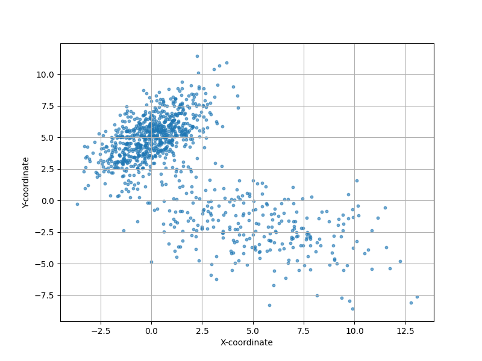

# Artımsal (Incremental) GMM

Gaussian Karışım Modelleri [1]'de işlendi. O yazıda gösterilen her
biri $d$ boyutlu olabilecek $G$ tane Gaussian'dan oluşan bir karışım
ile bir veriyi temsil edebilmekten bahsediyordu. Bu tür bir modelde
bilinmeyenler $G$ tane Gaussian'ın parametreleriydi, yani her Gaussian
için D x 1 boyutunda bir $\mu$, D x D boyutunda bir $\Sigma$, ve tüm
karışımın seviyelerini gösteren D x 1 boyutunda bir $\pi$. Eğer [2]
notasyonu ile gösterirsek, karışım olasılık dağılım fonksiyonu,

$$
p(x) = \sum _{g=1}^{G} \pi_g N(x | \mu_g, \Sigma_g)
$$

ki $x \in R^{D}$.

Dikkat edersek [1] yazısı ardından veriyi toptan (batch) işleyen bir
yaklaşım gösterdi, bu yaklaşım, ki Beklenti-Maksimizasyon
(Expectation-Maximization / EM) adıyla bilinir, döngüsünün her
adımında verinin tamamını işleyen bir teknikti.

$$
p^{(m+1)}(C_g | \mathbf{x}_i) \approx p^{(m)}(C_g | \mathbf{x}_i)
$$

### 1. Update for Mixing Weights $\pi_g$

$$
\pi_g^{(m)} = \frac{1}{m} \sum_{i=1}^{m} p^{(m)}(C_g | \mathbf{x}_i)
$$


$$
\pi_g^{(m+1)} = \frac{1}{m+1} \sum_{i=1}^{m+1} p^{(m+1)}(C_g | \mathbf{x}_i)
$$


$$
\pi_g^{(m+1)} \approx \frac{1}{m+1} \left( \sum_{i=1}^{m} p^{(m)}(C_g | \mathbf{x}_i) + p^{(m)}(C_g | \mathbf{x}_{m+1}) \right)
$$

$$
\sum_{i=1}^{m} p^{(m)}(C_g | \mathbf{x}_i) = m \pi_g^{(m)}
$$

$$
\pi_g^{(m+1)} \approx \frac{1}{m+1} \left( m \pi_g^{(m)} + p^{(m)}(C_g | \mathbf{x}_{m+1}) \right)
$$

$$
\pi_g^{(m+1)} = \pi_g^{(m)} + \frac{1}{m+1} \left( p^{(m)}(C_g | \mathbf{x}_{m+1}) - \pi_g^{(m)} \right)
$$

### 2. Update for Mean $\mu_g$

$$
\mu_g^{(m)} = \frac{1}{m \pi_g^{(m)}} \sum_{i=1}^{m} p^{(m)}(C_g | \mathbf{x}_i) \mathbf{x}_i
$$

$$
S_g^{(m)} = \sum_{i=1}^{m} p^{(m)}(C_g | \mathbf{x}_i) \mathbf{x}_i = m \pi_g^{(m)} \mu_g^{(m)}
$$

$$
S_g^{(m+1)} = S_g^{(m)} + p^{(m+1)}(C_g | \mathbf{x}_{m+1}) \mathbf{x}_{m+1}
$$

$$
S_g^{(m+1)} \approx S_g^{(m)} + p^{(m)}(C_g | \mathbf{x}_{m+1}) \mathbf{x}_{m+1}
$$

$$
\mu_g^{(m+1)} = \frac{S_g^{(m+1)}}{(m+1) \pi_g^{(m+1)}}
$$

$$
\mu_g^{(m+1)} \approx \frac{ S_g^{(m)} + p^{(m)}(C_g | \mathbf{x}_{m+1}) \mathbf{x}_{m+1} }{ (m+1) \pi_g^{(m+1)} }
$$

Now substitute $S_g^{(m)} = m \pi_g^{(m)} \mu_g^{(m)}$ and the earlier expression for $\pi_g^{(m+1)}$:

$$
\mu_g^{(m+1)} \approx \frac{ m \pi_g^{(m)} \mu_g^{(m)} + p^{(m)}(C_g | \mathbf{x}_{m+1}) \mathbf{x}_{m+1} }{ (m+1) \left[ \pi_g^{(m)} + \frac{1}{m+1} \left( p^{(m)}(C_g | \mathbf{x}_{m+1}) - \pi_g^{(m)} \right) \right] }
$$

$$
(m+1) \pi_g^{(m+1)} = m \pi_g^{(m)} + p^{(m)}(C_g | \mathbf{x}_{m+1})
$$

$$
\mu_g^{(m+1)} \approx \frac{ m \pi_g^{(m)} \mu_g^{(m)} + p^{(m)}(C_g | \mathbf{x}_{m+1}) \mathbf{x}_{m+1} }{ m \pi_g^{(m)} + p^{(m)}(C_g | \mathbf{x}_{m+1}) }
$$

$$
\mu_g^{(m+1)} = \mu_g^{(m)} + \frac{ p^{(m)}(C_g | \mathbf{x}_{m+1}) }{ m \pi_g^{(m)} + p^{(m)}(C_g | \mathbf{x}_{m+1}) } \left( \mathbf{x}_{m+1} - \mu_g^{(m)} \right)
$$

$$
m \pi_g^{(m)} + p^{(m)}(C_g | \mathbf{x}_{m+1}) \approx (m+1) \pi_g^{(m+1)}
$$

$$
\mu_g^{(m+1)} \approx \mu_g^{(m)} + \frac{1}{m+1} \cdot \frac{ p^{(m)}(C_g | \mathbf{x}_{m+1}) }{ \pi_g^{(m)} } \left( \mathbf{x}_{m+1} - \mu_g^{(m)} \right)
$$

### 3. Update for Covariance $\Sigma_g$

$$
\Sigma_g^{(m)} = \frac{1}{m \pi_g^{(m)}} \sum_{i=1}^{m} p^{(m)}(C_g | \mathbf{x}_i) (\mathbf{x}_i - \mu_g^{(m)}) (\mathbf{x}_i - \mu_g^{(m)})^T
$$


$$
T_g^{(m)} = \sum_{i=1}^{m} p^{(m)}(C_g | \mathbf{x}_i) (\mathbf{x}_i - \mu_g^{(m)}) (\mathbf{x}_i - \mu_g^{(m)})^T = m \pi_g^{(m)} \Sigma_g^{(m)}
$$


$$
T_g^{(m+1)} \approx T_g^{(m)} + p^{(m)}(C_g | \mathbf{x}_{m+1}) (\mathbf{x}_{m+1} - \mu_g^{(m+1)}) (\mathbf{x}_{m+1} - \mu_g^{(m+1)})^T
$$


$$
(\mathbf{x}_{m+1} - \mu_g^{(m+1)}) \approx (\mathbf{x}_{m+1} - \mu_g^{(m)})
$$

$$
T_g^{(m+1)} \approx T_g^{(m)} + p^{(m)}(C_g | \mathbf{x}_{m+1}) (\mathbf{x}_{m+1} - \mu_g^{(m)}) (\mathbf{x}_{m+1} - \mu_g^{(m)})^T
$$

$$
\Sigma_g^{(m+1)} = \frac{T_g^{(m+1)}}{(m+1) \pi_g^{(m+1)}}
$$

$$
\Sigma_g^{(m+1)} \approx \frac{ T_g^{(m)} + p^{(m)}(C_g | \mathbf{x}_{m+1}) (\mathbf{x}_{m+1} - \mu_g^{(m)}) (\mathbf{x}_{m+1} - \mu_g^{(m)})^T }{ (m+1) \pi_g^{(m+1)} }
$$

Using $T_g^{(m)} = m \pi_g^{(m)} \Sigma_g^{(m)}$ and the expression for $\pi_g^{(m+1)}$, we get:

$$
\Sigma_g^{(m+1)} \approx \frac{ m \pi_g^{(m)} \Sigma_g^{(m)} + p^{(m)}(C_g | \mathbf{x}_{m+1}) (\mathbf{x}_{m+1} - \mu_g^{(m)}) (\mathbf{x}_{m+1} - \mu_g^{(m)})^T }{ m \pi_g^{(m)} + p^{(m)}(C_g | \mathbf{x}_{m+1}) }
$$


$$
\Sigma_g^{(m+1)} = \Sigma_g^{(m)} + \frac{ p^{(m)}(C_g | \mathbf{x}_{m+1}) }{ m \pi_g^{(m)} + p^{(m)}(C_g | \mathbf{x}_{m+1}) } \left[ (\mathbf{x}_{m+1} - \mu_g^{(m)}) (\mathbf{x}_{m+1} - \mu_g^{(m)})^T - \Sigma_g^{(m)} \right]
$$

$$  
\Sigma_g^{(m+1)} \approx \Sigma_g^{(m)} + \frac{1}{m+1} \cdot \frac{ p^{(m)}(C_g | \mathbf{x}_{m+1}) }{ \pi_g^{(m)} } \left[ (\mathbf{x}_{m+1} - \mu_g^{(m)}) (\mathbf{x}_{m+1} - \mu_g^{(m)})^T - \Sigma_g^{(m)} \right]
$$  


```python
from scipy.stats import multivariate_normal

def generate_gmm_data(weights, means, covs, n_samples):
    n_components = len(weights)
    data = np.zeros((n_samples, 2))    
    component_choices = np.random.choice(n_components, size=n_samples, p=weights)
    for i in range(n_components):
        indices = np.where(component_choices == i)[0]
        n_points_to_sample = len(indices)
        if n_points_to_sample > 0:
            data[indices, :] = np.random.multivariate_normal(
                mean=means[i], 
                cov=covs[i], 
                size=n_points_to_sample
            )

    shuffle_indices = np.arange(len(data))
    np.random.shuffle(shuffle_indices)
    res_data = data[shuffle_indices]
    return res_data

def gmm_pdf(x, y, weights, means, covs):
    """(x,y) noktasinda GMM olasilik yogunlugunu hesapla"""
    z = 0
    for i in range(len(weights)):
        rv = multivariate_normal(means[i], covs[i])
        z += weights[i] * rv.pdf([x, y])
    return z

weights = [0.7, 0.3]
means = [
    [0, 5],
    [5, -2]
]
covs = [
    [[2, 1.5], [1.5, 3]],
    [[10, -3], [-3, 5]]
]

n_points = 1000

# Generate data points
gmm_data = generate_gmm_data(weights, means, covs, n_points)

plt.figure(figsize=(8, 6))
plt.scatter(gmm_data[:, 0], gmm_data[:, 1], alpha=0.6, s=10)
plt.xlabel("X-coordinate")
plt.ylabel("Y-coordinate")
plt.grid(True)
plt.savefig('stat_112_gmminc_01.png')
```




```python
def responsibilities(x, weights, means, covs):
    p = np.zeros(len(weights))
    for k in range(len(weights)):
        p[k] = weights[k] * multivariate_normal(mean=means[k], cov=covs[k]).pdf(x)
    denom = p.sum()
    if denom == 0:
        return np.ones_like(p) / len(p)
    return p / denom

def log_likelihood(X, weights, means, covs):
    ll = 0.0
    for x in X:
        px = sum(weights[k] *
                 multivariate_normal(mean=means[k], cov=covs[k]).pdf(x)
                 for k in range(len(weights)))
        ll += np.log(px + 1e-12)  # guard against log(0)
    return ll

data = generate_gmm_data(weights, means, covs, n_points)
n_components = 2
d = data.shape[1]
weights_tmp = np.ones(n_components) / n_components
means_tmp = np.random.randn(n_components, d) * 5
covs_tmp = np.array([np.eye(d) for _ in range(n_components)])

m_total = 1
N_g = weights * m_total

for idx in range(len(data)):
    x = data[idx]
    r = responsibilities(x, weights_tmp, means_tmp, covs_tmp)
    m_total += 1.0
    for k in range(n_components):
        r_k = r[k]
        N_old = N_g[k]
        N_new = N_old + r_k
        N_g[k] = N_new
        # Update mixing weight
        weights_tmp[k] = N_new / m_total
        # Update mean
        mu_old = means_tmp[k].copy()
        means_tmp[k] = mu_old + (r_k / N_new) * (x - mu_old)
        # Update covariance
        diff_var = (x - mu_old).reshape(-1, 1)
        covs_tmp[k] = covs_tmp[k] + (r_k / N_new) * (diff_var @ diff_var.T - covs_tmp[k])

ll = log_likelihood(data, weights_tmp, means_tmp, covs_tmp)
print (ll)
```

```text
-4464.929418673403
```

```python
print (weights_tmp)        
print (means_tmp)
print (covs_tmp)
```

```text
[0.31203614 0.68796386]
[[ 5.2066373  -2.21923644]
 [ 0.02514121  4.96786565]]
[[[ 9.21310167 -2.07072758]
  [-2.07072758  4.41050016]]

 [[ 1.93204572  1.5493632 ]
  [ 1.5493632   3.63932262]]]
```

```python
xs = np.linspace(-10, 15, 120)
ys = np.linspace(-10, 15, 120)
Xg, Yg = np.meshgrid(xs, ys)
Z_true = np.zeros_like(Xg)
Z_learned = np.zeros_like(Xg)

for i in range(Xg.shape[0]):
    for j in range(Xg.shape[1]):
        pt = np.array([Xg[i, j], Yg[i, j]])
        Z_true[i, j] = sum(weights[k] *
                           multivariate_normal(mean=means[k], cov=covs[k]).pdf(pt)
                           for k in range(len(weights)))
        Z_learned[i, j] = sum(weights_tmp[k] *
                              multivariate_normal(mean=means_tmp[k], cov=covs_tmp[k]).pdf(pt)
                              for k in range(n_components))

fig, axes = plt.subplots(1, 2, figsize=(12, 5), constrained_layout=True)
ax1, ax2 = axes
cf1 = ax1.contourf(Xg, Yg, Z_true, levels=40, cmap='viridis')
ax1.scatter(data[:, 0], data[:, 1], c='white', s=8, alpha=0.6,
            edgecolors='k', linewidth=0.2)
ax1.set_title("Veri")
ax1.set_xlabel("x")
ax1.set_ylabel("y")
fig.colorbar(cf1, ax=ax1, fraction=0.046, pad=0.04)

cf2 = ax2.contourf(Xg, Yg, Z_learned, levels=40, cmap='viridis')
ax2.scatter(data[:, 0], data[:, 1], c='white', s=8, alpha=0.6,
            edgecolors='k', linewidth=0.2)
ax2.set_title(u'Artımsal GMM ile Öğrenilmiş PDF')
ax2.set_xlabel("x")
ax2.set_ylabel("y")

ax2.legend()
fig.colorbar(cf2, ax=ax2, fraction=0.046, pad=0.04)
plt.savefig('stat_112_gmminc_02.png')
```


[devam edecek]

Kaynaklar

[1] Bayramli, *Istatistik, Gaussian Karışım Modeli (GMM) ile Kümelemek*

[2] Zheng, *Recursive Gaussian Mixture Models for Adaptive Process Monitoring*

[3] Titterington, *Recursive Parameter Estimation using Incomplete Data*

[4] Zivkovic, *Recursive unsupervised learning of finite mixture models*


