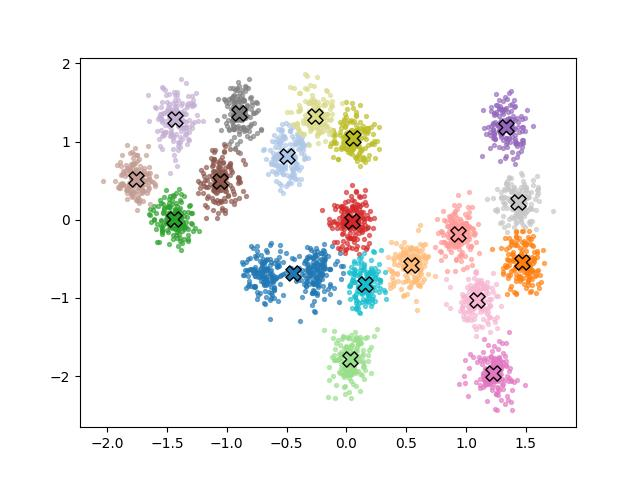

# Gauss Karışım Modelleri için Gibbs Örneklemesi

Kümeleme yapmak için klasik yaklaşımlar var, mesela K-Means, ya da
Beklenti-Maksimizasyon (EM) yöntemi ile Gaussian Karışım Modelleri.
Bu yazıda farklı olarak K-Means yerine GMM, ve GMM hesaplaması için
Gibbs örneklemesi kullanacağız.

GMM neden K-Means'e tercih edilir? K-Means, sezgisel açıdan çekici bir
algoritma: her noktayı en yakın merkeze ata, merkezleri güncelle,
tekrarla. Ancak bu yöntem hiçbir olasılıksal modele dayanmaz. Her
kümenin eşit büyüklükte ve küresel olduğunu örtük olarak varsayar,
çünkü yalnızca Oklid mesafesini optimize eder. Bunun ötesinde, K-Means
size yalnızca nokta tahminleri verir: her küme için tek bir merkez,
her nokta için tek bir atama. Belirsizliği ölçmenin hiçbir yolu
yoktür. İki kümenin sınırındaki bir noktanın %60 küme 1'e, %40 küme
2'ye ait olduğunu söyleyemezsiniz — K-Means onu birbirine zıt iki
seçenekten birine zorla atar. Gauss Karışım Modeli ise tam olarak bir
olasılıksal modelden başlar: her noktanın gözlemlenebilir bir kümeden
değil, gizli bir değişken tarafından belirlenen bir bileşenden
geldiğini açıkça ifade eder. Bu sayede küme şekilleri esnek olabilir,
her atama bir olasılık taşır ve belirsizlik modelin doğal bir parçası
haline gelir.

Gibbs örneklemesi neden Beklenti-Maksimizasyona (EM) tercih edilir?
EM, GMM'yi veriye uydurmak (fıtting) için klasik yaklaşımdır ve
oldukca verimlidir: her döngüde gizli değişkenler üzerindeki dağılımı
hesaplar (E adımı), ardından bu dağılım altında log-olurluğu
(log-likelihood) maksimize edecek parametreleri günceller (M
adımı). Ancak EM nihayetinde bir maksimizasyon algoritmasidir —
log-olurluğun bir yerel maksimumuna yakınsar ve size tek bir nokta
tahmini verir: $\hat{\mu}_k$, $\hat{\sigma}_k^2$,
$\hat{\pi}$. Parametreler üzerindeki belirsizlik hakkında hiçbir şey
söylemez. Eğer veri azsa ya da kümeler birbirine yakınsa, EM'in
bulduğu çözüme ne kadar güvenilmesi gerektiğini bilmek
imkânsizdir. Gibbs örneklemesi ise tam Bayeşçi çıkarım yapar:
parametrelerin tek bir tahmini yerine tüm sonsal dağılımını
örnekler. Bu sayede her parametre için güven aralıkları elde
edersiniz, küme sayısı veya karışım oranları üzerindeki belirsizliği
ifade edebilirsiniz ve verinin gerçekten birden fazla makul yorumu
varsa bu durum örneklerde kendiliğinden ortaya çıkar. Hesaplama
maliyeti daha yüksektir, ancak ödül, modelin bildiğini ve bilmediğini
dürüstçe yansıtan bir sonsal dağılımdır.

Problemi net olarak tanımlayalım. $N$ veri noktamız var: $X = \{x_1,
x_2, \ldots, x_N\}$, her $x_i \in \mathbb{R}^D$. Bu verinin $K$ Gauss
kümesi tarafından üretildiğine inanıyoruz; ancak hangi noktanın hangi
kümeye ait olduğunu, ya da küme parametrelerini bilmiyoruz. Amacımız
tüm bunları veriden çıkarmak.

Verinin nasıl üretilmiş olabileceğini düşünmek yardımcı olur:

$\pi = (\pi_1, \ldots, \pi_K)$ şeklinde karışım oranları seçin; burada
$\pi_k \geq 0$ ve $\sum_k \pi_k = 1$. $\pi_k$'yı "rastgele bir
noktanın $k$ kümesine ait olma olasılığı" olarak düşünün.

Her $i = 1, \ldots, N$ veri noktası için:

- Bir küme ataması örnekleyin: $z_i \sim \text{Categorical}(\pi_1,
  \ldots, \pi_K)$, yani $P(z_i = k) = \pi_k$

- Veri noktasını o kümenin Gauss dağılımından örnekleyin: $x_i \mid
  z_i = k \sim \mathcal{N}(\mu_k, \sigma_k^2)$

Basitlik için burada tek sayısal (1D) Gauss'lar kullanıyoruz;
dolayısıyla $\mu_k \in \mathbb{R}$ ve $\sigma_k^2 \in \mathbb{R}^+$.

$z_i$'lere gizli değişkenler denir — modelde var olurlar ama
hiçbir zaman gözlemlenemezler. Biz yalnızca $X$'i görürüz.

Ne İstiyoruz

Verilen veri için tüm bilinmeyenler üzerindeki sonsal dağılımı
istiyoruz:

$$p(\mu, \sigma^2, \pi, Z \mid X)$$

burada $Z = \{z_1, \ldots, z_N\}$, $\mu = \{\mu_1, \ldots, \mu_K\}$,
$\sigma^2 = \{\sigma_1^2, \ldots, \sigma_K^2\}$.

Bayes teoremi ile:

$$p(\mu, \sigma^2, \pi, Z \mid X) = \frac{p(X \mid Z, \mu, \sigma^2)\,
p(Z \mid \pi)\, p(\pi)\, p(\mu)\, p(\sigma^2)}{p(X)}$$

Paydaki $p(X)$'i hesaplamak son derece güçtür (tüm olası $Z, \mu,
\sigma^2, \pi$ üzerinden integral almayı gerektirir). İşte bu yüzden
Gibbs örneklemesine başvuruyoruz — bu yöntem, sonsal dağılımdan
doğrudan hesaplamadan örneklememize olanak tanır.

Gibbs Örneklemesinin Arkasındaki Fikir

Gibbs örneklemesi basit bir gözleme dayanır: karmaşık bir ortak
dağılım $p(A, B, C)$'den doğrudan örnekleyemeseniz bile, çoğunlukla
koşullu dağılımlardan $p(A \mid B, C)$, $p(B \mid A, C)$, $p(C \mid A,
B)$ sırayla örnekleyebilirsiniz. Bu döngüyü yeterince uzun
sürdürürseniz, örnekler ilgilendiğimiz ortak dağılıma yakınsar.

Dolayısıyla her bilinmeyen için birer tane olmak üzere dört koşullu
dağılım türetmemiz gerekiyor:

$$p(Z \mid X, \mu, \sigma^2, \pi),\quad p(\pi \mid Z),\quad p(\mu_k \mid X, Z, \sigma_k^2),\quad p(\sigma_k^2 \mid X, Z, \mu_k)$$

Önsel Dağılımların Seçimi

Koşulluları işlenebilir kılmak için eşlenik önsel dağılımlar seçiyoruz
— olurlukla çarpıldığında aynı aileden bir sonsal veren
önseller. Bu, koşulluların kapalı formda elde edilmesini sağlayan
matematiksel bir kolaylıktır.

$\pi$ için — karışım oranları bir simpleks üzerinde yaşar (negatif
değildir ve toplamları 1'dir), bu yüzden doğal bir önsel
Dirichlet'tir:

$$\pi \sim \text{Dirichlet}(\alpha_1, \ldots, \alpha_K)$$

Simetrik bir önsel kullanacağız: tüm $k$ için $\alpha_k =
\alpha$. $\alpha = 1$ seçmek, tüm olası karışım oranları üzerinde
düzgün bir dağılım verir.

$\mu_k$ için — Gauss önsel kullanıyoruz:

$$\mu_k \sim \mathcal{N}(\mu_0, \tau^2)$$

burada $\mu_0$ küme ortalamasının nerede olabileceğine dair önceki
inancımız, $\tau^2$ ise ne kadar emin olmadığımızdır.

$\sigma_k^2$ için — Varyans pozitif olmalıdır, bu yüzden Gauss
olurluğuyla eşlenik olan Ters-Gamma onselini kullanıyoruz:

$$\sigma_k^2 \sim \text{Inverse-Gamma}(a, b)$$

burada $a$ ve $b$ önceden belirlediğimiz hiperparametrelerdir.

Dört Koşullunun Türetilmesi

Küme Atamalarının Örneklenmesi $z_i$

Her $i$ noktası için $p(z_i = k \mid x_i, \mu, \sigma^2, \pi)$ ifadesini istiyoruz.

Bayes teoremi ve $z_i = k$ verildiğinde $x_i$'nin yalnızca $\mu_k$ ve
$\sigma_k^2$'ye bağlı olduğu gerçeğini kullanarak:

$$p(z_i = k \mid x_i, \mu, \sigma^2, \pi) = \frac{p(x_i \mid z_i = k,
\mu_k, \sigma_k^2)\, p(z_i = k \mid \pi)}{\sum_{j=1}^{K} p(x_i \mid
z_i = j, \mu_j, \sigma_j^2)\, p(z_i = j \mid \pi)}$$

Yerine koyarsak:

$$= \frac{\pi_k \cdot \mathcal{N}(x_i \mid \mu_k,
\sigma_k^2)}{\sum_{j=1}^{K} \pi_j \cdot \mathcal{N}(x_i \mid \mu_j,
\sigma_j^2)}$$

Bu, küme başına $K$ olasılıklı bir kategorik dağılımdan başka bir şey
değildir. Her veri noktası için bu $K$ değeri hesaplıyoruz,
toplamlarını 1'e normalize ediyoruz ve elde edilen kategorik
dağılımdan bir atama örnekliyoruz. Bu en sezgisel adımdır — "mevcut
parametreler göz önünde bulundurulduğunda bu nokta en muhtemelen hangi
kümeye aittir?" diye soruyoruz, ardından bu dağılımdan keskin bir
atama örnekliyoruz.

Açıklık için $p(z_i \mid x_i, \mu, \sigma^2, \pi)$'yi $Z$ için daha
önceki bir ifadeyle ilişkilendirelim:

$$p(Z \mid X, \mu, \sigma^2, \pi) = \prod_{i=1}^{N} p(z_i \mid x_i,
\mu, \sigma^2, \pi) \tag{2}$$

Temel gözlem şudur: her $z_i$ yalnızca kendi $x_i$'sine bağlıdır,
başka herhangi bir noktanın atamasına veya verisine bağlı
değildir. Parametreler $\mu, \sigma^2, \pi$ verildiğinde, atamalar
birbirinden koşullu bağımsızdır. Tüm atamalar üzerindeki ortak
dağılım, $N$ adet bireysel kategorik dağılımın — her nokta için bir
tane — sadece bir çarpımıdır. Bu yüzden Gibbs örnekleyicisinde
noktalar üzerinde döngü kuruyor ve her $z_i$'yi bağımsız olarak
örnekliyoruz.

Kodda, ters CDF numarasını dahili olarak kullanan vektörleştirilmiş
kategorik örnekleme kullanılabilir.

Herhangi bir ayrık dağılımdan örneklemenin standart yolu ters CDF
yöntemidir (ters dönüşüm örneklemesi olarak da adlandırılır). Fikir
şudur:

1. Kümülatif toplamı oluşturun: $C_{ik} = \sum_{j=1}^{k} p_{ij}$,
böylece $C_i$, $K$ adımda 0'dan 1'e gider

2. Düzgün bir rastgele sayı çekin: $u_i \sim \text{Uniform}(0, 1)$

3. $u_i \leq C_{ik}$ koşulunu sağlayan ilk $k$'yı seçin

Görsel olarak $[0,1]$ üzerinde düzgün biçimde dart atıyorsunuz ve
hangi kovaya düştüğünü görüyorsunuz — daha geniş kovalar (daha yüksek
olasılık) daha sık isabet alır.

```
| pi1 |    | pi2 |    | pi3 |   ...
  Ci1        Ci2        Ci3
```

Aşağıdaki kod $N$ adet düzgün değer oluşturur ve `>` karşılaştırmasını
$N$ kez çalıştırır:

```python
cumprobs = probs.cumsum(axis=1)  # (N, K) — her satır C_i
u = np.random.rand(N, 1)         # (N, 1) — her nokta için bir dart
Z = (u > cumprobs).sum(axis=1)
```

Bu hızlı çalışır. `np.random.multinomial`'ı $N$ kez çağırabilirdik ama
bu yavaş olurdu.

Karışım Oranlarının Örneklenmesi $\pi$

$p(\pi \mid Z)$ ifadesini istiyoruz. $Z$ bilindiğinde $\pi$'nin artık
doğrudan $X$'e bağlı olmadığına dikkat edin — veri, $\pi$'yi yalnızca
atamalar aracılığıyla etkiler.

Bunun için $p(Z \mid \pi)$'ye ihtiyacımız olacak. Bu ifadenin herhangi
bir $X$ verisi görülmeden önce, yalnızca $\pi$ bilindiğinde $Z$
üzerindeki önsel olduğuna dikkat edin. Karşılaştırma için (2), $Z$
üzerindeki sonsal dağılımdır.

$n_k = \sum_{i=1}^{N} \mathbf{1}[z_i = k]$ ifadesi, şu anda $k$
kümesine atanan nokta sayısı olsun. Buradaki $\mathbf{1}[\cdot]$
gösterge fonksiyonudur:

$$\mathbf{1}[\text{koşul}] = \begin{cases} 1 & \text{koşul doğruysa}
\\ 0 & \text{koşul yanlışsa} \end{cases}$$

Bu yalnızca "koşul sağlanıyorsa say, sağlanmıyorsa yoksay" ifadesinin
bir yazım biçimidir.

$K = 3$, $N = 6$ ve mevcut atamalar $Z = [2, 1, 3, 1, 2, 1]$ olsun;
yani 1. nokta 2. kümede, 2. nokta 1. kümede vb. O zaman:

$$n_1 = \sum_{i=1}^{6} \mathbf{1}[z_i = 1] = \mathbf{1}[2=1] +
\mathbf{1}[1=1] + \mathbf{1}[3=1] + \mathbf{1}[1=1] + \mathbf{1}[2=1]
+ \mathbf{1}[1=1] = 0+1+0+1+0+1 = 3$$

Kodda bu şöyle yazılır:

```python
nk = np.array([(Z == k).sum() for k in range(K)])
```

Türetmeye devam edelim. $Z$'nin $\pi$ verildiğinde olurluğu:

$$p(Z \mid \pi) = \prod_{i=1}^{N} \pi_{z_i} = \prod_{k=1}^{K}
\pi_k^{n_k} \tag{1}$$

Gösterge fonksiyonunun faydasını burada görüyoruz: bir çarpımı üs
haline getirebildik. Onsuz, olurluk tüm $N$ nokta üzerinde hantal
bir çarpım olurdu. Gösterge fonksiyonu, çarpımı noktalar yerine
kümeler üzerinden yeniden indekslememizi sağlar:

$$\prod_{i=1}^{N} \pi_{z_i} = \prod_{k=1}^{K} \pi_k^{n_k}, \quad n_k =
\sum_{i=1}^{N} \mathbf{1}[z_i = k]$$

Devam edelim. Denklem (1) bir multinomial olurluk. Dirichlet
önselle birlikte sonsal şöyle olur:

$$p(\pi \mid Z) \propto p(Z \mid \pi)\, p(\pi) = \prod_{k=1}^{K}
\pi_k^{n_k} \cdot \prod_{k=1}^{K} \pi_k^{\alpha-1} = \prod_{k=1}^{K}
\pi_k^{n_k + \alpha - 1}$$

Bu yine bir Dirichlet dağılımıdır:

$$\pi \mid Z \sim \text{Dirichlet}(n_1 + \alpha,\; n_2 + \alpha,\;
\ldots,\; n_K + \alpha)$$

Sezgisel olarak: sonsal Dirichlet, gözlemlenen küme sayılarını önsel
sözde-sayılara $\alpha$ ekler.

Küme Ortalamalarının Örneklenmesi $\mu_k$

$p(\mu_k \mid X, Z, \sigma_k^2)$ ifadesini istiyoruz. Burada yalnızca
$k$ kümesine atanan veri noktaları ilgilidir. $X_k = \{x_i : z_i =
k\}$ bu alt küme olsun; $n_k = |X_k|$ ve örneklem ortalaması
$\bar{x}_k = \frac{1}{n_k} \sum_{i: z_i = k} x_i$.

$\mu_k$ verildiğinde $X_k$'nin olurluğu:

$$p(X_k \mid \mu_k, \sigma_k^2) = \prod_{i: z_i = k} \mathcal{N}(x_i
\mid \mu_k, \sigma_k^2) \propto \exp\!\left(-\frac{1}{2\sigma_k^2}
\sum_{i: z_i = k} (x_i - \mu_k)^2\right)$$

Toplamı açarak:

$$\sum_{i: z_i = k} (x_i - \mu_k)^2 = \sum_{i: z_i = k} x_i^2 - 2\mu_k
\sum_{i: z_i = k} x_i + n_k \mu_k^2$$

Önsel: $p(\mu_k) \propto \exp\!\left(-\frac{(\mu_k -
\mu_0)^2}{2\tau^2}\right)$.

Olurluğu onselle çarpıp $\mu_k$'da kareyi tamamlayarak bir Gauss
sonsal elde ederiz. Yalnızca $\mu_k$'ya bağlı terimleri toplayarak:

$$p(\mu_k \mid X_k, \sigma_k^2) \propto
\exp\!\left(-\frac{1}{2}\left[\left(\frac{n_k}{\sigma_k^2} +
\frac{1}{\tau^2}\right)\mu_k^2 - 2\left(\frac{n_k
\bar{x}_k}{\sigma_k^2} +
\frac{\mu_0}{\tau^2}\right)\mu_k\right]\right)$$

Bu, $\mu_k$'da bir Gauss'tur.

$\exp\!\left(-\frac{(\mu_k - \mu_n)^2}{2\tau_n^2}\right)$ biçimindeki
bir Gauss, $\exp\!\left(-\frac{1}{2\tau_n^2}\mu_k^2 +
\frac{\mu_n}{\tau_n^2}\mu_k + \text{sabit}\right)$ şeklinde
açılır. $\mu_k^2$ katsayısını eşleştirerek $\frac{1}{\tau_n^2}$'yi,
$\mu_k$ katsayısını eşleştirerek $\mu_n$'yi buluruz.

Standart formla eşleştirerek sonsal varyans ve sonsal ortalamayı
buluruz:

$$\frac{1}{\tau_n^2} = \frac{n_k}{\sigma_k^2} + \frac{1}{\tau^2},
\qquad \mu_n = \tau_n^2\left(\frac{n_k \bar{x}_k}{\sigma_k^2} +
\frac{\mu_0}{\tau^2}\right)$$

Dolayısıyla:

$$\mu_k \mid X, Z, \sigma_k^2 \sim \mathcal{N}(\mu_n,\; \tau_n^2)$$

Sezgi açıktır: sonsal ortalama $\mu_n$, önsel ortalama $\mu_0$ ile
veri ortalaması $\bar{x}_k$'nın kesinlik ağırlıklı ortalamasıdır. Çok
fazla verimiz varsa ($n_k$ büyükse) veri baskın gelir. Az verimiz
varsa önsel, tahmini $\mu_0$'a çeker.

Küme Varyanslarının Örneklenmesi $\sigma_k^2$

$p(\sigma_k^2 \mid X, Z, \mu_k)$ ifadesini istiyoruz. Yine yalnızca
$X_k$ önemlidir.

Olurluk:

$$p(X_k \mid \mu_k, \sigma_k^2) \propto (\sigma_k^2)^{-n_k/2}
\exp\!\left(-\frac{1}{2\sigma_k^2} \sum_{i: z_i = k} (x_i -
\mu_k)^2\right)$$

$S_k = \sum_{i: z_i = k} (x_i - \mu_k)^2$ sapmalar kareler toplamı
olsun. Ters-Gamma önseli:

$$p(\sigma_k^2) \propto (\sigma_k^2)^{-(a+1)}
\exp\!\left(-\frac{b}{\sigma_k^2}\right)$$

Olurluğu önselle çarparak:

$$p(\sigma_k^2 \mid X, Z, \mu_k) \propto (\sigma_k^2)^{-(a + n_k/2 +
1)} \exp\!\left(-\frac{b + S_k/2}{\sigma_k^2}\right)$$

Bu yine bir Ters-Gamma'dır:

$$\sigma_k^2 \mid X, Z, \mu_k \sim \text{Inverse-Gamma}\!\left(a +
\frac{n_k}{2},\; b + \frac{S_k}{2}\right)$$

Güncelleme, atanan nokta sayısını şekil parametresine ve sapmalar kareler toplamını ölçek parametresine ekler.

Tam Algoritma

Hepsini bir araya getirirsek:

Başlangıç: Her $z_i \in \{1, \ldots, K\}$'yi rastgele ata, başlangıç
$\mu_k$, $\sigma_k^2$, $\pi$ değerlerini belirle.

Yakınsayana kadar tekrarla:

1. Her $i = 1, \ldots, N$ için örnekle:

$$z_i \sim \text{Categorical}\!\left(\frac{\pi_k\, \mathcal{N}(x_i
\mid \mu_k, \sigma_k^2)}{\sum_j \pi_j\, \mathcal{N}(x_i \mid \mu_j,
\sigma_j^2)}\right)_{k=1}^{K}$$

2. Her küme için $n_k$ ve $\bar{x}_k$'yı hesapla. Örnekle:

$$\pi \sim \text{Dirichlet}(n_1 + \alpha,\; \ldots,\; n_K + \alpha)$$

3. Her $k = 1, \ldots, K$ için örnekle:

$$\mu_k \sim \mathcal{N}\!\left(\tau_n^2\left(\frac{n_k
\bar{x}_k}{\sigma_k^2} + \frac{\mu_0}{\tau^2}\right),\;
\tau_n^2\right), \qquad \frac{1}{\tau_n^2} = \frac{n_k}{\sigma_k^2} +
\frac{1}{\tau^2}$$

4. Her $k = 1, \ldots, K$ için $S_k$'yı hesapla ve örnekle:

$$\sigma_k^2 \sim \text{Inverse-Gamma}\!\left(a + \frac{n_k}{2},\; b +
\frac{S_k}{2}\right)$$

Bir ısınma döneminden sonra (zincir henüz yakınsarken elde edilen
erken örnekleri atarak), toplanan örnekler tam sonsal dağılımın
$p(\mu, \sigma^2, \pi, Z \mid X)$ ampirik bir yaklaşımını oluşturur.

Türetmenin ardından $p(\mu, \sigma^2, \pi, Z \mid X)$ için gereken
bileşenleri elde ettiğimize dikkat edin: $p(X \mid Z, \mu, \sigma^2)$,
$p(Z \mid \pi)$, $p(\pi)$, $p(\mu)$, $p(\sigma^2)$. Kategorik,
Dirichlet, Gauss, hepsi bir arada. Ama bu çarpımı hesaplamamıza gerek
yoktu, değil mi? Her bileşenden sırayla örnekledik ve sonsal
dağılımdan örneklemiş olduk. Ortak sonsal $p(\mu, \sigma^2, \pi, Z
\mid X)$ hiçbir zaman açıkça hesaplanmadı.

Gibbs'in dediği şudur: "Ortak dağılımdan örneklemek için onu
hesaplamana gerek yok." Her koşulludan sırayla örnekleyebildiğiniz
sürece, döngüyü tekrar tekrar çevirerek örnekler yapı gereği ortak
sonsal dağılıma yakınsar. Bu, algoritmanın ardındaki teorik güvencedir
— örneklerin durağan dağılımı tam olarak önemsediğiniz ortak sonsal
olan bir Markov zinciri oluşturmasının bir sonucudur.

$$\underbrace{p(Z \mid X, \mu, \sigma^2, \pi)}_{\text{Kategorik}}
\;\to\; \underbrace{p(\pi \mid Z)}_{\text{Dirichlet}} \;\to\;
\underbrace{p(\mu_k \mid X, Z, \sigma_k^2)}_{\text{Gauss}} \;\to\;
\underbrace{p(\sigma_k^2 \mid X, Z, \mu_k)}_{\text{Ters-Gamma}}$$

Bunların her biri adı bilinen, örneklenebilir bir dağılımdır. Bunları
hiçbir zaman birbirleriyle çarpmıyorsunuz — yalnızca her seferinde
diğer her şeyin en güncel değerleri koşullanarak aralarında döngü
kuruyorsunuz.

Eşlenik önseller, tam olarak her koşullunun adlandırılmış bir ailede
yer almasını güvence altına almak için seçilmiştir. Önsellerin
göründükleri biçimde görünmelerinin tek nedeni budur — bu bir inanç
ifadesinden çok, her koşulluyu işlenebilir tutmaya yönelik mühendislik
bir karardır.

Yukarıdaki türetme netlik için 1B Gauss'lar kullandı. Aşağıdaki kod
bunu 2B'ye genelleştirir: $\sigma_k^2$, bir kovaryans matrisi
$\Sigma_k$'ya dönüşür ve Ters-Gamma önseli Ters-Wishart olur.

---

Örnek 1: İki Boyutta Kümeleme

```python
import numpy as np
import pandas as pd
import matplotlib.pyplot as plt
import matplotlib.cm as cm
from scipy.stats import invwishart, dirichlet
from matplotlib.patches import Ellipse

df = pd.read_csv('../../algs/algs_080_kmeans/synthetic2.txt', names=['a', 'b'], sep=';')
X = df.values.astype(float)
N, D = X.shape

K = 20        # küme sayısı (görsel olarak ~20 blob)
n_iter = 400
burn_in = 150

# Sayısal kararlılık için sıfır ortalama / birim varyansa normalize et
X_mean = X.mean(axis=0)
X_std  = X.std(axis=0)
X_norm = (X - X_mean) / X_std

alpha  = 1.0                     # Dirichlet yoğunluğu
mu0    = X_norm.mean(axis=0)     # önsel ortalama = verinin merkezi
kappa0 = 0.01                    # ortalama üzerinde zayıf önsel
nu0    = D + 2                   # minimum IW serbestlik derecesi
Psi0   = np.eye(D) * 0.1         # IW ölçeği (küçük, veri normalize)

np.random.seed(42)

# K rastgele nokta seçerek başlangıç merkezlerini dağıt
idx = np.random.choice(N, K, replace=False)
mu  = X_norm[idx].copy()
Sigma = np.array([np.eye(D) * 0.5 for _ in range(K)])
pi    = np.ones(K) / K

# Her noktayı en yakın merkeze ata
def assign_nearest(X, mu):
    dists = np.array([np.sum((X - mu[k])**2, axis=1) for k in range(K)]).T
    return dists.argmin(axis=1)

Z = assign_nearest(X_norm, mu)

def mvn_logpdf(X, mu_k, Sigma_k):
    diff      = X - mu_k
    sign, logdet = np.linalg.slogdet(Sigma_k)
    inv_S     = np.linalg.inv(Sigma_k)
    maha      = np.einsum('nd,dd,nd->n', diff, inv_S, diff)
    return -0.5 * (D * np.log(2 * np.pi) + logdet + maha)

samples_mu    = []
samples_Sigma = []
samples_pi    = []
samples_Z     = []

for iteration in range(n_iter):
    # z_i'yi örnekle
    log_probs = np.column_stack([
        np.log(pi[k] + 1e-300) + mvn_logpdf(X_norm, mu[k], Sigma[k])
        for k in range(K)
    ])  # (N, K)
    log_probs -= log_probs.max(axis=1, keepdims=True)  # sayısal kararlılık
    probs      = np.exp(log_probs)
    probs     /= probs.sum(axis=1, keepdims=True)

    # Vektörleştirilmiş kategorik örnekleme
    cumprobs = probs.cumsum(axis=1)
    u        = np.random.rand(N, 1)
    Z        = np.clip((u > cumprobs).sum(axis=1), 0, K - 1)

    # Küme sayıları ve ortalamalar
    nk   = np.array([(Z == k).sum() for k in range(K)], dtype=float)
    xbar = np.array([X_norm[Z == k].mean(axis=0) if nk[k] > 0
                     else mu0 for k in range(K)])

    # pi'yi örnekle
    pi = dirichlet.rvs(nk + alpha)[0]

    # Adım 3 & 4: mu_k ve Sigma_k'yı örnekle
    for k in range(K):
        if nk[k] == 0:
            Sigma[k] = invwishart.rvs(df=nu0, scale=Psi0)
            mu[k]    = np.random.multivariate_normal(mu0, Sigma[k] / kappa0)
            continue

        Xk       = X_norm[Z == k]
        kappa_n  = kappa0 + nk[k]
        diff_mean = xbar[k] - mu0
        S_k      = (Xk - xbar[k]).T @ (Xk - xbar[k])
        Psi_n    = (Psi0
                    + S_k
                    + (kappa0 * nk[k]) / kappa_n * np.outer(diff_mean, diff_mean))
        nu_n     = nu0 + nk[k]
        Sigma[k] = invwishart.rvs(df=nu_n, scale=Psi_n)

        mu_n  = (kappa0 * mu0 + nk[k] * xbar[k]) / kappa_n
        mu[k] = np.random.multivariate_normal(mu_n, Sigma[k] / kappa_n)

    # Isınma sonrası sakla
    if iteration >= burn_in:
        samples_mu.append(mu.copy())
        samples_Sigma.append(Sigma.copy())
        samples_pi.append(pi.copy())
        samples_Z.append(Z.copy())

# Sonsal özetler (orijinal ölçeğe geri dönüştürülmüş)
post_mu_norm    = np.mean(samples_mu,    axis=0)  # (K, D)
post_Sigma_norm = np.mean(samples_Sigma, axis=0)  # (K, D, D)
post_pi         = np.mean(samples_pi,    axis=0)  # (K,)

# Ortalamaları orijinal ölçeğe geri dönüştür
post_mu_orig = post_mu_norm * X_std + X_mean

# Kovaryansları geri dönüştür: Sigma_orig = diag(std) @ Sigma_norm @ diag(std)
S = np.diag(X_std)
post_Sigma_orig = np.array([S @ post_Sigma_norm[k] @ S for k in range(K)])

# Her nokta için en sık atama
Z_samples = np.array(samples_Z)  # (n_samples, N)
Z_final   = np.apply_along_axis(
    lambda col: np.bincount(col, minlength=K).argmax(), 0, Z_samples)

# Daha temiz bir açıklama için kümeleri karışım oranına göre sırala
order    = np.argsort(post_pi)[::-1]
active_k = [k for k in order if post_pi[k] > 0.005]  # önemsiz kümeleri gösterme

colors = cm.tab20(np.linspace(0, 1, K))

# Şekil 1: Son kümeleme
fig, ax = plt.subplots(1, 1)
for idx_k, k in enumerate(active_k):
    mask = Z_final == k
    ax.scatter(X_norm[mask, 0], X_norm[mask, 1],
               s=8, color=colors[idx_k % K], alpha=0.6)
    ax.scatter(*post_mu_norm[k], marker='X', s=120,
               color=colors[idx_k % K], edgecolors='black', zorder=5)

plt.savefig('gibbs1.jpg')
```



---

Örnek 2: Film Beğenleri Üzerinden Kullanıcı Kümelemek

Bir diğer örnek Movielens verisinde kullanıcıların verdiği notlar
üzerinden kullanıcıları kümelemek, ki ardından işleyecek tavsiye
algoritması yeni bir kullanıcının en yakın olduğu kümeyi bulur ve o
kümedeki kişilerin en yüksek oy verdiği filmleri tavsiye olarak yeni
kullanıcıya sunabilir.

Eğer her kullanıcıyı bir veri satırı olarak kabul edersek, ki 1-5
arası beğeni verileri kolona tekabül eden filmler için olacaktır, bu
çok boyutlu veri rahat bir şekilde kümelenebilir. Bir problem GMM'in
iç yapısındaki Gaussian'lar sebebiyle kullandığı olağan mesafe
hesabıdır, bu mesafe Öklitseldir. Öklitsel mesafe çok seyrek olan ve
kordinatsal bağlamda pek anlam ifade etmeyebilecek film beğeni
vektörleri için kullanışlı olmayabilir. Bu tür veriler üzeinden
kosinüs mesafesinin daha iyi işlediğini biliyoruz.

Bu sebeple bir önişlem üzerinden beğeni vektörlerini Öklitsel olarak
anlam ifade eden başka bir uzaya yansıtmak daha iyi olabilir. Bu
yansıtma işlemini kosinüs mesafesini göz önüne alacak şekilde
seçersek, elde edilen yeni uzay içinde bildiğimiz GMM kümelemesini
yapabiliriz.

Yansıtma için iyi bir yöntem `umap`. Ekteki kodlar bu yaklaşımı kullanıyor.

Kodlar

[movgibbscl.py](movgibbscl.py),
[movgibbsrecom.py](movgibbsrecom.py)

Kaynaklar

[1] <a href="https://umap-learn.readthedocs.io/en/latest/">UMap</a>

