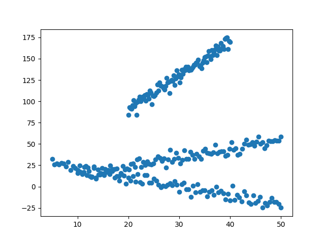
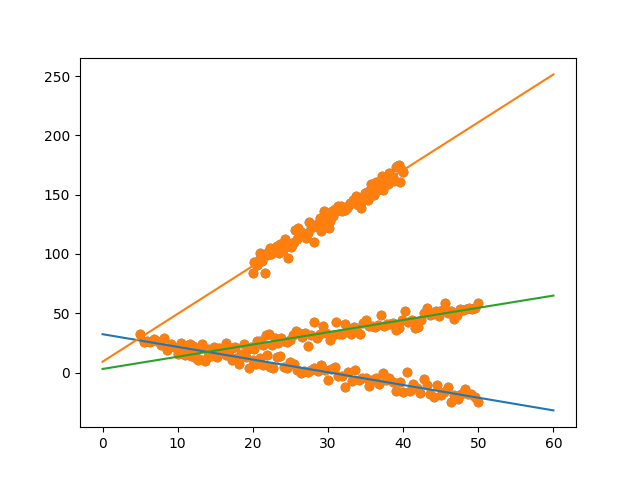
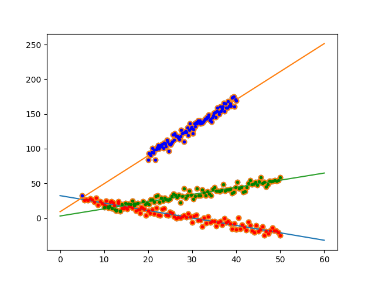

# Birden Fazla Düz Çizgi Regresyonu, Çizgi Karışım Modeli (Line Mixture Model -LMM-)

Aynen veriye bir veya birden fazla boyutlu Gaussian karışımlarını
uydurabildiğimiz gibi birden fazla çizgilerin karışımını da veriye
uydurabiliriz. Alttaki veriye bakalım,

```python
lines = [[1,4,10,50],[-1,30,5,50],[4,10,20,40]]
xs = []; ys = []
for a,b,x1,x2 in lines:
    x = np.linspace(x1,x2,100)
    y = a*x + b
    y += np.random.randn(100)*4
    xs.append(x); ys.append(y)
xs = np.array(xs).T.flatten()
ys = np.array(ys).T.flatten()
plt.scatter(xs,ys)
plt.savefig('stat_lmm_01.png')
```



Model olarak düz çizgi kullanmaya karar verdikten sonra önemli soru şu:
çizgileri nasıl modelleriz? Bize bir olasılıksal temsil yöntemi lazım ki
böylece bir maksimum olurluk denklemi türetebilelim ve bu denklemi
Beklenti-Maksimizasyon (Expectation-Maximization -EM-) ile çözelim.

Bir fikir: her nokta üzerinde sanki bir tek boyutlu Gaussian varmış gibi
düşünebiliriz, ve o noktada hatayı (negatif olurluk) ölçeriz, ki hata o
noktada olduğu düşünülen bir çizginin gerçek veri noktasına olan $y$
eksenindeki uzaklığı olabilir. Böylece lineer regresyon tekniğini aslında
çok çizgili olacak şekilde genişletmiş oluyoruz. Bu karışım modelin formu
şöyle,


$$ 
L = \prod_{i=1}^{N} \sum_{k=1}^{K} \pi_k N(y_i; f_k(x_i),\sigma_k^2)
$$

$$ \log L = \sum_{i=1}^{N} \log \sum_{k=1}^{K} \pi_k 
\frac{1}{\sqrt{2\pi\sigma_k^2}} \exp (-(y_i-f_k(x_i))^2 / 2\sigma_k^2)
$$

ki çizgi tanıdık gelecek formül,

$$ f_k(x_i) = a_kx_i + b_k $$

$Q$ fonksiyonu,

$$ 
Q \propto \sum_{i=1}^{N} \sum_{k=1}^{K} 
\bigg[ \log \pi_k - \frac{1}{2} \log (\sigma_k^2) - 
\frac{(y_i - (a_kx_i + b_k))^2}{2 \sigma_k^2}
\bigg]\eta_{ik}
$$

$\eta_{ik}$, $i$ noktasının $k$ çizgisine ait olma olasılığıdır. 

Türevleri alırsak,

$$ 
\frac{\partial Q}{\partial a_k} \propto
\sum_{i=1}^{N} (y_i - a_kx_i - b_k)x_i\eta_{ik} = 0
$$

$$ 
\frac{\partial Q}{\partial b_k} \propto
\sum_{i=1}^{N} (y_i - a_kx_i - b_k)\eta_{ik} = 0
$$

$$ 
\frac{\partial 
\bigg( Q + \lambda \big( \sum_{k=1}^{K}\pi_k  -1 \big)  \bigg)
}{\partial \pi_k}  \propto
\sum_{i=1}^{N} \frac{\eta_{ik}}{\pi_k} + \lambda = 0 \qquad
\sum_{k=1}^{K} \pi_k = 1
$$

Tekrar düzenleyip parametreler için çözüm yaparsak,


$$ 
\hat{a}_k = \frac{\sum_{i=1}^{N} x_i (y_i-b_k) \eta_{ik}}
{\sum_{i=1}^{N}x_i^2 \eta_{ik}}
$$

$$ 
\hat{b}_k = \frac{\sum_{i=1}^{N} (y_i - a_kx_i) \eta_{ik}}
{\sum_{i=1}^{N} \eta_{ik}}
$$

$$ 
\hat{\sigma}^2_k = \frac{\sum_{i=1}^{N} (y_i - (a_kx_i+b_k))^2 \eta_{ik}}
{\sum_{i=1}^{N}\eta_{ik}}
$$

$$ 
\hat{\pi}_k = \frac{1}{N} \sum_{i=1}^{N} \eta_{ik}
$$


```python
def em_line(x,y,n_components):
    eta = np.random.rand(len(x),n_components)
    a = np.random.rand(n_components) * 10
    b = np.random.rand(n_components) * 10
    sigma2 = np.random.rand(n_components) * 10
    pi = np.random.rand(n_components)

    for i in range(1000):
        for k in range(n_components):
            # hats
            ahat = np.sum(x*(y-b[k])*eta[:,k]) / np.sum(x**2*eta[:,k])
            etasum = np.sum(eta[:,k])
            bhat = np.sum((y-a[k]*x)*eta[:,k]) / etasum
            sigma2hat = np.sum(  (y - (a[k]*x+b[k]))**2  * eta[:,k] ) / etasum 
            pihat = (1./len(x)) * etasum
            a[k] = ahat
            b[k] = bhat
            sigma2[k] = sigma2hat
            pi[k] = pihat

        for k in range(n_components):
            tmp1 = 1. / np.sqrt(2*np.pi*sigma2[k])
            tmp2 = (y-(a[k]*x+b[k]))**2
            eta[:,k] = tmp1 * np.exp(-( tmp2 / (2*sigma2[k]) ) )

        eta = eta / eta.sum(axis=1)[:,None]
        
    return a,b,eta

a,b,eta = em_line(xs,ys,n_components=3)
print (a)
print (b)

plt.scatter(xs,ys)
for k in range(3):
    tmp = np.linspace(0,60,100)
    plt.plot(tmp,tmp*a[k]+b[k])
plt.savefig('stat_lmm_02.png')
```

```
[-1.02632885  3.9704963   0.96107527]
[ 30.43624091  11.21649921   5.18239643]
```



```python
labels =  np.argmax(eta, axis=1)
colors = ['r','b','g','c']
for k in range(3):    
    plt.plot(xs[labels==k],ys[labels==k],'.'+colors[k])
plt.savefig('stat_lmm_03.png')
```



Çözüm hiç fena değil. 

Yanlız bazı potansiyel eksiklerden bahsedelim; çizgiler tanım itibariyle
sonsuzdan gelip sonsuza giden şeylerdir, yani uzunlukları temsil ettiği
veri kümesini aşabilir, bu sebeple eğer onlara yakın başka kopuk ama
yakınca başka bir veri kümesi var ise LMM o kümeyi de modellemeye
uğraşacağı için temsiliyet bozulabilir. Eğer yanyana kopuk pek çok veri
kümesi var ise belki Gaussian Karışım Modeli (GMM) daha iyi bir çözüm
olabilir. GMM'lerin kovaryansları bir kontur bağlamda ince bir elips haline
gelerek düz "çizgimsi'' ama kopuk bir bölgeyi rahatça temsil edebilir.

Kaynaklar

[1] Traa, *Expectation Maximization - Math and Pictures*,
[http://cal.cs.illinois.edu/~johannes/research/EM%20derivations.pdf](http://cal.cs.illinois.edu/~johannes/research/EM%20derivations.pdf)


