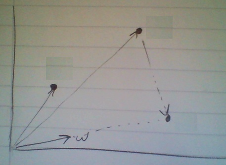
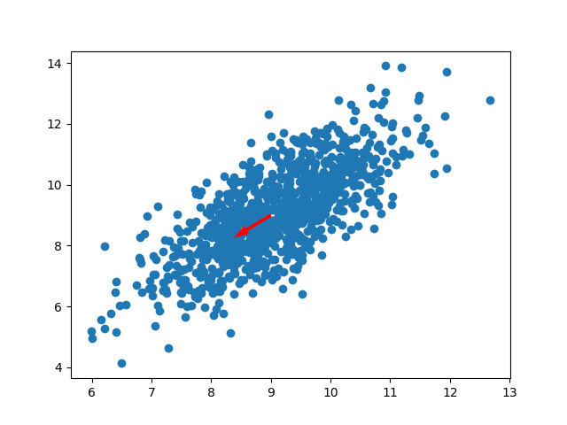
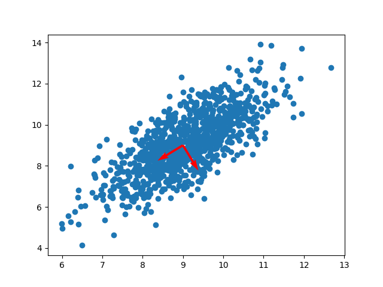
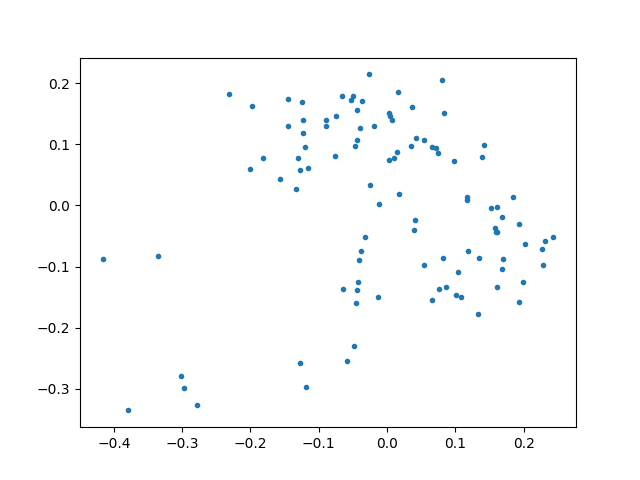
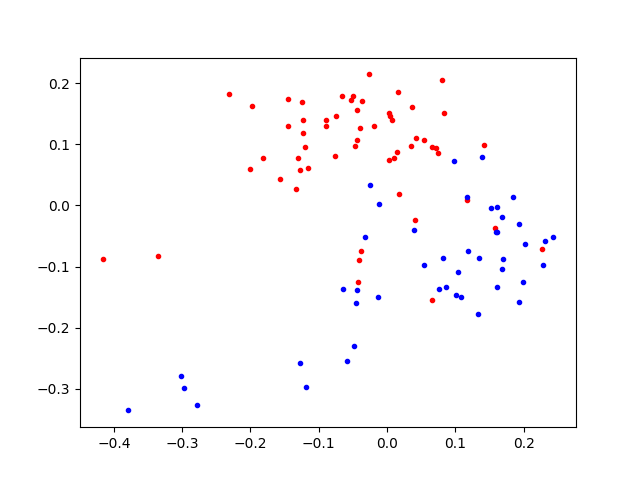

# Asal Bileşen Analizi (Principal Component Analysis -PCA-)

PCA yöntemi boyut azaltan yöntemlerden biri, denetimsiz (unsupervised)
işleyebilir. Ana fikir veri noktalarının izdüşümünün yapılacağı yönler
bulmaktır ki bu yönler bağlamında (izdüşüm sonrası) noktaların arasındaki
sayısal varyans (empirical variance) en fazla olsun, yani noktalar grafik
bağlamında düşünürsek en "yayılmış" şekilde bulunsunlar. Böylece
birbirinden daha uzaklaşan noktaların mesela daha rahat kümelenebileceğini
umabiliriz.  Bir diğer amaç, hangi değişkenlerin varyansının daha fazla
olduğunun görülmesi üzerine, o değişkenlerin daha önemli olabileceğinin
anlaşılması. Örnek olarak alttaki grafiğe bakalım,

```python
from pandas import *
data = read_csv("testSet.txt",sep="\t",header=None)
print (data[:10])
```

```
           0          1
0  10.235186  11.321997
1  10.122339  11.810993
2   9.190236   8.904943
3   9.306371   9.847394
4   8.330131   8.340352
5  10.152785  10.123532
6  10.408540  10.821986
7   9.003615  10.039206
8   9.534872  10.096991
9   9.498181  10.825446
```

```python
plt.scatter(data.ix[:,0],data.ix[:,1])
plt.plot(data.ix[1,0],data.ix[1,1],'rd')
plt.plot(data.ix[4,0],data.ix[4,1],'rd')
plt.savefig('pca_1.png')
```


PCA ile yapmaya çalıştığımız öyle bir yön bulmak ki, $x$ veri
noktalarının tamamının o yöne izdüşümü yapılınca sonuç olacak,
"izdüşümü yapılmış" $z$'nin varyansı en büyük olsun. Bu bir
maksimizasyon problemidir. Fakat ondan önce $x$ nedir, $z$ nedir
bunlara yakından bakalım.

Veri $x$ ile tüm veri noktaları kastedilir, fakat PCA probleminde
genellikle bir "vektörün diğeri üzerine" yapılan izdüşümü, "daha
optimal bir $w$ yönü bulma", ve "o yöne doğru izdüşüm yapmak"
kelimeleri kullanılır. Demek ki veri noktalarını bir vektör olarak
görmeliyiz. Eğer üstte kırmızı ile işaretlenen iki noktayı alırsak (bu
noktalar verideki 1. ve 4. sıradaki noktalar),



gibi bir görüntüden bahsediyoruz. Hayali bir $w$ kullandık, ve noktalardan
biri veri noktası, $w$ üzerine izdüşüm yapılarak yeni bir vektörü / noktayı
ortaya çıkartılıyor. Genel olarak ifade edersek, bir nokta için

$$ z_i =  x_i^Tw = x_i \cdot w$$

Yapmaya çalıştığımız sayısal varyansı maksimize etmek demiştik. Bu arada verinin
hangi dağılımdan geldiğini söylemedik, "her veri noktası birbirinden ayrı,
bağımsız ama aynı bir dağılımdandır'' bile demedik, $x$ bir rasgele değişkendir
beyanı yapmadık ($x$ veri noktalarını tutan bir şey sadece). Sadece sayısal
varyans ile iş yapacağız.  Sayısal varyans,

$$ \frac{1}{n}\sum_i  (x_i \cdot w)^2 $$

Toplama işlemi yerine şöyle düşünelim, tüm $x_i$ noktalarını istifleyip bir
$x$ matrisi haline getirelim, o zaman $xw$ ile bir yansıtma yapabiliriz, bu
yansıtma sonucu bir vektördür. Bu tek vektörün karesini almak demek onun
devriğini alıp kendisi ile çarpmak demektir, yani

$$ = \frac{1}{n}(xw)^T(xw) = \frac{1}{n} w^Tx^Txw$$

$$ =  w^T\frac{x^Tx}{n}w$$

$x^Tx / n$ sayısal kovaryanstır (empirical covariance). Ona $\Sigma$
diyelim. 

$$ =  w^T\Sigma w$$

Üstteki sonuçların boyutları $1 \times N \cdot N \times N \cdot N \times 1
= 1 \times 1$. Tek boyutlu skalar degerler elde ettik.  Yani $w$ yönündeki
izdüşüm bize tek boyutlu bir çizgi verecektir. Bu sonuç aslında çok
şaşırtıcı olmasa gerek, tüm veri noktalarını alıp, başlangıcı başnokta 0,0
(origin) noktasında olan vektörlere çevirip aynı yöne işaret edecek şekilde
düzenliyoruz, bu vektörleri tekrar nokta olarak düşünürsek, tabii ki aynı
yönü gösteriyorlar, bilahere aynı çizgi üzerindeki noktalara
dönüşüyorlar. Aynı çizgi üzerinde olmak ne demek? Tek boyuta inmiş olmak
demek.

Ufak bir sorun $w^T\Sigma w$'i sürekli daha büyük $w$'lerle sonsuz
kadar büyütebilirsiniz. Bize ek bir kısıtlama şartı daha lazım, bu şart
$||w|| = 1$ olabilir, yani $w$'nin norm'u 1'den daha büyük olmasın. Böylece
optimizasyon $w$'yi sürekli büyüte büyüte maksimizasyon yapmayacak, sadece
yön bulmak ile ilgilenecek, iyi, zaten biz $w$'nin yönü ile
ilgileniyoruz. Aradığımız ifadeyi yazalım, ve ek sınırı Lagrange ifadesi
olarak ekleyelim, ve yeni bir $L$ ortaya çıkartalım,

$$ L(w,\lambda) =  w^T \Sigma w  - \lambda(w^T w - 1) $$

Niye eksiden sonraki terim o şekilde eklendi? O terim öyle şekilde seçildi
ki, $\partial L / \partial \lambda = 0$ alınınca $w^Tw = 1$ geri gelsin /
ortaya çıksın [2, sf 340]. Bu Lagrange'in dahice buluşu. Bu kontrol
edilebilir, $\lambda$ 'ya göre türev alırken $w_1$ sabit olarak yokolur,
parantez içindeki ifadeler kalır ve sıfıra eşitlenince orijinal kısıtlama
ifadesi geri gelir. Şimdi

$$ \max\limits_{w} L(w,\lambda) $$

için türevi $w$'e göre alırsak, ve sıfıra eşitlersek,

$$ \frac{\partial L}{\partial w} = 2w \Sigma - 2 \lambda w = 0 $$

$$ 2w \Sigma = 2 \lambda w $$

$$ \Sigma w  = \lambda w $$

Üstteki ifade özdeğer, özvektör ana formülüne benzemiyor mu?
Evet. Eğer $w$, $\Sigma$'nin özvektörü ise ve eşitliğin sağındaki
$\lambda$ ona tekabül eden özdeğer ise, bu eşitlik doğru olacaktır.

Peki hangi özdeğer / özvektör maksimal değeri verir? Unutmayalım,
maksimize etmeye çalıştığımız şey $w^T \Sigma w$ idi

Eger $\Sigma w  = \lambda w$ yerine koyarsak

$$ w^T \lambda w =  \lambda w^T  w = \lambda $$

Çünkü $w_1^T w$'nin 1 olacağı şartını koymuştuk. Neyse, maksimize etmeye
çalıştığımız değer $\lambda$ çıktı, o zaman en büyük $\lambda$ kullanırsak,
en maksimal varyansı elde ederiz, bu da en büyük özdeğerin ta
kendisidir. Demek ki izdüşüm yapılacak "yön" kovaryans $\Sigma$'nin en
büyük özdeğerine tekabül eden özvektör olarak seçilirse, temel
bileşenlerden en önemlisini hemen bulmuş olacağız. İkinci, üçüncü en büyük
özdeğerin özvektörleri ise diğer daha az önemli yönleri bulacaklar. 

$\Sigma$ matrisi $n \times n$ boyutunda bir matris, bu sebeple $n$ tane
özvektörü olacak. Her kovaryans matrisi simetriktir, o zaman lineer cebir
bize der ki özvektörler birbirine dikgen (orthogonal) olmalı. Yıne $\Sigma$
bir kovaryans matrisi olduğu için pozitif bir matris olmalı, yani herhangi
bir $x$ için $x \Sigma x \ge 0$. Bu bize tüm özvektörlerin $\ge 0$ olması
gerektiğini söylüyor.

Kovaryansın özvektörleri verinin asal bileşenleridir (principal
components), ki metotun ismi burada geliyor.

Örnek

Şimdi tüm bunları bir örnek üzerinde görelim. İki boyutlu örnek veriyi
üstte yüklemiştik. Şimdi veriyi "sıfırda ortalayacağız" yani her kolon için
o kolonun ortalama değerini tüm kolondan çıkartacağız. PCA ile işlem
yaparken tüm değerlerin sıfır merkezli olması gerekiyor, çünkü bu sayısal
kovaryans için gerekli. Daha sonra özdeğer / vektör hesabı için kovaryansı
bulacağız.

```python
import numpy.linalg as lin
from pandas import *
data = read_csv("testSet.txt",sep="\t",header=None)
print (data.shape)
print (data[:10])

means = data.mean()
meanless_data = data - means
cov_mat = np.cov(meanless_data, rowvar=0)
print (cov_mat.shape)
eigs,eigv = lin.eig(cov_mat)
eig_ind = np.argsort(eigs)
print (eig_ind)
```

```
(1000, 2)
           0          1
0  10.235186  11.321997
1  10.122339  11.810993
2   9.190236   8.904943
3   9.306371   9.847394
4   8.330131   8.340352
5  10.152785  10.123532
6  10.408540  10.821986
7   9.003615  10.039206
8   9.534872  10.096991
9   9.498181  10.825446
(2, 2)
[0 1]
```

```python
print (eigs[1],eigv[:,1].T)
print (eigs[0],eigv[:,0].T)
```

```
2.8971349561751887 [-0.52045195 -0.85389096]
0.36651370866931066 [-0.85389096  0.52045195]
```

En büyük olan yönü quiver komutunu kullanarak orijinal veri seti
üzerinde gösterelim,

```python
plt.scatter(data.ix[:,0],data.ix[:,1]) 
# merkez 9,9, tahminen secildi
plt.quiver(9,9,eigv[1,1],eigv[0,1],scale=10,color='r') 
plt.savefig('pca_2.png')
```



Görüldüğü gibi bu yön hakikaten dağılımın, veri noktalarının en çok
yayılmış olduğu yön. Demek ki PCA yöntemi doğru sonucu buldu. Her iki
yönü de çizersek,

```python
plt.scatter(data.ix[:,0],data.ix[:,1]) 
plt.quiver(9,9,eigv[1,0],eigv[0,0],scale=10,color='r') 
plt.quiver(9,9,eigv[1,1],eigv[0,1],scale=10,color='r')
plt.savefig('pca_3.png')
```



Bu ikinci yön birinciye dik olmalıydı, ve o da bulundu. Aslında iki
boyut olunca başka seçenek kalmıyor, 1. yön sonrası ikincisi başka bir
şey olamazdı, fakat çok daha yüksek boyutlarda en çok yayılımın olduğu
ikinci yön de doğru şekilde geri getirilecekti.

Artımsal PCA (Incremental PCA)

Toptan işlem yapmak yerine ufak parçalar üzerinde PCA işletebilmek için
[9]'deki fikir kullanılabilir. Böylece elimize yeni bir veri geçince tüm
önceki veriler + yeni veriyi birarada işlememize gerek kalmıyor. Eldeki son
PCA durumunu yeni veriyi kullanarak güncelliyoruz. Bu sekilde isleyen bir
PCA teknigi CCIPCA. 

```python
# https://github.com/kevinhughes27/pyIPCA baz alinmistir
# online PCA using CCIPCA method which can process sparse
# rows (minibatches of 1). 
import scipy.sparse as sp
import numpy as np
from scipy import linalg as la
import scipy.sparse as sps
from sklearn import datasets

class CCIPCA:    
    def __init__(self, n_components, n_features, amnesic=2.0, copy=True):
        self.n_components = n_components
        self.n_features = n_features
        self.copy = copy
        self.amnesic = amnesic
        self.iteration = 0
        self.mean_ = None
        self.components_ = None
        self.mean_ = np.zeros([self.n_features], np.float)
        self.components_ = np.ones((self.n_components,self.n_features)) / \
                           (self.n_features*self.n_components)
      
    def partial_fit(self, u):
        n = float(self.iteration)
        V = self.components_
        
        # amnesic learning params
        if n <= int(self.amnesic):
            w1 = float(n+2-1)/float(n+2)    
            w2 = float(1)/float(n+2)    
        else:
            w1 = float(n+2-self.amnesic)/float(n+2)    
            w2 = float(1+self.amnesic)/float(n+2)

        # update mean
        self.mean_ = w1*self.mean_ + w2*u

        # mean center u        
        u = u - self.mean_

        # update components
        for j in range(0,self.n_components):
            
            if j > n: pass            
            elif j == n: V[j,:] = u
            else:       
                # update the components
                V[j,:] = w1*V[j,:] + w2*np.dot(u,V[j,:])*u / la.norm(V[j,:])
                normedV = V[j,:] / la.norm(V[j,:])
                normedV = normedV.reshape((self.n_features, 1))
                u = u - np.dot(np.dot(u,normedV),normedV.T)
                
        self.iteration += 1
        self.components_ = V / la.norm(V)
            
        return

    def post_process(self):        
        self.explained_variance_ratio_ = np.sqrt(np.sum(self.components_**2,axis=1))
        idx = np.argsort(-self.explained_variance_ratio_)
        self.explained_variance_ratio_ = self.explained_variance_ratio_[idx]
        self.components_ = self.components_[idx,:]
        self.explained_variance_ratio_ = (self.explained_variance_ratio_ / \
                                          self.explained_variance_ratio_.sum())
        for r in range(0,self.components_.shape[0]):
            d = np.sqrt(np.dot(self.components_[r,:],self.components_[r,:]))
            self.components_[r,:] /= d

```

Örnek için Iris veri setinde görelim,

```python
import pandas as pd, ccipca

df = pd.read_csv('../../stat/stat_cov_corr/iris.csv')
df = np.array(df)[:,:4].astype(float)
pca = ccipca.CCIPCA(n_components=2,n_features=4)
S  = 10
print (df[0, :])
for i in range(150): pca.partial_fit(df[i, :])
pca.post_process()
print ('varyans orani',pca.explained_variance_ratio_)
print ('sonuc', pca.components_.T)
```

```
[5.1 3.5 1.4 0.2]
varyans orani [0.99758595 0.00241405]
sonuc [[ 0.80321426  0.21317031]
 [ 0.38265982  0.38577571]
 [ 0.44985225 -0.8021981 ]
 [ 0.07778993 -0.40275764]]
```

Paylaşılan CCIPCA kodu satırları seyrek matris formatında da işleyebiliyor.

SVD ile PCA Hesaplamak

PCA bölümünde anlatılan yöntem temel bileşenlerin hesabında özdeğerler ve
özvektörler kullandı. Alternatif bir yöntem Eşsiz Değer Ayrıştırma
(Singular Value Decomposition -SVD-) üzerinden bu hesabı yapmaktır. SVD
için [10]'a bakabiliriz. Peki ne zaman klasik PCA ne zaman SVD üzerinden PCA
kullanmalı? Bir cevap belki mevcut kütüphanelerde SVD kodlamasının daha iyi
olması, ayrıştırmanın özvektör / değer hesabından daha hızlı işleyebilmesi
[6].

Ayrıca birazdan göreceğimiz gibi SVD, kovaryans matrisi üzerinde
değil, $A$'nin kendisi üzerinde işletilir, bu hem kovaryans hesaplama
aşamasını atlamamızı, hem de kovaryans hesabı sırasında ortaya
çıkabilecek sayısal (numeric) pürüzlerden korunmamızı sağlar (çok ufak
değerlerin kovaryans hesabını bozabileceği literatürde
bahsedilmektedir).

PCA ve SVD bağlantısına gelelim:

Biliyoruz ki SVD bir matrisi şu şekilde ayrıştırır

$$A = USV^T$$

$U$ matrisi $n \times n$ dikgen (orthogonal), $V$ ise $m \times m$
dikgen. $S$'in sadece köşegeni üzerinde değerler var ve bu  $\sigma_j$
değerleri $A$'nin eşsiz değerleri (singular values) olarak biliniyor.

Şimdi $A$ yerine $AA^T$ koyalım, ve bu matrisin SVD ayrıştırmasını yapalım,
acaba elimize ne geçecek?

$$ AA^T = (USV^T)(USV^T)^T $$

$$ = (USV^T)(V S^T U^T) $$

$$ = U S S^T U^T $$

$S$ bir köşegen matrisi, o zaman $SS^T$ matrisi de köşegen, tek farkla
köşegen üzerinde artık $\sigma_j^2$ değerleri var. Bu normal.

$SS^T$ yerine $\Lambda$ sembolünü kullanalım, ve denklemi iki taraftan
(ve sağdan) $U$ ile çarparsak (unutmayalım $U$ ortanormal bir matris
ve $U^T U = I$),

$$ AA^TU = U \Lambda U^TU $$

$$ AA^TU = U \Lambda   $$

Son ifadeye yakından bakalım, $U$'nun tek bir kolonuna, $u_k$ diyelim,
odaklanacak olursak, üstteki ifadeden bu sadece kolona yönelik nasıl
bir eşitlik çıkartabilirdik? Şöyle çıkartabilirdik,

$$ (AA^T)u_k = \sigma^2 u_k   $$

Bu ifade tanıdık geliyor mu? Özdeğer / özvektör klasik yapısına
eriştik. Üstteki  eşitlik sadece ve sadece eğer $u_k$, $AA^T$'nin
özvektörü ve $\sigma^2$ onun özdeğeri ise geçerlidir. Bu eşitliği tüm
$U$ kolonları için uygulayabileceğimize göre demek ki $U$'nun
kolonlarında $AA^T$'nin özvektörleri vardır, ve $AA^T$'nin özdeğerleri
$A$'nin eşsiz değerlerinin karesidir.

Bu müthiş bir buluş. Demek ki $AA^T$'nin özektörlerini hesaplamak için $A$
üzerinde SVD uygulayarak $U$'yu bulmak ise yarar, kovaryans matrisini
hesaplamak gerekli değil. $AA^T$ özdeğerleri üzerinde büyüklük
karşılaştırması için ise $A$'nin eşsiz değerlerine bakmak yeterli! 

Dikkat, daha önce kovaryansı $A^TA$ olarak tanımlamıştık, şimdi $AA^T$
ifadesi görüyoruz, bir devrik uyuşmazlığı var, bu sebeple, aslında
$A^T$'nin SVD'si alınmalı (altta görüyoruz).

Örnek

İlk bölümdeki örneğe dönelim, ve özvektörleri SVD üzerinden
hesaplatalım. 

```python
U,s,Vt = svd(meanless_data.T,full_matrices=False)
print U
```

```
[[-0.52045195 -0.85389096]
 [-0.85389096  0.52045195]]
```

```python
print np.dot(U.T,U)
```

```
[[  1.00000000e+00   3.70255042e-17]
 [  3.70255042e-17   1.00000000e+00]]
```

Görüldüğü gibi aynı özvektörleri bulduk.

New York Times Yazıları Analizi

Şimdi daha ilginç bir örneğe bakalım. Bir araştırmacı belli yıllar
arasındaki NY Times makalelerinde her yazıda hangi kelimenin kaç kere
çıktığının verisini toplamış [1,2,3], bu veri 4000 küsur kelime, her satır
(yazı) için bir boyut (kolon) olarak kaydedilmiş. Bu veri
`nytimes.csv` üzerinde ek bir normalize işleminden sonra, onun
üzerinde boyut indirgeme yapabiliriz.

Veri setinde her yazı ayrıca ek olarak sanat (arts) ve müzik (music)
olarak etiketlenmiş, ama biz PCA kullanarak bu etiketlere hiç
bakmadan, verinin boyutlarını azaltarak acaba verinin "ayrılabilir"
hale indirgenip indirgenemediğine bakacağız. Sonra etiketleri veri
üstüne koyup sonucun doğruluğunu kontrol edeceğiz.

Bakmak derken veriyi (en önemli) iki boyuta indirgeyip sonucu
grafikleyeceğiz. İlla 2 olması gerekmez tabii, 10 boyuta indirgeyip
(ki 4000 küsur boyuttan sonra bu hala müthiş bir kazanım) geri
kalanlar üzerinde mesela bir kümeleme algoritması kullanabilirdik.

Ana veriyi yükleyip birkaç satırını ve kolonlarını gösterelim.

```python
from pandas import *
import numpy.linalg as lin
nyt = read_csv ("nytimes.csv")
labels = nyt['class.labels']
print nyt.ix[:8,102:107]
```

```
   after  afternoon  afterward  again  against
0      1          0          0      0        0
1      1          1          0      0        0
2      1          0          0      1        2
3      3          0          0      0        0
4      0          1          0      0        0
5      0          0          0      1        2
6      7          0          0      0        1
7      0          0          0      0        0
8      0          0          0      0        0
```

Yüklemeyi yapıp sadece etiketleri aldık ve onları bir kenara
koyduk. Şimdi önemli bir normalizasyon işlemi gerekiyor - ki bu işleme
ters doküman-frekans ağırlıklandırması (inverse document-frequency
weighting -IDF-) ismi veriliyor - her dokümanda aşırı fazla ortaya
çıkan kelimelerin önemi özellikle azaltılıyor, ki diğer kelimelerin
etkisi artabilsin.

IDF kodlaması alttaki gibidir. Önce `class.labels` kolonunu
atarız. Sonra "herhangi bir değer içeren" her hücrenin 1 diğerlerinin
0 olması için kullanılan DataFrame üzerinde `astype(bools)` işletme
numarasını kullanırız, böylece aşırı büyük değerler bile sadece 1
olacaktır. Bazı diğer işlemler sonrası her satırı kendi içinde tekrar
normalize etmek için o satırdaki tüm değerlerin karesinin toplamının
karekökünü alırız ve satırdaki tüm değerler bu karekök ile
bölünür. Buna Öklitsel (Euclidian) normalizasyon denebilir.

Not: Öklitsel norm alırken toplamın hemen ardından çok ufak bir 1e-16
değeri eklememize dikkat çekelim, bunu toplamın sıfır olma durumu için
yapıyoruz, ki sonra sıfırla bölerken NaN sonucundan kaçınalım. 

```python
nyt2 = nyt.drop('class.labels',axis=1)
freq = nyt2.astype(bool).sum(axis=0)
freq = freq.replace(0,1)
w = np.log(float(nyt2.shape[0])/freq)
nyt2 = nyt2.apply(lambda x: x*w,axis=1)
nyt2 = nyt2.apply(lambda x: x / np.sqrt(np.sum(np.square(x))+1e-16), axis=1)
nyt2=nyt2.ix[:,1:] # ilk kolonu atladik
print nyt2.ix[:8,102:107]
```

```
   afterward     again   against       age  agent
0          0  0.000000  0.000000  0.051085      0
1          0  0.000000  0.000000  0.000000      0
2          0  0.021393  0.045869  0.000000      0
3          0  0.000000  0.000000  0.000000      0
4          0  0.000000  0.000000  0.000000      0
5          0  0.024476  0.052480  0.000000      0
6          0  0.000000  0.008536  0.000000      0
7          0  0.000000  0.000000  0.000000      0
8          0  0.000000  0.000000  0.000000      0
```

Not: Bir diğer normalizasyon metotu

```python
import pandas as pd

df = pd.DataFrame([[1.,1.,np.nan],
                   [1.,2.,0.],
                   [1.,3.,np.nan]])
print df
print df.div(df.sum(axis=0), axis=1)
```

```
   0  1   2
0  1  1 NaN
1  1  2   0
2  1  3 NaN
          0         1   2
0  0.333333  0.166667 NaN
1  0.333333  0.333333 NaN
2  0.333333  0.500000 NaN
```

SVD yapalım

```python
nyt3 = nyt2 - nyt2.mean(0)
u,s,v = lin.svd(nyt3.T,full_matrices=False)
print s[:10]
```

```
[ 1.41676764  1.37161893  1.31840061  1.24567955  1.20596873  1.18624932
  1.15118771  1.13820504  1.1138296   1.10424634]
```

```python
print u.shape
```

```
(4430, 102)
```

SVD'nin verdiği $u$ içinden iki özvektörü seçiyoruz (en baştakiler,
çünkü Numpy SVD kodu bu özvektörleri zaten sıralanmış halde döndürür),
ve veriyi bu yeni kordinata izdüşümlüyoruz.

```python
proj = np.dot(nyt, u[:,:2])
proj.shape
plt.plot(proj[:,0],proj[:,1],'.')
plt.savefig('pca_4.png')
```



Şimdi aynı veriyi bir de etiket bilgisini devreye sokarak
çizdirelim. Sanat kırmızı müzik mavi olacak.

```python
arts =proj[labels == 'art']
music =proj[labels == 'music']
plt.plot(arts[:,0],arts[:,1],'r.')
plt.plot(music[:,0],music[:,1],'b.')
plt.savefig('pca_5.png')
```



Görüldüğü gibi veride ortaya çıkan / özvektörlerin keşfettiği doğal
ayırım, hakikaten doğruymuş.

Metotun ne yaptığına dikkat, bir sürü boyutu bir kenara atmamıza
rağmen geri kalan en önemli 2 boyut üzerinden net bir ayırım ortaya
çıkartabiliyoruz. Bu PCA yönteminin iyi bir iş becerdiğini gösteriyor,
ve kelime sayılarının makalelerin içeriği hakkında ipucu içerdiğini
ispatlıyor.

Not: Lineer Cebir notlarımızda SVD türetilmesine bakınca özdeğer/vektör
mantığına atıf yapıldığını görebiliriz ve akla şu gelebilir; "özdeğer / vektör
rutini işletmekten kurtulalım dedik, SVD yapıyoruz, ama onun içinde de
özdeğer/vektör hesabı var".  Fakat şunu belirtmek gerekir ki SVD sayısal
hesabını yapmanın tek yöntemi özdeğer/vektör yöntemi değildir. Mesela Numpy
Linalg kütüphanesi içindeki SVD, LAPACK `dgesdd`  rutinini kullanır ve bu
rutin iç kodlamasında QR, ve bir tür böl / istila et (divide and conquer)
algoritması işletmektedir.

Kaynaklar

[1] Alpaydın, E., *Introduction to Machine Learning, 2nd Edition*

[2] Strang, G., *Linear Algebra and Its Applications, 4th Edition*

[3] Wood, *Principal Component Analysis*, Lecture,[http://www.robots.ox.ac.uk/~fwood/teaching/index.html](http://www.robots.ox.ac.uk/~fwood/teaching/index.html)

[4] Cosma Shalizi, *Advanced Data Analysis from an Elementary Point of View*

[5] *The New York Times Annotated Corpus*, [http://www.ldc.upenn.edu/Catalog/CatalogEntry.jsp?catalogId=LDC2008T19](http://www.ldc.upenn.edu/Catalog/CatalogEntry.jsp?catalogId=LDC2008T19)

[6] Shalizi, *Statistics 36-350: Data Mining Lecture*,[http://www.stat.cmu.edu/~cshalizi/350/](http://www.stat.cmu.edu/~cshalizi/350/)

[7] Goodman, *Risk and Portfolio Management with Econometrics*, [http://www.math.nyu.edu/faculty/goodman/teaching/RPME/notes/Section3.pdf](http://www.math.nyu.edu/faculty/goodman/teaching/RPME/notes/Section3.pdf)

[8] Collins, *Introduction to Computer Vision*, [http://www.cse.psu.edu/~rtc12/CSE486/](http://www.cse.psu.edu/~rtc12/CSE486/)

[9] Weng, *Candid Covariance-free Incremental Principal Component Analysis*, [https://pdfs.semanticscholar.org/4e22/d6b9650a4ff9ccc8c9b860442d162d559025.pdf](https://pdfs.semanticscholar.org/4e22/d6b9650a4ff9ccc8c9b860442d162d559025.pdf)

[10] Bayramlı, Lineer Cebir *Ders 29*


