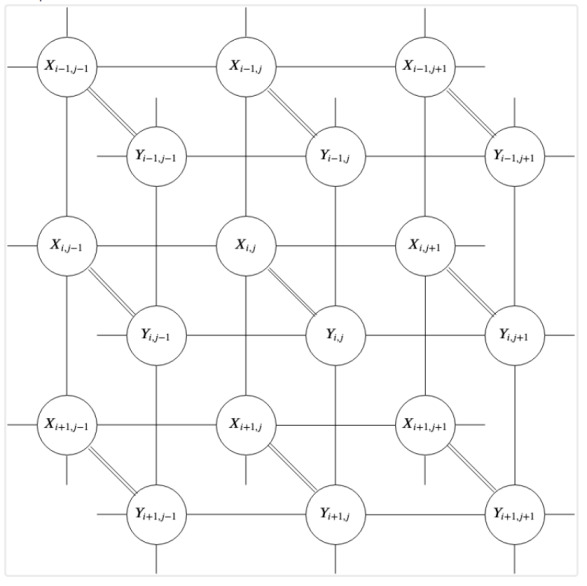

# Markov Rasgele Alanları (Markov Random Fields -MRF-), Gürültü Giderme

MRF formülasyonu şöyle der: Bir görüntüyü gözlemlediğimizde, aslında
gözlemleyemediğimiz bir şeyin (temiz, gerçek sahnenin) gürültülü bir
versiyonunu görüyoruz. Gürültü giderme problemi özünde şu soruyu
sormaktır: elimizdeki bozulmuş piksellerden yola çıkarak, altta yatan
gerçeği nasıl kurtarabiliriz?



Yukarıdaki grafik bu ilişkiyi özetlemektedir. Her $x_{i,j}$ düğümü (ki
bir olasılıksal değişken), doğrudan gözlemlediğimiz gürültülü pikseli
temsil eder. Her $y_{i,j}$ düğümü ise bulmak istediğimiz gizli, temiz
pikseli temsil eder. İki katman ayrı tutulmuştur: X düğümleri bağımsız
gürültü kanalları aracılığıyla karşılık gelen Y düğümlerine
bağlanırken, Y düğümleri kendi aralarında yatay ve dikey komşuluklar
boyunca birbirine bağlıdır. Bu ikinci bağlantı kümesi kritiktir —
doğal görüntülerin yerel olarak düzgün olma eğiliminde olduğu, yani
komşu piksellerin birbirine yakın değerler alması gerektiği inancını
kodlar. Olasılıksal açıdan düğüm (değişken) arasındaki bağlantılar bir
koşulsal olasılık ilişkisini ima eder.

Bu yapı bir Markov Rastgele Alanıdır (MRF) ve matematiksel olarak şunu
söylememizi sağlar: her $y_{i,j}$, tüm görüntü verildiğinde yalnızca
doğrudan komşularına bağlıdır. Bu yerel bağımsızlık özelliği,
hesaplanamaz görünen küresel bir olasılık problemini yönetilebilir
yerel bir probleme dönüştürür ve aşağıda türetilen gürültü giderme
algoritmasının temelidir.

Görüntü gürültü giderme matematiğini türetmek için görüntüyü yalnızca
bir sayı ızgarası olarak değil, rastgele değişkenlerden oluşan bir
küme olarak ele alıyoruz, ve olasılıksal bir çerçeveden probleme
bakıyoruz. İki bilgi parçasıyla başlıyoruz:

- X: Gözlemlediğimiz gürültülü görüntü.
- Y: Bulmak istediğimiz "gerçek" temiz görüntü.

Bayes Teoremi'ne göre, gördüğümüz gürültü verildiğinde bir görüntünün
"doğru" temiz görüntü olma olasılığı şöyledir:

$$P(Y | X) = \frac{P(X | Y)\, P(Y)}{P(X)}$$

X ve Y, temelde bir ızgara üzerinde düzenlenmiş bireysel rastgele
değişkenlerden oluşan koleksiyonlar olan Rastgele Alanlardır. Görüntü
$N \times N$ boyutundaysa, Y yalnızca tek bir rastgele değişken değil,
$N^2$ rastgele değişkenden oluşan bir kümedir: $Y = \{y_{1,1},
y_{1,2}, \ldots, y_{N,N}\}$. Her $y_{i,j}$, $L = \{0, 1, \ldots,
255\}$ kümesindeki herhangi bir tam sayı değerini alabilen ayrık bir
rastgele değişkendir.

$$P(Y | X) \propto P(X | Y)\, P(Y)$$

Olurluk gürültü piksel bazında bağımsızdır

$$P(X | Y) = \prod_{i,j} P(x_{i,j} | y_{i,j})$$

Önsel (prior) dağılımda her piksel yalnızca komşularına bağlıdır (MRF
varsayımı):

$$P(Y) = \prod_{i,j} P(y_{i,j} | \mathcal{N}(y_{i,j}))$$

burada $\mathcal{N}(y_{i,j})$ konum bağlamındaki komşulardır.

Kanıt tüm Y için yalnızca bir normalleştirme sabiti:

$$P(X) = \text{sabit}$$

Dolayısıyla piksel düzeyindeki tam Bayes ifadesi şöyledir:

$$
P(Y | X) \propto \prod_{i,j} P(x_{i,j} | y_{i,j}) \cdot \prod_{i,j}
P(y_{i,j} | \mathcal{N}(y_{i,j}))
$$

Gibbs örneklemesi sayesinde tüm pikseller üzerindeki bu devasa
birleşik dağılımdan tek seferde örnekleme yapmak yerine, her pikseli
kendi yerel koşullu dağılımından örnekliyoruz. Yukarıdaki denklem bize
tüm pikseller üzerindeki birleşik sonsalı aynı anda verir.

Tek bir piksel $y_{i,j}$ için koşullu dağılım $P(y_{i,j} \mid
Y_{-(i,j)}, X)$'i, yani diğer her şey sabit tutulduğunda tek bir
pikselin dağılımını hesaplamamız gerekir. Bunu, $y_{i,j}$'yi içermeyen
tüm terimleri sabit olarak ele alarak yaparız. Çarpımları gözden
geçirip "$y_{i,j}$'ye gerçekten bağlı olan terimler hangileri?" diye
sorduğumuzda yalnızca ikisi hayatta kalır: olurluk çarpımından
$P(x_{i,j} \mid y_{i,j})$ ve ön dağılım çarpımından $P(y_{i,j} \mid
\mathcal{N}(y_{i,j}))$, tabii $y_{i,j}$'nin komşularına ait MRF
terimleri de $y_{i,j}$'yi içerir, ancak Hammersley-Clifford teoremi
kapsamında (ki yakın komşulara bağlılık uzak olanlarla eşdeğerdir der)
bunlar önsel dağılım teriminin kodladığı yerele
indirgenir. Dolayısıyla $(k,l) \neq (i,j)$ olan tüm $y_{k,l}$'leri
sabitler, sabit olan her şeyi atarız ve geriye kalan $P(x_{i,j} \mid
y_{i,j})\, P(y_{i,j} \mid \mathcal{N}(y_{i,j}))$ ile orantılıdır. Bu
odaklama adımı aslında diğer tüm pikselleri onlara koşullanarak dışarı
marjinalleştirmektir, ki bu da Gibbs adımıdır.

Artık tek bir piksel için şunu yazabiliriz:

$$
P(y_{i,j} \mid \mathcal{N}(y_{i,j}), x_{i,j}) \propto P(x_{i,j} \mid
y_{i,j})\, P(y_{i,j} \mid \mathcal{N}(y_{i,j}))
$$

Piksel bazında bağımsız gürültü varsayımıyla (her $x_{i,j}$ bağımsız
olarak bozulmaya uğramış kabul ediyoruz):

$$P(x_{i,j} | y_{i,j}) \propto \exp(-\lambda|y_{i,j} - x_{i,j}|)$$

Üstteki ifade Laplace dağılımı ile gürültü eklememiş olmamızdan ileri
geliyor, gürültülü $x_{i,j}$ değeri gerçek değer $y_{i,j}$ artı
gürültü dedik, yani

$$x_{i,j} = y_{i,j} + \epsilon$$

Yani bana $y_{i,j}$ merkezli $b$ ölçekleme parametresine sahip bir
Laplace dağılımı ver demiş oluyoruz, 

$$P(x_{i,j} \mid y_{i,j}) = \frac{1}{2b} \exp\left( -\frac{|x_{i,j} -
y_{i,j}|}{b} \right)$$

Orantısal işlem kullanınca $1/2b$ atılabilir, ayrıca $\exp$ içindekine
$\lambda = 1/b$ dersek,

$$P(x_{i,j} \mid y_{i,j}) \propto \exp(-\lambda |x_{i,j} - y_{i,j}|)$$

elde ediyoruz.

Devam edelim, şimdi komşu pikseller icin düzgün / pürüzsüz bir önsel
dağılım varsayımı yapıyoruz, yani bir piksel komşularıyla uyuşmalıdır
diyoruz. Bunu formülsel olarak belirtmek için bir piksel $y_{i,j}$ ve
onun etrafındaki komşular $z \in \mathcal{N}(y_{i,j})$ arasındaki
farkın sıfır merkezli bir Laplace dağılımını takip ettiğini farz
ediyoruz (üstte uyguladığımızla benzer bir numara). Niye Laplace?
Çünkü $|y_{i,j} - z|$ uzaklık ölçütü resim piksel gradyanlarının
(yanyana piksel farkları) geniş etekli (heavy-tailed) bir dağılıma
sahip olduğunu farz ediyor. Eğer bunun yerine bir Gaussian önseli
kullansaydık bu dağılım ekstrem değerleri cezalandırırdı / onları daha
az olası görürdü, bu da takip eden diğer işlemleri kötü yönde
etkilerdi.

MRF der ki verili komşu piksellere koşullanmış ortadaki pikselin onsel
dağılımı o pikselin her komşu $z \in \mathcal{N}(y_{i,j})$ ile olan
ikili olasılığının çarpımıyla elde edilir. 

$$
P(y_{i,j} \mid \mathcal{N}(y_{i,j}))
\propto \prod_{z \in \mathcal{N}(y_{i,j})} P(y_{i,j} \mid z)
$$

Her ikili olasılığı Laplace dağılımı olarak modellemiştik, bunu yerine koyarsak,

$$
P(y_{i,j} \mid \mathcal{N}(y_{i,j}))
\propto \prod_{z \in \mathcal{N}(y_{i,j})} \exp\left(-\beta
|y_{i,j} - z|\right)
$$

$\exp(a) \cdot \exp(b) = \exp(a + b)$ kurali sebebiyle tum komsular
uzerindeki carpim ustelin icindeki bir toplama cevirilebilir, 

$$
P(y_{i,j} \mid \mathcal{N}(y_{i,j}))
\propto \exp\left( -\beta \sum_{z \in \mathcal{N}(y_{i,j})}
|y_{i,j} - z| \right)
$$

Eger $\beta = 1$ dersek,

$$
P(y_{i,j} | \mathcal{N}(y_{i,j})) \propto \exp\!\left(-\sum_{z \in
\mathcal{N}(y_{i,j})} |y_{i,j} - z|\right) \tag{2}
$$

elde ederiz.

Nihai sonsalı elde etmek için hatırlayalım, 

Olurluk: $P(x_{i,j} \mid y_{i,j}) \propto \exp(-\lambda |y_{i,j}
- x_{i,j}|)$

Önsel (Komşu Pürüzsüzlüğü): $P(y_{i,j} \mid \mathcal{N}(y_{i,j}))
\propto \exp\left(-\sum_{z \in \mathcal{N}(y_{i,j})} |y_{i,j} -
z|\right)$

İkisini çarpınca 

$$P(y_{i,j} \mid \mathcal{N}(y_{i,j}), x_{i,j}) \propto
\exp\left(-\sum_{z \in \mathcal{N}(y_{i,j})} |y_{i,j} -
z|\right) \cdot \exp(-\lambda |y_{i,j} - x_{i,j}|)$$

Yine $\exp(a) \cdot \exp(b) = \exp(a + b)$ kuralını kullanarak,

$$P(y_{i,j} \mid \mathcal{N}(y_{i,j}), x_{i,j}) \propto \exp\left( -
\left[ \sum_{z \in \mathcal{N}(y_{i,j})} |y_{i,j} - z| +
\lambda |y_{i,j} - x_{i,j}| \right] \right)$$

Log alalım

$$\log P(y_{i,j} \mid \mathcal{N}(y_{i,j}), x_{i,j}) = \log\left(
\exp\left( - \left[ \sum_{z \in \mathcal{N}(y_{i,j})} |y_{i,j} -
z| + \lambda |y_{i,j} - x_{i,j}| \right] \right)
\right)$$

$\log$ ve $\exp$ birbirini iptal eder, geriye sonsal dağılım kalır

$$
= - \left( \underbrace{\sum_{z \in \mathcal{N}(y_{i,j})} |y_{i,j} -
z|}_{\text{Log Prior (8 komşu üzerinden toplam)}} +
\underbrace{\lambda |y_{i,j} - x_{i,j}|}_{\text{Log Likelihood
(tek piksel karşılaştırması)}}
\right)
$$

$$
= - \sum_{z \in \mathcal{N}(y_{i,j})} |y_{i,j} - z| -
\lambda |y_{i,j} - x_{i,j}| 
$$

Dikkat, toplam işareti sadece ilk terim üzerinde aktif, ikinci üzerinde değil.

Kod

```python
from scipy.special import softmax
import numpy as np, skimage

def denoise_mrf_gibbs(noisy_img, iterations=12, lam=1.0):
    M, N = noisy_img.shape
    Y = Y = noisy_img.copy().astype(np.float32)
    possible_vals = np.arange(256, dtype=np.float32)
    
    masks = [
        (np.arange(M)%2 == 0)[:, None] & (np.arange(N)%2 == 0),
        (np.arange(M)%2 == 0)[:, None] & (np.arange(N)%2 == 1),
        (np.arange(M)%2 == 1)[:, None] & (np.arange(N)%2 == 0),
        (np.arange(M)%2 == 1)[:, None] & (np.arange(N)%2 == 1)
    ]
    
    for it in range(iterations):
        for mask in masks:
            padded = np.pad(Y, 1, mode='edge')
            neighbors = np.stack([
                padded[0:-2, 0:-2], padded[0:-2, 1:-1], padded[0:-2, 2:],
                padded[1:-1, 0:-2],                 padded[1:-1, 2:],
                padded[2:, 0:-2],   padded[2:, 1:-1],   padded[2:, 2:]
            ], axis=-1)
            
            target_neighbors = neighbors[mask]
            target_noisy = noisy_img[mask]
            
            log_prior = -np.sum(np.abs(target_neighbors[:, :, np.newaxis] - possible_vals), axis=1)
            
            log_likelihood = -lam * np.abs(target_noisy[:, np.newaxis] - possible_vals)            
            log_posterior = log_prior + log_likelihood
            probs = softmax(log_posterior, axis=1)
            
            cum_probs = np.cumsum(probs, axis=1)
            random_vals = np.random.rand(len(target_noisy), 1)
            Y[mask] = np.argmax(cum_probs > random_vals, axis=1)
            
    return Y

img_noisy = skimage.io.imread('../../func_analysis/func_70_tvd/lena-noise.jpg', as_gray=True)
if img_noisy.max() <= 1.0:
    img_noisy = (img_noisy * 255).astype(np.uint8)

denoised_img = denoise_mrf_gibbs(img_noisy, iterations=10, lam=2.5)

fig, axes = plt.subplots(1, 2)
axes[0].imshow(img_noisy, cmap='gray')
axes[0].set_title('Gürültülü')
axes[0].axis('off')
axes[1].imshow(denoised_img, cmap='gray')
axes[1].set_title('Gürültü Giderilmiş')
axes[1].axis('off')
plt.tight_layout()
plt.savefig('lena1.jpg')
```


`probs`'daki olasılıklara göre bir $k$ değeri seçmek için Kümülatif
Dağılım Fonksiyonunu (CDF) kullanırız. $F(k)$ olarak tanımlanan CDF,
$k$'ya kadar tüm değerlerin olasılıklarının toplamıdır:

$$F(k) = P(Y \leq k) = \sum_{m=0}^{k} P(y = m)$$

Kod: `cum_probs = np.cumsum(probs, axis=1)`

Bu satır, olasılık kütle fonksiyonunu (toplamı 1 olan) 0'dan başlayıp
1'de biten bir "merdiven" fonksiyonuna dönüştürür.

Ters Dönüşüm Örneklemesi

Örneklemenin temel teoremi şunu belirtir: $U$, $[0, 1]$ üzerinde
düzgün dağılımlı bir rastgele değişkense, $X = F^{-1}(U)$, $F$
dağılımına sahiptir. Bunu uygulamak için: $r \in [0, 1]$ aralığında
düzgün bir rastgele sayı üretilir. Kod: `random_vals =
np.random.rand(len(target_noisy), 1)`. $F(k) \geq r$ koşulunu sağlayan
en küçük $k$ indeksi bulunur. Kod: `Y[mask] = np.argmax(cum_probs >
random_vals, axis=1)`.

Parçalar Hâlinde Gibbs ve $P(Y)$

Gibbs Örneklemesi bir Markov Zinciri Monte Carlo (MCMC)
yöntemidir. $P(y_1, y_2, \ldots, y_n)$ birleşik olasılığını hesaplamak
yerine,bu $256^{\text{Yükseklik} \times \text{Genişlik}}$ kombinasyonu
gerektirir, yerel koşullu dağılımlardan örnekleme
yaparsınız. Matematik, her pikselin yerel koşullu dağılımından
yeterince uzun süre örnekleme yaparsanız, elde edilen Y görüntüsünün
nihayetinde gerçek, global sonsal (posterior) dağılımından $P(Y | X)$
bir örnek olacağını garanti eder.

Vektörleştirme (Dama Tahtası)

Standart bir döngüde bir pikseli güncelleyip ardından bir sonrakine
geçersiniz. Ancak bir piksel yalnızca komşularına ve $x_{i,j}$'ye
bağlı olduğundan, tüm "Çift" pikselleri aynı anda
güncelleyebilirsiniz; çünkü hiçbiri birbirinin komşusu değildir.

Matematik: Görüntüyü bağımsız kümelere (4 maske) bölerek, bir
$y_{i,j}$ değerleri grubunu güncellerken $\mathcal{N}(y_{i,j})$ ve
$x_{i,j}$ kanıtının sabit kaldığını garanti ederiz.

Kod: İşte bu yüzden `for mask in masks:` vardır ve ardından binlerce
piksel için aynı anda 256 olası gri düzeyin tümü için enerjiyi
hesaplayan devasa bir NumPy vektörsel yayını gelir.

Kaynaklar

[1] Yue, <a href="https://stanford.edu/class/ee367/Winter2018/yue_ee367_win18_report.pdf">
         Markov Random Fields and Gibbs Sampling for Image Denoising</a>
