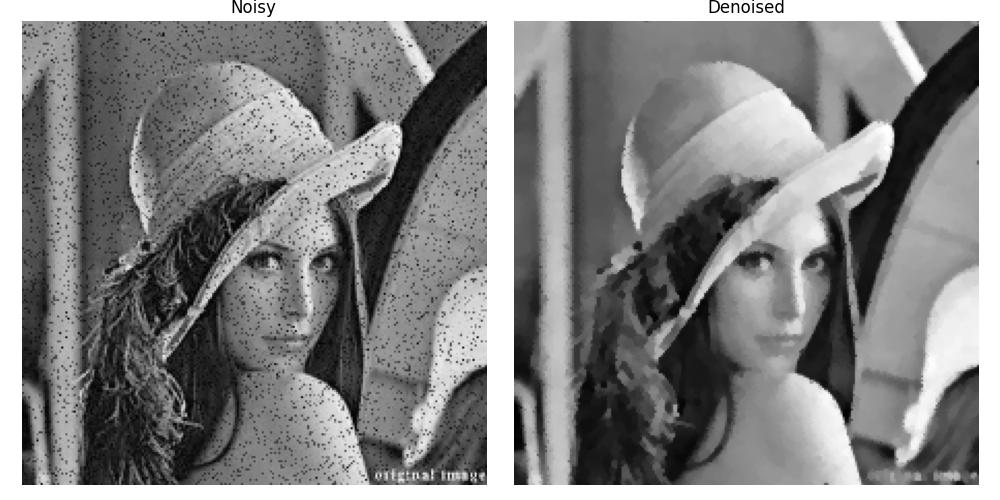

# Markov Rasgele Alanları (Markov Random Fields), Gürültü Giderme

Görüntü gürültü giderme matematiğini türetmek için görüntüyü yalnızca
bir sayı izgarası olarak değil, rastgele değişkenlerden oluşan bir
küme olarak ele aldığımız olasılıksal bir çerçeve ele alıyoruz. İki
bilgi parçasıyla başlıyoruz:

- X: Gözlemlediğimiz gürültülü görüntü.
- Y: Bulmak istediğimiz "gerçek" temiz görüntü.

Bayes Teoremi'ne göre, gördüğümüz gürültü verildiğinde bir görüntünün
"doğru" temiz görüntü olma olasılığı şöyledir:

$$P(Y | X) = \frac{P(X | Y)\, P(Y)}{P(X)}$$

X ve Y, temelde bir ızgara üzerinde düzenlenmiş bireysel rastgele
değişkenlerden oluşan koleksiyonlar olan Rastgele Alanlardır. Görüntü
$N \times N$ boyutundaysa, Y yalnızca tek bir rastgele değişken değil,
$N^2$ rastgele değişkenden oluşan bir kümedir: $Y = \{y_{1,1},
y_{1,2}, \ldots, y_{N,N}\}$. Her $y_{i,j}$, $L = \{0, 1, \ldots,
255\}$ kümesindeki herhangi bir tam sayı değerini alabilen ayrık bir
rastgele değişkendir.

$$P(Y | X) \propto P(X | Y)\, P(Y)$$

Olurluk — gürültü piksel bazında bağımsızdır:

$$P(X | Y) = \prod_{i,j} P(x_{i,j} | y_{i,j})$$

Ön dağılım — her piksel yalnızca komşularına bağlıdır (MRF varsayımı):

$$P(Y) = \prod_{i,j} P(y_{i,j} | \mathcal{N}(y_{i,j}))$$

burada $\mathcal{N}(y_{i,j})$ uzamsal komşulardır.

Kanıt — tüm Y için yalnızca bir normalleştirme sabiti:

$$P(X) = \text{sabit}$$

Dolayısıyla piksel düzeyindeki tam Bayes ifadesi şöyledir:

$$
P(Y | X) \propto \prod_{i,j} P(x_{i,j} | y_{i,j}) \cdot \prod_{i,j}
P(y_{i,j} | \mathcal{N}(y_{i,j}))
$$

Gibbs sayesinde, tüm pikseller üzerindeki bu devasa birleşik
dağılımdan örnekleme yapmak yerine, her piksel kendi yerel koşullu
dağılımından örneklenir — bu, Hammersley-Clifford teoremi sayesinde
yalnızca $\mathcal{N}(y_{i,j})$ ve $x_{i,j}$'ye ihtiyaç
duyar. Çarpımlar tek bir pikselin terimlerine indirgenir ve $P(y_{i,j}
| \mathcal{N}(y_{i,j}), x_{i,j})$'ye geri dönersiniz. Bir piksel ile
görüntüdeki diğer tüm pikseller arasında bir ilişki olabilir, ancak
Hammersley-Clifford teoremi bunu yalnızca bir piksel ile komşuları
arasındaki ilişkiye indirgemize yardımcı olur. Temelde şunu
söyleyebiliriz:

$$P(y_{i,j} | Y_{-(i,j)}, X) = P(y_{i,j} | \mathcal{N}(y_{i,j}), x_{i,j})$$

Devam ederek, Hammersley-Clifford sayesinde Y üzerindeki birleşik
dağılım yerel terimlerin çarpımına indirgenir; böylece tek bir piksel
için şunu yazabiliriz:

$$
P(y_{i,j} | \mathcal{N}(y_{i,j}), x_{i,j}) \propto P(x_{i,j} |
y_{i,j})\, P(y_{i,j} | \mathcal{N}(y_{i,j}))
$$

Piksel bazında bağımsız gürültü varsayımıyla (her $x_{i,j}$ bağımsız
olarak bozulur):

$$P(x_{i,j} | y_{i,j}) \propto \exp(-\lambda|y_{i,j} - x_{i,j}|)$$

Düzgün bir ön dağılım varsayımıyla (bir piksel komşularıyla
uyuşmalıdır):

$$
P(y_{i,j} | \mathcal{N}(y_{i,j})) \propto \exp\!\left(-\sum_{z \in
\mathcal{N}(y_{i,j})} |y_{i,j} - z|\right) \tag{2}
$$

İkisini çarpıp $-\log$ alarak:

$$P(y_{i,j} | \mathcal{N}(y_{i,j}), x_{i,j}) \propto \exp(-E(y_{i,j}))$$

burada:

$$
E(y_{i,j}) = \sum_{z \in \mathcal{N}(y_{i,j})} |y_{i,j} - z| +
\lambda|y_{i,j} - x_{i,j}|
$$

Fiziğe dayalı modellerde olasılığı Enerji (E) ile
ilişkilendiririz. (2)'de $\propto$ kullandık; bu normalleştiricinin
düşürüldüğü anlamına gelir. Tam ifade şöyledir:

$$P(y_{i,j} | \mathcal{N}(y_{i,j}), x_{i,j}) = \frac{1}{Z} \exp(-E(y_{i,j}))$$

burada $Z = \sum_{k=0}^{255} \exp(-E(k))$, bölme fonksiyonudur —
olasılıkların toplamının 1 olmasını sağlamak üzere seçilmiş, tüm 256
olası piksel değeri üzerinden $\exp(-E)$'nin toplamıdır.

Enerji, birbiriyle rekabet eden iki terimden oluşur:

- Ön Dağılım Terimi (R): Düzgünlüğü teşvik etmek için bir piksel ile
  komşuları arasındaki farkları cezalandırır. Bu açıdan "ön dağılım"
  salt göreli bir düzgünlük cezasıdır. Doğal görüntülerin yerel olarak
  düzgün olduğu inancını kodlar; bir pikselin mutlak anlamda hangi
  değeri alması gerektiğine dair hiçbir taahhütte bulunmaz.

- Kayıp Terimi (L): Gerçeğin çok uzağına sapmamamızı sağlamak için
  gürültü giderilen piksel ile orijinal gürültülü gözlem arasındaki
  farkı cezalandırır.

Kod
```
# z aday piksel değeridir -sözde kod-
# L1 Ön Dağılım: toplam|komşular - değer|
prior = np.sum(np.abs(target_neighbors[:, :, np.newaxis] - z), axis=1)
# L1 Kayıp: lambda |gürültülü - değer|
loss = lam * np.abs(target_noisy[:, np.newaxis] - z)
```

$\sum_{z \in \mathcal{N}(y_{i,j})} |y_{i,j} - z|$ olasılıksal bir nicelik olarak garip görünebilir, ama neyi ölçtüğünü düşünün — bir aday piksel değeri $k$'nın komşularıyla olan toplam uyuşmazlığını ölçüyor. Bu toplam:

- Küçük olduğunda: $k$ komşularına yakındır → düşük enerji → yüksek
  olasılık. Piksel "uyum sağlar."

- Büyük olduğunda: $k$ komşularından çok farklıdır → yüksek enerji →
  düşük olasılık. Piksel "öne çıkar."

Karşılaştırmak gerekirse, Gaussian dağılımı da bir şeyden uzaklığı
ölçer — bu durumda bir değer ile ortalama arasındaki
uzaklığı. Ortalamadan uzaklaştıkça ceza artar (düşük olasılık);
yaklaştıkça ödül büyür (yüksek olasılık). L1 ön dağılımı aynı şekilde
çalışır; yalnızca 'ortalama', yerel komşuluk uzlaşısıyla değiştirilir
— sabit bir hedef yoktur, yalnızca yakın piksellerin anlaşması vardır.

$\exp(-E)$ neden düşük enerji = yüksek olasılık sağlar? $E$ arttıkça
$-E$ azalır ve dolayısıyla $\exp(-E)$ monoton biçimde azalır. Üstel
fonksiyonun özellikle seçilmesi, bunu istatistiksel fiziğe (Boltzmann
dağılımı) bağlayan ve olasılıkların her zaman pozitif olmasını güvence
altına alan şeydir.

Maskeleri (dama tahtası deseni) kullanmamızın nedeni bu rastgele
değişkenlerin bağımsızlığıyla ilgilidir. Bir MRF'de iki rastgele
değişken $y_a$ ve $y_b$, komşu değillerse koşullu olarak
bağımsızdır. Bu, vektörleştirilmiş kodda Gibbs örneklemesinin
kurallarını ihlal etmeden binlerce pikseli aynı anda örneklememizi
sağlayan "boşluktur."

Amacımız bu olasılığı maksimize eden Y'yi bulmaktır (MAP
tahmini). $P(X)$ herhangi bir gürültülü görüntü için sabit olduğundan,
payı maksimize etmeye odaklanırız: $P(X | Y)\, P(Y)$.

Kodda bu, her hedef piksel için 8 çevreleyen pikseli (3×3 pencere)
toplayan doldurulmuş görüntü ve komşular yığını tarafından işlenir.

Örnekleme

Bu enerji değerlerini piksel değeri için bir "seçime" dönüştürmek
amacıyla Gibbs dağılımını kullanırız.

Sayısal İstikrar (Stability): $\exp(-E)$ hesaplanırken bilgisayar
hatalarını (NaN) önlemek için üs almadan önce minimum enerjiyi
çıkarırız:

$$
\frac{e^{-E_i}}{\sum_j e^{-E_j}} = \frac{e^{-(E_i - \min E)}}{\sum_j
e^{-(E_j - \min E)}}
$$

Kod
```
# min(energy) çıkarmak exp()'nin çok küçük olmasını engeller (alt taşma)
probs = np.exp(np.min(energy, axis=1, keepdims=True) - energy)
probs /= np.sum(probs, axis=1, keepdims=True)  # Toplamı 1 olacak şekilde normalleştir
```

Koddaki örnekleme adımı, $P(y_{i,j} | \mathcal{N}(y_{i,j}), x_{i,j})$
koşullu olasılık dağılımına uygulanan Ters Dönüşüm Örneklemesinin
doğrudan bir uygulamasıdır. Bu, hesaplanması imkânsız olan global
normalleştirme sabitini hesaplamadan görüntü uzayını keşfetmemizi
sağlayan Gibbs Örnekleyicisinin temel mekanizmasıdır.

Koşullu Dağılım

Bir Markov Rastgele Alanında, komşuluğu $\mathcal{N}(y_{i,j})$ ve
gözlemlenen veri $x_{i,j}$ verildiğinde tek bir pikselin olasılığı
şöyledir:

$$
P(y_{i,j} = k \mid \mathcal{N}(y_{i,j}),\, x_{i,j}) =
\frac{\exp(-E(k))}{\sum_{m=0}^{255} \exp(-E(m))} \tag{1}
$$

Burada $E(k)$, piksel $k \in \{0, \ldots, 255\}$ değerini aldığındaki
enerjidir. Kodda `probs` değişkeni, geçerli maskedeki her piksel için
bu ayrık olasılık dağılımını temsil eder. Paydayı değerlendirmek için
aynı anda tüm 256 aday için $E(k)$'ya ihtiyacımız vardır. Kodda $z$,
`possible_vals = np.arange(256)` ile değiştirilir; bu da yukarıdaki
skaler hesaplamayı tüm adaylar üzerinde vektörleştirilmiş bir
hesaplamaya dönüştürür:

```python
prior = np.sum(np.abs(target_neighbors[:, :, np.newaxis] - possible_vals), axis=1)
loss = lam * np.abs(target_noisy[:, np.newaxis] - possible_vals)
```

Yukarıdaki satırlar, her komşu $z$ ve her aday değer $k \in \{0, \ldots, 255\}$ için $|z - k|$'yı hesaplıyor. "Bu pikselin alabileceği 256 olası değerin her biri için, komşular bu değerden ne kadar uzakta?" sorusunu soran vektörleştirilmiş bir yoldur. Şekiller daha açık hale getirir:

- `target_neighbors` şekli $(K, 8)$'dir — geçerli maskede $K$ piksel, her birinin 8 komşusu
- `[:, :, np.newaxis]` sonrasında $(K, 8, 1)$ olur
- `possible_vals` şekli $(256,)$'dır, $(1, 1, 256)$'ya yayınlanır
- sonuç $(K, 8, 256)$'dır — $K$ pikselin her biri için, 8 komşunun her biri için, 256 aday değerden mutlak fark
- `np.sum(..., axis=1)` ise 8 komşu üzerinde toplar ve $(K, 256)$ şeklini verir

Dolayısıyla nihai `prior` dizisi, tüm $K$ piksel ve $k$'nın tüm 256
değeri için eşzamanlı olarak değerlendirilen $\sum_{z \in
\mathcal{N}(y_{i,j})} |k - z|$'dir. Yayınlama, matematikte her aday
$k$ için komşular üzerindeki toplam olarak yazacağınız işi yapıyor.

Birikimli Dağılım Fonksiyonu (CDF)

`probs`'daki olasılıklara göre bir $k$ değeri seçmek için Birikimli
Dağılım Fonksiyonunu (CDF) kullanırız. $F(k)$ olarak tanımlanan CDF,
$k$'ya kadar tüm değerlerin olasılıklarının toplamıdır:

$$F(k) = P(Y \leq k) = \sum_{m=0}^{k} P(y = m)$$

Kod: `cum_probs = np.cumsum(probs, axis=1)`

Bu satır, olasılık kütle fonksiyonunu (toplamı 1 olan) 0'dan başlayıp
1'de biten bir "merdiven" fonksiyonuna dönüştürür.

Ters Dönüşüm Örneklemesi

Örneklemenin temel teoremi şunu belirtir: $U$, $[0, 1]$ üzerinde
düzgün dağılımlı bir rastgele değişkense, $X = F^{-1}(U)$, $F$
dağılımına sahiptir.

Bunu uygulamak için: $r \in [0, 1]$ aralığında düzgün bir rastgele
sayı üretilir. Kod: `random_vals = np.random.rand(len(target_noisy),
1)`. $F(k) \geq r$ koşulunu sağlayan en küçük $k$ indeksi
bulunur. Kod: `Y[mask] = np.argmax(cum_probs > random_vals, axis=1)`.

Parçalar Hâlinde Gibbs ve $P(Y)$

Gibbs Örneklemesi bir Markov Zinciri Monte Carlo (MCMC)
yöntemidir. $P(y_1, y_2, \ldots, y_n)$ birleşik olasılığını hesaplamak
yerine — bu $256^{\text{Yükseklik} \times \text{Genişlik}}$
kombinasyonu gerektirir — yerel koşullu dağılımlardan örnekleme
yaparsınız. Matematik, her pikselin yerel koşullu dağılımından
yeterince uzun süre örnekleme yaparsanız, elde edilen Y görüntüsünün
nihayetinde gerçek, global posterior dağılımından $P(Y | X)$ bir örnek
olacağını garanti eder.

Özet Tablo: Matematikten Koda

| Matematiksel Adım | Formül | Kod Satırı |
|---|---|---|
| Yerel Koşullu | $P(y_{i,j} \mid \mathcal{N}(y_{i,j}), x_{i,j})$ | `probs = np.exp(...) / sum(...)` |
| CDF Hesabı | $F(k) = \sum P(m)$ | `np.cumsum(probs, ...)` |
| Düzgün Rastgele | $U \sim \text{Unif}(0,1)$ | `np.random.rand(...)` |
| Ters Eşleme | $k^* = \min\{k : F(k) \geq U\}$ | `np.argmax(cum_probs > random_vals, ...)` |

`np.argmax`'ı bir boolean dizi üzerinde kullanarak (`cum_probs > random_vals`), NumPy koşulun doğru olduğu ilk indeksi belirler; bu da vektörleştirilmiş maskedeki her piksel için eşzamanlı olarak $F^{-1}(U)$ işlemini gerçekleştirir.

Vektörleştirme (Dama Tahtası)

Standart bir döngüde bir pikseli güncelleyip ardından bir sonrakine
geçersiniz. Ancak bir piksel yalnızca komşularına ve $x_{i,j}$'ye
bağlı olduğundan, tüm "Çift" pikselleri aynı anda
güncelleyebilirsiniz; çünkü hiçbiri birbirinin komşusu değildir.

Matematik: Görüntüyü bağımsız kümelere (4 maske) bölerek, bir
$y_{i,j}$ değerleri grubunu güncellerken $\mathcal{N}(y_{i,j})$ ve
$x_{i,j}$ kanıtının sabit kaldığını garanti ederiz.

Kod: İşte bu yüzden `for mask in masks:` vardır ve ardından binlerce
piksel için aynı anda 256 olası gri düzeyin tümü için enerjiyi
hesaplayan devasa bir NumPy yayını gelir.

MAP ile Tam Posterior Çıkarım Karşılaştırması

Kesin olarak söylemek gerekirse, MAP (Maksimum A Posteriori) ve Gibbs
Örneklemesi iki farklı çıkarım felsefesini temsil eder; ancak bu
makale ve MRF bağlamında genellikle aynı madalyonun iki yüzü olarak
tartışılırlar. Bu, bir çelişkiden çok optimizasyondan simülasyona bir
geçiştir.

- MAP (Optimizasyon): $P(Y | X)$'i maksimize eden tek en olası Y
  görüntüsünü bulur. Genellikle gradyan inişi veya graf kesmeleri
  kullanılarak çözülür.

- Tam Posterior (Örnekleme): Ortalamayı, varyansı veya belirsizliği
  anlamak için $P(Y | X)$'ten pek çok görüntü örneklenir.

MAP için neden Gibbs kullanılır?

Gradyan yükselişi gibi yöntemler sıklıkla yerel maksimumda takılı
kalır. Gibbs Örneklemesi, enerji yüzeyinde daha sağlam biçimde
gezinir: yalnızca "tepeyi tırmanmak" yerine örnekleme yaparak
algoritma yerel minimumlardan çıkabilir. $\beta$'yı (ters sıcaklık)
artırdıkça, $P(Y | X)$ dağılımı mod etrafında çok "sivri" hale gelir
ve yüksek $\beta$'da posteriordan örnekleme MAP'i bulmakla eşdeğer
hale gelir. Makale, olasılıksal çıkarım aracını (Gibbs) optimizasyon
problemini (MAP) çözmek için kullanır; çünkü dağınık, gürültülü
verilere karşı daha dayanıklıdır.

MAP size tek bir yanıt verir — tek en olası temiz görüntü. Gibbs
örneklemesi ise prensipte makul temiz görüntülerin bir dağılımını
verir. Pratikte burada, yeterli sayıda iterasyondan ve yüksek
$\beta$'dan sonra, örnekleyici zamanının neredeyse tamamını MAP
çözümünün yakınında geçirir; dolayısıyla zincirin son karesi gürültü
giderilmiş çıktı olarak kullanılır. Yani Gibbs kullanarak MAP sonucuna
erişmiş oluyoruz, örnekleme sonsal dağılımı geziyor, fakat o zincirin
ortalamasını almak yerine son varılan noktayı raporlayarak bir optimal
nokta hesabı yapmış oluyoruz.

Kod
```python
import numpy as np
import matplotlib.pyplot as plt
from skimage import io

def vectorized_gibbs_l1(noisy_img, iterations=12, lam=1.0):
    M, N = noisy_img.shape
    Y = noisy_img.copy().astype(np.float32)
    possible_vals = np.arange(256, dtype=np.float32)
    masks = [
        (np.arange(M)%2 == 0)[:, None] & (np.arange(N)%2 == 0),
        (np.arange(M)%2 == 0)[:, None] & (np.arange(N)%2 == 1),
        (np.arange(M)%2 == 1)[:, None] & (np.arange(N)%2 == 0),
        (np.arange(M)%2 == 1)[:, None] & (np.arange(N)%2 == 1)
    ]
    for it in range(iterations):
        for mask in masks:
            padded = np.pad(Y, 1, mode='edge')
            neighbors = np.stack([
                padded[0:-2, 0:-2], padded[0:-2, 1:-1], padded[0:-2, 2:],
                padded[1:-1, 0:-2], padded[1:-1, 2:],
                padded[2:, 0:-2], padded[2:, 1:-1], padded[2:, 2:]
            ], axis=-1)
            target_neighbors = neighbors[mask]
            target_noisy = noisy_img[mask]
            prior = np.sum(np.abs(target_neighbors[:, :, np.newaxis] - possible_vals), axis=1)
            loss = lam * np.abs(target_noisy[:, np.newaxis] - possible_vals)
            energy = prior + loss
            probs = np.exp(np.min(energy, axis=1, keepdims=True) - energy)
            probs /= np.sum(probs, axis=1, keepdims=True)
            cum_probs = np.cumsum(probs, axis=1)
            random_vals = np.random.rand(len(target_noisy), 1)
            Y[mask] = np.argmax(cum_probs > random_vals, axis=1)
    return Y

img_noisy = io.imread('../../func_analysis/func_70_tvd/lena-noise.jpg', as_gray=True)
if img_noisy.max() <= 1.0:
    img_noisy = (img_noisy * 255).astype(np.uint8)

denoised_img = vectorized_gibbs_l1(img_noisy, iterations=10, lam=2.5)

fig, axes = plt.subplots(1, 2, figsize=(10, 5))
axes[0].imshow(img_noisy, cmap='gray')
axes[0].set_title('Gürültülü')
axes[0].axis('off')
axes[1].imshow(denoised_img, cmap='gray')
axes[1].set_title('Gürültü Giderilmiş')
axes[1].axis('off')
plt.tight_layout()
plt.savefig('lena1.jpg')
```



[devam edecek]

Kaynaklar

[1] Yue, https://stanford.edu/class/ee367/Winter2018/yue_ee367_win18_report.pdf
