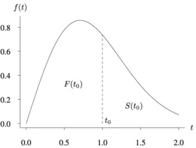

# Sağkalım Analizi (Survival Analysis)

Pozitif sürekli bir rasgele değişken X'i düşünelim; bunu bir nesnenin
ömrü olarak yorumluyoruz [1, s. 581]. X'in dağılım fonksiyonu F,
yoğunluk fonksiyonu f olsun. F'nin tehlike oranı (bazen arıza oranı da
denir) fonksiyonu $\lambda(t)$ şöyle tanımlanır:

$$\lambda(t) = \frac{f(t)}{1 - F(t)}$$

İlgili bir diğer gösterim ise $S(t) = 1 - F(t)$, yani:

$$\lambda(t) = \frac{f(t)}{S(t)}$$

$F$ ve $S$ tabii ki bir yoğunluk $f(t)$'ye göre hesaplanan alanlara
tekabül ederler, alttaki grafikte görüyoruz, kümülatif dağılım
$F$'dir, ve $t_0$ için onun soluna düşen alandır, o zaman $S(t_0)$ sağ
eteğe doğru giden geri kalan alandır.



Tehlike oranı özünde herhangi bir dağılım için türetilebilen bir
ifadedir. Belirli bir noktada olduğumuz varsayımıyla, bir olasılık
yoğunluk fonksiyonunun (probability density function -pdf-) kuyruk
kısmına ek bir hesaplama uyguluyoruz: $f(t)/(1 - F(t))$. Bu, t'de
bulunduğumuzdan hareketle "kalanın" gerçekleşmesi olarak
yorumlanabilir (tabii x ekseni t olmak zorunda, ve pdf'nin bir ömür
pdf'i olduğunu söylüyoruz).

$f(t)$, t zamanında nüfusun (population) arıza yapma hızıdır; ancak
$f(t)$, tüm orijinal nüfusa göre ölçülür. Eğer nüfus büyük çoğunluğu t
zamanında zaten ölmüşse, küçük bir $f(t)$ değeri hayatta kalan az
sayıdaki birey için muazzam bir riski temsil ediyor
olabilir. $S(t)$'ye — yani hala hayatta olan orana — bölmek, $f(t)$'yi
orijinal nüfus başına değil, hayatta kalan basına olacak şekilde
yeniden ölçekler. Bir oran hesaplamak başka bir birim başına ölçüm
verdiğinden, "kalan ömür birimi basına yoğunluk / zaman noktası"
değerini soruyorum aslında; yani bu yoğunluk/zaman noktasının birim
potansiyel ölüm zamanı açısından ne kadar değerli olduğunu
sorguluyorum. Aynı yoğunluk değeri, az zaman kaldığında daha yüksek
bir değer verir.

$h(t) = f(t)/S(t)$ bir oran olduğundan, bir anlık hızdır (birim zaman
başına), bir olasılık değildir. Bu yüzden buna yoğunluk oranı ya da
ölüm kuvveti de denir; bu terimler, onun bir olasılık ya da yoğunluk
yerine bir hız olduğunu daha iyi yansıtan aktüerya bilimi gibi
alanlardan ödünç alınmıştır. Bir pdf'in $f(t)$ şunu sağlaması
gerektiğini biliyoruz: $\int_0^\infty f(t)\,dt = 1$. $h(t)$ için
böyle bir beklenti yoktur.

$S(t) = 1 - F(t)$ ile başlıyoruz; dolayısıyla $f(t) = F'(t) = -S'(t)$. Tanıma yerleştirirsek:

$$h(t) = \frac{f(t)}{S(t)} = \frac{-S'(t)}{S(t)}$$

Logaritmanın türevi için zincir kuralını hatırlayalım:

$$\frac{d}{dt}\log S(t) = \frac{S'(t)}{S(t)}$$

O halde şunu hemen görebiliriz:

$$\frac{-S'(t)}{S(t)} = -\frac{d}{dt}\log S(t)$$

Dolayısıyla:

$$h(t) = -\frac{d}{dt}\log S(t)$$

$S(t)$'yi $h(t)$'den de elde edebiliriz. Her iki tarafı 0'dan t'ye entegre edersek:

$$\int_0^t h(u)\,du = -\log S(t) + \log S(0) = -\log S(t)$$

çünkü $S(0) = P(T > 0) = 1$, yani $\log S(0) = 0$. Dolayısıyla:

$$S(t) = \exp\!\left(-\int_0^t h(u)\,du\right)$$

Bu temel bir sonuçtur — yaşam fonksiyonunun tamamen tehlike fonksiyonu
tarafından belirlendiğini gösterir.

Notasyonel kisaltma amaciyla

$$
H(t) = \int_{0}^{t} h(u) du 
$$

kullanılabilir, o zaman iki üstteki formülü şu halde de yazabiliriz
[3, sf. 14],

$$
S(t) = \exp^{-H(t)}
$$

### Weibull pdf'inden Weibull tehlikesine

T ömrünün şu parametrelerle bir Weibull dağılımı izlediğini varsayalım:
- şekil parametresi $k > 0$
- ölçek parametresi $\lambda > 0$

Pdf şöyledir:

$$f(t) = \frac{k}{\lambda}\left(\frac{t}{\lambda}\right)^{k-1} e^{-(t/\lambda)^k}$$

Yaşam fonksiyonunu türetelim

Tanımı gereği:

$$S(t) = P(T > t) = 1 - F(t)$$

Weibull için kümülatif dağılım:

$$F(t) = 1 - e^{-(t/\lambda)^k}$$

Dolayısıyla:

$$S(t) = e^{-(t/\lambda)^k}$$

Şimdi tanımı kullanalım:

$$h(t) = \frac{f(t)}{S(t)}$$

Yerine koyarsak:

$$h(t) = \frac{\dfrac{k}{\lambda}\left(\dfrac{t}{\lambda}\right)^{k-1} e^{-(t/\lambda)^k}}{e^{-(t/\lambda)^k}}$$

Üstelleri sadeleştirirsek:

$$h(t) = \frac{k}{\lambda}\left(\frac{t}{\lambda}\right)^{k-1}$$

Bu, tanıdık Weibull tehlike biçimidir.

### Olurluk 

Diyelim ki $n$ tane özneyi gözlemliyoruz, bu öznelerin sağkalımsal bir
dağılımı var. Sağkalım Analizi problemlerinde çok ortaya çıkan durum
şudur; mesela bir grup hastaya bir deneysel ilaç veriliyor, ve ne
kadar yaşadıklarına bakılıyor (kelimenin tam anlamıyla sağkalım
analizi!). Vefat eden varsa bu zaman not ediliyor. Fakat deney
bittikten sonra hala yaşamaya devam edenler olabilir (inşallah).  Bu
durumda eksik bir sinyal vardır, yani ölüm not ediliyor fakat sağkalım
not edilmiyor, deney bittikten bir gün önce de olabilir, iki sene
sonra da olabilir. Burada, bitiş noktası bilinmediği için bu tür
veriye sağdan sansürlü (right censored) adı verilir. Sansür değişkeni
literatürde $\delta_i$ ile gösterilir, 0 ya da 1 değerine
sahiptir.

İleride sansürlü veri noktalarının olurluğa nasıl etki ettiğini
göreceğiz.

Tekrar üzerinden geçmek gerekirse. N hasta gözlemlediğimizi
varsayalım.

- Tüm hastalar 1. günde deneye alınır.

- Çalışma 60 gün sürer.

- Her hasta size tam olarak bir veri noktası verir: $(t_i, \delta_i)$.

Çalışmanın sonunda, her hasta için tam olarak iki şeyden biri gerçekleşmiştir:

- Olay gerçekleşti: tam günü kaydettiniz → $\delta_i = 1$

- Çalışma sona erdi (ya da hasta ayrıldı) olay gerçekleşmeden: bilinen
  son sağ günü kaydettiniz → $\delta_i = 0$

Dolayısıyla veri setiniz şöyle görünebilir:

| Hasta | $t_i$ | $\delta_i$ |
|-------|--------|------------|
| 1 | 47 | 1 |
| 2 | 60 | 0 |
| 3 | 12 | 1 |
| 4 | 60 | 0 |

Hasta 2 ve 4 sağdan sansürlüdür — sırasıyla 30. ve 60. günlerde
takipten çıktıklarında yalnızca hala hayattaydılar. Önemli olan şu:
Olay gerçekleşsin ya da gerçekleşmesin, zaman 1. günden itibaren
sürekli aktığı için her hastanın bir $t_i$ değeri vardır.

Birazdan göreceğimiz $L = \prod_i h(t_i)^{\delta_i} S(t_i)$
olurluğunun bunu temiz biçimde ele almasının nedeni de budur —
$\delta_i$ göstergesi yalnızca bir hastanın son kaydedilen gününün bir
olay mı yoksa yalnızca bir yaşam olasılığı mı katkısında bulunacağına
karar veren bir anahtar işlevi görür.

Öznelere dönersek, her birinin gözlemlenen zamanı $t_i$ ve bir
sansürleme göstergesi $\delta_i$ var; burada $\delta_i = 1$ olayın
gözlemlendiği, $\delta_i = 0$ ise sağdan sansürlendiği anlamında.

Her özne için şunu sormalıyız: Gerçekte gözlemlediğim şeyin olasılığı nedir?

- Eğer $\delta_i = 1$: $t_i$'de gerçek bir olay gözlemledik, katkı pdf
  $f(t_i)$'dir.

- Eğer $\delta_i = 0$: Yalnızca olayın $t_i$'ye kadar
  gerçekleşmediğini biliyoruz, katkı $S(t_i)$'dir.

Dikkat: katkı $S(t_i)$, yani pdf grafiğini hatırlarsak "sağ kuyruktaki
alan". Sağkalım Analizi'nin sihirli numarası burada. 

Tam olurluk şöyledir:

$$L = \prod_{i=1}^n f(t_i)^{\delta_i} S(t_i)^{1-\delta_i}$$

Tehlikeyle bağlantı

$h(t) = f(t)/S(t)$ olduğundan $f(t) = h(t)S(t)$, dolayısıyla:

$$
f(t_i)^{\delta_i} S(t_i)^{1-\delta_i} = h(t_i)^{\delta_i}
S(t_i)^{\delta_i} S(t_i)^{1-\delta_i} = h(t_i)^{\delta_i} S(t_i)
$$

Böylece olurluk şöyle olur:

$$L = \prod_{i=1}^n h(t_i)^{\delta_i} S(t_i)$$

$S(t) = e^{-H(t)}$ yerine koyarsak:

$$L = \prod_{i=1}^n h(t_i)^{\delta_i} e^{-H(t_i)}$$

Bu, yaşam olurluğunun literaturdeki halidir; $h$, $S$, $H$'nin hepsi
varsaydığınız dağılımdan gelir.

Weibull'u yerine koymak

Ölçek $\lambda$ ve şekil $k$ parametreli Weibull tehlike fonksiyonu
(Weibull dağılımı değil) için:

$$h(t) = \frac{k}{\lambda}\left(\frac{t}{\lambda}\right)^{k-1}, \quad
H(t) = \left(\frac{t}{\lambda}\right)^k$$

Bunları $L$'ye koyup log-olurluk $\ell = \log L$'yi alıp $\lambda$ (ve
bilinmiyorsa $k$) üzerinden maksimize ediyorsunuz. Sansürlü gözlemler
yalnızca $e^{-H(t_i)}$ üzerinden katkı yapar — bir olay gerçekleşmiş
gibi davranmadan parametre tahminlerini doğru yönde çekerler.

Sansürlemeyi görmezden gelip gözlemlenen zamanlar üzerinde naif bir
regresyon yapmak tahminleri neden çarpıtır? Çünkü sansürlü özneler
için yaşam sürelerini sistematik olarak olduğundan kısa tahmin etmiş
olursunuz.

### Katsayılar, Regresyon

Sağkalım problemleri için veri kullanarak regresyon yapmak mümkündür.
Mesela bir ana dağılım seçilir, ve bu dağılımın parametrelerinin
katsayıları (covariants) üzerinden değişmesine izin verilir. Eğer bu
katsayılara önsel dağılım tanımlarsak, bir sonsal dağılımdan örneklem
toplamak mümkündür, Monte Carlo Markov Zincirleri yaklaşımıyla
(Metropolis, Gibbs) ile bir sonuca ulaşabiliriz.

Hızlandırılmış Arıza Zamanı (Accelerated Failure Time -AFT-) modelleri
burada kullanılabilir. Üstteki $\lambda$'yi her veri noktası için
$\lambda_i$ haline çeviririz, ve onun hesabını katsayılar üzerinden
yaparız,

$$\lambda_i = \lambda_0 \cdot e^{x_i^\top \beta}$$

Formüldeki $\beta$ değişkenler / parametreler / katsayılardır, mesela
yaş, eğitim, vs gibi bilgiler buradan modele dahil edilebilir, ve bu
katsayılar değerlerine göre modeli "hızlandırabilir" ya da
yavaşlatabilir. Bu hızlandırma / yavaşlatma muhakkak etkilenen dağılım
ile alakalı olacaktır, bazı katsayı değerleri dağılımı eteklere doğru
genişletebilir, zaman "yavaşlar", ve arıza zamanı böylece daha ileri
bir tarihte olabilir.

Rossi Verisi

Şimdi Rossi veri setini anlayalım ve katsayılar / ağırlıklar modelini
nasıl parametrize edeceğimize karar verelim. 1970'lerde Maryland
eyalet hapishanelerinden tahliye edilen 432 mahkum bir yıl boyunca
takip edilmiştir. Yarısına rastgele mali yardım atanmış, diğer
yarısına atanmamıştır. Sonuç değişkeni, yeniden tutuklanmayanlar için
52. haftada sansürlenerek ilk tutuklanmanın gerçekleştiği haftadır.

İlgilendiğimiz temel değişkenler şunlardır:

- `week` — gözlemlenen zaman, hafta olarak ($t_i$)
- `arrest` — olay göstergesi ($\delta_i$, 1=tutuklandı, 0=sansürlü)
- `fin` — mali yardım (0/1) — ana deneysel değişken
- `age` — tahliye sırasındaki yaş
- `prio` — önceki tutuklama sayısı
- `wexp` — önceki iş deneyimi (0/1)
- `mar` — evli (0/1)
- `paro` — koşullu tahliye (0/1)

AFT Weibull Modeli

$\lambda$'nin katsayılara göre birey başına değişmesine izin vermemiz
gerekiyor. Standart yol, Poisson regresyonuyla aynı fikir olan
log-doğrusal bağlantıdır:

$$
\log \lambda_i = \beta_0 + \beta_1 \cdot \text{fin}_i + \beta_2 \cdot
\text{age}_i + \beta_3 \cdot \text{prio}_i + \cdots
$$

$$\lambda_i = e^{X_i\beta}$$

Bu, $\lambda_i > 0$'ı her zaman garanti eder. Şimdilik $k$'yı sabit
tutuyoruz (tüm bireyler için ortak) — tek şekil, bireysel
ölçekler. Bu, standart Hızlandırılmış Arıza Zamanı (AFT) Weibull
modelidir.

Dolayısıyla parametre vektörünüz $\theta = (k, \beta_0, \beta_1,
\ldots, \beta_p)$ olur — bir şekil parametresi artı regresyon
katsayıları. MH örnekleyici tam olarak aynı kalır, yalnızca boyut
artar.

AFT'de katsayılar zaman akışını hızlandırır ya da yavaşlatır. Herkes
için tek bir $\lambda$ yerine, her mahkum $i$ kendi efektif ölçeğini
alır:

$$\lambda_i = \lambda_0 \cdot e^{x_i^\top \beta}$$

burada $\lambda_0$ temel ölçektir, $\beta$ katsayılardır ve $x_i =
[\text{fin}_i, \text{age}_i, \text{prio}_i, \ldots]$'dir. Şekil $k$
tüm bireyler için ortaktır — tüm nüfus için tehlike şeklini yönetir.

Dolayısıyla mahkum $i$ için Weibull tehlikesi ve kümülatif tehlike şöyle olur:

$$h_i(t) = \frac{k}{\lambda_i}\left(\frac{t}{\lambda_i}\right)^{k-1}, \quad H_i(t) = \left(\frac{t}{\lambda_i}\right)^k$$

Log Sonsal

Log olurluk, artık bireysel katkıları toplayarak doğal biçimde genelleşir:

$$\log L = \sum_{i=1}^n \left[\delta_i \log h_i(t_i) - H_i(t_i)\right]$$

$$= \sum_{i=1}^n \left[\delta_i\left(\log k - k\log\lambda_i + (k-1)\log t_i\right) - \left(\frac{t_i}{\lambda_i}\right)^k\right]$$

burada $\log\lambda_i = \log\lambda_0 + x_i^\top\beta$.

Örneklenecek parametreler

Tam parametre vektörünüz $\theta = \{\log\lambda_0, \log k, \beta\}$'dır. Kısıtsız pozitifliği sağlamak için $\lambda_0$ ve $k$ için log uzayında çalışıyoruz.

Önseller

$$\log\lambda_0 \sim \mathcal{N}(0, 10), \quad \log k \sim \mathcal{N}(0, 10)$$

$$\beta_j \sim \mathcal{N}(0, 10) \quad \forall j$$

Zayıf bilgilendirici Gaussianlar — olurluğa hakim olmayacak kadar geniş.

Metropolis Adımı

Her iterasyonda şunu öneriyorsunuz:

$$\theta^* = \theta_{\text{mevcut}} + \varepsilon, \quad \varepsilon \sim \mathcal{N}(0, \sigma^2 I)$$

ve şu olasılıkla kabul ediyorsunuz:

$$\alpha = \min\!\left(1,\, \frac{p(\theta^* \mid \text{veri})}{p(\theta_{\text{mevcut}} \mid \text{veri})}\right) = \min\!\left(1,\, e^{\log p(\theta^*) - \log p(\theta_{\text{mevcut}})}\right)$$

Öneri simetrik olduğundan (Gaussian), öneri oranı sadeleşir — bu da onu Metropolis-Hastings değil, düz Metropolis yapan şeydir.

```python
import numpy as np
import pandas as pd
import matplotlib.pyplot as plt

df    = pd.read_csv("Rossi.csv")
t     = df['week'].values.astype(float)
delta = df['arrest'].values.astype(float)

fin  = (df['fin']  == 'yes').astype(float).values
age  = ((df['age']  - df['age'].mean())  / df['age'].std()).values
prio = ((df['prio'] - df['prio'].mean()) / df['prio'].std()).values
wexp = (df['wexp'] == 'yes').astype(float).values
mar  = (df['mar']  == 'married').astype(float).values
paro = (df['paro'] == 'yes').astype(float).values

X = np.column_stack([fin, age, prio, wexp, mar, paro])  # (n, 6)
n_cov = X.shape[1]

# Son mahkumu test için ayır
t_test     = t[-1]
delta_test = delta[-1]
x_test     = X[-1]          # test mahkumu için katsayi vektörü
t_train    = t[:-1]
delta_train= delta[:-1]
X_train    = X[:-1]

print(f"Test mahkumu: hafta={t_test:.0f}, tutuklandı mı={bool(delta_test)}")
print(f"Katsayilar : {dict(zip(['fin','age','prio','wexp','mar','paro'], x_test.round(3)))}\n")

# Log-Posterior (Sadece eğitim verisi ile)
def log_posterior(params):
    log_lam0 = params[0]
    log_k    = params[1]
    beta     = params[2:]

    k         = np.exp(log_k)
    log_lam_i = log_lam0 + X_train @ beta
    lam_i     = np.exp(log_lam_i)

    # Hazard ve Birikimli Hazard fonksiyonları üzerinden log-likelihood
    log_h = log_k - k * log_lam_i + (k - 1) * np.log(t_train)
    H     = (t_train / lam_i) ** k
    ll    = np.sum(delta_train * log_h - H)

    # Prior (Önsel) dağılımlar - Normal(0, 100)
    lp  = -0.5 * (log_lam0 ** 2) / 100
    lp += -0.5 * (log_k    ** 2) / 100
    lp += -0.5 * np.sum(beta ** 2) / 100

    return ll + lp

# Metropolis Örnekleyici (Metropolis Sampler)
def metropolis(log_post, init, n_iter=50_000, step=0.08, seed=42):
    rng           = np.random.default_rng(seed)
    n_par         = len(init)
    chain         = np.zeros((n_iter, n_par))
    current       = init.copy()
    log_post_curr = log_post(current)
    accepted      = 0

    for i in range(n_iter):
        proposal      = current + rng.normal(0, step, size=n_par)
        log_post_prop = log_post(proposal)
        # Kabul/Red kriteri
        if np.log(rng.uniform()) < log_post_prop - log_post_curr:
            current       = proposal
            log_post_curr = log_post_prop
            accepted      += 1
        chain[i] = current

    print(f"Kabul oranı: {accepted / n_iter:.2%}")
    return chain

# Çalıştır
init    = np.zeros(2 + n_cov)
chain   = metropolis(log_posterior, init, n_iter=50_000, step=0.08)
burn    = 10_000
samples = chain[burn:]      # (40_000, 8) - Isınma evresi sonrası örnekler

# Özet İstatistikler 
names = ['log_lamtheta', 'log_k', 'beta_fin', 'beta_age', 'beta_prio', 'beta_wexp', 'beta_mar', 'beta_paro']
print(f"\n{'Parametre':<12} {'Ortalama':>8} {'Std':>8} {'2.5%':>8} {'97.5%':>8}")
print("-" * 48)
for j, name in enumerate(names):
    s = samples[:, j]
    print(f"{name:<12} {s.mean():>8.3f} {s.std():>8.3f} "
          f"{np.percentile(s, 2.5):>8.3f} {np.percentile(s, 97.5):>8.3f}")

# Her bir sonsal örnek için test mahkumunun S(t) değerini hesapla
# log lam_test = log_lam0 + x_test @ beta
log_lam_test = samples[:, 0] + samples[:, 2:] @ x_test   # (n_samples,)
lam_test     = np.exp(log_lam_test)                        # (n_samples,)
k_test       = np.exp(samples[:, 1])                       # (n_samples,)

# S(t) = exp(-(t/lambda)^k), t_grid ve örnekler üzerinden yayılım (broadcasting)
# boyut: (n_samples, n_t)
S_samples = np.exp(-((t_grid[None, :] / lam_test[:, None]) ** k_test[:, None]))

S_mean   = S_samples.mean(axis=0)
S_lower  = np.percentile(S_samples, 2.5,  axis=0)
S_upper  = np.percentile(S_samples, 97.5, axis=0)

# Gerçek haftaya göre yeniden tutuklanma olasılığı 
idx  = np.argmin(np.abs(t_grid - t_test))
p_survive = S_mean[idx]
print(f"\nSonsal ortalama S({t_test:.0f}) = {p_survive:.3f}")
print(f"{t_test:.0f}. haftaya kadar yeniden tutuklanma olasılığı = {1 - p_survive:.3f}")
```

```text
Test mahkumu: hafta=52, tutuklandı mı=False
Katsayilar : {'fin': np.float64(1.0), 'age': np.float64(-0.098), 'prio': np.float64(-0.685), 'wexp': np.float64(1.0), 'mar': np.float64(0.0), 'paro': np.float64(1.0)}

Kabul oranı: 24.19%

Parametre    Ortalama      Std     2.5%    97.5%
------------------------------------------------
log_lamtheta    4.678    0.175    4.340    5.028
log_k           0.278    0.093    0.089    0.457
beta_fin        0.266    0.156   -0.025    0.595
beta_age        0.276    0.108    0.083    0.505
beta_prio      -0.191    0.066   -0.319   -0.060
beta_wexp       0.101    0.158   -0.205    0.412
beta_mar        0.373    0.300   -0.153    0.987
beta_paro       0.069    0.155   -0.227    0.380

Sonsal ortalama S(52) = 0.825
52. haftaya kadar yeniden tutuklanma olasılığı = 0.175
```

Kayıp Tahmini (Churn Prediction)

Yapay öğrenmenin en zorlu problemlerinden birine, kayıp müşteri
problemine bakalım. Kayıp tahmini, endüstrideki en yaygın yapay
öğrenme problemlerinden biridir [2]. Görev, müşterilerin ayrılmak
üzere olup olmadığını, yani kayıp mı olacaklarını tahmin etmektir. Ne
kadar karmaşık ve yamuk yollarla bu işin yapıldığını hayal
edemezsiniz... Kaybettiğimiz bir müşteriyi gördüğümüzde genellikle
tanısak da, bu bulanık işler hale getirmek zor olabilir...

- Kayıp "olacak" ne demek? Hepimiz bir gün 'kayıp' olabiliriz.

- "Müşteri" ne demek? Belirli bir andaki müşteri mi? Bir abonelik
  planı mı? Belirli bir müşteri-id'sinin 'kayıp vermemiş' bir dönemi
  mi?..

- "Kayıp" ne demek? Milyonluk soru.

[Bu noktada dehşete düşmüş] veri bilimciler çoğunlukla '30 gün içinde
satın olmadıysa' gibi keyfi bir çizgi çizerek tanım yapmak zorunda
kalıyor. O çizgiden bir tarafındakilar kayıp diğerleri sadık müşteri
olarak işaretleniyor. Fakat niye 30 gün? Niye 35 gün değil? Bunun
tatmin edici bir cevabı yok.

Fakat bu probleme yakından bakarsak aslında sağdan sansürlü bir
sağkalım analizi problemi olduğunu görebiliyoruz. 


Kaynaklar

[1] Ross, Introduction to Probability and Statistics for Engineers and Scientists

[2] Egil Martinsson, <a href="https://ragulpr.github.io/2016/12/22/WTTE-RNN-Hackless-churn-modeling/">WTTE-RNN - Less hacky churn prediction</a>

[3] Box-Steffensmeier, *Event History Modeling*

[4] <a href="https://www.dropbox.com/scl/fi/mnc3mdqk66ynt0t48ozx1/Online-Retail.zip?rlkey=s345ik8higx6k04jigb97r2qy&st=432se69w&raw=1">Online Retail (As CSV)</a>

[5] https://web.archive.org/web/20260213150016/https://archive.ics.uci.edu/dataset/352/online+retail


[devam edecek]

