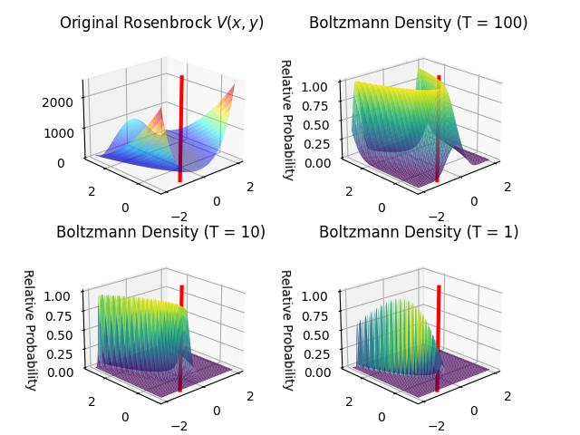
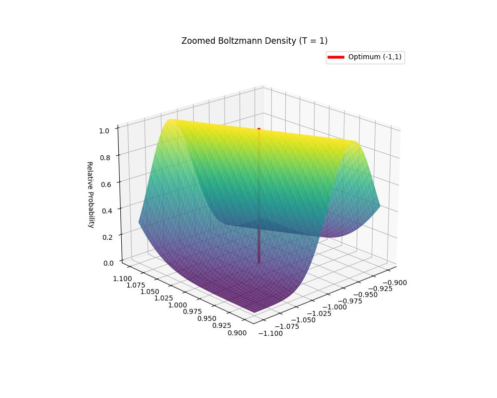

# Optimizasyon, Simulasyon


```python
import numpy as np
import matplotlib.pyplot as plt
from matplotlib import cm

def Rosenbrock(x, y):
    return (1 + x)**2 + 100*(y - x**2)**2

G = 250
x = np.linspace(-2, 2, G)
y = np.linspace(-1, 3, G)
X, Y = np.meshgrid(x, y)
Z_energy = Rosenbrock(X, Y)

temperatures = [100, 10, 1] 

fig = plt.figure()

p_opt = [-1,1]

ax1 = fig.add_subplot(2, 2, 1, projection='3d')
ax1.plot_surface(X, Y, Z_energy, rstride=5, cstride=5, cmap='jet', alpha=0.5)

line_x = [p_opt[0], p_opt[1]]
line_y = [p_opt[0], p_opt[1]]
line_z = [0, np.max(Z_energy)] # From bottom to the top of the plot
ax1.plot(line_x, line_y, line_z, color='red', linewidth=3, label='Optimum (1,1)')    

ax1.set_title("Original Rosenbrock $V(x,y)$")
ax1.view_init(21, -133)

for i, T in enumerate(temperatures):
    ax = fig.add_subplot(2, 2, i + 2, projection='3d')
    
    Z_boltz = np.exp(-(Z_energy - np.min(Z_energy)) / T)
    
    Z_boltz /= np.max(Z_boltz)
    
    surf = ax.plot_surface(X, Y, Z_boltz, rstride=5, cstride=5, cmap='viridis', alpha=0.8, edgecolor='none')
    line_x = [p_opt[0], p_opt[1]]
    line_y = [p_opt[0], p_opt[1]]
    line_z = [0, np.max(Z_boltz)] # From bottom to the top of the plot
    ax.plot(line_x, line_y, line_z, color='red', linewidth=3, label='Optimum (1,1)')    
    ax.set_title(f"Boltzmann Density (T = {T})")
    ax.set_zlabel("Relative Probability")
    ax.view_init(21, -133)

plt.tight_layout()
plt.savefig('stat_230_opt_01.jpg')
```




```python
import numpy as np
import matplotlib.pyplot as plt

x_zoom = np.linspace(-1.1, -0.9, 250)
y_zoom = np.linspace(0.9, 1.1, 250)
X_z, Y_z = np.meshgrid(x_zoom, y_zoom)
Z_energy_z = Rosenbrock(X_z, Y_z)

T = 1
Z_boltz_z = np.exp(-(Z_energy_z - np.min(Z_energy_z)) / T)
Z_boltz_z /= np.max(Z_boltz_z) # Normalize peak to 1.0

fig, ax = plt.subplots(subplot_kw={'projection': '3d'}, figsize=(10, 8))
ax.plot_surface(X_z, Y_z, Z_boltz_z, rstride=5, cstride=5, cmap='viridis', alpha=0.8)

ax.plot([-1, -1], [1, 1], [0, 1], color='red', linewidth=4, label='Optimum (-1,1)')

ax.set_title(f"Zoomed Boltzmann Density (T = {T})")
ax.set_zlabel("Relative Probability")
ax.legend()
ax.view_init(21, -133)

plt.savefig('stat_230_opt_02.jpg')
```




In a Metropolis sampler, we accept moves based on the ratio of probabilities:

$$
\alpha = \min\left(1, \frac{P(prop)}{P(curr)}\right)
$$

Since our probability is the Boltzmann distribution $P(x) \propto
\exp(-V(x)/T)$, the ratio becomes:

$$
\frac{P(prop)}{P(curr)} =
\frac{\exp(-V(prop)/T)}{\exp(-V(curr)/T)} =
\exp\left(\frac{V(curr) - V(prop)}{T}\right)
$$

```python
from numpy.random import multivariate_normal as mvn

proposal_var = 0.005
burn_in = 100
n_iters = 5000
T = 0.18  # Low temperature to push particles toward the minimum

curr = np.random.uniform(low=[-3, -3],high=[3, 10],size=2 )
min_p_coord = [0,0]
min_p_val = 1000

accepted_count = 0
for i in range(1, n_iters):    
    prop = curr + mvn(mean=np.zeros(2), cov=np.eye(2) * proposal_var)
    
    energy_curr = Rosenbrock(*curr)
    energy_prop = Rosenbrock(*prop)
    
    alpha = min(1, np.exp((energy_curr - energy_prop) / T))
    
    if np.random.uniform() < alpha:
        curr = prop
        accepted_count += 1
        
    if i > burn_in:
        if energy_curr < min_p_val:
            min_p_coord = curr
            min_p_val = energy_curr
    
print ('minimum nokta',min_p_coord)
print ('minimum deger',min_p_val)
acceptance_rate = accepted_count / n_iters
print(f"Kabul Orani: {acceptance_rate:.2%}")
```

```text
minimum nokta [-0.9798643   0.95965552]
minimum deger 0.00042834457379303055
Kabul Orani: 20.52%
```

### Parcacik Filtreleri

```python
n_particles = 1000
n_steps = 100
n_mcmc_steps = 5 
proposal_var = 0.005
T_start = 100.0
T_end = 1

particles = np.zeros((n_particles, 2))
particles[:, 0] = np.random.uniform(-3, 3, n_particles)   # Initial X
particles[:, 1] = np.random.uniform(-3, 10, n_particles)  # Initial Y

# dikkat linspace degil, geomspace, logaritmic azalma yapiliyor
temperatures = np.geomspace(T_start, T_end, n_steps)

min_val = float('inf')
min_coord = [0, 0]

for T_curr in temperatures:
    energies = Rosenbrock(particles[:, 0], particles[:, 1])
    
    step_min_idx = np.argmin(energies)
    if energies[step_min_idx] < min_val:
        min_val = energies[step_min_idx]
        min_coord = particles[step_min_idx].copy()
    
    unnorm_weights = np.exp(-(energies - np.min(energies)) / T_curr)
    weights = unnorm_weights / np.sum(unnorm_weights)
    
    indices = np.random.choice(np.arange(n_particles), size=n_particles, p=weights)
    particles = particles[indices]
    
    curr_energies = Rosenbrock(particles[:, 0], particles[:, 1])
    
    for _ in range(n_mcmc_steps):
        noise = np.random.normal(0, np.sqrt(proposal_var), size=(n_particles, 2))
        prop = particles + noise        
        prop_energies = Rosenbrock(prop[:, 0], prop[:, 1])        
        diff = (curr_energies - prop_energies) / T_curr
        alpha = np.exp(np.clip(diff, -100, 0))
        accept = np.random.uniform(size=n_particles) < alpha
        particles[accept] = prop[accept]
        curr_energies[accept] = prop_energies[accept]

print(f"Final Best Coord: {min_coord}")
print(f"Final Best Value: {min_val}")
```

```text
Final Best Coord: [-1.00018448  1.00031523]
Final Best Value: 3.2312280609237785e-07
```


[devam edecek]

