# Zaman Serileri 

Bir zaman serisi $t$ anında belli bir değeri olan veri noktalarıdır. Finans
bağlamında çoğunlukla birbirini takip eden iki veri noktası arasında bağlantı
olduğu ispatlanmıştır. Altta örnek bir zaman serisi görüyoruz; 500 senetin
ağırlıklı ortalaması olan S\&P 500 indisinin zaman göre gidişatı (düzeltilmiş
kapanış hesaplarını baz alarak),

```python
import pandas as pd
df = pd.read_csv('../tser_065_kelly/SPY2.csv',parse_dates=True,index_col='Date')
df = df.sort_index()
df = df[df.index > '1950-01-01']
```

```python
df['Adj Close'].plot()
plt.savefig('tser_intro_01.png')
```

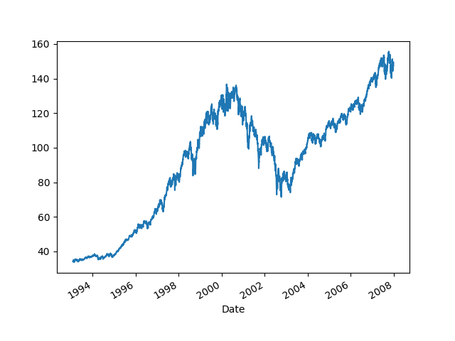

Zaman serileri hakkında önemli bir bilgi onların "getirisidir
(returns)''. Getiri hesabı $t$ ile $t-1$ arasındaki değişim oranı, yani
$X_{t}-X_{t-1}/X_{t-1}$. Bu sayıyı 100 ile çarpınca ise yüzde değişimi elde
ederiz. Pandas ile,

```python
returns = df['Adj Close'].pct_change()
print (returns.head())
```

```
Date
1993-01-29         NaN
1993-02-01    0.007022
1993-02-02    0.002034
1993-02-03    0.010728
1993-02-04    0.004303
Name: Adj Close, dtype: float64
```

İlk veri noktası `NaN` oldu çünkü bir önceki veri noktası yok.

Bu değişim oranı getiri zaman serilerinin doğasına göre bir yukarı bir aşağı
iner, çünkü arz talebe, ya da diğer sebeplere göre senet fiyatları bazen çıkar,
bazen düşer. Bir trend de olabilir tabii, bazen daha çok çıkabilir, bazen daha
çok inebilir. Tamama bakılınca ve bu *getirilerin*, dikkat fiyat veri
noktalarının değil, frekansını düşünürsek bu getirilerin bir dağılımdan geldiği
kabul edilebilir, histograma bakalım,

```python
returns.plot(kind='hist',bins=100)
plt.savefig('tser_intro_02.png')
```

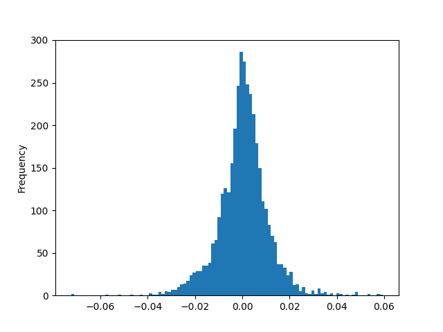

İstatistikten hatırlarsak histogram bize belli değerlerin hangi frekansla
görüldüğünü söylüyor. Bir histogram ile bir olasılık dağılımı arasında yakın
bağlantılar var, histogram bir dağılımın sayısal hali denebilir. Şekil Gaussian
dağılımına benziyor. Fakat genel bağlamda finans serilerinde tüm getirilerin
Gaussian olduğunu direk söylemek hatalı olur, bu konuyu işleyeceğiz.

Histogramı okurken şöyle çıkarımlar yapabiliriz; mesela yüzdeliklere bakarız, ve
diyelim ki yüzde 5 noktasında (histogram alanının yüzde 5'ine tekabül eden
x-eksenindeki nokta) değeri okuruz, bu değer 0.02 civarında gibi duruyor; o
zaman varılacak sonuç şöyle seslendirilebilir, "100 günün 5 gününde \%2'lik
düşüşler görülebilir''.  Bu mantıklı herhalde, çünkü bir dağılımdaki belli bir
alan o alanın x-eksenindeki değerlerin ortaya çıkma olasılığını verir. Ortaya
çıkma birimi gün ise, yüzde 5, 100 gün içinde 5 gün demektir.

Çıplak gözle bakmak yerine direk veriden bu hesabı yapabiliriz,

```python
print (returns.quantile(q=0.05))
```

```
-0.0177541105196
```

Gaussian durumu ilginç; kabaca Gaussian kabulü yapılabilir, fakat literatürdeki
çoğu yazı finans serilerinde düşüşlerin daha sert olduğunu belirtir, yani
Gaussian'da sola, negatif değerlere doğru bir yamukluk (skew) vardır. Ayrıca
fazla sayıda zaman serilerine bakıldığında her iki yönde aşırı değerlerin
Gaussian faraziyesine uymayan şekilde daha fazla olduğu tespit edilmiştir, yani
finans getirilerinin dağlımı "etekleri kabarık'' bir Gaussian'dır, daha doğrusu
Öğrenci t dağılımıdır. Fakat basitleştirme amacıyla Gaussian kullanılabilir,
tabii bu faraziyenin sınırlarını bilmek şartıyla.

Oynaklık (Volatility)

Artışların, düşüşlerin ne kadar sert, yüksek boyutta olduğunun iyi bir
göstergesi olarak oynaklık kullanılır, oynaklık üstteki Gaussian faraziyesinden
hareketle getirilerin standart sapması $\sigma$'dan (sigma) ibarettir, o zaman
tanıdığımız, bildiğimiz $\sigma$ hesabı direk burada kullanılabilir,

```python
print (returns.std())
```

```
0.010654265587
```

Üstte en soldan yüzde 5 noktasına baktık, her iki yönde tek sigma büyüklüğünde
bir getirinin Gaussian bağlamında alanın yüzde 68'ine tekabül ettiğini
biliyoruz.

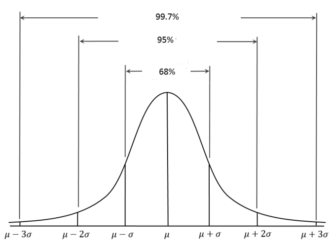

Bu demektir ki getiriler Gaussian ile dağılmışsa artı ya da eksi tek sigmalık
(ya da ondan azı olan) değişimlerin olasılığı yüzde 68'dir. İki sigmalık (ve
daha azı) büyüklüğünde getirilerin olasılığı yüzde 95'tır.

Günlükten yıllığa geçmek için getiriler için direk 256 ile çarpılır, bir yıl
içinde aşağı yukarı 256 tane iş günü vardır. Standart sapma geçişi için
$\sqrt{256}$ yani 16 ile çarpmak gerekir. Bazıları 252 kullanıyor, çünkü NYSE
borsasında 252 günde alışveriş yapılabilir. Karekök basitliği sebebiyle bizce
256 daha uygun.

Niye $\sqrt{252}$ ile çarpıyoruz? Bu durum varlık fiyat zaman serisinin Brownian
yürüyüş olmasıyla alakalı. BM serilerinde varyans $t$ ile doğru orantılıdır,
yani başlangıç noktasından ne kadar uzaklaşırsak varyans o kadar büyür, çünkü
her adımdaki varyans toplanır (oynaklık standart sapmadır, ki bu varyansın
kareköku o sebeple zamanın kareköku ile çarpıyoruz). *Olasılıksal Calculus*
yazısında bu matematiği görüyoruz. Kabaca düşünmek gerekirse BM 'sarhoş
yürüyüşü' ise ve bu yürüyüş her adımda rasgele bir hareket yapıyorsa, bu adımlar
toplana toplana tabii ki başlangıç noktasından bizi çok uzak noktalara
taşıyabilir (ve geri getirebilir).

Kabaca borsacılar bilir ki senetlerin yıllık standart sapması \%20 civarıdır,
daha güvenli olan tahvillerin ise \%1.5. Kaldıraç, yani borç kullanıldığı zaman,
mesela 10 kat kaldıraç olduğunu düşünelim, bu oynaklığı 10 ile çarpmak
demektir. Normal bir hisse için 10 kat kaldıraç sizi yıllık sigma \%200'e
seviyesine getirir, bu günde \%200 / 16 = \%12.5 demektir. Eğer getirimiz son
derece iyimser bir bakışla yılda \%200 olsaydı, bu günlük \%0.8 olurdu (256 ile
böldük) ve ters yönde bir sigma'lık düşüş geldiği anda 0.8-12.5=-\%11.7'ı
görürdük, diğer yönde 0.8+12.5=\%13.3. Fakat bu demektir ki günlük getiriler 100
günün 68'inde -\%11.7 ile \%13.3 arasında gidip geliyor, 95'inde \%-24.2 ile
\%25.8 arasında gidip geliyor. O zaman günlerin 100-95=\%5'inde bu bantın her
iki taraftan dışında (en azdan daha az, en fazladan fazla) rakamlar göreceğiz
demektir, 5/2=\%2.5 kadar zamanda \%-24.2'dan daha fazla düşüş olacak demektir
bu! 100 günde 2.5 demek, 40/1 oran anlamına geliyor, bir ay içinde 20 işgünü
olduğuna göre bahsedilen olayın aşağı yukarı iki ayda bir ortaya çıkması
muhtemeldir. Yani iki ayda bir günde -\%24.2'lik getiri kaybı! Bu frekans olarak
çok ciddi bir kayıptır, ve psikolojik olarak yatırımcıyı rahatsız edecektir. Bu
noktaya nasıl geldiğimizi hatırlayalım, son derece iyimser bir getiri, 10 kat
seviyesinde bir kaldıraçla başlamıştık.

Sharpe Oranı (Sharpe Ratio)

Sharpe oranı (SO) bir işlem stratejisinin, ya da bir varlığı elde tutmanın, ki
basit olsa bile bu da bir strateji, ne kadar karlı olacağını ölçek bir
hesaptır. Hesaplamak için getirileri riske göre uyarlarız. Formel olarak
getirinin ortalamasını aynı periyottaki standart sapmaya böleriz. Bu bize günlük
SO verir, yıllığı hesaplamak için $\sqrt{256}$ ile çarpmak gerekir. 

Rasgele Yürüyüş (Random Walk)

Senet fiyatlarının rasgele yürüyüşe göre hareket ettiği söylenir. Modelin
bir şekli

$$ y_t = y_{t-1} + z $$

ki $z \sim N(0,\sigma)$. Formülü alttaki şekliyle görürsek daha açık olabilir,
$Z_1,Z_2,..,$ bağımsız özdeşçe dağılmış (independently, identically distributed
-iid-), ortalaması $\mu$, standart sapması $\sigma$ olan dağılımlar olsun, ve
herhangi bir başlangıç noktası $X_o$'dan $t$ anında gelinen nokta

$$ X_t = X_0 + Z_1 + Z_2 + ... + Z_t , t \ge 1$$

olarak belirtilebilir. Her $t$ anında bir rasgele değişkene göre bir yere
savruluyoruz. Modele dikkat, önceki veri noktası ile bir korelasyonumuz yok, her
noktada zar atılıyor, başka hiçbir şey yapılmıyor.

$X_t$ bu durumda bir rasgele yürüyüştür, ve adımları $Z_1,Z_2,..$'dir. Eğer
adımlar normal olarak dağılmış ise, sürece normal rasgele yürüyüş adı
verilir. $X_0$ verildiği / bilindiği durumda $X_t$'nin beklentisi ve varyansı,

$$ E(X_t|X_0) = X_o + \mu t $$

$$ Var(X_t|X_0) = \sigma^2 t $$

Varyans için bağımsızlık durumunda $Var(X+Y) = Var(X)+Var(Y)$ olduğunu
hatırlayalım, varyans toplamları $\sigma t$ olur, sabit $\sigma$ varyans dışına
karesi alınmış olarak çıkar. Sabit $X_0$ zaten yokolur, onun varyansı yoktur.

Bu modelin bir diğer ismi Brown Hareketi (Brownian Motion), $\mu$ parametresi
kaymadır (drift), tüm zaman serisine bir genel yön verir. Kaymanın tanımlandığı
duruma Kaymalı Brown Hareketi (Brownian Motion with Drift) ismi verilir.

Simüle edelim, iki tane $\mu=0$, iki tane $\mu=0.5$ ile. 

```python
import statsmodels.api as sm
import pandas as pd
```

```python
np.random.seed(0)
def random_walk(i,mu=0):
    Z_s = np.random.normal(loc=mu,scale=1.0,size=100)
    X_0 = 10
    X_t = X_0 + Z_s.cumsum()
    plt.plot(X_t)
    plt.title('Rasgele Yürüyüş %d' % i)
    plt.savefig('tser_stoc_0%d.png' % i)
    plt.hold(False)
random_walk(1)
random_walk(2)
random_walk(3,mu=0.5)
random_walk(4,mu=0.5)
```

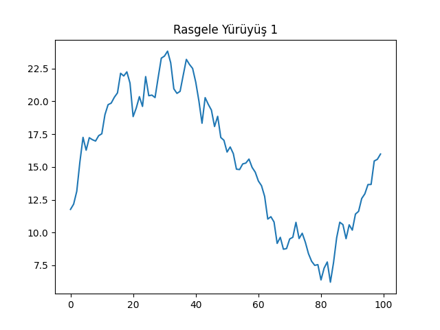

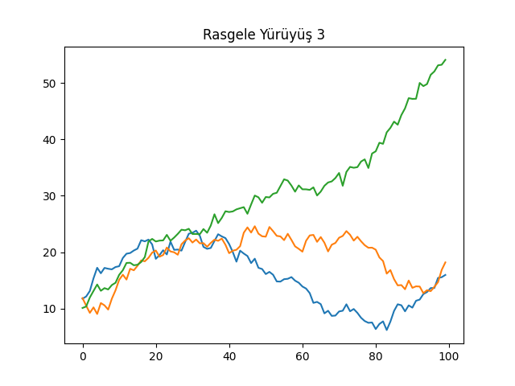
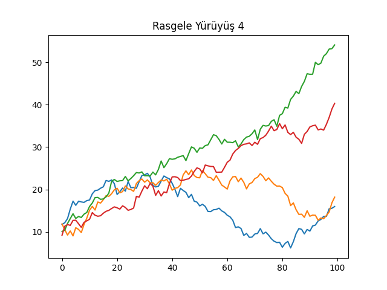

Görüldüğü gibi rasgele yürüyüş üretimini sağlayan çağrıya $\mu$ haricinde (bir
de dokümantasyon amaçlı bir indis) haricinde başka hiçbir parametre vermedik,
yani aynı kod arka arkaya dört kez işledi, ama herbirinde aynı başlangıç değeri
olmasına rağmen tamamen farklı görüntüler çıktı. Görüntüler borsadaki senet
fiyatlarını da andırıyor!

Her adımda Gaussian gürültü eklendiği için veri analizi yaparken Guassian'lığı
fiyatların getirisi / farkında görmek mümkündür. Günlük bazda diyelim artış /
azalışın histogramını alırsak, ünlü can eğrisini elde ederiz. Tabii şunu da
eklemek lazım, değişimin dağılımı "tam olarak'' Gaussian kabul edilmiyor, bu
dağılımın "etekleri daha kabarıktır'', yani ekstrem değerler Gaussian'a göre
daha muhtemeldir. Bu dağılımın Öğrenci t (Student t) dağılımı olduğu
söylenir. Fakat kolaylık açısından, kriz şartlarına dikkat etmek koşuluyla,
Gaussian kullanılabilir.

Bağımlılık

Genel İstatistik öğrenirken çoğunlukla veri noktalarının birbirinden bağımsız
olduğunu farzettik, mesela regresyon durumunda eğer $X_i$ biliniyorsa her $Y_i$
birbirinden bağımsızdı, ayrıca $X_i$'ler birbirinden bağımsızdı. Çok değişkenli
durumda veri noktalarının öğelerinin birbiriyle çetrefil şekilde alakalı olma
durumunda bile veri noktalarının birbirinden bağımsız olduğunu farzettik. Şimdi
bu faraziyeyi gevşeteceğiz, yani ayrı veri noktaları arasında bağımlılık
durumuna bakacağız.

Bağımlı verilere en iyi örnek zaman serileridir, ve bu veri tipi aynen isminin
çağrıştırdığı gibi bir değerin bir zaman süreci içinde kaydedilmiş değerleri
olacaktır. İstatistik uygulamalarında bu durum çoğunlukla bir $X$ değişkeninin
$t$ anından başlanarak eşit zaman aralıklarında, mesela $h$ aralıklarıyla
değerinin kaydedilmesiyle ortaya çıkabilir, $X_t,X_{t+h},X_{t+2h},...$ gibi..

Altta iki tipik zaman serisi görüyoruz. Bunlardan ilki yapay olarak üretilmiş,
ikincisi Kanada'nın bir bölgesinde her sene yakalanan lynx (orta boylu bir kedi
türü) sayısı baz alınarak yaratılmış. Bu verilerin dalgalanış şekilleri, kabaca
gidişatları, vs. aslında birbirlerine çok benziyor.

```python
def logistic_map(x,r=4): return r*x*(1-x) 
def logistic_iteration(n,x_init,r=4):
   x = [0 for i in range(n)]
   x[0] = x_init
   for i in range(n-1): x[i+1] = logistic_map(x[i])
   return x
n = 1000
x = logistic_iteration(n, x_init=0.01)
y = x + np.random.normal(size=n,loc=0.,scale=0.05)
plt.title('Yapay Veri')
df_artificial = pd.DataFrame()
df_artificial['y'] = y
df_artificial.y[:100].plot()
plt.savefig('tser_stoc_05.png')
```

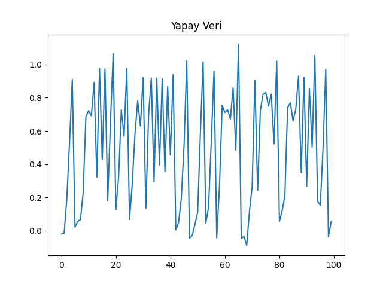

```python
import pandas as pd
df = pd.read_csv('lynx.csv',index_col=0)
df.plot()
plt.title('Lynx')
plt.savefig('tser_stoc_06.png')
```

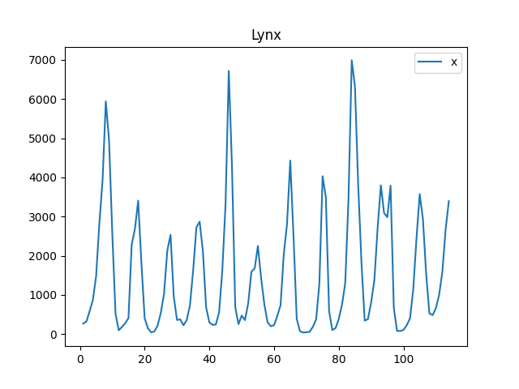

Soru: Yapay veriyi üretirken niye lojistik harita (logistic map) kullandık?
Cevap: Hoca [1] herhalde hem birbirine bağımlı noktalar yaratmak, hem de onların
biraz "kaotik'' olmasını istedi, ki lojistik harita kaos matematiğinde iyi
bilinen bir fonksiyondur.

Zaman serisi analizinde yapmaya çalıştığımız İstatistiğin geri kalanından bize
tanıdık: önümüzde gördüğümüz zaman serisini, o seriyi üreten, görmediğimiz,
yarı-rasgele ("stochastic'') bir süreçten alınmış bir yansıma / oluş
(realization) olarak görmek, önümüzdeki veriyi bu süreç hakkında tahminler
(çıkarsama / inference) yapmak için kullanmak, ve bu tahminlerin, rasgeleliğini
açıkça belirledikten sonra güvenilir olması için uğraşmak. İşimizi zorlaştıran
her gözlemin / veri noktasının birbiri ile bağlantılı olması; diğer yandan çoğu
zaman üzerinde çıkarsama yapmak istediğimiz şey de aslında bu bağlantının ta
kendisi.

Notasyon

Eşit aralıklı örneklenmiş zaman serisini göstermek için indeks olarak
zamanın kendisini kullanmak yerine (mesela 1920 senesinde, 1921 senesinde,
vs demek yerine) her öğenin seri içindeki yerini kullanmak daha rahattır,
$X_1,X_2,..$ gibi. Buradan hareketle bir kısayol notasyonu şudur: bir zaman
blokunu göstermek için $X_i^j = (X_i,X_{i+1},...,X_{j-1},X_j)$.

Durağanlık (Stationarity)

Tablosal dünyamızda durum nasıldı? Her biri birbirinden bağımsız ama aynı
dağılımlı (IID) veri noktalarımız var, bu bize analizde bazı faydalar
sağlıyor. Zaman serileri için de benzer bir aynılık özelliğinin olması iyi olmaz
mıydı?  Böyle bir özellik var, ve ismi durağanlık. Kelimenin anlamı zaman
serisinin hiç değişmediği anlamına gelmiyor tabii, onun *dağılımının*
değişmediği anlamına geliyor.

Daha kesin bir şekilde belirtmek gerekirse, eğer tüm $k,t$ için $X_1^k$ ve
$X_t^{t+k-1}$ aynı dağılıma sahipse bu zaman serisi $X$'in güçlü durağan
(strongly stationary), ya da kesin durağan (strictly stationary) olduğu
söylenir, yani $k$ büyüklüğündeki blokların dağılımı zamana bağlı değildir
(time-ınvariant). Tekrarlamak gerekirse bu tüm blokların aynı değerlere sahip
olduğu anlamına gelmez, sadece aynı dağılıma sahip olduğu anlamına gelir.

Çoğunlukla finans zaman serileri durağan olmaz, ama serinin değişimi, yani $t$
ile $t-1$ arasındaki fark durağan olabilir, arada bir log transform da da
gerekebilir. İstatistiki modelleme açısından bu işlemlerin pek negatif bir
etkisi yoktur, her halükarda ise yarar bir model elde ederiz.

Durağan süreçlerin güzel tarafı şudur, onları çok az parametre ile
modelleyebilirsiniz. Mesela her $X_t$ için farklı bir beklentiye (expectation)
ihtiyaç yoktur, hepsinin beklentisi aynıdır, $\mu$. Bu demektir ki $\mu$'yu
$\bar{X}$ ile doğru doğru bir şekilde kestirmek (estimate) mümkündür.

Eh bir "güçlü'' durağanlık varsa, herhalde bir "zayıf'' durağanlık ta
olmalı.. Hakikaten de bu var. Zayıf durağanlık için tek gereken şartlar $E(X_1)
= E(X_t)$ ve $Cov(X_1,X_k) = Cov(X_t,X_{t+k-1})$ olması. Dikkat, bu şart için
bloklar üzerinden değil tek veri noktaları üzerinden bir beyan yapıyoruz. Doğal
olarak güçlü durağanlık aynı zamanda zayıf durağanlık ta olduğunu söyler (bunu
egzersiz olarak doğrulayabilirsiniz) , fakat çoğunlukla bu eşitlik ters yönde
geçerli değildir.

Kendisiyle Korelasyon (Autocorrelation) 

Zaman serileri çoğunlukla zincirleme olarak bağlantılıdır, yani $X_t$ noktası
kendinden önceki ve sonraki tüm değerler ile bağlantılıdır. Fakat bu bağlantı
her mesafede aynı etkide değildir, çoğunlukla bir bağlantı kaybı (decay of
dependence) durumu sözkonusudur (bazen korelasyon kaybı -decay of correlations-
ismi de veriliyor), yani $h \to \infty$ iken $X_t,X_{t+h}$ değişkenleri
birbirinden gittikçe daha çok neredeyse tam bağımsız hale gelir (kelimelendirme
kritik, hoca tam bağımsız olur demiyor, çok az bağımlılık hala kalabilir, ama
aralık büyüdükçe, hatta sonsuzluğa yaklaştıkça bağımsızlık artar, neredeyse tam
bağımsızlık haline gelir).

Bu durumu ölçmenin bilinen en eski yöntemi kendisiyle koveryans (dikkat
korelasyon değil) ölçütüdür,

$$ \gamma(h) = Cov(X_t,X_{t+h}) $$

Aynı şekilde kendisiyle korelasyon (autocorrelation) da kullanabilirdik, 

$$ 
\rho(h) = \frac{Cov(X_t,X_{t+h}) }{Var(X_t) } = \frac{\gamma(h)}{\gamma(0)}
$$

Korelasyon tanımından üstteki ilk eşitliğe nasıl geldik? Korelasyon bilindiği
gibi

$$ \frac{Cov(X_t,X_{t+h}) }{\sqrt{Var(X_t)}\sqrt{Var(X_{t+h})} } $$

Daha önceki zayıf durağanlık tanımından,

$$ Cov(X_1,X_k) = Cov(X_t,X_{t+k-1}) $$

Eğer $k=1$ olsaydı, 

$$ Cov(X_1,X_1) = Cov(X_t,X_t) = Var(X_1) = Var(X_t)$$

Bu ifadenin her $t$ için doğru olması gerektiği için $Var(X_t) = Var(X_{t+h})$
diyebiliriz. O zaman korelasyon şu hale gelir,

$$
\frac{Cov(X_t,X_{t+h}) }{\sqrt{Var(X_t)}\sqrt{Var(X_t)} }  =
\frac{Cov(X_t,X_{t+h}) }{Var(X_t)} 
$$

Sağ taraftaki eşitliğe gelelim: sadece $\gamma$ formu kullanmaya uğraşalım,
$h=0$ dersek $\gamma(0) = Cov(X_t,X_{t+0}) = Cov(X_t,X_t)$ elde ediliyor ve
bilindiği gibi $Var(X_t)=Cov(X_t,X_t)$. O zaman

$$ \frac{Cov(X_t,X_{t+h}) }{Var(X_t)} = \frac{\gamma(h)}{\gamma(0)} $$

Daha önce belirttiğimiz gibi çoğu zaman serisi için $h \to \infty$
$\gamma(h) \to 0$. 

Python Pandas ile korelasyon grafiği şöyle basılır,

```python
fig = plt.figure(figsize=(12,8))
plt.hold(True)
ax1 = fig.add_subplot(211)
fig = sm.graphics.tsa.plot_acf(df.values.squeeze(), lags=40, ax=ax1)
ax2 = fig.add_subplot(212)
fig = sm.graphics.tsa.plot_pacf(df, lags=40, ax=ax2)
plt.savefig('tser_stoc_07.png')
```


```python
fig = plt.figure(figsize=(12,8))
plt.hold(True)
ax1 = fig.add_subplot(211)
fig = sm.graphics.tsa.plot_acf(df_artificial.values.squeeze(), lags=40, ax=ax1)
plt.hold(True)
ax2 = fig.add_subplot(212)
fig = sm.graphics.tsa.plot_pacf(df_artificial, lags=40, ax=ax2)
plt.savefig('tser_stoc_08.png')
```

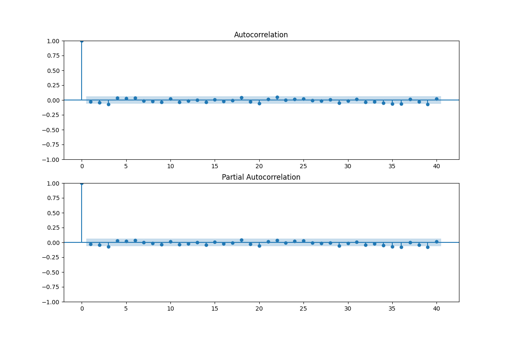

Üstteki her iki verinin de kendisiyle korelasyonunu görüyoruz. İlginç bir durum
ortaya çıktı, yapay zaman serisinin kendisiyle korelasyonu neredeyse hep sıfır
etrafında, yani hangi aralığı baz alırsak alalım, iki veri noktası arasındaki
bağlantı çok az. Bu durum serinin ilk grafiğini düşününce garip
geliyor. Hakikaten bir acaiplik var, bu şeride bir takım bağlantılar olduğunu
$X_{t+1},X_t$ grafiğini basarak bile görebiliriz,

```python
df_artificial['lagged_y'] = df_artificial.y.shift(-1)
df_artificial.plot(kind='scatter',x='y',y='lagged_y')
plt.title('Yapay')
plt.savefig('tser_stoc_09.png')
```

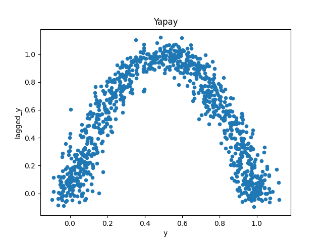

```python
df['lagged_x'] = df.x.shift(-1)
df.plot(kind='scatter',x='x',y='lagged_x')
plt.title('Lynx')
plt.savefig('tser_stoc_10.png')
```

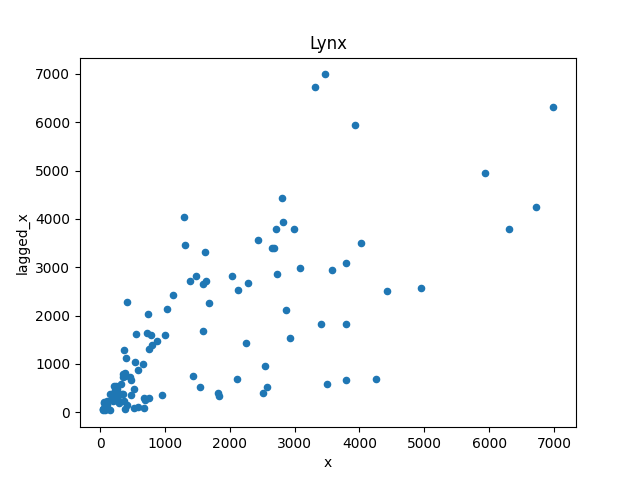

Yani kendisiyle korelasyon her zaman gerekli bilgiyi vermeyebilir, ama bilinmesi
iyi olur. Daha genel ölçütler mesela Spearman $X_{t+h},X_t$ kerte korelasyonu
(Spearman rank-correlation) ya da ortak bilgi (mutual information) gibi
ölçütler.

Ama aslında kendisiyle korelasyonun önemli olmasının 4 sebebi var. İlki, bu
ölçüt istatistikteki en eski ölçütlerden biri, yani "kullanıcı bazı'' geniş,
herkes kendisiyle korelasyon hakkında birşeyler biliyor, iletişimde bu kavramı
kullanıyorlar, ve gelip size bu ölçüt hakkında birşeyler soracaklar. İkincisi,
son derece nadir bir durum olan Gaussian süreçleri durumunda kendisiyle
korelasyon size hakikaten bilmeniz gereken *herşeyi* söyler. Üç, birazcık
daha az nadir olan lineer tahmin durumunda yine bilmemiz gereken herşeyi bize
söyler. 

Kaynaklar

[1] Carver, *Systematic Trading*

[2] Macrooption, *Why Is Volatility Proportional to the Square Root of  Time*,
    [https://www.macroption.com/why-is-volatility-proportional-to-square-root-of-time/](https://www.macroption.com/why-is-volatility-proportional-to-square-root-of-time/)


