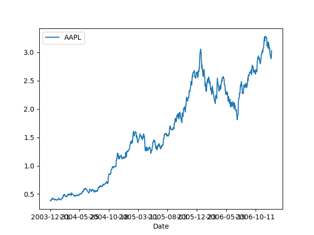
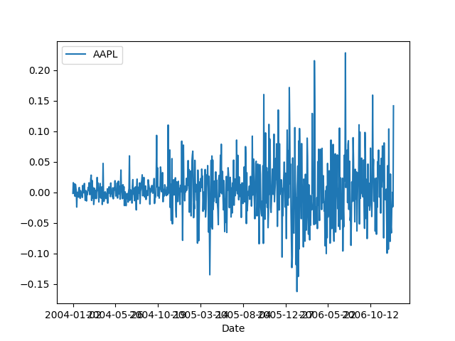
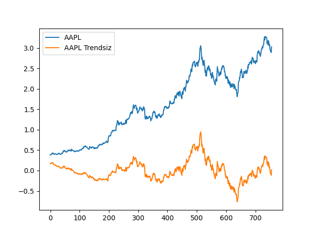
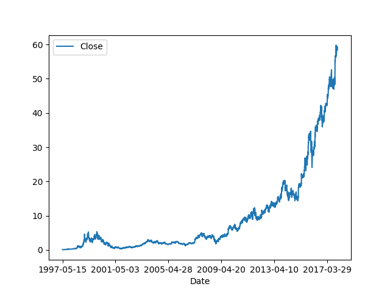
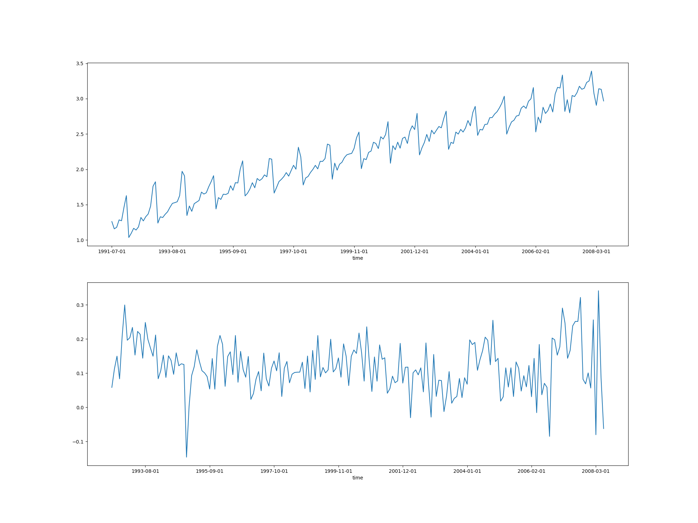

# Zaman Serisi Veri Analizi

Daha fazla ilerlemeden bu yazıda bazı veri işlem numaraları göreceğiz.

Durağanlık

Yapay Öğrenim (machine learning) ya da diğer istatistiki tahminsel yaklaşımlar
çoğunlukla işledikleri verinin durağan olmasının beklerler [1]. Durağanlık zaman
serisindeki her veri noktasının diğerleri ile aynı dağılıma sahip olması
demektir. Bu durum yoksa algoritmalar iyi çalışmayabilir. Zaman serilerinde
durağanlık olmaması pek çok kez ortaya çıkar; serilerde bazen sezonsallık
vardır, bazen trend mevcuttur vs. O zaman durağan olmayan serileri durağan hale
getirmek zaman serisi analizinde önemli bir kabiliyettir.

Şimdi alttaki resimlere bakalım ve hangisinin durağan olduğunu tahmin etmeye
uğraşalım. 


Durağan serilerin sabit varyansı olduğuna göre a,c,e,f ve i resimlerini
atabiliriz. Bu seriler ya net bir yukarı ya da aşağı trend içeriyorlar ya
da seviyelerde değişim var, mesela f örneğindeki gibi.

d ve h içinde sezonsal kalıplar var, onları da atıyoruz. Ya peki g?  Sanki
sezonsal bir kalıp varmış gibi duruyor fakat bu doğru değil. Bu seri doğadaki
bir canlının nüfusunu gösteriyor, yiyecek azalınca canlılar azalıyor, yiyecek
varsa nüfus artıyor, bu tür tekrar eden bir süreç sezonsallıkla aynı şey
değil. Sezonsallık varsa herhangi bir zaman diliminde ne olacağını kesinlikle
biliyoruz. Kıyasla nüfus artış azalış tekrarı tahmin edilebilir değil.

O zaman eldeki tek durağan seri b ve g.

Testler

Durağanlığı bulmak için bazı istatistiki testler var, bu testlere birim kök
(unit root) testleri adı veriliyor, en popüleri olanı eklemlenmiş Dickey-Fuller
testi. Bu teste göre sıfır hipotezi serinin durağan olmadığıdır, o zaman bu
hipotez reddedilirse, mesela 0.05, ya da 0.01'den az bir p-değeri elde edilirse,
bu demektir ki elde bir durağan seri var. 

Örnek olarak elmas verisine bakalım,

```python
import seaborn as sns
from statsmodels.tsa.stattools import adfuller
diamonds = sns.load_dataset("diamonds")
test_results = adfuller(diamonds["price"])
print(f"ADF test statistic: {test_results[0]}")
print(f"p-value: {test_results[1]}")
print("Critical thresholds:")
for key, value in test_results[4].items():
    print(f"\t{key}: {value}")
```

```text
ADF test statistic: -8.114930668315607
p-value: 1.1980457313376217e-12
Critical thresholds:
	1%: -3.430471308341908
	5%: -2.8615936158814588
	10%: -2.566798537945544
```

p-değerine bakıyoruz, neredeyse sıfır. O zaman H0 reddedildi, seri durağan.

Şimdi büyük ihtimalle durağan olmayan bir seriye bakalım, Apple şirketinin
hisse senet fiyati bu,

```python
import pandas as pd
df = pd.read_csv('AAPL.csv',index_col=0)
df.plot()
plt.savefig('tser_008_data_04.png')
```



Şeride açık bir yukarı doğru trend var. Test edelim,

```python
adfuller(df)[1]
```

```text
Out[1]: np.float64(0.9069640607490215)
```

Sıfırdan çok uzak bir p-değeri bu, demek ki seri durağan değil.

Bir seriyi durağan hale getirmek için kullanılan en basit yöntem fark almaktır,
yani serideki her veri noktasını bir öncekinden çıkartmak. Mesela üstteki AAPL
senet verisi için bunu yaparsak ve testi tekrar uygularsak,

```python
import pandas as pd
d1 = df.diff().dropna()
d1.plot()
plt.savefig('tser_008_data_03.png')
```



```python
from statsmodels.tsa.stattools import adfuller
adfuller(d1)[1]
```

```text
Out[1]: np.float64(9.132206809895174e-19)
```

p-değeri çok küçük, demek ki farkı alınmış seri durağan hale geldi.

Peki fark alarak hangi matematiksel işlemi uygulamış oluyoruz? Bu işlemin ne
olduğunu görmek zor değil, fark alma işlemlerini bir türevin yaklaşık hali
olarak görebiliriz,

$$
\frac{f(x)-f(x+\Delta)}{\Delta}
$$

ki $\Delta$ değerleri 1'de sabitlenmiş oluyor (ve yokolur) ve bir sonraki
$f(x)$'e ulaşmak için sabit artış farzedersek o zaman zaman serisinde fark almak
bir tür türev almakla eşdeğerdir [2]. Bu sebeple basit fark işlemi trendi
çıkartır, eğer elde gürültülü bir $y = ax + b$ var ise türev sonrası (gürültülü)
$a$ elde edilmesi gibi..

Fark işlemleri birkaç derecede yapılabilir, mesela iki kez türev almaya
eşdeğer olan farkın farkını almak, `diff(periods=2)` ile yapılabilir.
Birkaç örneği yanyana görelim,

```python
pd.set_option('display.max_columns', None)
df = pd.read_csv('AAPL.csv',index_col=0)
df['diff_1'] = df.AAPL.diff(periods=1)
df['diff_2'] = df.AAPL.diff(periods=2)
df['diff_3'] = df.AAPL.diff(periods=3)
print (df[['diff_1','diff_2','diff_3']])
```

```text
              diff_1    diff_2    diff_3
Date                                    
2003-12-31       NaN       NaN       NaN
2004-01-02 -0.001607       NaN       NaN
2004-01-05  0.015893  0.014286       NaN
2004-01-06 -0.001429  0.014464  0.012857
2004-01-07  0.008929  0.007500  0.023393
...              ...       ...       ...
2006-12-22 -0.025000 -0.091429 -0.146786
2006-12-26 -0.024643 -0.049643 -0.116072
2006-12-27  0.000358 -0.024285 -0.049285
2006-12-28 -0.023215 -0.022857 -0.047500
2006-12-29  0.141786  0.118571  0.118929

[756 rows x 3 columns]
```

Tabii gürültülü bir veride yaklaşık bir işlem yapıyoruz, eğer hakikaten trendi
genel eğim üzerinden çıkartmak istersek, veri üzerinde lineer regresyon
yapabilirdik ve regresyon eğrisini ana seriden çıkartabilirdik,

```python
import pandas as pd
df = pd.read_csv('AAPL.csv').reset_index()
import statsmodels.formula.api as smf
results = smf.ols('AAPL ~ index', data=df).fit()
df['AAPL Trendsiz'] = results.resid
df[['AAPL','AAPL Trendsiz']].plot()
plt.savefig('tser_008_data_02.png')
```



Trend çıkarılmış grafik için `resid` verisi kullanıldı çünkü bu değişken
içinde model ile gerçek değerler arasındaki fark, 'artıklar' gösteriliyor, ki bu
dolaylı olarak veriden trend çıkartılmış hal demektir.

Gayri-Lineerlik

Fakat her dağılım bu kadar kolayca idare edilemeyebilir. Mesela alttaki
zaman serisine bakalım, bu Amazon şirketinin hisse senet fiyatları,

```python
import pandas as pd
df = pd.read_csv('AMZN.csv',index_col=0)
df.plot()
plt.savefig('tser_008_data_06.png')
```



Bu seride fark almadan önce bariz olan gayrı lineerligi göz önüne almamız
gerekiyor, yoksa fark aldıktan sonra bile seri durağan olmaz. Gayri-lineerligi
çıkartmak için logaritmik fonksiyon kullanılabilir, ondan sonra fark alınır.

```python
transformed_amzn = np.log(df).diff().dropna()
transformed_amzn.plot(figsize=(14, 4));
plt.savefig('tser_008_data_07.png')
```


Gayri lineerligi çıkartmak ile log alakası nedir? Bildiğimiz gibi
nüfus artışı, gelir dağılımı gibi pek çok ölçüm mevcut seviyeye bağlı
olarak artan serilerdir, ve orada bir üstel bağlantı vardır, $e^{ax}$
gibi.. Bu tür serileri lineerize etmek için üstel fonksiyonu nötralize
etmek gerekir bu da onun tersi olan log fonksiyonu ile yapılabilir.

Sezonsallık

```python
drugs = pd.read_csv("drug_sales.csv", index_col=0)
drugs.value.plot(figsize=(20, 5))
plt.xlabel("Sene")
plt.ylabel("Satılan Miktar (milyon)");
plt.savefig('tser_008_data_05.png')
```


Bu seride hem yukarı doğru bir trend, hem de güçlü sezonsallık var.  Burada
tekrar log uygulayacağız ve sezonsallığı çıkartmak için sene farkı alacağız,
seri aylık ölçüde olduğuna göre 12 adımlık fark alırsak senesel sezonsallığı
çıkartmış oluruz.


```python
fig, ax = plt.subplots(2, 1, figsize=(20, 15))
drugs = pd.read_csv("drug_sales.csv", index_col=0)
drugs['log'] = np.log(drugs['value'])
drugs['logdiff'] = np.log(drugs['value']).diff(periods=12)
drugs.log.plot(ax=ax[0])
drugs.logdiff.plot(ax=ax[1])
plt.savefig('tser_008_data_08.png')
```



Durağanlığı ispat etmek için testi uygulayalım,

```python
from statsmodels.tsa.stattools import adfuller
adfuller(drugs.logdiff.dropna())[1]
```

```text
Out[1]: np.float64(8.209874468611811e-06)
```

Bu çok ufak bir değer demek ki seri durağan hale geldi, transformasyonlar
ise yaradı.

Fakat akılda tutalım ki her zaman serisi farklıdır ve durağanlığa erişmek için
farklı operasyonları ardı ardına zincirleme kullanmak gerekebilir.  Fakat bu
işlemler çoğunlukla logarıtma almak, birinci, ikinci derece ya da sezonsal fark
almak olacaktır.

Not: Bu yazıdaki anlatım konuya daha pür verisel yaklaştı, ilk bakılan veride
yapılabilecek ilk işlemleri gördük bir bakıma. Durağanlık, sezonsallık,
kendisiyle korelasyon hakkında daha derin detaylar [3,4,5,6] yazılarında
bulunabilir.

Kaynaklar

[1] Bexgboost, *How to Remove Non-Stationarity From Time Series*,
    [https://www.kaggle.com/code/bextuychiev/how-to-remove-non-stationarity-from-time-series?scriptVersionId=73876070](https://www.kaggle.com/code/bextuychiev/how-to-remove-non-stationarity-from-time-series?scriptVersionId=73876070)

[2] Stackexchange,
    [https://stats.stackexchange.com/questions/200517/why-does-differencing-once-remove-not-only-linear-but-also-nonlinear-trends](https://stats.stackexchange.com/questions/200517/why-does-differencing-once-remove-not-only-linear-but-also-nonlinear-trends)

[3] Bayramlı, *Zaman Serileri, Rasgele Yürüyüş Testleri*

[4] Bayramlı, *Zaman Serileri, ARIMA, ARCH, GARCH, Periyotlar, Yürüyen Ortalama*

[5] Bayramlı, *Zaman Serileri,Sezonsallık, Periyotlar*

[6] Bayramlı, *Zaman Serileri, Durağanlık ve Testler*


