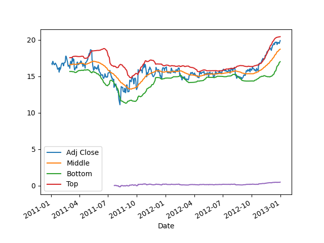

# Portföy Performansı

Bir stratejiyi tasarladıktan sonra onu piyasada kullanmadan önce geriye dönük
veri üzerinde testten geçirmek iyi olur. Hatta mevcut işlemekte olan bir
stratejinin o ana kadar olan başarısını da aynı tekniklerle ölçebilmek
faydalı olurdu.

Geriye Dönük Testler (Backtesting)

Stratejinin başarısını ölçmek için bazı kriterler var, Sharpe Oranı, Düşüş
Kalıcılığı bu ölçütlerden bazıları.

Sharpe Oranı 

Diyelim ki bir stratejiyi geriye dönük teste tabi tutuyoruz, yani tarihi veri
üzerinde ileride ne olacağını "bilmiyormuş gibi'' yapıp alışverisin
performansının ne olacağını ölçüyoruz. Belli zamanlarda alınıp satılan varlığın
tabii ki bir getirisi (return) olacaktır, getiri eksi de olabilir, yani
kayıp. Bu getirinin istatistiki olarak önemli (significant) olup olmadığını
anlamak için bazı testler uygulayabiliriz. Diyelim ki herhangi bir zaman
$t$'deki getiri $R_t$, ve $\mu = E(R_t), \sigma^2=Var(R_t)$ - her $t$ için
dağılım aynı ve bağımsız (IID). Zaman bir günü temsil ediyor olabilir, ve eğer
veri bunu doğruluyorsa, getirilerin Gaussian olduğu faraziyesi de
yapılabilir. IGE verisi için

```python
import pandas as pd
ige = pd.read_csv('IGE.csv',index_col='Date')
ige = ige.sort_index()
ige['Returns'] = ige['Adj Close'].pct_change()
ige.Returns.hist()
plt.savefig('tser_back_01.png')
```


Varlığın "getirisi'' dedik, üstteki durumda sanki varlığı en başta alıp
elde tutmuşuz gibi düşünüyoruz, bu durumda günlük yüzde değişimler o gündeki
kazanç / kayıp gibi düşünülebiliyor. 

Baştaki soruya gelelim, getirinin sıfırdan farklı mı, ve bu farklılık
istatistiki olarak önemli mi?

Sharpe Oranı (Sharpe Ratio) bu noktada devreye girer. SO "risk bazında
ölçeklenmiş getiri'' diye adlandırılır bazen, yani birimi oynaklık (volatility)
olan getiridir. Birim derken mesela hızı belirtmek için arabanın hızı saatte 60
km diyebiliyoruz, hızı saat bazında belirtmiş oluyoruz. Bu demektir ki 1 saat
geçince alınan yol 60 kilometredir. SO için benzer durum geçerli, birim risk, o
zaman SO rakamı "riskteki yüzde 1'lik değişimin getiriye ne kadar etki
edeceği'' olarak ta görülebilir.

Eğer yıllık bazda getirilerin standart sapması (ki oynaklığın tanımı bu) yüzde
20 ise ve mesela borsadan / bir senetten / entrumandan yüzde 3'lük bir yıllık
getiri bekliyorsak, \%3 / \%20 = 0.15 Sharpe oranını elde ederiz. Matematiksel
olarak,

$$ SR = \frac{E(R_t) - R_f}{\sqrt{Var(R_t)}} = \frac{\mu - R_f}{\sigma} $$

$R_f$ "risksiz yatırım'' dır, yatırım sratejinizin finans edilmesi
gerekiyor ve bu sebeple para yatırımda bağlı tutuluyorsa, risksiz yatırımın
getirisinin çıkartılması gerekir (çünkü yatırım yapmayıp risksiz getiri
elde edebilirdiniz, gerçek getiri riskliden risksizin çıkartılmış hali
olmalıdır), ve o zaman test edilen "artık getiri (excess return)''
olacaktır. Merak ettiğimiz getirimizin risksiz olan getiriye göre
performansıdır yani. $\mu,\sigma$ veriden tahmin edilecektir, ki
$\hat{\mu},\hat{\sigma}$, böylece $SR$ için tahmin edici $\hat{SR}$ olur,

$$ 
\hat{SR} = \frac{\hat{\mu} - R_f}{\hat{\sigma}} 
\qquad (1) 
$$

Üstteki ifade standardizasyon, Z testine benzemesi raslantı değil, hatta bu
benzerlikten özellikle bahsetmemiz lazım; *İstatistik* notlarından
hatırlarsak, z-testi, standardizasyon,

$$ Z = \frac{\bar{X} - \mu}{\sigma / \sqrt{n} } $$

Nüfus $\mu$'nun sıfır olduğunu kabul edersek, ve yeterince büyük örneklem
$n$ için $\sigma$ yerine $s$ kullanabileceğimiz için,

$$ Z = \frac{\bar{X}}{s / \sqrt{n} } $$

$$ \frac{Z}{\sqrt{n}} = \frac{\bar{X}}{s} $$

(1) ile benzerlik görülüyor, eğer $R_f=0$ alırsak (hatta almasak bile,
çünkü $R_f$ bir sabit, ve normal dağılımdan normal çıkartınca sonuç yine
normal dağılım olacaktı), o zaman ifadeler daha da benzer. Bu benzerliğin
verdiği yan bilgi bir işe yarayacak. Sharpe Oranı tahminini, mesela gün
seviyesinden yıl seviyesine çıkartmak gerekince (bunu yapmak gerekebilir,
çünkü farklı periyotlardaki yatırımların hepsini yıl seviyesinde getirip
birbirleri ile karşılaştırmak istenebilir) tecrübesiz heşapçılar eşitliğin
sağ tarafını alıp $n$ ile çarpar. Halbuki $\sqrt{n}$ ile çarpmak
gerekir. Bu yapılınca bölendeki $\sqrt{n}$ iptal olacağı için elde edilen
$Z$ değeridir, yani z-testi yapabileceğimiz, istatistiki önemliliğini
kontrol edebileceğimiz bir değer!

Bir diğer açıdan gelirsek,  $R_t(q)$ bir $q$ periyodunun tamamının getirisi
olsun, ki

$$ R_t(q) \equiv R_t + R_{t-1} + ... + R_{t-q+1}  $$

$$ SR(q) = \frac{E(R_t(q)) - R_f(q)}{\sqrt{Var(R_t(q))}} $$

$$ \frac{q(\mu-R_f)}{\sqrt{q} \sigma} $$

$$ = \sqrt{q}SR $$

Altta IGE üzerindeki Sharpe oranı,

```python
print (len(ige))
n = 252 # bir yil, bu kadar ticari gun
Rf = 0.04 # risksiz getiri yuzde 4
ige['excessRet'] = ige['Returns'] - Rf/n
sharpeRatio = np.sqrt(n)*ige['excessRet'].mean() / ige['excessRet'].std()
print (sharpeRatio)
```

```text
1504
0.7893175383448513
```

Averajı hesaplarken 252'den fazla veri noktası kullandık, niye hala 252'nın
karekökü ile çarpıyoruz? Dikkat risksiz getiri çıkartırken bu çıkartma
işlemini $R_f/n$ ile yaptık, ki $n=252$. Ayrıca bu çarpımı bir "daha büyük
zaman dilimine ölçekleme'' olarak görebiliriz; eldeki verinin tamamına
ölçeklemek için veri sayısı ile çarpabilirdik, eğer yıl bazına ölçeklemek
istersek 252 karekökü ile çarpacağız. Yani [4, sf. 120], 

$$ \sigma_{sene}^2 = 252 \sigma_{gun}^2 $$

Sharpe oranını hesaplayınca alttaki Z skorlarına göre ne kadar iyi olduğunu
görebiliriz. Üstteki değer alttaki değerlerin herhangi birinden yüksek mi?

```python
from scipy.stats.distributions import norm
alpha=0.10; print (norm.ppf(1-alpha), alpha)
alpha=0.05; print (norm.ppf(1-alpha), alpha)
alpha=0.01; print (norm.ppf(1-alpha), alpha)
alpha=0.001; print (norm.ppf(1-alpha), alpha)
```

```text
1.2815515655446004 0.1
1.6448536269514722 0.05
2.3263478740408408 0.01
3.090232306167813 0.001
```

Değil. Demek ki istatistiki olarak önemli / büyük bir Sharpe oranı elde
edemedik. Genel kural olarak bir stratejinin etkili kabul edilmesi için
1'den büyük Sharpe Oranına sahip olması gerekir. 

Üstteki listedeki soldaki değerlerle onların `alpha`, yani
p-değerlerinin beraber gösterilmiş olmasına dikkat, ikisi arasında ilişki
var (aslında liste kullanmayıp direk `statsmodels` çağrıları ile
p-değerini her Sharpe değeri için hesaplayabilirdik, bu da ödev olsun),
p-değeri sıfıra yakın ise "hipotezi reddetmemizi'' sağlar, ki bu problemde
sıfır hipotezimiz, yani reddetmek için ezici kanıt elde etmemiz gereken
şey getirilerin Gaussian'ının sıfır merkezli olduğu idi, bu iddiayı
reddedemedik.

Daha direk / basit bir örnek üzerinde görmek gerekirse, mesela hisselerin
mi, tahvillerin mi getirilerinin kriz zamanında daha iyi olacağını merak
ediyoruz. 2008-2012 arasında SP\&500 ve 7-10 senelik tahvil fiyatlarını
takip eden bir enstrüman (ETF) olan İEF getirilerini Sharpe oranı
ile karşılaştırabiriz.

```python
import pandas as pd

df1 = pd.read_csv("sharpe-spy.csv")
df2 = pd.read_csv("sharpe-ief.csv")

def sharpe(series):
   dailyret = series.pct_change()
   excessRet=dailyret-0.04/252
   return np.sqrt(252)*np.mean(excessRet)/np.std(excessRet)

print (sharpe(df1['Adj Close']))
print (sharpe(df2['Adj Close']))
```

```text
-0.04718388850111181
0.5100019269309106
```

Sonuca gore tahviller kriz zamaninda daha iyi getiri veriyor.

Düşüş Kalıcılığı (Drawdown)

Bir strateji eğer yakın geçmişte para kaybetmiş ise düşüşte demektir. İki
önemli düşüş kavramı maksimum düşüş ve maksimum düşüş süresi - bu iki ölçüt
ayrı düşüşleri temsil ediyor olabilirler.


Yatırımcılar için en moral bozucu durumlardan biri budur, uzun süren ve
içinden çıkalamayan düşüşler. Bu sebeple yatırım stratejimiz onlardan
uzak durmaya gayret etmeli, bu sebeple tarihi veriye bakıp bazı düşüş
ölçütlerini kestirmeye uğraşıyoruz ki gelecek hakkında bir fikir
edinebilelim. Bunları öğrendikten sonra yatırımcı kendine şunu da
sormalıdır: "ne kadarlık düşüşü tolere edebilirim?''. \%20'lik ve 3 ay mı,
yoksa \%10 ve bir ay mı?  Kullanmayı düşündüğümüz stratejinin geriye dönük
testinden gelen ölçütleri bu toleransa göre irdelemek gerekir.

Bir önceki örnek IGE varlığını alıp tutmak üzere kurulmuştu. Şimdi bu
stratejiye bir ek yapalım, IGE aldığımız zaman dengeleme amaçlı olarak SPY
adlı (Standard's and Poors endeksi üzerinden alım/satım yapılmasını
sağlayan bir ETF üzerinden açığa satış yapalım. Bu sebeple SPY getirisi
çıkartılıyor, yani getiri ne ise onun etkisi bize tersi olarak gelecek,
ayrıca ikiye bölüyoruz çünkü sermayemiz iki katına çıktı.

Düşüş hesabının kümülatif getiriyi baz aldığına dikkat. Yani herhangi bir
ana kadar elde ettiğimiz biriken getirinin düşüşe geçip geçmediğini kontrol
ediyoruz.

```python
import numpy as np

def calculateMaxDD(cumret):
    highwatermark=np.zeros(len(cumret))
    drawdown=np.zeros(len(cumret))
    drawdownduration=np.zeros(len(cumret))
    for t in range(1,len(cumret)):
        highwatermark[t]=np.max([highwatermark[t-1], cumret[t]])
        drawdown[t]=(1+cumret[t])/(1+highwatermark[t])-1
        if (drawdown[t]==0):
            drawdownduration[t]=0
        else:
            drawdownduration[t]=drawdownduration[t-1]+1
    return np.min(drawdown), np.max(drawdownduration)
```

```python
import dd, pandas as pd
spy = pd.read_csv('SPY.csv',index_col='Date')
spy = spy.sort_index()
spy['Returns'] = spy['Adj Close'].pct_change()
spy['netRet']=(ige['Returns'] - spy['Returns'])/2.
spy['cumret']=(1+spy['netRet']).cumprod()-1.0

n = 252 
sharpeRatio = np.sqrt(n)*spy['netRet'].mean() / spy['netRet'].std()
print ('SR', sharpeRatio)
print ('Dusus', dd.calculateMaxDD(spy['cumret']))
```

```text
SR 0.7836811001811907
Dusus (np.float64(-0.09529268047208683), np.float64(497.0))
```

Bu stratejinin Sharpe oranı 0.78 çıktı. Maksimum düşüş \%10 civarı,
maksimum düşüş süresi 497 gün! Oldukça uzun bir süre. SO zaten çok yüksek
değil.

Stratejiler Kodlamak

Strateji kodlarken günlük bazda sinyal üretmek, ve pozisyon hesaplama yapmak
gerekiyor. Sinyal üretmek demek mesela al için +1 sat için -1 üretmek demek
olabilir. Pozisyon üretmek ise bu sinyali alıp para miktarı bazlı ne kadar işlem
yapıldığıdır. Eğer +1 sinyali var ise ve ertesi günün fiyatı 1200 lira ise, +1200
liralık pozisyona girmişim demektir.

Kumulatif getiriyi hesaplamak için pozisyonları günlük getiri yüzdesine çevirmek
en iyisi, böylece günlük getiri $r_i$'leri $1+r_i$ ile birbiri ile çarparak ele
geçen kumulatif miktarı hesaplayabiliriz.

Dikkat, sinyali hesapladıktan sonra bir ileri kaydırıyoruz ki bir önceki günün
sinyali bir sonraki günün alımına yansısın.

Alttaki strateji basit bir momentum stratejisi, bu konuda daha fazla detay {\em
  Momentum Stratejileri} bölümünde.

```python
import pandas as pd, zipfile
import numpy as np, dd

with zipfile.ZipFile('amzn.zip', 'r') as z:
    px = pd.read_csv(z.open('amzn.csv'),index_col=0,parse_dates=True)

px = px[px.index < '27-01-2016']

signals = pd.DataFrame(index=px.index) 
signals['signal'] = 0 

short_ma = px['Adj Close'].rolling(40).mean() 
long_ma = px['Adj Close'].rolling(100).mean() 
signals['signal'] = np.where(short_ma > long_ma, 1, 0) 
px['signal'] = signals['signal'].shift(1) 
px['ret'] = px['Adj Close'].pct_change() * px['signal']
ret = px.ret.dropna()
cumret=np.cumprod(1+ret)-1
print ('APR', ((np.prod(1.+ret))**(252./len(ret)))-1)
print ('Sharpe', np.sqrt(252.)*np.mean(ret)/np.std(ret))
print ('Dusus', dd.calculateMaxDD(cumret))
```

```text
APR 0.16334805397252006
Sharpe 0.6956729145174568
Dusus (np.float64(-0.26067046806090854), np.float64(374.0))
```

```python
cumret.plot()
plt.savefig('tser_back_02.png')
```


Bir diğer ana yaklaşım Bollinger Bantlarını baz alır. Bu yaklaşımda fiyatın
yürüyen ortalaması ve yürüyen standart sapması hesaplanır, iki zaman serisi elde
edilir. Şimdi, günlük bazda, eğer fiyat serisi ortalamanın iki standart sapma
üstüne çıkmış ise satım, iki standart sapma altında ise alım sinyali üretilir.

```python
df_yhoo = pd.read_csv('yhoo.csv',parse_dates=True,index_col=0)
signals = pd.DataFrame(index=df_yhoo.index) 
signals['signal'] = np.nan
middle = df_yhoo['Adj Close'].rolling(40).mean()
std = df_yhoo['Adj Close'].rolling(40).std()

df_yhoo['Middle'] = middle
df_yhoo['Top'] = middle+2*std
df_yhoo['Bottom'] = middle-2*std
df_yhoo[['Adj Close','Middle','Bottom','Top']].plot()
plt.savefig('tser_back_04.png')

signals['signal'] = np.where(df_yhoo['Adj Close'] > middle+2*std, -1, np.nan) 
signals['signal'] = np.where(df_yhoo['Adj Close'] < middle-2*std, 1, np.nan)
signals['signal'] = signals['signal'].fillna(method='ffill')
df_yhoo['ret'] = df_yhoo['Adj Close'].pct_change() * signals['signal'].shift(1)
ret = df_yhoo.ret.dropna()
cumret=np.cumprod(1+ret)-1
print ('APR', ((np.prod(1.+ret))**(252./len(ret)))-1)
print ('Sharpe', np.sqrt(252.)*np.mean(ret)/np.std(ret))
print ('Dusus', dd.calculateMaxDD(cumret))
```

```text
APR 0.3095225267832369
Sharpe 1.0125144264860084
Dusus (np.float64(-0.2067238912732473), np.float64(254.0))
```

Üstte `ffill` ile her sinyali bir sonraki diğer sinyale kadar "uzatmak''
zorunda kaldık, yani her iki sinyal arasındaki boşluğu önceki sinyali
tekrarlayarak doldurduk. Bunu yapmak zorunda kaldık çünkü sinyal tek bir gün
için üretiliyordu, fakat mesela bir al anından sat anına kadar aradaki tüm
getiri veri noktalarını o alıma saymak lazımdı, bu sebeple sinyal ileri doğru
tekrarlandı. Momentum örneğinde bu problem olmamıştı çünkü iki yürüyen ortalama
sinyalinden biri diğerinin üzerine çıktığı zaman bu sürede sürekli aynı sinyal
üretiliyor, yani tekrarlamaya gerek kalmıyor. 

```python
cumret.plot()
plt.savefig('tser_back_03.png')
```



Farklar ile Sharpe Oranı

Oynaklık günlük getirilerin (fiyatların yüzde değişimi) standart sapmasıdır. Bir
diğer yaklaşım fiyat *farklarının* standart sapmasını kullanıyor. Niye?
Çünkü Vadeli İşlem Sözleşmeleri durumunda fiyatlar tüm sözleşmeler üzerinden
Panama yöntemiyle birleştirildiğinde bazı başlangıçtaki zaman serisi eksi fiyat
değerlerine sahip olabilir. Eğer bu seri üzerinden yüzde değişimi hesaplarsak
bölen eksi olacağı için değişimin işareti yanlış olur. Fakat fiyat farkı her iki
durumda da işler. Peki fiyat farkı üzerinden oynaklık hesaplanabilir mi? Bu
bilinen bir yaklaşım, evet işliyor.

Alttaki örnekte bir momentum stratejisi üzerinden bu hesabı görebiliriz. 

```python
import sys; sys.path.append('../tser_070_voltar')
import util, zipfile, pandas as pd

DEFAULT_CAPITAL = 1.0
DEFAULT_ANN_RISK_TARGET = 0.16

def sharpe(price, forecast):
    base_capital = DEFAULT_CAPITAL
    daily_risk_capital = DEFAULT_CAPITAL * DEFAULT_ANN_RISK_TARGET / util.ROOT_BDAYS_INYEAR 
    ts_capital=pd.Series([DEFAULT_CAPITAL]*len(price), index=price.index)        
    ann_risk = ts_capital * DEFAULT_ANN_RISK_TARGET
    daily_returns_volatility = util.robust_vol_calc(price.diff())
    multiplier = daily_risk_capital * 1.0 * 1.0 / 10.0
    numerator = forecast *  multiplier
    positions = numerator.ffill() /  daily_returns_volatility.ffill()
    cum_trades = positions.shift(1).ffill()
    price_returns = price.diff()
    instr_ccy_returns = cum_trades.shift(1)*price_returns 
    instr_ccy_returns=instr_ccy_returns.cumsum().ffill().reindex(price.index).diff()
    mean_return = instr_ccy_returns.mean() * util.BUSINESS_DAYS_IN_YEAR
    vol = instr_ccy_returns.std() * util.ROOT_BDAYS_INYEAR
    return mean_return / vol
      
with zipfile.ZipFile('../tser_070_voltar/legacycsv.zip', 'r') as z:
     df = pd.read_csv(z.open('EDOLLAR_price.csv'), index_col=0,parse_dates=True )

fast_ewma = df.PRICE.ewm(span=32).mean()
slow_ewma = df.PRICE.ewm(span=128).mean()
raw_ewmac = fast_ewma - slow_ewma
vol = util.robust_vol_calc(df.PRICE.diff())
forecast = raw_ewmac /  vol 
print (sharpe(df.PRICE, forecast))
```

```text
0.5075708849681675
```

Sharpe Oranı İstatistiki Önemi (Significance)

SO'yu hesapladık ama elde ettiğimiz sayının istatistiki bir önemi var mı acaba?
Bunu anlamanın bir yolu getiriler üzerinde t-testi işletmek. Getirilerin Normal
dağılıma sahip olduğunu farz ediyoruz, ve bu getirileri nüfus ortalaması sıfır
hipotezine göre bir t-teste tabi tutuyoruz. Eğer getiriler sıfırdan önemli bir
şekilde farklı ise, o zaman bu getirilere bağlı olarak hesaplanan SO da önemli
demektir. 

```python
import scipy.stats
ret = util.ccy_returns(df.PRICE, forecast)
tval,pval = scipy.stats.ttest_1samp(ret.dropna(), 0)
print (tval,pval)
```

```text
2.9247327119946966 0.0034566335026228797
```

P-değeri 0.05'ten küçük olduğuna göre bu SO önemli.

Bu tekniği tüm portföyün SO önemliliği için de kullanabiliriz; her alt sistemin
getirisi hesaplandıktan sonra bu getiriler portföy ağırlıkları üzerinden
toplanır, ve gerekli katsayı ile çarpıldıktan sonra portföyün gün bazında
getirisi bir zaman serisi olarak elde edilir. Bu seri üzerinde üstteki test
işletilebilir.

Kayıpları Hesaplamak

Rasgele sayı üretimi kullanarak zaman serisi üretmek simülasyon amaçlı faydalı
bir işlem; mesela istediğimiz hedeflediğimiz oynaklık seviyesi, ve SO üzerinden
belli bir yamukluğa sahip bir zaman serisini üretip (daha doğrusu getirileri
üretip sonra zaman kumulatif hesap ile seriyi üretip), onun üzerinden muhtemel
kayıpların ne seviyede olacağını görebiliriz. Diyelim ki hiç yamukluğu olmayan,
yüzde 50 oynaklık hedefi ile yıllık SÖ=0.5 üzerinden kayıplar ne olacaktır?

```python
sys.path.append("../tser_005_intro")
from commonrandom import arbitrary_timeindex, skew_returns_annualised
from common import account_curve
import pandas as pd

want_skew = 0.0
annualSR = 0.5
days = 256*10 # 10 senelik
res = skew_returns_annualised(annualSR=annualSR, want_skew=want_skew, \
                              voltarget=0.50, size=days) 
df = pd.DataFrame(res)
df = df.set_index(pd.to_datetime(df.index))
df['cum'] = (1+df).cumprod() # kumulatif - zaman serisinin kendisi burada
```

Her ayın en kötü günlük kaybı, 100,000 Eur'lik sermaye üzerinden diyelim,

```python
K = 1000; capital = 100*K
print (capital * df[0].quantile(q=0.05))
```

```text
-5064.373512286693
```

0.05 yüzdelik dilimine (quantile) baktık, çünkü 100 gün içinde 5 gün 20 gün
içinde 1 gün demektir, bir ayda 20 iş günü olduğunu kabul edersek her ayın en
kötü kaybını bu şekilde hesaplayabiliriz.

Yüzdelik dilime bakmak güzel bir numara; getirilerin dağılımına bakıyoruz, ama
yamukluk sebebiyle bu dağılımın analitik bir formülü elimizde yok, sadece
sayısal bir dağılım var, yani verinin kendisi. Bu sayısal dağılımda yüzdelik
dilime bakmak, analitik durumda ters kumulatif yoğunluk fonksiyonu (inverse cdf)
hesabı yapmak ile eşdeğerdir, yani "olasılığı (olasılık yoğunluk alanı, ya da
cdf) vesaire olan şey hangi değere tekabül eder?'' sorusunun cevabını sayısal
olarak buluyoruz.

Kaynaklar

[1] Lo, *The Statistics of Sharpe Ratios*, [http://edge-fund.com/Lo02.pdf](http://edge-fund.com/Lo02.pdf)

[2] Berntson, *Introduction to Statistics*, [http://web.grinnell.edu/courses/sst/s02/sst115-03/practice/hypothesisteststeps1.pdf](http://web.grinnell.edu/courses/sst/s02/sst115-03/practice/hypothesisteststeps1.pdf)

[3] Pav, *Maximizing Sharpe and re-inventing the wheel*, [http://www.rinfinance.com/agenda/2012/talk/StevenPav.pdf](http://www.rinfinance.com/agenda/2012/talk/StevenPav.pdf)

[4] Yan, *Python for Finance*

[5] Chan, *Algorithmic Trading*


