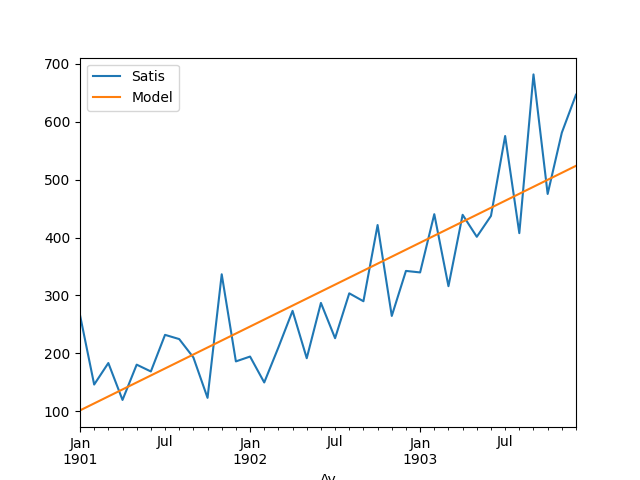
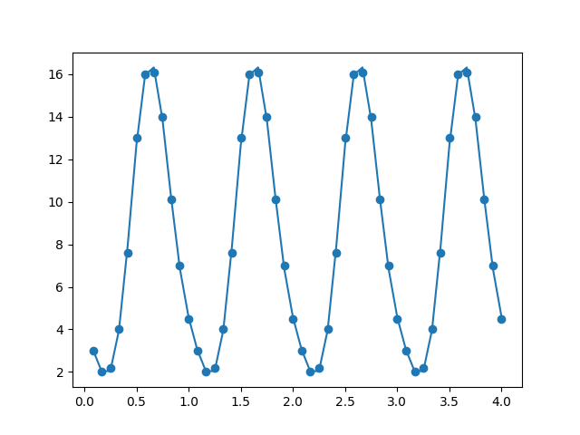

# Sezonsallık, Periyotlar

Zaman serilerini trendini, sezonsallığını nasıl inceleriz, ve trendde değişim
varsa bunu nasıl yakalarız?

Bir örnek üzerinde görelim, bir şirketin şampuan satış kazancı, veri [1]'den,

```python
import pandas as pd, datetime

def parser(x):
    return datetime.datetime.strptime( '190'+x, '%Y-%m' )
    
df = pd.read_csv('../tser_022_de/shampoo-sales.csv', header=0, index_col=0, \
     parse_dates=True, date_parser=parser)
df.Satis.plot()
plt.savefig('tser_022_de_07.png')
```


Yukarı doğru bir trend var. Bu trendi veriye bir düz çizgi uydurarak (fit), yani
tek değişkenli, ikinci derece lineer regresyon yaparak yakalayabiliriz. Bunu
yapmayı pek çok diğer derste gösterdik, `statsmodels.regression`
paketinden, `linear_model.OLS` ile, `statsmodels.formula.api` ile,
ya da direk Lineer Cebir kullanarak.. Altta `polyfit`  çağrısı
kullanılacak.

Modelden gelen katsayıları (coefficients) kullanıp tahmini $y$ değerleri üretmek
için alttaki fonksiyon var,

```python
def model_compute(X, coef):
   degree = len(coef)-1
   curve = [np.sum([coef[-1]] + [x**(degree-d)*c for d,c \
            in enumerate(coef[:-1])]) for x in X]
   return curve
```

Uydurmayı yapıp modeli veri üzerinde gösterelim,

```python
X = np.array(range(len(df))).reshape(-1)
y = df.values.reshape(-1)
degree = 1
coef = np.polyfit(X, y, degree)
df['Model']  = model_compute(X, coef)
df.plot()
plt.savefig('tser_022_de_01.png')
```



Veriden "trendi çıkartabiliriz''. Bunu basit bir şekilde veriden modeli
eksilterek yapabiliriz. Bu durumda geriye kalan sadece trend haricinde olan
şeyler olacaktır. Trend çıkartmanın pek çok amacı olabilir, belki trend
haricinde olan kalıpları, eğer hala varsa, görmek istiyoruz, ya da modelin
artığına (residual) bakarak onun gürültü olup olmadığını anlamak
istiyoruz. Bilindiği gibi lineer regresyonun faraziyesi verinin model artı
gürültü olduğudur, o zaman model veriden çıkartılınca geriye kalan artık,
"tortu'' sadece gürültüdür. Gürültünün matematiksel tanımı Gaussian, ya da
Normal dağılımıdır, demek ki artıklar üzerinde normallik testi bir anlamda
modelin uyma başarısını da ölçer.

```python
detrended = df.Satis-df.Model
detrended.plot()
plt.savefig('tser_022_de_03.png')
```


Normallik testini uygulayalım,

```python
from scipy import stats
val,pval = stats.shapiro(detrended)
print ('p degeri =', pval)
```

```text
p degeri = 0.09782825233013859
```

Shapiro-Wilk testinde p-değerinin 0.05'ten küçük olması normalliğin reddedilmesi
demektir. Üstte normal olmadığın reddedemedik, demek ki büyük ihtimalle elimizde
bir Normal dağılım var.

Sezonsallık

Benzer bir şekilde sezonsallığı da modelleyebiliriz. Sezonsallık bir
periyotsallığı ima eder, o zaman en genel şekilde bir sinüs fonksiyonunu veriye
uydurabiliriz. Fakat bu sinüs fonksiyonunun benliğini, başlangıç noktasını
bilmiyoruz, bu durumlarda [6]'da sinüssel regresyon tekniğini gördük. Fakat
belki de daha rahatı veriye bir 4'üncü derece polinom uydurmaktır.

Bu garip gelebilir, polinom uydurmayı çoğunlukla ikinci, üçüncü
derecede eğrileri modelleyen çerçevede görmüş olabiliriz, fakat bu
yaklaşım periyotsal fonksiyonları da çok rahat temsil
edebiliyor. Sebebi herhalde sinüs fonsiyonunun Taylor açılımında [3]
gizli, Taylor açılımında sonsuza kadar giden türevler polinom açılımda
kullanılır, sinüsün 1'den 4'e kadar olan türevlerine bakarsak,

$\sin^{\prime}(x)=\cos(x),\quad$
$\sin^{\prime\prime}(x)=-\sin(x),\quad$,
$\sin^{\prime\prime\prime}(x)=-\cos(x),\quad$,
$\sin^{(4)}(x)=\sin(x)$.

Dördüncü türevin tekrar $\sin(x)$'a dönüş yaptığını görüyoruz. Demek ki 4'üncü
derece polinom açılımı periyotsal fonksiyonları temsil etmek için yeterlidir.

Altta bir bölgeden alınmış günlük, o günün minimum hava sıcaklığı ölçümlerini
görüyoruz. Ona modeli uyduralım,

```python
import pandas as pd
df = pd.read_csv('../tser_022_de/daily-min-temperatures.csv', header=0,\
                 index_col=0, parse_dates=True)
X = [i%365 for i in range(0, len(df))]
y = df.values
degree = 4
coef = np.polyfit(X, y, degree)
df['Model']  = model_compute(X, coef)
df.plot()
plt.savefig('tser_022_de_02.png')
```


Periyotsallık yakalanmış gibi duruyor. Sezonsallığı veriden çıkartalım,

```python
deseasoned = df.Temp-df.Model
deseasoned.plot()
plt.savefig('tser_022_de_04.png')
```


Artıklar üzerinde normallik testi,

```python
from scipy import stats
val,pval = stats.shapiro(deseasoned)
print ('p degeri =', pval)
```

```text
p degeri = 4.1306918038416617e-10
```

Normal değil. Bunun sebebi veri içinde birden fazla sezonsallık, ya da başka bir
örüntünün hala mevcut olması olabilir. Bu senaryoları test etmek ödev olsun.

Sinüssel Regresyon (Sinusoidal Regression)

Alttaki veriye bir veya birden fazla sinüs eğrisi uydurmak istiyoruz. 

```python
import pandas as pd
df = pd.read_csv('baltic.csv')
df.plot(x='toy',y='degs',kind='scatter')
plt.savefig('tser_sinreg_01.png')
```


Fakat sinüs eğrisini, tek sinüs eğrisi olduğu durumda bile, nasıl yana
kaydırarak tam doğru noktayı bulacağız? Ayrıca eğrinin genliği (amplitude)
önemli. Tüm bunları kapsayan formül

$$ f(x) = A \sin (x+\varphi) $$

Genlik $A$ ile faz ise $\varphi$ ile gösterilmiş, öyle bir $A,\varphi$ bulalım
ki sonuç sinüs eğrisi tam veriye uysun. Veriye uydurma deyince akla lineer
regresyon geliyor, fakat üstteki formülü olduğu gibi regresyona sokmak mümkün
değil, çünkü faz kaydırmak için $\sin$ içindeki parametrenin değişmesi lazım,
regresyon bunları yapamaz. Ama regresyona problemi `katsayı çarpı basit formül''
şeklinde sunabilir miyiz acaba? Bir trigonometrik eşitlikten biliyoruz ki

$$  A \sin (x+\varphi) = a\sin(x) + b\cos(x) $$

ki $\sin\varphi = \frac{b}{\sqrt{a^2+b^2}}$, ve $A = \sqrt{a^2+b^2}$ olacak  sekilde. 

Bu eşitliğin doğru olduğunu kontrol edelim,

$$ a \sin(x) + b \cos(x) = \sqrt{a^2+b^2} \left(\frac{a}{\sqrt{a^2+b^2}} \sin(x) + \frac{b}{\sqrt{a^2+b^2}} \cos(x)\right) $$

$$  = A\left[\sin(x)\cos(\varphi) + \cos(x)\sin(\varphi)\right] $$

$$ = A\sin(x+\varphi) $$

O zaman $a \sin(x) + b \cos(x)$ için regresyon yapabiliriz. Regresyon iki toplam
üzerinden tanımlı fonksiyonlar için en uygun $a,b$ katsayılarını
hesaplayacak. Önce $\sin$ içinde $2\pi x$ ile başlarız, 

```python
import statsmodels.formula.api as smf
results = smf.ols('degs ~ np.sin(2*np.pi*toy) + np.cos(2*np.pi*toy)', data=df).fit()
print (results.summary())
```

```text
                            OLS Regression Results                            
==============================================================================
Dep. Variable:                   degs   R-squared:                       0.969
Model:                            OLS   Adj. R-squared:                  0.968
Method:                 Least Squares   F-statistic:                     704.3
Date:                Fri, 27 Jun 2025   Prob (F-statistic):           1.10e-34
Time:                        12:37:22   Log-Likelihood:                -63.360
No. Observations:                  48   AIC:                             132.7
Df Residuals:                      45   BIC:                             138.3
Df Model:                           2                                         
Covariance Type:            nonrobust                                         
===========================================================================================
                              coef    std err          t      P>|t|      [0.025      0.975]
-------------------------------------------------------------------------------------------
Intercept                   8.2917      0.135     61.407      0.000       8.020       8.564
np.sin(2 * np.pi * toy)    -5.9156      0.191    -30.979      0.000      -6.300      -5.531
np.cos(2 * np.pi * toy)    -4.0463      0.191    -21.190      0.000      -4.431      -3.662
==============================================================================
Omnibus:                       28.673   Durbin-Watson:                   1.051
Prob(Omnibus):                  0.000   Jarque-Bera (JB):                4.298
Skew:                          -0.158   Prob(JB):                        0.117
Kurtosis:                       1.569   Cond. No.                         1.41
==============================================================================
```

```python
a,b = results.params[1],results.params[2]
A = (a**2+b**2)
print (A, np.rad2deg(np.arcsin(b**2 / A)))
```

```text
51.367286414382804 18.586661396939277
```

```python
fit1 = results.params[0] + results.params[1] * np.sin(2*np.pi*df.toy) + \
       results.params[2] * np.cos(2*np.pi*df.toy)
plt.scatter(df.toy,df.degs)
plt.plot(df.toy,fit1)
plt.savefig('tser_sinreg_02.png')
```


Uyum fena değil. Daha iyi uyum için daha fazla terim ekleyebiliriz, mesela 
$\sin,\cos$ içinde $2 \pi x$ kullandık, bir de $4 \pi x$'li terimler ekleyerek,

```python
import statsmodels.formula.api as smf
formula = 'degs ~ np.sin(2*np.pi*toy) + np.cos(2*np.pi*toy) + ' + \
          '       np.sin(4*np.pi*toy) + np.cos(4*np.pi*toy)'
results = smf.ols(formula, data=df).fit()
print (results.summary())
```

```text
                            OLS Regression Results                            
==============================================================================
Dep. Variable:                   degs   R-squared:                       0.999
Model:                            OLS   Adj. R-squared:                  0.999
Method:                 Least Squares   F-statistic:                     9519.
Date:                Fri, 27 Jun 2025   Prob (F-statistic):           9.48e-63
Time:                        12:37:40   Log-Likelihood:                 16.130
No. Observations:                  48   AIC:                            -22.26
Df Residuals:                      43   BIC:                            -12.90
Df Model:                           4                                         
Covariance Type:            nonrobust                                         
===========================================================================================
                              coef    std err          t      P>|t|      [0.025      0.975]
-------------------------------------------------------------------------------------------
Intercept                   8.2917      0.026    314.450      0.000       8.238       8.345
np.sin(2 * np.pi * toy)    -5.9156      0.037   -158.634      0.000      -5.991      -5.840
np.cos(2 * np.pi * toy)    -4.0463      0.037   -108.506      0.000      -4.122      -3.971
np.sin(4 * np.pi * toy)     1.2124      0.037     32.513      0.000       1.137       1.288
np.cos(4 * np.pi * toy)     0.3333      0.037      8.939      0.000       0.258       0.409
==============================================================================
Omnibus:                        0.473   Durbin-Watson:                   2.983
Prob(Omnibus):                  0.790   Jarque-Bera (JB):                0.338
Skew:                          -0.200   Prob(JB):                        0.845
Kurtosis:                       2.909   Cond. No.                         1.41
==============================================================================

```

```python
fit2 = results.params[0] + \
       results.params[1] * np.sin(2*np.pi*df.toy) + \
       results.params[2]*np.cos(2*np.pi*df.toy) + \
       results.params[3] * np.sin(4*np.pi*df.toy) + \
       results.params[4]*np.cos(4*np.pi*df.toy) 
      
plt.scatter(df.toy,df.degs)
plt.plot(df.toy, fit2)
plt.savefig('tser_sinreg_03.png')
```



Uyum daha iyi hale geldi.

Bir tane de mutlak değer içeren bir fonksiyon.

```python
import pandas as pd
x = np.linspace(0,10,400)
y = np.abs(np.sin(2*np.pi*x)) + np.random.random(len(x)) * 0.5
df = pd.DataFrame(x)
df['y'] = y
df.columns = ['x','y']
df.plot(x='x',y='y')
plt.savefig('tser_sinreg_04.png')
```


```python
import statsmodels.formula.api as smf
results = smf.ols('y ~ np.abs(np.sin(2*np.pi*x)) + np.abs(np.cos(2*np.pi*x))', data=df).fit()
print (results.summary())
```

```text
                            OLS Regression Results                            
==============================================================================
Dep. Variable:                      y   R-squared:                       0.830
Model:                            OLS   Adj. R-squared:                  0.829
Method:                 Least Squares   F-statistic:                     968.9
Date:                Fri, 27 Jun 2025   Prob (F-statistic):          1.84e-153
Time:                        12:38:04   Log-Likelihood:                 206.22
No. Observations:                 400   AIC:                            -406.4
Df Residuals:                     397   BIC:                            -394.5
Df Model:                           2                                         
Covariance Type:            nonrobust                                         
=================================================================================================
                                    coef    std err          t      P>|t|      [0.025      0.975]
-------------------------------------------------------------------------------------------------
Intercept                         0.3500      0.074      4.719      0.000       0.204       0.496
np.abs(np.sin(2 * np.pi * x))     0.9428      0.059     15.943      0.000       0.827       1.059
np.abs(np.cos(2 * np.pi * x))    -0.0979      0.059     -1.650      0.100      -0.215       0.019
==============================================================================
Omnibus:                      292.929   Durbin-Watson:                   1.972
Prob(Omnibus):                  0.000   Jarque-Bera (JB):               25.280
Skew:                           0.035   Prob(JB):                     3.24e-06
Kurtosis:                       1.770   Cond. No.                         20.5
==============================================================================

```


Kaynaklar

[1] Cross Validated, *How to find a good fit for semi­sinusoidal model in  R?*,
[http://stats.stackexchange.com/questions/60500/how-to-find-a-good-fit-for-semi-sinusoidal-model-in-r](http://stats.stackexchange.com/questions/60500/how-to-find-a-good-fit-for-semi-sinusoidal-model-in-r)

