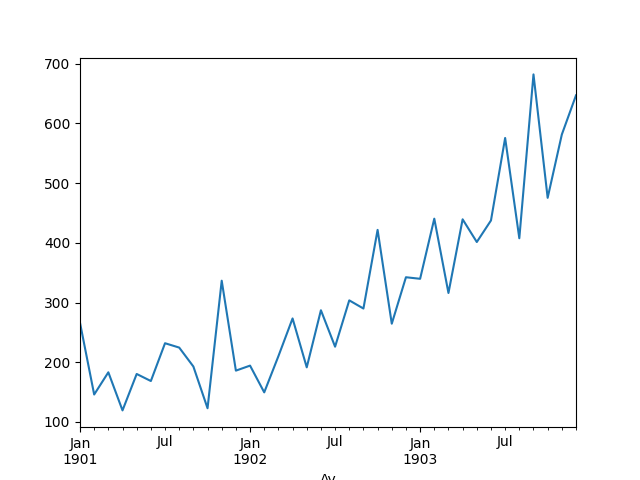
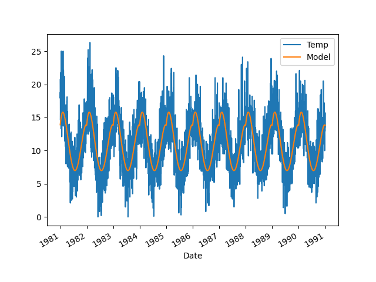

# Sezonsallık, Periyotlar

Zaman serilerini trendini, sezonsallığını nasıl inceleriz, ve trendde değişim
varsa bunu nasıl yakalarız?

Bir örnek üzerinde görelim, bir şirketin şampuan satış kazancı, veri [1]'den,

```python
import pandas as pd, datetime

def parser(x):
    return datetime.datetime.strptime( '190'+x, '%Y-%m' )
    
df = pd.read_csv('../tser_022_de/shampoo-sales.csv', header=0, index_col=0, \
     parse_dates=True, date_parser=parser)
df.Satis.plot()
plt.savefig('tser_022_de_07.png')
```



Yukarı doğru bir trend var. Bu trendi veriye bir düz çizgi uydurarak (fit), yani
tek değişkenli, ikinci derece lineer regresyon yaparak yakalayabiliriz. Bunu
yapmayı pek çok diğer derste gösterdik, `statsmodels.regression`
paketinden, `linear_model.OLS` ile, `statsmodels.formula.api` ile,
ya da direk Lineer Cebir kullanarak.. Altta `polyfit`  çağrısı
kullanılacak.

Modelden gelen katsayıları (coefficients) kullanıp tahmini $y$ değerleri üretmek
için alttaki fonksiyon var,

```python
def model_compute(X, coef):
   degree = len(coef)-1
   curve = [np.sum([coef[-1]] + [x**(degree-d)*c for d,c \
            in enumerate(coef[:-1])]) for x in X]
   return curve
```

Uydurmayı yapıp modeli veri üzerinde gösterelim,

```python
X = np.array(range(len(df))).reshape(-1)
y = df.values.reshape(-1)
degree = 1
coef = np.polyfit(X, y, degree)
df['Model']  = model_compute(X, coef)
df.plot()
plt.savefig('tser_022_de_01.png')
```


Veriden "trendi çıkartabiliriz''. Bunu basit bir şekilde veriden modeli
eksilterek yapabiliriz. Bu durumda geriye kalan sadece trend haricinde olan
şeyler olacaktır. Trend çıkartmanın pek çok amacı olabilir, belki trend
haricinde olan kalıpları, eğer hala varsa, görmek istiyoruz, ya da modelin
artığına (residual) bakarak onun gürültü olup olmadığını anlamak
istiyoruz. Bilindiği gibi lineer regresyonun faraziyesi verinin model artı
gürültü olduğudur, o zaman model veriden çıkartılınca geriye kalan artık,
"tortu'' sadece gürültüdür. Gürültünün matematiksel tanımı Gaussian, ya da
Normal dağılımıdır, demek ki artıklar üzerinde normallik testi bir anlamda
modelin uyma başarısını da ölçer.

```python
detrended = df.Satis-df.Model
detrended.plot()
plt.savefig('tser_022_de_03.png')
```


Normallik testini uygulayalım,

```python
from scipy import stats
val,pval = stats.shapiro(detrended)
print ('p degeri =', pval)
```

```text
p degeri = 0.09782825233013859
```

Shapiro-Wilk testinde p-değerinin 0.05'ten küçük olması normalliğin reddedilmesi
demektir. Üstte normal olmadığın reddedemedik, demek ki büyük ihtimalle elimizde
bir Normal dağılım var.

Sezonsallık

Benzer bir şekilde sezonsallığı da modelleyebiliriz. Sezonsallık bir
periyotsallığı ima eder, o zaman en genel şekilde bir sinüs fonksiyonunu veriye
uydurabiliriz. Fakat bu sinüs fonksiyonunun benliğini, başlangıç noktasını
bilmiyoruz, bu durumlarda [6]'da sinüssel regresyon tekniğini gördük. Fakat
belki de daha rahatı veriye bir 4'üncü derece polinom uydurmaktır.

Bu garip gelebilir, polinom uydurmayı çoğunlukla ikinci, üçüncü
derecede eğrileri modelleyen çerçevede görmüş olabiliriz, fakat bu
yaklaşım periyotsal fonksiyonları da çok rahat temsil
edebiliyor. Sebebi herhalde sinüs fonsiyonunun Taylor açılımında [3]
gizli, Taylor açılımında sonsuza kadar giden türevler polinom açılımda
kullanılır, sinüsün 1'den 4'e kadar olan türevlerine bakarsak,

$\sin^{\prime}(x)=\cos(x),\quad$
$\sin^{\prime\prime}(x)=-\sin(x),\quad$,
$\sin^{\prime\prime\prime}(x)=-\cos(x),\quad$,
$\sin^{(4)}(x)=\sin(x)$.

Dördüncü türevin tekrar $\sin(x)$'a dönüş yaptığını görüyoruz. Demek ki 4'üncü
derece polinom açılımı periyotsal fonksiyonları temsil etmek için yeterlidir.

Altta bir bölgeden alınmış günlük, o günün minimum hava sıcaklığı ölçümlerini
görüyoruz. Ona modeli uyduralım,

```python
import pandas as pd
df = pd.read_csv('../tser_022_de/daily-min-temperatures.csv', header=0,\
                 index_col=0, parse_dates=True)
X = [i%365 for i in range(0, len(df))]
y = df.values
degree = 4
coef = np.polyfit(X, y, degree)
df['Model']  = model_compute(X, coef)
df.plot()
plt.savefig('tser_022_de_02.png')
```



Periyotsallık yakalanmış gibi duruyor. Sezonsallığı veriden çıkartalım,

```python
deseasoned = df.Temp-df.Model
deseasoned.plot()
plt.savefig('tser_022_de_04.png')
```


Artıklar üzerinde normallik testi,

```python
from scipy import stats
val,pval = stats.shapiro(deseasoned)
print ('p degeri =', pval)
```

```text
p degeri = 4.1306918038416617e-10
```

Normal değil. Bunun sebebi veri içinde birden fazla sezonsallık, ya da başka bir
örüntünün hala mevcut olması olabilir. Bu senaryoları test etmek ödev olsun.

