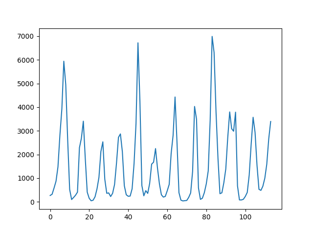
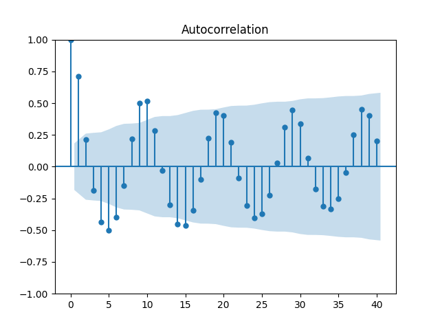
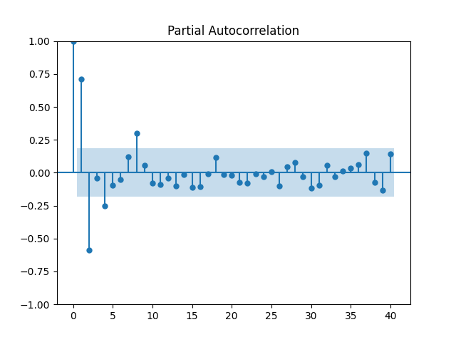
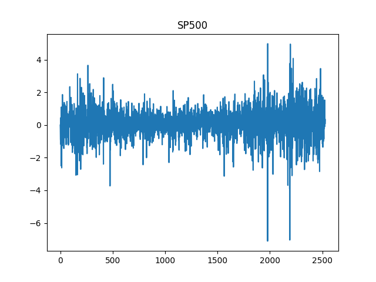
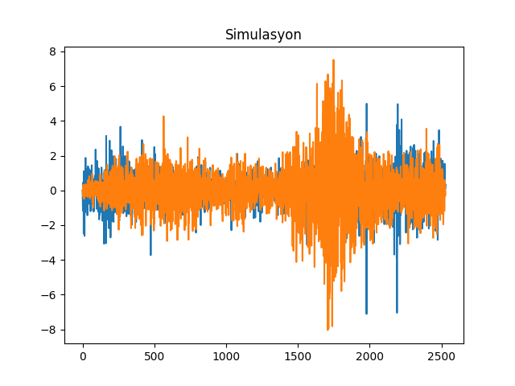

# ARIMA, ARCH, GARCH, Periyotlar, Yürüyen Ortalama

Kendisiyle Regresyon ve Yürüyen Ortalama (Autoregression, Moving Average)

Bir zaman serisi rasgele yürüyüşe (random walk) sahipse $t$ anındaki değeri
önceki rasgele hareketlerin birleşimiydi. Diğer alternatif bir serinin {\em
  önceki değerlerine} arada gürültü olmadan bağlantılı olmasıdır. Bu her iki
yaklaşımı genelleştirerek ARIMA formunda gösterebiliriz. İlk önce AR formuna
bakalım; Birinci seviyede kendisiyle regresyon (autoregression, first order)
AR(1)'dır [1, sf. 23],

$$ 
y_t = c + \phi y_{t-1} + \epsilon_t  
\qquad (1) 
$$

Daha yüksek seviyeler AR(p) olarak gösterilir, 

$$ y_t = c + \phi_1 y_{t-1} +  \phi_2 y_{t-2} + ... +  \phi_p y_{t-p}  + \epsilon_t  $$

Bu durumda $t$ anındaki değer önceki $t-1,..,t-p$ anındaki değerlerle
(belli oranlar üzerinden tabii) artı gürültüye eşittir.

Bir diğer zaman serisi yürüyen ortalama (moving average) serisidir, bu
tür seriler $t$ anını önceki *gürültülerin* bir ortalaması olarak
gösterir. Dikkat, önceki tüm gürültüleri olduğu gibi toplamıyoruz, belli
sayıdaki önceki gürültüleri belli ağırlıklar üzerinden topluyoruz. Birinci
seviyede bu seriler MA(1) olarak tanımlanır,

$$ y_t = \mu + \epsilon_t + \theta \epsilon_{t-1} $$

Daha yüksek seviyeleri MA(q) olarak tanımlarız, 

$$ y_t = \mu + \epsilon_t + \theta_1 \epsilon_{t-1} + .. + \theta_q \epsilon_{t-q} $$

Pratikte pür birer AR(p) ya da MA(q) serisini tanımlamak zordur, çoğunlukla
ikisinin bir karışımı olan ARMA(p,q) serileri test edilir (ya da daha genel
olarak, AR*I*MA)(p,d,q). Ek I sembolü modele bir diferansiyel etkisi
sağlıyor, bu eke göre eğer farkı alınmış seri bir ARMA modeli oluyorsa bu
model ARIMA kabul ediliyor. Mesela ilk farklar $d=1$ için $y_t - y_{t-1}$
modeli ARMA ise, bu model ARIMA'dır [4, sf. 92].

Rasgele yürüyüş bu genel formda gösterilebilir, rasgele yürüyüş
ARIMA(0,1,0) modelidir. 

Daha odaklı bir örnek olarak Lynx verisine bakalım [2, sf. 727],

```python
import pandas as pd
import statsmodels.api as sm
df = pd.read_csv('../tser_015_stoc/lynx.csv')
```

```python
df.x.plot()
plt.savefig('tser_ar_01.png')
```



Çıplak gözle bakıldığında zaman serisinde 10 senelik kuvvetli bir periyot
olduğunu görüyoruz. Acaba hangi ARIMA serisi, hangi $p,q$ parametreleri
üzerinden Lynx'i modelleyebilir? Bunun için önce bir kendisiyle korelasyon
(autocorrelation) ACF ve kısmi kendisiyle korelasyon PACF analizi yapmak
faydalı olabilir. PACF, aynen ACF gibi, seriyi bir ya da daha fazla geriye
kaydırarak kendisiyle olan korelasyonunu inceler, ama bunu diğer tüm diğer
kaydırılmış serilerin etkisini çıkartarak yapar, böylece gerideki belli
bir $t-n$ noktasının etkisi daha açık olarak görülebilir. 

```python
import statsmodels.api as sm
sm.graphics.tsa.plot_acf(df.x.values.squeeze(), lags=40)
plt.savefig('tser_ar_02.png')
```



```python
sm.graphics.tsa.plot_pacf(df.x, lags=40)
plt.savefig('tser_ar_03.png')
```



ACF/PACF grafiklerinde mavi bölge dışına taşan noktalar istatistiki olarak
önemli demektir. ACF'te 10 senelik periyot açık şekilde görülüyor. Hangi evre
gecikmesi (lag) daha önemli? PACF grafiğinde 2. evrede güçlü bir negatif
korelasyon görülüyor, 1 ve 8'de güçlü pozitif korelasyonlar var, ve 4'te yine
negatif.

Şimdi belli ARIMA modellerini test edelim, modelleri birbiri ile kıyaslamak
için AIC istatistiğini kullanacağız, daha düşük AIC daha iyi demektir. Ama
ondan önce bir AR modelinin nasıl veriye uydurulduğunu düşünelim; (1)'deki
formülde $y_t$ ve $y_{t-1}$ arasında lineer bir ilişki görüyoruz. Bu
durumda bu iki veri noktasının bir lineer regresyona verirsek, $\phi$
değeri bu regresyondan ortaya çıkacaktır. Regresyonun işlemesi için veri
noktalarının bir aşağı kaydırırız, ve bu kaydırılmış değeri asıl değer ile
regresyona sokarız,

```python
import statsmodels.formula.api as smf
df['x_lag1'] = df.x.shift(1)
print (df[['x','x_lag1']].head(6), '\n')
results = smf.ols('x ~ x_lag1', data=df).fit()
print (results.params)
print ('aic', results.aic)
```

```
      x  x_lag1
0   269     NaN
1   321   269.0
2   585   321.0
3   871   585.0
4  1475   871.0
5  2821  1475.0 

Intercept    454.151675
x_lag1         0.719712
dtype: float64
aic 1907.7277269856995
```

Şimdi bir ARIMA paketi ile aynısını yapalım,

```python
from statsmodels.tsa.arima.model import ARIMA
model10 = ARIMA(df.x, order=(1,0,0))
model_fit = model10.fit()
print(model_fit.summary())
```

```
                              ARMA Model Results                              
==============================================================================
Dep. Variable:                      x   No. Observations:                  114
Model:                     ARMA(1, 0)   Log Likelihood                -960.495
Method:                       css-mle   S.D. of innovations           1100.247
Date:                Tue, 13 Nov 2018   AIC                           1926.991
Time:                        11:45:20   BIC                           1935.199
Sample:                             0   HQIC                          1930.322
                                                                              
==============================================================================
                 coef    std err          z      P>|z|      [0.025      0.975]
------------------------------------------------------------------------------
const       1550.1773    356.690      4.346      0.000     851.078    2249.276
ar.L1.x        0.7173      0.065     11.042      0.000       0.590       0.845
                                    Roots                                    
=============================================================================
                  Real          Imaginary           Modulus         Frequency
-----------------------------------------------------------------------------
AR.1            1.3941           +0.0000j            1.3941            0.0000
-----------------------------------------------------------------------------
```

Sonuçlar oldukça yakın (gerçi kesi farklı -niye?-, ama katsayı daha önemli).

En İyi Model?

AR, ARIMA, MA, onların dereceleri arasında bir seçim yapmak gerekiyor. Önce
sırf AR deneyelim,


```python
res = []
res.append(ARIMA(df.x, order=(1,0,0)).fit())
res.append(ARIMA(df.x, order=(2,0,0)).fit())
res.append(ARIMA(df.x, order=(3,0,0)).fit())
res.append(ARIMA(df.x, order=(4,0,0)).fit())
res.append(ARIMA(df.x, order=(5,0,0)).fit())
res.append(ARIMA(df.x, order=(6,0,0)).fit())
for x in res: print (x.df_model+1, x.aic)
```

```
3 1926.9906490207566
4 1878.031850120836
5 1879.9567487161364
6 1874.221797648189
7 1875.2758635012437
8 1876.858328122954
```

En iyi model AR(4) olarak gözüküyor. Şimdi sadece MA olarak bakalım,

```python
lynx = df.x
%R -i lynx
%R model01<-arima(lynx,order=c(0,0,1))
%R model02<-arima(lynx,order=c(0,0,2))
%R model03<-arima(lynx,order=c(0,0,3))
%R model04<-arima(lynx,order=c(0,0,4))
%R model05<-arima(lynx,order=c(0,0,5))
%R model06<-arima(lynx,order=c(0,0,6))
%R -o res res <- AIC(model01,model02,model03,model04,model05,model06)
print (res)
```

```
        df      AIC
model01  3 1917,947
model02  4 1890,061
model03  5 1887,770
model04  6 1888,279
model05  7 1885,698
model06  8 1885,230

```

Bu AIC'ler  AR'dekilerden yüksek. Belki bir $p,q$ kombinasyonu daha iyidir?
En iyi p olan $p=4$'u tutalım, ve diğer $q$'leri test edelim,

```python
lynx = df.x
%R -i lynx
%R model40<-arima(lynx,order=c(4,0,0))
%R model41<-arima(lynx,order=c(4,0,1))
%R model42<-arima(lynx,order=c(4,0,2))
%R model43<-arima(lynx,order=c(4,0,3))
%R -o res res<-AIC(model40,model41,model42,model43)
print (res)
```

```
        df      AIC
model40  6 1874,222
model41  7 1875,351
model42  8 1862,435
model43  9 1880,432

```

Görülüyor ki hareketli ortalama ekine hiç gerek yok, çünkü en iyi AIC
$q=0$ için. Ya farklı diferansiyeller, yani ARIMA'nın I'si? 

```python
lynx = df.x
%R -i lynx
%R model400<-arima(lynx,order=c(4,0,0))
%R model401<-arima(lynx,order=c(4,1,0))
%R model402<-arima(lynx,order=c(4,2,0))
%R model403<-arima(lynx,order=c(4,3,0))
%R -o res res<-AIC(model400,model401,model402,model403)
print (res)
```

```
         df      AIC
model400  6 1874,222
model401  5 1890,961
model402  5 1917,882
model403  5 1946,143

```

Diferansiyele de ihtiyaç yok, en iyi diferansiyel $d=0$. En düşük AIC
1874.22, ve AR'ın gecikmeli evresi 4, ve hiçbir hareketli ortalama ve
diferansiyle ihtiyaç yok. $p=4$ deyince tabii ki $t$ anının $p-1,..,p-4$
ile alakası olması hali, yani $t$ anı kendinden önceki 4 nokta ile ilişkide
olacaktır. Bu ilişkiler gecikmeli sadece evre 2'deki kısmı korelasyonu
değil, 4'teki kısmı korelasyonu da dikkate almak zorundadır yani.

Oynaklık (Volatility) ve GARCH Modelleri

ARCH İngilizce autoregressive conditional heteroskedasticity kelimelerinden
geliyor, yani kendisiyle regresyonda olan koşullu değişen varyans
serileri. GARCH ise genelleştirilmiş ARCH demektir. Şimdiye kadar gördük ki
getiri $r_t$'ler (returns) tipik olarak $N(0,\sigma^2)$'den
gelmektedir. Fakat finans zaman serilerinde çoğunlukla oynaklığın,
matematiksel olarak varyansın zamana göre değişebildiği görülmektedir,
varyans $h_t$ belli noktalarda farklı olabilmektedir, hatta belli oynaklık
blokları (volatility regions) olabilmektedir. Daha önce ARIMA'nın MA
kısmında $t$ anındaki gürültünün önceki zaman noktalarındaki gürültünün bir
ortalaması olduğunu görmüştük, burada varyans da bir trend ve kaymaya
(drift) sahip olabilmektedir. 

ARCH(1) modeli

$$ y_t = \phi + e_t $$

$$ e_t \sim N(0,h_t) $$

$$ h_t = \alpha_0 + \alpha_1 e_{t-1}^2 $$

olarak gösterilir. $\phi,\alpha_0,\alpha_1$ veriden hesaplanacaktır, ya da
simulasyon durumunda dışarıdan belirlenecektir. 

ARCH(q) modeli üstteki formül üzerinde basit bir uzatma yapar,

$$ h_t = \alpha_0 + \alpha_1 e_{t-1}^2 + ... + \alpha_1 e_{t-q}^2 $$

GARCH

Matematiksel olarak GARCH(p,q) $p=1,q=1$ modeli, yani GARCH(1,1)

$$ h_t = \omega + \alpha_1 e_{t-1}^2 + \beta_1 h_{t-1}$$

GARCH(1,1) olduğu farzedilen bir finans serisinin parametrelerini bulmak
için R `tseries` paketi kullanılabilir. Veri S\&P 500 tüm 90'li
yılların düzeltilmiş (adjusted) kapanış fiyatlarını içeriyor, getiri hesabı
için $\ln (P_t/P_{t-1})$ ya da $\ln (P_t) - \ln(P_{t-1})$ yapıyoruz, ve bu
getiriler üzerinde `garch` parametrelerini hesaplıyoruz. 

```python
import pandas as pd
dfsp500 = pd.read_csv('SP500.csv')
ret = np.log(dfsp500['Adj Close']).diff()*100.
ret = ret.fillna(0)
```

```python
from arch import arch_model
am = arch_model(ret)
res = am.fit(update_freq=5)
print (res.summary())
```

```
Iteration:      5,   Func. Count:     41,   Neg. LLF: 3034.2183086575697
Iteration:     10,   Func. Count:     76,   Neg. LLF: 3032.126998485467
Iteration:     15,   Func. Count:    107,   Neg. LLF: 3032.061301642375
Optimization terminated successfully.    (Exit mode 0)
            Current function value: 3032.061301642018
            Iterations: 15
            Function evaluations: 107
            Gradient evaluations: 15
                     Constant Mean - GARCH Model Results                      
==============================================================================
Dep. Variable:              Adj Close   R-squared:                      -0.000
Mean Model:             Constant Mean   Adj. R-squared:                 -0.000
Vol Model:                      GARCH   Log-Likelihood:               -3032.06
Distribution:                  Normal   AIC:                           6072.12
Method:            Maximum Likelihood   BIC:                           6095.46
                                        No. Observations:                 2528
Date:                Tue, Nov 13 2018   Df Residuals:                     2524
Time:                        12:31:10   Df Model:                            4
                                 Mean Model                                 
============================================================================
                 coef    std err          t      P>|t|      95.0% Conf. Int.
----------------------------------------------------------------------------
mu             0.0588  1.466e-02      4.014  5.975e-05 [3.010e-02,8.755e-02]
                               Volatility Model                              
=============================================================================
                 coef    std err          t      P>|t|       95.0% Conf. Int.
-----------------------------------------------------------------------------
omega      5.4768e-03  3.144e-03      1.742  8.155e-02 [-6.861e-04,1.164e-02]
alpha[1]       0.0517  1.700e-02      3.041  2.356e-03  [1.838e-02,8.501e-02]
beta[1]        0.9421  1.858e-02     50.694      0.000      [  0.906,  0.979]
=============================================================================

Covariance estimator: robust
```

Bu parametreler acaba doğru mu? Parametreler ile verinin kendisinin
üretmeye uğraşalım. $\phi=0$ kabul edersek, $y_t = e_t$ olarak
alabiliriz, 

```python
np.random.seed(1)
import pandas as pd
N = len(dfsp500)
alpha0=0.0048
alpha1=0.05
beta1 = 0.946773
y = np.zeros(N)
h = np.zeros(N)
w = np.random.standard_normal(N)
for i in range(1,N): 
    h[i] = alpha0 + alpha1 * (y[i-1]**2) + beta1 * h[i-1]
    y[i] = w[i] * np.sqrt(h[i])
```

Gerçek veriyi ve simulasyonu yan yana iki grafikte basalım, 

```python
dfsp500['SP500'] = ret
dfsp500['simulasyon'] = y
dfsp500['SP500'].plot()
plt.title('SP500')
plt.savefig('tser_ar_04.png')
dfsp500['simulasyon'].plot()
plt.title('Simulasyon')
plt.savefig('tser_ar_05.png')
```




Bir serinin değişen varyansa sahip olup olmadığını anlamak için bir
istatistiki test [3, sf. 355] Breusch-Pagan testi, 

```python
import numpy as np
import statsmodels.api as sm
import scipy as sp

def breusch_pagan_test(y,x):
     x = np.asarray(x)
     results=sm.OLS(y,x).fit()
     resid=results.resid
     n=len(resid)
     sigma2 = sum(resid**2)/n
     f = resid**2/sigma2 - 1
     results2=sm.OLS(f,x).fit()
     fv=results2.fittedvalues
     bp=0.5 * sum(fv**2)
     df=results2.df_model
     p_value=1-sp.stats.chi2.cdf(bp,df) 
     return round(bp,6), df, round(p_value,7)

```

Lynx verisi üzerinde uygulayalım,

```python
import pandas as pd
import breusch
dflynx = pd.read_csv('../tser_015_stoc/lynx.csv');
print (breusch.breusch_pagan_test(dflynx.x, np.array(range(len(dflynx)))))
```

```
(0.429236, 1.0, 0.6677515)
```

En sondaki değer p-değeridir, 0.05'ten düşüklük varyansın sabit olduğu
hipotezinin reddedildiği anlamına gelir, yani değişen varyans durumu
vardır. Üstteki sonuçta tezi reddedemedik, demek ki Lynx verisinde varyans
değişmiyor.

Basit Yürüyen Ortalama

Kabaca bir zaman serisini pürüzsüzleştirmenin (smoothing) en basit yolu
basit bir yürüyen ortalama almaktır. Bir pencere büyüklüğü tanımlarız, bu
pencereyi zaman serisinin üzerine koyarız, içine düşen tüm noktaların
ortalamasını alırız, ve pencereyi bir yana kaydırarak işlemi tekrarlarız. 
Tüm zaman serisi için bu yapılınca elimize bir ortalama geçmiş olur,

Yani $x_1,..,x_t$ zaman serisi için 

$$ 
y_t = \frac{1}{k} \sum_{n=0}^{k-1} x_{t-n}  
= \frac{x_t + x_{t-1} + ... + x_{t-k+1}}{k} 
$$

Burada hiç ağırlık kullanmadık, yani pencere içinde veri noktalarının
bazılarına daha fazla, bazılarına daha az ağırlık vermedik. Daha doğrusu
ağırlık kullandık, ama tüm noktalara '1' ağırlığı verdik ve bu sebeple k
tane '1' ağırlık verilmiş toplamı $k$'ye böldük. Fakat '1' yerine farklı
ağırlıklar da verebilirdik, mesela $w_1,w_2,..$ ki ağırlık toplamı 1 olacak
şekilde, 

$$ y_t = w_1x_t + w_2x_{t-1} + ... + w_kx_{t-k+1}
$$

Ağırlıkların toplamı 1, fakat 1 ile bölmeyi göstermeye gerek yok. 

Ya da $0 < \alpha < 1$ olacak şekilde, tüm zaman serisini kullanarak
(pencere yok), ağırlıkları $(1-\alpha)$'nin katları olacak şekilde
ayarlarsak,

$$ y_t = \frac{x_t + (1-\alpha)x_{t-1} + (1-\alpha)^2x_{t-2} + ... }
{1 + (1-\alpha) + (1-\alpha)^2 + ...} 
$$

Üstteki hesaba üstel ağırlıklı yürüyen ortalama (exponentially weighted
moving average -EWMA-) deniyor. Verinin tamamı kullanılır, ağırlıklar
$x_1$'e kadar gider. 0 ile 1 arasındaki değerler, ve onların gittikçe artan
üstelleri ile çarptığımız için yakın zamandaki verilerin ağırlığı fazladır,
eskiye gittikçe hızlı bir şekile bu etki azalmaya başlar. Eğer
$1-\alpha=0.2$ ise mesela, önce $0.2$, sonra $0.2^2=0.04$, ardından
$0.2^3=0.008$, küçülmenin ne kadar hızlı olduğunu görüyoruz.

Ayrıca bölende olan ifadelerin başlangıcı 1 oranı $1-\alpha$ olan bir
geometrik seri olduğunu görelim, bkz [9], o zaman bölen
$\frac{1}{1-(1-\alpha)}$'a yani $\frac{1}{\alpha}$'ya eşittir,

$$ y_t = \frac{x_t + (1-\alpha)x_{t-1} + (1-\alpha)^2x_{t-2} + ... }
{\frac{1}{\alpha}}
$$

$$  = [ x_t + (1-\alpha)x_{t-1} + (1-\alpha)^2x_{t-2} + ... ] \alpha $$

Üstteki hesabı özyineli yapmak ta mümkündür, türetmeye devam edersek,

$$  = \alpha x_t + [(1-\alpha)x_{t-1} + (1-\alpha)^2x_{t-2} + ... ]\alpha $$

$$  = \alpha x_t + (1-\alpha) [x_{t-1} + (1-\alpha)x_{t-2} + ... ]\alpha $$

$\alpha$ ile çarpılan köşeli parantezdekiler $y_{t-1}$'in ta kendisi. O
zaman özyineli ifade şu olur [8, sf. 502],

$$ y_t = \alpha x_t + (1-\alpha) y_{t-1}$$

Enflasyon

Fiyat seviyesinin (CPI) kendisiyle alakalı bir seri oldugu bilinir, bu mantıklı
çünkü ekonomik psikolojisi açısından yüksek fiyat seviyesi daha yüksek fiyatlara
gidişi tetikleyebilir. Alışverişte yüksek fiyatlar görüyorsam ben de kendi
müşterimden daha yüksek fiyatlar istemeye başlayabilirim. Bu kendisiyle
korelasyonu veride nasıl buluruz? Durbin-Watson testi var,

```python
import pandas as pd
cpi = pd.read_csv('cpi.csv',index_col=0)
```

```python
import statsmodels.formula.api as smf
from statsmodels.stats.stattools import durbin_watson
inf = np.log(cpi)
results = smf.ols('CPIAUCNS ~ 1', data=inf).fit()
print (durbin_watson(results.resid))
```

```
9.222098132626552e-05
```

Düşük bir değer kendisiyle korelasyon varlığının işareti olabilir. Not: Bu
istatistik normal regresyon paketleri tarafından çoğunlukla rapor edilir çünkü
basit regresyonun önkabulü kendisiyle korelasyon olmadığıdır, bu sebeple DW
korelasyon varlığına işaret ediyorsa analizci için bu önemli bir sinyal olmalı.

Durbin-Watson istatiği 0 ile 4 arasında bir değere sahiptir, 0 ile 2 arasındaki
değerler pozitif kendisiyle korelasyonun, 2 ile 4 arası negatif kendisiyle
korelasyonun işaretidir. Tam 2 değeri korelasyon yok demektir.

Bir diger test Ljung-Box testi, 

```python
import statsmodels.tsa.stattools as tsa
acf,ci,q,pvalues = tsa.acf(results.resid, nlags=4, alpha=95,qstat=True, adjusted=True)
print (acf)
print (pvalues)
```

```
[1.         0.99585547 0.99164499 0.98737151 0.98305291]
[1.02286496e-121 5.63735022e-239 0.00000000e+000 0.00000000e+000]
```

P-değerlerinin hepsinin 0.05'ten küçük olması kendisiyle korelasyon varlığı
için bir işaret daha.

Kaynaklar

[1] Pfaff, *Analysis of Integrated and Co-Integrated Time Series*

[2] Crawley, *The R Book*

[3] Hilpisch, *Python for Finance*

[4] Shumway, *Time Series Analysis with Applications in R*

[5] Carter Hill, *Principles of Econometrics*

[6] Metcalfe , *Introductory Times Series with R*

[8] McKinney, *Pandas Reference Documentation, 0.17.1*

[9] Bayramlı, Diferansiyel Denklemler, *Seriler*


