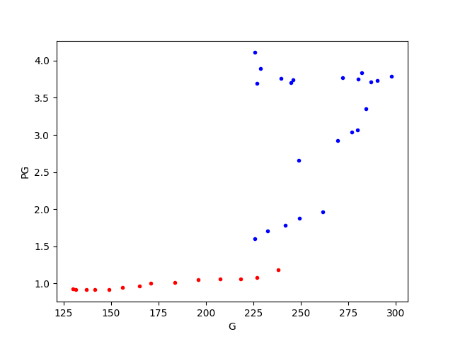
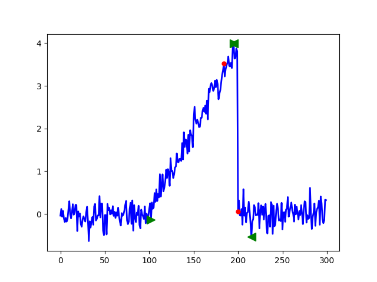

# Değişim Noktası Analizi, CUSUM, Chow Test

Değişim noktası zaman serisinin bir nokta öncesi ve sonrasında farklı karakterde
olmasıdır. Bu noktaları bulmak için basit bir yaklaşım herhangi bir nokta öncesi
ve sonrası zaman serisi parçalarını almak, ve önceki parçada lineer regresyon,
yapıp katsayıları alıp gürültünün normalliğini kontrol etmektir. Eğer normallik
varsa, katsayılar alınıp ikinci parçada kullanılır, gürültü yine normalse kopuş
yoktur (aynı zaman serisi). Birincide gürültü normalliği yoksa kopuş yine
yoktur, ilk parça doğru tanımlı değil. Sezonşallık benzer şekilde kontrol
edilebilir, vs.

Bu alanda pek cok yaklasim var. Pür istatistik bazlı bir Poisson tekniğini de
[8]'de görmüştük.

Chow Testi ve Yapısal Kopma (Structural Break)

Diyelim ki elimizdeki bir modelin bir verinin iki parçasında değişik
sonuçlar verip vermeyeceğini merak ediyoruz. Önceki regresyon örneğinde
bunu tek kesi ve değişken üzerinden gördük. Peki ya model daha çetrefil
olsaydı?

Bu durumda Chow Testini kullanabiliriz. Bu test daha önce gördüğümüz
F-testini verinin iki parçası üzerinde işletir, modelin her iki parça
üzerindeki SSE değeri, yani hata karelerinin toplamı (sum of squared
errors) üzerinden bir istatistik yaratır. Sıfır hipotezi katsayıların iki
bölgede aynı olduğudur, ve bunun irdelenmesi modelin her iki bölgedeki
varyansına bakılarak yapılır. Tersi yönde kanıt var ise faraziyeyi
reddederiz, ve iki bölgenin (en azından kullandığımız model açısından) çok
farklı olduğu sonucuna varırız.

F-testi için kısıtlı (restricted), ve kısıtlı olmayan (unrestricted) modeli
tanımlamak gerekiyor. Regresyonun her iki veri bölgesinde değişik değerlere
sahip olmasına izin verirsek (yani regresyonu ayrı ayrı iki parça üzerinde
işletirsek) bu kısıtlı olmayan demektir, eğer tüm veri üzerinde aynı
regresyonu kullanıyorsak o zaman katsayılar değişik bölgelere göre
değişemezler, bu da kısıtlı model olacaktır. Getirdiğimiz kısıtlama sayısı
regresyonun kullandığı değişken sayısına eşittir. Eğer değişken sayısı $k$
veri nokta sayısı $n$ işe formül,

$$ 
F = \frac{SSE_r - (SSE_1 + SSE_2) / k}{(SSE_1 + SSE_2) / (n-2k)}
 $$

ki $SSE_1,SSE_2$ sırasıyla 1. ve 2. bölgedeki hataların kare toplamıdır, $SSE_u
= SSE_1 + SSE_2$, yani bölgelerin ayrı ayrı hesaplanan hata kare toplamının
toplamı kısıtlı olmayan SSE'yi verir. $F$ rasgele değişkeni $F_{k,n-2k}$
serbestlik derecesine sahip bir F dağılımına sahiptir. Kısıtlama $k$ çünkü
ikinci bölgede $k$ kadar değişkenin değişik olmasına izin vermedik.

Örnek

Kullanacağımız veri Amerika'daki benzin tüketimi ile alakalı, bu veri
içinde aslında iki farklı periyotu kapsıyor [8, sf. 209]. 1973'e kadar
dünyada petrol boldu ve dünya petrol fiyatları ya stabil ya da düşüş
trendinde idi. Fakat 1973'teki ambargo piyasada büyük değişimlere sebep
oldu, kıtlık başladı, fiyatlar yükseldi. 

Alttaki figürde benzin fiyatı (PG) ile kişi başına tüketim (per capita
consumption) grafikli, ve görüldüğü gibi 1973 öncesi piyasa oldukça stabil
gidiyor (kırmızı noktalar) ama sonrasında işler karışıyor (mavi noktalar).

```python
import pandas as pd
df = pd.read_csv('gasoline.csv',sep='\s+')

plt.plot(df[df.Year<=1973].G,df[df.Year<=1973].Pg,'r.')
plt.xlabel('G'); plt.ylabel('PG')
plt.plot(df[df.Year>1973].G,df[df.Year>1973].Pg,'b.')
plt.savefig('stat_tests2_02.png')
```



1973 ve 1980'deki fiyat zıplamaları net bir şekilde görülüyor, ayrıca
tüketimde de daha fazla değişkenlik / varyans mevcut. Eğer bu veriye bir
model uydurmak isteseydik, aynı modelin iki ayrı bölgeye her değişken için
aynı mükemmeliyette uymasını beklemek hayalcilik olurdu.

Test edeceğimiz model şöyle, 

```python
model = 'Ln_G_Pop ~ Ln_Income_Pop + Ln_Pg + Ln_Pnc + Ln_Puc'
```

Bu modeldeki fiyatlar `G,Pnc,Puc`, sırasıyla benzin, yeni araba ve
kullanılmış araba fiyatları. `Ln_G_Pop`, `G` ile `Pop`
(nüfus) bölünmesiyle elde ediliyor, ve `Ln` notasyonumuz log işlemi
demek. `Income` ülke geliri, o da `Pop` ile bölünüyor ve log'u
alınıyor.

```python
df['Ln_G_Pop'] = np.log(df.G/df.Pop)
df['Ln_Income_Pop'] = np.log(df.Y/df.Pop)
df['Ln_Pg'] = np.log(df.Pg)
df['Ln_Pnc'] = np.log(df.Pnc)
df['Ln_Puc'] = np.log(df.Puc)
```

```python
plt.plot(df.Year,df.Ln_G_Pop)
plt.xlabel('Sene')
plt.ylabel('Ln(G/Nufus)')
plt.title('Amerika Benzin Tuketimi')
plt.savefig('stat_tests2_03.png')
```


Modeli tüm veri üzerinde işletirsek,

```python
from statsmodels.formula.api import ols
res_r = ols(model, data=df).fit()
print (res_r.summary())
```

```
                            OLS Regression Results                            
==============================================================================
Dep. Variable:               Ln_G_Pop   R-squared:                       0.969
Model:                            OLS   Adj. R-squared:                  0.965
Method:                 Least Squares   F-statistic:                     243.2
Date:                Wed, 17 Nov 2021   Prob (F-statistic):           6.25e-23
Time:                        10:06:35   Log-Likelihood:                 79.913
No. Observations:                  36   AIC:                            -149.8
Df Residuals:                      31   BIC:                            -141.9
Df Model:                           4                                         
Covariance Type:            nonrobust                                         
=================================================================================
                    coef    std err          t      P>|t|      [0.025      0.975]
---------------------------------------------------------------------------------
Intercept        -7.7892      0.359    -21.679      0.000      -8.522      -7.056
Ln_Income_Pop     2.1175      0.099     21.443      0.000       1.916       2.319
Ln_Pg            -0.0979      0.028     -3.459      0.002      -0.156      -0.040
Ln_Pnc            0.1224      0.112      1.092      0.283      -0.106       0.351
Ln_Puc           -0.1022      0.069     -1.475      0.150      -0.243       0.039
==============================================================================
Omnibus:                        2.323   Durbin-Watson:                   0.891
Prob(Omnibus):                  0.313   Jarque-Bera (JB):                1.281
Skew:                           0.049   Prob(JB):                        0.527
Kurtosis:                       2.081   Cond. No.                         319.
==============================================================================

Notes:
[1] Standard Errors assume that the covariance matrix of the errors is correctly specified.
```

Şimdi her iki parça üzerinde ayrı ayrı regresyon işletelim, ki parçaları
1973 değeri üzerinden oluşturacağız, bu bildiğimiz bir değer ve bir anlamda
bu değerin gerçekten bir kopuş noktası olup olmadığını test etmek
istiyoruz, ve ardından Chow testi için gerekli değerleri hesaplıyoruz,

```python
df_x = df[['Ln_Income_Pop','Ln_Pg','Ln_Pnc','Ln_Puc']]
df_y = df['Ln_G_Pop']

print (len(df[df.Year<=1973]), len(df[df.Year>1973]))
res1 = ols(model, data=df[df.Year<1974]).fit()
res2 = ols(model, data=df[df.Year>=1974]).fit()
S_1 = np.sum(res1.resid**2)
S_2 = np.sum(res2.resid**2)
S_r = np.sum(res_r.resid**2)
print ('S 1 =', S_1)
print ('S 2 =', S_2)
print ('S_r =', S_r)
print ('N =', len(df))
k = df_x.shape[1]
tmp1 = (S_r-(S_1+S_2))/k
tmp2 = (S_1+S_2)/(len(df)-2*k-1)
F = tmp1/tmp2
print ('F =', F)

import scipy.stats as st
f = st.f(k,len(df)-2*k-1)
print ('p degeri =', 1-f.cdf(F))
```

```
14 22
S 1 = 0.002567339947532824
S 2 = 0.0049117547066572
S_r = 0.02487343626197274
N = 36
F = 15.698665584711588
p degeri = 9.40286063455531e-07
```

Hesaplanan p değeri çok küçük, ve 0.05'ten daha az, demek ki hipotez
reddedildi. Demek ki hakikaten 1973'te bir değişim olmuş!

Paket

`pip install chow_test` ile kurulabilecek bir paket var [10], bu paketin
kullanımı,

```python
import chow_test, pandas as pd

df = pd.DataFrame({'x': [1, 1, 2, 3, 4, 4, 5, 5, 6, 7, 7, 8, 8, 9, 10, 10,
                         11, 12, 12, 13, 14, 15, 15, 16, 17, 18, 18, 19, 20, 20],
                   'y': [3, 5, 6, 10, 13, 15, 17, 14, 20, 23, 25, 27, 30, 30, 31,
                         33, 32, 32, 30, 32, 34, 34, 37, 35, 34, 36, 34, 37, 38, 36]})
print (df)
res = chow_test.chow_test(df['y'], df['x'],15,16,.05)
print (df.iloc[15])
print (res)
```

```
Reject the null hypothesis of equality of regression coefficients in the two periods.
Chow Statistic: 37.96716203561837, P_value: 2.6531641550420204e-08
x    10
y    33
Name: 15, dtype: int64
(37.96716203561837, 2.6531641550420204e-08)
```

Değişim Noktasını Bulmak

Eğer değişim anı 1973'ü bilmeseydik onu nasıl ortaya çıkartırdık? Bir
yaklaşıma göre [5] tüm seneleri teker teker deneyerek Chow testini ardı
ardına işletebilirdik ve elde edilen en büyük F değeri bize değişim
noktasını verirdi. Bu kodu işletirsek,

```python
from statsmodels.regression.linear_model import OLS
from numpy.linalg import pinv

def supf(y, x, p):
    N = y.shape[0]
    range = np.floor(np.array([N * p, N * (1 - p)]))
    range = np.arange(range[0], range[1] + 1, dtype=np.int32)
    x = x - np.mean(x)
    y = y - np.mean(y)
    e = OLS(y,x).fit().resid
    S_r = np.sum(e**2)
    k = x.shape[1]
    print ('N =',N)
    print ('k =',k)
    print ('N-k =',N-k)
    F_stat = np.zeros(N)
    for t in range:
        X1 = x[:t]
        X2 = x[t:]
        e[:t] = OLS(y[:t],X1).fit().resid
        e[t:] = OLS(y[t:],X2).fit().resid
        R2_u = 1 - e.dot(e) / y.dot(y)
        S_u = np.sum(e**2)
        F_stat[t] = ((S_r - S_u) / k) / (( S_u) / (N-2*k))
    return F_stat.argmax(),F_stat.max()
    
p = 0.2

idx,val = supf(df_y, df_x, p)
print (idx,val)
print ('Sene', df.Year[idx])
```

```
N = 36
k = 4
N-k = 32
14 3.904972193103
Sene 1974
```

Not: Sene araması için baştan ve sonda bir kısım veri atlandı, ki her iki
parça için elde yeterli veri olabilsin. 

Not: `lmfit` hakkında bazı tavsiyeler için bkz [12] yazısı.

Sonucu 1974 olarak bulduk. Fena değil!

Not: Fakat şu gözlemi de eklemek gerekiyor.. p değerini nihai bir karar verici
olarak kullanmak her zaman ise yaramayabilir. Dikkat edersek örneklem büyüklüğü
p değeri hesabında önemli bir yer tutuyor, o sebeple veri setlerinin büyüdüğü bu
günlerde p değeri her zaman çok küçük değerler gösterebilir. Her noktada F
değeri hesaplayıp en büyüğünü bulmak ise yarar fakat tek bir noktaya bakıp
"bu nokta ayraç olarak istatistiki öneme sahip mi?'' sorusu her örneklem
büyüklüğünde işlemeyebilir. 

Cusum

Cusum yaklaşımı [5] makalesinde araştırılmış, özyineli (recursive), yani teker
teker her yeni veri noktası üzerinde işlem yapan ve kopuşları o anda yakalamaya
uğraşan bir yaklaşımdır. Özyineli regresyon konusunu [4]'te gördük. Bir
regresyon hipotezi ile başlayıp her veri noktası geldiğinde regresyonu
güncellemek, iyileştirmek mümkündür. Cusum bunu yapar aynı anda modelin
gürültüsünü kontrol eder ve zaman serisinin bazı hipotezlere uyup uymadığını her
defasında kontrol eder, uyum yoksa kopuş yakalanmış demektir.

Faraziye şudur, normal kopuksuz bir zaman serisi her anda $\beta_t$ vektöründe
katsayılara sahipse, modelden geri kalan gürültünün ortalaması (mean) sıfır
olacaktır, ve her anda $\sigma_t$ varyasyonu için,

$$
\beta_1 = \beta_2 = ... = \beta_T = \beta
$$

$$
\sigma_1^2 = \sigma_2^2 = ... = \sigma_T^2 = \sigma
$$

Yani her anda katsayılar ve gürültünün varyasyonu sabit olmalı. Cusum
$\beta_t$'deki değişimi yakalamak için ayarlanmıştır, bunu yapmak için gürültü
ortalamasının sıfırdan sapmasını yakalamaya uğraşır. Detayları için Cusum
makalesine danışılabilir.

Alttaki kod [2]'yi temel alıyor. 

```python
import numpy as np

def detect_cusum(x, threshold=1, drift=0, ending=False, show=True, ax=None):

    x = np.atleast_1d(x).astype('float64')
    gp, gn = np.zeros(x.size), np.zeros(x.size)
    ta, tai, taf = np.array([[], [], []], dtype=int)
    tap, tan = 0, 0
    amp = np.array([])
    for i in range(1, x.size):
        s = x[i] - x[i-1]
        gp[i] = gp[i-1] + s - drift  # cumulative sum for + change
        gn[i] = gn[i-1] - s - drift  # cumulative sum for - change
        if gp[i] < 0:
            gp[i], tap = 0, i
        if gn[i] < 0:
            gn[i], tan = 0, i
        if gp[i] > threshold or gn[i] > threshold:  # change detected!
            ta = np.append(ta, i)    # alarm index
            tai = np.append(tai, tap if gp[i] > threshold else tan)  # start
            gp[i], gn[i] = 0, 0      # reset alarm

    if tai.size and ending:
        _, tai2, _, _ = detect_cusum(x[::-1], threshold, drift, show=False)
        taf = x.size - tai2[::-1] - 1
        tai, ind = np.unique(tai, return_index=True)
        ta = ta[ind]
        if tai.size != taf.size:
            if tai.size < taf.size:
                taf = taf[[np.argmax(taf >= i) for i in ta]]
            else:
                ind = [np.argmax(i >= ta[::-1])-1 for i in taf]
                ta = ta[ind]
                tai = tai[ind]
        ind = taf[:-1] - tai[1:] > 0
        if ind.any():
            ta = ta[~np.append(False, ind)]
            tai = tai[~np.append(False, ind)]
            taf = taf[~np.append(ind, False)]
        amp = x[taf] - x[tai]

    return ta, tai, taf, amp
```

Örnek bir zaman serisinde görelim,

```python
import pandas as pd
  
y = np.random.randn(300)/5
y[100:200] += np.arange(0, 4, 4/100)
x = range(len(y))
df = pd.DataFrame(y,columns=['y'])
df['x'] = x
df = df.set_index('x')
df.y.plot()
plt.savefig('tser_022_de_05.png')
```


Bu zaman serisinde bariz kopuşlar var, yaklaşık indeks 100 anında, sonra
200 anında. Cusum ile bunları yakalamaya uğraşalım,

```python
import cusum
ta, tai, taf, amp = cusum.detect_cusum(df.y, 2, .02, True, True)

print (len(ta))
print ('Baslangic =', tai[0], 'Bitis =', taf[0])
```

```
2
Baslangic = 95 Bitis = 197
```

Geri döndürülen `tai`, `taf` birer vektördür, ve sırasıyla kopuş
noktasının başlangıç ve bitiş indisini verirler. Yukarıda ilk kopuşun
indisini görüyoruz.

Grafiklersek,

```python
fig, ax = plt.subplots(1, 1)
t = range(df.y.size)
ax.plot(t, df.y, 'b-', lw=2)
if len(ta):
    ax.plot(tai, df.y[tai], '>', mfc='g', mec='g', ms=10, label='Start')
    ax.plot(taf, df.y[taf], '<', mfc='g', mec='g', ms=10, label='Ending')
    ax.plot(ta, df.y[ta], 'o', mfc='r', mec='r', mew=1, ms=5, label='Alarm')
    
plt.savefig('tser_022_de_06.png')
```



Sağa dönük yeşil ok başlangıç, sola dönük bitiş demek. En tepede ikisi
birbirinin üstüne bindi çünkü orada bir parça bitip diğeri başlıyor, ama olanlar
gözüküyor herhalde. Kırmızı noktalar ise alarm anları olarak tanımlanmış. 

Kaynaklar

[1] Brownlee, *Introduction to Time Series Modeling with Python*

[2] Github, [https://raw.githubusercontent.com/BMClab/BMC/master/functions/detect_cusum.py](https://raw.githubusercontent.com/BMClab/BMC/master/functions/detect_cusum.py)

[3] MIT, *OCW Single Variable Calculus, unit 5, Session 99*,
         [https://ocw.mit.edu/courses/mathematics/18-01sc-single-variable-calculus-fall-2010/index.htm](https://ocw.mit.edu/courses/mathematics/18-01sc-single-variable-calculus-fall-2010/index.htm)

[4] Bayramlı, *Hesapsal Bilim, Özyineli En Az Kareler*
         
[5] Brown, et al, *Techniques for Testing the Constancy of Regression Relationships over Time*

[6] Bayramlı, *Zaman Serileri, Sinüssel Regresyon (Sinusoidal Regression)*

[7] Bayramlı, *Istatistik, Testlere devam*

[8] Bayramlı, *Istatistik, Değişim Noktası Analizi*

[9] Woroniuk, *Chow test*,
    [https://github.com/David-Woroniuk/chowtest](https://github.com/David-Woroniuk/chowtest)

[10] Bobbitt, *How to Perform a Chow Test in Python*,
    [https://www.statology.org/chow-test-in-python/](https://www.statology.org/chow-test-in-python/)


