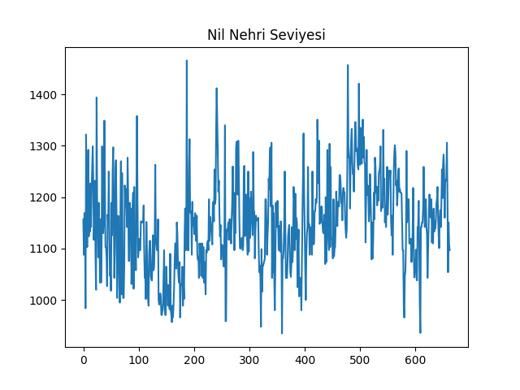
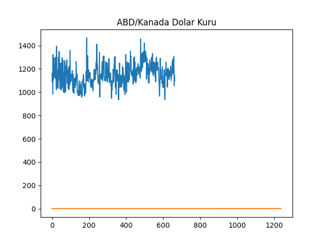

# Durağanlık ve Testler

Bazı durumlarda bir durağan seriyi çıplak gözle bakarak tanıyabiliriz. Her
zaman bu mümkün olmayabilir fakat bariz durumlarda bunu anlamak, hatta
anlayabilmek lazım. 

Bir durağan serinin grafiği sabit bir seviye etrafında salınım yapıyor
olmalıdır, ki bu fenomene ortalamaya dönüş (mean-reversion) adı
verilir. Yani seri yükseliyor, azalıyor olabilir, ama sürekli belli bir
değere rutin şekilde dönüş yapıyor olmalıdır. Seri içinde bazı noktalarda
bir zıplayış ta görülebilir, eğer bu zıplayış düzenli aralıklarla oluyorsa
yine durağanlığı bozmaz. 

Mesela altta Nil Nehrinin seviyesinin ölçümü MS 622-1284 arasında
alınmış, bu seriyi grafikleyelim,

```python
import pandas as pd
nile = pd.read_csv('nile-water-level.csv',header=None)
nile[1].plot()
plt.title('Nil Nehri Seviyesi')
plt.savefig('tser_mean_01.png')
```



Onun durağan olduğunu görüyoruz. Diğer yandan ABD Doları / Kanada Doları
arasındaki döviz kuru gösterilmektedir, bu verinin alttaki dosya içinde
sadece 16:59 itibariyle kapanış fiyatlarını baz aldık, 1 dakikalık bir
kesit bu, 

```python
import statsmodels.tsa.stattools as st
import pandas as pd
df_caus = pd.read_csv('USDCAD.csv')
df_caus['y'].plot()
plt.title('ABD/Kanada Dolar Kuru')
plt.savefig('tser_mean_02.png')
```



Bu zaman serisi durağan değildir. 

Durağanlık senet al/sat için kullanılabilecek bir faktördür. Çünkü
ortalamaya-dönüş / durağanlık var ise, varlık fiyatı bilinen ortalamadan
aşağı düştükçe senet alınır, yukarı çıkınca senet satılır, aradaki fark kar
olarak cebe atılır. Azdan Al Üstten Sat (Buy Low Sell High) deyişi tam
burada uygundur. Tabii finans zaman serilerinin çoğu durağan değildir, ama
bazen belli zaman aralıklarında ortalama dönüş keşfedilebilir, ya da
durağanlık "yaratılır''. Bunun detaylarına ileride geleceğiz. 

Durağanlığı anlamak istatistiki testler vardır.

Dickey-Fuller Testi

Bu teste gore 

$$ \Delta y_t = \lambda y_{t-1} + \mu + \beta t + 
\alpha_1 \Delta y_{t-1} + ... + 
\alpha_k \Delta y_{t-k} + \epsilon_t
$$

ki $\epsilon_t$ gürültüdür. Çoğunlukla testte $k=1$ kabul edilir, yani
formül şu halde olacaktır,

$$ \Delta y_t = \lambda y_{t-1} + 
\mu + \beta t +  
\alpha_1 \Delta y_{t-1} + 
\epsilon_t 
\qquad (1)
$$

Formül nereden geliyor? Anlamak için önce Rasgele Yürüyüş (random walk) zaman
serilerine bakalım, bu seri

$$ y_t = y_{t-1} + \epsilon_t $$

olarak gösteriliyor, yani $t$ anındaki değer bir önceki $t-1$ anındaki değer
artı gürültüdür, ki $\epsilon_t \sim N(0,\sigma^2)$. Bir de Kaymalı Rasgele
Yürüyüş (random walk with drift) var,

$$ y_t = y_{t-1} + \mu + \epsilon_t $$

Rasgele Yürüyüş serileri üstteki haliyle durağan değil. Çünkü yürüyüş
"rasgele'', genel trend toplana toplana yukarı da aşağı da gidebilir, bir
ortalamaya dönmesi garanti değil. Problem bir önceki değere olan bağlantı,
yani $y_{t-1}$. Rasgele yürüyüş olmaması için o bağlantının yokolması
lazım. Bunun istatistiki testini

$$ y_t = \rho y_{t-1} + \mu + \epsilon_t $$

şeklinde tanımlayabilirdik, bu durumda

$$ H_0: \rho = 1 $$

$$ H_1: \rho < 1 $$

test edilirdi. Eğer $\rho=1$ değil ise, rasgele yürüyüş yok. Cebirsel olarak
işleri kolaylaştırmak için iki taraftan $y_{t-1}$ çıkartılır,

$$ y_t - y_{t-1} = \rho y_{t-1} - y_{t-1} + \mu + \epsilon_t $$

$$  = (1-\rho) y_{t-1} + \mu + \epsilon_t $$

$1-\rho = \lambda$ kullanalım,

$$ \Delta y_t  = \lambda y_{t-1} + \mu + \epsilon_t $$

Şimdi $\rho = 1$ testi $\lambda=0$ testi demektir, bu durumda

$$ \Delta y_t  = \cancel{\lambda y_{t-1}} + \mu + \epsilon_t $$

olurdu. Ayrıca zamana bağlı lineer kaydırma da (linear drift) eklenebilir, 

$$ \Delta y_t  = \lambda y_{t-1} + \mu + \beta t + \epsilon_t
\qquad (2)
$$

Görüldüğü gibi neredeyse (1) ile tamamen aynı. Üstteki ifade $y_t$ farkları
ve $y_{t-1}$ ve diğer değişkenler üzerinden regresyona sokulacaktır ve
sonuçlar irdelenecektir.  Fakat bir pürüz var, $y_{t-1}$ değişkeni $H_o$
altında normal dağılamaz, çünkü katsayı $y_{t-1}$ için, ki bu değişken de
zaman serisindeki noktalardan biri sonuçta ve onun üzerinde normallik
faraziyesi yapamayız (rasgele yürüyüş her adımda normal bir adımı
*toplar*, bu toplam normal diyemeyiz). Regresyona sokulan değişken
$\Delta y_t$ bir I(1) değişkeni, orada normallik farzedilebilir. Bu durumda
$\lambda$ için elde edilen katsayı ve onun t değeri Öğrenci t dağılımına
sahip değil, başka bir dağılım ortaya çıkıyor. Neyse ki Dickey ve Fuller
bize gereken kritik değerleri bu başka dağılım için simülasyon üzerinden
hesaplamışlar, ve hipotez reddi için bu eşik değerlerini kullanıyoruz,
zaten ADF kütüphaneleri $\lambda$ hesabı ile beraber bu kritik değerleri
raporluyorlar.

Veri üzerinde görelim, önce Nil Nehri verisi

```python
print st.adfuller(nile[1],maxlag=1)
```

```
(-10.065106269033185, 1.302505000632203e-17, 1, 661, {'5%': -2.8659224464259823,
 '1%': -3.4402817347322583, '10%': -2.5691038118332603}, 7529.8499066238182)
```

Hipotezi reddetmek istiyorsak elde edilen değer, kritik eşit değerlerinden daha
küçük olmalı, bizim elimizde -10.06 değeri var, \%95 için eşik değeri
-2.86. Daha küçük, hipotez reddedildi. Unutmayalım, hipotez $H_0$ serisinin
durağan olmadığı. 
 
Döviz kuru verisi üzerinde, 

```python
print st.adfuller(df_caus.y,maxlag=1)
```

```
(-1.869396174934818, 0.34659219335600189, 0, 1236, {'5%':
                                %-2.8638812231195359, '1%':
                                %-3.4356517256484151, '10%':
                                %-2.5680164989107781}, -8190.3235420441761) 
```

Bu sonuca göre hipotezi, yani $\lambda=0$'i reddedemedik. Serinin durağan
olmadığı olasılığı hala çok güçlü. Demek ki ABD/Kanada dolar kurunun durağan
olduğunu gösteremiyoruz.

Hurst Üsteli (Hurst Exponent)

Kabaca belirtmek gerekirse durağan bir fiyat serisinin yayınımı (diffusion)
bir geometrik rasgele yürüyüşe göre daha yavaştır. Matematiksel olarak bu
yayınımı ölçmenin yolu var, 

```python
import hurst as h
print 'H doviz kuru', h.hurst(np.log(df_caus.y))
print 'H Nil Nehri', h.hurst(nile[1])
```

```
H doviz kuru 0.460763303802
H Nil Nehri 0.075586961757
```

Eğer $H=0.5$ ise bu rasgele yürüyüş demektir. Eğer $H<0.5$ ise ortalama dönüş
mevcuttur, trend olan bir şeride (ki bu patlıyor, yani yayınımı yüksek demek)
$H>0.5$ olacaktır.

Üstteki sonuçlarda 0.46 elde edildi, *bir ihtimal* ortalamaya dönüşün
mevcuduna ispat olabilir bu, ama kesin değil, hala 0.5'e çok yakın. Nil Nehri
için 0.075, ortalama dönüşün varlığı için kuvvetli ihtimal.

Varyans Oranı (Variance Ratio)

```python
from arch.unitroot import VarianceRatio
vr = VarianceRatio(np.log(df_caus.y),overlap=False)
print(vr.summary().as_text())
```

```
     Variance-Ratio Test Results     
=====================================
Test Statistic                  0.846
P-value                         0.398
Lags                                2
-------------------------------------

Computed with non-overlapping blocks
```

```python
from arch.unitroot import VarianceRatio
vr = VarianceRatio(nile[1], overlap=False)
print(vr.summary().as_text())
```

```
     Variance-Ratio Test Results     
=====================================
Test Statistic                 -5.493
P-value                         0.000
Lags                                2
-------------------------------------

Computed with non-overlapping blocks
```

Burada elde edilen p-değerleri sıfır hipotezi için kullanılmalı, ki bu
hipotez \%90 güven ile rasgele yürüyüş hipotezinin varlığının ispatıdır,
çok düşük p-değeri bu hipotezi red için kullanılabilir. Üstte \%54 tamamen,
kesin şekilde rededemiyoruz anlamına gelir. Nil Nehri için p-value 0; yani
rasgele yürüyüş ihtimali sıfır.

Ortalamaya Dönüş için Hayat Yarılama Zamanı (Half-Life) Hesaplamak

Bir önceki örnekte \%90 güvenle ABD/Kanada kurununun ortalamaya dönüş yapan
bir seri olmadığını gösterdik. Fakat bu demek değildir ki bu seri üzerinden
ortalamaya dönüş stratejisi ile para kazanmak mümkün olmasın. Çoğu kazançlı
borsa alım/satım modelinin bu kadar yüksek bir güvene ihtiyacı
yoktur. ABD/Kanada serisinin alım/satım için bir aday olup olmadığını
anlamak için onun hayat yarılama zamanını hesaplayabiliriz.

Hayat yarılama zamanı şu formüle bağlı olarak hesaplanabilir,

$$ dy_t = (\lambda y_{t-1} + \mu )dt + d\epsilon $$

Bu formül Rasgele Calculus'tan (Stochastic Calculus) geliyor, ve
Ornstein-Uhlenbeck formülü olarak bilinir. Dikkat edilirse (2)'nin bir nevi
Calculus formu olduğu görülebilir. Bu formülün $\lambda$ parametresini veriye
lineer regresyon ile uydurarak hesaplayabiliriz, $dy_t$ `deltaY`  olarak,
$y_{t-1}$ ise `ylag` olarak regresyona verilir.

Not: [7]'de $y_{t-1}$ kullanılıyor fakat bu denklemin asıl formu $y_t$
kullanır. Yazar herhalde $\Delta y$ hesaplanırken $y_t-y_{t-1}$ yapıldığı
için üstteki eşitliğin sağ tarafında $y_{t-1}$ kullanma ihtiyacı hissetmiş.

Not: Regresyon için gereken $y = ax + b$ formunu tam göremiyor olabiliriz,
$dt$ pürüz çıkartıyor. Fakat bu değer $dt=1$, yani bir birimlik bir
değişim, değişim birimini 1 almalıyız ki bu şekilde hesapladığımız
$\lambda$ hayat yarılama için gün hesabı verebilsin.

```python
df_caus['ylag'] = df_caus['y'].shift(1)
df_caus['deltaY'] = df_caus['y'] - df_caus['ylag']

import statsmodels.formula.api as smf
results = smf.ols('deltaY ~ ylag', data=df_caus).fit()
```

Bu formülün ilginç tarafı şurada, Olasıksal Calculus ile çözümün beklentisi,

$$ E[y_t] = y_0 e^{\lambda t} - \frac{\mu}{\lambda} ( 1 - e^{\lambda t}) $$
Şimdi biraz önce veriden bulduğumuz $\lambda$ hayat yarılama hesabı için
kullanılabilir, çünkü üstteki denklem $e$'nin üstel değeri olarak
$\lambda$'yi kullanıyor. Negatif $\lambda$ ortalamaya dönüş işaretidir ve
azalışın hayat yarılama zamanı $-\log(2)/\lambda$ olarak bilinir.

```python
lam = results.params['ylag']
print lam
```

```
-0.00590028106064
```

Bu hesabın borsacılar için ne kadar faydalı olduğu görülebilir, eğer
$\lambda$ pozitif ise ortalamaya dönüş zaten yoktur, bu hisseden uzak
durulur. Eğer negatif ise ve çok sıfıra yakın ise hayat yarılama zamanı çok
uzun olur, herhangi bir zaman periyotu içinde yeteri kadar al/sat
yapılamaz.

```python
halflife=-np.log(2)/lam
print halflife, 'days'
```

```
117.476976679 days
```

Daha fazla detay için [8] bölümüne bakılabilir.

Alım / Satım

Bir seri ortalamaya dönen türden ise, ve hayat yarılama zamanı bizim satın alma
zaman dilimine uygunsa (mesela 112 günlük bir zaman bazıları için çok uzun
olabilir, o kadar beklemek istemeyenler olabilir) o zaman üstteki kur fiyatı
üzerinde basit bir lineer strateji ile oynamaya başlanabilir. Fiyatın normalize
edilmiş sapması hesaplanır, ki bunu yapmak için yürüyen ortalama (moving
average) ile hareket eden standard sapma (moving standard deviation) bölünür, ve
bu sapmaya *ters* orandaki miktarda varlık (asset) elde tutulur. Üstteki
durumda, elinde ABD doları olan biri için, Z hesabı mesela -2 ise 2 Kanada
doları almak lazım, +2 ise 2 birim açığa satmış olmak lazım. Oran nedir? Mesela
1000 olabilir, -2 ise 2000 alınır, vs.

Bu testin gerçek alışveriş ile bağlantısı şurada, eğer ortalamadan düşüş
var ise o düşüşe oranlı varlık alıp elde tutuyoruz, ve ortalama dönünce
varlıkları satıyoruz. Alttan aldığımız için aradaki fark
kardır. Ortalamadan yükseklik durumu var ise o oranda varlığı açığa
satarız, çünkü biliriz ki fiyat aşağı inecektir, bu satışın bedeli hesaba
yazılır, sonra (umarız ki daha düşük fiyattan) ortalamaya dönüş (düşüş)
olduğunda pozisyonu kapattığımızda aradaki fark cepte kar kalacaktır.

```python
halflife = 117
data_mean = pd.rolling_mean(df_caus['y'], window=int(halflife))
data_std = pd.rolling_std(df_caus['y'], window=int(halflife))
df_caus['mktVal'] = -1*(df_caus['y']-data_mean) / data_std
pnl = df_caus['mktVal'].shift(1) * df_caus.y.pct_change()
pnl = pnl.fillna(0).cumsum()
pnl.plot()
plt.ylabel('Kumulatif Kazanc / Kayip')
plt.savefig('tser_mean_03.png')
```


Kumulatif hesap görülüyor. Uzun bir düşüş kalıcılığı (drawdown) var, bu pek
iyi değil, strateji sonlara doğru pozitif getiri noktasına geliyor. Fena
değil. Tabii bu stratejiyi olduğu gibi alım/satım için baz almak pek pratik
olmayabilir, üstteki kazanç / zararı üretmek için sınırsız sermaye gerekebilir
mesela ki bu gerçekçi değil. Bu örneğin yapmaya çalıştığı şudur -- her zaman
durağanlık olmamasının ortalamaya dönüş stratejisini kullanmak için bir engel
olmayabileceğini göstermek. Ayrıca ortalamaya dönüş ile getiri elde etmek için
aşırı çetrefil teknik göstergeçler ve stratejiler gerekmediğini anlatmak.

Yanlız şu gözlemi de eklemek lazım, çoğu varlığın hareketi durağan /
ortalamaya dönüş karakterinde değildir. Fakat bu limitasyonun etrafından
dolaşmamızı sağlayacak bir teknik var. Koentegrasyon bölümünde bunu
göreceğiz. Bu bölümde öğrendiklerimiz boşa gitmeyecek!

Dikkat, Z skorunun söylediği miktarın ters oranı *seviyesindeki* varlığı
elde tutuyoruz, her gün skorun söylediği kadar varlığı eklemiyoruz. Mesela bugün
1 diyor, ertesi gün 2 diyor şimdi elde 3 değil, bugün 1, yarın 2 diyorsa, eldeki
1'e 1 ekleyip 2 seviyesine geliyoruz. 

Kaynaklar
 
[1] FRED, *Canada / U.S. Foreign Exchange Rate (DEXCAUS)*, [https://research.stlouisfed.org/fred2/series/DEXCAUS/downloaddata](https://research.stlouisfed.org/fred2/series/DEXCAUS/downloaddata)

[2] IHMC, *A random walk process*, [http://cmapskm.ihmc.us/rid=1052458884462_996058812_7176](http://cmapskm.ihmc.us/rid=1052458884462_996058812_7176)

[3] Lambert, *Dickey Fuller test for unit root*, [https://www.youtube.com/watch?v=2GxWgIumPTA](https://www.youtube.com/watch?v=2GxWgIumPTA)

[4] Cross Validated, *Which Dickey-Fuller test for a time series modelled with an intercept/drift and a linear trend?*,[http://stats.stackexchange.com/questions/44647/which-dickey-fuller-test-should-i-apply-to-a-time-series-with-an-underlying-mode](http://stats.stackexchange.com/questions/44647/which-dickey-fuller-test-should-i-apply-to-a-time-series-with-an-underlying-mode)

[5] Halls-Moore, *Basics of Statistical Mean Reversion Testing*,[https://www.quantstart.com/articles/Basics-of-Statistical-Mean-Reversion-Testing](https://www.quantstart.com/articles/Basics-of-Statistical-Mean-Reversion-Testing)

[6] Sheppard, *Unit Root Testing*, [http://nbviewer.ipython.org/github/bashtage/arch/blob/master/examples/unitroot_examples.ipynb](http://nbviewer.ipython.org/github/bashtage/arch/blob/master/examples/unitroot_examples.ipynb)

[7] Chan, *Algorithmic Trading*

[8] Bayramlı, Istatistik, *Olasılıksal Calculus*


