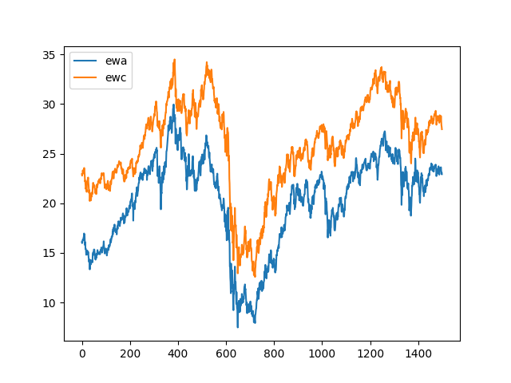
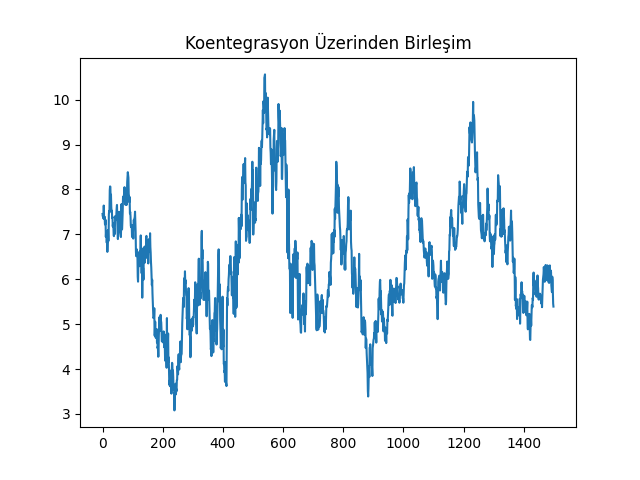
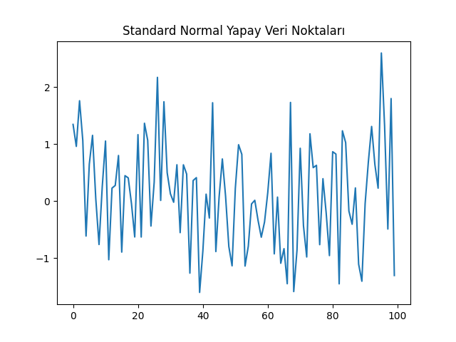
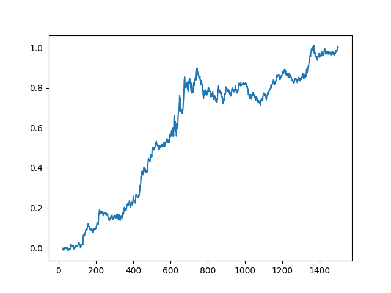
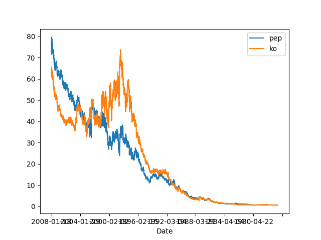

# Koentegrasyon (Cointegration)

Daha önce bahsettiğimiz gibi çoğu finansal zaman serisi durağan ya da
ortalamaya dönüşlü değildir. Neyse ki sadece o tür varlıklara bağlı
değiliz. Kendimiz proaktif olarak içinde birden fazla fiyat serisi içeren
bir paket / portföy / enstrüman yaratabiliriz ki bu porföyün bütününün
zaman serisi durağan olur. Koentegrasyon işte budur: durağan olmayan zaman
serilerinin lineer kombinasyonunu yaratıp durağan olan bir seri yaratmak,
ki bu durumda birleştirilen serilerin *koentegre edilmiş* olduğu
söylenir. Çoğunlukla bu iki zaman serisi ile yapılır, belli yüzdeler
üzerinden bir varlığı alıp, diğerini açığa satarız; bu strateji iyi bilinen
"eşli oynama (pairs trading)'' stratejisidir. Fakat koentegrasyon tekniği
kolaylıkla üç ve daha fazla fiyat serisi için de kullanılabilir. Bu bölümde
CADF ve Johansen testini göreceğiz, bunlar iki yaygın koentegrasyon
testidir. CADF sadece iki seri için kullanılabilir, Johansen ikiden fazla
seri ile işleyebilir.

İki zaman serisi olduğu durumda aslında olan şudur: iki serinin lineer
kombinasyonu demek aslında bu iki serinin arasında lineer regresyon
işletmekten ibarettir. Regresyonun sonucu olan düz çizginin katsayısı iki
değişkenin nasıl birleştirilebileceğini gösterir,

```python
import pandas as pd
df = pd.read_csv('ETF.csv',index_col=0)
df[['ewa','ewc']].plot()
plt.savefig('tser_coint_01.png')
```



```python
plt.scatter(df['ewa'],df['ewc'])
plt.title('ewa / ewc')
plt.savefig('tser_coint_02.png')
```


```python
import statsmodels.formula.api as smf
results = smf.ols('ewc ~ ewa', data=df).fit()
hedgeRatio = results.params['ewa']
print (hedgeRatio)
```

```text
0.9624293986852102
```

Birleştirince 

```python
df['coint'] = df['ewc']-hedgeRatio*df['ewa']
df['coint'].plot()
plt.title(u'Koentegrasyon Üzerinden Birleşim')
plt.savefig('tser_coint_03.png')
```



Aslında "birleştirmek'' tam doğru bir kelime değil [4, sf. 413]. Bir regresyon
işlettik, ve $y$ içinden $x$'i *çıkarttık*. Arada lineer bağlantı vardı, ve
bu durumda (eğer model iyi ise) geri kalan nedir? Gürültüdür!  Gürültü, yani
verili bir ortalama (mean) etrafında salınım Gaussian / Normal dağılım değil
midir?  Evet! Aslında zamana yayılmış Gaussian gürültü durağandır. Yani gürültü
üzerinde borsa işlemi karlı bir şeydir! İlginç değil mi? Örnek olarak 100 tane
standart normal dağılımdan gelen veri noktası üretelim,

```python
plt.plot(np.random.normal(loc=0,scale=1.0,size=100))
plt.title(u'Standard Normal Yapay Veri Noktaları')
plt.savefig('tser_coint_04.png')
```



Görüldüğü gibi üstteki sonuca oldukça benziyor. Yazının geri kalanında
koentegrasyon sonrası ortaya yeni seri çıkartmaya birleşim diyeceğiz.

Bir diğer bakış açısından daha bahsedelim; bir seneti $x$ diğerini $y$
ekseni üzerinden ve zaman serisi noktalarını $x,y$ kordinatları gibi
eşleyip kullanınca, 3 üstteki grafiği elde ettik. Bu grafikte lineer ilişki
görülüyordu, bu veriye çizgi uydurarak geri kalan gürültü üzerinde
ortalamaya dönüş yapabiliyoruz. Bunu söylemek, aslında 4 üstte her iki
zaman serisinin $y$ ekseni grafiklenmiş halindeki serilerin birbiriyle olan
"farkının'' bir ortalamaya dönüyor olması ile aynıdır. Dikkat edersek iki
seri birbiri ile yakından alakalı, ve aralarındaki fark bazen çoğalsa bile,
çoğunlukla belli bir seviyeye düşüyor. İşte bu aralık, fark (spread), ya da
marj üzerinde de ortalamaya dönüş teknikleri uygulanabiliyor. Düşünülürse
bu ilişki bariz gelecektir; iki seri $x,y$ arasında ilişki ortalamadan
uzaklaştığında bu noktalarda gürültü artmış olacaktır, aynı noktalarda
ikili $y$ grafiğinde aradaki fark fazlalaşmış demektir.

Bu arada, ortalamaya dönüş tekniği çoğunlukla ikinci yaklaşım üzerinden tarif
edilir, farkın olup olmadığı, artıp artmadığı anlatılır.

Şimdi daha ilerlemeden önce ortaya çıkan birleşimin gerçekten durağan olup
olmadığını anlamak için yapılan testi görelim.

CADF (Koentegreli Genişletilmiş Dickey-Fuller Testi)

Akla bir soru gelebilir: eğer serileri birleştirip durağanlık
yaratabiliyorsak elimizde zaten durağanlık testi var, niye yeni bir testi
kullanalım? Lineer regresyon yapıp birleştiririz, sonra sonuç üzerinde eski
ADF testini yaparız. Aslında Engle ve Granger adlı araştırmacıların 
yaptığı tam da bu, alttaki çıktıda durağanlığı test etmek mümkün. Not:
hangi değişkenin $y$ hangisinin $x$ olduğu önemli (lineer regresyon
yapıldığında da önemli tabii ki). Ayrıca bu test sadece iki değişken için
işliyor. Daha çok değişken için başka bir yöntem gerekecek.

```python
import pyconometrics
print (pyconometrics.cadf(np.matrix(df['ewa']).H,
                         np.matrix(df['ewc']).H,0,1))
```

```text
{'alpha': np.float64(-0.020410811983993898), 'adf':
np.float64(-3.6434663488715717), 'crit': matrix([[-3.88031, -3.35851,
-3.03798, -1.01144, -0.65334, 0.15312]]), 'nlag': 1, 'nvar': 1}
```

Bu sonuçları şu şekilde okuyabiliriz; -3.64 değeri \%95 seviyesindeki değer
-3.35'den daha negatiftir (eşik değerleri sırasıyla \%99,\%95,\%90). O
zaman sıfır hipotezini (null hypothesis) reddederiz, yani yani EWA ve
EWC'nin \%95 kesinlikle koentegre olduğunu söyleyebiliriz.

Sonuç zaman serisi üzerinde Hurst hesabını yaparsak,

```python
import statsmodels.tsa.stattools as st
import sys; sys.path.append('../tser_025_mean')
import hurst 
print (st.adfuller(df['coint'],maxlag=1))
```

```text
(np.float64(-3.6422479807847266), np.float64(0.005002848324386615), 1, 1498, {'1%': np.float64(-3.4347228578139943), '5%': np.float64(-2.863471337969528), '10%': np.float64(-2.5677982210726897)}, np.float64(550.2164129635376))
```

Johansen Testi

Eğer birden fazla zaman serisi arasında koentegrasyon arıyorsak, başka bir
yöntem gerekli. Bu konuda ilk akla şu gelebilir: regresyon sonrası artıklar
ortalamaya-dönüş ise, çok boyutta regresyon yaparım ve artıkları
kullanırım. Burada problem şudur: hangi değişken $y$ hangisi $x$ (vektörü)
olacak? Tüm seçenekleri denemek zaman alabilir. Johansen testi aslında
akıllıca bir özvektör hesabı ile tam da bunu gerçekleştiriyor (detaylar
için [1, sf. 165]). 

```python
from johansen import coint_johansen, print_johan_stats
res = coint_johansen(df[['ewa','ewc']], 0, 1)
print_johan_stats(res)
```

```text
trace statistic [19.98321869  3.98276124]
critical vals %90,%95,%99
r<=0 [13.4294 15.4943 19.9349]
r<=1 [2.7055 3.8415 6.6349]
eigen statistic [16.00045745  3.98276124]
critical values  %90,%95,%99
r<=0 [12.2971 14.2639 18.52  ]
r<=1 [2.7055 3.8415 6.6349]
ozdegerler [0.01062437 0.00265519]
ozvektorler
[[ 0.74078233 -0.12758778]
 [-0.74218753 -0.08957951]]
```

Şimdi üçüncü bir varlık, IGE ekleyelim, ve üçü arasında koentegrasyon testi
yapalım,

```python
cols = ['ewc','ewa','ige']
res3 = coint_johansen(df[cols], 0, 1)
print_johan_stats(res3)
```

```text
trace statistic [34.42862022 17.53171895  4.47102054]
critical vals %90,%95,%99
r<=0 [27.0669 29.7961 35.4628]
r<=1 [13.4294 15.4943 19.9349]
r<=2 [2.7055 3.8415 6.6349]
eigen statistic [16.89690127 13.06069841  4.47102054]
critical values  %90,%95,%99
r<=0 [18.8928 21.1314 25.865 ]
r<=1 [12.2971 14.2639 18.52  ]
r<=2 [2.7055 3.8415 6.6349]
ozdegerler [0.01121626 0.00868086 0.00298021]
ozvektorler
[[-1.04602749 -0.5796762  -0.26467204]
 [ 0.7599635  -0.11204898 -0.0789828 ]
 [ 0.22330592  0.53159644  0.09515547]]
```

Johansen testi iki türlü hesap yapar, biri iz istatistiği (trace statistic)
diğeri öz istatistiği (eigen statistic). Bu sonucu irdelemek için, herhangi
bir metot için, o metotun raporladığı istatistik değere bakarız, ve bu
değerlerin kritik aralıklara düşüp düşmediğini kontrol ederiz. Eğer
düşüyorsa, $r \le 0, r \le 1, ..$ için kontrol ederiz, o kadar fiyat serisi
arasında koentegrasyon var demektir. Üstteki örnekte iz istatistiği her üç
senet için \%95-\%99 aralığına düşüyor, demek ki \%95 seviyesinde
hipotezleri reddediyoruz, ve koentegrasyonu kabul ediyoruz. 

```python
df['yport'] = np.dot(df[cols], res3.evec[:,0])
df['yport'].plot()
plt.savefig('tser_coint_05.png')
```


```python
import sys; sys.path.append('../tser_015_stoc')
import halflife
hf = halflife.halflife(df, 'yport')[1]
data_mean = df['yport'].rolling(window=int(hf)).mean()
data_std = df['yport'].rolling(int(hf)).std()
# yport evec ile senet carpimi
# numUnits yport'un Z skoru
df['numUnits'] = -1*(df['yport']-data_mean) / data_std
```

```python
# Z skoru 3 kolon yap
tmp1 = np.ones(df[cols].shape) * np.array([df['numUnits']]).T
# evec tekrarla, her satirda tekrar tekrar
tmp2 = np.ones(df[cols].shape) * np.array([res3.evec[:,0]])
# evec sermayenin nasil bolusturuldugu olarak gorulebilir
# positions ise her senete dolar biriminde ne kadar para ayrildigi
positions = tmp1 * tmp2 * df[cols]
positions = pd.DataFrame(positions)
# stratejinin gunluk kar/zarari
pnl = positions.shift(1) * (df[cols] - df[cols].shift(1))  / df[cols].shift(1)
pnl = pnl.sum(axis=1)
# getiri ise pnl'in portfoyun brut piyasa degeri ile bolunmesi
ret=pnl / np.sum(np.abs(positions.shift(1)),axis=1)
# Kumulatif birlesik getiri
plt.plot(np.cumprod(1+ret)-1)
plt.savefig('tser_coint_06.png')
```



```python
print ('APR', ((np.prod(1.+ret))**(252./len(ret)))-1)
print ('Sharpe', np.sqrt(252.)*np.mean(ret)/np.std(ret))
```

```text
APR 0.12357004072558575
Sharpe 1.3798749282666087
```

Ne kadar para kazanabileceğimizi ölçmek için yine Z skoru yarattık, ve bu
skora ters oranda alım ve satım farz ediyoruz. Tabii özvektör üzerinden
birleştirilmiş yeni seri üzerinden Z skoru yarattık, sonra bu alım/satım
kararlarını tekrar özvektör üzerinden "geriye'' tercüme etmemiz gerekiyor,
ki böylece 3 varlık üzerinde ne kadar alım / satım yaptığımızı
görebilelim. Ek anlatımları üstteki kodun içindeki yorumlarda
bulabilirsiniz.

PCA ile Koentegrasyon

[5] yazısında gördüğümüz ana bileşenler analizi (PCA) tekniği ile de
koentegrasyon yaratmak mümkündür [1, sf. 171]. Yine özvektörler kullanılacak
fakat özvektörler Johansen tekniğinden farklı bir şekilde hesaplanacak. Bir kez
özvektörler elde edildikten sonra ortalamaya dönüş mantığı aynı.

Elde $n$ tane zaman serisi olduğunu düşünelim, $y_1,y_2,..,y_n$ ve bu serilerin
kovaryans matrisi $\Sigma$ vektörü olsun. Tüm $y$'ler her $y_i$ bir kolonda
olmak üzere bir matris içinde olsun, ve bu $y$'lerin lineer kombinasyonu $d =
c^T y$ ile hesaplanabilir, ki $c$ bir ağırlık vektörü olacak. Çözmek istediğimiz
şu; öyle bir $c$ bulalım ki $d$ içindeki ağırlıklar çarpılarak oluşturulmuş
zaman serisinin varyansı maksimum olsun. Tabii ki $c$ üzerinde bir kısıtlama
koymak lazım (yoksa $c$'yi sonsuza çıkartarak sonsuz -maksimum- bir sonuç elde
edilebilirdi) bu kısıtlama $c^T c = 1$ olabilir. Temel istatistikten biliyoruz
ki,

$$
Var(d) = Var(c^T y) = c^T Var(y) c = c^T \Sigma c 
$$

yani $d$'nin varyansı $c^T \Sigma c$. O zaman $c^T \Sigma c$ değerini $c^Tc=1$
kısıtlama şartına uyacak şekilde maksimize etmek gerekli, ya da

$$
c^T \Sigma c - \lambda (c^Tc - 1)
$$

formülünü maksimize etmek. $c$ bazlı olarak türev alıp sıfıra eşitleyince

$$
\Sigma c - \lambda c = 0
$$

elde ediyoruz, böylece [5]'teki forma erişmiş olduk, yani maksimizasyon
problemi $\Sigma$ özdeğerlerini bulma problemi haline geldi.

```python
import pandas as pd
import numpy.linalg as lin

df = pd.read_csv('ETF.csv',index_col=0)
cols = ['ewc','ewa','ige']
Sigma = df[cols].cov()
print (Sigma)
eval,evec = lin.eig(Sigma)
print (eval)
print (evec)
```

```text
           ewc        ewa        ige
ewc  21.837037  20.803273  30.010970
ewa  20.803273  21.615375  28.060908
ige  30.010970  28.060908  44.363554
[84.53329817  0.49305782  2.78960993]
[[ 0.50327072  0.84935206 -0.15912154]
 [ 0.48528435 -0.43015916 -0.76122415]
 [ 0.71499488 -0.30588263  0.62866377]]
```

Özdeğerleri gösterdik, en büyük olanı ilk baştaki, üçüncü (indis 2) olan ikinci
büyük, en küçük olan ortadaki. Her özdeğere tekabül eden özvektörleri kullanarak
üç zaman serisini lineer olarak birleştirip varyansı hesaplarsak,

```python
print (np.std(np.dot(df[cols], evec[:,0]))**2)
print (np.std(np.dot(df[cols], evec[:,1]))**2)
print (np.std(np.dot(df[cols], evec[:,2]))**2)
```

```text
84.47694263816774
0.4927291128202164
2.787750186745372
```

Hakikaten de varyansların özdeğer büyüklük sırasına uyduğunu görüyoruz.

Zaman serilerini grafikleyelim,

```python
df['yport0'] = np.dot(df[cols], evec[:,0])
df['yport1'] = np.dot(df[cols], evec[:,1])
df['yport2'] = np.dot(df[cols], evec[:,2])

fig, axs = plt.subplots(3,sharex=True)
df['yport0'].plot(ax=axs[0])
df['yport1'].plot(ax=axs[1])
df['yport2'].plot(ax=axs[2])
plt.savefig('tser_coint_08.png')
```


Kabaca bakınca ortadaki seri daha durağan gibi gözüküyor.

Ana bileşenler ile koentegrasyonun bağlantısı açık olarak ortada.  Koentegrasyon
ile oluşturulan zaman serisinin varyansı bir $I(1)$ tur serinin varyansından
düşük olacağına göre (ki $I(1)$ durağan olmayan bir serinin tek farkını alarak
elde edilebilen bir seridir), o zaman küçük olan özdeğerlere tekabül eden
özvektörler kullanılarak oluşturulan seri koentegre olacaktır, daha büyük
olanlara tekabül eden birleşimler baz serilerin ortak rasgele trendlerini ortaya
çıkartacaktır.

Birleştirilen tüm serileri üzerinde durağanlık testi yaparsak,

```python
from statsmodels.tsa.stattools import adfuller
print (adfuller(df['yport0'])[1])
print (adfuller(df['yport1'])[1])
print (adfuller(df['yport2'])[1])
```

```text
0.322898009568744
0.011909826790814027
0.06403183470109003
```

Hakikaten de 0.05'ten küçük olan tek zaman serisi ortadaki, o zaman
en küçük özdeğere tekabül eden birleştirim durağan bir seri ortaya
çıkarttı.

Koentegrasyon ve Korelasyon

Koentegrasyon kavramı pek çok borsacı tarafından bilinmez, ama korelasyonu
çoğu kişi iyi biliyor. Bu iki kavram pek çok kişinin kulağına sanki aynı
şey imiş gibi gelebilir; fakat matematiksel olarak koentegrasyon ve
korelasyon birbirinden oldukça farklıdır. İki fiyat serisinin korelasyon
halinde olması bu iki serinin belli zaman aralıklarındaki (mesela günlük)
getirisiyle alakalıdır, korelasyon var ise bu iki fiyatın çoğu günde aynı
yönde hareket edeceği tahmin edilebilir. Fakat pozitif korelasyon iki
senedin uzun vadeli davranışı hakkında hiçbir şey söylemez. Mesela iki
senet birbirinden çok ayrılmış bile olabilir, ama çoğu günde kabaca aynı
yönde hareket ediyorlar ise korelasyon bunu pozitif olarak
gösterir. Alttaki örnekte görelim, senetler Pepsi (PEP) ve Coca-Cola (KO) 
senetleri,

```python
import pandas as pd
dfpepko = pd.read_csv('pep_ko.csv',index_col='Date')
```

```python
dfpepko[['pep','ko']].plot()
plt.savefig('tser_coint_07.png')
```



```python
import corr
dfpepko['retpep'] = dfpepko.pep.pct_change()
dfpepko['retko'] = dfpepko.ko.pct_change()
dfpepko = dfpepko.dropna()
c,tval, pval = corr.p_corr(dfpepko.retpep, dfpepko.retko)
print (c, 'p degeri', pval)
```

```text
0.48474009548752744 p degeri 0.0
```

0 seviyesinde p-değeri senetlerin yüksek korelasyona sahip olduğunu
söylüyor. 

```python
import pyconometrics
print (pyconometrics.cadf(np.matrix(dfpepko.ko).H,
                         np.matrix(dfpepko.pep).H,0,1))
```

```text
{'alpha': np.float64(-0.0013666542750326804), 'adf':
np.float64(-2.6029998443124756), 'crit': matrix([[-3.88031, -3.35851,
-3.03798, -1.01144, -0.65334, 0.15312]]), 'nlag': 1, 'nvar': 1}
```

Koentegrasyon ise -2.62 değeri vermiş, kritik değerler \%99,\%95,\%90 için
gösteriliyor, ve bu değer \%90 için olan kritik değerden bile daha büyük,
yani koentegrasyon ihtimali yüzde 90'dan düşük. Demek ki PEP ve KO arasında
korelasyon var ama koentegrasyon yok.

Matematiksel olarak düşünürsek bu aslında mantıklı, koentegrason bir
regresyondur, serilerden birinin diğerini "açıklaması'' üzerine
kurulmuştur. Korelasyon ise aynı tek tek, atomik noktalardaki değişimlerin
aynı yönde olup olmadığının istatistiği bir anlamda. Bu iki hesap çok
farklı şeyleri anlatıyorlar.

Kodlar [corr.py](corr.py), [johansen.py](johansen.py), [pyconometrics.py](pyconometrics.py).

Kaynaklar 

[1] Maddala, *Unit Roots, Cointegration, and Structural Change*

[2] Chan, *Algorithmic Trading*

[3] Chan, *Quantitative Trading*

[4] Ruppert, *Statistics and Data Analysis for Financial Engineering*

[5] Bayramlı, *Istatistik, Ana Bilesenler Analizi*


