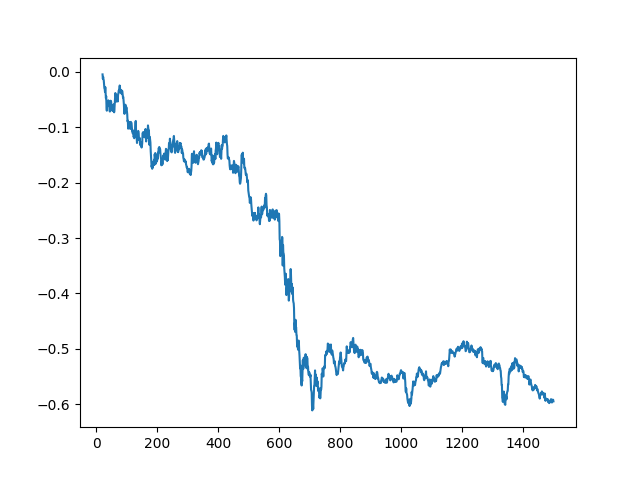
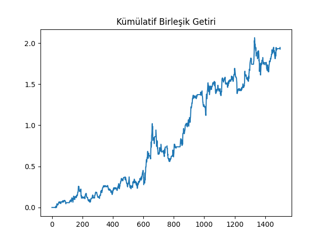
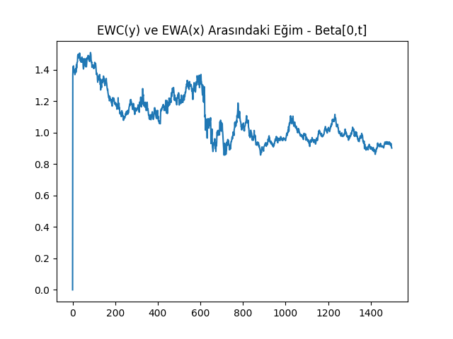
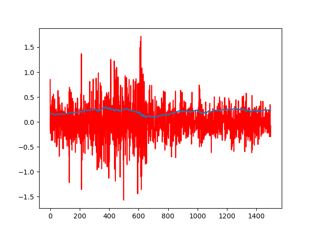
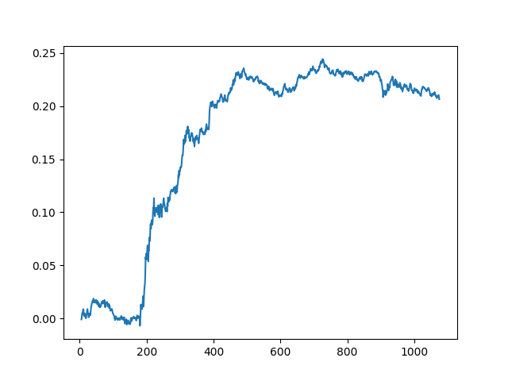
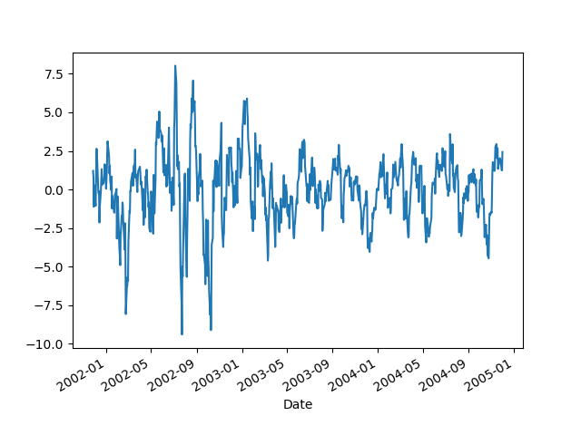

# Ortalamaya Dönüş ile İşlem (Trading)

```python
import statsmodels.formula.api as smf
import statsmodels.api as sm
import pandas as pd
df = pd.read_csv('gld_uso.csv')
cols = ['GLD','USO']
```

Borsada ortalamaya dönüş (mean-reversion) ile nasıl işlem yapılır?  Daha
önce örnekleri gördük, Z-skoru yarattık ve ona ters yönde işlem
yaptık. Altta bazı ek noktalar gösterilecek.

Lineer Regresyon ile bulunan yatırım bölüştürme oranı (hedge ratio) zaman
serisinin her anı için "en iyi'' olmayabilir. Bu durumda yatırımcı belli
bir pencere üzerinden yakın tarihe bakıp oranı sürekli tekrar tekrar
hesaplamayı seçebilir. Altta görülen kod bunu yapıyor,

```python
import statsmodels.api as sm

lookback=20;
df['hedgeRatio'] = np.nan

for t in range(lookback,len(df)):
    x = np.array(df['GLD'])[t-lookback:t]
    x = sm.add_constant(x)
    y = np.array(df['USO'])[t-lookback:t]
    df.loc[t,'hedgeRatio'] = sm.OLS(y,x).fit().params[1]

yport = np.ones(df[cols].shape); yport[:,0] = -df['hedgeRatio']
yport = np.sum(yport,axis=1)
data_mean = pd.rolling_mean(yport, window=20)
data_std = pd.rolling_std(yport, window=20)
df['numUnits'] = -1*(yport-data_mean) / data_std
tmp1 = np.ones(df[cols].shape) * np.array([df['numUnits']]).T
tmp2 = np.ones(df[cols].shape); tmp2[:, 0] = -df['hedgeRatio']
positions = pd.DataFrame(tmp1 * tmp2 * df[cols])
pnl = positions.shift(1) * (df[cols] - df[cols].shift(1))  / df[cols].shift(1)
pnl = pnl.sum(axis=1)
ret=pnl / np.sum(np.abs(positions.shift(1)),axis=1)
print 'APR', ((np.prod(1.+ret))**(252./len(ret)))-1
print 'Sharpe', np.sqrt(252.)*np.mean(ret)/np.std(ret)
```

```
APR 0.233190876207
Sharpe 1.12157265435
```

Yıllık getiri yüzde 23 Sharpe oranı 1.12. Fena değil çünkü bu seri
koentegre bile değil,

```python
import sys; sys.path.append('../tser_coint')
import pyconometrics
print pyconometrics.cadf(np.matrix(df['GLD']).H,
                         np.matrix(df['USO']).H,0,1)

```

```
{'adf': -1.5150247935770809, 'alpha': -0.003112483397873777,
'nlag': 1, 'crit': matrix([[-3.88031, -3.35851, -3.03798,
-1.01144, -0.65334,  0.15312]]), 'nvar': 1}
```

Oran Kullanımı

Eğer basit bir şekilde $y/x$ ile iki varlığını oranını "işlem sinyali''
olarak kullansaydık ne olurdu? Ayrıca diyelim ki her iki varlığa eşit para
yatırıyoruz,

```python
df['hedgeRatio'] = df['USO'] / df['GLD']
data_mean = pd.rolling_mean(df['hedgeRatio'], window=20)
data_std = pd.rolling_std(df['hedgeRatio'], window=20)
df['numUnits'] = -1*(df['hedgeRatio']-data_mean) / data_std
positions = df[['numUnits','numUnits']].copy()
positions = positions * np.array([-1., 1.])
pnl = positions.shift(1) * np.array((df[cols] - df[cols].shift(1))  
      / df[cols].shift(1))
pnl = pnl.fillna(0).sum(axis=1)
ret=pnl / np.sum(np.abs(positions.shift(1)),axis=1)
print 'APR', ((np.prod(1.+ret))**(252./len(ret)))-1.
print 'Sharpe', np.sqrt(252.)*np.mean(ret)/np.std(ret)
```

```
APR -0.140673558863
Sharpe -0.749582932902
```

```python
plt.plot(np.cumprod(1+ret)-1)
plt.hold(False)
plt.savefig('tser_mrimp_01.png')
plt.hold(False)
```



Sonuç iyi değil. 

Bollinger Bantları

Şimdiye kadar gösterilen lineer strateji basit: tek birimlik
durağanlaştırılmış portföy eğer piyasanın yürüyen ortalama üzerinden olan
fiyatın üzerine çıkmışsa, bu çıkış oranında varlık al, düşüşte satmaya
başla. Bölüştürme oranı iki kere kullanılıyor yani, ilk önce yürüyen
ortalama fiyatlarını birleştirmek için, ve sonra en son piyasa fiyatlarını
birleştirmek için. Bu iki serinin birisi durağan serinin son hali,
ortalamadan sapmayı bu ikinci serinin birincisine oranla ölçüyoruz. 

Bu strateji seçildi çünkü hiçbir dış parametre gerektirmeyen bir
strateji. Az parametre iyi bir şey, böylece aşırı uygunluk (overfitting)
gibi problemlerden biraz daha uzaklaşmış oluyoruz (parametreler geçmiş
veriye aşırı iyi uyuyor, bu sebeple geleceği tahmin yeteneği kayboluyor). 

Bollinger bantları üstteki stratejinin bir uzantısı, yine ortalamadan
uzaklaşınca pozisyona giriyoruz, fakat bu uzaklaşmanın kaç standart sapma
oranında olduğuna bakıyoruz. Mesela uzaklaşma 1 standart sapma oranından
fazla ise girebiliriz, 0 standart sapma oranında ise (yani ortalama
üzerinde) pozisyondan çıkarız (bu parametre isimleri sırasıyla
`entryZscore`, `exitZscore`. Ya da `entryZscore=1`,
`exitZscore=-1` diyebilirdik, bu durumda üstte ve altta 1 standart
sapmadan fazla olduğu zaman alım, satım olurdu.

```python
lookback=20;

df['hedgeRatio'] = np.nan
for t in range(lookback,len(df)):
    x = np.array(df['GLD'])[t-lookback:t]
    x = sm.add_constant(x)
    y = np.array(df['USO'])[t-lookback:t]
    df.loc[t,'hedgeRatio'] = sm.OLS(y,x).fit().params[1]   
```

```python
cols = ['GLD','USO']

yport = np.ones(df[cols].shape)
yport[:,0] = -df['hedgeRatio']
yport = yport * df[cols]
yport = yport[cols].sum(axis=1)

data_mean = pd.rolling_mean(yport, window=20)
data_std = pd.rolling_std(yport, window=20)
zScore=(yport-data_mean)/data_std

entryZscore=1.
exitZscore=0

longsEntry=zScore < -entryZscore
longsExit=zScore > -exitZscore
shortsEntry=zScore > entryZscore
shortsExit=zScore < exitZscore

numUnitsLong = pd.Series([np.nan for i in range(len(df))])
numUnitsShort = pd.Series([np.nan for i in range(len(df))])
numUnitsLong[0] = 0.
numUnitsShort[0] = 0.

numUnitsLong[longsEntry] = 1.0
numUnitsLong[longsExit] = 0.0
numUnitsLong = numUnitsLong.fillna(method='ffill')

numUnitsShort[shortsEntry] = -1.0
numUnitsShort[shortsExit] = 0.0
numUnitsShort = numUnitsShort.fillna(method='ffill')
df['numUnits'] = numUnitsShort + numUnitsLong

tmp1 = np.ones(df[cols].shape) * np.array([df['numUnits']]).T
tmp2 = np.ones(df[cols].shape); tmp2[:, 0] = -df['hedgeRatio']
positions = pd.DataFrame(tmp1 * tmp2 * df[cols])
pnl = positions.shift(1) * (df[cols] - df[cols].shift(1))  / df[cols].shift(1)
pnl = pnl.sum(axis=1)
ret=pnl / np.sum(np.abs(positions.shift(1)),axis=1)
ret=ret.fillna(0)
print 'APR', ((np.prod(1.+ret))**(252./len(ret)))-1
print 'Sharpe', np.sqrt(252.)*np.mean(ret)/np.std(ret)
```

```
APR 0.197715854801
Sharpe 1.06408761242
```

```python
plt.plot(np.cumprod(1+ret)-1)
plt.hold(False)
plt.title(u'Kümülatif Birleşik Getiri')
plt.savefig('tser_mrimp_02.png')
plt.hold(False)
```



Kalman Filtreleri ile Dinamik Lineer Regresyon

Gerçekten koentegre halinde olan iki fiyat zaman serisi için yapılacaklar
basit - bulabildiğin kadar tarihi veri bul, basit lineer regresyon ya da
Johansen test kullanarak özvektörleri bul. Fakat diğer yazılarda gördüğümüz
gibi pür koentegresyon çok az sayıda fiyat zaman serisinin erişebildiği bir
mertebe. O zaman, zamana göre değişebilecek yatırım bölüştürme oranını
(hedge ratio) nasıl hesaplayacağız? Diğer örneklerde gördük, bir geriye
bakış penceresi kararlaştır, ve oranı sadece bu pencere içindeki tarihe
veriden hesapla. Bu yaklaşımın dezavantajı, eğer pencere ufak ise pencere
kaydırıldıkça yatırım oranı aşırı sapmalar gösterebilmesi. Aynı durum
ortalamayı ve standard sapma için yürüyen ortalama ve yürüyen sapma
kullanırken de ortaya çıkacak. O zaman eğer en sondaki verilere
öncekilerden daha fazla ağırlık veren, ve kullanıcının kafasından attığı
bir başlangıç noktasına göre pencere oluşturmayan bir yöntem olsa bu bir
ilerleme olurdu. Yatırım bölüştürme oranını Kalman filtresi (KF) kullanarak
hesaplayarak bu ilerlemeyi sağlamayı umuyoruz [1, sf 74].

KF hakkında detaylar [2] yazısında bulunabilir; KF formüllerinin
türetilmesi orada anlatıldı. Bu yazıda gereken bölüştürme oranı, ve yan
ürün olarak bu oranın ortalamasını ve uçuculuğunu (volatility) hesaplamak,
o zaman gizli değişken bölüştürme oranı $\beta$, görünen (observable)
değişken ise fiyat zaman serisi $y$ olacak, yani daha önce basit lineer
regresyona $y$ olarak verilen fiyat serisi. Tüm KF modeli,

$$ \beta_t = I \cdot \beta_{t-1} + \omega_{t-1}$$

$$ y_t = x_t \beta_t + \epsilon_t $$

$\omega_{t-1},\epsilon_t$ Gaussian gürültü olmak üzere. 

Yukarıda ilginç birkaç "numara'' yapıldı; aslında her iki seriyi de, hem
$x$'i, hem $y$'yi biliyoruz, yani onlar "görünüyor''. Ama yapmak
istediğimiz numara bağlamında onlardan sadece birini görünen yaptık, ayrıca
gizli değişkeni $\beta$ yaptık, genellikle bu tür bir parametre gizli
değişkeni transforme eden matris olarak ele alınırdı. Görünen tek veri ise
modele göre $y$. Bu durumda $x$ gizli değişkeni transforme eden matris gibi
kullanılıyor, bu da ilginç. 

Üstteki formüllerden birincisi geçiş (transition) formülü, ve biz eldeki
tüm verileri temsil eden tek bir $\beta$ aradığımız için bu $\beta$'nin
değişmediğini modele söylüyoruz, bu sebeple geçiş matrisi $I$, yani birim
matris, bu matris çarpımda hiçbir etki yaratmıyor.

```python
import numpy as np

def kalman_filter(x,y):

    delta=0.0001
    Ve=0.001

    yhat = np.ones(len(y))*np.nan
    e = np.ones(len(y))*np.nan
    Q = np.ones(len(y))*np.nan
    R = np.zeros((2,2))
    P = np.zeros((2,2))

    beta = np.matrix(np.zeros((2,len(y)))*np.nan)

    Vw=delta/(1-delta)*np.eye(2)

    beta[:, 0]=0.

    for t in range(len(y)):
        if (t > 0):
            beta[:, t]=beta[:, t-1]
            R=P+Vw

        yhat[t]=np.dot(x[t, :],beta[:, t])

        xt = np.matrix(x[t, :])
        Q[t] = np.dot(np.dot(xt,R),xt.T) + Ve

        e[t]=y[t]-yhat[t]

        K=np.dot(R,np.matrix(x[t, :]).T) / Q[t]

        beta[:, t]=beta[:, t]+np.dot(K,np.matrix(e[t]))

        P=R-np.dot(np.dot(K,xt),R)

    return beta, e, Q
```

```python
import pandas as pd, kf
ewdf = pd.read_csv('../tser_coint/ETF.csv')

x = ewdf[['ewa']].copy()
y = ewdf[['ewc']].copy()
x['intercept'] = 1.

x = np.array(x)
y = np.array(y)

beta, e, Q = kf.kalman_filter(x,y)
```

```python
plt.plot(beta[0, :].T)
plt.hold(True)
plt.title('EWC(y) ve EWA(x) Arasındaki Eğim - Beta[0,t]')
plt.savefig('tser_mrimp_03.png')
plt.hold(False)
```



```python
plt.plot(beta[1, :].T)
plt.hold(True)
plt.title('Kesi, Beta[1,t]')
plt.savefig('tser_mrimp_04.png')
plt.hold(False)
```


Bu modelin güzel yan etkilerinden biri şu oldu: KF'in doğal olarak
hesapladığı parametreler ile direk bir ortalamaya-dönüş stratejisi
kodlayabiliriz. $e_t$ içinde ölçüm tahmin hatası var, ki bu hata
EWC-EWA'nın tahmin edilen ortalamasından sapmasından başka bir şey
değil. Bu sapmayı satın alırız, eğer çok pozitif ise al-tut yaparız, çok
negatif ise açığa satış. Çok pozitif, çok negatif neye göre belirlenir? Bu
da $e_t$'nin tahmin edilen standart sapmasından başka bir şey değil, ki bu
bilgi de $\sqrt{Q_t}$ içinde! Her iki parametreyi grafiklersek alttaki
görüntü çıkıyor.

```python
plt.plot(e[2:], 'r')
plt.hold(True)
plt.plot(np.sqrt(Q[2:]))
plt.hold(True)
plt.savefig('tser_mrimp_05.png')
plt.hold(False)
```



Geri kalanlar daha önce Bollinger bantlarında gördüğümüz gibi.

```python
cols = ['ewa','ewc']
y2 = ewdf[cols]

longsEntry=e < -1*np.sqrt(Q)
longsExit=e > -1*np.sqrt(Q)

shortsEntry=e > np.sqrt(Q)
shortsExit=e < np.sqrt(Q)

numUnitsLong = pd.Series([np.nan for i in range(len(ewdf))])
numUnitsShort = pd.Series([np.nan for i in range(len(ewdf))])
numUnitsLong[0]=0.
numUnitsShort[0]=0.

numUnitsLong[longsEntry]=1.
numUnitsLong[longsExit]=0
numUnitsLong = numUnitsLong.fillna(method='ffill')

numUnitsShort[shortsEntry]=-1.
numUnitsShort[shortsExit]=0
numUnitsShort = numUnitsShort.fillna(method='ffill')

ewdf['numUnits']=numUnitsLong+numUnitsShort

tmp1 = np.tile(np.matrix(ewdf.numUnits).T, len(cols))
tmp2 = np.hstack((-1*beta[0, :].T,np.ones((len(ewdf),1))))
positions = np.array(tmp1)*np.array(tmp2)*y2
positions = pd.DataFrame(positions)

tmp1 = np.tile(np.matrix(ewdf.numUnits).T, len(cols))
tmp2 = np.hstack((-1*beta[0, :].T,np.ones((len(ewdf),1))))
positions = np.array(tmp1)*np.array(tmp2)*y2

positions = pd.DataFrame(positions)

tmp1 = np.array(positions.shift(1))
tmp2 = np.array(y2-y2.shift(1))
tmp3 = np.array(y2.shift(1))
pnl = np.sum(tmp1 * tmp2 / tmp3,axis=1)
ret = pnl / np.sum(np.abs(positions.shift(1)),axis=1)
ret = ret.fillna(0)
print 'APR', ((np.prod(1.+ret))**(252./len(ret)))-1
print 'Sharpe', np.sqrt(252.)*np.mean(ret)/np.std(ret)
```

```
APR 0.262251943494
Sharpe 2.36194908518
```

ETF ve ETF'in Öğe Hisseleri Arasında Arbitraj

Bir ETF ve onu oluşturan öğe hisseler arasında da arbitraj fırsatları
vardır. Bu portföyü oluşturmak için her öğe hisse ile ETF arasında teker
teker koentegrasyon aranır, diğerleri atılır. Bu örneği dünyanın belki de
en ünlü ETF'i üzerinde göstereceğiz. Standart \& Poors endeksini baz alan
SPY.

Tarihi veri olarak Ocak 1, 2007 ile Aralık 31, 2007 arasını seçtik, bu
aralıktaki SPY öğelerinin SPY'in kendisi ile en az yüzde 90 koentegre olma
şartını Johansen testi ile kontrol edeceğiz. Ardından bu seçilen senetlerin
her birine eşit sermaye ayıracağız, ve tüm portföy üzerinde tekrar Johansen
testi uygulayıp hala koentegre olup olmadığını kontrol edeceğiz. Bu ikinci
test lazım çünkü her öğeye verilen kafamıza göre verdiğimiz (burada eşit)
sermaye ağırlığı üzerinden oluşturulmuş portföyün illa koentegre olacağı
gibi bir şart yoktur. Bu ikinci test için log fiyat kullanacağız, çünkü bu
portföyü her gün tekrar dengeleyeceğimizi bekliyoruz, yani senet miktarı
üzerinden değil sermaye seviyesini sabit tutacağız. 

```python
import pandas as pd, zipfile

with zipfile.ZipFile('SPY3.zip', 'r') as z:
    dfspy3 =  pd.read_csv(z.open('SPY3.csv'),sep=',')

dfspy3 = dfspy3.set_index('Date')
train = dfspy3[(dfspy3.index>=20070101) & (dfspy3.index<=20071231)]
testspy3 = dfspy3[(dfspy3.index > 20071231)]
resdf = pd.DataFrame(index=dfspy3.columns)
resdf['isCoint'] = np.nan

import sys; sys.path.append('../tser_coint')
from johansen import coint_johansen, print_johan_stats

for s in dfspy3.columns: 
   if s == 'SPY': continue
   # johansen cagrisini kullaniyoruz boylece y,x hangisi secmemiz 
   # gerekmiyor
   data = train[[s,'SPY']].dropna()
   if len(data) < 250: continue
   res = coint_johansen(data, 0, 1)
   if res.lr1[0] > res.cvt[0][0]: 
       resdf.loc[s,'isCoint'] = True
print resdf.isCoint.sum()
```

```
98
```

98 tane senet koentegre imiş. Şimdi bu senetlerle portföy oluşturalım, ve
tekrar koentegrasyon testi yapalım,

```python
coint_cols = list(resdf[resdf.isCoint==True].index)
yN = train[coint_cols]
logMktVal_long = np.log(yN).sum(axis=1)
ytest = pd.concat([logMktVal_long, np.log(train.SPY)],axis=1)
res = coint_johansen(ytest, 0, 1)
print_johan_stats(res)
```

```
trace statistic [ 15.86864835   6.19735725]
critical vals %90,%95,%99
r<=0 [ 13.4294  15.4943  19.9349]
r<=1 [ 2.7055  3.8415  6.6349]

eigen statistic [ 9.6712911   6.19735725]
critical values  %90,%95,%99
r<=0 [ 12.2971  14.2639  18.52  ]
r<=1 [ 2.7055  3.8415  6.6349]

ozdegerler [ 0.0380959   0.02458181]

ozvektorler

[[   1.09386171   -0.27989806]
 [-105.55999232   56.09328286]]
```

```python
tmp1 = np.ones((len(testspy3),resdf.isCoint.sum()))*res.evec[0,0]
tmp2 = np.ones((len(testspy3),1))*res.evec[1,0]
weights = np.hstack((tmp1,tmp2))
yNplus = testspy3[coint_cols + ['SPY']]
logMktVal = np.sum(weights * np.log(yNplus),axis=1)
lookback=5
data_mean = pd.rolling_mean(logMktVal, window=lookback)
data_std = pd.rolling_std(logMktVal, window=lookback)
numUnits = -1*(logMktVal-data_mean) / data_std

numUnits2 = np.reshape(numUnits, (len(numUnits),1))
positions = pd.DataFrame(np.tile(numUnits2, weights.shape[1]),\
                        columns=yNplus.columns)*weights
tmp1 = np.log(yNplus)-np.log(yNplus.shift(1))
pnl = np.sum(np.array(positions.shift(1)) * np.array(tmp1), axis=1)
ret = pnl / np.sum(np.abs(positions.shift(1)),axis=1)
print 'APR', ((np.prod(1.+ret))**(252./len(ret)))-1
print 'Sharpe', np.sqrt(252.)*np.mean(ret)/np.std(ret)
```

```
APR 0.0449298745128
Sharpe 1.32310985261
```

Sonuç ilk deneme için fena sayılmaz; Bazı basit ilerlemeler mümkündür,
mesela her zaman aralığı için portföyü oluşturan senetleri değiştirmek.

```python
plt.plot(np.cumprod(1+ret)-1)
plt.hold(True)
plt.savefig('tser_mrimp_06.png')
plt.hold(False)
```



Trendli Ortalamaya Dönüş

Bir tane de benden. Finans zaman serilerinin çoğunlukla bir trend'e dönüş
yaptığını görebiliriz. Eğer bu trend'i çıkartırsak geriye kalan nedir?
Ortalamaya dönüş yapan, durağan bir zaman serisi değil mi? S\&P 500 üzerinde
görelim,

```python
import pandas as pd
df = pd.read_csv('../tser_draw_sharpe/SPY.csv',index_col='Date',parse_dates=True)
df['SPY'] = df[['Adj Close']]
df = df[df.index < '2005-01-01']
df.SPY.plot()
plt.savefig('tser_mrimp_07.png')
```


Belli noktalarda geriye dönerek belli bir pencere içindeki zaman seri parçası
üzerinde lineer regresyon uyguluyoruz. Daha sonra bu uydurduğumuz çizgiyi ileri
dönük tahmin olarak kullanıyoruz, bu tahminin altına düşüşlerde alım, yukarı
çıkışlarda satım yapıyoruz. 

```python
import statsmodels.api as sm
lookback = 100; forward = 30
forward_points = range(lookback, len(df), forward)
#print forward_points

x = np.ones((lookback,2))
x[:,1] = np.array(range(lookback))

for t in forward_points:    
    y = df.SPY[t-lookback:t]
    f = sm.OLS(y,x).fit()
    df.loc[df.index[t],'intercept'] = f.params[0]
    df.loc[df.index[t],'slope'] = f.params[1]
    #print t, f.params[0], f.params[1]
    
df['ols'] = np.nan
x_lookback = np.array(range(lookback))
for t in forward_points:
   y = x_lookback * df.ix[t].slope + df.ix[t].intercept
   df.loc[t-lookback:t,'ols'] = y
df[['SPY','ols']].plot()
plt.savefig('tser_mrimp_08.png')
```


Trend'i çıkartınca geriye kalanın hakikaten durağan olduğunu görelim,

```python
df['MR'] = df.SPY - df.ols
df.MR.plot()
plt.savefig('tser_mrimp_09.png')
```



```python
win=5
data_mean = pd.rolling_mean(df.MR, window=win)
data_std = pd.rolling_std(df.MR, window=win)
df['mktVal'] = -1*(df.MR-data_mean) / data_std
pnl = df['mktVal'].shift(1) * (df['MR']-df['MR'].shift(1))/ df['MR'].shift(1)
ret=pnl.fillna(0) / np.sum(np.abs(df['mktVal'].shift(1)))
print 'APR', ((np.prod(1.+ret))**(252./len(ret)))-1.
print 'Sharpe', np.sqrt(252.)*np.mean(ret)/np.std(ret)
```

```
APR 0.280181769408
Sharpe 0.888414859744
```


Kaynaklar

[1] Chan, *Algorithmic Trading*

[2] Bayramlı, Fizik, *Kalman Filtreleri*


