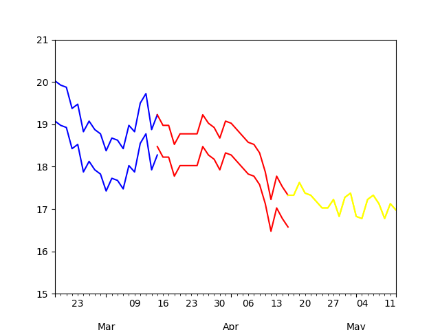
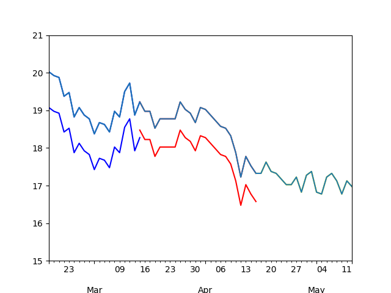
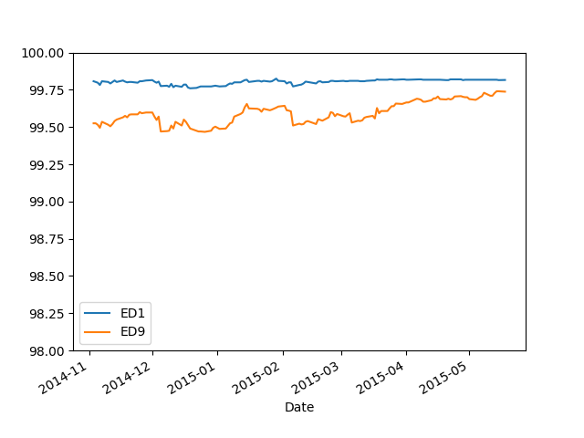
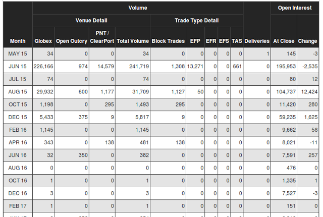
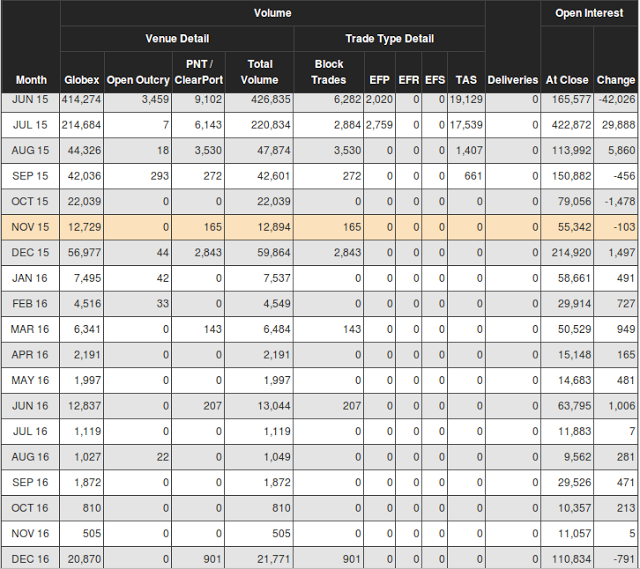

# Vadeli İşlem Sözleşmeleri (Futures Contracts)

Bir alıcı bir satıcı arasında standardize edilmiş miktar, kalite, ve nakliyat
tarihi ve fiyatı alım günü önceden karalaştırılan sözleşmelere vadeli işlem
sözleşmeleri (VİS) ismi veriliyor. Yani bugün üzerinde anlaşılan miktar ve
kalitede enstrüman, sözleşme bittiği gün sözleşme alıcısına verilecektir,
sözleşme bunu garantileyen kanuni bir belgedir. Sözleşmedeki temel enstruman
miktarına eşit nakit ödemesi de yapılabilir, bu konunun detaylarına
gireceğiz. Özet: Ödeme ve varlığın transferi gelecekte olur, fiyat
kararlaştırılması bugün olur [1], [2, sf. 202]. VİS piyasaları medyada daha çok
ilgi gören senet piyasalarından kat kat daha büyüktür.

VİS'ler çoğunlukla petrol, bakır, kahve, mısır, vs. gibi emtia ürünlerinde
bilinir, fakat bir VİS'in temel enstrümanı finansal bile olabilir; mesela S\&P
500 indisini temel alan VİS vardır, Eurodollar'ı temel alan VİS de
vardır. Kontratlar standarttır demiştik, mesela New York kahve sözleşmesi 17
ton'dur (37,500 pound), Chicago mısır sözleşmesi 5,000 kiledir (bushel), ya da
Britanya para birimi pound'u için sözleşme 62,500 pound alışverisi
üzerindendir. Her sözleşmenin fiyat bilgisi farklı ölçekte olabilir, buna
dikkat, mesela hububat ürünleri kile başına dolar olarak, bakır her pound
(ağırlık birimi) için sent olarak (doların kuruşu) alınır ve satılır.

Aracı kurumları alım fiyatının tamamının hemen ödenmesini mecbur kılmaz, bir
teminat (margin), tüm fiyatın ufak bir yüzdesi üzerinden sözleşmeye girilmesine
izin verir. Bu ufak yüzde tabii ki finansal bağlamda borsacılar tarafından
kaldıraç olarak ta kullanılabilir, eğer teminat için yüzde 10 gerekiyorsa, bunu
10 seviyesinde bir kaldıraç olarak kullanabiliriz.

Sözlemelerin teslimatı ay bazındadır, o ayın belli gününde teslimat olur, o ayda
başka günde teslimat olmaz. Ayrıca her ayda teslimat olmayabilir, bu tarım
ürünlerini düşününce mantıklı herhalde, çünkü her ürün her ayda hasat
yapılamaz. Mesela buğdayın (wheat) sadece Mart, Mayıs, Temmuz, Eylül ve Aralık
teslimat günleri / sozlesmesi vardır, Ocak buğday sözleşmesi almak ya da satmak
mümkün değildir. Piyasalarda kontrat ayları kodlanarak belirtiliyor, bu kodlar
Ocak'tan başlayarak F, G, H, J, K, M, N, Q, U, V, X, Z diye gider. Harfler tam
bir sırayı takip etmiyor, nedeni tam olarak bilinmeyen bir şekilde kodlama
böyle, o yüzden eşlemeyi bir yerde kayıtlı, ya da akılda tutmak / ezberlemek
lazım, tahmin etmek mümkün değil.

Sözleşme, teslimat günündeki ödenecek fiyatı garantilemek için yapılıyorsa, o
zaman sözleşme fiyatının piyasadaki dalgalanması o sözleşmenin baz aldığı baz
ürünün teslimat günü / ayındaki fiyatı hakkında bir genel "tahmin'' olarak
algılanabilir. Mesela bugün (Nisan 29, 2016) baktım, Ağustos 2016 ham petrol
sözleşmesinin (NYMEX CL) fiyatı 47.66 dolar, petrolün bugünkü fiyatı 46.41. Yani
VİS piyasası yaklaşık 3 ay sonra petrol fiyatının artacağını düşünüyor.

Bir sözleşmenin fiyatı, o sözleşmenin teslimat tarihi yaklaştıkça, sözleşmenin
baz aldığı ürünün günlük piyasa (spot) fiyatına yaklaşır. Bu arz talep
kanunlarının kaçınılmaz sonucu - eğer bir sözleşme teslimat gününe çok yakın baz
ürününden daha yukarıda ise açığa satışlar olacaktır, bu satışlar VİS'in
fiyatını aşağı çeker, az olduğu durumda tam tersi. Birkaç hafta sonra teslimatı
olacak kahve eğer bugün 10 lira civarında ise, bu sözleşmesi için kim 20 lira
öder ki? Ek not: teslimat tarihine yakın bir VİS'in likiditesi azalır, yani o
sözleşme üzerinde alım / satım daha zorlaşır, bu lojistik bir durum, akılda
tutmak iyi olur. 

VİS'lerin çıkış noktası tarım ürünleridir. Bir çiftçi olduğumuzu düşünelim,
buğday üretiyoruz, fakat tarım ürünlerinde iklim şartlarına göre hasat, ve aylar
sonraki fiyat beklenenden çok farklı olabilir, bu durumda VİS belli miktar,
kalite ve daha önemlisi bir fiyatı şimdiden kitlememizi sağlar, bu çiftçi için
çok faydalı, mesela bir fiyatı kitlemek isteyen çiftçi buğday sözleşmesi (açıga)
satar. Diğer yandan buğday alımı yapmak isteyen bir fırıncı (ekmek yapmak için
buğday lazım), bir sözleşme satın alabilir. Her iki taraf ta aylar, hatta yıllar
sonraki fiyatı kitlemiş olur, gece rahat uyurlar.

Tabii sözleşmelerden, teslimattan bahsettik, fakat emtia bazlı VİS'ler için bile
fiziki teslimat şart değildir, hatta VİS'lerin sadece yüzde 1'i fiziki
teslimatla sonuçlanır. Teslimat gününde çoğunlukla nakit ödeme yapılır, mesela
çiftçi / fırıncı örneğinde Haziran teslimatında kilesi 4 liradan anlaşılmış
olabilir, ama Haziran ayında buğday kilesi 5 lira olmuş diyelim; eğer sözleşme
5000 kile üzerinden ise, çiftçi aradaki 1 x 5000 = 5000 liralık farkı fırıncıya
öder. Tabii çiftçi hala buğdayını satmak istemektedir, ürününü yerel pazarda
satar mesela, günün fiyatı daha yüksek 5 lira olduğu için o fiyattan satış yapıp
o parayı "kazanmış'' olur, ama daha önce kile başı 1 liralık farkı sözleşme
farkı yüzünden kaybetmişti, ve sonuç olarak kile basına 5-1=4 liralık satım
yapmış olur. Ama bu problem değil çünkü zaten ta önceden "kitlediği'' fiyat
buydu! VİS çiftçinin tam istediğini yapmış oldu. Diğer yandan fırıncı 5000 lira
"kazandı'', ama hala buğday almak istiyor, o da kendi yerel pazarından kilesi 5
liradan alım yapar, sözleşme bedelinden daha yüksek bir fiyattan alım yapmış
oldu, fakat 1 liralık farkı nakit ödeme ile çiftçiden almıştı, yani o da kile
basına 5-1=4 liralık alım yapmış oldu. Her iki taraf ta başta razı oldukları
fiyattan alım / satım yapmış oldular.

Eurodollar

Eurodollar VİS'i 1 milyon doların banka hesabında 3 ay tutulmasının bedelini
(yani ona verilecek olan faizi) temsil eder. Enstrümanın fiyatı 100 eksi bir
rakam üzerinden bir yıllık faizi temsil eder, yani eğer fiyat 96 ise temsil
edilen yıllık faiz 100-96=4, yüzde 4 demektir.

Örnek

Diyelim ki bir şirketin 1 Haziran'da bir yatırım, harcama yapması gerekiyor,
bugün 1 Mart (harcama 3 ay sonra yani), bu harcama hesapta yoktu, bu bedelin 3
ay sonra borç alınması gerekecek. Şirket karlı bir şirket, ve alınan borcu
rahatlıkla 1 Eylül'de (borç alımından yine 3 ay sonra) geri
ödeyebilecekler. Diyelim ki bu şirket yerel bankasına gidip istediği zaman LİBOR
+ 100 baz puanından (100 puan = yüzde 1) faiz ile borç alabiliyor.

Fakat 3 ay sonra LİBOR'un ne olduğu bilinmiyor; eğer şirket bir faizi şimdiden
"kitlemek'' istiyorsa, 1 Haziran bitiş tarihli 10 tane Eurodollar VİS'i açığa
satabilir. Diyelim ki 1 Mart'ta VİS'in fiyatı 93.00 ki bu yüzde 7 faiz oranını
temsil eder. Bitiş tarihi 1 Haziran'da fiyat 92.50 olmuş olsun, yani faiz yüzde
7.5. Fiyatta 50 baz puanlık değişim olduğu için bitiş tarihinde şirket \$2500 x
0.5 x 10 kontrat = \$12,500 elde etmis olur. \$2500 nereden geldi? Bu değer
yüzde 1'lik değişimi temsil eden blok değeri, yüzde 1 yıllık temelde, onu 3 ay
bazına indirmek için 4'e böleriz, ve 1 milyon ile çarparız, 1 milyon x 1/4 =
\$2500. Neyse, şirket bu şekilde gelecekteki bir faiz oranını şimdiden kitlemiş
oldu, artık yüzde 7.5 + 100 baz puan ile borç alabilir, ama artık 1 milyon -
\$12,500 = \$9,987,500 için borç alması yeter, çünkü VİS'ten bir kazanç elde
edildi. Kayıp ta olabilirdi, o zaman \$1,012,500 borç alınması gerekecekti,
fakat daha düşük faizden. Her iki durumda da nihai faiz baştan kitlenen yüzde 7
LİBOR üzerinden hesaplanacaktır. 

Vadeli İşlem Sözleşmesi Birleştirmek

Aynı baz ürünü temel alan sözleşmeler farklı teslimat aylarında sunulabilir, o
zaman Aralık 2015 kontratı almışsak Aralık ayı sonunda kontrat bittiğinde o
kontrattan çıkmamışsak petrol bize gönderilecek demektir. Dikkat! Tabii
teslimat kapınıza değil, çoğunlukla bir limandaki bir depoya gönderilir. Neyse,
fakat spekülatörler genel olarak petrol yatırım amaçlı bir "petrol''
kontratına para verirler, bu yatırımda, teslimat almadan, istedikleri kadar
kalabilmek, ya da kendilerine uygun bir zamanda çıkabilmek (ya da tekrar girmek)
isterler. O zaman kontratlar arası bir şekilde geçiş yapmak gerekir. Bu işleme
geçiş yapmak (rollover) deniyor, spekülatör kendine uygun zamanda bir
kontrattan diğerine geçiyor. Fakat bu durumda, en azından geçmişe dönük analiz
bağlamında, elimizde "parçalı'' bir zaman serisi olacaktır, çünkü VİS'ler
zamana bağlıdır, ve her kontratın, aynı alt emtiayı baz alıyor olsa bile,
fiyatları farklı olabilir. O zaman mesela geriye dönük kesintisiz bir zaman
serisi bekleyen analizlerimiz ne yapacak?

Altta VİX indisini baz alan bir üç ayrı sözleşmeyi görüyoruz, biri Mayıs 2015,
diğeri Haziran 2015, öteki Temmuz 2015. Sözleşmeler finansal varlıkları da baz
alabilir demiştik, bu bir diğer örnek işte, VİX S\&P 500 indisinin
oynaklığını baz alan bir sözleşme.

Geçiş için kontratlar arasında hangi tarihlerde atlama yapacağımızı önceden
biliyoruz, bu tarihler altta `stitch_point1`, ve `stitch_point2`
içinde. Birleştirme öncesi durumu gösterelim (alttaki örnek için veriyi
`getvix.py`  ile alabiliriz).

```python
import pandas as pd

stitch_point1 = '2015-03-13'; stitch_point2 = '2015-04-15'

df1 = pd.read_csv('vixmay.csv',index_col=0,parse_dates=True)
df2 = pd.read_csv('vixjune.csv',index_col=0,parse_dates=True)
df3 = pd.read_csv('vixjuly.csv',index_col=0,parse_dates=True)

tmp = df1[(df1.index > '2015-02-13') & (df1.index <= stitch_point1 )]
tmp.Settle.plot(color='blue')
plt.hold(True)
tmp=df2[(df2.index >= stitch_point1) & (df2.index <= stitch_point2)]
tmp.Settle.plot(color='red')
plt.hold(True)
tmp=df3[(df3.index >= stitch_point2) & (df3.index < '2015-05-13')]
tmp.Settle.plot(color='yellow')
plt.savefig('tser_futures_01.png')
```


Görüldüğü gibi kesintiler var. Birleştirme için kullanılan yönteme Panama
yöntemi deniyor, detaylar [4]'te. Aslında yöntem çok basit, en sondaki
kontrattan başlıyoruz, onun atlama noktasındaki fiyat değerini bir önceki
kontrattaki aynı noktadaki fiyatının farkını hesaplıyoruz, ve o fark kadar bir
önceki kontrattaki tüm fiyatları üste çekiyoruz. Aynı şekilde bir geriye doğru
devam ediyoruz.

```python
diff = float(df3.ix[stitch_point2,'Settle'] - df2.ix[stitch_point2,'Settle'])
df2.loc[:,'Settle'] = df2.Settle + diff
diff = float(df2.ix[stitch_point1,'Settle'] - df1.ix[stitch_point1,'Settle'])
df1.loc[:,'Settle'] = df1.Settle + diff
```

```python
tmp=df1[(df1.index > '2015-02-13') & (df1.index <= stitch_point1 )]
tmp.Settle.plot(color='blue')
plt.ylim(15,21)
plt.hold(True)
tmp=df2[(df2.index >= stitch_point1) & (df2.index <= stitch_point2)]
tmp.Settle.plot(color='red')
plt.hold(True)
tmp=df3[(df3.index >= stitch_point2) & (df3.index < '2015-05-13')]
tmp.Settle.plot(color='yellow')
plt.savefig('tser_futures_02.png')
```



Fiyatlar akıcı bir şekilde birleşmiş oldu. Biraz daha esnek bir kod üzerinden
birleştirmeyi yaparsak,

```python
import sys; sys.path.append('../tser_voltar')
import util

dfs = [df1,df2,df3]
sps = [stitch_point1, stitch_point2]
dfs = util.stitch_prices(dfs, 'Settle', sps)
dfs = dfs[(dfs.index > '2015-02-13') & (dfs.index < '2015-05-13')]
dfs.plot()
plt.savefig('tser_futures_05.png')
```



Oynaklık ve Sözleşmeler

Mayıs 2015 ve Eylül 2015 Eurodollar kontratlarına Mayıs ayında bakınca (yani en
yakın ve nisbeten uzak bir kontratı karşılaştırınca) fiyat serisinin ilkinde ne
kadar az oynaklığı olduğunu, diğerinde daha fazla oynaklık olduğunu görüyoruz.

```python
# geted.py ile veriler alindi
import pandas as pd

df = pd.read_csv('edk.csv',parse_dates=True,index_col=0)
df['ED9'] = pd.read_csv('edu.csv',parse_dates=True,index_col=0).Settle
df['ED1'] = df.Settle

df = df[df.index > '2014-11-01']
df = df[df.index < '2015-07-01']
df[['ED1','ED9']].plot(ylim=(98.0,100.))
plt.savefig('tser_futures_03.png')
```



Kontango (Contango)

VİS piyasalarında günlük fiyatın (ya da daha yakın tarihli sözleşme
fiyatlarının) ileri tarihli sözleşme fiyatlarından daha düşük fiyatlı işlem
gördüğü piyasa koşulu.  Kontangonun tersi ise "Backwardation" olarak
adlandırılmaktadır Diğer isim, taşıma kazancı, daha çok döviz piyasalarında
biliniyor olsa da senet piyasları, VİS piyasalarında da kullanılabiliyor.

Taşıma Kazancı (Carry Trade)

Taşıma kazancı tekniğinin temelinde yatan görüş şudur: fiyatlar stabildir, o
zaman geleceğin fiyatını tahmin etmek için bugünün fiyatını kullanabiliriz. Eğer
dünya değişmezse bir varlığı elde tutmamızla ele geçen getiri o varlığın doğal
getirisidir, senet olsaydı bu temettü kazancı olurdu, tahvil durumunda tahvilin
kupon getirisi (eğer borç ile alım yapılmışsa borca giden faizin çıkartıldığı
hali). Mesela bugün [2015'te bir gün] Haziran 2018 Eurodollar VİS'ini 97.94'ten
alabilirim, ya da Mart 2018'i 98.01'den alabilirim. Eğer getiri eğrisinde hiçbir
değişim olmazsa 3 ay sonra Haziran VİS'i 98.01'e çıkacak demektir, ki bu
sözleşme başına 0.07 kazanç demektir.

Genel bir kanıya göre bu iyi bilinen durum herkesin ondan faydalanmak istemesi
sebebiyle arbitraj üzerinden yokolmalıdır, fakat çoğunlukla bu olmuyor. TK
stratejisiyle tutarlı bir şekilde para kazanmak mümkün, tabii arada sırada
geçici olarak sözleşmeler arasındaki bağlantı kopar ve kazanç durumu alt üst
olur, yani bu tekniğin çok felaket bir negatif yamukluğu (negative skew)
vardır. Benim teorim tutarlı olarak kazanılan paranın bu tekniğin o berbat
negatif yamukluk riskini göze alanlar için bir tür mükafat olması. Her neyse,
TK'nin patlama anlarından uzak durarak, ya da diğer stratejilerle karıştırarak
etkili bir şekilde kullanılması mümkündür.

Peki TK nasıl bir tahminsel sinyale dönüştürülebilir? Bu tekniğin temeli elde
tuttuğumuz kontratı daha yakın, ya da uzak zamandaki başka bir kontrat ile
karşılaştırmaktır. İki kontratın arasındaki fiyat farkını alırız, aradaki zaman
farkına (yıl olarak, mesela 6 ay 0.5 sene demektir) böleriz, ve ek bazı hesaplar
sonrası (altta görülüyor) bu rakamı bir tahmine dönüştürebiliriz. 

Geçiş

Biraz önce Panama metotunu gösterdiğimizde daha önceden bilinen geçiş
zamanlarına göre birleştirimi yaptık. Fakat bu kontrat geçiş zamanlarının
önceden saptanması lazım, yani her gün hangi kontrat üzerinde olduğumuzu
bilmemiz, ve o kontratın süresi bitmeden belli bir süre önce bir sonraki
kontrata geçmemiz gerekiyor. Geçiş için iki kavram önemli, geçiş döngüsü
(rollcycle) ve bitiş tarihi (expiration date).

Her kontratın önceden kararlaştırılmış bir son tarihi vardır, bu tarih ötesinde
kontrat artık geçerli değildir. Mesela Eurodollar kontratının bitiş tarihi
kontrat ayının üçüncü Çarşamba'sıdır, yani Temmuz 2016 kontratı için bu 20
Temmuz 2016 demektir. Diğer VİS'ler için farklı zamanlar olabilir, bazı türler
için kontrat ayından bir önceki ayın bir günü bile mümkündür.

Geçiş anının hesabı için direk bitiş zamanını seçebilirdik, ama o gün çok geç
olur; Kendimize bitiş zamanı ile bugün arasında belli bir pay bırakmamız iyi
olur. Bu birkaç sebepten dolayı; bir, zaman payı kontrattan çıkmak için bize
zaman esnekliği sağlar, iki, taşıma kazancını uyguladığımız zaman mesela bir ay
daha yakın olan kontrat üzerinde fark hesaplamamız gerekiyorsa (measuring the
rolldown) bu kontrata da geçmemek için en az 30 günlük bir pay bırakmak
lazım. Eğer daha fazla yakınlıktaki kontrat üzerinde fark hesaplıyorsak bu pay
daha da büyük olmalı tabii ki.

Geçiş döngüsü ise hangi aydan hangi aya atlayacağımızı kontrol eder. Her kontrat
için her ay uygun değildir, mesela ham petrol için Haziran'dan çıkıp direk bir
sonraki ay Temmuz'a mı atlamamam lazım?  Bu sorunun cevabı likiditeyle yakın
alakalı. Tercihimiz VIS'leri likit olduklari, yani çok alanı, çok satanı olduğu
zaman alıp satmak olmalı çünkü bu durumda rahat, çabuk almak, satmak mümkün
olabilir. [4], her VİS'in likidite davranışı farklı olabilir der; Eurodollar her
yılın her ayında likit bir durumdadır, fakat kıyasla ham petrol (crude oil)
böyle değildir. Tercih edilen geçiş döngüsünde sadece likit olan ayları
kullanmaktır, böylece tahminsel stratejimiz al / sat sinyalleri ürettiğinde bu
aylarda rahatça alım, satım yaparız. 

Altta bazı örnekler görüyoruz. Bu ekranlar aracı kurumumuz tarafından
bize sağlanan herhangi bir günde VİS piyasasında neler olduğunu, sipariş
kayıtlarını (order book) gösteren bir araçtan rahatça görülebilir.

Altın (Gold)




Eurodollar


Ham Petrol




ABD 10-Yıllık Hazine Bono VİS'i


Likiditeyi ölçmek için [4]'ün kullandığı yöntem üstteki ekranlarda toplam hacim
(total volume) ve kapanıştaki açık ilgi (open interest at close) kolonlarına
bakmaktır. Bu kolonlardaki rakamlar hangi ayda en yüksek ise o ayların
likiditesi iyi demektir. Üstteki örnekler dört değişik kalıbı anlatmak için
seçilmiş, kalıplardan biri sadece önümüzdeki sene için likidite olması, altın
VİS'i buna örnek. İkinci kalıp "sonsuz likidite'', Eurodollar buna örnek, Mart
2020'ye kadar her ayda likidite var, istediğimiz zaman alım satım yapmamız
mümkün yani. Üçüncü kalıp sezonsal kalıp, eğer bir VİS'in baz aldığı enstrüman
tarımsal, enerji ile alakalı ise o zaman hasat, diğer bazı periyotsal sebeplere
bağlı olarak VİS'lerin o aylarda likiditesi artıp diğerlerinde azalabiliyor. Ham
petrol buna bir örnek, Aralık aylarında çok yüksek likidite var, sonraki senenin
Ocak'ından başlayarak azalıp azalıp Haziran'a kadar geliyor, orada yükseklik
var, sonra tekrar azalma. Bu tür sezonsal VİS'lerde bir "favori'' ay oluyor
genelde, ve bu ay'ı seçmek en iyisi. Dördüncü kalıp her sene tek ve en yakın
kontrat durumu, ki ABD 10-yıllık tahvil buna örnek - sadece en yakın Haziran
likit, başka hiçbir şans yok.

Örnek

Ham petrol VİS'i üzerinde bu fikirleri deneyelim (kontrat kodu CL). 2007 ve 2012
arasındaki tüm kontratları alalım, ve bir sözlük içinde tutalım,

```python
import zipfile, pandas as pd, collections
ctd = collections.OrderedDict()
with zipfile.ZipFile('crude.zip', 'r') as z:
     for f in z.namelist():
     	 df = pd.read_csv(z.open(f), index_col=0,parse_dates=True )
	 k = f.replace(".csv","")
	 ctd[k] = df
         
print 'tum kontratlar', len(ctd), '200701 kontrati', len(ctd["200701"])
print type(ctd["200701"])
```

```
tum kontratlar 72 200701 kontrati 583
<class 'pandas.core.frame.DataFrame'>
```

Geçiş döngümüz Z olacak, yani sadece Aralık kontratlarını alıp satacağız.
Bitişten önce bırakacağımız pay 50 gün olacak, yani eğer bitiş tarihine 50 gün
var ise Z kontratından sonraki senenin Z kontratına zıplıyoruz. Farklı döngüler
mümkün olabilirdi, mesela HMUZ, bu durumda 3., 6., 9. ve 12. aylar döngü
içindedir, 6'da isek 9'a zıplarız. Alttaki kod gerekli tüm parametreleri alıp
hangi günün hangi kontrata ait olduğunu hesaplar. Gerektiği zaman zıplama
yapar. Kolon `effcont` içinde "efektif kontrat''ın hangisi olduğu
gösterilir. 

```python
import sys; sys.path.append('../tser_voltar')
import util
carryoffset=-1
rollcycle='Z'
rolloffset=50
expmon='prev'
expday=25

res2 = util.which_contract(contract_list=ctd, cycle=rollcycle, \
                           offset=rolloffset, \
                           expday=expday, expmon=expmon)
print res2[1000:1002]
print res2[1300:1302]
print res2[1500:1502]
```

```
           effcont
2008-06-23  200812
2008-06-24  200812
           effcont
2009-08-17  200912
2009-08-18  200912
           effcont
2010-05-24  201012
2010-05-25  201012
```

Üstteki `expmon` ile özel bir şart kontrolünü yapıyoruz, eğer o değişkende
`prev` değeri görülürse bitiş tarihi kontrat ayının bir önceki kabul
ediliyor. Bu aslında garip bir durum, ama ham petrol için her nedense bu
şekilde, çoğu diğer VİS için böyle değil.

Şimdi ek bir TK kolonu yaratmanın zamanı geldi. İlk önce TK kontratının hangisi
olduğunu hesaplarız. Bu kolay: kaç ay öncesi, ya da sonrasındaki kontrat
kullanılacak bu `carryoffset` içinde, -1 ise bir ay önceki +3 ise 3 ay
sonraki. Örneğimiz için bir ay öncesi. Artık bu TK kontratında olan fiyatı,
`carryprice` kolonu olarak yazarız, ki ileride fark hesabı için
kullanabilelim.

```python
res3 = util.create_carry(res2[pd.isnull(res2.effcont)==False],carryoffset,ctd)
print res3[-30:-25]
```

```
           effcont carrycont  effprice  carryprice
2012-10-08  201212    201211     89.73       89.33
2012-10-09  201212    201211     92.78       92.39
2012-10-10  201212    201211     91.64       91.25
2012-10-11  201212    201211     92.50       92.07
2012-10-12  201212    201211     92.28       91.86
```

Aradaki farkın bir sinyal oluşturabileceğini görmek için alttaki grafiği
yarattık,mevcut kontrat ile TK kontratı fiyatları grafiklendi. Ufak bir suni ek
var ama, aradaki farkı hesaplıyoruz, ve belli bir sabit ile çarpıp bu farkı
TK'ye ekliyoruz ki aradaki fark net görülebilsin (normalde iki grafik birbirine
çok yakın çıkıyor),

```python
res4 = res3[(res3.index > '2008-01-01') & (res3.index <'2012-01-01')]
diff = res4.carryprice-res4.effprice # farki hesapla
res4['carryprice2'] = res4.carryprice - 10*diff # biraz buyut ki grafikte gorulsun
res4[['effprice','carryprice2']].plot()
plt.savefig('tser_futures_04.png')
```


Grafik ham petrolün 2008'deki o büyük düşüş anına odaklandı. 2008 ortalarına
yakın kontratın fiyatı elimizdeki mevcut kontratın fiyatının altına düşüyor, ve
bu bir satış sinyali haline geliyor. Ardından çıkışta tam tersi durum, ve burada
yakın kontrat daha yukarıda, ve alış sinyali başlıyor.  Geriye dönük test
yaparak kazancın ne kadar olabileceğini görelim. Sinyali daha önce belirttiğimiz
gibi hesaplarız (fiyat farkı bölü zaman farkı, ve diğer bazı ek hesaplar). 

```python
def carry(daily_ann_roll, vol, smooth_days=90):
    ann_stdev = vol * util.ROOT_BDAYS_INYEAR
    raw_carry = daily_ann_roll / ann_stdev
    smooth_carry = pd.ewma(raw_carry, smooth_days)
    return smooth_carry.fillna(method='ffill')

vol = util.robust_vol_calc(res3.effprice.diff())
raw_carry = (res3.effprice-res3.carryprice) / (carryoffset/12.)
forecast =  carry(raw_carry, vol)
```

Bölümdeki `carryoffset`'in eksi ya da artı değerli olmasını ufak bir numara
üzerinden kullanıyoruz; eksi değerli olduğu zamam bölünendeki çıkartma işlem
tersine dönmüş olur, yani TK kolonu eksi efektif kolon. Eğer artı olsaydı
efektif eksi TK olacaktı. Bu işlemin [4]'e göre yapılması gerekiyor. 

Kaynaklar

[1] Wikipedia, *Futures contract*, [https://en.wikipedia.org/wiki/Futures_contract](https://en.wikipedia.org/wiki/Futures_contract)

[3] Heakal, *Futures Fundamentals: How The Market Works*, [http://www.investopedia.com/university/futures/futures2.asp](http://www.investopedia.com/university/futures/futures2.asp)

[4] Carver, *Systems building - futures rolling*, [http://qoppac.blogspot.co.uk/2015/05/systems-building-futures-rolling.html](http://qoppac.blogspot.co.uk/2015/05/systems-building-futures-rolling.html)


