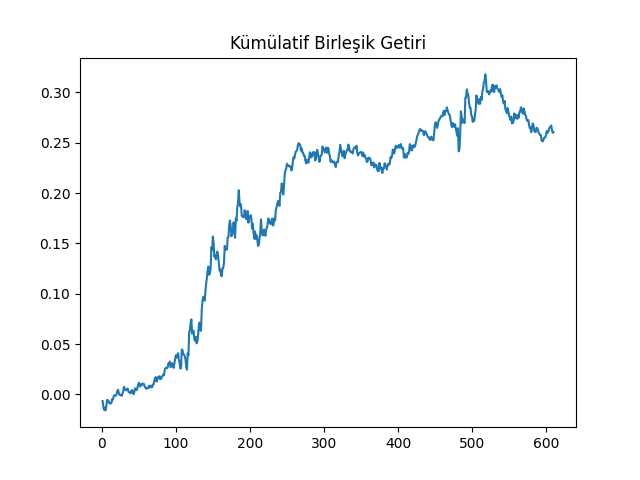

# Döviz Kuru Ticareti 

Eğer döviz kurları üzerinden al/sat yapmak istersem bunu koentegrasyon
üzerinden nasıl yaparım? Aynen iki hissenin fiyatının koentegre olabilmesi
gibi, iki ülkenin dövizi de koentegre olabilir. Bu koentegrasyon tabii ki
bu dövizlerin kurlarına yansıyacaktır, ve bu kurların üzerinden alım /
satım yaparsak o koentegrasyona oynamış oluruz. Daha önce gördüğümüz ETF
örneğini genişletmek gerekirse, Avustralya ve Kanada'nın ETF'leri koentegre
idi, herhalde onların döviz kurlarının da koentgre olduğunu beklemek
anormal olmaz. Bu hakikaten böyle. Ama ondan önce döviz ticareti hakkında
bazı pürüzler.

Döviz ticareti hisse ticaretinden biraz farklı. Mesela AUD.ZAR (Avustralya
doları ve Güney Afrika randı) ticareti yapıyorsak, bunlardan birincisi baz
dövizi (base currency) diğeri kayıt dövizi (quote currency) olarak
biliniyor. Hatırlamanın iyi bir yolu baz'ın b'si kayıtın k'sinden önce
gelir. Eğer AUD.ZAR 9.58'den kayıtlıysa bir AUD almak için 9.58 ZAR
gerekir. Eğer 100,000 AUD.ZAR alıyorsak önceki kayıt fiyatından 100,000 x
9.58 = 958,000 ZAR satmak gerekir.

Fakat çoğu zaman aracı kurumlar AUD.ZAR kurunu sağlamazlar. Bu yüzden X
Avustralya doları AUD.ZAR alabilmek için X birim B.ZAR alıp X birim B.AUD
satmak gerekir, ki burada B başka bir baz döviz olacaktır. B çoğunlukla
likiditesi yüksek olan rahatça alınıp satılabilecek bir dövizden seçilir,
mesela USD (dolar) ya da EUR (avro) gibi. 

Altta gereken veri dosyaları almak için [3]'e bakınız. 

```python
import pandas as pd, os, sys
from scipy import io as spio

cols = ['tday','cl','lo','hi','hhmm','op']
base = "/opt/Downloads"
a = spio.loadmat(base + '/inputData_USDCAD_20120426.mat')
usdcad = pd.concat([pd.DataFrame(a[x]) for x in cols], axis=1)
usdcad.columns = cols
a = spio.loadmat(base + '/inputData_AUDUSD_20120426.mat')
audusd = pd.concat([pd.DataFrame(a[x]) for x in cols], axis=1)
audusd.columns = cols

usdcad2 = usdcad[(usdcad.tday>20090101) & (usdcad.hhmm == 1659)]
audusd2 = audusd[(audusd.tday>20090101) & (audusd.hhmm == 1659)]
usdcad2 = usdcad2.set_index(['tday','hhmm'])
audusd2 = audusd2.set_index(['tday','hhmm'])
cad = 1 / usdcad2.cl
aud=audusd2.cl
y = pd.concat([aud, cad],axis=1)
```

```python
sys.path.append('../tser_030_coint')
sys.path.append('../tser_010_back')
from johansen import coint_johansen
import dd
trainlen=250
lookback=20
numUnits = np.ones(len(y))*np.nan
hedgeRatio = np.ones(y.shape)*np.nan
for t in range(trainlen,len(y)):
   df = y[t-trainlen:t]
   hedgeRatio[t] = coint_johansen(df, 0, 1).evec[:,0]
   tmp1 = np.array(y[t-lookback:t])
   tmp2 = np.kron(np.ones((lookback,1)),hedgeRatio[t])
   yport = np.sum(tmp1*tmp2,axis=1)
   ma=np.mean(yport)
   mstd=np.std(yport)
   zScore=(yport[-1]-ma)/mstd;
   numUnits[t] = -(yport[-1]-ma)/mstd
   #break

# copy positions in multiple coumns. positions are market values 
# of AUDUSD and CADUSD in portfolio expressed in US.
tmp1=np.kron(np.ones((y.shape[1],1)),numUnits)
positions = tmp1.T * hedgeRatio * y
pnl = positions.shift(1) * (y - y.shift(1))  / y.shift(1)
pnl = pnl.sum(axis=1)
ret=pnl / np.sum(np.abs(positions.shift(1)),axis=1)
ret = ret[trainlen:-1] # trainlen kadar ilk bolumu disarida birak
ret = ret.reset_index(drop=True)
cumret=np.cumprod(1+ret)-1
print ('APR', ((np.prod(1.+ret))**(252./len(ret)))-1)
print ('Sharpe', np.sqrt(252.)*np.mean(ret)/np.std(ret))
print ('Dusus Kaliciligi', dd.calculateMaxDD(cumret))
```

```
APR 0.100221828618
Sharpe 1.44796592471
Dusus Kaliciligi (-0.050369126045008095, 158.0)
```

```python
plt.plot(np.cumprod(1+ret)-1)
plt.title('Kümülatif Birleşik Getiri')
plt.savefig('tser_curr_01.png')
```




Kaynaklar 

[1] Chan, *Book Code*, [https://github.com/burakbayramli/books/tree/master/Algorithmic_Trading_Chan](https://github.com/burakbayramli/books/tree/master/Algorithmic_Trading_Chan)

[2] Chan, *Algorithmic Trading*

[3] Veri,
    [Dosya 1](https://www.dropbox.com/scl/fi/m25gcicwcywm7n8rufkh0/inputData_AUDCAD_20120426.mat?rlkey=d37ajwf0zy7oora7ndu9wsd0w&st=j710nmdk&raw=1),
    [Dosya 2](https://www.dropbox.com/scl/fi/wmyd44e5mkk4xotpmpmhh/inputData_AUDUSD_20120426.mat?rlkey=crehyhngbxy41ymob8tsa3xhu&st=d29vclgb&raw=1),
    [Dosya 3](https://www.dropbox.com/scl/fi/dxd48gy0ini8456ud17od/inputData_USDCAD_20120426.mat?rlkey=t8npmimclmtnsvy1o2rgepx9a&st=jedosb3x&raw=1),
    [Dosya 4](https://www.dropbox.com/scl/fi/0c6tsutbgpyq0tsi0j6mo/inputDataOHLCDaily_stocks_20120424.mat?rlkey=0hkkj2efe6l0xf9lzhs7veqdw&st=aa7ck5u4&raw=1)
