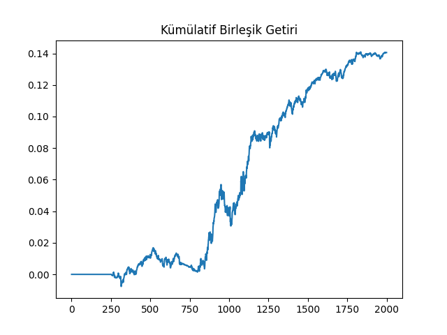
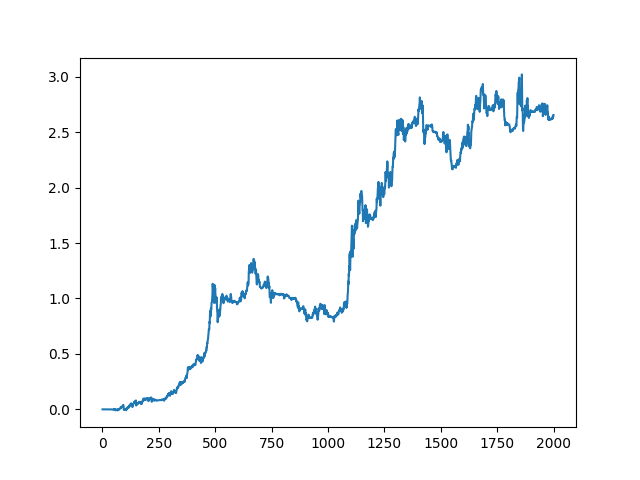
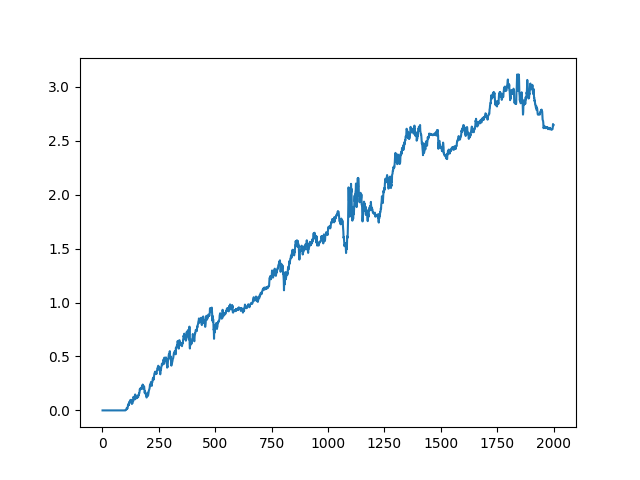
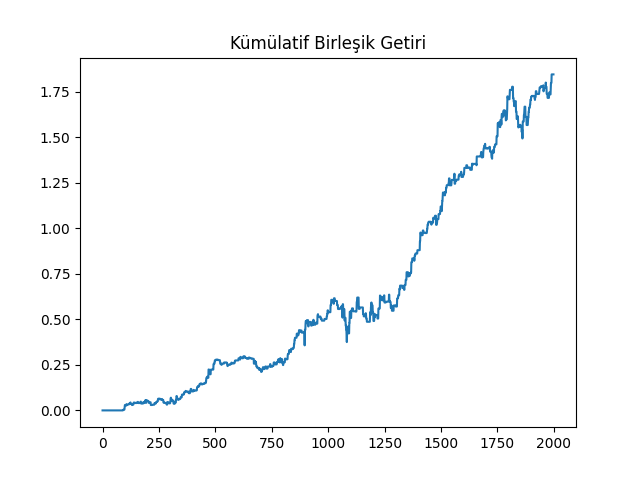
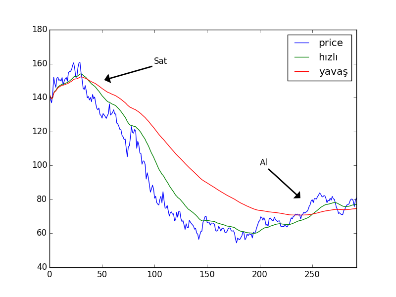

# Momentum Stratejileri

Momentum kelimesi akılda ivmeli bir hareketi çağrıştırıyor, yani olmakta
olan bir gidişatın olmaya devam etmesi gibi görebiliriz bu kavramı. Bu tür
bir kalıcılık, yukarı ya da aşağı doğru, borsacı için al/sat bağlamında
önemli bir sinyaldir ve kar amaçlı olarak kullanılabilir. 

Araştırmacılar bazen varlık fiyatlarındaki momentumu ikiye ayırıyorlar;
zaman serisi momentumu ve kesitsel (cross-sectional) momentum. Zaman serisi
momentumu basit: bir serinin gelecekteki getirisinin geçmişteki getirisi
ile arasında pozitif korelasyon vardır. Kesitsel durumda ise izafi bir olay
vardır: eğer bir serinin getirisi diğer serilerden daha iyi olmuş ise, bu
performans büyük bir ihtimalle bu şekilde devam edecektir, ya da tersi
durumda, kötü performans kötü olmaya devam edecektir. 

Zaman serisi korelasyonunu ölçmek için istatistiki korelasyon hesabını
kullanabiliriz, ki bu hesap ayrıca bir p-değeri de hesaplıyor (korelasyon
olmadığı sıfır hipotezinin sıfır değeri), çok düşük p-değeri korelasyon
varlığına dair bir işaret.

Korelasyon hesaplarken bir zaman adımı / gecikmesi (lag) seçmek
lazım. Mesela 1 günlük bazında hesaplanmış geçmiş ve gelecek getirileri
arasında negatif korelasyon bulunabilir, ama 20 günlük adımlar üzerinden
hesaplanmış getirilerin 40 günlük adımlar üzerinden hesaplanmış gelecek
getirileri arasında pozitif korelasyon bulunabilir. Bu tabii ki önemli
çünkü bu bize 20 günlük sinyal üzerinden 40 günlük elde tutma (ya da açığa
satma) işlemi yapmamız gerektiğini söylüyor.

Örnek olarak 2 yıllık Hazine Vadeli İşlem Sözleşmesinin (Treasury Future)
fiyatını işleyelim. Bu varlığın geçmişteki ve gelecekteki farklı
kombinasyondaki adımlar üzerindeki getirilerinin korelasyonunu test
edeceğiz; mesela geçmiş getiriyi (lookback) 5 günlük adımlardan hesaplayıp,
geleceği (hold days) 10 günlük adımlardan hesaplamak gibi. Ya da 10-10,
25-60, vs, ve tüm bu farklı kombinasyonların verilerinin ikili olarak
korelasyonunu alıp onların p-değerini hesaplayacağız.

```python
import sys; sys.path.append('../tser_draw_sharpe')
import pandas as pd
pd.set_option('future.no_silent_downcasting', True)
df = pd.read_csv('TU.csv')
```

```python
import sys; sys.path.append('../tser_030_coint')
import corr

res = []
for lookback in [1, 5, 10, 25, 60, 120, 250]:
   for holddays in [1, 5, 10, 25, 60, 120, 250]:
       df_Close_lookback = df.Close.shift(lookback)
       df_Close_holddays = df.Close.shift(-holddays)
       df['ret_lag'] = (df.Close-df_Close_lookback)/df_Close_lookback
       df['ret_fut'] = (df_Close_holddays-df.Close)/df.Close
       dfc = df[['ret_lag','ret_fut']].dropna()
       idx = None
       if lookback >= holddays: 
           idx = np.array(range(0,len(dfc.ret_lag), holddays))
       else: 
           idx = np.array(range(0,len(dfc.ret_lag), lookback))
       dfc = dfc.iloc[idx]
       t, x, p = corr.p_corr(dfc.ret_lag, dfc.ret_fut)
       res.append([lookback, holddays,  t, p])
res = pd.DataFrame(res,columns=['geriye bakis','tutma gunu','korelasyon','p degeri'])
print (res[res['geriye bakis'] >= 25])
```

```text
    geriye bakis  tutma gunu  korelasyon  p degeri
21            25           1   -0.013961  0.267652
22            25           5    0.031913  0.263821
23            25          10    0.121855  0.044023
24            25          25    0.195513  0.043132
25            25          60    0.233322  0.020566
26            25         120    0.148206  0.102227
27            25         250    0.261972  0.014834
28            60           1    0.031275  0.084316
29            60           5    0.079853  0.058405
30            60          10    0.171785  0.008452
31            60          25    0.259159  0.011425
32            60          60    0.216242  0.117277
33            60         120   -0.033076  0.429897
34            60         250    0.313743  0.048721
35           120           1    0.022228  0.167769
36           120           5    0.056515  0.137499
37           120          10    0.095540  0.096678
38           120          25    0.145591  0.106321
39           120          60   -0.019242  0.459084
40           120         120    0.208109  0.228351
41           120         250    0.407212  0.074212
42           250           1    0.041108  0.042837
43           250           5    0.106799  0.023092
44           250          10    0.178449  0.009239
45           250          25    0.271855  0.011920
46           250          60    0.424472  0.010865
47           250         120    0.511172  0.030871
48           250         250    0.487315  0.163445
```

Kod bir anlamda her zaman anı için o andaki tarihsel getiri ve eğer o
noktada pozisyon alınmış olsa eldeki varlığın tutulmasından elde edilecek
getiri hesabını yapıyor. Bu iki hesaptan iki zaman serisi türetiliyor,
sonra geriye bakış, tutma günü arasından ufak olanı oranında bu seri
örnekleniyor (sample). Niye bu örnekleme? Bu lazım, çünkü geriye bakış,
alış belli aralıklardan yapılır, çok ufak (ya da hiç) örnekleme yapsak
birbiriyle çakışan hesapları üst üste görmüş olurduk.

Seçimimizi yapmak için en iyi korelasyon katsayısı ve p-değeri arasında bir
denge gözetmek gerektiğini görüyoruz, bazen iyi olabilecek bir katsayı için
p-değeri iyi olmayabiliyor.  (60, 10), (60, 25), (250, 10), (250, 25),
(250, 60), (250, 120) eşleri bu bağlamda en iyi dengede olanlar herhalde,
ve al/sat yapmaya gelince bizim genel tercihimiz düşük elde tutma gününe ve
ayrıca en yüksek Sharpe oranına sahip olan varlıklar tabii ki. Para
kazanmak için 10 gün mü 100 gün mü beklemek daha iyi? Eğer getiriler kabaca
iki tarafta eşit ise 10 gün tercihimiz!

Şimdi getiriyi hesaplayalım. Bu hesap için 250,25 kombinasyonunu seçelim,
bu kombinasyonun katsayısı 0.273233 p-değeri 0.018. Fena değil. Stratejiyi
şöyle kodlayacağız, eğer geçmişteki 12 aylık (aşağı yukarı 250 gün) getiri
pozitif ise, hisseyi alıp bu pozisyonda 1 ay (25 gün) dur. Pozitif /
negatif bize al / sat yönünde sinyal çünkü korelasyon olduğunu biliyoruz ya
artık, demek ki eskiden çıkmışsa gelecekte çıkacak, düşmüşse gelecekte
düşecek. Bu bilinen bir strateji aslında ama biz onu biraz değiştirdik,
al/sat kararını her ay vermeye çalışmak yerine her gün vereceğiz, ve her
gün alım/satım için sermayemizin 1/25'ini kullanacağız.

```python
sys.path.append("../tser_010_back")
import dd

def report(df,lookback,holddays):

    longs = df.Close > df.Close.shift(lookback)
    shorts = df.Close < df.Close.shift(lookback)
    df['pos'] = 0.
    for h in range(holddays):
       long_lag = longs.shift(h).fillna(False)
       short_lag = shorts.shift(h).fillna(False)
       df.loc[long_lag,'pos'] += 1
       df.loc[short_lag,'pos'] -= 1

    ret=(df.pos.shift(1)* (df.Close-df.Close.shift(1)) / df.Close.shift(1)) \
         / holddays # sermayenin holddays'lik parcasini kullan

    cumret=np.cumprod(1+ret)-1

    print ('APR', ((np.prod(1.+ret))**(252./len(ret)))-1)
    print ('Sharpe', np.sqrt(252.)*np.mean(ret)/np.std(ret))
    print ('Dusus Kaliciligi', dd.calculateMaxDD(np.array(cumret)))
    return (cumret)

cumret=report(df,lookback = 250,holddays = 25)
```

```text
APR 0.016708058422861827
Sharpe 1.0417234664877877
Dusus Kaliciligi (np.float64(-0.024847461773700896), np.float64(343.0))
```

Tabii al/sat kararlaştırınca bu al ve satların 25 gün elde tutulması ve
bunların birikmesi durumunu hesaplamak lazım, bunu da $h=0,1,..,25$ kadar
kaydırıp bu kaydırılmış 25 vektörü toplayarak elde elde ediyoruz, mesela
sadece 3 vektör için gösterelim,

```
+ + + ... - - + - ...
  + + + ... - - + - ...
    + + + ... - - + - ...
```

Üstteki ilk satır al/sat kararları, arka arkaya 3 al kararı var, bunlar
toplana toplana 3. günde 3 birim varlık birikmiş olacak, aynı şekilde
satlar eksiltilir, vs. Diğer hesaplar önceden gördüğümüz tanıdık getiri,
kumulatif getiri hesapları.

```python
plt.plot(cumret)
plt.title(u'Kümülatif Birleşik Getiri')
plt.savefig('tser_mom_01.png')
```



Aynı stratejiyi diğer bazı vadeli işlemler HG, BRE üzerinde kullanırsak,

```python
dfhg = pd.read_csv('HG.csv')
cumret = report(dfhg,lookback = 40,holddays = 40)
```

```text
APR 0.17739975545700726
Sharpe 1.0480032641572703
Dusus Kaliciligi (np.float64(-0.23984679762413508), np.float64(424.0))
```

```python
plt.plot(cumret)
plt.savefig('tser_mom_04.png')
```



```python
dfbre = pd.read_csv('BRE.csv')
cumret = report(dfbre,lookback = 100,holddays = 10)
```

```text
APR 0.1770860830414429
Sharpe 1.0870777880323188
Dusus Kaliciligi (np.float64(-0.14812255240727945), np.float64(191.0))
```

```python
plt.plot(cumret)
plt.savefig('tser_mom_05.png')
```



Boşluk Görünce Alım (Buy on Gap)

Değişik bir momentum stratejisi "boşluk görünce işlem yapmak''. Mesela bir
varlığın kapanış (close) getirilerini bir pencere üzerinden yürüyen
ortalamayla (moving average) hesaplıyoruz, böylece bir baz şablon
oluşturuyoruz, eğer bir günün açılış (open) fiyatı bu şablon getiri, çarpı
önceki günün en yüksek (high) fiyatından belli oranda yüksek ise alım
yapıyoruz, önceki günün en düşük (low) fiyatından belli oranda düşük ise
satım yapıyoruz. Yani yükselme trendi var, bir momentum oluşmuş, bu devam
ediyor, bu alım sinyalidir, ya da tersi olmuştur bu satış sinyalidir.

Altta FSTX sembolüne sahip Dow Jones STOXX 50 vadeli işlem sözleşmesinin
(futures) üzerinde bu tekniği görebiliriz,

```python
import pandas as pd, dd
df = pd.read_csv('FSTX.csv')
entryZscore=0.1

stdret = df.cl.pct_change().rolling(window=90).mean().shift(1)
longs = df.op >= df.hi.shift(1)*(1+entryZscore*stdret)
shorts = df.op <= df.lo.shift(1)*(1-entryZscore*stdret)
df['pos'] = 0
df.loc[longs,'pos'] = 1
df.loc[shorts,'pos'] = -1
ret=df.pos * (df.op-df.cl) / df.op
ret = ret.dropna()
cumret=np.cumprod(1+ret)-1
print ('APR', ((np.prod(1.+ret))**(252./len(ret)))-1)
print ('Sharpe', np.sqrt(252.)*np.mean(ret)/np.std(ret))
print ('Dusus Kaliciligi', dd.calculateMaxDD(np.array(cumret)))
```

```text
APR 0.14077173738690152
Sharpe 1.3598926074743822
Dusus Kaliciligi (np.float64(-0.14880173773680128), np.float64(190.0))
```

```python
plt.plot(cumret)
plt.title(u'Kümülatif Birleşik Getiri')
plt.savefig('tser_mom_02.png')
```



Şirket Kar Açıklamaları

Kar açıklamalarının şirket fiyatlarına momentum vermesi şaşırtıcı
değil. Fakat bu açıklamanın ardından nispeten uzun bir süre bu
etkinin sürmesi ilginç. Daha ilginç olan bu etki uzun süredir biliniyor ve
kullanıla kullanıla etkisi yokolabilirdi, fakat bu hala gerçekleşmedi! 

Kâr açıklamalarını kullanan strateji çok basit: açıklamanın "iyi'' ya da
"kötü'' olduğunu bile bilmemize gerek yok, o sinyali almak için yine
piyasanın kendisini kullanacağız. Eğer önceki gün kapanış sonrası bir
açıklama yapılmışsa, ve yine önceki günün kapanışı ve bugünin açılışı
üzerinden hesaplanan getiri "yeterince'' pozitif ise (ki bunu hareketli
standart sapmaya izafi olarak hesaplayacağız), senedi al, yoksa açığa sat,
ve günün kapanışında tüm pozisyonlardan çık. Burada yapmaya uğraştığımız
momentumu, bir senet etrafında olan "heyecanı'' açılışın önceki günün
kapanışına göre farkından anlamaya çalışmak.

Altta bu stratejinin S\&P 500 senetleri üzerinde ve Ocak 3, 2011, to Nisan
24, 2012 arasında geriye dönük testini görüyoruz. Şirket kar açıklamaları,
açılış, kapanış fiyatları farklı matrisler içinde. Her matrisin
kolonlarında şirketler var, satırları ise zaman. Geriye bakış zamanı 90
gün. Kar açıklama verisi [earnings.com](earnings.com) sitesinden alınmış.

```python
import pandas as pd, zipfile, dd
with zipfile.ZipFile('earnann.zip', 'r') as z:
    earnann =  pd.read_csv(z.open('earnann.csv'),sep=',')
    op =  pd.read_csv(z.open('earnann-op.csv'),sep=',')
    cl =  pd.read_csv(z.open('earnann-cl.csv'),sep=',')
```

```python
lookback=90
retC2O=(op-cl.shift(1)) / cl.shift(1)
stdC2O=retC2O.rolling(window=lookback).std()
pos = pd.DataFrame(np.zeros(cl.shape),index=cl.index,columns=cl.columns)
longs=(retC2O >= 0.5*stdC2O).astype(int) * earnann
shorts=(retC2O <= -0.5*stdC2O).astype(int) * earnann;
pos = pos + longs - shorts
ret=(pos*(cl-op)/op).sum(axis=1)/30.

cumret=np.cumprod(1+ret)-1
print ('APR', ((np.prod(1.+ret))**(252./len(ret)))-1)
print ('Sharpe', np.sqrt(252.)*np.mean(ret)/np.std(ret))
print ('Dusus Kaliciligi', dd.calculateMaxDD(np.array(cumret)))
```

```text
APR 0.06812644552025016
Sharpe 1.4947426065381948
Dusus Kaliciligi (np.float64(-0.026051533343801503), np.float64(109.0))
```

Üstteki hesapta 30'a böldük çünkü bir günde aşağı yukarı bu kadar kar
açıklaması yapılıyor, 

```python
print (earnann.sum(axis=1).max())
```

```text
41
```

```python
plt.plot(cumret)
plt.title(u'Kümülatif Birleşik Getiri')
plt.savefig('tser_mom_03.png')
```


Üstel Yürüyen Ortalama (EWMA) ile Momentum 

Pandas'in EWMA hesabı için bir çağrısı var, olağan durumunda üstelli
katsayıları kullanır, fakat istenirse özyineli formda da hesap yapabilir. 
Pandas ile pencere gibi bir parametre var, buna kapsam (span)
deniyor. Kapsam $k$ ile $\alpha$ arasındaki ilişki şöyle,

$$\alpha = 2/(k+1) $$

Örnek

Alım satım kararları için EWMA kullanılabilir. Bir fiyat serisinini iki 
tane ayrı EWMA'sı alınır. Bu ortalamalardan bir tanesi daha yavaş olarak
addedilir, çünkü daha geniş bir kapsamda geriye bakar. Diğeri daha hızlı 
addedilir, daha kısa vadeli geriye bakar. Eğer daha hızlı olan ortalama
daha yavaş olanın üzerindeyse fiyat serisi yukarı doğru bir trende
girmiştir, alım yapılmalıdır, tersi var ise, satım trendine girilmiştir,
satım yapılmalıdır. 

Altta ham petrol vadeli işlem sözleşmesi (future) üzerinde örneği
görüyoruz. İki kapsam var, 32 ve 128. EWMA'lar birbirinin üzerine çıktığı
noktalar alım, satım anları olarak kullanılabilir.

```python
import pandas as pd
df = pd.read_csv("oil_crude_future.csv")
df['hızlı'] = df.price.ewm(span=32).mean()
df['yavaş'] = df.price.ewm(span=128).mean()
```

```python
df[['price','hızlı','yavaş']].plot()
plt.annotate('Sat',xy=(50,150),xytext=(100,160),\
             arrowprops=dict(facecolor='black',width=1,shrink=0.05))
plt.annotate('Al',xy=(240,80),xytext=(200,100),\
             arrowprops=dict(facecolor='black',width=1,shrink=0.05))
plt.savefig('tser_misc_01.png')
```



Tabii alım ve satım olma / olmama türünden ikisel kararlar değil. [2] alımda
olma ve satıma olmayı sürekli bağlamda düşünüyor, yani üstteki örnekte hangi
"pozisyonda'' olunduğu hesabı için hızlı EWMAC'ten yavaş olan çıkartılıyor, ve
bu fark kadar, ki bir reel sayı, posiyona giriliyor. Eğer sonuç -4.5 ise 4.5
ünite kadar açığa satışta olmak lazım. 

Negatif Yamukluk (Negative Skew)

Momentum stratejilerinin, özelde EWMA stratejilerinin pozitif yamukluğu olduğu
hep söylenir. Böyle olup olmadığını kontrol edelim.

```python
import sys; sys.path.append('../tser_070_voltar')
import util, pandas as pd, zipfile
f = 'CORN_price.csv'
with zipfile.ZipFile('../tser_070_voltar/legacycsv.zip', 'r') as z:
    df =  pd.read_csv(z.open(f),sep=',',index_col=0,parse_dates=True)
pred = util.ewma(df.PRICE,2,8)
print (util.skew(df.PRICE, pred))
```

```text
1.1860020046683812
```

Daha "yavaş'' EWMA stratejilerinde negatif yamukluk görülebilir, hızlı olanda
görülmüyor çünkü bu strateji daha hızlı adapte oluyor, [2]'nin tarif ettiği gibi
uzun zaman azar azar kaybedip düşüş veya çıkış başlayınca birdenbire kazanç
sağlıyor. 

Kaynaklar

[1] Chan, *Algorithmic Trading*

[2] Carver, *Systematics Trading*


