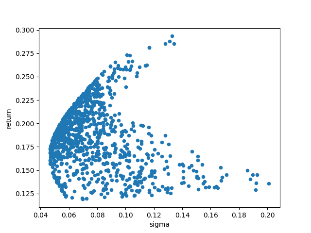
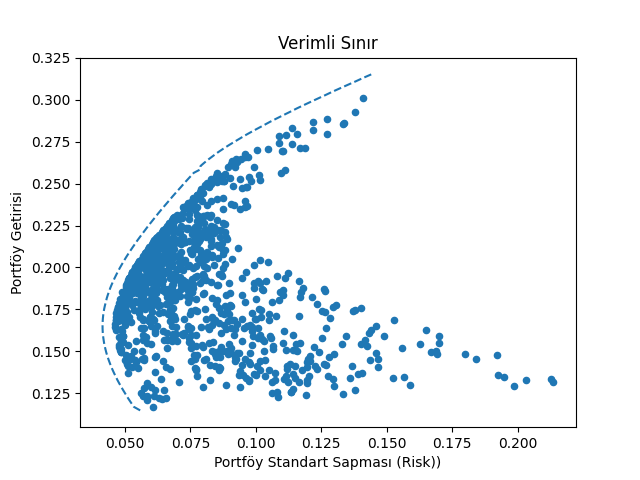
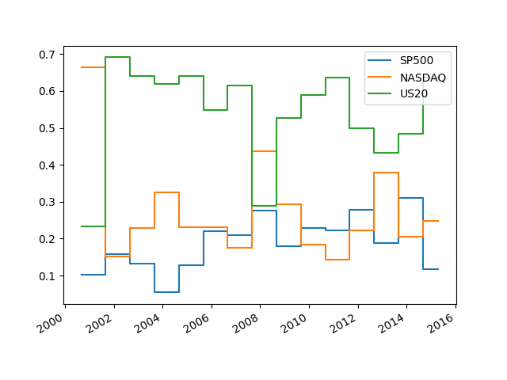

# Portföy İdaresi

Çeşitlendirmenin (diversification), yani portföye farklı enstrümanlar koymanın,
farklı sektörlerden olsun, farklı ülkelerden olsun, iyi bir şey olduğu hep
tavsiye edilir, kulağa küpe kuralı "yumurtaları aynı sepete koymamak'', teknik
anlamda bu söz portföydeki bir enstrümanın tamamen çöktüğü durumda (sepetin
düşüp yumurtaların kırılması) kayıpların sınırlanacağı çağrıştırmasını
yapar. Mesela [4, sf. 115]'e göre, ABD borsalarında hisselerin artık getirisinin
ortalama \%3 olduğu bilinir. Eğer yıllık \%20 standart sapmayı baz alırsak,
Sharpe oranı (SR) \%3 bölü \%20 = 0.15. Eğer aynı ülkede ama farklı sektörlerde
çeşitlendirirsek aşağı yukarı SR = 0.2 elde edebiliriz. Eğer farklı ülkelere
çeşitlersek SR 0.25'e çıkabiliriz. Eğer yatırım sınıfını da çeşitlersek, yani
tahviller, senetler, baz ürünlere yatırım yapmak üzere, o zaman SR 0.4 elde
edebiliriz.

İçinde birbiri ile ilintisi olmayan (uncorrelated) varlıklar olan bir
portföyün -ki çeşitlenmiş olmanın teknik tercümesi bu aslında- toplam
standart sapması daha düşüktür. Sharpe oranını hesaplarken standart sapmaya
böldüğümüz için daha ufak değer daha büyük SR anlamına gelir. Matematiksel
olarak sadece bir portföy düşünelim içinde iki varlık olsun, gelecekteki
getirilerini $R_1,R_2$'yi bildiğimizi farzedelim (tarihi veriden
kestiriyoruz mesela), bu varlıklar $w_1,w_2$ ağırlıkları üzerinden
birleştiriliyor olsun, toplam portföy getirisi,

$$ R_p = w_1 R_1 + w_2 R_2 $$

$R_1,R_2$ rasgele değişkenler. Tüm portföyün beklentisi, 

$$ E(R_p) = E(w_1 R_1 + w_2 R_2) $$

$$ = w_1 E(R_1) + w_2 E(R_2) $$

Portföyün varyansı için [5, sf. 73], 

$$Var(w_1 R_1 + w_2 R_2) = w_1^2Var(R_1) + w_2^2 Var(R_2) + w_1w_2Cov(R_1,R_2)
 \qquad (1)$$

Diyelim ki $w_1,w_2$ eşit; O zaman formülden açık bir şekilde görülüyor ki
üstteki varyansın azalacağı durumlardan biri iki enstrümanın hiç ilintili
olmadığı durumdur, çünkü bu durumda iki getirinin kovaryansı sıfır olur;
$Cov(R_1,R_2)=0$, üstteki formüldeki 3. terim tamamen yokolur, böylece
portföy varyansı azalır. Varyans azalınca Sharpe oranı artar. 

N Tane Enstrüman

Çok boyutlu hesap için portföy ağırlıkları $w = [w_1,..,w_n]^T$, getiriler 
$R = [R_1,..,R_n]^T$ vektörleri içinde olsun, 

$$ R_p = w^T R $$

Beklenti 

$$ E(R_p) = E(w^T R) = w^TE(R) $$

Varyans

$$ Var(R_p) = E\big( (R_p-E(R_p))(R-E(R_p))^T  \big) $$

$$ = E\big( (R_p-w^TE(R))(R_p-w^TE(R))^T  \big) $$

$$ = E\big( (w^TR-w^TE(R))(w^TR-w^TE(R))^T  \big) $$

$$ = w^T E\big( (R-E(R))(R-E(R))^Tw  \big) $$

$$ = w^T cov (R) w $$

Yine iki enstrüman üzerinden matris formunu kontrol edelim, varyanslar için
$\sigma_1^2,\sigma_2^2$ kullanırsak,

$$ Var(R_p) = 
\left[\begin{array}{cc} w_1 & w_2  \end{array}\right]
\left[\begin{array}{rr}
\sigma_1^2 & \sigma_{12} \\
\sigma_{2,1}^2 & \sigma_2^2 
\end{array}\right]
\left[\begin{array}{r}
w_1 \\ w_2
\end{array}\right] 
\qquad (2)
$$

$$ = \left[\begin{array}{cc} 
w_1 \sigma_1^2 + w_2 \sigma_{2,1} & 
w_1 \sigma_{1,2} + w_2\sigma_2^2  \end{array}\right]
\left[\begin{array}{r}
w_1 \\ w_2
\end{array}\right] 
$$

$$ = w_1^2\sigma_1^2 + w_1w_2\sigma_{2,1} + w_1w_2\sigma_{1,2} + w_2^2\sigma_2^2$$

$$ = w_1^2\sigma_1^2 + 2 w_1w_2\sigma_{1,2} + w_2^2\sigma_2^2$$

(1) ile benzer sonuca vardık. Her iki durumda da enstrumanlar arasında
korelasyon olmaması bir terim eksiltir, ve portföy varyansı azalır. Bunun matris
tercümesi $cov (R)$'nin köşegeni dışındaki öğelerinin sıfır olması anlamına
gelir, çünkü bir kovaryans matrisinde her enstrüman arasındaki kovaryanslar
köşegen haricinde olan öğelerde tutulur.

Portföy Ağırlıklarını Hesaplamak

Portföy varyansını, riskini azaltmak enstrümanlar arası korelasyonu azaltmak ile
mümkün, bunu bir yana koyalım. Bir ek yöntem enstrümanlara ayrılmış sermayeyi,
yani bölüştürme ağırlıklarını optimal bir seviyeye getirmektir. Matematiksel
olarak

$$ \textrm{minimize et } w^T \Sigma w $$

$$ R_p^T w = \mu, \quad w^T 1 = 1 \textrm{ şartlarına uyarak }$$


ki $\mu$ hedeflenen getiri.

Verimli Sınır (Efficient Frontier)

Markovitz'in buluşlarından biri (getirisinin standart sapması) farklı ağırlıklar
üzerinden hesaplanan portföyün riskini ve getirisini grafiklediğinde mümkün tüm
getirilerin bir sınır oluşturduğunu görmesiydi, buna verimli sınır ismi
verildi. Görsel olarak düşünürsek herhangi verili bir risk için dikey yukarı
çıkıp bu sınıra geliyoruz, ve bu sınırdaki risk (ve onu ortaya çıkartan
ağırlıklar) elde edebileceğimiz en iyi sonuç. Altta üç şirket üzerinde bu hesabı
görebiliriz.

```python
import pandas as pd
df = pd.read_csv("companies.csv",index_col=0,parse_dates=True)
print df.head()
```

```
                 MSFT       AAPL         KO
Date                                       
2010-01-04  26.045432  28.141855  23.509276
2010-01-05  26.053846  28.190509  23.224888
2010-01-06  25.893956  27.742101  23.216647
2010-01-07  25.624666  27.690818  23.158944
2010-01-08  25.801387  27.874915  22.730305
```

Şirketler Microsoft, Apple, ve Coca-Cola.

```python
import scipy as sp
import scipy.optimize as scopt
import scipy.stats as spstats

def calc_annual_returns(daily_returns):
    grouped = np.exp(daily_returns.groupby(lambda date: date.year).sum())-1
    return grouped

def calc_portfolio_var(returns, weights):
    sigma = np.cov(returns.T,ddof=0)
    var = (weights * sigma * weights.T).sum()
    return var

def sharpe_ratio(returns, weights, risk_free_rate = 0.015):
    n = returns.columns.size
    var = calc_portfolio_var(returns, weights)
    means = returns.mean()
    return (means.dot(weights) - risk_free_rate)/np.sqrt(var)

def negative_sharpe_ratio_n_minus_1_stock(weights,returns,risk_free_rate):
    weights2 = sp.append(weights, 1-np.sum(weights))
    return -sharpe_ratio(returns, weights2, risk_free_rate)

def optimize_portfolio(returns, risk_free_rate):
    w0 = np.ones(returns.columns.size-1,dtype=float) * 1.0 / returns.columns.size
    w1 = scopt.fmin(negative_sharpe_ratio_n_minus_1_stock,
                    w0, args=(returns, risk_free_rate))
    final_w = sp.append(w1, 1 - np.sum(w1))
    final_sharpe = sharpe_ratio(returns, final_w, risk_free_rate)
    return (final_w, final_sharpe)

def objfun(W, R, target_ret):
    stock_mean = np.mean(R,axis=0)
    port_mean = np.dot(W,stock_mean)
    cov=np.cov(R.T)
    port_var = np.dot(np.dot(W,cov),W.T)
    penalty = 2000*abs(port_mean-target_ret)
    return np.sqrt(port_var) + penalty

def calc_daily_returns(df):
    return np.log(df/df.shift(1))

def calc_efficient_frontier(returns):
    result_means = []
    result_stds = []
    result_weights = []
    means = returns.mean()
    min_mean, max_mean = means.min(), means.max()
    nstocks = returns.columns.size

    for r in np.linspace(min_mean, max_mean, 100):
    	weights = np.ones(nstocks)/nstocks
	bounds = [(0,1) for i in np.arange(nstocks)]
	constraints = ({'type': 'eq','fun': lambda W: np.sum(W) - 1})
	results = scopt.minimize(objfun, weights, (returns, r),
                                 method='SLSQP',constraints = constraints,
                                 bounds = bounds)
	if not results.success: raise Exception(result.message)
	result_means.append(np.round(r,4)) # 4 decimal places
	std_=np.round(np.std(np.sum(returns*results.x,axis=1)),6)
	result_stds.append(std_)
	result_weights.append(np.round(results.x, 5))
	
    return {'Means': result_means, 'Stds': result_stds, 'Weights': result_weights}

def calc_port_perf(w, ret, covs):
    port_ret = np.sum( ret*w )
    port_std = np.sqrt(np.dot(w.T, np.dot(covs, w)))
    return port_ret, port_std

def plot_all_possible_portfolios(ann_rets):
    res = []
    for i in range(1000):
        w = np.random.random(len(df.columns))
        w /= np.sum(w)
        r,s = calc_port_perf(w, ann_rets.mean(),ann_rets.cov())
        res.append([r,s])
    vw = pd.DataFrame(res,columns=['return','sigma'])
    return vw
    
    
def plot_efficient_frontier(ef_data):
    plt.title(u'Verimli Sınır')
    plt.xlabel(u'Portföy Standart Sapması (Risk))')
    plt.ylabel(u'Portföy Getirisi')
    plt.plot(ef_data['Stds'], ef_data['Means'], '--');
```

Günlük getiriler,

```python
daily_returns = calc_daily_returns(df)
print daily_returns.head()
```

```
                MSFT      AAPL        KO
Date                                    
2010-01-04       NaN       NaN       NaN
2010-01-05  0.000323  0.001727 -0.012171
2010-01-06 -0.006156 -0.016034 -0.000355
2010-01-07 -0.010454 -0.001850 -0.002489
2010-01-08  0.006873  0.006626 -0.018682
```

Yıllık getiri,

```python
annual_returns = calc_annual_returns(daily_returns)
print annual_returns.head()
```

```
          MSFT      AAPL        KO
2010 -0.079441  0.507219  0.189366
2011 -0.045157  0.255580  0.094586
2012  0.057989  0.325669  0.065276
2013  0.442980  0.080695  0.172330
2014  0.275646  0.406225  0.052661
```

Eşit ağırlıklar üzerinden oluşturulmuş portföyün varyansı,

```python
eq_weights = np.array([1/3.,1/3.,1/3.])
print calc_portfolio_var(annual_returns,weights=eq_weights)
```

```
0.00287954016535
```

Sharpe Oranı

```python
print sharpe_ratio(annual_returns,eq_weights)
```

```
3.20109292169
```

Farklı (rasgele) portföy ağırlıklarının oluşturacağı risk / getiri grafiği, 

```python
vw = plot_all_possible_portfolios(annual_returns)
vw.plot(x='sigma',y='return',kind='scatter')
plt.savefig('tser_port_04.png')
```



Şimdi optimizasyon ile global bir optimal nokta bulalım,

```python
print optimize_portfolio(annual_returns, 0.0003)
```

```
Optimization terminated successfully.
         Current function value: -7.829867
         Iterations: 38
         Function evaluations: 74
(array([ 0.02615542,  0.76347385,  0.21037072]), 7.8298669383774486)
```

Verimli sınır,

```python
frontier_data = calc_efficient_frontier(annual_returns)
```

```python
print frontier_data['Stds'][:5]
print frontier_data['Means'][:5]
for x in frontier_data['Weights'][:5]: print x
```

```
[0.055842999999999997, 0.053446, 0.052564, 0.051706000000000002, 0.050871]
[0.1148, 0.1169, 0.11890000000000001, 0.12089999999999999, 0.1229]
[ 0.  0.  1.]
[ 0.06407  0.00512  0.93081]
[ 0.06733  0.01497  0.9177 ]
[ 0.07228  0.02469  0.90303]
[ 0.07493  0.03458  0.89049]
```


```python
vw = plot_all_possible_portfolios(annual_returns)
vw.plot(x='sigma',y='return',kind='scatter')
plt.hold(True)
plot_efficient_frontier(frontier_data)
plt.savefig('tser_port_03.png')
```



Bootstrap

Dikkat: üstteki optimizasyonu olduğu gibi kullanmak sayısal olarak pek ise
yaramayabilir.  Mesela, üç yatırım var, S\&P 500, NASDAQ ve 20 yıllık ABD
tahvili. Bu varlıkları basit bir şekilde kullanacağız, onları sadece alıp elde
tutacağız. Eğer tek periyot (eldeki tüm veriyi) Markowitz optimizasyonu
üzerinden ağırlıkları hesaplarsak, ağırlıklar çok ekstrem, stabil olmuyor. Çözüm
için bootstrap tekniği kullanılır; veriden ardı ardına örneklem alırız, yani
veriden yeni veri yaratırız, beklediğimiz o ki örneklemlerin dağılımı "gerçek''
verinin dağılımı ile benzer olacak. Bu işlemin yan etkisi veriyi fazlalaştırmak,
ardından yapılan hesabın ortalamasını alınca stabiliteye daha yaklaşmış olmak.

Zaman serisinden örneklem almanın değişik yolları var, bir tanesi blok örneklem
yöntemi, kesintisiz zaman seri parçaları almak. Bir diğeri noktalar ardı ardına
olsun olmasın verinin rasgele noktalarından örneklem toplamak. Alttaki ikinci
yöntemi takip ediyor,

```python
import zipfile, pandas as pd, util
import numpy as np, random, datetime
from scipy.optimize import minimize

def create_dull_pd_matrix(dullvalue=0.0, dullname="A",
                          startdate=pd.datetime(1970,1,1).date(),
                          enddate=datetime.datetime.now().date(), index=None):
    if index is None:
        index=pd.date_range(startdate, enddate)    
    dullvalue=np.array([dullvalue]*len(index))    
    ans=pd.DataFrame(dullvalue, index, columns=[dullname])    
    return ans

def addem(weights):
    return 1.0 - sum(weights)

def variance(weights, sigma):
    return (np.matrix(weights)*sigma*np.matrix(weights).transpose())[0,0]

def neg_SR(weights, sigma, mus):
    estreturn=(np.matrix(weights)*mus)[0,0]
    std_dev=(variance(weights,sigma)**.5)    
    return -estreturn/std_dev

def equalise_vols(returns, default_vol):    
    factors=(default_vol/16.0)/returns.std(axis=0)
    facmat=create_dull_pd_matrix(dullvalue=factors,
                                 dullname=returns.columns,
                                 index=returns.index)
    norm_returns=returns*facmat
    norm_returns.columns=returns.columns
    return norm_returns

def markosolver(returns, default_vol, default_SR):        
    use_returns=equalise_vols(returns, default_vol)    
    sigma=use_returns.cov().values
    mus = use_returns[asset_name].mean() for asset_name in use_returns.columns
    mus=np.array([mus], ndmin=2)
    mus=mus.transpose()
    number_assets=use_returns.shape[1]
    start_weights=[1.0/number_assets]*number_assets    
    bounds=[(0.0,1.0)]*number_assets
    cdict=[{'type':'eq', 'fun':addem}]    
    ans=minimize(neg_SR, start_weights,
                 (sigma, mus),
                 method='SLSQP',
                 bounds=bounds,
                 constraints=cdict,
                 tol=0.00001)
    return ans['x']

def generate_fitting_dates(data, rollyears):
    start_date=data.index[0]
    end_date=data.index[-1]
    yearstarts=list(pd.date_range(start_date, end_date, freq="12M"))+[end_date]   
    periods=[]
    for tidx in range(len(yearstarts))[1:-1]:
        period_start=yearstarts[tidx]
        period_end=yearstarts[tidx+1]
        fit_start=start_date            
        fit_end=period_start        
        periods.append([fit_start, fit_end, period_start, period_end])

    return periods

def bootstrap_portfolio(returns_to_bs,monte_carlo,
                        monte_length,default_vol,default_SR):
            
    weightlist=[]
    for unused_index in range(monte_carlo):
        bs_idx=[int(random.uniform(0,1)*len(returns_to_bs)) \
                for i in range(monte_length)]        
        returns=returns_to_bs.iloc[bs_idx,:] 
        weight=markosolver(returns, default_vol=default_vol, default_SR=default_SR)
        weightlist.append(weight)
     
    theweights_mean=list(np.mean(weightlist, axis=0))
    return theweights_mean

def optimise_over_periods(data,rollyears, monte_carlo,monte_length):

    fit_periods=generate_fitting_dates(data, rollyears=rollyears)    
    weight_list=[]
    for fit_tuple in fit_periods:
        period_subset_data=data[fit_tuple[0]:fit_tuple[1]]        
        weights=bootstrap_portfolio(period_subset_data,
                                    monte_carlo=monte_carlo,
                                    monte_length=monte_length,
                                    default_vol=0.2, default_SR=1.0 )
        
        dindex=[fit_tuple[2]+datetime.timedelta(seconds=1),
                fit_tuple[3]-datetime.timedelta(seconds=1)] 
        weight_row=pd.DataFrame([weights]*2,
                                index=dindex,
                                columns=data.columns) 
        weight_list.append(weight_row)
        
    weight_df=pd.concat(weight_list, axis=0)    
    return weight_df

```

```python
import zipfile, pandas as pd, random
symbols = ['SP500','NASDAQ','US20']
df = pd.DataFrame()
with zipfile.ZipFile('../tser_voltar/legacycsv.zip', 'r') as z:
    for symbol in symbols:
        f = '%s_price.csv' % symbol
        df[symbol] = pd.read_csv(z.open(f),sep=',',
                                 index_col=0,
                                 parse_dates=True)['PRICE']
    
df['SP500'] = df.SP500.pct_change()
df['NASDAQ'] = df.NASDAQ.pct_change()
df['US20'] = df.US20.pct_change()

df = df[(df.index >= '1999-08-02') & (df.index <= '2015-04-22')]
    
random.seed(0)

w=boot.optimise_over_periods(df)
```


```python
w.plot()
plt.savefig('tser_port_01.png')
```



Bu sonuç [1. sf. 172]'dakine yakın, ağırlıklar çok daha stabil.

Kodda oynaklığın standardize edildiğine dikkat; tüm zaman serilerinin oynaklığı
eşitleniyor, ve maksimize edilmeye uğraşılan getiri. 


