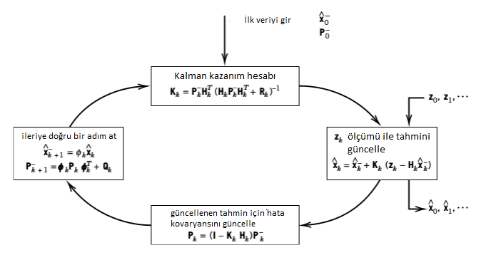
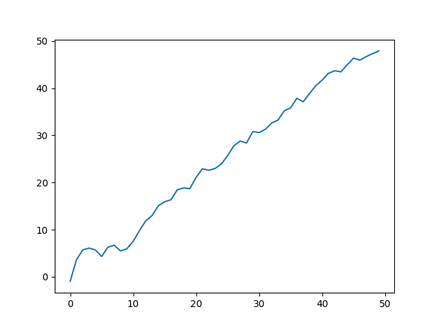

# Kalman ve Parçacık Filtreleri

### Kalman Filtreleri

Diyelim ki bir video kameradan gelen imajları kullanarak obje takip eden bir
yazılım istiyoruz. Matematiksel olarak obje nedir? İmajı nedir? obje kendi
dünyasında bir süreci takip etmektedir, 3 boyutlu uzayda bir yer kaplamaktadır
ve orada hareket etmektedir. Biz bu hareketi belli bir güven aralığı / hata payı
üzerinden biliyor olabiliriz. Diğer yandan objenin kameraya yansıttığı imaj
vardır, bu imaj 2 boyutlu ve kameranın özellikleriyle alakalı parametreler
sebebiyle belli bir şekilde "yansıtılmış (project)'' olacaktır. Biz bu yansıtma
formülünü de, belli bir hata payı üzerinden, biliyor olabiliriz.

Bu durumu şöyle modelleyebiliriz,

$$ x_k = \Phi_{k-1}x_{k-1} + w_{k-1} $$

$$ z_k = H_k x_k + v_k $$

$x_k = (n \times 1)$ vektörü, $k$ anındaki sürecin durumu (state)

$\Phi_k = (n \times n)$ matrisi, $x_{k-1}$ durumundan $x_{k}$ durumuna
geçişi tarif eden formül.

$w_k = (n \times 1)$ vektörü, sıfır ortalamalı, kovaryansı $Q_k$ olan beyaz
gürültü.

$z_k = (n \times 1)$ vektörü, dışarıdan alınan ölçüm.

$H_k = (m \times n)$ matrisi, gizli konum bilgisinin dışarıya nasıl ölçüm olarak
yansıdığının formülü. Bu dönüşüm ideal, yani gürültüsüz durumu tarif eder.

$v_k = (m \times 1)$ vektörü, ölçüm hatası.

Yani formüllerin söylediği şudur: ilk formül bize izlenen her ne ise onun
hareketini tarif ediyor, $k-1$ anından $k$ anına geçişini tarif ediyor. $z_k$
ise bu $x_k$'nin dışarıdan alınan ölçümü. Bizim yapmak istediğimiz $z_k$'leri
kullanarak $x_k$'nin nerede olduğunu kestirebilmek.

Sıfır merkezli gürültü şu demektir,

$$ E[v_k] = E[w_k] = 0 $$

Ayrıca,

$$ E[v_kv_k^T] = R_k $$

$$ E[w_kw_k^T] = Q_k $$

Kalman filtreleri (KF) ile yapmak istediğimizin dışarıdan görünen $z_k$'yi
kullanarak gizli $x_k$'yi kestirmek olduğunu söylemiştik. Ayrıca bu tahminleri
her gelen veri noktasına göre sürekli güncelliyor olacağız, yani 100 tane veri
noktasını almak için bekleyip sonra toptan bir analiz yapmaya gerek yok
(istenirse yöntem toptan işleyecek şekilde de kullanılabilir tabii). Tahmin
edilebileceği üzere bu tür bir gerçek zamanlı kabiliyetin pek çok mühendislik
uygulaması olabilir; hakikaten de mesella aya ilk insanlı ınışı yapan Apollo
modülü bir Kalman filtresi kullanıyordu.

KF'i türetmek için önce bir lineer tahmin edici (estimator) tanımlamak gerekir,
ve sonra bu tahmin ediciyi optimize eden şartların ne olduğu incelenir. Şu
notasyonu kullanalım: Tilde yani $\tilde{x}$ üzerindeki işaret, o değişkenin
tahmin ile gerçeği arasındaki hatayı temsil etmesi içindir, $\hat{x}$ üzerindeki
şapka ise istatistik dersinden hatırlayacağımız üzere tahmin edici
(estimator). Ayrıca bir değişkenin üzerindeki $^-$ ve $^+$ işaretlerini bu
değişkenin ölçüm dikkate alındıktan önceki ve sonraki (o sırayla) hali olarak
tanımlayalım.

Konum bilgisi ve hata arasındaki ilişkiyi şu şekilde belirtelim,

$$ \hat{x}_k^+ = x_k + \tilde{x_k}^+ $$

$$ \hat{x}_k^- = x_k + \tilde{x_k}^- $$

Elimizdeki en iyi tahmin $\hat{x}_k^-$'i yeni veri / ölçüm elde ettikten sonra
güncellemek istiyoruz. Bunu yaparken gürültülü ölçümle eldeki en son tahmini
lineer bir şekilde birleştirmek istiyoruz. Bu birleştirmeyi,

$$ \hat{x}_k^+ = \hat{x}_k^- + K_k (z_k - H_k \hat{x}_k^-)   $$

olarak temsil edebiliriz, $\hat{x}_k^+$ güncellenmiş tahmindir, $K_k$ ise
birleştirme faktörüdür (blending factor), ki bu değerin ne olduğunu şu anda
bilmiyoruz.

Tekrar düzenlersek, 

$$= \hat{x}_k^- - K_kH_k\hat{x}_k^- + K_kz_k    $$

$$ \hat{x}_k^+ = \hat{x}_k^- (I - K_kH_k) + K_kz_k $$

Daha temiz olması için $K_k' = I - K_kH_k$ diyelim, ve en baştaki
formülleri bir daha alta alta yazalım,

$$ 
\hat{x}_k^+  = K_k' \hat{x}_k^- + K_kz_k  
\tag{1}  
$$

$$ 
z_k = H_k x_k + v_k 
\tag{2} 
$$

$$ 
\hat{x}_k^+ = x_k + \tilde{x_k}^+ 
\tag{3} 
$$

$$ 
\hat{x}_k^- = x_k + \tilde{x_k}^- 
\tag{4}
$$

(1) içine (2)

$$ \hat{x}_k^+ = K_k' \hat{x}_k^- + K_k(H_k x_k + v_k)   $$

Eşitliğin solunu (3) ile açalım,

$$ x_k + \tilde{x_k}^+ = K_k' \hat{x}_k^- + K_k(H_k x_k + v_k)   $$

ve $x_k$'yi sağa geçirelim,

$$ \tilde{x_k}^+ = K_k' \hat{x}_k^- + K_k(H_k x_k + v_k) - x_k   $$

$\hat{x}_k^-$ yerine (4)

$$  = K_k' (x_k + \tilde{x_k}^-) + K_k(H_k x_k + v_k) - x_k   $$

$x_k$'leri yanyana getirip gruplayalım,

$$  = K_k' x_k + K_kH_k x_k  - x_k + K_k'\tilde{x_k}^- + K_kv_k   $$

$$ \tilde{x_k}^+ = x_k (K_k' + K_kH_k - I) + K_k'\tilde{x_k}^- + K_kv_k   $$

Üstteki tüm ifadenin beklentisini aldığımız zaman,

$$ E[\tilde{x_k}^+] = E[x_k (K_k' + K_kH_k - I)] + E[K_k'\tilde{x_k}^-] + E[K_kv_k]  $$

olacak değil mi? Burada biraz duralım, ve yansızlık kavramını düşünelim. Eğer
tahmin edici $\hat{x}^+$ yansız (unbiased) olsun istiyorsak, bu şu anlama gelir,

$$ E[\hat{x_k}^+] = E[x_k] $$

Düzenleyelim,

$$ E[\hat{x_k}^+] - E[x_k] = 0$$

$$ E[\hat{x_k}^+ - x_k] = 0$$

$$ E[ \tilde{x_k}^+] = 0$$

Şimdi, formülü son bıraktığımız yere dönelim, orada eğer $E[\tilde{x_k}^+]=0$
olsun istiyorsak ve $E[\tilde{x_k}^-] = 0$'in da doğru olduğu durumda geriye tek
kalan $K_k' + K_kH_k - I$ ifadesinin sıfır olmasıdır (çünkü $E[v_k]=0$ olacak
zaten), bu durumda herhangi bir $x_k$ için beklentinin sıfır gelmesi

$$ K_k' + K_kH_k - I = 0 $$

olmasına bağlıdır. Tabii o doğru ise,

$$ K_k' = I - K_kH_k  $$

Bu ifadeyi geriye, (1)'deki tahmin edicinin içine koyarsak

$$ \hat{x}_k^+  = (I - K_kH_k ) \hat{x}_k^- + K_kz_k  $$

Ya da 

$$ \hat{x}_k^+  = \hat{x}_k^- + K_k(z_k - H_k\hat{x}_k^- )  $$

Eğer $\hat{x}_k^-$ için (4) kullanırsak,

$$ \hat{x}_k^+  =  (x_k + \tilde{x_k}^-) + K_k(z_k - H_k( x_k + \tilde{x_k}^-) )  $$

Tekrar gruplama, 

$$ \hat{x}_k^+  =  \tilde{x_k}^- (I - K_kH_k) + x_k + K_k(z_k - H_kx_k)   $$

Ve (2)'yi $z_k - H_kx_k$ için kullanalım,

$$ \hat{x}_k^+ - x_k =  (I - K_kH_k)\tilde{x_k}^- + K_kv_k   $$

$$ \tilde{x}_k^+ = (I - K_kH_k)\tilde{x_k}^- + K_kv_k   $$

Böylece tekabül eden tahmin hatasını hesaplamış olduk. 

Tanım

$$ P_k^+ = E[ \tilde{x_k}^+\tilde{x_k}^{+T} ]$$

$$ P_k^- = E[ \tilde{x_k}^- \tilde{x_k}^{-T} ]$$

Bu kovaryans hesabının uygulanmasından ibaret aslında. Şimdi üç üstteki formülü
üstten ikincisine sokarsak,

$$ =  E \big[ (I - K_kH_k)\tilde{x_k}^- + K_kv_k \big] \big[\tilde{x_k}^{-T}(I - H_k^TK_k^T) + v_k^TK_k^T \big] $$

Yani

$$ 
= E \bigg[ (I - K_kH_k)\tilde{x_k}^- \big( \tilde{x_k}^{-T}(I - H_k^TK_k^T)
+ v_k^TK_k^T \big) + 
\tag{5}
$$

$$ K_kv_k \big( \tilde{x_k}^{-T}(I - H_k^TK_k^T) + v_k^TK_k^T  \big) \bigg] $$

Önceden tanımlamıştık,

$$ P_k^- = E[ \tilde{x_k}^- \tilde{x_k}^{-T} ]$$

$$ E[v_kv_k^T] = R_k $$

Ayrıca ölçüm hataları ve gürültü arasında korelasyon olmadığını farz ettiğimiz
için,

$$ E[\tilde{x_k}^-v_k^T] = E[v_k\tilde{x_k}^{-T}] = 0 $$

Tüm bunları (5)'i basitleştirmek için kullanırsak,

$$ 
P_k^{+} =  (I - K_kH_k)P_k^-(I - H_k^TK_k^T) + K_kR_kK_k^T 
\tag{6}
$$

En optimal $K_k$'yi nasıl buluruz? Amaç $P_k^+$ matrisinin çaprazındaki
değerleri minimize etmektir, bu durumda optimize etmek istediğimiz bedel (cost)
fonksiyonu

$$ J_k = E[ \tilde{x_k}^{+T}\tilde{x_k} ] $$

olsun, ki bu tek bir sayısal değer verir. Bu aslında 

$$ J_k = Tr(P_k^+) $$

değerinin optimize edilmesi ile aynı şeydir. Değil mi? Ya iki üstteki gibi
vektör uzunluğunu minimize ediyoruz, ya da kovaryansın çaprazının izini (trace)
minimize ediyoruz, çünkü her ikisinde de aynı değerler var. İz operatörü
hatırlayacağımız üzere bir matrisin çaprazındaki değerleri toplar. İz
kullanmamızın sebebi bize bazı türevsel numaralar sağlaması,

Biliyoruz ki, eger $B$ simetrik ise,

$$ \frac{\partial }{\partial A} Tr(ABA^T) = 2AB $$

$$ Tr(P_k^{+}) =  Tr((I - K_kH_k)P_k^-(I - H_k^TK_k^T)) + Tr(K_kR_kK_k^T) $$

İki tane iz var, bu izler içinde bir $ABA^T$ formu görebiliyoruz herhalde,
onların $K_k$'ye göre türevini alıyoruz,

$$ 
\frac{\partial Tr(P_k^{+})}{\partial K_k}  =
-2(I - K_kH_k)P_k^- H_k^T + 2K_kR_k
$$

Şimdi sıfıra eşitleyip $K_k$ için çözelim,

$$ 0 = -2(I - K_kH_k)P_k^- H_k^T + 2K_kR_k $$

$$  2P_k^- H_k^T = 2K_kH_kP_k^- H_k^T + 2K_kR_k $$

$$  P_k^- H_k^T = K_kH_kP_k^- H_k^T + K_kR_k  $$

$$  P_k^- H_k^T = K_k(H_kP_k^- H_k^T + R_k)  $$

$$  K_k = P_k^- H_k^T(H_kP_k^- H_k^T + R_k)^{-1} $$

$K_k$ matrisine Kalman kazanç matrisi (Kalman gain matrix) ismi de verilir. Ve
en son olarak bu sonucu (6) içine koyarsak, ve biraz manipülasyon ardından,

$$ P_k^+ = P_k^- -P_k^- H_k^T (H_kP_k^- H_k^T + R_k)^{-1}H_kP_k^-  $$

$$ = [I - K_kH_k]P_k^-  $$

sonucunu elde ederiz. 

Bu hesaplar ölçüm aldıktan *sonra* tahmini güncellemek içindi. Peki ölçüm
almadan önceki tahmini nasıl yaparız? Bunu yapmamız gerekir çünkü ölçüm gelmeden
önce yeni bir tahmin yapılmalı ki o tahmini, onun hatasını bir sonraki ölçüm ile
düzeltilebilelim. Bu geçişin nasıl olacağını en başta belirttiğimiz KF modeli
gösteriyor zaten, konum geçişi / adımı ona göre atıp, sonucun beklentisini ve
kovaryansını hesaplıyoruz,

$$ \hat{x}_k^- = E[\Phi_{k-1}x_{k-1}^+ + w] = \Phi_{k-1}x_{k-1}^+ $$

$$ P_k^- = Cov(\Phi_{k-1}x_{k-1}^+) = E[(\Phi_{k-1}x_{k-1}^+ + w)(\Phi_{k-1}x_{k-1}^+ + w)^T) $$

$$ =  \Phi_{k-1}P_{k-1}^+\Phi_{k-1}^T + Q_{k-1}  $$

$P_k^-$ hesabında ne olduğuna dikkat, bir sonraki ölçüm olmadan sadece geçiş
  formülü üzerinde tahmin etmeye uğraştık, ve bu tabii ki bilinmezliği arttırdı
  ($Q$ toplanıyor).

En son adım bu; $\hat{x}_k^-,P_k^-$ artık bir sonraki güncelleme için
kullanılacak değerlerdir. Bu noktada başa dönüyoruz, ve aynı işlemleri
tekrarlıyoruz. Eğer verinin alımı, model güncellemesi, ileri tahmin adımında
olanları bir figürle göstermek gerekirse (indisler resimde bir ileri alınmış,
bunu aklımızda düzelterek bakalım),



Aslında tüm bu süreci bir sözde kod (pseudocode) parçası ile göstermeyi
düşünmüştük, ki ölçüm verisi bir `for` döngüsü ile listeden alınarak teker
teker işlenecekti, fakat bu üstteki tarifi tam anlatamayacaktı, çünkü KF için
illa elde belli sayıda "işlenip bitirilen'' ölçüm olması gerekmez. Güncelleme
her yeni ölçüm için, o tek ölçüm bazında yapılabildiği için şimdi 1 tane, sonra
10 tane, sonra bekleyip 2 tane daha, vs. şeklinde veri işlenmesi gayet
mümkündür. Bu işlem gerçek zamanlı olabilir, ya da bir listeyi gezerek anlık
olmayan bir şekilde olabilir.  Bu yüzden üstteki döngü resmini tercih ettik.

Not: Bazı kaynaklarda Kalman Filtrelerinin uygun bir model üzerinden en az
kareler (least square) ile yani çizgi / düzlem uydurması ile aynı sonuca
varabileceği söylenir, bu tam doğru degil, KF üstel ağırlıklı
(exponentially weighted) en az kareler ile aynıdır, yani en son veri
noktalarının daha öncekilere göre daha çok ağırlığı vardır. KF ile
regresyon örneği için bkz [5] yazısı.

Bir not daha: $x_k = \Phi_{k-1}x_{k-1} + w_{k-1}$ geçişinde $\Phi_{k-1}$
ile çarpım bir lineer konum değişimini modeller, o zaman lineer olmayan
geçişlerin KF modellenmesi mümkün değildir. Mesela bir topun ileri, havaya
doğru atıldığı bir örneği düşünelim, ölçümlerde Gaussian gürültü
olsun. Topun gidişi bir parabolu takip edecektir, oldukca basit bir
gidiştir, fakat KF'in bu gidişi takip etmesi mümkün değildir. Parçacık
filtreleri, genişletilmiş KF (EKF), UKF gibi yaklaşımlar bu sebeple
alternatif haline gelmişlerdir.

Bir KF kodlaması alttadır. 

```python
from numpy import *

# x_{t+1} = Phi x_t + Sigma_x
# y_t = Hx_t + R    
class Kalman:
    # T is the translation matrix
    # K is the camera matrix calculated by calibration
    def __init__(self, K, mu_init):
        self.ndim = 3
        self.Sigma_x = eye(self.ndim+1)*150
        self.Phi = eye(4)
        self.Phi[2,3] = -0.5
        self.H = append(K, [[0], [0], [0]], axis=1)
        self.mu_hat = mu_init
        self.cov = eye(self.ndim+1)
        self.R = eye(self.ndim)*1.5
        
    def normalize_2d(self, x): 
        return array([x[0]/x[2], x[1]/x[2], 1.0])
    
    def update(self, obs):

        # Make prediction
        self.mu_hat_est = dot(self.Phi,self.mu_hat) 
        prod = dot(self.Phi, dot(self.cov, transpose(self.Phi)))
        self.cov_est = prod + self.Sigma_x
                
        # Update estimate
        prod = self.normalize_2d(dot(self.H,self.mu_hat_est))
        self.error_mu = obs - prod
        
        prod = dot(self.cov,transpose(self.H))
        prod = dot(self.H,prod)
        self.error_cov = prod + self.R
        prod = dot(self.cov_est,transpose(self.H))
        self.K = dot(prod,linalg.inv(self.error_cov))
        self.mu_hat = self.mu_hat_est + dot(self.K,self.error_mu)
        
        prod = dot(self.K,self.H)
        left = eye(self.ndim+1) 
        diff = left - prod
        self.cov = dot(diff, self.cov_est)
```

Örnek

Diyelim ki tek boyutta bir köpeğin gidişini modellemek istiyoruz [4,
pg. 191]. Köpek sabit bir hızda ilerliyor olsun (bu geçiş modeli), ve biz
onu sadece havlamaların nereden geldiği ile bulmaya uğraşacağız (bu da
gürültülü ölçüm). Geçiş

$$ x = v \Delta t + x_0$$

Hız $v$ yerine $\dot{x}$ kullanalım, o zaman 

$$\bar x = x + \dot x \Delta t$$

Hız sabit olacağı için onun geçişi şöyle,

$$\bar{\dot x} = \dot x$$

Alt alta yazalım,

$$\begin{cases}
\begin{aligned}
\bar x &= x + \dot x \Delta t \\
\bar{\dot x} &= \dot x
\end{aligned}
\end{cases}$$

Düzenlersek,

$$\begin{cases}
\begin{aligned}
\bar x &= 1x + &\Delta t\, \dot x \\
\bar{\dot x} &=0x + &1\, \dot x
\end{aligned}
\end{cases}$$

Matris formunda

$$\begin{aligned}
\begin{bmatrix}\bar x \\ \bar{\dot x}\end{bmatrix} &= \begin{bmatrix}1&\Delta t  \\ 0&1\end{bmatrix}  \begin{bmatrix}x \\ \dot x\end{bmatrix}\\
\end{aligned}$$

$$ \mathbf{\bar x} = \mathbf{Fx} $$

Yani konumu iki boyutlu olarak modellemiş olduk.

$$\mathbf x =\begin{bmatrix}x \\ \dot x\end{bmatrix}$$

Peki ölçüm tahminlerini üretecek $H$ nasıl olmalı? 

$$\mathbf H=\begin{bmatrix}1&0\end{bmatrix}$$

Bunu yaptık çünkü $Hx$ çarpımı yapılınca sadece $x$ çarpıma girecek, hız
sıfırlanacak, yani ölçümde kullanılmayacak. Bu tam istediğimiz şey
zaten. Ne kadar ilginç değil mi? Hız konumda yer alan bir şey, tahmin /
ölçüm / düzeltme döngüsü sırasında KF onu da değiştirecek, düzeltecek,
ölçümde kullanılmıyor olsa bile! 

Ölçümdeki belirsizliğe 10 metre diyelim, 

$R = \begin{bmatrix}10\end{bmatrix}$

Altta alternatif bir KF kodu ve örneğin kodlamasını görüyoruz,

```python
from scipy.stats import norm, multivariate_normal
import pandas as pd, math
import numpy as np, numpy.linalg as linalg
import matplotlib.pyplot as plt

def logpdf(x, mean, cov):
    flat_mean = np.asarray(mean).flatten()
    flat_x = np.asarray(x).flatten()
    return multivariate_normal.logpdf(flat_x, flat_mean, cov, True)

def dot3(A,B,C):
    return np.dot(A, np.dot(B,C))

def setter_scalar(value, dim_x):
    if np.isscalar(value):
        v = np.eye(dim_x) * value
    else:
        v = np.array(value, dtype=float)
        dim_x = v.shape[0]

    if v.shape != (dim_x, dim_x):
        raise Exception('must have shape ({},{})'.format(dim_x, dim_x))
    return v

def setter(value, dim_x, dim_y):
    v = np.array(value, dtype=float)
    if v.shape != (dim_x, dim_y):
        raise Exception('must have shape ({},{})'.format(dim_x, dim_y))
    return v

def setter_1d(value, dim_x):
    v = np.array(value, dtype=float)
    shape = v.shape
    if shape[0] != (dim_x) or v.ndim > 2 or (v.ndim==2 and shape[1] != 1):
        raise Exception('has shape {}, must have shape ({},{})'.format(shape, dim_x, 1))
    return v


def Q_discrete_white_noise(dim, dt=1., var=1.):
    assert dim == 2 or dim == 3
    if dim == 2:
        Q = np.array([[.25*dt**4, .5*dt**3],
                      [ .5*dt**3,    dt**2]], dtype=float)
    else:
        Q = np.array([[.25*dt**4, .5*dt**3, .5*dt**2],
                      [ .5*dt**3,    dt**2,       dt],
                      [ .5*dt**2,       dt,        1]], dtype=float)

    return Q * var

class KalmanFilter(object):
    def __init__(self, dim_x, dim_z, dim_u=0):
        assert dim_x > 0
        assert dim_z > 0
        assert dim_u >= 0

        self.dim_x = dim_x
        self.dim_z = dim_z
        self.dim_u = dim_u

        self._x = np.zeros((dim_x,1)) # state
        self._P = np.eye(dim_x)       # uncertainty covariance
        self._Q = np.eye(dim_x)       # process uncertainty
        self._B = 0                # control transition matrix
        self._F = 0                # state transition matrix
        self.H = 0                 # Measurement function
        self.R = np.eye(dim_z)        # state uncertainty
        self._alpha_sq = 1.        # fading memory control
        self.M = 0                 # process-measurement cross correlation

        # gain and residual are computed during the innovation step. We
        # save them so that in case you want to inspect them for various
        # purposes
        self._K = 0 # kalman gain
        self._y = np.zeros((dim_z, 1))
        self._S = np.zeros((dim_z, dim_z)) # system uncertainty

        # identity matrix. Do not alter this.
        self._I = np.eye(dim_x)


    def update(self, z, R=None, H=None):
        if z is None:
            return

        if R is None:
            R = self.R
        elif isscalar(R):
            R = eye(self.dim_z) * R

        # rename for readability and a tiny extra bit of speed
        if H is None:
            H = self.H
        P = self._P
        x = self._x

        # handle special case: if z is in form [[z]] but x is not a column
        # vector dimensions will not match
        if x.ndim==1 and np.shape(z) == (1,1):
            z = z[0]

        if np.shape(z) == (): # is it scalar, e.g. z=3 or z=np.array(3)
            z = np.asarray([z])

        # y = z - Hx
        # error (residual) between measurement and prediction
        Hx = np.dot(H, x)

        assert np.shape(Hx) == np.shape(z) or (np.shape(Hx) == (1,1) and np.shape(z) == (1,)), \
               'shape of z should be {}, but it is {}'.format(
               np.shape(Hx), np.shape(z))
        self._y = z - Hx

        # S = HPH' + R
        # project system uncertainty into measurement space
        S = dot3(H, P, H.T) + R

        # K = PH'inv(S)
        # map system uncertainty into kalman gain
        K = dot3(P, H.T, linalg.inv(S))

        # x = x + Ky
        # predict new x with residual scaled by the kalman gain
        self._x = x + np.dot(K, self._y)

        # P = (I-KH)P(I-KH)' + KRK'
        I_KH = self._I - np.dot(K, H)
        self._P = dot3(I_KH, P, I_KH.T) + dot3(K, R, K.T)

        self._S = S
        self._K = K

        self.log_likelihood = logpdf(z, np.dot(H, x), S)


    def update_correlated(self, z, R=None, H=None):
        if z is None:
            return

        if R is None:
            R = self.R
        elif isscalar(R):
            R = eye(self.dim_z) * R

        # rename for readability and a tiny extra bit of speed
        if H is None:
            H = self.H
        x = self._x
        P = self._P
        M = self.M

        # handle special case: if z is in form [[z]] but x is not a column
        # vector dimensions will not match
        if x.ndim==1 and shape(z) == (1,1):
            z = z[0]

        if shape(z) == (): # is it scalar, e.g. z=3 or z=np.array(3)
            z = np.asarray([z])

        # y = z - Hx
        # error (residual) between measurement and prediction
        self._y = z - dot(H, x)

        # project system uncertainty into measurement space
        S = dot3(H, P, H.T) + dot(H, M) + dot(M.T, H.T) + R

        # K = PH'inv(S)
        # map system uncertainty into kalman gain
        K = dot(dot(P, H.T) + M, linalg.inv(S))

        # x = x + Ky
        # predict new x with residual scaled by the kalman gain
        self._x = x + dot(K, self._y)
        self._P = P - dot(K, dot(H, P) + M.T)

        self._S = S
        self._K = K

        # compute log likelihood
        self.log_likelihood = logpdf(z, dot(H, x), S)


    def predict(self, u=0, B=None, F=None, Q=None):
        if B is None:
            B = self._B
        if F is None:
            F = self._F
        if Q is None:
            Q = self._Q
        elif np.isscalar(Q):
            Q = np.eye(self.dim_x) * Q

        # x = Fx + Bu
        self._x = np.dot(F, self.x) + np.dot(B, u)

        # P = FPF' + Q
        self._P = self._alpha_sq * dot3(F, self._P, F.T) + Q

    def get_prediction(self, u=0):
        x = dot(self._F, self._x) + dot(self._B, u)
        P = self._alpha_sq * dot3(self._F, self._P, self._F.T) + self._Q
        return (x, P)


    def residual_of(self, z):
        return z - dot(self.H, self._x)


    def measurement_of_state(self, x):
        return dot(self.H, x)


    @property
    def alpha(self):
        return self._alpha_sq**.5


    @property
    def likelihood(self):
        return math.exp(self.log_likelihood)


    @alpha.setter
    def alpha(self, value):
        assert np.isscalar(value)
        assert value > 0

        self._alpha_sq = value**2

    @property
    def Q(self):
        return self._Q


    @Q.setter
    def Q(self, value):
        self._Q = setter_scalar(value, self.dim_x)

    @property
    def P(self):
        return self._P


    @P.setter
    def P(self, value):
        self._P = setter_scalar(value, self.dim_x)


    @property
    def F(self):
        return self._F


    @F.setter
    def F(self, value):
        self._F = setter(value, self.dim_x, self.dim_x)

    @property
    def B(self):
        return self._B


    @B.setter
    def B(self, value):
        if np.isscalar(value):
            self._B = value
        else:
            self._B = setter (value, self.dim_x, self.dim_u)


    @property
    def x(self):
        return self._x

    @x.setter
    def x(self, value):
        self._x = setter_1d(value, self.dim_x)

    @property
    def K(self):
        return self._K


    @property
    def y(self):
        return self._y

    @property
    def S(self):
        return self._S

```

```python
from scipy.stats import norm, multivariate_normal
import pandas as pd, math
import numpy as np, numpy.linalg as linalg
import matplotlib.pyplot as plt
import kalman

def pos_vel_filter(x, P, R, Q=0., dt=1.0):    
    kf = kalman.KalmanFilter(dim_x=2, dim_z=1)
    kf.x = np.array([x[0], x[1]]) # yer ve hiz
    kf.F = np.array([[1., dt],
                     [0.,  1.]])  # konum gecis matrisi
    kf.H = np.array([[1., 0]])    # olcum fonksiyonu
    kf.R *= R                     # olcum belirsizligi
    if np.isscalar(P):
        kf.P *= P                 # kovaryans matrisi
    else:
        kf.P[:] = P               # [:] komutu derin kopya yapar
    if np.isscalar(Q):
        kf.Q = kalman.Q_discrete_white_noise(dim=2, dt=dt, var=Q)
    else:
        kf.Q[:] = Q
    return kf

def compute_dog_data(z_var, process_var, count=1, dt=1.):
    x, vel = 0., 1.
    z_std = math.sqrt(z_var) 
    p_std = math.sqrt(process_var)
    xs, zs = [], []
    for _ in range(count):
        v = vel + (np.random.randn() * p_std * dt)
        x += v*dt        
        xs.append(x)
        zs.append(x + np.random.randn() * z_std)        
    return np.array(xs), np.array(zs)

def run(x0=(0.,0.), P=500, R=0, Q=0, dt=1.0, 
        track=None, zs=None,
        count=0, do_plot=True, **kwargs):

    # Simulate dog if no data provided. 
    if zs is None:
        track, zs = compute_dog_data(R, Q, count)

    # create the Kalman filter
    kf = pos_vel_filter(x0, R=R, P=P, Q=Q, dt=dt)  

    # run the kalman filter and store the results
    xs, cov = [], []
    for z in zs:
        kf.predict()
        kf.update(z)
        xs.append(kf.x)
        cov.append(kf.P)

    xs, cov = np.array(xs), np.array(cov)
    return xs, cov

P = np.diag([500., 49.])
Ms, Ps = run(count=50, R=10, Q=0.01, P=P)
print (Ms[-4:,])
```

```
[[ 48.01227584   1.04168185]
 [ 49.29870875   1.07239646]
 [ 49.72124553   0.99084303]
 [ 49.69899438   0.86370533]]
```

```python
plt.plot(range(len(Ms)), Ms[:,0])
plt.savefig('tser_kf_02.png')
```



### Parcaçık Filtreleri

Parcaçık filtreleri Kalman filtrelerinde olduğu gibi saklı bir konum
bilgisi hakkında dış ölçümler üzerinden kestirme hesabı yapabilir. Her
parçacık bir hipotezi, farklı bir konum bilgisini temsil eder,
olasılığı, olurluğu ölçüm fonksiyonudur.


Bu modelde gözlemler, yani dışarıdan görülen ölçümler $y_1,y_2,..$ ve bu rasgele
değişkenler şartsal olarak eğer $x_0,x_1,.$ verili ise birbirlerinden
bağımsızlar. Model,

$\pi(x_0)$ başlangıç dağılımı

$f(x_t|x_{t-1})$, $t \ge 1$ geçiş fonksiyonu

$g(y_t|x_t)$, $t \ge 1$, gözlemlerin dağılımı

$x_{0:t} = (x_0,..,x_t)$, $t$ anına kadar olan gizli konum zinciri

$y_{1:t} = (y_1,..,y_t)$, $t$ anına kadar olan gözlemler

Genel olarak filtreleme işleminin yaptığı şudur: nasıl davrandığını, ve
dışarıdan görülebilen bir ölçütü olasılıksal olarak dışarı nasıl yansıttığını
bildiğimiz bir sistemi, sadece bu ölçümlerine bakarak nasıl davrandığını
anlamak, ve bunu sadece en son noktaya bakarak yapmak, yani sistemin konumu
hakkındaki tahminimizi sürekli güncellemek.

Mesela bir obje zikzak çizerek hareket ediyor. Bu zikzak hareketinin formülleri
vardır, bu hareketi belli bir hata payıyla modelleriz. Fakat bu hareket 3
boyutta, diyelim ki biz sadece 2 boyutlu dijital imajlar üzerinden bu objeyi
görüyoruz. 3D/2D geçişi bir yansıtma işlemidir ve bir matris çarpımı ile temsil
edilebilir, fakat bu geçiş sırasında bir kayıp olur, derinlik bilgisi gider,
artı bir ölçüm gürültüsü orada eklenir diyelim. Fakat tüm bunlara rağmen, sadece
eldeki en son imaja bakarak bu objenin yerini tahmin etmek mümkündür.

Mesela zikzaklı harekete yandan bakıyor olsak obje sağa giderken bir bizden
uzaklaşacak yani 2 boyutta küçülecek, ya da yakınlaşacak yani 2 boyutta
büyüyecek. Tüm bu acaipliğe (!) rağmen eğer yansıtma modeli doğru kodlanmış
ise filtre yeri tespit eder. Her parçacık farklı bir obje konumu hakkında
bir hipotez olur, sonra objenin hareketi zikzak modeline göre, algoritmanin
kendi zihninde yapılır, bu geçiş tüm parçacıklar / hipotezler üzerinde
işletilir, sonra yine tüm parçacıklar ölçüm modeli üzerinden
yansıtılır. Son olarak eldeki veri ile bu yansıtma arasındaki farka
bakılır. Hangi parçacıklar daha yakın ise (daha doğrusu hangi ölçümün
olasılığı mevcut modele göre daha yüksek ise) o parçacıklar hayatta kalır,
çünkü o parçacıkların hipotezi daha doğrudur, onlar daha "önemli'' hale
gelir, diğerleri devreden çıkmaya başlar. Böylece yavaşça elimizde hipotez
doğru olana yaklaşmaya başlar.

Matematiksel olarak belirtmek gerekirse, elde etmek istediğimiz sonsal dağılım
$p(x_{0:t} | y_{1:t})$ ve ondan elde edilebilecek yan sonuçlar, mesela $p(x_t |
y_{1:t})$. Bu kısmi (marginal) dağılıma *filtreleme dağılımı* ismi de
veriliyor, kısmi çünkü $x_{1:t-1}$ entegre edilip dışarı çıkartılmış. Bir diğer
ilgilenen yan ürün $\phi$ üzerinden $p(x_{0:t} | y_{1:t})$'nin beklentisi, ona
$I$ diyelim,

$$ I(f_t) = \int \phi_t(x_{0:t}) p(x_{0:t} | y_{1:t}) \mathrm{d} x_{0:t} $$

En basit durumda eğer $\phi_t(x_{0:t}) =x_{0:t}$ alırsak, o zaman şartsal
ortalama (conditional mean) elde ederiz. Farklı fonksiyonlar da mümkündür [6].

Üstteki entegrali $x_{0:t} | y_{1:t}$'den örneklem alarak ve entegrali
toplam haline getirerek yaklaşıksal şekilde hesaplayabileceğimizi [7]
yazısında gördük. Fakat $x_{0:t} | y_{1:t}$'den örnekleyemiyoruz. Bu
durumda yine aynı yazıda görmüştük ki örneklenebilen başka bir dağılımı baz
alarak örneklem yapabiliriz, bu tekniğe önemsel örnekleme (importance
sampling) adı veriliyordu. Mesela mesela herhangi bir yoğunluk $h(x_{0:t})$
üzerinden,

$$ I = \int
\phi(x_{0:t})
\frac{ p(x_{0:t}|y_{1:t}) }{ h(x_{0:t}) } h_{0:t} \mathrm{d} x_{0:t}
$$

yaklaşıksal olarak

$$ \hat{I} = \frac{1}{N} \sum_{i=1}^{N} \phi (x^i_{0:t}) w^i_t  $$

ki

$$ 
w^i_t = \frac{p(x^i_{0:t}|y_{1:t})}{h(x^i_{0:t})} 
\tag{1} 
$$

ve bağımsız özdeşçe dağılmış (i.i.d.) $x^1_{0:t}, .., x^N_{0:t} \sim h$
olacak şekilde. Yani örneklem $h$'den alınıyor.

Bu güzel, fakat acaba $w^i_t$ formülündeki $p(x^i_{0:t}|y_{1:t})$'yi nasıl
hesaplayacağız? Ayrıca $h$ nasıl seçilecek? Acaba üstteki hesap özyineli olarak
yapılamaz mı, yani tüm $1:t$ ölçümlerini bir kerede kullanmadan, $t$ andaki
hesap sadece $t-1$ adımındaki hesaba bağlı olsa hesapsal olarak daha iyi olmaz
mı?

Bu mümkün. Mesela önemsel dağılım $h$ için,

$$ 
h(x_{0:t}) = h(x_t | x_{0:t-1}) h(x_{{0:t-1}}) 
\tag{2}
$$

Üstteki ifade koşulsal olasılığın doğal bir sonucu. Peki ağırlıklar özyineli
olarak hesaplanabilir mi? Bayes Teorisini kullanarak (1)'in bölünen kısmını
açabiliriz,

$$
w_t =
\frac{p(x_{0:t}|y_{1:t})}{h(x_{0:t})} =
\frac{p(y_{1:t}|x_{0:t}) p(x_{0:t})}{h(x_{0:t})p(y_{1:t}) }
\tag{3}
$$

çünkü hatırlarsak $P(A|B) = P(B|A)P(A) / P(B)$, teknik işliyor çünkü
$P(B,A)=P(A,B)$.  

Şimdi $h(x_{0:t})$ için (2)'de gördüğümüz açılımı yerine koyalım,

$$ w_t =
\frac{p(y_{1:t}|x_{0:t}) p(x_{0:t})}{h(x_t | x_{0:t-1}) h(x_{{0:t-1}}) p(y_{1:t}) }
$$

Ayrıca gözlem dağılımı $g$'yi $p(y_{1:t}|x_{0:t})$'yi, ve gizli geçiş dağılımı
$f$'i $p(x_{0:t})$ açmak için kullanırsak,

$$ = \frac
{g(y_t|x_t) p(y_{1:t-1}|x_{0:t-1}) f(x_t|x_{t-1})p(x_{0:t-1}) }
{h(x_t|x_{0:t-1}) h(x_{{0:t-1}}) p(y_{1:t})}
$$

Üstteki formülde bölünendeki 2. çarpan 4. çarpan ve bölende ortadaki
çarpana bakalım, bu aslında (3)'e göre $w_{t-1}$'in tanımı değil mi?

Neredeyse; arada tek bir fark var, bir $p(y_{1:t-1})$ lazım, o üstteki formülde
yok, ama onu bölünene ekleyebiliriz, o zaman

$$ =
w_{t-1} \frac{g(y_t|x_t) f(x_t|x_{t-1})p(y_{1:t-1}) }
{h(x_t|x_{0:t-1}) p(y_{1:t})}
$$

Hem $p(y_{1:t})$ hem de $p(y_{1:t})$ birer sabittir, o zaman o değişkenleri
atarak üstteki eşitliğin oransal doğru olduğunu söyleyebiliriz. Ayrıca bu
ağırlıkları artık normalize edilmiş parçacıklar bazında düşünürsek,
$\tilde{w}^i_t = \frac{w_t^i}{\sum_j w_t^j}$, o zaman 

$$
\tilde{w}^i_{t} \propto
\tilde{w}^i_{t-1} \frac{g(y_t|x_t) f(x_t|x_{t-1}) } {h(x_t|x_{0:t-1}) }
$$

Eğer başlangıç dağılımı $x_0^{(1)}, ..., x_0^{(N)} \sim \pi(x_0)$'dan geliyor
ise, ve biz $h(x_0) = \pi(x_0)$ dersek, ayrıca önem dağılımı $h$ için
$h(x_t|x_{0:t-1}) = f(x_t|x_{t-1})$ kullanırsak, geriye 

$$
\tilde{w}^i_{t} \propto \tilde{w}^i_{t-1} g(y_t|x_t)
$$

kalacaktır.

Burada ilginç bir nokta sistemin geçiş modeli $f$'in önemlilik örneklemindeki
teklif (proposal) dağılımı olarak kullanılmış olması. 

Tekrar Örnekleme

Buraya kadar gördüklerimiz sıralı önemsel örnekleme (sequential importance
sampling) algoritması olarak biliniyor. Fakat gerçek dünya uygulamalarında
görüldü ki ağırlıklar her adımda çarpıla çarpıla dejenere hale geliyorlar. Bir
ilerleme olarak ağırlıkları her adımda çarpmak yerine her adımda $w_t$ $g$
üzerinden hesaplanır, ve bir ek işlem daha yapılır, eldeki ağırlıklara göre
parçacıklardan "tekrar örneklem'' alınır. Bu sayede daha kuvvetli olan
hipotezlerin hayatta kalması diğerlerinin yokolması sağlanır. 

Nihai parcaçık filtre algoritması şöyledir,


`particle_filter`$\left( f, g, y_{1:t} \right)$


  * Her $i=1,..,N$ için 
  
     * $\tilde{x}_t^{(i)} \sim f(x_t|x_{t-1}^{(i)})$ örneklemini al, ve
       $\tilde{x}_{0:t}^{(i)} = ( \tilde{x}_{0:t-1}^{(i)},\tilde{x}_{t}^{(i)})$ yap. 
     * Önemsel ağırlıklar $\tilde{w}_t^{(i)} = g(y_t|\tilde{x}^{{i}})$'ı hesapla.
     * $N$ tane yeni parçacık $(x_{0:t}^{(i)}; i=1,..,N )$ eski parçacıklar 
       $\{ \tilde{x}^{(i)}_{0:t},...,\tilde{x}^{(i)}_{0:t} \}$ içinden
       normalize edilmiş önemsel ağırlıklara göre örnekle. 
     * $t = t + 1$ 


Örnek

Aşağıdaki 2 boyutlu bir düzlemde hareket eden bir robotun konumunu,
sabit noktalardaki vericilerden (beacon) alınan mesafe ölçümleri
üzerinden tahmin edeceğiz. Bu problem parçacık filtrelerinin gücünü
göstermek için idealdir: durum uzayı süreklidir, hareket modeli
doğrusal olmayabilir, ve ölçüm gürültüsü kolayca Gaussian olmayan bir
biçim alabilir; bu koşulların hepsinde Kalman filtresi zorlanır,
parçacık filtresi ise doğrudan uygulanabilir.

Problem kurulumu. $K$ adet verici bilinen $b_k$ konumlarında sabit
duruyor. Robot her adımda her vericiye olan gerçek mesafeyi, üzerine
Gaussian gürültü eklenmiş biçimde ölçüyor:

$$y_{t,k} = \|x_t - b_k\| + \mathcal{N}(0, \sigma_{obs}^2)$$

Geçiş modeli. Robotun hareketi Gaussian rasgele yürüyüş ile
modellenir:

$$x_t = x_{t-1} + \mathcal{N}(0, \sigma_{mov}^2 I)$$

Bu aynı zamanda bootstrap filtre seçimi olarak önerme (proposal)
dağılımı $h(x_t|x_{t-1}) = f(x_t|x_{t-1})$ olarak kullanılır; bir
önceki bölümde gördüğümüz gibi bu seçim ağırlık güncellemesini sadece
ölçüm olurluğuna indirgeyerek basitleştirir.

Ağırlık güncellemesi. Her parçacık $x_t^{(i)}$ için ağırlık, tüm
vericilerdeki ölçüm hatalarının karelerinin toplamı üzerinden
hesaplanır. Dokümanın başında tanıttığımız $e^{-\lambda
\varepsilon^2}$ fonksiyonu burada doğal olarak ortaya çıkar:

$$w_t^{(i)} \propto \exp\!\left(-\lambda \sum_{k=1}^K
\left(\|x_t^{(i)} - b_k\| - y_{t,k}\right)^2\right)$$

burada $\lambda = 1/(2\sigma_{obs}^2)$ ölçüm modelinin hassasiyet
parametresidir.

Tekrar örnekleme. Orijinal algoritmada kullanılan yöntem yerine
sistematik tekrar örnekleme (systematic resampling)
kullanılmıştır. Her iki yöntem de $O(N)$ maliyetlidir fakat sistematik
yöntem çok daha düşük varyansa sahiptir: ağırlıklara göre CDF üzerinde
eşit aralıklı $N$ nokta yerleştirilir, bu sayede yüksek ağırlıklı her
parçacığın en az $\lfloor N w^{(i)} \rfloor$ kez seçilmesi garanti
altına alınır.

Kod çıktısında iki grafik göreceksiniz. Sol panelde farklı zaman
adımlarındaki parçacık bulutları (koyu mavi = daha geç adım) ve tahmin
edilen yol gösterilmektedir; parçacık bulutunun gerçek konuma nasıl
yakınsadığı görselleştirilebilir. Sağ panelde ise tahmin edilen konum
ile gerçek konum arasındaki Öklid hatası zaman içinde
gösterilmektedir.

Kodlar

[pfdemo.py](pfdemo.py)

Kaynaklar

[1] Gelb, *Applied Optimal Estimation*

[2] Brown, osf. 143, *Introduction to Random Signals and Applied Kalman Filtering*

[3] Hartley, Zisserman, *Multiple View Geometry* 

[4] Labbe, *Kalman and Bayesian Filters in Python*

[5] Bayramlı, Zaman Serileri, *Ortalamaya Dönüş ile İşlem*

[6] Gandy, *LTCC - Advanced Computational Methods in Statistics*,
[http://wwwf.imperial.ac.uk/~agandy/ltcc.html](http://wwwf.imperial.ac.uk/~agandy/ltcc.html)

[7] Bayramlı, Istatistik, *İstatistik, Monte Carlo, Entegraller, MCMC*

[8] Bayramlı, Yapay Görüş, *Obje Takibi*

