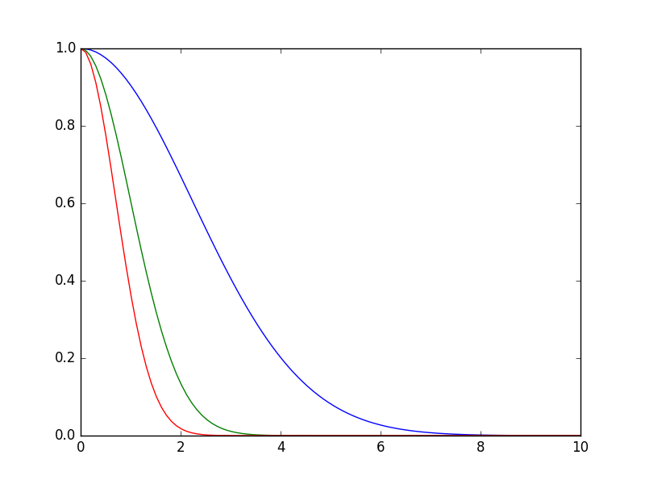
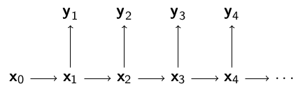
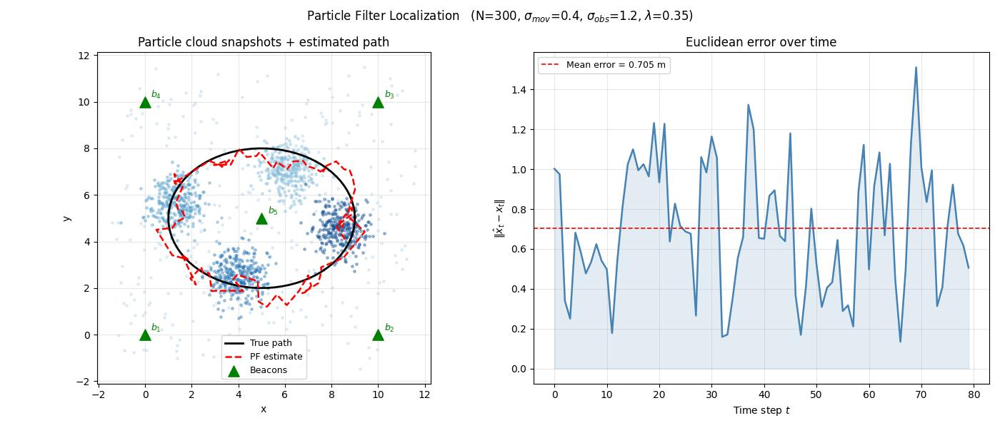

# Parçacık Filtreleri (Particle Filters)

Parcaçık filtreleri Kalman filtrelerinde olduğu gibi saklı bir konum
bilgisi hakkında dış ölçümler üzerinden kestirme hesabı yapabilir. Her
parçacık bir hipotezi, farklı bir konum bilgisini temsil eder, olasılığı,
olurluğu ölçüm fonksiyonudur.  Eğer bu olasılık değeri problemden direk
elde edilebilen bir şey değilse, bir ölçüm / hipotez / tahmin arasındaki
mesafeyi (hatayı) olurluğa çevirmek mümkün. Burada genellikle

$$ p(y_t|x_t) \sim e^{-\lambda \varepsilon^2}$$

fonksiyonu kullanılır, $\lambda$ bir tür hassaslık parametresi, bu
parametre üzerinden olurluk ya daha az ya da daha fazla etkin hale gelir,
$\varepsilon$ ölçüm ve tahmin arasındaki bir mesafe olacaktır. 

```python
x = np.linspace(0,10,100)
def f(x,lam): return np.exp(-lam * x**2)
plt.plot(x,f(x,lam=0.1))
plt.plot(x,f(x,lam=0.5))
plt.plot(x,f(x,lam=1.0))
plt.savefig('tser_pf_03.png')
```



Kalman Filtrelerine ve Saklı Markov Modellerinde gördüğümüz modeli
hatırlayalım, 



Bu modelde gözlemler, yani dışarıdan görülen ölçümler $y_1,y_2,..$ ve bu rasgele
değişkenler şartsal olarak eğer $x_0,x_1,.$ verili ise birbirlerinden
bağımsızlar. Model,

$\pi(x_0)$ başlangıç dağılımı

$f(x_t|x_{t-1})$, $t \ge 1$ geçiş fonksiyonu

$g(y_t|x_t)$, $t \ge 1$, gözlemlerin dağılımı

$x_{0:t} = (x_0,..,x_t)$, $t$ anına kadar olan gizli konum zinciri

$y_{1:t} = (y_1,..,y_t)$, $t$ anına kadar olan gözlemler

Genel olarak filtreleme işleminin yaptığı şudur: nasıl davrandığını, ve
dışarıdan görülebilen bir ölçütü olasılıksal olarak dışarı nasıl yansıttığını
bildiğimiz bir sistemi, sadece bu ölçümlerine bakarak nasıl davrandığını
anlamak, ve bunu sadece en son noktaya bakarak yapmak, yani sistemin konumu
hakkındaki tahminimizi sürekli güncellemek.

Mesela bir obje zikzak çizerek hareket ediyor. Bu zikzak hareketinin formülleri
vardır, bu hareketi belli bir hata payıyla modelleriz. Fakat bu hareket 3
boyutta, diyelim ki biz sadece 2 boyutlu dijital imajlar üzerinden bu objeyi
görüyoruz. 3D/2D geçişi bir yansıtma işlemidir ve bir matris çarpımı ile temsil
edilebilir, fakat bu geçiş sırasında bir kayıp olur, derinlik bilgisi gider,
artı bir ölçüm gürültüsü orada eklenir diyelim. Fakat tüm bunlara rağmen, sadece
eldeki en son imaja bakarak bu objenin yerini tahmin etmek mümkündür.

Mesela zikzaklı harekete yandan bakıyor olsak obje sağa giderken bir bizden
uzaklaşacak yani 2 boyutta küçülecek, ya da yakınlaşacak yani 2 boyutta
büyüyecek. Tüm bu acaipliğe (!) rağmen eğer yansıtma modeli doğru kodlanmış
ise filtre yeri tespit eder. Her parçacık farklı bir obje konumu hakkında
bir hipotez olur, sonra objenin hareketi zikzak modeline göre, algoritmanin
kendi zihninde yapılır, bu geçiş tüm parçacıklar / hipotezler üzerinde
işletilir, sonra yine tüm parçacıklar ölçüm modeli üzerinden
yansıtılır. Son olarak eldeki veri ile bu yansıtma arasındaki farka
bakılır. Hangi parçacıklar daha yakın ise (daha doğrusu hangi ölçümün
olasılığı mevcut modele göre daha yüksek ise) o parçacıklar hayatta kalır,
çünkü o parçacıkların hipotezi daha doğrudur, onlar daha "önemli'' hale
gelir, diğerleri devreden çıkmaya başlar. Böylece yavaşça elimizde hipotez
doğru olana yaklaşmaya başlar.

Matematiksel olarak belirtmek gerekirse, elde etmek istediğimiz sonsal dağılım
$p(x_{0:t} | y_{1:t})$ ve ondan elde edilebilecek yan sonuçlar, mesela $p(x_t |
y_{1:t})$. Bu kısmi (marginal) dağılıma *filtreleme dağılımı* ismi de
veriliyor, kısmi çünkü $x_{1:t-1}$ entegre edilip dışarı çıkartılmış. Bir diğer
ilgilenen yan ürün $\phi$ üzerinden $p(x_{0:t} | y_{1:t})$'nin beklentisi, ona
$I$ diyelim,

$$ I(f_t) = \int \phi_t(x_{0:t}) p(x_{0:t} | y_{1:t}) \mathrm{d} x_{0:t} $$

En basit durumda eğer $\phi_t(x_{0:t}) =x_{0:t}$ alırsak, o zaman şartsal
ortalama (conditional mean) elde ederiz. Farklı fonksiyonlar da mümkündür [1].

Üstteki entegrali $x_{0:t} | y_{1:t}$'den örneklem alarak ve entegrali
toplam haline getirerek yaklaşıksal şekilde hesaplayabileceğimizi [2]
yazısında gördük. Fakat $x_{0:t} | y_{1:t}$'den örnekleyemiyoruz. Bu
durumda yine aynı yazıda görmüştük ki örneklenebilen başka bir dağılımı baz
alarak örneklem yapabiliriz, bu tekniğe önemsel örnekleme (importance
sampling) adı veriliyordu. Mesela mesela herhangi bir yoğunluk $h(x_{0:t})$
üzerinden,

$$ I = \int
\phi(x_{0:t})
\frac{ p(x_{0:t}|y_{1:t}) }{ h(x_{0:t}) } h_{0:t} \mathrm{d} x_{0:t}
$$

yaklaşıksal olarak

$$ \hat{I} = \frac{1}{N} \sum_{i=1}^{N} \phi (x^i_{0:t}) w^i_t  $$

ki

$$ 
w^i_t = \frac{p(x^i_{0:t}|y_{1:t})}{h(x^i_{0:t})} 
\tag{1} 
$$

ve bağımsız özdeşçe dağılmış (i.i.d.) $x^1_{0:t}, .., x^N_{0:t} \sim h$
olacak şekilde. Yani örneklem $h$'den alınıyor.

Bu güzel, fakat acaba $w^i_t$ formülündeki $p(x^i_{0:t}|y_{1:t})$'yi nasıl
hesaplayacağız? Ayrıca $h$ nasıl seçilecek? Acaba üstteki hesap özyineli olarak
yapılamaz mı, yani tüm $1:t$ ölçümlerini bir kerede kullanmadan, $t$ andaki
hesap sadece $t-1$ adımındaki hesaba bağlı olsa hesapsal olarak daha iyi olmaz
mı?

Bu mümkün. Mesela önemsel dağılım $h$ için,

$$ 
h(x_{0:t}) = h(x_t | x_{0:t-1}) h(x_{{0:t-1}}) 
\tag{2}
$$

Üstteki ifade koşulsal olasılığın doğal bir sonucu. Peki ağırlıklar özyineli
olarak hesaplanabilir mi? Bayes Teorisini kullanarak (1)'in bölünen kısmını
açabiliriz,

$$
w_t =
\frac{p(x_{0:t}|y_{1:t})}{h(x_{0:t})} =
\frac{p(y_{1:t}|x_{0:t}) p(x_{0:t})}{h(x_{0:t})p(y_{1:t}) }
\tag{3}
$$

çünkü hatırlarsak $P(A|B) = P(B|A)P(A) / P(B)$, teknik işliyor çünkü
$P(B,A)=P(A,B)$.  

Şimdi $h(x_{0:t})$ için (2)'de gördüğümüz açılımı yerine koyalım,

$$ w_t =
\frac{p(y_{1:t}|x_{0:t}) p(x_{0:t})}{h(x_t | x_{0:t-1}) h(x_{{0:t-1}}) p(y_{1:t}) }
$$

Ayrıca gözlem dağılımı $g$'yi $p(y_{1:t}|x_{0:t})$'yi, ve gizli geçiş dağılımı
$f$'i $p(x_{0:t})$ açmak için kullanırsak,

$$ = \frac
{g(y_t|x_t) p(y_{1:t-1}|x_{0:t-1}) f(x_t|x_{t-1})p(x_{0:t-1}) }
{h(x_t|x_{0:t-1}) h(x_{{0:t-1}}) p(y_{1:t})}
$$

Üstteki formülde bölünendeki 2. çarpan 4. çarpan ve bölende ortadaki
çarpana bakalım, bu aslında (3)'e göre $w_{t-1}$'in tanımı değil mi?

Neredeyse; arada tek bir fark var, bir $p(y_{1:t-1})$ lazım, o üstteki formülde
yok, ama onu bölünene ekleyebiliriz, o zaman

$$ =
w_{t-1} \frac{g(y_t|x_t) f(x_t|x_{t-1})p(y_{1:t-1}) }
{h(x_t|x_{0:t-1}) p(y_{1:t})}
$$

Hem $p(y_{1:t})$ hem de $p(y_{1:t})$ birer sabittir, o zaman o değişkenleri
atarak üstteki eşitliğin oransal doğru olduğunu söyleyebiliriz. Ayrıca bu
ağırlıkları artık normalize edilmiş parçacıklar bazında düşünürsek,
$\tilde{w}^i_t = \frac{w_t^i}{\sum_j w_t^j}$, o zaman 

$$
\tilde{w}^i_{t} \propto
\tilde{w}^i_{t-1} \frac{g(y_t|x_t) f(x_t|x_{t-1}) } {h(x_t|x_{0:t-1}) }
$$

Eğer başlangıç dağılımı $x_0^{(1)}, ..., x_0^{(N)} \sim \pi(x_0)$'dan geliyor
ise, ve biz $h(x_0) = \pi(x_0)$ dersek, ayrıca önem dağılımı $h$ için
$h(x_t|x_{0:t-1}) = f(x_t|x_{t-1})$ kullanırsak, geriye 

$$
\tilde{w}^i_{t} \propto \tilde{w}^i_{t-1} g(y_t|x_t)
$$

kalacaktır.

Burada ilginç bir nokta sistemin geçiş modeli $f$'in önemlilik örneklemindeki
teklif (proposal) dağılımı olarak kullanılmış olması. 

Tekrar Örnekleme

Buraya kadar gördüklerimiz sıralı önemsel örnekleme (sequential importance
sampling) algoritması olarak biliniyor. Fakat gerçek dünya uygulamalarında
görüldü ki ağırlıklar her adımda çarpıla çarpıla dejenere hale geliyorlar. Bir
ilerleme olarak ağırlıkları her adımda çarpmak yerine her adımda $w_t$ $g$
üzerinden hesaplanır, ve bir ek işlem daha yapılır, eldeki ağırlıklara göre
parçacıklardan "tekrar örneklem'' alınır. Bu sayede daha kuvvetli olan
hipotezlerin hayatta kalması diğerlerinin yokolması sağlanır. 

Nihai parcaçık filtre algoritması şöyledir,


`particle_filter`$\left( f, g, y_{1:t} \right)$


  * Her $i=1,..,N$ için 
  
     * $\tilde{x}_t^{(i)} \sim f(x_t|x_{t-1}^{(i)})$ örneklemini al, ve
       $\tilde{x}_{0:t}^{(i)} = ( \tilde{x}_{0:t-1}^{(i)},\tilde{x}_{t}^{(i)})$ yap. 
     * Önemsel ağırlıklar $\tilde{w}_t^{(i)} = g(y_t|\tilde{x}^{{i}})$'ı hesapla.
     * $N$ tane yeni parçacık $(x_{0:t}^{(i)}; i=1,..,N )$ eski parçacıklar 
       $\{ \tilde{x}^{(i)}_{0:t},...,\tilde{x}^{(i)}_{0:t} \}$ içinden
       normalize edilmiş önemsel ağırlıklara göre örnekle. 
     * $t = t + 1$ 
  

Örnek

Aşağıdaki 2 boyutlu bir düzlemde hareket eden bir robotun konumunu,
sabit noktalardaki vericilerden (beacon) alınan mesafe ölçümleri
üzerinden tahmin edeceğiz. Bu problem parçacık filtrelerinin gücünü
göstermek için idealdir: durum uzayı süreklidir, hareket modeli
doğrusal olmayabilir, ve ölçüm gürültüsü kolayca Gaussian olmayan bir
biçim alabilir; bu koşulların hepsinde Kalman filtresi zorlanır,
parçacık filtresi ise doğrudan uygulanabilir.

Problem kurulumu. $K$ adet verici bilinen $b_k$ konumlarında sabit
duruyor. Robot her adımda her vericiye olan gerçek mesafeyi, üzerine
Gaussian gürültü eklenmiş biçimde ölçüyor:

$$y_{t,k} = \|x_t - b_k\| + \mathcal{N}(0, \sigma_{obs}^2)$$

Geçiş modeli. Robotun hareketi Gaussian rasgele yürüyüş ile
modellenir:

$$x_t = x_{t-1} + \mathcal{N}(0, \sigma_{mov}^2 I)$$

Bu aynı zamanda bootstrap filtre seçimi olarak önerme (proposal)
dağılımı $h(x_t|x_{t-1}) = f(x_t|x_{t-1})$ olarak kullanılır; bir
önceki bölümde gördüğümüz gibi bu seçim ağırlık güncellemesini sadece
ölçüm olurluğuna indirgeyerek basitleştirir.

Ağırlık güncellemesi. Her parçacık $x_t^{(i)}$ için ağırlık, tüm
vericilerdeki ölçüm hatalarının karelerinin toplamı üzerinden
hesaplanır. Dokümanın başında tanıttığımız $e^{-\lambda
\varepsilon^2}$ fonksiyonu burada doğal olarak ortaya çıkar:

$$w_t^{(i)} \propto \exp\!\left(-\lambda \sum_{k=1}^K
\left(\|x_t^{(i)} - b_k\| - y_{t,k}\right)^2\right)$$

burada $\lambda = 1/(2\sigma_{obs}^2)$ ölçüm modelinin hassasiyet
parametresidir.

Tekrar örnekleme. Orijinal algoritmada kullanılan yöntem yerine
sistematik tekrar örnekleme (systematic resampling)
kullanılmıştır. Her iki yöntem de $O(N)$ maliyetlidir fakat sistematik
yöntem çok daha düşük varyansa sahiptir: ağırlıklara göre CDF üzerinde
eşit aralıklı $N$ nokta yerleştirilir, bu sayede yüksek ağırlıklı her
parçacığın en az $\lfloor N w^{(i)} \rfloor$ kez seçilmesi garanti
altına alınır.

Kod çıktısında iki grafik göreceksiniz. Sol panelde farklı zaman
adımlarındaki parçacık bulutları (koyu mavi = daha geç adım) ve tahmin
edilen yol gösterilmektedir; parçacık bulutunun gerçek konuma nasıl
yakınsadığı görselleştirilebilir. Sağ panelde ise tahmin edilen konum
ile gerçek konum arasındaki Öklid hatası zaman içinde
gösterilmektedir.

```python
import numpy as np
import matplotlib.pyplot as plt
import matplotlib.patches as mpatches

rng = np.random.default_rng(42)

N          = 300          # number of particles
T          = 80           # time steps
SIGMA_MOV  = 0.4          # std of transition noise (motion model)
SIGMA_OBS  = 1.2          # std of observation noise added to true distances
LAM        = 1.0 / (2 * SIGMA_OBS**2)   # precision in likelihood

# Known beacon positions (fixed, 2-D)
beacons = np.array([[0., 0.],
                    [10., 0.],
                    [10., 10.],
                    [0., 10.],
                    [5., 5.]])

def true_trajectory(T):
    t  = np.linspace(0, 2*np.pi, T)
    xs = 5 + 4 * np.cos(t)          # ellipse, centred in beacon grid
    ys = 5 + 3 * np.sin(t)
    return np.stack([xs, ys], axis=1)   # (T, 2)

true_path = true_trajectory(T)

def observe(pos):
    """Return noisy distances from pos to each beacon."""
    d = np.linalg.norm(beacons - pos, axis=1)          # true distances
    return d + rng.normal(0, SIGMA_OBS, size=len(beacons))

observations = np.array([observe(true_path[t]) for t in range(T)])  # (T, K)

def log_likelihood(particles, y_t):
    """
    particles : (N, 2)
    y_t       : (K,)  observed distances
    returns   : (N,)  unnormalised log-weights
    """
    # predicted distances from each particle to each beacon
    diff = particles[:, None, :] - beacons[None, :, :]   # (N, K, 2)
    pred = np.linalg.norm(diff, axis=2)                   # (N, K)
    eps2 = (pred - y_t[None, :])**2                       # (N, K)
    return -LAM * eps2.sum(axis=1)                        # (N,)

def systematic_resample(weights):
    """
    Lower-variance resampling.  weights must sum to 1.
    Returns indices of chosen particles.
    """
    N   = len(weights)
    cdf = np.cumsum(weights)
    u0  = rng.uniform(0, 1/N)
    us  = u0 + np.arange(N) / N
    return np.searchsorted(cdf, us)

def particle_filter(observations, beacons, N, sigma_mov):
    T = len(observations)

    # initialise particles uniformly over bounding box of beacons
    lo, hi  = beacons.min(axis=0) - 1, beacons.max(axis=0) + 1
    particles = rng.uniform(lo, hi, size=(N, 2))
    weights   = np.ones(N) / N

    estimates = np.zeros((T, 2))
    all_particles = np.zeros((T, N, 2))

    for t in range(T):
        particles += rng.normal(0, sigma_mov, size=particles.shape)

        log_w = log_likelihood(particles, observations[t])
        log_w -= log_w.max()               # numerical stability
        weights = np.exp(log_w)
        weights /= weights.sum()           # normalise

        # 3. ESTIMATE: weighted mean
        estimates[t] = (weights[:, None] * particles).sum(axis=0)
        all_particles[t] = particles.copy()

        # 4. RESAMPLE
        idx = systematic_resample(weights)
        particles = particles[idx]
        weights   = np.ones(N) / N

    return estimates, all_particles

estimates, all_particles = particle_filter(observations, beacons, N, SIGMA_MOV)

fig, axes = plt.subplots(1, 2, figsize=(14, 6))

ax = axes[0]
snap_steps = [0, 20, 40, 60, 79]
colors      = plt.cm.Blues(np.linspace(0.3, 0.9, len(snap_steps)))

for idx_s, (s, c) in enumerate(zip(snap_steps, colors)):
    ax.scatter(all_particles[s, :, 0], all_particles[s, :, 1],
               s=6, color=c, alpha=0.35, zorder=2)

ax.plot(true_path[:, 0], true_path[:, 1],
        'k-', lw=2, label='True path', zorder=4)
ax.plot(estimates[:, 0], estimates[:, 1],
        'r--', lw=1.8, label='PF estimate', zorder=5)

ax.scatter(beacons[:, 0], beacons[:, 1],
           marker='^', s=120, c='green', zorder=6, label='Beacons')
for i, b in enumerate(beacons):
    ax.annotate(f'$b_{i+1}$', b, textcoords='offset points',
                xytext=(6, 4), fontsize=9, color='green')

ax.set_title('Particle cloud snapshots + estimated path')
ax.set_xlabel('x'); ax.set_ylabel('y')
ax.legend(fontsize=9)
ax.set_aspect('equal')
ax.grid(True, alpha=0.3)

ax2 = axes[1]
err = np.linalg.norm(estimates - true_path, axis=1)
ax2.plot(err, color='steelblue', lw=1.8)
ax2.axhline(err.mean(), color='red', ls='--', lw=1.2,
            label=f'Mean error = {err.mean():.3f} m')
ax2.fill_between(range(T), 0, err, alpha=0.15, color='steelblue')
ax2.set_title('Euclidean error over time')
ax2.set_xlabel('Time step $t$')
ax2.set_ylabel('$\|\\hat{x}_t - x_t\|$')
ax2.legend(fontsize=9)
ax2.grid(True, alpha=0.3)

plt.suptitle(
    f'Particle Filter Localization   (N={N}, $\\sigma_{{mov}}$={SIGMA_MOV}, '
    f'$\\sigma_{{obs}}$={SIGMA_OBS}, $\\lambda$={LAM:.2f})',
    fontsize=12)
plt.tight_layout()
plt.savefig('tser_pf_01.jpg')
```



Kaynaklar

[1] Gandy, *LTCC - Advanced Computational Methods in Statistics*,
[http://wwwf.imperial.ac.uk/~agandy/ltcc.html](http://wwwf.imperial.ac.uk/~agandy/ltcc.html)

[2] Bayramlı, Istatistik, *İstatistik, Monte Carlo, Entegraller, MCMC*

[3] Bayramlı, Yapay Görüş, *Obje Takibi*


