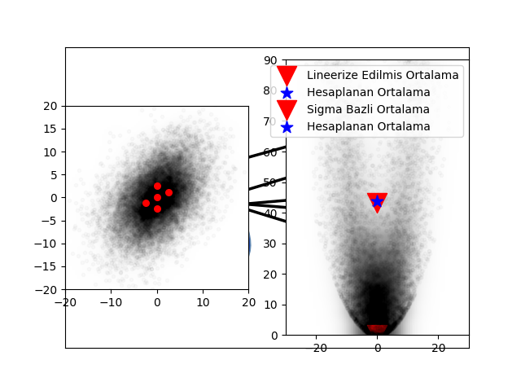
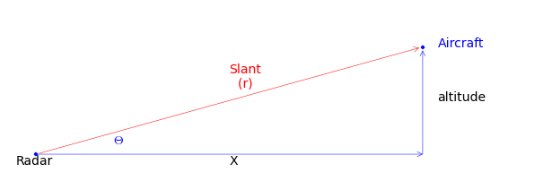
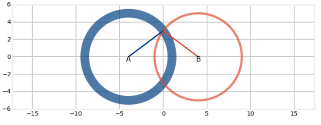

# Sigma Bazlı Kalman Filtreleri (Unscented Kalman Filters -UKF-)

*Kalman Filtereleri* yazısında dış ölçümlerin bir iç konumu anlamak
için nasıl kullanıldığını gördük, fakat KF'ler gayrı lineerliği iyi idare
edemiyorlar. Mesela havaya atılan bir topu gürültülü ölçümlerden takip
ettiğimizi düşünelim, top çıkıp inecek, değişim (state transition) /
hareket parabol şeklinde (parabol gayrı lineer). Bu basit hareket bile KF
ile takip edilemiyor. Gayri lineerlik ölçüm sırasında da ortaya çıkabilir,
mesela bir objenin uzaklığını radardan alıyorsak ölçüm bize yerden
yükseklik ve eğim olarak gelebilir, bu ölçümleri direk mesafeye çevirmek
için karelerin toplamının karekökü gerekir ve bu yine bir gayrı lineerliği
probleme sokmuş olur.

Çözüm için farklı yaklaşımlar var; genişletilmiş KF (EKF) lokal bir nokta
etrafında Taylor açılımı kullanarak gayrı lineerliği yakalamaya
uğraşıyor. Fakat hem performans hem doğruluk açısından daha verimli bir
yaklaşım sigma bazlı Kalman filtreleri (UKF).

UKF'in yaptığı nedir? Normal KF'in işleyişi sırasında geçiş ya da gözlem
fonsiyonlarının içinden Gaussian'lar geçirdiği söylenebilir.  Gaussian'lar
(yani onların $\mu,\sigma$ parametreleri) lineerlige tabi olduklarında
bozulmazlar, iki Guassian toplamı yine bir Gaussian'dır, vs. Fakat gayrı
lineer fonksiyonlar işleri bozar.

UKF'in püf noktası o an eldeki Gaussian'ın standart sapma $\sigma$'sına
oranlı seçilmiş birkaç noktanın değişim yapan fonksiyona verilmesi; normal
KF'i o zaman sadece merkez nokta $\mu$'yu işlemden geçiriyor olarak
görebiliriz, fakat UKF ile seçenekleri arttırıyoruz [1]. Bu noktalar
seçildiğinde onları değişim fonksiyonuna tabi tutuyoruz, böylece ele geçen
sonuç Gaussian'ı daha gerçeğe yakın oluyor. UKF yaklaşımında ayrıca seçilen
her nokta için bir ağırlık gerekiyor, ve bu ağırlıklar da önceden
kararlaştırılır, bazı uygulamalarda merkez noktaya daha fazla ağırlık
vermek istenebilir, diğerleri dış noktaları tercih edebilir.

```python
from __future__ import (absolute_import, division, print_function,
                        unicode_literals)

import math, util, scipy.linalg as linalg, filter
from numpy import eye, zeros, dot, isscalar, outer
from scipy.linalg import inv, cholesky
from numpy.random import randn
from scipy.stats import norm, multivariate_normal

ax=plt.figure().gca()

x = np.array([0, 5])
P = np.array([[4, -2.2], [-2.2, 3]])

util.plot_covariance_ellipse(x, P, facecolor='b', alpha=0.6, variance=9,plt=plt)
sigmas = filter.MerweScaledSigmaPoints(2, alpha=.5, beta=2., kappa=0.)

S = sigmas.sigma_points(x=x, P=P)
plt.scatter(S[:,0], S[:,1], c='k', s=80)

x = np.array([15, 5])
P = np.array([[3, 1.2],[1.2, 6]])
util.plot_covariance_ellipse(x, P, facecolor='g', variance=9, alpha=0.3,plt=plt)

ax.add_artist(util.arrow(S[0,0], S[0,1], 11, 4.1, 0.6))
ax.add_artist(util.arrow(S[1,0], S[1,1], 13, 7.7, 0.6))
ax.add_artist(util.arrow(S[2,0], S[2,1], 16.3, 0.93, 0.6))
ax.add_artist(util.arrow(S[3,0], S[3,1], 16.7, 10.8, 0.6))
ax.add_artist(util.arrow(S[4,0], S[4,1], 17.7, 5.6, 0.6))

ax.axes.get_xaxis().set_visible(False)
ax.axes.get_yaxis().set_visible(False)

plt.savefig('tser_ukf_02.png')
```


"Sigma bazlı transform edilmiş'' (unscented transform) yeni Gaussian
hesabı şöyle olur,

$$ \mu = \sum_i w_i^m y_i $$

$$ \Sigma = \sum_i w_i^c (y_i-\mu)(y_i-\mu)^T $$

Dikkat, bu yaptığımız parçacık filtrelerindeki gibi örneklemek, ya da her
değişik hipotezi temsil eden "parçacıklar'' yaratmak değil, bir
Gaussian'ın hep belli yerlerindeki belli noktalara bakmak. Bu seçim tamamen
*deterministik*, hiçbir rasgelelik yok. Seçim nasıl yapılır?  Her
uygulama için tasarımcı buna karar verir, altta bazı örnekler görülüyor,


Fakat endüstri sigmayı ve ağırlıklarını seçmek için 2005'ten itibaren
[2]'deki yöntemi kabul etmiş görünüyor.

Trasform Örneği

Alttaki gibi bir gayrı-lineer fonksiyon

$$ 
\left\{ \begin{array}{ll}
x = x + y \\
y = 0.1 x^2 + y^2
\end{array} \right.
$$

olsun, bu fonksiyona  alttaki çok boyutlu Gaussian'dan örneklenmiş
noktaları geçeceğiz, 

$$ 
\mu = \left[\begin{array}{r} 0 \\ 0 \end{array}\right],
\quad 
\Sigma = \left[\begin{array}{rr} 32 & 15 \\ 15 & 40 \end{array}\right]
$$

```python
def f_nonlinear_xy(x, y):
    return np.array([x + y, .1*x**2 + y*y])

mean = (0, 0)
p = np.array([[32, 15], [15., 40.]])
# Compute linearized mean
mean_fx = f_nonlinear_xy(*mean)

#generate random points
xs, ys = multivariate_normal.rvs(mean=mean, cov=p, size=2000).T
util.plot_monte_carlo_mean(xs, ys, f_nonlinear_xy, mean_fx, 'Lineerize Edilmis Ortalama');
plt.savefig('tser_ukf_13.png')
```

```
Ortalamalardaki fark x=-0.471, y=43.237
```


Görülüyor ki eğer EKF ile olduğu gibi bir lineerizasyon yapılsa ortaya çok
büyük bir hata çıkacak. Tekrar vurgulamak gerekirse figürde görülen
"lineerize edilmiş ortalama'' Gaussian $\mu$'sunun gayrı lineer fonksiyona
geçilmiş hali, ki EKF bu şekilde işlem yapar, diğeri Gaussian'dan alınan
noktaların gayrı-lineer fonksiyona geçildikten sonra alınan ortalama. 

Fakat sigma bazlı transform kullanırsak,

```python
from numpy.random import multivariate_normal
import util

#initial mean and covariance
mean = (0, 0)
p = np.array([[32., 15], [15., 40.]])

# create sigma points - we will learn about this later
points = filter.MerweScaledSigmaPoints(n=2, alpha=.3, beta=2., kappa=.1)
Wm, Wc = points.weights()
sigmas = points.sigma_points(mean, p)

### gayri-lineer fonksiyondan gecir
sigmas_f = np.empty((5, 2))
for i in range(5):
    sigmas_f[i] = f_nonlinear_xy(sigmas[i, 0], sigmas[i ,1])

### sigma bazli transform ile yeni ortalama ve kovaryansi hesapla
ukf_mean, ukf_cov = filter.unscented_transform(sigmas_f, Wm, Wc)

# rasgele noktalar uret
np.random.seed(100)
xs, ys = multivariate_normal(mean=mean, cov=p, size=5000).T
util.plot_monte_carlo_mean(xs, ys, f_nonlinear_xy, ukf_mean, 'Sigma Bazli Ortalama')
plt.xlim(-30, 30); plt.ylim(0, 90)
plt.subplot(121)
plt.scatter(sigmas[:,0], sigmas[:,1], c='r', s=30);
plt.savefig('tser_ukf_12.png')
```

```
Ortalamalardaki fark x=-0.097, y=0.549
```



Bu sonuç bana müthiş geliyor; sadece 5 nokta kullanarak ortalamaya çok
yakın bir sonucu hesaplayabildik, ayrıca bunu gayrı lineerliğin ne
olduğundan tamamen bağımsız olarak yaptık; eğer sigma noktalarını üreten
koda bakarsak göreceğiz ki bu kod gayrı-lineer fonksiyondan habersiz.

Filtre

UKF formüllerine bakalım. Geçiş ve gözlemin $f,h$ olduğunu
düşünelim, matris formunda $F,H$. O anda elde olan $\mu,\Sigma$'yı alıp,
önceden seçilmiş sigma noktaları üzerinden bir $X$ elde ediyoruz. Bir
sonraki zaman dilimine

$$ Y = f(X) $$

ile geçiyoruz. Şimdi sigma bazlı transform ile tahmini ortalama kovaryans
hesaplarız,

$$ \bar{\mu} = \sum w^m Y $$ 

$$ \bar{\Sigma} = \sum w^c (Y-\hat{\mu})(Y-\hat{\mu})^T + Q $$

KF ile geçiş ortalama için $\bar{x} = Fx$ ve kovaryans $\bar{P} = FPF^T + Q$ 
ile olurdu. 

Güncelleme adımında eldeki sigma noktalarını bir tahmine çeviriyoruz,

$$ Z = h(Y) $$

Sonra bu noktaların ortalama ve kovaryansını sigma bazlı transformu
kullanarak hesaplayabiliriz, 

$$ \mu_z = \sum w^m Z $$

$$ P_z = \sum w^c (Z-\bar{\mu}) (Z-\bar{\mu})^T + R$$

Şimdi Kalman kazancı (gain) ve artıkları hesaplanabilir. Artıklar basit

$$ y = z - \mu_z$$

Kazanç için önce konum ve ölçümlerin çapraz kovaryansını hesaplarız, 

$$ P_{xz} = \sum w^c (X-\mu)(Z-\mu_z)^T    $$

sonra kazancı hesaplarız, 

$$ K = P_{xz}P_z^{-1} $$

Üstteki matris tersi işlemi bir nevi oran hesabı gibi görebiliriz, o zaman
Kalman kazancı

$$ 
K \approx \frac{P_{xz}}{P_z^{-1}} \approx 
\frac{\textrm{mevcut konuma inanç}}{\textrm{ölçüme olan inanç}}
$$

oranından ibarettir. Nihayet yeni kestirme hesabı artık ve kazanç
kullanarak hesaplanabilir,

$$ x = \bar{x} + Ky $$

yeni kovaryans

$$ P = \bar{P} - KP_zK^T $$

Filtrenin iç kodlaması hakkında diğer matematiksel detaylar için [1, sf. 382].

Dikkat çekilmesi gereken püf nokta KF'te olduğu gibi ölçümleri üretenin
artık bir matris olmadığıdır. Normal Kalman filtreleri ile elde bir ölçüm
"fonksiyonu'' vardır fakat bu fonksiyonu bir $H$ matrisi olarak temsil
etmek zorundayız. Efendim boyutları düzgün olmalı, ki konum $x$'i
çarpabilsin, vs. UKF ile bir $h$ *fonksiyonu* var, bu fonksiyonlar ek
işlemler yapılmadan önce verinin kendisini transforme ediyorlar, ve
"yeni'' veri üzerinde ek filtreleme işlemleri yapıyoruz, mesela Kalman
kazancını bu transform edilmiş veri üzerinden hesaplıyoruz. Kıyasla KF ile
$H$ matrisi matris olarak direk kazanç hesabında kullanılıyor. Ardından UKF
ile veriye öyle noktalarda (sigma noktaları) bakıyoruz ki $h$ ne kadar
gayrı-lineer olursa olsun onun temel özelliklerini yakalayabilmiş
oluyoruz. Bu geçiş fonksiyonu $f$ için de geçerli tabii, artık onun da bir
matris olması gerekmiyor. Ama hala $F,H$ matrislerini tasarlayıp onları
$f,h$ fonksiyonları içinde $x$'i çarpmak için kullanabiliriz tabii, ama bu
şart değil. 

Örnek

Bir KF tasarlamak için $x,F,H,R$ matrislerinin ne olduğunu kararlaştırmak
gerekiyor demiştik, bu durum daha önce KF yazısında işlendi. Konum bilgisi
nedir, geçiş nedir, ölçüm nedir? Hareket halindeki bir objeyi takip
ettiğimizi düşünelim, konum

$$ x=\left[\begin{array}{cccc} x&\dot{x}&y&\dot{y} \end{array}\right]^T $$

olabilir. Konum geçişi 

$$ F = 
\left[\begin{array}{rrrr}
1 & \Delta t & 0 & 0 \\
0 & 1 & 0 & 0 \\
0 & 0 & 1 & \Delta t \\
0 & 0 & 0 & 1
\end{array}\right]
$$

Üstteki denklemle bir Newton formülünü kodlamış oluyoruz, 

$$ x_k = x_{k-1} + \dot{x}_{k-1}\Delta t $$

Algılayıcılar hareketli aracın yerini bildiriyor ama hızını bildiremiyor, o
zaman 

$$ H = \left[\begin{array}{rrrr}
1 & 0 & 0 & 0 \\
0 & 0 & 1 & 0 
\end{array}\right]$$

Diyelim ki algılayıcının pozisyonu belirleme hatası hem $x$ hem $y$
kordinatları için $1\sigma = 0.3$ metre, bu bize alttaki ölçüm gürültü
matrisini veriyor, 

$$ R = \left[\begin{array}{cc}
0.3^2  & 0 \\ 0 & 0.3^2
\end{array}\right]$$

Konum geçişinde  de gürültü var, o da 

$$ Q = \left[\begin{array}{cc}
\frac{1}{4} \Delta t^4 & \frac{1}{2} \Delta t^3 \\
\frac{1}{2} \Delta t^3 & \Delta t^2 
\end{array}\right] \sigma^2  $$

Tabii biz simülasyon amaçlı veri üretirken de üstteki matrisi
kullanacağız. 

Kodlar altta,

```python
from __future__ import (absolute_import, division, print_function,
                        unicode_literals)

import math, util, scipy.linalg as linalg
from numpy import eye, zeros, dot, isscalar, outer
from scipy.linalg import inv, cholesky
from numpy.random import randn
from scipy.stats import norm, multivariate_normal
import numpy as np

def dot3(A,B,C):
    return dot(A, dot(B,C))

def logpdf(x, mean, cov):
    flat_mean = np.asarray(mean).flatten()
    flat_x = np.asarray(x).flatten()
    return multivariate_normal.logpdf(flat_x, flat_mean, cov, True)

def unscented_transform(sigmas, Wm, Wc, noise_cov=None,
                        mean_fn=None, residual_fn=None):
    kmax, n = sigmas.shape

    if mean_fn is None:
        x = np.dot(Wm, sigmas)    # dot = \Sigma^n_1 (W[k]*Xi[k])
    else:
        x = mean_fn(sigmas, Wm)

    if residual_fn is None:
        y = sigmas - x[np.newaxis,:]
        P = y.T.dot(np.diag(Wc)).dot(y)
    else:
        P = np.zeros((n, n))
        for k in range(kmax):
            y = residual_fn(sigmas[k], x)
            P += Wc[k] * np.outer(y, y)

    if noise_cov is not None:
        P += noise_cov

    return (x, P)

def Q_discrete_white_noise(dim, dt=1., var=1.):
    assert dim == 2 or dim == 3
    if dim == 2:
        Q = np.array([[.25*dt**4, .5*dt**3],
                      [ .5*dt**3,    dt**2]], dtype=float)
    else:
        Q = np.array([[.25*dt**4, .5*dt**3, .5*dt**2],
                      [ .5*dt**3,    dt**2,       dt],
                      [ .5*dt**2,       dt,        1]], dtype=float)

    return Q * var

class MerweScaledSigmaPoints(object):

    def __init__(self, n, alpha, beta, kappa, sqrt_method=None, subtract=None):

        self.n = n
        self.alpha = alpha
        self.beta = beta
        self.kappa = kappa
        if subtract is None:
            self.subtract= np.subtract
        else:
            self.subtract = subtract

    def num_sigmas(self):
        return 2*self.n + 1

    def sigma_points(self, x, P):
        assert self.n == np.size(x), \
            "expected size {}, but size is {}".format(self.n, np.size(x))

        n = self.n
        if np.isscalar(x): x = np.asarray([x])
        if  np.isscalar(P): P = np.eye(n)*P
        else: P = np.asarray(P)

        lambda_ = self.alpha**2 * (n + self.kappa) - n
        U = cholesky((lambda_ + n)*P)

        sigmas = np.zeros((2*n+1, n))
        sigmas[0] = x
        for k in range(n):
            sigmas[k+1]   = self.subtract(x, -U[k])
            sigmas[n+k+1] = self.subtract(x, U[k])

        return sigmas


    def weights(self):
        n = self.n
        lambda_ = self.alpha**2 * (n +self.kappa) - n

        c = .5 / (n + lambda_)
        Wc = np.full(2*n + 1, c)
        Wm = np.full(2*n + 1, c)
        Wc[0] = lambda_ / (n + lambda_) + (1 - self.alpha**2 + self.beta)
        Wm[0] = lambda_ / (n + lambda_)
        return Wm, Wc

class UKF(object):
    def __init__(self, dim_x, dim_z, hx, fx, points,
                 x_mean_fn=None, z_mean_fn=None,
                 residual_x=None,
                 residual_z=None):

        self.Q = eye(dim_x)
        self.R = eye(dim_z)
        self.x = zeros(dim_x)
        self.P = eye(dim_x)
        self._dim_x = dim_x
        self._dim_z = dim_z
        self.points_fn = points
        self._num_sigmas = points.num_sigmas()
        self.hx = hx
        self.fx = fx
        self.x_mean = x_mean_fn
        self.z_mean = z_mean_fn
        self.log_likelihood = 0.0
        self.Wm, self.Wc = self.points_fn.weights()

        if residual_x is None:
            self.residual_x = np.subtract
        else:
            self.residual_x = residual_x

        if residual_z is None:
            self.residual_z = np.subtract
        else:
            self.residual_z = residual_z

        self.sigmas_f = zeros((self._num_sigmas, self._dim_x))
        self.sigmas_h = zeros((self._num_sigmas, self._dim_z))


    def predict(self, dt):
        sigmas = self.points_fn.sigma_points(self.x, self.P)        
        for i in range(self._num_sigmas):
            # parametre verilen dt oldugu gibi fx'e geciliyor,
            # yani UKF matematiginde direk kullanilmiyor
            self.sigmas_f[i] = self.fx(sigmas[i], dt)            
        self.x, self.P = unscented_transform(self.sigmas_f,
                                             self.Wm,
                                             self.Wc,
                                             self.Q,
                                             self.x_mean,
                                             self.residual_x)

    def predict(self, dt, u):
        sigmas = self.points_fn.sigma_points(self.x, self.P)        
        for i in range(self._num_sigmas):
            # parametre verilen dt oldugu gibi fx'e geciliyor,
            # yani UKF matematiginde direk kullanilmiyor
            self.sigmas_f[i] = self.fx(sigmas[i], dt, u)
        self.x, self.P = unscented_transform(self.sigmas_f,
                                             self.Wm,
                                             self.Wc,
                                             self.Q,
                                             self.x_mean,
                                             self.residual_x)
        

    def update(self, z):
        for i in range(self._num_sigmas):
            self.sigmas_h[i] = self.hx(self.sigmas_f[i])
        zp, Pz = unscented_transform(self.sigmas_h,
                                     self.Wm,
                                     self.Wc,
                                     self.R,
                                     self.z_mean,
                                     self.residual_z)

        Pxz = zeros((self._dim_x, self._dim_z))
        for i in range(self._num_sigmas):
            dx = self.residual_x(self.sigmas_f[i], self.x)
            dz =  self.residual_z(self.sigmas_h[i], zp)
            Pxz += self.Wc[i] * outer(dx, dz)


        self.K = dot(Pxz, inv(Pz)) 
        self.y = self.residual_z(z, zp) 

        self.x = self.x + dot(self.K, self.y)
        self.P = self.P - dot3(self.K, Pz, self.K.T)

        self.log_likelihood = logpdf(self.y, np.zeros(len(self.y)), Pz)


    def cross_variance(self, x, z, sigmas_f, sigmas_h):
        Pxz = zeros((sigmas_f.shape[1], sigmas_h.shape[1]))
        N = sigmas_f.shape[0]
        for i in range(N):
            dx = self.residual_x(sigmas_f[i], x)
            dz =  self.residual_z(sigmas_h[i], z)
            Pxz += self.Wc[i] * outer(dx, dz)


    @property
    def likelihood(self):
        return math.exp(self.log_likelihood)
```

```python
import filter

def f_cv(x, dt):
    F = np.array([[1, dt, 0, 0],
                 [0, 1, 0, 0],
	      	 [0, 0, 1, dt],
	      	 [0, 0, 0, 1]])
    return np.dot(F, x)

def h_cv(x):
    return np.array([x[0], x[2]])

dt = 1.0
std_x, std_y = .3, .3
zs = [np.array([i + randn()*std_x,i + randn()*std_y]) for i in range(100)]

sigmas = filter.MerweScaledSigmaPoints(4, alpha=.1, beta=2., kappa=1.)
ukf = filter.UKF(dim_x=4, dim_z=2, fx=f_cv,hx=h_cv, points=sigmas)
ukf.x = np.array([0., 0., 0., 0.])
ukf.R = np.diag([0.09, 0.09])
ukf.Q[0:2, 0:2] = filter.Q_discrete_white_noise(2, dt=1, var=0.02)
ukf.Q[2:4, 2:4] = filter.Q_discrete_white_noise(2, dt=1, var=0.02)
uxs = []
for z in zs:
    ukf.predict(dt=dt)
    ukf.update(z)
    uxs.append(ukf.x.copy())
uxs = np.array(uxs)
plt.plot(uxs[:, 0], uxs[:, 2])
plt.savefig('tser_ukf_01.png')
```


Bir Uçağı Radar ile Takip Etmek

Şimdi ilk gayrı lineer problemimize gelelim. Yeryüzündeki sabit bir radarı
algılayıcı olarak kullanarak bir uçağı takip edeceğiz. Basitlik amaçlı
olarak radar sinyalleri ve takip iki boyutta olacak. Radarlar bilindiği
gibi radyo sinyallerini etrafa yayarlar, ve etraftaki cisimlerden geri
gelen yansımalara bakarak bir mesafe hesaplarlar. Bu problemdeki radar bize
bir uzaklık ve cismin yerle olan açısını (slant) raporlayacak. Biz bu eğimi
ve mesafeyi alıp bir uzaklık ve irtifa / yükseklik (altitude) hesabına
çevireceğiz.



Uçağın sabit irtifada uçtuğunu farz edelim, 

$$ \vec{x} = 
\left[\begin{array}{c}  
\textrm{uzaklık} \\ \textrm{hız} \\ \textrm{irtifa}
\end{array}\right] = 
\left[\begin{array}{c}  
x_{pos} \\ x_{vel} \\ x_{alt}
\end{array}\right] = 
\left[\begin{array}{c}  
x \\ \dot{x} \\ y
\end{array}\right]
$$

Geçiş fonksiyonu lineer

$$ F = 
\left[\begin{array}{ccc}
1 & \Delta t & 0 \\ 0 & 1 & 0 \\ 0 & 0 & 1
\end{array}\right]
\left[\begin{array}{c} x \\ \dot{x} \\ y \end{array}\right]
$$

Şimdi ölçüm fonksiyonunu tasarlamak lazım, probleme tersten bakıyoruz
şimdi, yani "eğer yer seviyesindeki uzaklığı ve irtifayı biliyor
olsaydık açıyı (bearing) ve sinyal uzaklığını (range) nasıl ölçüyor
olurduk?'' sorusunu cevaplıyoruz. Pitagor denklemini kullanabiliriz,

$$ range = \sqrt{(x_{ac} - x_{radar})^2 + (z_{ac}-z_{radar})^2 } $$

Yer ile açı için 

$$ bearing = \tan^{-1} \frac{z_{ac}-z_{radar}}{x_{ac}-x_{radar}}$$

```python
def f_radar(x, dt):
    F = np.array([[1, dt, 0],
                  [0, 1, 0],
                  [0, 0, 1]], dtype=float)
    return np.dot(F, x)

def h_radar(x):
    dx = x[0] - h_radar.radar_pos[0]
    dz = x[2] - h_radar.radar_pos[1]
    slant_range = math.sqrt(dx**2 + dz**2)
    bearing = math.atan2(dz, dx)
    return slant_range, bearing

h_radar.radar_pos = (0, 0)

from numpy.linalg import norm
from math import atan2

class RadarStation(object):
    def __init__(self, pos, range_std, bearing_std):
        self.pos = np.asarray(pos)
        self.range_std = range_std
        self.bearing_std = bearing_std

    def reading_of(self, ac_pos):
        diff = np.subtract(ac_pos, self.pos)
        rng = norm(diff)
        brg = atan2(diff[1], diff[0])
        return rng, brg


    def noisy_reading(self, ac_pos):
        rng, brg = self.reading_of(ac_pos)
        rng += randn() * self.range_std
        brg += randn() * self.bearing_std
        return rng, brg


    def z_to_x(self, slant_range, angle):
        x = cos(angle)*slant_range
        z = sin(angle)*slant_range
        
        return self.pos + (x,z)
        
class ACSim(object):
    def __init__(self, pos, vel, vel_std):
        self.pos = np.asarray(pos, dtype=float)
        self.vel = np.asarray(vel, dtype=float)
        self.vel_std = vel_std

    def update(self, dt):
         dx = self.vel*dt + (randn() * self.vel_std) * dt
         self.pos += dx
         return self.pos

import math
from numpy import random

dt = 12. # 12 seconds between readings
range_std = 5 # meters
bearing_std = math.radians(0.5)
ac_pos = (0., 1000.)
ac_vel = (100., 0.)
radar_pos = (0., 0.)
h_radar.radar_pos = radar_pos
points = filter.MerweScaledSigmaPoints(n=3, alpha=.1, beta=2., kappa=0.)
kf = filter.UKF(3, 2, fx=f_radar, hx=h_radar, points=points)
kf.Q[0:2, 0:2] = filter.Q_discrete_white_noise(2, dt=dt, var=0.1)
kf.Q[2,2] = 0.1
kf.R = np.diag([range_std**2, bearing_std**2])
kf.x = np.array([0., 90., 1100.])
kf.P = np.diag([300**2, 30**2, 150**2])
random.seed(200)
pos = (0, 0)
radar = RadarStation(pos, range_std, bearing_std)
ac = ACSim(ac_pos, (100, 0), 0.02)
time = np.arange(0, 360 + dt, dt)
xs = []
for _ in time:
    ac.update(dt)
    r = radar.noisy_reading(ac.pos)
    kf.predict(dt=dt)
    kf.update([r[0], r[1]])
    xs.append(kf.x)

xs = np.asarray(xs)


plt.figure()
plt.plot(time, xs[:, 0]/1000.)
plt.xlabel('zaman(saniye)')
plt.ylabel('yer(km)')
plt.tight_layout()
plt.savefig('tser_ukf_04.png')

plt.figure()
plt.plot(time, xs[:, 1])
plt.xlabel('zaman(saniye)')
plt.ylabel(u'hız')
plt.tight_layout()
plt.savefig('tser_ukf_05.png')

plt.figure()
plt.plot(time, xs[:,2])
plt.xlabel('zaman(saniye)')
plt.ylabel('irtifa')
plt.tight_layout()
plt.savefig('tser_ukf_06.png')
```


Sonuçlar iyi, fakat uçağın hiç irtifa değiştirmediğini farzettik. Şimdi
uçağın bir dakika sonra daha yükseğe tırmanmaya başladığını düşünelim, ve
simülasyon verisini ona göre üretelim. O zaman tırmanma oranını da konum
matrisine eklememiz gerekir, 

$$ \vec{x} = 
\left[\begin{array}{c}  
\textrm{uzaklık} \\ \textrm{hız} \\ \textrm{irtifa} \\ \textrm{tırmanma oranı}
\end{array}\right] = 
\left[\begin{array}{c}  
x \\ \dot{x} \\ y \\ \dot{y}
\end{array}\right]
$$

Konum geçiş matrisi de değişir, 

$$ \vec{x}_{\textrm{geçiş sonrası}} = 
\left[\begin{array}{cccc}
1 & \Delta t & 0 & 0 \\ 
0 & 1 & 0 & 0 \\ 
0 & 0 & 1 & dt \\
0 & 0 & 0 & 1
\end{array}\right]
\left[\begin{array}{c}  x \\ \dot{x} \\ y \\ \dot{y} \end{array}\right]
$$

ki geçiş hala lineer. Ölçüm fonksiyonu aynı kalıyor, sadece boyutlar
değiştiği için $Q$'yi buna göre uyarlamak gerekiyor. Bu kadar. 

```python
def f_cv_radar(x, dt):
    F = np.array([[1, dt, 0, 0],
    [0, 1, 0, 0],
    [0, 0, 1, dt],
    [0, 0, 0, 1]], dtype=float)
    return np.dot(F, x)
def cv_UKF(fx, hx, R_std):
    points = filter.MerweScaledSigmaPoints(n=4, alpha=.1, beta=2., kappa=-1.)
    kf = filter.UKF(4, len(R_std), fx=fx, hx=hx, points=points)
    kf.Q[0:2, 0:2] = filter.Q_discrete_white_noise(2, dt=dt, var=0.1)
    kf.Q[2:4, 2:4] = filter.Q_discrete_white_noise(2, dt=dt, var=0.1)
    kf.R = np.diag(R_std)
    kf.R = np.dot(kf.R, kf.R) # square to get rariance
    kf.x = np.array([0., 90., 1100., 0.])
    kf.P = np.diag([300**2, 3**2, 150**2, 3**2])
    return kf

random.seed(200)
ac = ACSim(ac_pos, (100, 0), 0.02)
kf = cv_UKF(f_cv_radar, h_radar, R_std=[range_std, bearing_std])
time = np.arange(0, 360 + dt, dt)
xs = []
for t in time:
    if t >= 60:
        ac.vel[1] = 300/60 # 300 meters/minute climb
    ac.update(dt)
    r = radar.noisy_reading(ac.pos)
    kf.predict(dt=dt)
    kf.update([r[0], r[1]])
    xs.append(kf.x)

xs = np.array(xs)

plt.figure()
plt.plot(time, xs[:,2])
plt.xlabel('zaman(saniye)')
plt.ylabel('yükseklik')
plt.tight_layout()
plt.savefig('tser_ukf_08.png')
    
print(u'Gerçek irtifa: {:.1f}'.format(ac.pos[1]))
print(u'UKF ile hesaplanan irtifa: {:.1f}'.format(xs[-1][2]))
```

```
Gerçek irtifa: 2561.9
UKF ile hesaplanan irtifa: 2432.9
```


Görüldüğü gibi irtifa tahmini daha zor hale geldi, bolca gürültü var, fakat
takip başarılı. 

Birden Fazla Pozisyon Verisini Birleştirmek 

GPS icat edilmeden önce gemiler ve uçaklar uzaklık ve açı üzerinden konum
bulma sistemleri kullanırlardı, VOR sistemi bunlardan biriydi. Mesela bir
uçakta iki tane VOR alıcısı olabilirdi, pilot bu alıcılardan her birini
farklı bir istasyona ayarlardı (radyoda doğru frekans ile kanal bulmak gibi
herhalde), ve her VOR alıcısı "radyal (radial)'' denen bir bilgiyi
verirdi, bu bilgi VOR istasyonunun alıcıya olan açısıydı. Bu iki radyalı,
istasyon sinyal uzaklık kapasitesini kullanıp onun etrafında bir çember
çizerek, istasyonların bilinen yerlerini kullanarak, ve çemberlerin kesişme
noktasında uçağın olduğu yeri bulabilirdiniz. 

Ama tek bir kerelik kesişme bulmak, elle bu hesapları yapmak çok hataya
açık bir yaklaşım. Kalman filtrelemesi ile, ardı ardına, özyineli olarak
çok daha iyi hesap yapabiliriz. Problemi tarif edelim, elde iki tane
algılayıcı var, ve bilinen A, B istasyonlarına olan açıyı elde ediyoruz,



Çemberler katlı çizildi, eğer algılayıcıda gürültü varsa çember çizgisi
daha kalın oluyor. İstasyon ile algılayıcı arasındaki açı (bearing) şöyle
hesaplanıyor,

```python
def bearing(sensor, target_pos):
    return math.atan2(target_pos[1] - sensor[1], 
                      target_pos[0] - sensor[0])

```

Filtre her güncelleme için bir vektör içinde farklı iki algılayıcıdan gelen
iki tane ölçüm alıyor,

```python
def measurement(A_pos, B_pos, pos):
    angle_a = bearing(A_pos, pos)
    angle_b = bearing(B_pos, pos)
    return [angle_a, angle_b]
```

Şimdi filtrelemeyi yapalım,

```python
from numpy.random import randn
import math, filter

def fx_VOR(x, dt):
    x[0] += x[1] * dt
    x[2] += x[3] * dt
    return x

sa_pos = [-400, 0]
sb_pos = [400, 0]

def hx_VOR(x):
    # measurement to A
    pos = (x[0], x[2])
    return measurement(sa_pos, sb_pos, pos)

def run_vor_filter(target_pos):
    np.random.seed(123)
    std_noise = math.radians(0.5)
    Q = 1.0
    dt=0.1
    kappa=0.0
    points = filter.MerweScaledSigmaPoints(n=4, alpha=.1, beta=2., kappa=kappa)
    f = filter.UKF(dim_x=4, dim_z=2, hx=hx_VOR, fx=fx_VOR, points=points)
    f.x = np.array([target_pos[0], 1., target_pos[1], 1.])
    q = filter.Q_discrete_white_noise(2, dt, Q)
    f.Q[0:2, 0:2] = q
    f.Q[2:4, 2:4] = q
    f.R *= std_noise**2
    f.P *= 1000    

    xs, txs = [], []
    for i in range(300):
        target_pos[0] += 1 + randn()*0.0001
        target_pos[1] += 1 + randn()*0.0001
        txs.append((target_pos[0], target_pos[1]))

        z = measurement(sa_pos, sb_pos, target_pos)
        z[0] += randn() * std_noise
        z[1] += randn() * std_noise

        f.predict(dt=dt)
        f.update(z)
        xs.append(f.x)

    xs = np.asarray(xs)
    txs = np.asarray(txs)
    plt.plot(xs[:, 0], xs[:, 2])
    plt.plot(txs[:, 0], txs[:, 1])

run_vor_filter(target_pos = [100, 200])
plt.savefig('tser_ukf_10.png')
```


Sonuç oldukca iyi. Başlangıçta biraz hata var ama hata hemen düzeliyor, ve
gerçeğe oldukca yakın hesabı elde etmeye başlıyoruz. Şimdi, problemin
gayrı-lineerliğini iyi gözlemlemek için hedefi iki istasyon arasına, aynı
y-ekseninde olacak şekilde koyacağım, bu sigma ortalamalarındaki
gayrı-lineerliği daha çok ortaya çıkartacak, çünkü açı sıfır derece
etrafında olacak, ama açı sıfır altına inmeye başlayınca birdenbire çok
büyük bir açı hesaplanıyor olacak tabii, çünkü orada $2\pi$ açısı var. Bu
tabii ki filtrenin işleyişini oldukca bozuyor,

```python
run_vor_filter(target_pos = [100, 0])
plt.savefig('tser_ukf_11.png')
```


Not: 

Filtrenin ismindeki "unscented'' kelimesi nereden geliyor? Bu kelime ilk
kez "unscented transform'' bağlamında bu kavramı icat eden kişi tarafından
kullanılmış, fakat yazar o makalede niye kelimeyi kullandığını
anlatmamış. Anlamsal olarak terimin çok uyduğu söylenemez, belki "scent''
kullanımı İngilizce "iz takibi'', "iz sürme'' çağrışımı yaptığı için, bu
filtre, örneklem bazlı parçacık filtreleri gibi, bir hipotez peşinden
gitmiyor (o alandaki parçacıkları arttırıp), hep deterministik seçilen
belli noktaları kullanıyor. İsmin belki buradan geldiği düşünülebilir.

Kaynaklar

[1] Labbe, *Kalman and Bayesian Filters in Python*, [https://github.com/rlabbe/Kalman-and-Bayesian-Filters-in-Python](https://github.com/rlabbe/Kalman-and-Bayesian-Filters-in-Python)

[2] Van der Merwe, *Sigma-Point Kalman Filters for Probabilistic Inference in Dynamic State-Space Models, dissertation (2004)*,[http://www.cslu.ogi.edu/publications/ps/merwe04.pdf](http://www.cslu.ogi.edu/publications/ps/merwe04.pdf)  

[3] Julier, *The Scaled Unscented Transformation*, [https://www.cs.unc.edu/~welch/kalman/media/pdf/ACC02-IEEE1357.PDF](https://www.cs.unc.edu/~welch/kalman/media/pdf/ACC02-IEEE1357.PDF)


