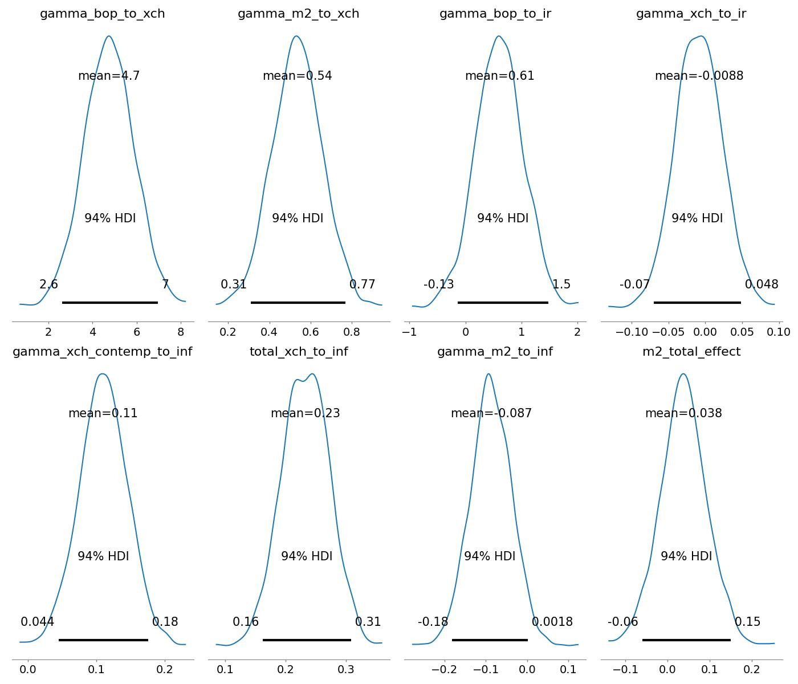
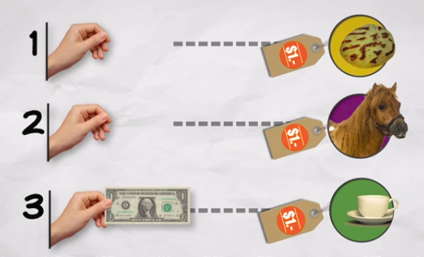
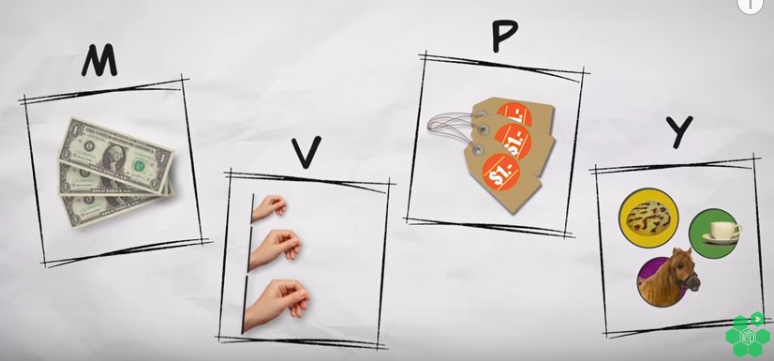
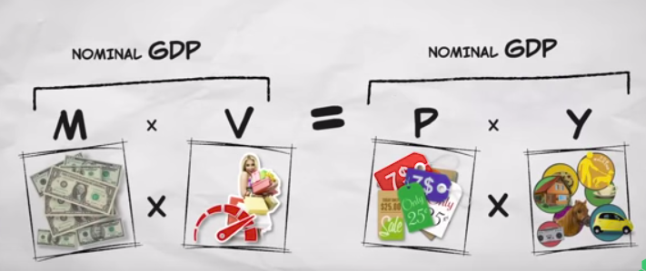

# Para, Enflasyon, Kurlar

Çok ticari açık veren, dışa bağımlı, sürekli kriz yaşayan ve
hiperenflasyon problemi yaşayan ülkelerdeki makroekonomik değişkenler
arasındaki ilişki nedir? Daha önemlisi değişkenler arasında ne tür bir
sebep - sonuç ilişkisi vardır, yani hangi parametredeki değişim bir
diğerinde değişime *sebep* olur (tam tersi doğru olmayabilir).

Klasik istatistik yöntemlerden Granger istatiği nedensellik (causal)
sorularına cevap verebilir. Çok boyutlu zaman serileri için kendisiyle
regresyon olan bir sistemi vektör otoregresyon (vector autoregression,
VAR) ile analiz edebiliriz. Fakat her iki yaklaşımda da problemi bir
şablona sokmak gerekecek.

Bayes, ve Olasılıksal Programlama teknikleri ile istediğimiz her türlü
ilişkiyi ileri yönde kodlayıp, bilinmeyen değişkenleri bulmak için
veri üzerinden simülasyon yapabiliriz. Bayes yaklaşımı bize bilinmeyen
değişkenlere, onlara özel, bir dağılım tipi atamamızı sağlar, ve önsel
dağılımlar ile parametrelerin arandığı uzayı daraltmak mümkündür.

### Seçilmiş Değişkenler ile PyMC

Para, Enflasyon, Kurlar ve Dağıtılmış Gecikmeler (Distributed Lags):
Bu modelde, makroekonomik değişkenler arasındaki gecikmeli ve dolaylı
nedensellik ilişkilerini incelemek amacıyla gecikmeli (lagged) bir
Bayes VAR (BVAR) modeli kurulmuştur [3], ve seçili değişkenler
arasındaki ilişki direk formüller ile yapılmıştır. Veriler logaritmik
farklar ($\%$), birinci derece farklar ($\Delta$) ve yüzde değişimler
üzerinden durağanlaştırılmıştır.

Denklemler

$$a_i \sim \mathcal{N}(\mu = 0, \sigma^2 = 5^2), \quad i \in \{\text{xch}, \text{ir}, \text{inf}\}$$

$$\sigma_i \sim \text{Half-Normal}(\sigma = 10), \quad i \in \{\text{xch}, \text{ir}, \text{inf}\}$$

$$\gamma_{\text{bop} \to \text{xch}} \sim \mathcal{N}(0, 2^2), \quad \gamma_{\text{m2} \to \text{xch}} \sim \mathcal{N}(0, 2^2)$$

$$\gamma_{\text{bop} \to \text{ir}} \sim \mathcal{N}(0, 2^2), \quad \gamma_{\text{xch} \to \text{ir}} \sim \mathcal{N}(0, 2^2)$$

$$\gamma_{\tt{xch\_lag} \to \text{inf}} \sim \mathcal{N}(0, 2^2), \quad \gamma_{\text{m2} \to \text{inf}} \sim \mathcal{N}(0, 2^2), \quad \gamma_{\text{ir} \to \text{inf}} \sim \mathcal{N}(0, 2^2)$$

$$\gamma_{\tt{xch\_contemp} \to \text{inf}} \sim \mathcal{N}(0, 2^2)$$

$$\beta_{\text{xch}} \sim \mathcal{N}(0, 1^2), \quad \beta_{\text{ir}} \sim \mathcal{N}(0, 1^2), \quad \beta_{\text{inf}} \sim \mathcal{N}(0, 1^2)$$

Olurluk Fonksiyonları

$$XCH_t \sim \mathcal{N}\left(a_{\text{xch}} + \gamma_{\text{bop} \to \text{xch}} BOP_{t-1} + \gamma_{\text{m2} \to \text{xch}} M2_{t-1} + \beta_{\text{xch}} XCH_{t-1}, \; \sigma^2_{\text{xch}}\right)$$

$$IR_t \sim \mathcal{N}\left(a_{\text{ir}} + \gamma_{\text{bop} \to \text{ir}} BOP_{t-1} + \gamma_{\text{xch} \to \text{ir}} XCH_{t-1} + \beta_{\text{ir}} IR_{t-1}, \; \sigma^2_{\text{ir}}\right)$$

$$\text{Inf}_t \sim \mathcal{N}\left(a_{\text{inf}} + \mathbf{\gamma_{\tt{xch\_contemp} \to \text{inf}} XCH_t} + \gamma_{\tt{xch\_lag} \to \text{inf}} XCH_{t-1} + \gamma_{\text{m2} \to \text{inf}} M2_{t-1} + \gamma_{\text{ir} \to \text{inf}} IR_{t-1} + \beta_{\text{inf}} \text{Inf}_{t-1}, \; \sigma^2_{\text{inf}}\right)$$

Kümülatif ve Dolaylı Etkiler


$$\Gamma_{\text{xch} \to \text{inf}} = \gamma_{\tt{xch\_contemp} \to \text{inf}} + \gamma_{\tt{xch\_lag} \to \text{inf}}$$

$$\tt{m2\_indirect\_effect} = \gamma_{\text{m2} \to \text{xch}} \times \Gamma_{\text{xch} \to \text{inf}}$$

$$\tt{m2\_total\_effect} = \tt{m2\_indirect\_effect} + \gamma_{\text{m2} \to \text{inf}}$$

Birleşik Sonsal Dağılım

$$p(\mathbf{\Theta} \mid \mathbf{Y}) \propto \left[ \prod_{t=2}^{T} p(XCH_t \mid \mathbf{Y}_{t-1}, \mathbf{\Theta}) \cdot p(IR_t \mid \mathbf{Y}_{t-1}, \mathbf{\Theta}) \cdot p(\text{Inf}_t \mid XCH_t, \mathbf{Y}_{t-1}, \mathbf{\Theta}) \right] \cdot p(a) \, p(\gamma) \, p(\beta) \, p(\sigma)$$


Not: DAG yapısı gereği her bir yapısal denklem kendi koşullu
ebeveynleri verildiğinde bağımsız hata terimlerine ($\epsilon_{i,t}$)
sahip olduğundan, birleşik olurluk fonksiyonu tek değişkenli Normal
olurlukların çarpımı şeklinde ayrışır.


```python
import pandas as pd
import pymc as pm
import arviz as az

df_clean = pd.read_csv('arg_quarterly_final.csv', index_col=0, parse_dates=True)

# Lags alignment (1-lag for quarterly structural dynamics)
max_lag = 1
N = len(df_clean) - max_lag

# Dependent variables at time t (t = max_lag .. T-1)
xch_t = df_clean['xch_diff'].values[max_lag:]
ir_t  = df_clean['ir_diff'].values[max_lag:]
inf_t = df_clean['inf_diff'].values[max_lag:]

# Contemporaneous exchange rate at time t
xch_contemp = df_clean['xch_diff'].values[max_lag:]

# Lags at time t-1
m2_lag1  = df_clean['m2_diff'].shift(1).values[max_lag:]
bop_lag1 = df_clean['bop_diff'].shift(1).values[max_lag:]
xch_lag1 = df_clean['xch_diff'].shift(1).values[max_lag:]
inf_lag1 = df_clean['inf_diff'].shift(1).values[max_lag:]
ir_lag1  = df_clean['ir_diff'].shift(1).values[max_lag:]

with pm.Model() as model:
    
    # Intercepts & Standard Deviations
    a_xch = pm.Normal("a_xch", mu=0, sigma=5)
    a_ir  = pm.Normal("a_ir",  mu=0, sigma=5)
    a_inf = pm.Normal("a_inf", mu=0, sigma=5)
    
    sigma_xch = pm.HalfNormal("sigma_xch", sigma=10)
    sigma_ir  = pm.HalfNormal("sigma_ir",  sigma=10)
    sigma_inf = pm.HalfNormal("sigma_inf", sigma=10)
    
    # Coefficients: Exchange Rate Equation
    gamma_bop_to_xch = pm.Normal("gamma_bop_to_xch", mu=0, sigma=2)
    gamma_m2_to_xch  = pm.Normal("gamma_m2_to_xch",  mu=0, sigma=2)
    beta_xch         = pm.Normal("beta_xch",         mu=0, sigma=1)
    
    # Coefficients: Interest Rate Equation
    gamma_bop_to_ir  = pm.Normal("gamma_bop_to_ir", mu=0, sigma=2)
    gamma_xch_to_ir  = pm.Normal("gamma_xch_to_ir", mu=0, sigma=2)
    beta_ir          = pm.Normal("beta_ir",         mu=0, sigma=1)

    # Coefficients: Inflation Equation (Contemporaneous xch_t + Lagged dynamics)
    gamma_xch_contemp_to_inf = pm.Normal("gamma_xch_contemp_to_inf", mu=0, sigma=2)
    gamma_xch_lag_to_inf     = pm.Normal("gamma_xch_lag_to_inf",     mu=0, sigma=2)
    gamma_m2_to_inf          = pm.Normal("gamma_m2_to_inf",          mu=0, sigma=2)
    gamma_ir_to_inf          = pm.Normal("gamma_ir_to_inf",          mu=0, sigma=2)
    beta_inf                 = pm.Normal("beta_inf",                 mu=0, sigma=1)

    # Equations
    mu_xch = a_xch + gamma_bop_to_xch * bop_lag1 + gamma_m2_to_xch * m2_lag1 + beta_xch * xch_lag1
    obs_xch = pm.Normal("obs_xch", mu=mu_xch, sigma=sigma_xch, observed=xch_t)
    
    mu_ir = a_ir + gamma_bop_to_ir * bop_lag1 + gamma_xch_to_ir * xch_lag1 + beta_ir * ir_lag1
    obs_ir = pm.Normal("obs_ir", mu=mu_ir, sigma=sigma_ir, observed=ir_t)
    
    # INF equation uses CONTEMPORANEOUS xch_t + Lagged XCH
    mu_inf = (a_inf 
              + gamma_xch_contemp_to_inf * xch_contemp 
              + gamma_xch_lag_to_inf * xch_lag1 
              + gamma_m2_to_inf * m2_lag1 
              + gamma_ir_to_inf * ir_lag1 
              + beta_inf * inf_lag1)
    obs_inf = pm.Normal("obs_inf", mu=mu_inf, sigma=sigma_inf, observed=inf_t)
    
    # Aggregated Deterministics
    total_xch_to_inf   = pm.Deterministic("total_xch_to_inf", gamma_xch_contemp_to_inf + gamma_xch_lag_to_inf)
    m2_indirect_effect = pm.Deterministic("m2_indirect_effect", gamma_m2_to_xch * total_xch_to_inf)
    m2_total_effect    = pm.Deterministic("m2_total_effect", m2_indirect_effect + gamma_m2_to_inf)

    # Sampling
    trace = pm.sample(
        draws=1000, 
        tune=1000, 
        chains=2, 
        target_accept=0.9,
        return_inferencedata=True, 
        progressbar=False
    )

az.plot_posterior(
    trace, 
    var_names=[
        "gamma_bop_to_xch",
        "gamma_m2_to_xch",
        "gamma_bop_to_ir",
        "gamma_xch_to_ir",
        "gamma_xch_contemp_to_inf",
        "total_xch_to_inf",
        "gamma_m2_to_inf",
        "m2_total_effect"
    ],
    figsize=(14, 12)
)
plt.tight_layout()
plt.savefig('dag_results.jpg')
```



### BVAR

Degiskenlerin kendisi ve digerleri arasindaki istenen oranda geriye
dogru bakan bir analizi eger genel bir sekilde (her degiskenin her
diger degisken ile) yaklasmak istesek bunu klasik BVAR yaklasimi ile
yapabilirdik [6]. 

```python
import pandas as pd
import lesage
df = pd.read_csv('arg_quarterly_final.csv', index_col=0, parse_dates=True)
var_names = ['xch_diff', 'ir_diff', 'inf_diff', 'm2_diff', 'bop_diff']
df_macro = df[var_names].dropna()
y = df_macro.values
nlag = 2
tight = 0.3     # Overall tightness
weight = 0.5    # Cross-variable tightness
decay = 1.0     # Lag decay

results = lesage.bvar(y, nlag=nlag, tight=tight, weight=weight, decay=decay, vnames=var_names)
lesage.write_results(results,"bvar1.txt")
```

Sonuçlar `bvar1.txt` içinde.

### Paranın Miktar Teorisi (Quantity Theory of Money) 

Bir liranın günlük hayat içinde dolaşımını düşünelim. Ben gidiyorum mesela
köşe başındaki satıcıdan bir poğaça alıyorum. Bu satıcı lirayı kızına
veriyor, kızı da onu lunaparkta ata binmek için kullanıyor. Atı kiralayan
Ali lirayı eve götürüyor, bir süre koltuk altında kaybediyor, tekrar
buluyor, sonra onu kahve almak için kullanıyor. Bütün bir sene içinde bu
lira üç kere harcanmış oluyor.



PMT'yi anlamak için bu kavramlar yeterli aslında. 1 lira para, $M$ ile
gösteriyoruz, o paranın bir senede kaç kere kullanıldığı para hızı, onu $V$
ile gösteriyoruz ki üstteki örnekte $V=3$. Poğaça, ata binmek, kahve
ekonomideki gerçek ürünler ve servisler, onlara $Y$ diyelim, ve ürün /
servislerin fiyatı ise $P$ oluyor. PMT için gerekli değişkenler bunlar. 



Tüm ekonomi bazında düşünürsek, $M$ para arzı (money supply) yani
ekonomideki tüm para miktarı. $V$ ürün ve servis almak için bir liranın kaç
kez kullanıldığı; bazıları parayı yastığın altına koyar onların parası
"yavaştır'', kimisi habire alışveriştedir, onların parası hızlıdır. Hız
tüm paraların hız averajı üzerinden hesaplanıyor tabii. $P$ tüm ürün ve
servislerin (yine ortalama) fiyat seviyesi. Son olarak $Y$, ekonomide
satılan tüm ürün ve servislerin miktarı, yani Gayrisafi Yurtiçi Hasıla,
GSYH (İngilizce GDP). Onun fiyat seviyesi ile çarpılmış hali Reel GSYH
(Nominal GDP), bu ekonominin ürettiği ürünlerin tüm lira bazında
toplamı. Formülün bir tarafı bu.

Formülün diğer tarafı $M$ çarpı $V$; ekonomideki tüm para miktarını o
paranın ekonomi içinde senede kaç kez döndüğü ile çarparsak bu bize, aynı
şekilde, reel GSYH'yı vermez mi? Para senede kaç kez bir ürün için birisine
verilmiş ise, bu ekonomide o kadar satış yapılmış demektir. Böylece
formülün iki tarafını elde etmiş olduk.



Bu formüle bir teori bile denemez, gayet bariz bir eşitlik
(identity). Formüle bir diğer bakış açısı şöyle, eldeki tüm para çarpı o
paranın kaç kez harcandığı ekonomideki tüm alıcıların yaptıklarını kapsar,
satılan her şey çarpı o şeylerin fiyatı ekonomideki tüm satıcıların
yaptıklarını kapsar. Satılan her şey tanım itibariyle alınmış olduğuna göre

$$ 
M \cdot V = P \cdot Y 
\tag{1}
$$

doğru olmalıdır. Tabii üstteki formüldeki değişkenlerin nasıl ölçülmesi
gerektiğiyle ilgili tartışmalar var, burada farklı yaklaşımlar
olabilir. Mesela kredi kartları para olarak $M$ içinde sayılsın mı
sayılmasın mı?

Bu tür farklılıklar bir tarafa, üstteki formül bir eşitlik olarak, ekonomi
hakkındaki fikirlerimizi organize etmesi açısından çok faydalı. Mesela
enflasyon ($P$'nin yükselmesi) sebebi nedir sorusunu formül üzerinden
cevaplayabiliriz.

Enflasyon

PMT formülünde iki tarafı $M$'ye bölelim,

$$ \frac{MV}{Y} = P$$

Bu denklem bize diyor ki eğer fiyatlar değişiyorsa bunun üç farklı sebebi
olabilir. $M$ değişiyor, $V$ değişiyor, ya da $Y$ değişiyor. Unutmayalım
fiyatlar yani $P$ (efendim domates ne kadar, pantolon, manto, ekmek
fiyatları vs) kısa sürede oldukca hızlı değisebilir, mesela bir sene içinde
fiyatların ikiye, üçe katlandığı görülmüştür. Fakat genel ekonomik
açısından biz biliyoruz ki $V,Y$ oldukca sabittir. $Y$, yani GSYH, bir sene
içinde çok, çok fazla değişmez. Bir sene içinde yüzde 10'lük çıkış muazzam
bir büyüme kabul edilir, nadir meydana gelir, ama ikiye, üçe katlanma
neredeyse hiç olmaz. Fiyatlardaki aşırı değişimi ekonomideki aşırı büyüme
ile açıklayamayız [2].

Peki paranın dolanım hızı $V$? Bu değişken 1 liranın bir sene içinde
ekonomide ortalama kaç alım yaptığını gösterir, ABD ekonomisinde bu sayı
aşağı yukarı 7 seviyesindedir. Hızı belirleyen maaşların ne sıklıkla
ödendiği, haftalık mı, aylık mı mesela, ya da bir borç senetinin, çekin
tahsil edilmesinin ne kadar zaman aldığı (ülkenin banka yapısı, bürokrasisi
ile alakalı) gibi faktörlerdir. Bunlar da yavaş değisen faktörler, bu
sebeple hız $V$ artabilir, ya da azalabilir, ama bu ABD örneğinde 8
seviyesine çıkış ya da 6 seviyesine iniş ölçüsünde olur. O zaman $P$'deki
çok büyük değişimi $V$ ile de açıklayamayız. 

Geriye ne kaldı? $M$ kaldı. Yani fiyatlardaki çıkış para arzındaki çıkışla
alakalıdır. Eğer bir ekonomide aynı miktardaki ürün ve servisin peşinde
olan para seviyesi artarsa, fiyatların yukarı çıkması gerekir. Herkesin
cebinde 100 lira olabilir, ve kahve 1 lira, sinema fiyatı 3 lira olabilir,
ama herkesin cebindeki para ikiye katlansa, ama daha fazla kahve daha fazla
sinema salonu açılmasa, kahve 2 lira, sinema 6 lira olacaktır. 

Devletler Niye Enflasyon Yaratır

Enflasyon para arzının artmasıyla ortaya çıkar, ve aslında bir tür
vergidir, çünkü zenginliği bir anlamda halktan devlete aktarır çünkü devlet
para basıp bu parayı, yeni arzı piyasada mal almak için kullanıyorsa devlet
istediğini alır, ama uzun vadede herkesin cebindeki paranın değeri düşer,
yani para basamayan halk kaybetmiş olur. Bu tür "enflasyonist verginin''
aslında pek iyi işleyen bir yöntem olduğu söylenemez, o sebeple devletler
bu yöntemi ellerinde başka bir çare kalmadığında kullanırlar [4].

Ama yöntemin uzun vadedeki negatif tarafından önce kısa vadede olana
yakından bakalım. Aslında kısa vadede artan para arzı üretim $Y$'de artmaya
sebep olabilir. Ufak bir ekonomi düşünelim, fırıncı, terzi, ve marangoz
olsun. Diyelim devlet vergiden alacağı parayı kullanmak yerine, yeni para
basıyor ve bu parayı askerlere maaş olarak veriyor. Askerler alışverişe
çıktıklarında, giysi, ekmek ve aldıklarında ilk başta mesela fırıncı çok
mutlu olur, ekmeğini satacak yeni talep ortaya çıkmıştır. Fırıncı yeni
talebi karşılamak için daha uzun saatler çalışır, daha fazla eleman ise
alır, talep artınca fiyatları da arttırabilir. Fırıncı "oh ne güzel, artan
ekmek fiyatları ve satışı sayesinde kazandığım ek para ile daha fazla giysi
ve sandalye alabilirim''. Fakat askerler marangozdan, ve terziden de aynı
alışveriş yapmaktadırlar, onların da fiyatları artmaktadır. Fırıncı yeni
parasıyla pantolon almak için terziye gittiğinde neredeyse kazandığı ek
para kadar fiyatların artmış olduğunu görür, yani alım gücü aynı
kalmıştır. Parasının değeri düşmüştür.

Fakat devletin işi de bozulacaktır, çünkü onlar için de fiyatlar artmıştır,
para basıp aynı malları aldırmak istediğinde yeni fiyatlarla aynı alım için
daha fazla para basmak zorundadır. Basarsa bu hikaye aynı şekilde devam
eder, para değerini kaybetmeyi sürdürür, ayrıca bir süre sonra esnaf
uyanır, fiyat artışını öngörmeye başlarlar / olacağını bilirler, ve artık
"yeni talebi'' tatmin etmek için daha fazla üretmezler.

Kısa ve uzun vade ile kasettiğimiz budur. Para arzını arttırmak başta
üretimi arttırabilir, ama devletler bu numarayı istismar edebilirler,
mesela Zimbabve'de seçim kazanmak için Mugabe'nin yaptığı gibi, ve sonuçlar
her zaman kötü biter. Çünkü kısa vadede üretim artışı ardından esas artış
fiyatlara yansır ve üretim aynı seviyeye düşer, diğer yandan eğer devlet
enflasyonu çok yukarıdan azaltmak istiyorsa para arzında daralma yaratması
gerekince ilk başta üretimde düşüş olacaktır, ki bu ekonomik durulma, hatta
kriz demektir, ta ki arzdaki daralma fiyatlara yansıyıncaya kadar. Yani
enflasyonist numara başta işe biraz yarayabilir, ardından işe yaramamaya
başlar, ve kriz kaçınilmaz hale gelir. Bu noktada enflasyonun azalması
ekonomide yavaşlama, işsizlik artışına sebep olur. 

Bu sebeple bazıları enflasyonu bir uyuşturucuya benzetir. İlk başta
"uçurabilir'' ama bünye alıştıkça aynı uçuşu sağlamak için daha ve daha
fazla ilaç gerekir, öyle ki bir süre sonra kişi normal olmak için bile
ilaca ihtiyaç duyar, ve ardından ilaç kullanımı durdurulunca bir süre
"yokluk krizi (withdrawal)'' ile hasta şok yaşar, ardından acılı bir süreç
sonrası normale dönülür. ABD'de 70'li yıllarda olan buydu, 70'ler boyunca
enflasyon arttı, arttı, ama 70'ler sonunda artık işe yaramıyordu, işsizlik
düşmüyordu. Bu noktada stagflasyon denen şey ortaya çıktı yani hem
enflasyon hem işsizliğin aynı anda olduğu durum. 80'lı yıllar başında
Reagan başkan olunca enflasyon düştü, ama bunun bedeli 81/82 yıllarındaki
kriz oldu.

Para Nedir 

Biraz önce devletin "para bastığından'' bahsettik, para basılıp askerlere
veriliyordu. Fakat [3]'e göre para arzının esas odağı aslında bankaların
işyerlerine ve bazen özel kişilere verdiği *kredidir* çünkü banka borç
verirken para basar. 

Pek çok kişi bu bilgiden habersizdir. Bir şirket bankaya gidip borç
istediğinde, borç verilirse banka hiç yoktan para yaratmaktadır, ve bu
"yeni parayı'' borç isteyene vermektedir. Bu tabii ki para arzında
genişlemeye sebep olacaktır, ve (1) denklemi üzerinden ekonomi
etkilenir. Bu sebeple arz hakkında her türlü hesap ekonomideki borç
miktarını göz önüne almak zorundadır [3]. 2008 krizine kadar pek çok
kişinin bilmediği bu durum yakın zamanda İngiliz ve Alman Merkez Bankaları
tarafından kabul edildi. Evet bankalar hiç yoktan para yaratıyorlar. Yani
bankaların "özel kişilerin mevduatını borç olarak verdiği'' doğru
değildir. Bankaların borç vermek mevduata ihtiyacı yoktur, parayı basar ve
verir [5].

[devam edecek]

Kodlar

[data.py](data.py), [lesage.py](lesage.py)

Kaynaklar

[1] Marginal Revolution University, *Quantity Theory of Money*, 
    [https://youtu.be/q59tZKP0HME](https://youtu.be/q59tZKP0HME)

[2] Marginal Revolution University, *Causes of Inflation*, 
    [https://youtu.be/gi7jx5IJtik](https://youtu.be/gi7jx5IJtik)

[3] Koop, G., & Korobilis, D. (2010). *Bayesian Multivariate Time
    Series Methods for Empirical Macroeconomics*

[4] Marginal Revolution University, *Why Governments Create Inflation*, 
    [https://youtu.be/E6A_WpUY2LI](https://youtu.be/E6A_WpUY2LI)

[5] *Money as Debt*, 
    [https://www.youtube.com/watch?v=2nBPN-MKefA](https://www.youtube.com/watch?v=2nBPN-MKefA)

[6] LeSage, *Econometrics Using Matlab*

