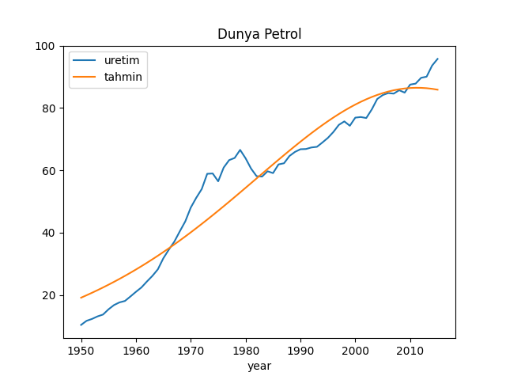

# Gayri Lineer Regresyon, Petrol Tepe Noktası (Peak Oil)

Hubbard adında bir jeolog ülkesi Amerika'da petrol üretiminin 1970 senesi
civarında tepe noktası yapacağını tahmin etmişti. Bu tahmin için kullandığı
formül altta,

$$ 
c = \frac{ 2c_m}{1 + \cosh |b_c(t-t_{mc})|   }
$$

Formül bir S şeklini modellemektedir ve S'in tepe noktası bizim için ilginç
noktadır, çünkü üretimin tepe yaptığı seneyi gösterir. Hubbard'ın böyle bir
formülü kullanmasının sebebi onun petrol üretimini önce azar azar
ilerleyen, sonra kolay kaynakları keşfedip onları ardı ardına işleyerek
fırlama gösteren, ama sonra kolay kaynakların tükenmesi sonucunda zor
olanlara başvurmaya başlayıp "artışın azalarak'' nihai bir tepe noktasına
ulaştıktan sonra inişe geçen bir trend olarak görmesiydi.

Hubbard bu analizi 1966 yılında yapmıştı. Bakalım biz de aynı sonuca
ulaşabilecek miyiz? Biz hatta veride 1960 sonrasını kesip atalım, ve
geleceği "bilmiyormuş gibi'' yapıp onu tahmin etmeye uğraşalım. Önce tüm
verinin bir grafiği,

```python
import pandas as pd
us = pd.read_csv('us.csv',sep='\\s',engine='python')
us1960 = us[(us['year'] < 1960)]
us.set_index('year')['uretim'].plot(title='Amerika Petrol')
plt.savefig('tser_peak_01.png')
```


Veriyi modele uydurmak için olduğu lineer regresyon kullanmamız lazım. Bunun
için pek çok değişik yazılım var, mesela `scipy.optimize` altında bazı
seçenekler, `fmın` bunlardan biri, ya da `lmfit` adlı paket
kullanılabilir. Biz `lmfit` kullanacağız çünkü uydurduğu modeldeki
parametreler için bir güven aralığı (confidence interval) geri döndürüyor.

```python
import pandas as pd
import scipy.linalg as lin
import lmfit

us = pd.read_csv('us.csv',sep='\\s',engine='python')
us1960 = us[(us['year'] < 1960)]
us.set_index('year')['uretim'].plot(title='Amerika Petrol')
plt.savefig('tser_peak_01.png')

def find_peak(df,cminit,bcinit,tmcinit):
    minyear = df['year'].min()
    df['year'] = df['year'] - minyear

    def err(params):
        cm = params['cm'].value
        bc = params['bc'].value
        tmc = params['tmc'].value
        tmp = (1.+np.cosh(bc*(df['year']-tmc)))
        yfit = 2.0 * cm /  tmp
        return df['uretim']-yfit

    p = lmfit.Parameters()
    p.add_many(('cm', cminit), ('bc', bcinit),('tmc', tmcinit))

    mini = lmfit.Minimizer(err, p) #

    result = mini.minimize() #

    lmfit.printfuncs.report_fit(result.params)
    print (result.params['tmc'].value + minyear)
    return mini, result 
```

```python
mini_us, resus = find_peak(us1960.copy(),2000000,0,1000)
```

```text
[[Variables]]
    cm:   2818280.59 +/- 134112.921 (4.76%) (init = 2000000)
    bc:   0.06663756 +/- 0.00264901 (3.98%) (init = 0)
    tmc:  66.8999510 +/- 2.14213696 (3.20%) (init = 1000)
[[Correlations]] (unreported correlations are < 0.100)
    C(cm, tmc) = +0.9581
    C(bc, tmc) = -0.9389
    C(cm, bc)  = -0.8252
1966.899950980365
```

Tahmin kabaca 1967 yılı -/+ 2 sene olarak yapıldı yani bir uçta 1969
senesini veriyor, gerçek tepe noktası 1970 yılında meydana geldi.  Fena
değil.

Dünya Üretimi

Şimdi ilginç bir örnek: Dünya için tepe noktası nedir, yani dünya üretiminde
tepe hangi senede bulunacaktır?

```python
import pandas as pd
import lmfit
world = pd.read_csv('world.csv',sep='\\s',comment='#',engine='python')
mini_w, resw = find_peak(world.copy(),80,3,50)
```

```text
[[Variables]]
    cm:   86.4960122 +/- 2.07863045 (2.40%) (init = 80)
    bc:  -0.04525854 +/- 0.00284705 (6.29%) (init = 3)
    tmc:  61.2631753 +/- 2.76583534 (4.51%) (init = 50)
[[Correlations]] (unreported correlations are < 0.100)
    C(bc, tmc) = +0.9049
    C(cm, tmc) = +0.6934
    C(cm, bc)  = +0.4409
2011.2631753248918
```

Sonuç 2011 yılı -/+ 3 sene, yani bir uçta 2014 senesi! Geçtiğimiz sene
tepe noktasını bulmuşuz demektir bu.

```python
cm=resw.params['cm'].value
bc=resw.params['bc'].value
tmc=resw.params['tmc'].value
def hubbard(x): return 2*cm / (1+np.cosh(bc*(x-tmc)))
wmin = world['year'].min()

world['tahmin'] = world.apply(lambda x: hubbard(x['year']-wmin),axis=1)
world.set_index('year').plot(title='Dunya Petrol')
plt.savefig('tser_peak_02.png')
```



Bu noktada son 10 senedeki ilginç bir gelişmeden bahsetmek lazım. Hem ABD
hem de dünya üretiminde ilginç bir zıplama oldu, çünkü ABD'de tazyikli su
kullanarak (fracking) petrol çıkartan bir teknik kullanılmaya
başlandı. Soru şu: Bu teknik ve üretimde zıplama acaba modelin ana
varsayımında değişikliğe sebep verir mi? Teknik çok etkili ama acaba
petrolün bulunmasının zorlaşması ile mi alakalı, ki çevreye kötü etkileri
olduğu da biliniyor ve politikacılara baskı ile belki bitirilir, yoksa
kalıcı bir şey ve öyle bir artışa sebep olacak ki şimdiye kadar olan petrol
üretimini bile yarıyolda bırakacak bir başlangıç noktasındayız...?  Eğer
1. durum doğru ise, iniş başlayacaktır, ve azalan petrol paylaşımı
etrafında çatışmalar daha hızlanacaktır. Belki de son zamanlarda bunun
etkilerini görüyoruz!

Not: Optimizasyon rutinleri için, özellikle `lmfit` gibi lineer
optimizasyon yapabilen rutinler için, farklı başlangıç değerleri farklı
sonuçların oluşmasına sebep olabilir. Bu sebeple stabil optimum noktasını
bulmak için birkaç farklı noktadan başlangıç yapmak gerekebilir.

Kaynaklar

[1] Wikipedia, *Hubbert curve*, [http://en.wikipedia.org/wiki/Hubbert_curve](http://en.wikipedia.org/wiki/Hubbert_curve)

[2] YCharts, *Brent Crude Oil Spot Price*, [http://ycharts.com/indicators/brent_crude_oil_spot_price](http://ycharts.com/indicators/brent_crude_oil_spot_price)

[3] Newville, *Non-Linear Least Squares Minimization*, [http://github.com/lmfit/lmfit-py](http://github.com/lmfit/lmfit-py)


