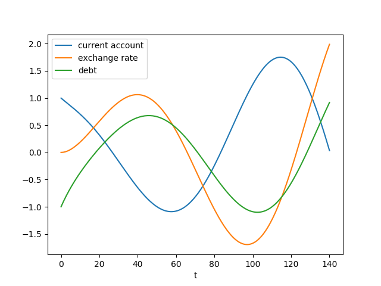

Model 2


```python
from scipy.integrate import odeint
import pandas as pd

phi1 = 0.03
phi2 = 0.06
gamma = 0.05
xi = 0.1

def dmod2(y, t):
    z, q, d = y
    zdot = -(phi1*z)-(phi2*q)
    return [zdot, \
            xi*(z+d), \
	    -zdot - gamma*d   ]

t = np.linspace(0, 140, 200)
y0 = [1.0, 0.0, -1]
sol = odeint(dmod2, y0, t)
df = pd.DataFrame( sol )
df.columns = ['current account','exchange rate','debt']
df['t'] = t
df = df.set_index('t')
df.plot()
plt.savefig('mod2.png')
```




