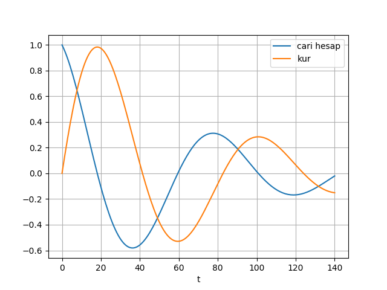
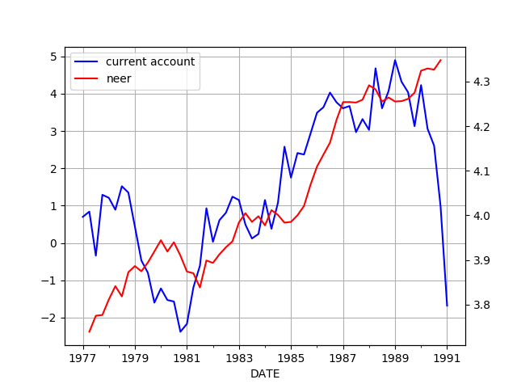
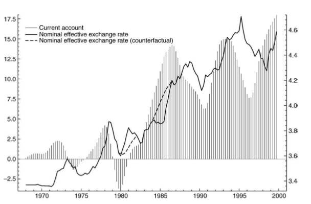
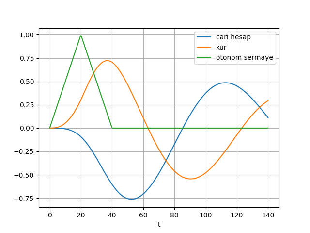
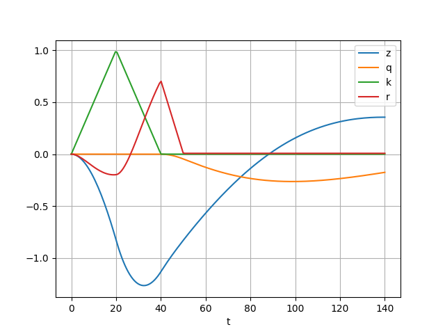

# Döviz Fiyatları, Kur Krizleri, Rezervler, Ödeme Dengesi

Temel alacağımız araştırma [1] kur fiyatlarının belirlenmesinde iki faktör
olduğunu öne sürüyor. Birincisi basit bir önerme, kur piyasalarında belli
döviz çeşitlerine olan talep, o paranın arzı o paranın fiyatını
belirler. Fakat bu alanda çoğunlukla kullanılan akış modeli uzun vadeli
dinamik perspektifi gözönüne almadığı için hep doğru sonuçlara varamaz,
ayrıca bu modeller cari işlemler hesabı (current account), finans hesabı,
ve uluslararası ödemelere de yakından bakmaz. Fakat biliyoruz ki
uluslararası ödeme akışlarının kurlar üzerindeki etkisi var, birazdan
sunacağımız modelde bunun uzun vadeli olarak nasıl ortaya çıkarılacağını
göreceğiz. 

İkinci faraziye uluslararası döviz işlemlerinin ödemeler dengesi
işlemleriyle yakından alakalı olduğu. Ödemeler dengesi tabii ki bir
değişmez eşitlik, girenler, çıkanlar var, ve toplam hep sıfır olmalı. Biz
bu eşitliğin öğelerinin para akışlarına ve kur fiyatlarına etkisine
yakından bakacağız.

4 tane farklı model gösterilecek. 1'inci model dışa kapalı bir ekonomi, ki
bu ekonomideki cari işlemler hesabındaki işlemler, mesela ihracat ve
ithalat direk nakit ile ödeniyor. Bu ve takip eden tüm modellerde cari
ödeme dengesi ülkenin parasına ve ona kıyasla diğer dövizlere olan bir
talep yaratıyor ve bu fiyatı belirliyor, ayrıca ülkenin reel kuru da cari
işlem hesabı da kurdaki değişimlere göre kendini ayarlıyor. Yani birbirini
ardı ardına etkileyen, dinamik bir durum var ortada. Göstereceğiz ki bu
gayet gerçekçi iki faraziye ile başlangıçtaki cari işlem dengesizliklerinin
uzun vadeli kur yalpalanmalarını görmek mümkün. 

2'inci modelde cari işlem dengesizlikleri borç ile telafi ediliyor, bu
gerçek dünyada olan duruma oldukca yakın. Borç faktörünün denkleme girmesi
ödemeler akışında bir zamansal gecikme ortaya çıkartır, ve bunun sonucu cari
işlemler hesabının kur üzerindeki etkisinin daha zamana yayılmasıdır. Hala
cari işlemler ile kur dolamlı olarak birbirlerini etkilerler, sadece bu iki
değişken arasındaki etki zamanı daha artar. Bu modelin Japonya örneğini çok
iyi açıkladığını göreceğiz. 

3'üncü model ülkeye geçici, otonom şekilde (borç amaçlı değil, bağımsız
farklı sebeplerle, mesela yatırım) giren sermaye akışlarının etkisine
bakacak. Makul bazı faraziyeler sonrasında bu tür girişin ülke kuru
üzerinde cari işlemlerde bozulma olsa bile geçici bir değerlenme
yarattığını göreceğiz. Bu model ABD'nin erken 80'li ve geç 90'li yıllardaki
tecrübesini simüle edecek. Her iki durumda da ülkeye kuvvetli para girişi
vardı, ve ABD doları cari işlemdeki müthiş artmakta olan açıklara rağmen
değer kazanıyordu. 

Aynı tema ama biraz farklı bir açıdan, 4'üncü modelde, sabit kura sahip
olan bir ülkeye bakıyoruz. Bu modelde geçici yabancı sermayesinin nasıl
cari işlemlerde bozulmalar yaratabileceğini görüyoruz, bu yabancıların
alacaklarını arttırır, ve rezervlerin tükenerek nihai olarak kurun
çakılması sonucunu getirir. Bu dinamik kalıp son derece basit
varsayımlardan yola çıkarak oluşturulabiliyor, ayrıca bu dünyada görülen
pek çok döviz krizlerinden bilinen anektodsal tecrübe ile de
uyuşuyor. Gerçek veri bağlamında bu model için 1997-98 Güney Kore örneğine
bakacağız.

Tüm modellerde enflasyon farkı yok kabul edilecek, çünkü bozuk bazı
örnekler hariç pek çok ülkede enflasyon ile savaş düşük enflasyon
seviyelerini ortaya çıkarttı. 

Bazı terimler,

$z(t)$: Cari işlem hesabı (current account)

$q(t)$: Reel kur (real exchange rate)

$k(t)$: Otonom sermaye akışı (autonomous capital flows)

$r(t)$: Yabancı döviz rezervlerinin $t$ anındaki satış miktarı (official sales of foreign reserves)

$d(t)$: Borç için giriş yapan sermaye, normal şartlarda cari işlemler
dengesizlikleri bu giriş ile finans ediliyor

$c(t)$: Uluslararası ödeme girişleri (ınternational payment flows)

İlk denklem kur ile uluslararası ödeme girişleri arasında bir ilişki
kurar. 

$$
\dot{q} \approx -\xi c(t)
\qquad (5)
$$

Bu denklem uluslararası nakit girişi bir ülkenin kurundaki değişimi
etkileyen faktördür diyor. Modeli geliştirmek için her ödeme dengesi
öğesinin nasıl değiştiğini, ve bu öğelerin kurdan nasıl etkilendiğine
bakacağız. 

Diğer bir açıdan reel döviz kurunun ticari dengeyi etkileyen ana faktör
olduğunu varsayacağız, bu da tabii ki cari işlem hesabı $z(t)$'yi
etkileyecek. Kuvvetli bir yerli para o ülkenin rekabet avantajını kötü
yönde etkiler, bu durum ticari dengeyi aşağı çeker. Diğer yandan zayıf para
ticari dengeyi düzeltir. 

$$
\dot{z}(t) = -\phi_1 z(t)  - \phi_2 q(t) 
\qquad (6a)
$$

Parametre $\phi_1$ cari hesabın bir denge noktasına dönüş hızını tanımlar. 

Ödemeler dengesi,

$$
z(t) + d(t) + k(t) + c(t) + r(t) = 0 
\qquad (8)
$$

ile belirtilebilir. O zaman, eğer ülkenin kendisi döviz piyasasında
müdahelede bulunmuyorsa, uluslararası ödeme akışları $c(t)$ o ülkenin cari
işlem ve finans dengesiyle tanımlıdır, 

$$
c(t) = -z(t) - k(t) - d(t)
\qquad (9)
$$

Bu denkleme $r(t)=0$ ve (8)'in tekrar düzenlemesi ile ulaşılıyor. 

Ama ülke kurundaki dalgalanmaları azaltmak isterse, o zaman sınırötesi
ödeme akışlarını telafi etmelidir, çünkü o akışlar, (5) denklemine göre
kurunu direk etkileyecektir. Bu durumda eldeki rezervden yapılacak net
satış 

$$
r(t) = -z(t) -k(t) -d(t)
\qquad (10)
$$

olur. 

Modeller

Aksi belirtilmedikçe tüm modeller alttaki sabitleri kullanır,

$$
\xi = 0.1, \phi_1 = 0.03, \phi_2 = 0.06, \phi_3 = 0.1, \gamma = 0.05
$$

Model 1

(5) ve (6a) denklemlerini baz alalım. Başlangıç şartları 

$$
q(0) = 0, z(0) = 1
$$

olsun. Bu modelde uluslararası nakit akışı ödemeler dengesi (8) üzerinden
tanımlanır, ve borç, otonom sermaye, müdahele olmadığı için
$d(t)=k(t)=r(t)=0$'dir. Geri kalan $c(t) = -z(t)$. 

```python
from scipy.integrate import odeint
import pandas as pd

phi1 = 0.03
phi2 = 0.06
gamma = 0.05
xi = 0.1

def dsys1(y, t):
    z, q = y
    return [-(phi1*z) - (phi2*q), xi*z]

t = np.linspace(0, 140, 200)
y0 = [1.0,0.0]
sol = odeint(dsys1, y0, t)
df = pd.DataFrame( sol )
df.columns = ['cari hesap','kur']
df['t'] = t
df = df.set_index('t')
df.plot(grid=True)
plt.savefig('mod1.png')
```



Almanya'nın cari hesabı ve parasına bakalım, NEER rakamları üzerinden,

```python
import pandas as pd
df = pd.read_csv('de.csv',parse_dates=True,index_col=0)
ax1 = df.BPBLTT01DEQ188S.plot(color='blue', grid=True, label='cari islem hesabi')
ax2 = df.DE.plot(color='red', grid=True, label='neer',secondary_y=True)
h1, l1 = ax1.get_legend_handles_labels()
h2, l2 = ax2.get_legend_handles_labels()
plt.legend(h1+h2, l1+l2, loc=2)
plt.savefig('neer-de.png')
```



NEER terimi nominal efektiv kur fiyatı (nominal effective exchange rate)
anlamına gelir. NEER bir ülkenin parasının diğer bazı ülkelerin
dövizlerinden oluşan bir sepete olan karşılığını ölçer. Kabaca yabancı
döviz almak için bir ülkenin parasından ne kadar gerekeceği sorusunun
cevabını verir. 

Model 2

Şimdi cari işlem hesabının bir kısmı borç ile finans edilince ne olur ona
bakalım. Bunun etkisi ödeme akışları üzerinde bir gecikmedir, çünkü cari
hesabın kur üzerindeki etkisi zamana yayılır. Cari hesap ile kur yine
dolamlı bir şekilde hareket eder, ama bu iki değişken arasındaki etkisel
zaman farkı büyür. (9) şu hale gelir ($k(t)$ hala sıfır),

$$
c(t) = -z(t) - d(t) 
$$

(5) ise şöyle olur,

$$
\dot{q} \approx -\xi c(t) = -\xi (z(t) + d(t))
$$

[1]'deki borç dinamiğini biraz değiştirmek mümkün, orada 

$$
d(t) = -(z(t) + k(t)) - \gamma D(t)
$$

kullanılmış, ki $D(t)$ $t$ anına kadar olan tüm $d(t)$ üzerinden bir
entegral, ki bu entegralin $\gamma$ kadarı $t$'de geri ödeniyor. Analitik
çözümle rahat işlediği için böyle seçilmiş, biz $t$ anına kadar olan tüm
borcu $d(t)$ ile göstereceğiz, ve azalma dinamiğini $d$ üzerinden
ekleyeceğiz. $z(t)$ ve $k(t) = 0$

$$
\dot{d} = -\dot{z}-\gamma d(t) \qquad (7)
$$

```python
from scipy.integrate import odeint
import pandas as pd

phi1 = 0.03
phi2 = 0.06
gamma = 0.1
xi = 0.04

def dsys2(y, t):
    z, q, d = y
    zdot = -(phi1*z)-(phi2*q)
    return [zdot, xi*(z+d), -zdot - gamma*d   ]

t = np.linspace(0, 140, 200)
y0 = [1.0, 0.0, -1]
sol = odeint(dsys2, y0, t)
df = pd.DataFrame( sol )
df.columns = ['cari hesap','kur','borc']
df['t'] = t
df = df.set_index('t')
df.plot(grid=True)
plt.savefig('mod2.png')
```


Üstteki grafik tezimizi doğruladı, cari hesap ile kurun dalgalanma frekansı
azaldı, ve iki değişken arasındaki makas açıldı. 

Veri Örneği; Japonya

Borç akışının Japonya'nın ekonomik performansı üzerinde bir rol oynadığı
iddia edilebilir. 1970 sonları 80 başlarına kadar borç varlıklarına olan
Japonya'dan çıkış ya da giriş akışı çok azdı. Fakat 80'lı yıllar ortasında
bu akışlar büyüdü, bu büyüme çoğunlukla Japonya'nın ABD'ye olan finansal
yatırımlarıyla açıklanabilir. Bunlar olurken cari işlem ve Japon para
birimi Yen arasında 70'lı yıllarda fazla olmayan fark 80/90'li yıllarda çok
daha arttı, ki bu durumu modelimiz gayet iyi tahmin ediyor.



Model 3

Bu modelle ülkeye otonom sermaye girişini formüllere dahil ediyoruz, yani
artık $k(t) \ne 0$ olacak. O zaman,

$$
c(t) = -z(t) - d(t) - k(t)
$$

Ve $k(t)$ sıfır olmadığı için,

$$
\dot{q} \approx -\xi c(t) = -\xi (z(t) + d(t) + k(t))
$$

Bu sermaye girişleri dışsal etkiler, sistem dinamiklerinin etkilediği
oluşlar değil, onları bir dış fonksiyon olarak tanımlıyoruz. Simülasyon
amaçlı belli zaman aralıklarında belli değerler veren bir kademeli
fonksiyon olarak bu oluşu tanımlayabiliriz, mesela,

$$
k(t) = \left\{ \begin{array}{l}
0.05 t \quad 0 \le t < 20,  \\
2 -0.05t \quad  20 \le t < 40 \\
0 \quad 40 \le t 	
\end{array} \right.
$$

Türevi de lazım olacak, 

$$
\dot{k}(t) = \left\{ \begin{array}{l}
0.05  \quad 0 \le t < 20,  \\
-0.05 \quad  20 \le t < 40 \\
0 \quad 40 \le t 	
\end{array} \right.
$$

```python
from scipy.integrate import odeint
import pandas as pd

def k(t):
    if t >= 0 and t<20.0: return 0.05*t
    if t >= 20.0 and t<40.0: return 2.0-0.05*t
    else: return 0

def dk(t):
    if t >= 0 and t<20.0: return 0.05 
    if t >= 20.0 and t<40.0: return -0.05
    else: return 0

from scipy.integrate import odeint
import pandas as pd

phi1 = 0.03
phi2 = 0.06
gamma = 0.2
xi = 0.05

def dsys3(y, t):
    z, q, d, k = y
    zdot = -(phi1*z)-(phi2*q)
    qdot = xi*(z+d+k)
    kdot = dk(t)    
    ddot = -zdot -kdot - gamma*d
    return [zdot, qdot, ddot, kdot ]

t = np.linspace(0, 140, 200)
y0 = [0.0, 0.0, 0, 0.0]
sol = odeint(dsys3, y0, t)
df = pd.DataFrame( sol )
df.columns = ['cari hesap','kur','borc','otonom sermaye']
df['t'] = t
df = df.set_index('t')
df[['cari hesap','kur','otonom sermaye']].plot(grid=True)
plt.savefig('mod3.png')
```



Sermaye girişi arttıkça yerel paraya olan talep artıyor. Bu durumda cari
hesap bozuluyor, bu tecrübeyi yaşayan pek çok ülkede olduğu gibi. Ortaya
çıkan cari işlem açığı bir süre sonra gelen otonom sermayeden daha fazla
oluyor, çünkü bağımsız sermaye geçici. Tabii ülke borç alarak açıgı
kapatabilir. Fakat açık orada durduğu sürece ve borcun geri ödenmesi
gerektiği için ülke bir süre sonra kendisini içeri aldığından daha fazla
dışarı para gönderir halde buluyor. Bu durumda değerlenmekte olan yerel
para düşmeye başlıyor. Ama cari hesapta düzelmeye dönmek için bu düşüşün
bir süre daha devam etmesi gerekiyor.

Model 4

Şimdi sabit kurlara ve bu tür kura sahip ülkelere ödemelerin nasıl girip
çıktığına bakalım, ve rezervlerin her şeyi nasıl etkilediğini
inceleyelim. Amacımız sayısal ve anektodsal delillere uyan bir döviz piyasa
krizini modellemek.

(6a)'yı değiştiriyoruz, 

$$
\dot{z}(t) = \phi_1 z(t) - \phi_2 q(t) - \phi_3 k(t)
$$

(5) ve (7) hala aynı. Sabit kur rejiminde rezerv akışı $r(t)$ yabancı ve
yerliler arasındaki ödemeleri nötralize eder. Fakat rezervler sonsuz
değildir, bu modelde belli bir seviyede olduklarını farz edeceğiz. ODE
çözerken bunu yapmak zor olabilir, bu sebeple alttaki $r$'nin türevini
temsil eden fonksiyon `drfun` içinde bunu yaptık, belli bir zaman
aralığına gelince bu türevde inişi zorlayacağız, rezerv "bitmeye''
başlayacak ve $r(t)=0$ olana kadar bu düşüş simüle edilecek. Bu
"devalüasyon'' gerçekleştikten sonra daha fazla döviz piyasa müdahelesi
olmayacak. 

Bir önceki modelde olduğu gibi ülke sıfır borçla başlıyor, geçici bağımsız
sermaye girişi yaşanıyor, bkz (13). Ayrıca uluslararası nakit akışı ve net
rezerv satırları (9) ve (10) ile kontrol edilecek.

```python
from scipy.integrate import odeint
import pandas as pd

def drfun(rr,t):
    if t <= 40: return rr
    elif t > 40 and t<50: return -0.07
    else: return 0

phi1 = 0.03
phi2 = 0.06
phi3 = 0.1
gamma = 0.1
xi = 0.05

def dsys4(y, t):
    z, q, d, k, r = y
    c = -z - d - k - r
    qdot = -0.01*c
    zdot = -phi1*z - phi2*q - phi3*k
    kdot = dk(t) 
    ddot = -zdot-kdot-gamma*d
    rdot = drfun(-zdot -ddot - kdot, t)
    return [zdot, qdot, ddot, kdot, rdot ]

ts = np.linspace(0, 140, 200)
y0 = [0.0, 0.0, 0, 0.0, 0.0]
sol = odeint(dsys4, y0, ts)
df = pd.DataFrame( sol )
df.columns = ['z','q','d','k','r']
df['t'] = ts
df = df.set_index('t')
df[['z','q','k','r']].plot(grid=True)
plt.savefig('mod4.png')
```



Sonuçlar görülüyor. Daha önceki modelde olduğu gibi otonom sermaye girişi
yurtiçi tüketimi ve yatırımı teşvik ediyor, cari hesapta bozulmaya sebep
oluyor. Bu ilk bölümde ülke rezervlerini doldurabiliyor, çünkü toplam
sermaye akışı ortaya çıkan cari işlem hesabı açıgından daha fazla. Fakat
bağımsız sermaye girişi geçici, ve yabancılar tüm açığı finanse etmek
istemiyorlar. Bir noktada ülkenin rezerv satarak kurun düşüşünü
durdurmaları gerekiyor. Fakat rezervlerin bitmesiyle ortaya çıkan sabit kur
rejiminin bitişiyle ülkenin parası düşüşe geçiyor.


Üstteki Kore örneğinde bu tür bir krizi görebiliyoruz. Pek çok gelişmekte
olan ülkede olduğu gibi Kore de ilk ve orta 90'lı yıllarda güçlü sermaye
girişi aldı. Bu girişlerin önemli bir sebebi cari hesap kontrollerinin
gevşetilmiş olmasıydı. 1996 yılına gelindiğinde Kore'nin dünya ticaretinin
yüzdesi olarak cari hesabı rekor seviyelere ulaşmıştı, ve sürdürülebilirlik
sorunu ortaya çıkmaya başladı. Her ne kadar cari açık 97'de biraz azalmış
olsa da bu Kore parası won ve komşu bazı diğer ülke paralarının düşüşünü
engelleyemedi. Halbuki Kore ülke içi yatırımlara ek olarak rezervlerini de
sağlamlaştırmıştı, böylece won'u kuvvetli tutuyorlardı. Ama sonuç olarak
cari hesap açığı ve onun etkisiyle Kore döviz kuru sürdürülemez hale
geldi. Yabancı yatırımcıların güvenlerini kaybedip paralarını çekmeleri
sadece çöküşü daha hızlandırdı.

Kaynaklar

[1] Nikolas Müller-P, *Balance of payments accounting and exchange rate dynamics*,
    [https://www.researchgate.net/publication/46490787_Balance_of_payments_accounting_and_exchange_rate_dynamics](https://www.researchgate.net/publication/46490787_Balance_of_payments_accounting_and_exchange_rate_dynamics)


