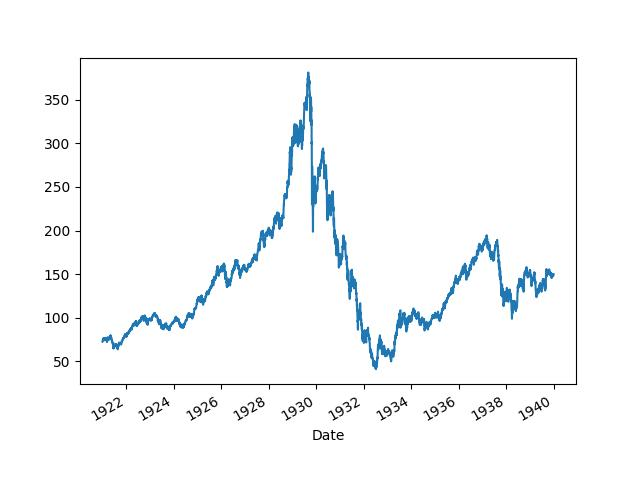

# Balonlar Ne Zaman Patlar?

Ekonomik krizlerin finans bağlamında kriz öncesi piyasalarda balon
oluşturduğu iddia edilir; mesela ABD'nin 1929, 1987 krizleri, borsalardaki
aşırı çıkışlar ardından düşüş ile başlamıştır, en son 2008 krizi öncesi
emlak piyasasında balon oluşmuştur. Aynı dinamik tek bir sektör endeksi, ya
da tek senet bazında da görülebilmektedir. Demek ki bu tür dinamiği
anlayabilmek, tanıyabilmek, hatta nihai gidişatını tahmin edebilmek
yatırımcı için değerli bir yetenek olabilir.

Bu alanda Didier Sornette'in araştırmaları var [1,2], ona göre balonlar
fiyat zaman serisindeki artışın üstel artışı (exponential increase) bile
geçip süper üstel artış haline gelmesi durumudur. Bu gidişat borsacıların,
finansçılar, finans merkezlerinin birbiri ile çok yönlü etkileşimi
sonucunda oluşur, ve nihai bir patlama noktası vardır. Sornette modeline
deprem tahmin etme amacı ile başlamıştır, ardından aynı yaklaşımı finans
balonlarına da uygulayabileceğini farketmiştir. 

Model alttaki formüldür:

$$ \ln(p(t)) = A + B(t_c - t)^\beta 
\big[ 1 + C \cos (\omega \ln(t_c-t) + \phi )  \big] 
\qquad (1)
$$

Türetilmesiyle ilgili detaylar ve referanslar yazının sonunda
bulunabilir.  Bazı teknik detaylar: Kullanılan Log-Periodic Power Law
(LPPL) modelinin bir uygulamasıdır ve bu modelin en zorlayıcı kısmı,
yedi parametreden dördünün doğrusal, üçünün ise karmaşık bir şekilde
doğrusal olmayan parametreler olması.

SciPy ile LPPL optimizasyonunda kullanılan, iki aşamalı (two-step) en
küçük kareler yöntemini uygulayacağız. Bu yöntem, doğrusal olmayan
parametreleri ($t_c$, $\beta/m$, $\omega$) ararken, doğrusal
parametreleri ($A, B, C_1, C_2$) her iterasyonda hızlıca bulmak için
lineer cebir kullanır. Hesap üstteki formüldeki salınım terimini iki
ayrı lineer bileşene ayırır ($C \cos(\cdot) + D \sin(\cdot)$ formuna
dönüştürmek).

Formülü kullanmak için onu bilinen krizlerden önce elde olan veriye
uyduracağız. Normal şartlarda yapılacak budur, bir varlığın, endeksin
gidişatının balon olup olmadığı, eğer balon ise ne zaman patlayabileceği
merak konusudur. Örnek olarak 1929 ve 1987 krizlerini seçtik. 

Ekim 1929 krizi Amerika'da "Büyük Depresyon" adı verilen dönemin
başlangıcıydı, ve kriz öncesi Dow Jones (DJIA) endeksinde müthiş bir
artış ardından düşüş gerçekleşti.

```python
import statsmodels.tsa.stattools as st
import pandas as pd, zipfile
with zipfile.ZipFile('djia.zip', 'r') as z:
    dfj =  pd.read_csv(z.open('djia.csv'),index_col='Date',parse_dates=True)
```

```python
dfj['Adj Close'].plot()
plt.plot()
plt.savefig('tser_130_bbl_01.jpg')
```



Acaba DJİA bu evrede bir balon muydu?  Sornette'in denklemini kriz
öncesi veriye uyduralım. Sornette yöntemine göre test için tam kriz
noktasına kadar olan zaman serisi kullanılır, o zaman

```python
dfj2 = dfj[(dfj.index >= '1922-01-01')&(dfj.index <= '1929-01-01')]    
```

filtrelemesini yaparız. Geri kalanlar,


```python
import numpy as np
import pandas as pd
from scipy.optimize import least_squares
from numpy.linalg import lstsq

def lppl_basis(t, tc, m, w):
    """
    LPPL modelinin lineer bileşenlerinin (baz fonksiyonları) hesaplanması.
    
    t: zaman dizisi (t_c'den küçük olmalı)
    tc, m, w: non-lineer parametreler
    """
    # t_c - t terimi, kritik an (t_c) geçmişte ise tanımsızdır.
    # Optimizasyonun t > t_c olduğu durumlarda çalışmasını engellemek için:
    if np.any(t >= tc):
        # Bu, least_squares'ın bu bölgeyi keşfetmesini engellemek için yüksek bir maliyet/hata döndürür
        return np.inf * np.ones_like(t)

    dt = tc - t
    
    # Baz Fonksiyonları:
    # F1 = 1 (A için)
    # F2 = (tc - t)^m (B için)
    # F3 = (tc - t)^m * cos(w * ln(tc - t)) (C1 için)
    # F4 = (tc - t)^m * sin(w * ln(tc - t)) (C2 için)
    
    basis = np.array([
        np.ones_like(t),
        dt**m,
        dt**m * np.cos(w * np.log(dt)),
        dt**m * np.sin(w * np.log(dt))
    ]).T # Transpoze ile (N_data, N_linear_params) boyutunda matris
    
    return basis

def lppl_residual_scipy(nonlin_params_array, t, log_p):
    """
    SciPy'ın least_squares fonksiyonu için amaç (hata) fonksiyonu.
    Sadece non-lineer parametreleri alır, lineer parametreleri içeride çözer.
    """
    # nonlin_params_array = [tc, m, w]
    tc, m, w = nonlin_params_array
    
    # Kısıtlamalar: LPPL için t < t_c olmalı ve 0 < m < 1.0 olmalı
    if m <= 0 or m >= 1.0 or np.any(t >= tc):
        # SciPy'a bu non-lineer parametre setinin çok kötü olduğunu söyle
        return np.full_like(log_p, 1e12) # Çok büyük bir hata döndür
    
    # 1. Aşama: Baz Fonksiyonlarını Hesapla
    basis_matrix = lppl_basis(t, tc, m, w)
    
    # 2. Aşama: Lineer En Küçük Kareler (A, B, C1, C2)
    # log_p = basis_matrix @ linear_params + residuals
    # Lineer sistemi çöz: A * 1 + B * F2 + C1 * F3 + C2 * F4 = log_p
    
    # lstsq, (A, B, C1, C2) lineer parametrelerini (popt) döndürür
    linear_params, residuals, rank, s = lstsq(basis_matrix, log_p, rcond=None)
    
    # least_squares, minimize edilen bir hata dizisi ister
    # residuals[0] bize en küçük kareler toplamını verir, 
    # ancak least_squares hata Vektörünü ister (bu vektörün karesini alıp toplar)
    
    # Model çıktısını hesaplayalım
    model_log_p = basis_matrix @ linear_params
    
    # Kalan hatayı döndür (SciPy bu dizinin elemanlarının karesini alıp toplar)
    return log_p - model_log_p

def run_lppl_fit_scipy(t_data, log_p_data, x0_nonlin, bounds_nonlin):
    """
    LPPL modelini SciPy'ın least_squares ile uydurur.
    
    t_data, log_p_data: uydurulacak veri serileri
    x0_nonlin: [tc_baslangic, m_baslangic, w_baslangic]
    bounds_nonlin: ([tc_min, m_min, w_min], [tc_max, m_max, w_max])
    """
    
    # least_squares çağrısı
    # 'trf' (Trust Region Reflective) metodu, sınırları (bounds) destekler
    result = least_squares(
        fun=lppl_residual_scipy,
        x0=x0_nonlin,
        bounds=bounds_nonlin,
        args=(t_data, log_p_data), # fun'a geçilecek ek argümanlar
        method='trf',
        max_nfev=3000, # Max fonksiyon değerlendirme sayısı
        verbose=1 # Sonlandırma raporunu göster
    )
    
    print("\nOptimizasyon Sonuçları:")
    print(result.message)
    print(f"Başarılı: {result.success}")
    print(f"Maliyet (Kalanların Kareler Toplamı / 2): {result.cost:.4f}")
    
    # Sonuçların Tamamlanması: En iyi non-lineer parametrelerle lineer fit'i tekrar yap
    tc, m, w = result.x
    basis_matrix = lppl_basis(t_data, tc, m, w)
    linear_params, _, _, _ = lstsq(basis_matrix, log_p_data, rcond=None)
    A, B, C1, C2 = linear_params
    
    # Orijinal LPPL C ve phi parametrelerini geri hesapla
    C_amp = np.sqrt(C1**2 + C2**2) / np.abs(B) # C = sqrt(C1^2 + C2^2) / |B|
    phi_phase = np.arctan2(C2, C1) # phi = atan2(C2, C1)
    
    final_params = {
        'tc': tc, 'm': m, 'w': w,
        'A': A, 'B': B, 'C1': C1, 'C2': C2,
        'C_amplitude': C_amp, 'phi_phase': phi_phase
    }
    
    return final_params, result

price_data = dfj2['Adj Close'].values
log_p_data = np.log(price_data) # <--- THIS IS THE CORRECT LOG_P_DATA

# Get the time data (t_data) and normalize it
t_index = dfj2.index
t_ordinal = t_index.to_series().apply(lambda x: x.toordinal()).values
t_data = t_ordinal - t_ordinal[0] + 1
    
# --- REMOVED MOCK DATA GENERATION (The cause of the error) ---

max_t = np.max(t_data) 

# Initial guess for non-linear parameters [tc, m, w]
x0_nonlin = [max_t * 1.05, 0.5, 10.0]

# Bounds: ([tc_min, m_min, w_min], [tc_max, m_max, w_max])
bounds_nonlin = (
    [max_t, 0.01, 6.0],
    [max_t * 2.0, 0.99, 13.0]
)

final_params, fit_result = run_lppl_fit_scipy(t_data, log_p_data, x0_nonlin, bounds_nonlin)

print("\nNihai Parametreler:")
for key, value in final_params.items():
    print(f"{key}: {value:.6f}")
```

```text
`ftol` termination condition is satisfied.
Function evaluations 12, initial cost 2.7183e+00, final cost 1.9182e+00, first-order optimality 9.62e-05.

Optimizasyon Sonuçları:
`ftol` termination condition is satisfied.
Başarılı: True
Maliyet (Kalanların Kareler Toplamı / 2): 1.9182

Nihai Parametreler:
tc: 2555.000000
m: 0.742213
w: 7.930258
A: 5.586859
B: -0.003674
C1: 0.000229
C2: -0.000370
C_amplitude: 0.118326
phi_phase: -1.017346
```

Bir krizin karakteristik imzası $B<0$, $0<m<1$, $6<\omega<13$ değerleridir, ve
bu değerleri üstteki sonuçta görüyoruz. 

| Parametre | Değer | LPPL Teorisiyle Uyum | Analiz |
| :--- | :--- | :--- | :--- |
| **Maliyet (Cost)** | **1.9182** | Mükemmel | Önceki **103.34** olan maliyetin bu kadar düşmesi, modelin veriye çok iyi oturduğunu gösterir. |
| **`tc` (Kritik An)** | **2555.000000** | Mantıksal Sınırda | Model, çökeceği tahmin edilen kritik anı (zaman serinizin başlangıcından itibaren 2555. gün) buldu. **SciPy'daki sınırlandırma (`max_t`) muhtemelen `tc`'yi bu değere itmiştir.** Gerçek dünyadaki **1929 Çöküşü**, bu dönemin hemen sonrasına denk gelir. |
| **`m`** | **0.742213** | **Uyumlu ($0.01 < m < 0.99$)** | Süper-üstel büyüme hızı. Beklenen aralıkta ve balon dinamiği için sağlam bir gösterge. |
| **`w`** | **7.930258** | **Uyumlu ($6 < w < 13$)** | Log-periyodik salınım frekansı. Beklenen aralıkta olup, piyasa katılımcıları arasındaki artan taklitçiliğin (mimicry) bir göstergesidir. |
| **`B`** | **-0.003674** | **Teoriyle Uyumlu ($B < 0$)** | En kritik parametre. **Negatif** olması, modelin **yukarı yönlü bir balon** (hızlanan büyüme ve ardından çöküş) yakaladığı anlamına gelir. Bu, 1929 krizini tahmin eden bir sinyaldir. |
| **`C_amplitude`** | **0.118326** | Uyumlu | Salınım genliği. Pozitif ve anlamlı bir salınım bileşeninin varlığını gösterir. |


```python
def lppl_model(t, tc, m, w, A, B, C1, C2):
    """Kritik An (tc) ve diğer parametreler kullanılarak log-fiyatı hesaplar."""
    dt = tc - t
    
    # dt <= 0 (t >= tc) olduğunda log ve üs alma hatalarını önler
    dt[dt <= 0] = 1e-9 
    
    # ln(p(t)) = A + B*(tc-t)^m + (tc-t)^m * (C1*cos(w*ln(tc-t)) + C2*sin(w*ln(tc-t)))
    oscillatory_term = dt**m * (C1 * np.cos(w * np.log(dt)) + C2 * np.sin(w * np.log(dt)))
    log_p = A + B * dt**m + oscillatory_term
    return log_p

del final_params['C_amplitude']
del final_params['phi_phase']
log_p_fit = lppl_model(t_data, **final_params)
plt.figure(figsize=(10, 6))
plt.plot(t_data, log_p_data, label='DJIA Log Fiyat (Gerçek Veri)', color='blue', alpha=0.6)
plt.plot(t_data, log_p_fit, label='LPPL Uyum Eğrisi', color='red', linestyle='--', linewidth=2)

# Kritik An (tc) çizgisini çizme
plt.axvline(x=final_params['tc'], color='black', linestyle=':', linewidth=2, 
            label=f'Kritik An Tahmini (tc={final_params["tc"]:.0f} Gün)')

plt.title('DJIA 1929 Krizi Balon Dönemi LPPL Uyum Grafiği', fontsize=14)
plt.xlabel(f'Gün Sayısı (Başlangıç: {t_index[0].strftime("%Y-%m-%d")})', fontsize=12)
plt.ylabel('Log(Adj. Kapanış Fiyatı)', fontsize=12)
plt.legend()
plt.grid(True, linestyle='--', alpha=0.7)

# Grafiği kritik anı gösterecek şekilde ayarla
plt.xlim(t_data.min(), final_params['tc'] * 1.01)

plt.savefig('tser_130_bbl_02.jpg')
```


Türetmek

Sornette'in modelinin başlangıcı bir zaman serisindeki artışının üstel
(exponential) hızı geçtiği zaman sonlu-anda (finite-time) bir eşsizlik
(singularity) çıktığı iddiası [1,4]. Eşsizlik konusunu [8] notlarında
işledik; eşsiz nokta bir fonksiyonun analitikliği kaybettiği
yerdir. Peki modelde eşsizliğin ortaya çıkması gerçek hayatta illa
bunun olacağı anlamına geliyor mu? İlginç bir şekilde eğer
matematiksel model sağlam ise eşsizliğin tahmin edildiği yerde
hakikaten bu durum ortaya çıkıyor, mesela izafiyet kuramının
matematiği eşsiz noktaların varlığını tahmin eder, ve hakikaten de
tahmin edildiği şekilde uzayda bu noktalarda kara deliklerin olduğu
ispatlanmıştır. Aynı şekilde bir materyelin kırılması / parçalanması
matematiksel modelin eşsizlik noktasında olur, ve deneylerde bu anda
materyel kırılması gözlenmiştir.

Sornette'e göre nüfus artışı, bir ekonominin ürettiği değeri temsil
eden gayrısafi yurtiçi hasıla (gross domestic product -GDP-) artışı
rakamlarına dünya bazında bakarsak üstel üstü artışları görebiliyoruz,
ve aynen materyel kırılmasında olduğu gibi modelin eşsizlik tahmin
ettiği yeri "bir fazın bittiği an" olarak görürsek, bu nokta bir tür
sürdüremezliğin geldiği an olacaktır, ve tabiri caizse "inceldiği
yerden kopma" noktasıdır, ve bunun ötesinde mesela ne daha fazla nüfus
artışı, ne de ekonomik büyüme mümkün değildir. En azından mevcut
çevre, mevcut ölçümler üzerinden ekonomik büyüme dediğimiz şey
olmayacaktır.

Sonlu an eşsizliğine erişmek için mesela normal nüfus artışı modelinden
başlayalım, nüfusu modellemenin en iyi bilinen yolu Lojistik Denklemdir,
bkz [6], [7], [8]. Model şöyledir;

$$ \frac{dp}{dt} = rp(t) [ K - p(t) ] $$

Lojistik modelde bir taşıma kapasitesi $K$ vardır, ve bu kapasitenin daha
fazlasını çevre koşullarının taşıması mümkün değildir. Fakat [4]'teki
referanslara göre şu iddia edilmektedir; $p(t)$ ile birlikte $K$ de
artmaktadır, çünkü araçlarımızı daha iyi kullanıyoruz, sürekli keşifler
yapıyoruz, ilaçlar, gübre çeşitleri, vs. ve yeni bölgelere yayılıyoruz,
yani sürekli taşıma kapasitesini aşıyoruz. Bu durumda, yani $K > p(t)$'in
olduğu durumda lojistik denklemini çözümü patlar, yani uzaklaşır
(divergent) hale gelir ve sonsuza gider. Bu gidiş süresi, eşsizlik öncesi
varışta giden zaman sonludur, yani belli bir büyüklüğü vardır.

Bu durumda denkleme artık hiçbir etkisi olmayan $-p(t)$ denklemden
çıkartılabilir, ve o zaman geri kalanlar $\delta > 1$ olacak şekilde $K
\propto p^{1+\delta}$ kabul edilebilir, yani $K$'nin kendisi $p$'ye oranla 
büyüyor ve arada bir üstel kanun (power law) ilişkisi vardır. Şimdi aynı 
formülü şu şekilde yazarız, 

$$ \frac{dp}{dt} = r [p(t)]^{1+\delta} $$

ki bu formüle göre artış oranı $r [p(t)]^{1+\delta}$ olarak
hızlanmaktadır. Çözelim, 

$$ \int \frac{dp}{p(t)^{1+\delta}} = \int rt$$

$$ \int p(t)^{-1-\delta} \,dp = rt + C $$

$t_c$'ye (ki bir sabit) erişmek amaçlı olarak $C = -rt_c$ tanımlayalım,

$$ \frac{p(t)^{-\delta}}{-\delta} = rt - rt_c $$

$$ p(t)^{-\delta}= -\delta r(t - t_c) $$

$t-t_c = -(t_c-t)$ olduğu için parantez içindeki çıkartma işlemi şu hale
gelir, 

$$ p(t)^{-\delta}= \delta r(t_c - t) $$

İstediğimiz forma yaklaştık çünkü $t_c$'yi eşsizlik anı olarak hesaplamak
istiyoruz, ve $t$ bu andan önceki zamanı temsil ediyor olmalı. Şimdi 
$\alpha = -\frac{1}{\delta}$ tanımlayalım, ve eşitliğin her iki tarafının
$\alpha$ üstünü alalım,

$$ (p(t)^{-\delta})^\alpha= (\delta r )^\alpha (t_c - t)^\alpha $$

Eğer $p(0) = p_0 = (\delta r )^\alpha$ kabul edersek, eşitliğin sol
tarafını basitleştirince,

$$ p(t) = p_0 (t_c - t)^\alpha $$

elde ederiz, ki bu denklemin $t_c$ anında eşsizliği vardır.

Log Salınım (Log Oscillation)

[4,5]'te bu modelin geliştirilerek (1) formülüne nasıl erişildiğinin
detayları bulunabilir. Hikayenin özü şöyle; materyel kırılması ve buna
benzer diğer doğal olaylarda eşsizlik anı öncesi log salınımlar olduğu
da görülmüştür. Bu salınımlara matematiksel olarak erişmek için
(2)'deki formüldeki $z$ üstelinin kompleks sayı olmasına izin verilir,
yani $\beta + i\omega$ formunda olduğu farz edilir, ve bu şekilde
türetime devam edince ortaya (1)'deki log periyodik salınımlar
çıkar. Detaylar için [1,4]. Sornette bu salınım ekinin formülü
"dekore" ettiğini söylemektedir, güzel bir kelime seçilmiş, hakikaten
bu salınımlar ana formüle bir ek, onu "süslüyor", fakat tabii ki bu
sayede eşsizlik noktasını yakalamamız kolaylaşıyor çünkü uydurma
rutinimiz artık verideki bu salınımları da veride bulmaya uğraşıyor
böylece aradığı tüm parametrelerin kalitesi artmış oluyor.

Sornette bazı kaynaklarda bir değişik türetim şekli daha uyguluyor [1,5];
buna göre $p(t)$ olarak belirttiğimiz $h(t)$, tehlike oranı (hazard rate)
olarak modellenir, ve fiyat serisi $p(t)$ olarak rasgele calculus'tan
gelinerek modelleniyor, ve $h(t)$, $p(t)$'ye sokuluyor, ve ortaya log
salınımlı model çıkıyor. Bu türetişin bazı ilginç bağlantıları var, mesela
tehlike oranının kimi aşırı, kimi az ama hepsi birbiriyle etkileşimde olan
borsacıların birbirini taklit etmesi yüzünden $h(t)$'nin arttığı
modellenmekte, ki bu artış ta bir üstel kanunu takip ediyor. Fizik ve
sosyal modelde birbiri ile aşırı etkileşim sürekli ortaya üstel kanun
çıkartıyor, bunu biliyoruz. Patlama anı ve öncesinde aslında ortada olan
bir kaos değil, kaos {\em yokluğu}. Bütüne bakıldığında biri rasgele bazen
satan, biri rasgele bazen alan borsacıların patlama anı öncesi birdenbire
düzenli bir şekilde hepsi {\em satıyor}. 

Kaynaklar

[1] Sornette, *Why Stock Markets Crash*

[2] [Sornette, How we can predict the next financial crisis](https://www.youtube.com/watch?v=C_eFjLZqXt8)

[3] Long, Estimates of World GDP, One Million B.C. - Present

[4] Sornette, Finite-time singularity in the dynamics of the world population, economic and financial indices

[5] Geraskin, Everything You Always Wanted to Know about Log Periodic Power Laws for Bubble Modelling but Were Afraid to Ask

[6] Bayramlı, Diferansiyel Denklemler, Matematiksel Modelleme

[7] Bayramlı, Gayrı Lineer Dinamik ve Kaos, Ders 1

[8] Bayramlı, Diferansiyel Denklemler, Ders 5

