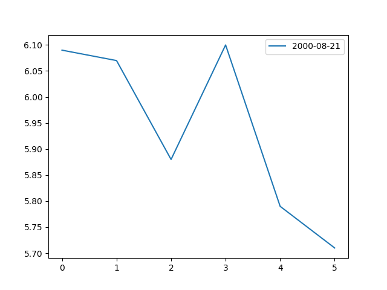
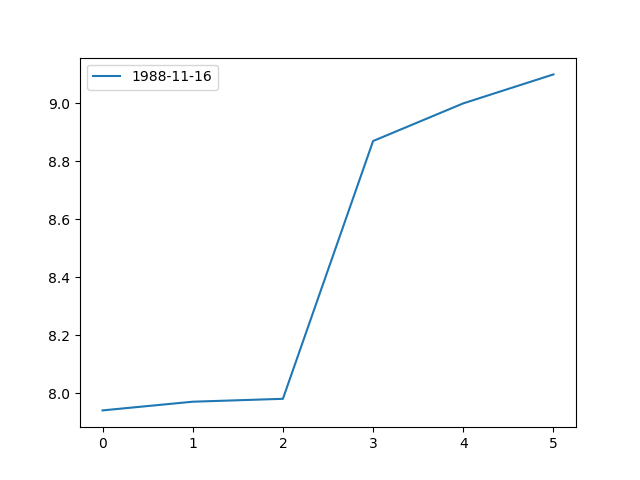
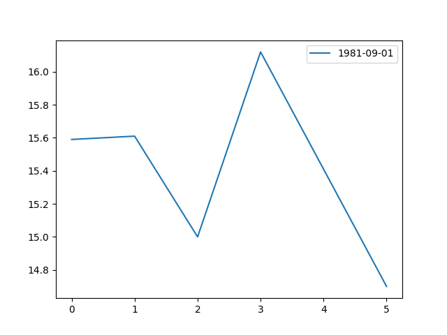
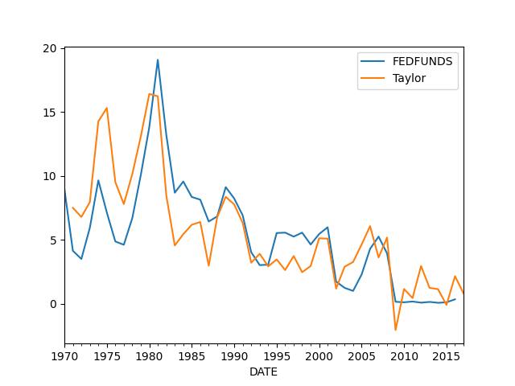

# Ekler

Log Veri Analizi 

Zaman serisi veri analizlerini anlatan kaynaklarda bazen "şimdi veriyi
ilişkisel olarak analiz etmek için onun log'unu alalım'' gibi ifadeler
görebiliyoruz. Bu sözle ne demek isteniyor? 

Diyelim ki $y_1,y_2,..,y_n$ zaman serimiz var, log matematiğinden biliyoruz ki

$log(y_{t}/y_{t-1}) = \log(y_t) - \log(y_{t-1})$  

Yani bu serinin önce log'unu alıp sonra farkını hesaplarsak, sanki artış
yüzdesinin log'unu analiz etmiş gibi oluruz, yani yüzde değişim rakamına
odaklanmış oluruz, o artışın baz aldığı önceki seviye ne olursa olsun. 

Ama başta sadece log'u analiz edelim diyor, farkı hesaplamadık diyelim?
Yine de dolaylı olarak o farka odaklanıyor olabiliriz, mesela kullandığımız
metot matematiksel olarak arda arda gelen noktaların farkını bir şekilde
ortaya çıkartmaya uğraşıyor ise (pek çok metot bu kategoriye girer), o
zaman yine veriye "ilişkisel olarak'' bakmış oluruz.

Sayısal örnek: hisse senedi A 1 TL'den 1.10 TL'ye çıktı, senet B 100 TL'den
110 TL'ye çıktı. Hem A, hem B yüzde 10 arttı. Fakat A TL olarak 10 kuruş
kazandı, B 10 TL kazandı. Eğer log uzayına çevirirsek, 

A $\log_{10}(1)$'den $\log_{10}(1.10)$'a çıktı yani 0'dan 0.0413'e çıktı. 
B $\log_{10}(100)$'den $\log_{10}(110)$'a çıktı yani 2'de 2.0413'e çıktı. 

Görüldüğü gibi yüzde değişiklik salt değer değişimine dönmüş oldu.

<hr>

Bazı Zaman Serileri Hesaplama Numaraları

Faiz Getiri Hesabı

Eldeki sermaye 100 lira, ve her ay yüzde 5 kazandıran bir yatırım var, 10
ay sonra elde ne var? Not: her ay sonunda eldeki tüm sermayeyi tekrar geri
yatırılıyor, yani birleşik faiz (compound interest) hesabı lazım, bu
hesaplarda ilk aydaki 100 lira 105 olur, 105 geri koyulur, ikinci ay 
$105 \cdot 0.05 = 5.25$ kazanılır, 110.25 geri koyulur, vs.

Numpy / Pandas ile bu hesapları basitleştirmenin yolu `cumprod`
kullanmak, bu çağrı ile her hücre kendinden önce gelen tüm hücrelerin
çarpımıdır, yani bu çarpım bir kümülatif çarpımdır (cumulative product),
mesela her hücrede 2 değeri olsa

```python
import pandas as pd
df = pd.DataFrame(np.ones((10,1))*2,columns=['x'])
df['kumulatif carpim'] = df.x.cumprod()
print (df)
```

```
   x  kumulatif carpim
0  2                 2
1  2                 4
2  2                 8
3  2                16
4  2                32
5  2                64
6  2               128
7  2               256
8  2               512
9  2              1024
```

Bu numarayı birleşik faiz hesabı için kullanabiliriz; her zaman anında elde
olan faiz sermaye $s$, faiz $f$ için $s \cdot (1+f) \cdot (1+f) ...$
olarak hesaplanabilir, ki $(1+f)$ çarpımını istediğimiz zaman dilimi için
uzatabiliriz. Baştaki örnek için 

```python
df2 = pd.DataFrame(np.ones((10,1))*0.05,columns=['f'])
df2['s'] = 100. * (1+df2.f).cumprod()
print (df2)
```

```
      f           s
0  0.05  105.000000
1  0.05  110.250000
2  0.05  115.762500
3  0.05  121.550625
4  0.05  127.628156
5  0.05  134.009564
6  0.05  140.710042
7  0.05  147.745544
8  0.05  155.132822
9  0.05  162.889463
```

Yani 10 ay sonunda eldeki para 162 lira. 

Bu numarayı pek çok değişik hesap için uyarlayabiliriz. 

Soru

Öyle bir oyun var ki eğer yazı/tura sonucunu tahmin ederseniz koyduğunuz
para kadar getiri elde ediyorsunuz, yoksa o kadar kaybediyorsunuz. Bir
oyuncunun tahmin başarısı yüzde 55. Bu kişi her elde, o anki sermayesinin
yüzde 5'ini koyuyor. Simülasyon ile 1000 el sonraki kümülatif getiriyi
bulun.

Cevap

"Eldeki sermayenin yüzde 2'sini yatırmak'' aslında bir tür birleşik faiz
hesabı olarak görülebilir, tabii bu faiz tahminin tutup tutmamasına göre ya
pozitif etkilidir, ya negatif etkilidir. Bunun için `numpy`  binom
dağılıma 1000 tane 0/1 zar attırırız, sonra 0 değerleri -1 yaparız, yani
-1/+1 zar olur, zar değerlerini 0.05 ile çarparız, sonuçları `cumprod`
ile birleştiririz,

```python
data = np.random.binomial(n=1,p=0.55,size=1000)
df3 = pd.DataFrame(data,columns=['dice'])
df3.loc[df3.dice==0,'dice'] = -1
cumret = 100.*(1+0.05*df3.dice).cumprod()
print (cumret.tail(1))
```

```
999    3157.474029
Name: dice, dtype: float64
```

<hr>

Getiri Eğrisi (Yield Curve)

Bir tahvilin getirisinden bahsettik. Önemli bir grafik türü farklı olgunlaşma
(maturity) tarihlerindeki aynı tip tahvillerin herhangi bir gündeki
getirisi. Mesela herhangi bir gün için 3-ay, 6-ay, 1-sene, 5-sene, 10-sene,
30-senede olgunlaşan hazine tahvillerinin getirisine bakıyoruz, bu noktaları
yanyana koyup bir grafik olarak resmediyoruz. Olgunlaşma zamanı arttıkça şekil
neye benziyor? Alttaki üç farklı gün için getiri eğrisini gösteriyoruz,

```python
import pandas as pd  
ts = ['treas3M','treas6M','treas1Y','treas5Y','treas10Y','treas30Y']
dfs  = [pd.read_csv('%s.csv' % t, index_col=0,parse_dates=True) for t in ts]
```

```python
# verileri getmat.py ile indirdik
#
dt = '2000-08-21'
res = pd.DataFrame([df.loc[dt,'VALUE'] for df in dfs],columns=[dt])
res.plot(); plt.savefig('tser_z001_05.png')
dt = '1988-11-16'
res = pd.DataFrame([df.loc[dt,'VALUE'] for df in dfs],columns=[dt])
res.plot(); plt.savefig('tser_z001_06.png')
dt = '1981-09-01'
res = pd.DataFrame([df.loc[dt,'VALUE'] for df in dfs],columns=[dt])
res.plot(); plt.savefig('tser_z001_07.png')
```





Bir grafik Kasım 16, 1988 yılın için, normal olan bu grafik, uzun vadeli faiz
(hazine tahvillerinin getirisine uzun vadeli faiz deniyor) kısa vadeden daha
yüksek, fakat bu yükseklik yüzde 1 civarında, bu eğriye "düz'' denebilir.

Diğer grafik Eylül 1981 için, uzun vade kısa vadeden daha düşük, yani tahvil
piyasaları ileride faizlerin daha düşük olacağını tahmin ediyor.  Bu tür
eğrilere "tersine dönmüş (inverted)'' deniyor, normalde olanın tersi
çünkü. Terse dönmüş eğrilerin gelmekte olan ekonomik durgunluğu tahmin ettiği
söylenir [4, sf. 85]. 

<hr>

Taylor Kuralı (Taylor Rule)

Merkez Bankalarına yardımcı olan araçlardan biri Taylor Kuralı; bu kural,
yani formül, olması gereken Merkez Bankası faiz oranı, mevcut enflasyon
$\pi$, hedef enflasyon $\pi^\ast$, ideal faiz oranı $r^\ast$ ve reel ve
potansiyel gayrısafi milli hasıla (GSYH) farkı arasında bir ilişki kurar.

$$
FF_t = r^\ast + \pi_t + 0.5 (\pi_t-\pi^\ast) + 0.5 Gap_t
$$

Alttaki script ile ABD için kuralı hesaplayabiliriz, FEDFUNDS ABD Merkez Bankası
FED'in ne yaptığı, Taylor ise formülün taviyesi,

```python
# veri indiren script gettaylor.py 
import pandas as pd
df = pd.read_csv('taylorfred.csv', parse_dates=True,\
                  index_col=0,comment='#')

df_resampled = df.resample('YS').first() 
df_resampled['GDPC1'] = df_resampled['GDPC1'].interpolate(method='spline', order=1) 
df = df_resampled 

longrun = 2.0
df['GDPC1'] = df.GDPC1.interpolate(method='spline',order=1)
df['Gap'] =  100. * (df.GDPC1/df.GDPPOT-1)
df['Curr'] = df.PCEPI.pct_change()*100.
df['Taylor'] = longrun + df.Curr + 0.5*(df.Curr - longrun) + 0.5*df.Gap
df[['FEDFUNDS','Taylor']].plot()
plt.savefig('tser_z001_09.png')
```



İki grafik çoğunlukla birbirine yakın gidiyor, ayrıldıkları noktalar da var
tabii; ve fomülü keşfeden John Taylor'a göre bunlar FED'in hata yaptığı
yerler. Mesela 2000'lı yılların başlarında faizler formülün dediğinden daha
düşük, ve 2008 krizine giden yol taşlarından birinin aşırı düşük faizler olduğu
biliniyor. Daha fazla detay için [4, sf. 278]. 

<hr>

Alış Fiyatı-Satış Fiyatı Aralık Tahmini (Bid/Ask Spread Estimation)

AFSF aralığının tanımı terimler kısminda bulunabilir. Akla soru gelebilir, aynen
günün en düşük, en yüksek fiyatları gibi AFSF fiyatları piyasalar tarafından
kaydedilmiyor mu?  Bazen hayır. Özellikle açık kaynaklardan veri alınınca her
tür veriyi alabileceğimizi beklememiz lazım, ki AFSF fiyatları bundan
biri. Aracı kurumumuz bize anlık bu bilgileri yakın tarihler için sağlasa bile,
geriye dönük veri için bu veri mevcut olmayabilir. Bu durumda eldeki bilgilerden
tahminsel hesap yapılabilir.

[5]'teki yaklaşıma göre ardı ardına iki günün en düşük / en yüksek fiyatlarına
bakarak AFSF için bir tahmin edici yaratmak mümkündür. Yaklaşımlarının
arkasındaki ana fikirler şunlar; Birincisi, en yüksek fiyatlar alımlar, en düşük
satımlar tarafından tetiklendiğine göre AFSF aralığı bu fiyatlarla muhakkak
bağlantılı olmalıdır. İkinci fikir, yüksek / düşük fiyatlarının oranının
oynaklığa bağlı olan kısmı, onu üzerinden hesapladığımız zaman dilimi büyüdükçe
ona oranla büyür, fakat onun AFSF'ye bağlı olan kısmi değişmeden kalır. Bu
fikirleri kullanarak sadece arka arkaya iki güne bakarak yazarlar bir tahmin
edici ortaya çıkartıyorlar [6]. Formüller şöyle,

$$
\beta =
\bigg(
 \ln \frac{H_t}{L_t} \bigg)^2 +  \bigg( \ln \frac{H_{t+1}}{L_{t+1}}
\bigg)^2, \quad
\gamma = \bigg( \ln \frac{H_{t,t+1}}{L_{t,t+1}} \bigg)^2
$$

ki $H_t,L_t$ $t$ gününün sırasıyla en yüksek ve en düşük fiyatları,
$H_{t+1,t},L_{t,t+1}$ ise ardı ardına iki günün en yüksek ve en düşük
fiyatları. Ardından,

$$ \alpha = \frac{\sqrt{2 \beta} - \sqrt{\beta}}{3 - 2 \sqrt{2}} -
\sqrt{\frac{\gamma}{3 - 2\sqrt{2}}}
$$

Ve nihai tahmin edici

$$ S = \frac{2 (e^{\alpha} - 1 )}{1 + e^{\alpha}} $$

```python
df = pd.read_csv('20day.csv',sep='\\s+')
df['Lt1'] = df.Lt.shift(-1)
df['Ht1'] = df.Ht.shift(-1)

def f(x):
    beta = np.log(x.Ht/x.Lt)**2 + np.log(x.Ht1/x.Lt1)**2
    gamma = np.log( max(x.Ht,x.Ht1) / min(x.Lt,x.Lt1)  )**2
    alpha1 = (np.sqrt(2*beta)-np.sqrt(beta)) / (3 - 2*np.sqrt(2))
    alpha2 = np.sqrt(gamma / (3-2*np.sqrt(2)))
    alpha = alpha1 - alpha2
    S = 2*(np.exp(alpha)-1) / (1 + np.exp(alpha))
    return S

df['S'] = df.apply(f, axis=1)
df = df.fillna(0)
df.loc[df.S<0,'S'] = 0
print (df.head())
```

```
   Close     Lt     Ht    Lt1    Ht1         S
0  25.25  25.25  25.32  25.19  25.32  0.001683
1  25.32  25.19  25.32  25.28  25.41  0.000000
2  25.30  25.28  25.41  25.28  25.38  0.003243
3  25.33  25.28  25.38  25.27  25.37  0.002995
4  25.33  25.27  25.37  25.36  25.45  0.000000
```

Corvin, Schultz (CS) tahmin edicisi bazen negatif değerler verebiliyor, bu
durumda bir yaklaşım bu değerleri sıfır yapmak, ve bu aralığı "çok küçük''
olarak kabul etmek. Eğer birkaç gün üzerinden ortalama alınırsa tabii ki bu
sıfır değerleri nihai ortalamanın aşağı inmesini sağlayacaktır. 


<hr>

Kurları Tahmin Etmek (Taslak)

İki ülke arasındaki kurlar o ülkelerin fiyat seviyelerinin oranıdır. Değil
mi? Eğer berbere Japonya'da 1000 yen Türkiye'de 10 lira veriyorsam (ve
başka fiyat olmadığını düşünelim) o zaman Yen/TR kuru 100 yen
olmalı. Tekrar ana formülden başlayarak her iki ülke için bu formülleri
düzenleyip bölüm haline getirirsek,

$$ M_1V_1 = P_1Y_1, \quad M_2V_2 = P_2Y_2 $$

$$ \frac{P_2}{P_1} = \frac{M_2}{M_1} \cdot \frac{Y_1}{Y_2} \cdot \frac{V_2}{V_1} $$

$$ \log \left( \frac{P_2}{P_1} \right) = 
\log \left( \frac{M_2}{M_1} \right) + 
\log \left( \frac{Y_1}{Y_2} \right) +
\log \left( \frac{V_2}{V_1} \right) 
$$

$$    = \log(M_2) - \log(M_1) + \log(Y_1) - \log(Y_2)  + \log(V_2) - \log(V_1) $$

$$ = \log(M_2) - \log(M_1) + \log(Y_1) - \log(Y_2)  $$

$V$'ler iptal oldu çünkü hızı sabit kabul ediyoruz, 


```python
df = pd.read_csv('exch.csv',parse_dates=['DATE'])
df = df.set_index('DATE')
df = df.interpolate(method='linear')
k = 5
df['lm1'] = np.log(df.nonfinloanus).shift(k)
df['lm2'] = np.log(df.nonfinloanjp).shift(k)
df['ly1'] = np.log(df.realgdpus).shift(k)
df['ly2'] = np.log(df.realgdpjp).shift(k)
df['lxjpus'] = np.log(df.xjpus)

df = df.dropna(axis=0)
import statsmodels.formula.api as smf
results = smf.ols('lxjpus ~ lm1 + lm2 + ly1 + ly2', data=df).fit()
print (results.summary())
```

```
                            OLS Regression Results                            
==============================================================================
Dep. Variable:                 lxjpus   R-squared:                       0.432
Model:                            OLS   Adj. R-squared:                  0.424
Method:                 Least Squares   F-statistic:                     53.88
Date:                Wed, 30 May 2018   Prob (F-statistic):           1.00e-33
Time:                        20:09:26   Log-Likelihood:                 249.15
No. Observations:                 288   AIC:                            -488.3
Df Residuals:                     283   BIC:                            -470.0
Df Model:                           4                                         
Covariance Type:            nonrobust                                         
==============================================================================
                 coef    std err          t      P>|t|      [95.0% Conf. Int.]
------------------------------------------------------------------------------
Intercept    -35.7050      4.321     -8.263      0.000       -44.211   -27.199
lm1           -0.5512      0.118     -4.663      0.000        -0.784    -0.318
lm2            1.2863      0.190      6.768      0.000         0.912     1.660
ly1            1.7492      0.305      5.732      0.000         1.148     2.350
ly2            0.8758      0.408      2.146      0.033         0.073     1.679
==============================================================================
Omnibus:                       13.370   Durbin-Watson:                   0.067
Prob(Omnibus):                  0.001   Jarque-Bera (JB):                9.922
Skew:                          -0.346   Prob(JB):                      0.00701
Kurtosis:                       2.409   Cond. No.                     1.67e+04
==============================================================================
```

Uyum oldukca iyi, $R^2$ yüksek. İlginç bir gözlem, $k$ ile ne kadar geriye
giderek kuru tahmin edebileceğimizi kontrol etmeye uğraştık, 5 periyot geriye
gitmek en iyi sonucu verdi, bu zaman serisinde periyot ay bazlı, yani 5 ay
öncesinden gelecekteki kuru tahmin etmek mümkün!

<hr>

Finans Terimleri Açıklamaları

Arbitrage (Arbitraj)

Bir teminatın döviz kuru vs. gibi nedenlerle farkı piyasalarda çok kısa
süreli de olsa farklı değerden işlem görmesi sonucu aradaki ufacık farktan
yararlanma işlemi. Kelimenin kökü *arbitrate* kelimesinden geliyor,
yani hakemlik yapma, aradaki anlaşmazlıkları çözmek. Finans durumunda arada
bir anlaşmazlık var, sadece bu bir fiyat anlaşmazlığı, ya da kısa süreli
bir "uyumsuzluk''. Borsacı bu uyumsuzluğu görerek ondan faydalanıyor.

Arbitraged Away (Arbitrajın Tüketilmesi)

Arbitraj işlemleri piyasadaki enformasyon verimsizliğinden istifade etmek
anlamına geliyorsa, o zaman pek çok kişinin belli bir verimsizlik üzerinden
işlem yapması o verimsizliği yokedebilir. Mesela bir ortalama dönüş
stratejisinde alttan alıp üstten satıyoruz, fakat pek çok kişi bu
stratejiyi kullanıyor ise en tepede pek çok kişi satar, ve fiyat
çıkabileceği kadar tepeye çıkmaz, ki bu ortalamaya dönüş karını etkiler.

ETF - Exchange Traded Fund (Piyasa Fonları)

Bir indisi, ya da baz ürünü (commodity) takip eden ve bu altta takip edilen
"şey''in piyasada alınıp, satılmasını sağlayan varlık [1]. Mesela petrol,
altın gibi malların fiyatı baz alınarak oluşturulmuş bir ETF borsada alınıp
satılabilir. Ya da S\&P 500 indisi, ki aslında 500 şirketi kapsayan bir
formülden ibarettir, baz alınarak bir ETF oluşturulabilir (SPY) ve bu ETF
alınıp satılınca S\&P 500 fiyatının iniş çıkışı üzerinde oynanmış
olacaktır. 

Bonds, Yields (Tahviller, Getiriler)

Şirketlerin, devletlerin, hatta belediyelerin borç alabilmesini sağlayan
enstrümanlar. Tahviller belli bir miktarda borcun alınmasını, ödemesini,
vadesini, borç üzerinden ödenecek faizi belli kurallara bağlar. Faiz ödemesi
sabit bir kupon miktarı üzerinden yapılır. Tahvili alıp vade (maturity) süresi
boyunca tutan kişiler için hiçbir risk yoktur, onlar paralarını söz verildiği
gibi geri alırlar, ve (çoğunlukla yılda iki kez) olan faiz ödemeleriyle
beraber. Tahvilleri ikincil piyasada başkasına satmak ta mümkündür. 

Merkez Bankası faiz oranları tahvillerin fiyatını direk etkiler, tahviller
risksiz enstrümanlardır, ayrıca kupon fiyatları sabittir; Fakat aynı vadeli yeni
tahviller çıkarsa, eski tahviller "rekabet'' edebilmek için ikinci elde
fiyatları duruma göre artaacak ya da azalacaktır. Tahvil piyasalarındaki
oynaklığın en büyük sebebi budur; banka faiz oranları değişir, ona göre eldeki
tahvilin fiyatı yukarı ya da aşağı dalgalanabilir.

Mesela \%4 kupon verimliliği (coupon yield) olan 30 yıllık hazine tahvili
aldık. \%4, kupon ödemelerini belirtir, hemen aklımızda para miktarı olarak
hesabını yaparız, sabit olan ödeme budur (birkaç parçaya bölünerek ödenebilir
ama ödemenin tamamı budur) . Şimdi diyelim ki yeni 30 yıllık tahviller çıktı,
bunların verimi \%10, yani kupon ödemeleri daha yüksek, tam da bu sırada biz
eldeki tahvili satmak istiyoruz. Ne yapacağız?  O zaman bizim elimizdeki tahvili
daha düşük bir fiyattan satmamız gerekecek ki kupon ödemelerindeki fark buradan
kapansın, çünkü \%10'luk tahvili alabilecek alıcılar başka türlü niye bizim
tahvili alsın ki?  [2].

Bir tahvilin mevcut veriminden (current yield) bahsedilir, bu hesap kupon
ödemeleri bölü tahvil fiyatından ibaret. Neredeyse alır almaz bir tahvilin
fiyatı değişir, üç tane \$1000, \$1200, \$800'lük tahvil aldık diyelim,
1.'nin verimi \%10, 2.'nin \%8.33, 3.'nün \%12.5.

Medyada çoğunlukla hisse senet piyasaları işlenir, fakat tahvil piyasası
hisse senet piyasalarından kat kat daha büyüktür. NYSE, Nasdaq, İMKB gibi
tek bir "piyasa''dan bahsetmek te mümkün değildir, çoğu tahvil alışverişi
aracı kurumlar üzerinden kurumlararası yapılır. 2007/08 krizi mesela birincil
olarak senet piyasaları değil, tahvil piyasalarıyla alakalıydı (mortgage
tahvilleri).

Bid/Ask Spread (Alış Fiyatı-Satış Fiyatı Arasındaki Fark, Fiyat Marjı)

Her piyasada iki türlü fiyat vardır, birisi alış fiyatı (the ask) öteki ise
satış fiyatı (the bid). Bir borsacı olarak siz her zaman yüksek olan fiyattan
almak, düşük olandan satmak zorundasınız. Bu aradaki fark işlemimizi
gerçekleştiren kişilerin kazancını sağlayan şeydir bir bakıma, bu kişileri kötü
gözle görmemek lazım (o fark üzerinden spekülasyon mu yapıyor?), çünkü
unutmayalım işlemimizi gerçekleştiren bu kişi o işlemin öteki tarafından riske
giriyor, yani satışımızı alarak, ya da alımımıza satış yaparak. Tabii ki onlar
da risklerini azaltmak isteyeceklerdir, bu sebeple alış/satış fiyatı arasındaki
fark üzerinden kara girmeye uğraşacaklardır [2]. İşlem hacmin arttıkça AFSF
aralığının küçüldüğü bilinir, çünkü aracı kurumlar her iki uçta yeterince
müşteri bulabilirler ve riskleri azalır, bunu aralık fiyatlarına yansıtırlar. 

Short Selling, Shorting - Açığa Satmak

Bir seneti açığa sattığınızda aracı kurumunuz aslında bu senedin bedelini
size ödünç verir; o senedi satar, bir yerden bulur onu, kendi havuzunda
vardır, anlaşmalı başka bir kurumdan bulur vs. onu satar ve senedin satışı
sonucu ortaya çıkan parayı da hemen sizin hesabınıza yazar. Yani o para
sizindir. Bir ek şart vardır, o senedi gelecekte bir zaman, ne zaman
olursa, aynı miktarda alıp aracı kurumunuza geri vermeniz gerekir. Bu
noktada artık o senedin düşüşünden para kazanacağınız gayet bariz herhalde,
eğer tek birimlik 100 lira değerinde senet borç verilmiş ise ve ertesi gün
fiyat 90'a düşmüşse, ve, eğer istiyorsanız, o tek birimi alıp aracı
kurumunuza verirsiniz (bu alma / geri verme işine "pozisiyonu kapatmak
(covering)'' adı veriliyor, ve aradaki karı cebe atarsınız.

Market Open, Market Close Prices (Borsa Açılış, Kapanış Fiyatları)

Bir gün içinde bir varlığın son işlem fiyatı kapanış fiyatıdır, açılış
fiyatı günün ilk fiyatıdır. İlginç bir durum, bir önceki günün kapanışı ile
sonraki günün açılışı yani olmayabilir; mesela bir şirketin senedi 40
liradan kapanıyor, o gece, o şirketin bir ürününün ciddi bir arızası olduğu
haberi yayılıyor. Sonraki gün o şirket senedi 40 liradan alıcı bulacak
mıdır? Büyük ihtimalle hayır. Diyelim ki o senet üzerindeki ilk işlem 30
lira seviyesinde, ve açılış fiyatı işte bu fiyat. 

Time Deposit - Zamanlı Mevduat

Bir bankaya yatırılan ve belli zaman süresince dokunulamayan / cekilemeyen (1
ay, 3 ay, 1 yıl, vs.) mevduata zamanlı mevduat ismi verilir. Belli bir süre
dokulamayacağı için bankalar bu parayı alıp onu başka yatırımlarda
kullanabilirler, ve bu sebeple mevduat sahibine yüksek bir faiz verebilirler
(aradaki kar onlara kalır tabii). Zaman süresi arttıkça faizin daha yüksek
olacağı beklenebilir.

Eurodollar

ABD dışındaki bankalarda zamanlı mevduat olarak tutulan dolarlarla Eurodollar
ismi verilir. Para ABD dışındaki bankalarda tutulduğu için bu mevduat ABD Merkez
Bankasının (FED) kontrolü dışındadır, ve bu sebeple daha az regülasyona
tabidirler, onları çekici yapan bir faktör budur. Terimin çıkış noktası
Avrupa bankalarında tutulan dolarlardır, fakat artık herhangi bir yabancı
bankada zamanlı mevduat olarak tutulan dolarlara Eurodollar deniyor. Hatta
yabancı bankada tutulan her döviz için euro öneki kullanılabilir, mesela
Euroyen, hatta Euroeuro gibi! 

Fed Faiz Oranları, Fed Fon Oranı (Fed Funds Rate)

Her banka ABD Merkez Bankası'nda belli bir nakit rezervi tutmak zorundadır, bu
kanuna göre böyledir. Fakat her gün sonunda bankaların elinde bu gerekli miktar
olmayabilir, bu durumda birbirlerinden nakit borç alırlar. Bu alım, satım
sırasında kullanılan faiz, fed fon oranıdır; ve "FED'in kararlaştırdığı oran''
olarak bilinir, fakat işin ilginç tarafı FED kimseye "oran bu olacak'' diye bir
emir vermez. Arz talep kanunlarını belli yönde etkileyerek bu sonucun çıkmasını
sağlar. Eğer fed fon'un yükselmesini istiyorsa iletişimde olduğu bankalara
hazine tahvili satar, onlardan nakit çekmiş olur, bu dolaylı olarak bankaların
rezervini azaltır, bu durumda birbirlerine ve dışarı verdikleri faizi arttırmak
zorunda kalırlar. Azaltma durumunda tam tersi olur.

LIBOR

Dünyadaki büyük, ünlü bankaların birbirine borç vermekte kullandığı oranı
yansıtan bir gösterge (benchmark) fair oranıdır. LİBOR'ı yayınlayan kurum her
gün ünlü bankalardan birbirlerine borç için kullandıkları faiz hakkında bilgi
alır, ve bir averaj formülü üzerinden LİBOR'u yayınlar. Pek çok farklı vadeli
LOBOR'lar vardır, ama en çok referans edileni 1 yıllık LİBOR'dur. Doğal olarak
LİBOR pek çok diğer enstrüman için bir tür referans noktası oluşturur.

Opsiyon (Option)

Bir varlığı, mesela senedi, baz alan bir opsiyon alıcıya baz alınan senedi alma
seçeneğini verir, almaya mecbur etmez [7]. Bu hak önceden belirlenen belli bir
fiyat ve belli bir tarih üzerinden verilir (tarihten önce alınmasını mümkün
kılan opsiyonlar da vardır). Opsiyonların önemli bir özellliği eğer alıcı
isterse, kafasına estiği gibi opsiyondan çıkabilir, hiçbir yükümlülüğü
yoktur. Opsiyon fiyatları da çoğunlukla buna izin verecek şekilde az tutulur. 

Her opsiyonun bir alıcısı bir satıcısı vardır, en azından ilk baştan alınan /
satılan sadece opsiyondur (baz varlığın alımı sonra devreye girer). Başka bir
varlığı baz aldığı için opsiyona bir türevsel araç denebilir.

İki türlü opsiyon vardır, alım opsiyonu (call option) ve satım opsiyonu (put
option). Önceden kararlaştırılan fiyata kullanım fiyatı (strike price)
denir. Opsiyonun kendisinin fiyatı teklif fiyatı (bid) ve satış fiyatı (aşk)
olarak ikiye ayrılır. Mesela, diyelim bugün 2015-02-25 ve son kullanım tarihi
2015-02-27 olan kullanım fiyatı \$75 olan bir AAPL (Apple) opsiyonu olabilir,
teklif fiyatı \$53.60 üzerinden. Opsiyonlar genelde en az baz varlıktan 100
birimi kullanırlar, o zaman bu alım opsiyonuna baştan verilen ücret 100 x
\$53.60 = \$5,360 olacaktır. Dikkat: bu opsiyon bize hemen 100 tane AAPL şenedi
almıyor. 2015-02-27 tarihinde tanesi \$75'ten 100 tane AAPL şenedi alma {\em
 hakkı} veriyor.

Eğer 27'sinde opsiyonu kullanım fiyatı üzerinden almak istersek, \$7,500 +
\$5,360 = \$12,860 ödemiş oluruz ve karşılığında 100 AAPL hissesine sahip
oluruz. 25'inde AAPL fiyatı \$128.79 idi, 100 ile carpinca \$12,879 olur, yani
biraz fazla ödeme yapmış olurduk. Fakat opsiyon ile bir güvenlik elde ettik,
eğer senet \$75 altına düşse opsiyonu bırakıp kaçarız, ve sadece ona ödediğimiz
parayı kaybetmiş oluruz. Kıyasla eğer 25'inde 100 tane AAPL almış olsak ve fiyat
\$74.99'a çakılsa \$12,879 - \$7,499 = \$5,380 kaybetmiş olurduk yani opsiyona
ödediğimizden daha fazlası.

Opsiyonların fiyatlanmasında Black-Scholes formülü denen bir formül kullanılır,
üstte ince dengeler var gördüğümüz gibi, opsiyonun her iki tarafındaki aktör
kendine en faydalı olacak seviyede fiyat bulmak, vermek ister, ve B-S formülü
bunu yapmalarını sağlar. B-S birkaç varsayımı baz alır, ve bir de formüle
dışarıdan verilen oynaklık 'öngörüsü' $\sigma$ üzerinden optimal bir hesap
verir. Bu hesabı her iki taraf ta yapacaktır; kimisi gelecekteki oynaklık
tahminini herkesden daha iyi yaparak kara geçmeye uğraşır, opsiyon ticareti
geniş bir alandır.

Kaldıraç (Leverage)

Getiriyi fazlalaştırmak için kullanılan yöntemlerden biri kaldıraçtır, yani borç
kullanmak. Borsa araçı kurumları bazen kaldıraç kullanımına izin verirler. Bazen
de işlem yapılan enstrümanın doğasından ileri gelen bir kaldıraç vardır; mesela
vadeli işlem sözleşmesi (futures contract) alışverisinde belli bir yüzdede
teminat (margin) verildikten sonra (yüzde 10 gibi) işlem yapılabilir, burada 10
katlık bir kaldıraç sözkonusu. Kaldıraç kullanınca getiri o kadar katlanır,
ayrıca oynaklıkta o kadar katlanır. 10 TL sermaye var ise, yılda yüzde 1
getirisi olan varlık bana 1 TL kazandırır, fakat 10 kat kaldıraç ile 100 TL'ye
çıkabilirim, kazancım 10 TL olur. Borç geri verilir, 10 TL bende kalır. Tabii
eğer yüzde 1 kayıp olursa, o zaman 10 TL kayıp elimdeki tüm sermayeyi
siler. Dikkat! 

Kaynaklar 

[1] Investopedia, *Exchange-Traded Fund (ETF)*, [http://www.investopedia.com/terms/e/etf.asp](http://www.investopedia.com/terms/e/etf.asp)

[2] Thau, *The Bond Book*

[3] Ekstrand, *Financial Derivatives Trading*

[4] Ang, *Asset Management*

[5] Corvin, Schultz, *A Simple Way to Estimate Bid-Ask Spreads from Daily High and Low Prices*

[6] Kostanjcar, Jeren, *Relationship between bid-ask spreads and fluctuations in market prices*

[7] Heydt, *Mastering Pandas for Finance*

<hr>

Yunan Harfleri


