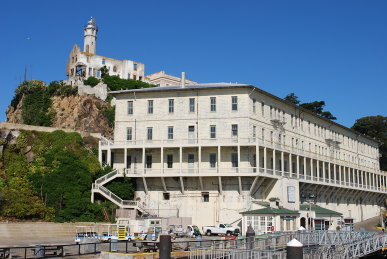
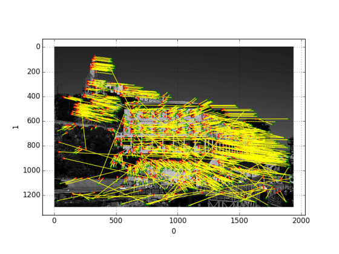
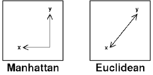
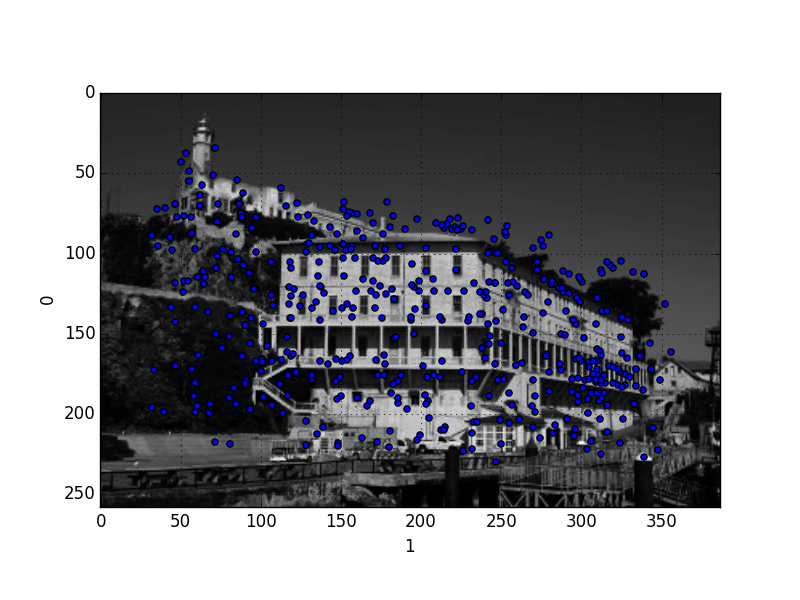

# Ders 1

Ders kitabımız Ma, Soatto, Kosecka, ve Sastry'nin {\em An Invitation to 3-D
  Vision} kitabıdır. Videolar [1] adresinde. Dersin ana odağı kameradan
gelen iki boyuttaki görüntüleri birleştirerek o görüntülerin geldiği
dünyanın 3 boyutlu modelini oluşturmak. 

Bilgisayar kontrollü arabalar bugünlerde çok konuşuluyor, bu arabalar
etrafını nasıl algılıyor acaba?  İnsan gibi mi davranıyorlar? Bu soruya
kısa cevap hayır. [2015 itibariyle] bu arabalar aslında Lidar adı verilen
lazer bazlı uzaklık ölçüm algılayıcıları kullanıyorlar (bu kelime ışık
-light- ile radar kelimelerinin birleşimi), etraflarına lazer ışığı
yollayıp yansımayı alıyorlar, ve bunu çok yüksek çözünürlük ile yapıyorlar,
sonuç olarak dış dünya hakkında çok detaylı bilgileri var. Fakat biz insan
olarak biliyoruz ki sadece görüntü ile araba kullanmak mümkün, çünkü
insanlar Lidar'a sahip değil. Bunu nasıl yapıyoruz?

Bazıları stereo görüş (stereo vision) ile bunu yapabildiğimizi söylüyor
fakat bir gözümüzü kapatsak tek gözümüz ile bile araba
kullanabiliriz. İnsanlar aslında şunu beceriyor; hareket ederken farklı
açılardan gördüğümüz objelerin 3 boyutlu yerini hesaplayabilmek. Bu işi iyi
yapıyoruz, hatta bilim adamlarına göre zihinsel işlem gücümüzün neredeyse
yarısı görüntü işlemekle haşır neşir! Peki bu hesap nasıl yapılıyor?

Bir binaya bakalım, şimdi birkaç adım atarak tekrar bakalım, bina iki
boyutlu görüntümüz içinde, yani gözümüzde, farklı bir yere gelmiş
olacak. Bu fark, attığımız adım, o binanın büyüklüğü, ve yeri ile orantılı
bir fark. Solumuzda ve çok ileride olan bir obje ona yaklaştıktan sonra
gözümüzde çok az sola kayma oluşturabilir, sağımızda çok yakınımızda olan
bir obje ona doğru ilerlerken ve yanından geçerken çok hızlı bir şekilde
gözümüzdeki resimde sağa doğru kayar. Eğer yeterince adım atıp o binanın,
objenin yeterince değişik görüntüsünü alırsak, ve kuvvetli algoritmalar
kullanarak bina hakkında üç boyutlu bir şekil oluşturmuş oluruz. Hareketten
Yapı Oluşturmak (Structure from Motion -SfM-) bilim dalının yapmaya
uğraştığı işte budur, SfM bu derslerin ana amacı olacaktır.

Altta örnek olarak Alkatraz adasının iki değişik açıdan çekilmiş resmini
görüyoruz. 




Biri daha uzaktan, biri daha yakından, büyük bir ihtimalle adaya
yaklaşmakta olan bir tekne üzerinden aynı kişi tarafından çekilmiş. SfM
için önce her iki resim üzerinde o resimlerin özelliklerini (features)
çıkartan bir algoritma kullanırız (alttaki örnekte SURF kullandık, bir
diğer alternatif SIFT). Daha sonra bu özelliklerin her iki resim arasında
eşleştirilmesini sağlayan bir diğer algoritma kullanırız, böylece onların
hangi yöne kaymış olduklarını anlayabiliriz. SURF hakkında daha fazla detay
bu yazının altında. Eşleştirmeleri 1. resim üzerinde görsel olarak
gösterirsek (kırmızı nokta ilk resimden, yeşil nokta ikinci resimden),



Yani kamera hareketini, ve hareketin resim üzerinde nasıl bir değişim
yarattığının bulabiliyoruz. Muhakkak 1. resimdeki tüm özellik noktalarının
2. resimde nerede olduğu mükemmel bir şekilde bulunamamış olabilir, ama bu
"gürültü'' içerisinden bir model çıkartmak SfM'in bir parçası olacaktır.

İlk önce Lineer Cebir'den bazı kavramları hatırlayalım. 

Uzaylar

Her tür kavram için akılda tek bir örnek tutmak iyi oluyor; Vektör uzayı
için mesela $\mathbb{R}^3$, altuzay (subspace) için ise bu uzay içindeki
bir düzlem (plane) olabilir. Bu düzlemin orijinden (0,0,0) noktasından
geçmesi gerekir.

Bazlar

Sonsuz tane baz olabilir, mesela $\mathbb{R}^3$ için. Örnek, kordinat
eksenleri bir bazdır, onları, birbirine dikgen olma şartıyla, pek çok
değişik şekilde seçebilirim. 

Bir bazı oluşturan vektörlerin lineer kombinasyonunu alarak bir başka baz
oluşturabilirim. Buna baz transformasyonu deniyor. Baz $B = \{
b_1,..,b_n\}$ olsun, yeni bir baz $b_j' \in B'$,

$$ b_j' = \sum_{j=1}^{n} \alpha_{ji}b_j $$

ki $\alpha_{ji}$ özgün bir transformasyonu temsil eden transformasyon
katsayıları olacaktır. 

Katsayıları bir matris $A$ içine koyarsak bu matrisi bir transformasyon
matrisi olarak kullanabiliriz,

$$ B' = BA \iff B = B'A^{-1} $$

Baz transformasyonu çok faydalı çünkü 3 boyutlu dünyayı oluştururken onu
hangi şekilde oluşturacağız? Artık biliyoruz ki hiçbir model, temsiliyet
özgün değil. Mesela kameranın ardı ardına aldığı resimleri birleştiriyoruz,
fakat baz aldığımız kameranın yeri sürekli değişiyor, bu sırada bazı
değiştirmemiz gerekebiliyor. Ya da, yeri değişmeyen tek bir "referans
temsiliyet'' baz alarak ona dönük transformasyon yapmak gerekebiliyor. 

İçsel / Noktasal Çarpım (Inner / Dot Product)

İki vektörün noktasal çarpımı $\langle u,v \rangle$. Norm, yani $v$
vektörünün uzunluğu ile noktasal çarpım arasında bir ilişki var, 
$|v| = \sqrt{\langle v,v \rangle}$.

Tabii ki $\langle v,v \rangle \ge 0$ yani pozitif kesin. 

İki vektör arasındaki mesafeyi bir tür norm hesabı ile yapabilirim, 

$$ d(v,w) = |v - w| = \sqrt {\langle v-w, v-w \rangle }  $$

Yani iki vektörün farkının normu bu iki vektör arasındaki mesafeyi verir.

Üstteki mümkün ölçevlerden (metric) sadece biri, farklı ölçevler olabilir,
mesela 2D iki nokta arasında Manhattan mesafesi kullanılabilir, 



Bu mesafeye Manhattan deniyor çünkü Manhattan bilindiği gibi New York'un
üzerinde pek çok gökdeleni olan bir adası, ve bir noktadan diğerine gitmek
için binaların etrafından dolaşarak gitmemiz gerekiyor, direk pat diye
dümdüz istediğimiz noktaya gidemiyoruz. Düz mesafe Öklitsel (Euclidian)
olurdu. 

Üstte noktasal çarpım üzerinden bir eşleme ($V$ diyelim) yaratmış olduk
aslında, bu durumda $V$ bir ölçev uzayı haline geldi. Bu uzay noktasal
çarpımla yaratıldığı için bu sebeple ona bir Hilbert Uzayı deniyor
(detaylar için [2] notları). Her ölçek uzayı noktasal çarpım üzerinden
yaratılmayabilir, mesela bir ezber tablo üzerinde bile bir mesafe eşlemesi
yaratırdım, bu bir tür ölçev olurdu, ama bu ölçev noktasal çarpım olmadığı
için ortaya bir Hilbert Uzayı çıkmazdı.

Doğal Baz

$I_n$ ile $n \times n$ boyutunda birim matrise doğal baz (canonical basis)
ismi veriliyor. Diyelim bu bazdan diğer bir baz $B'$'ye $A$ ile geçiş
yapabiliyoruz, ve $\langle x,y \rangle$'nin bu bazda nasıl gözükeceğini
merak ediyoruz,

$$ \langle x',y' \rangle = x'^Ty' = 
(Ax)^T (Ay) = x^TA^TAy = {\langle x',y' \rangle}_{A^T A}
 $$

Eşitliğin en sağ tarafı notasyonel bir ek. Bu çarpıma doğuşturucu
(induced) içsel çarpım ismi veriliyor, doğuşturucu kelimesi kullanılmış
çünkü yeni bazın "etkisi'' ile ortaya çıkan, "doğan'' bir içsel çarpım
bu. 

Dikgenlik

Eğer $\langle x,y \rangle = 0$ ise $x,y$ birbirine dikgen demektir. 

Bir bazın, yani o bazı temsil eden vektörlerin birbirine dikgen olması
gerekmez. Ama bu durum var ise, faydalıdır.

Kronecker Çarpımı

$A$ herhangi bir matris olabilir, illa karesel olması gerekmez, 
$A \in \mathbb{R}^{m \times n }$ ve $B \in \mathbb{R}^{k \times l }$. 
Çarpım şöyle,

$$ A \otimes B =  
\left[\begin{array}{ccc} 
a_{11}B & \dots & a_{1n}B \\ 
\vdots & \ddots & \vdots \\
a_{m1}B & \dots & a_{mn}B
\end{array}\right]
$$

Yani $A$'nin her öğesi $B$'nin *tamamı* ile çarpılıyor ve bu sonuçlar
yanyana, üst üste diziliyor. Bu tabii ki devasa yeni bir matris ortaya
çıkartır, sonuç $A \otimes B \in \mathbb{R}^{mk \times nl}$. 


```python
A = np.array([[3,4,5],[4,3,5]])
B = np.array([[3,4],[4,5]])
print np.kron(A,B)
```

```
[[ 9 12 12 16 15 20]
 [12 15 16 20 20 25]
 [12 16  9 12 15 20]
 [16 20 12 15 20 25]]
```

Yığma (Stacking)

Yine çok basit bir operasyon, $A^S$, bir matrisin kolonlarını alıyoruz, ve
her kolonu diğerinin altına gelecek şekilde koyuyoruz, ve dikey olarak çok
büyük bir vektör ortaya çıkartıyor. Numpy ile,

```python
print A
print A.flatten(order='F')
```

```
[[3 4 5]
 [4 3 5]]
[3 4 4 3 5 5]
```

Bu iki operasyondan ilginc bir yetenek elde ettik, 

$$ u^T A v = ( v \otimes  u)^T A^S $$

Yani eşitliğin sol tarafı $A$'nin öğeleri üzerinden bir lineer
kombinasyon. 

[Gruplar, Halkalar konuları atlandı]

Grupları matris olarak temsil etmek mümkündür, bu fikir biraz garip
gelebilir, çünkü grup oldukça soyut bir kavram, ama matrisler gayet somut,
sayısal kavramlar. Bunun nasıl olduğuna gelelim; çoklu bakış açıdan 3D
tekrar oluşturma (reconstruction) halinde hareket halindeki bir kameranın
bir eksen etrafında tüm mümkün dönüşleri bir grup oluştururlar. Nasıl?
Mesela kamera 30 derece dönmüş (rotate) olsun, sonra bir 30 derece daha
dönmüş olsun. Toplam 60 derece dönüşün kendisi, ayrı ayrı 30 dereceler
gibi, bir dönüş sayılır. Yani dönüşler, toplam operasyonu için
kapalıdır. Ayrıca her dönüşün bir tersi vardır.

$\mathbb{R}^2$'daki bir $\theta$ dönüşü tipik olarak

$$ A_\theta = \left[\begin{array}{rr}
\cos \theta & -\sin \theta \\
\sin \theta & \cos \theta
\end{array}\right] $$

şeklinde gösterilir, ki $0 \le \theta \le 2\pi$. Üstteki matris soyut bir
grubun somut olarak belirtilmiş hali, 2 boyuttaki tüm dönüşler. Yani bir
grubun her üyesi somut bir matris ile ifade edilebiliyor.

Dönüş dışında ve yine kamera bağlamında diğer transformasyonlar vardır;
mesela kameranın yerini değiştirebilirim (translation). Dönüş ile beraber
bu hareket te bir grup oluşturur, çünkü üç eksende ileri geri hareket, üç
eksende dönüş, toplam 6 boyutlu bir grup ortaya çıkar, ya da "serbestlik
derecemiz 6'' diyebiliriz, ki bu grubun da bir matris temsili olacaktır. 

Yani matris üzerinden grupları incelemiş olurum. Matrisler somuttur, onları
hesapsal rutinlerde de kullanabilirim. 

İlgin Transformasyon (Affine Transformation) 

Hareket ettirmek bir vektör toplamıdır, döndürmek / rotasyon matris
çarpımıdır (eğer matris döndürme için tasarlammışsa), bir araya koyarsak,

$L: \mathbb{R}^n \to \mathbb{R}^n$, $A \in GL(n)$ ve $b \in \mathbb{R}^n$ olmak uzere

$$ L(x) = Ax + b $$

işlemini tanımlayabiliriz, bu bir ilgin transformasyondur. Verilen bir $x$
vektörünün yerini değiştirir ve döndürür. Tabii $A$ tersi alınabilir
(invertible) bir matris olmalıdır çünkü bu işlemin tersini de alabilmek
isterim, $A$ tersi alınabilir olmasaydı tüm transformasyon tersi alınabilir
olmazdı. 

Dikkat: eğer $b=0$ değilse, $L$ bir lineer transformasyon olamaz (bu
cebirsel olarak kontrol edilebilir, mesela $x+y$ vektörünün ilgin
transformasyonu, sonuç içinde $2b$ olur tek $b$ değil), fakat bu işlemi
boyut büyüterek bir lineer transformasyon haline getirebiliriz. Bu arada,
bu boyut büyütme işlemini bu derste çok kullanacağız. Bu işlem şöyle; bir
$x$ vektörünü alıyoruz, altına '1' ekliyoruz. Bu işleme "homojen kordinata
çevirmek'' ismi veriliyor. Bu işlem ardından $L(x)$'i

$$ \left[\begin{array}{rr}
A & b \\ 0 & 1
\end{array}\right]
\left[\begin{array}{r}
x \\ 1
\end{array}\right]
$$

olarak temsil edebiliriz, yani tek bir matris çarpımıyla. Üstteki işlem
sonucunun $Ax+b$ ile aynı olduğu kontrol edilebilir. 

Homojen kordinata çevirerek ilgin transformasyonu bir lineer transformasyon
haline getirmiş olduk. Bu numara işimize yarayacak, dersin ilerisinde
göreceğiz, pek çok kez kamera açısı, yer değişimini hesaplamak gerekecek,
ve bunun için lineer cebir kullanmak istiyoruz [lineer cebirin çarpım
işlemini yani] ve bu numarayla bu kullanım mümkün oluyor.

Üstteki matrislerden solda olanı ilgin matris; bu matris ayrıca tersi
alınabilir bir matris, eğer $A$ da böyle ise. 

Ilgin matrisler grubu lineer $GL(n+1)$'in bir alt grubunu oluşturur. Alt
grup olduklarını ispatlamak için grubun çarpım operasyonu için kapalı
olduğunu, ve tersi alınabilir olduğunu ispatlamak gerekir.

Dikgen Grup (Orthogonal Group)

Bu grubu tanıştırmanın pek çok yolu var, bizim seçeceğimiz yol, eğer $A \in
M(n)$ üzerinden transformasyon noktasal çarpımı muhafaza ediyorsa, yani
değiştirmiyorsa, yani

$$ \langle Ax, Ay \rangle = \langle x,y \rangle,  
\qquad \forall x,y \in \mathbb{R}^n
$$

Noktasal çarpım hesabının hatırlayacağımız üzere iki vektör arasındaki
açıyı hesaplamak ile yakından bir bağlantısı var. Yani iki vektörü $A$ ile
çarpmak o vektörler arasındaki açıyı değiştirmiyor. İspat için

$$ \langle Ax, Ay \rangle = x^T A^TA y = x^Ty $$

çünkü $A^TA = AA^T = I$. Lineer Cebir kaynaklarında dikgenlik tanımı için
çoğunlukla bu devriği ile çarpımın birim matrise eşit olması kavramının
kullanıldığını görürsünüz; bana göre bu tanım akılda canlandırmak için
yeterli değil, üstte gördüğümüz "$A$ ile çarpımın iki vektörün arasındaki
açıyı değiştirmiyor olduğu'' tanımı başlangıç noktası olarak akılda
canladırmakta daha faydalı. Dikgen grup ($A$ yerine $R$ kullanalım artık)

$$ O(n) = \{ R \in GL(n) \mid R^TR = I \} $$

$GL$ bir genel lineer grup notasyonu.  Devam edelim, bir dikgen matris $R$
için

$$ \det(R^TR) = (\det(R))^2 = \det(I) = 1 $$

ki o zaman $\det(R) \in \{\pm 1\}$. 

$O(n)$'in bir alt grubu $\det(R) = +1$ şartını getirince tanımlanabilir, bu
gruba özel dikgen grup ismi veriliyor, $SO(n)$. Bu grup aslında tüm
rotasyon matrislerini tanımlıyor; sezgisel olarak bunu görebiliriz, eğer
iki vektörü dikgen matrisle transform edersem aradaki açı değişmez, ama
başka bir lineer transformasyon uygularsam açının değişmeyeceği garanti
değil.

Soru

Eğer $\det(R) = -1$ şartını kullansaydım başka bir alt grup elde edebilir
miydim? 

Cevap

Hayır, çünkü mesela 

$$ 
\left[\begin{array}{rrr}
1 & 0 \\ 0 & -1
\end{array}\right]
 $$

matrisini düşünelim, bu matrisin determinantı -1. Ama bu matrisin devriğini
kendisi ile çarparsam sonucun determinantı -1 değil.

Gerçek dünyada üstteki gibi bir matrisle transformasyon ne anlama gelir
acaba? Bir tür aynadaki yansımayı almak.. mesela $x$ ekseninde eksi
bölgedeyken artı bölgeye geçmek, bir tür "çevirmek (flip)''. 

Öklitsel Grup (Euclidian Group)

$R \in O(n)$ ve $T \in \mathbb{R}^n$ olmak üzere ($T$ bir vektör)

$$ L: \mathbb{R}^n \to \mathbb{R}^n; x \to Rx + T $$

Üstteki tanıma uyan tüm transformasyonlar Öklitsel Grubu oluşturur. Bu grup
doğal olarak ilgin grubun bir alt grubudur. Homojenleştirmek mümkündür, 

$$ E(n) = 
\bigg\{
\left[\begin{array}{rrr}
R & T \\ 0 & 1
\end{array}\right]
\bigg |
R \in O(n), T \in \mathbb{R}^n
\bigg\}
 $$

Öklitsel Grup içinde, eğer $R \in SO(n)$ olan alt grubu alırsam (yani
$\det R = 1$), o zaman özel Öklitsel Grup $SE(n)$'i elde ederim. Bu grup
önemli bir grup, çünkü bu grubun $SE(3)$ formu, fizikte katı gövde
hareketi (rigid-body motion) diye bilinen hareketi modellememize izin
veriyor, ki kameramızın hareketini bu grupla modelleyeceğiz; katı gövde
normal bildiğimiz cisimler (hareket ederken kütlesi şekil değiştirmeyen).

Özet olarak 

$$ SO(n) \subset O(n) 
\subset GL(n)
\subset SE(n) 
\subset E(n)
\subset A(n) 
\subset GL(n+1)
$$

ki $\subset$ altküme sembolüdür.

$GL(n)$, genel lineer grup, tüm tersi alınabilir matrisler. $O(n)$ dikgen
matrisler, ayna imajı, dönüşümler için. $SO(n)$ özel dikgen grup ki dikgen
matrisin determinantının +1 olduğu durum. $GL(n+1)$ genel lineer grubun
homojenleştirilmiş hali. Onun alt kümesi $A(n)$ ki bu kümede $R,T$
gelişigüzel matrisler. $A(n)$'in altkümesi $E(n)$, bu durumda $R$ dikgen
olmalı. Onun altkümesi için özel Öklitsel grup, ki katı gövde
transformasyonu burada. 

Çekirdek (Kernel), Menzil (Range)

Aslında çekirdek sıfır uzayı (nullspace), menzil ise kapsam (span) aynı
şey. Daha fazla detay için [3] notları.

Menzil ve sıfır uzayı kavramları bir lineer denklem sistemini çözerken
faydalı. Hatırlayacağımız üzere $Ax = b$ denklem sisteminin çözüm
bağlamında 3 seçeneği vardır; ya hiç çözüm yoktur, ya tek çözüm vardır, ya
da sonsuz tane çözüm vardır. Bunlardan hangisinin olacağı menzil ve sıfır
uzayına bağlıdır. 

$Ax=b$'nin, ki $x \in \mathbb{R}^n$ olacak şekilde, sadece ve sadece $b \in
range(A)$ ise çözümü vardır. Bu çözüm özgündür eğer $kernel(A) =\{0\}$ ise,
yani sıfır uzayı boş ise (sıfır haricinde boş tabii). Ayrıca eğer $x_s$ bir
çözüm ise ve $x_o \in kernel(A)$ olacak şekilde ise, o zaman $x_s + x_0$ da
bir çözümdür. yani $A(x_s+x_0) = Ax_s + Ax_o = b$.

Algoritma şöyle; elimdeki vektör $A$'nin menzilinde mi? Evet ise o zaman
elimde bir çözüm var (hatta bu çıkarım neredeyse kendi etrafında dönmeye
benziyor, menzil tanım itibariyle zaten $A$'nin tüm lineer
kombinasyonlarıdır), bundan sonra sıfır uzayına bakarız, boş mu? Öyleyse
elimizdeki çözüm özgündür. Eğer sıfır uzayı boş değilse, bu uzaydaki her
öğe $x_0$ üzerinden $x_s+x_0$ da bir çözümdür. Niye? Çünkü $x_0$ sıfır
uzayında olduğu için $Ax_0 = 0$, o zaman $Ax_s + \cancel{Ax_0} = b$, ve bu
durumda sonsuz tane çözüm olacaktır, çünkü $x_0$'i istediğim sabitle çarpıp
büyütebilirim, o hala sıfır uzayında olur. 

Kerte (Rank)

Bir matrisin kertesi o matrisin menzilinin boyutudur. 

Sylvester'in eşitsizliği

$A \in \mathbb{R}^{m \times n}, B \in \mathbb{R}^{n \times k}$ olsun. O zaman 

$$ rank(A) + rank(B) - n \le rank(AB) \le \min(rank(A),rank(B)) $$

Yani $A,B$'nin kertesi üzerinden bu iki matrisin çarpımının kertesi
hakkında bir fikir edinebiliyorum. 

Eğer elimde iki eşsiz olmayan (nonsingular), yani tersi alınabilir matris var
ise, diyelim $C \in \mathbb{R}^{m \times m}, D \in \mathbb{R}^{n \times n}$, o
zaman $rank(A) = rank(CAD)$, yani eşsiz olmayan matrisler ile çarpım kerteyi
değiştirmiyor.

SURF

İmajlardan özellik çıkartıp bunları eşleştireceğiz demiştik; SURF
algoritması özellik bulabilen yaklaşımlardan biri. SURF resimde köşe olarak
betimlenebilecek, ya da diğer ilginç yerlere odaklanıyor, bu bölgelerin
yeri, genel rengi, resmin bütününe göre açısı, vs. hesaplanıyor. İmajda bu
tür yerler keşfedilince, SURF onları 64 öğesi olan bir vektör olarak temsil
eder, ve bu vektöre "tarif edici (descriptor)'' adı verilir. Bu vektördeki
değerler o özelliği özgün olarak temsil ederler. 

SURF ve SİFT yaklaşımları genel kategori olarak görüntü işleme (image
processing) alanına girerler, bu alandaki diğer yaklaşımlar mesela kenar
keşfi (edge detection), köşe (corner) keşfi -Harris algoritması burada
ünlü-, imajdan bulanıklık giderme gibi işlemlerdir. 

Altta 1. Alkatraz resmindeki SURF noktalarını görebiliriz.

```python
from mahotas.features import surf
import pandas as pd
from PIL import Image

im=Image.open("alcatraz1.pgm")
descriptors = pd.DataFrame(surf.surf(np.array(im)))
print descriptors.shape
```

```
(461, 70)
```

```python
descriptors.plot(kind='scatter',x=1,y=0)
plt.hold(True)
plt.imshow(im,cmap = plt.get_cmap('gray'))
plt.savefig('vision_02_01.png')
```



Üstteki imajın mesela ilk SURF vektörünün içeriğine bakarsak (sadece ilk 10
öğesi)

```python
print descriptors.ix[0][:10]
```

```
0     226.943034
1     339.099974
2       2.125709
3    1477.629660
4      -1.000000
5      -0.029199
6       0.003429
7       0.000933
8       0.003470
9       0.001833
Name: 0, dtype: float64
```

İlk iki hücre özelliğin yeridir (x,y kordinatı olarak), tarif edici bölge
ise 6. hücreden başlar, ve 64 tane vardır.

Peki eşleştirmenin başarılı olması ne kadar garantidir? Cevap için yazının
başındaki örneğe dönelim tekrar, mesela bir binaya bakıyorum, SURF
işletiyorum, sonra adım atıp aynı binaya tekrar bakıyorum (daha doğrusu
bakar halde adım atıyorum). Büyük bir ihtimalle bina iki adım arasında mor
rengine dönüşmedi. Hala beyaz renkte, hala kapısı, penceresi aynı şekilde,
aynı yerlerde duruyor. O zaman ikinci imaj üzerinde bir daha SURF
işletirsem, benzer özelliklerin çıkartılıyor olmasını beklerim, yani tarif
edici bölgeleri birbirine çok benzeyen özellik vektörleri elde etmem
lazım. Kullanılan ana numara da bu zaten; birinci imajın özelliklerinin
tarif edici bölgeleri (vektörlerini) ikinciye eşleştiriyorum, ki bu
eşleştirme basit vektör uzaklığı üzerinden olabilir; 1. resimdeki
vektörlerin her biri için 2. resimden gelen vektörlerin en yakınını
bulurum, ve bir eşleşme elde ederim. Bu eşleşmeleri bulduktan sonra
imajdaki piksellerin hangi yöne hareket ettiği hakkında bir fikir edinmiş
oluyorum, çünkü mesela, belli bir tarif bloğuna sahip bir bölge (10,10)
kordinatından (12,12) kordinatına gitmiş olsun - bu önemli bir bilgi. Bu
bilgiyi kendi hareketim, kamera açısı, ve diğer imajlar ile birleştirince
ve SfM algoritmaları uygulayarak baktığım objelerin üç boyutlu uzaydaki
yerlerini hesaplayabilirim.

Kaynaklar

[1] Cremers, *Multiple View Geometry*, [https://www.youtube.com/watch?v=RDkwklFGMfo&list=PLTBdjV_4f-EJn6udZ34tht9EVIW7lbeo4](https://www.youtube.com/watch?v=RDkwklFGMfo&list=PLTBdjV_4f-EJn6udZ34tht9EVIW7lbeo4)

[2] Bayramlı, Fonksiyonel Analiz

[3] Bayramlı, Lineer Cebir


