# Ders 5

Bu derste kameradaki görüntünün nasıl oluştuğundan bahsedeceğiz. 3D tekrar
oluşturma (reconstruction) eyleminin amacı bu işlemi tersine çevirmek, 3D
bir şekilde 2D görüntü haline geliyor, biz 2D'deki bilgiden 3D'ye geri
gitmeye uğraşıyoruz. Önceki derste kameranın hareketini inceledik, rotasyon
ve yer değiştirme. Bu derste ana konu yansıtma / izdüşüm (projection), yani
3 boyutlu dünyanın 2 boyutlu düzlem üzerine yansıması. 

Farklı yansıtma teknikleri vardır, en iyi bilineni perspektif yansıtma
(perpective projection) tekniğidir. 

Görüntü oluşumunun incelenmesinin uzun bir tarihi var. Bu alandaki ilk
incelemenin M.Ö. 400 tarihine, Öklit tarafından yapıldığı biliniyor. Kısmen
doğru perspektif yansıtma örnekleri M.Ö. 1 yılında Pompei'de
bulunmuştur. Fakat bu bilgi kesintisiz bir şekilde devam etmemiş anlaşılan,
çünkü Rönesans'a kadar uzun bir süre diğer bilimciler, sanatçılar
perspektif geometrisinden habersiz bir şekilde işlerini yapmışlar; Rönesans
öncesi yağlıboya resimlerine bakılırsa çoğu resimlerdeki objelerin,
insanların düz bir şekilde, derinlik bilgisi kullanılmadan resmedildiği
görülebilir. Burada sanatçıların tercihleri de rol oynamıştır muhakkak,
sanatın gerçekçi değil ikonik, temsili olması istenmiş herhalde. 

Rönesans sırasında perspektifsel geometri tekrar keşfedildi, ilerletildi ve
sanat bu şekilde üretilmeye başlandı. Sanatçılar Brunelleschi, Donatello,
Alberti bu yönde araştırmalar yaptılar, hatta yansıtma süreci hakkındaki
ilk eser *Della Pittura* kitabında Alberti'ye ait. Pür yansıtsal
geometri olmasa da mesela ışığın madde ile etkileşiminin nasıl olduğu da
araştırıldı, 1500'lu yılllarda ünlü Leonardo da Vinci bu konuyla çok
ilgilendi, Rönesans sanatçıları Caravaggio, Raphael aynı şekilde. 

Perspektif yansıtma ve görüntü oluşumda en iyi bilinen model iğne deliği
kamera (pinhole camera) modelidir. Bu model en basit haliyle bir kutuda
çok ufak bir delik açıldığı durumdur, böylece dışarıdan gelen objelerden
yansıyan ışık (ki bu ışık gözümüze düştüğü için o objeleri görüyoruz
zaten), bu ufak delikten çıkarak kutuya girer.

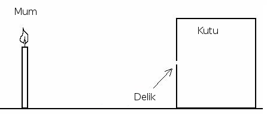
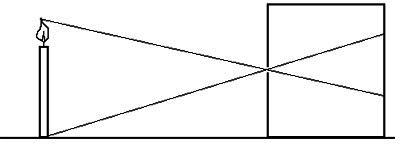

İlginç bir durum şu; ışık hüzmeleri düz gitmeye mecburlar, ama ufak bir
delikten geçmeye de mecburlar. Bu durumda geometriye göre kutunun
arkasında, yani deliğin arkasındaki yansıma terse dönmüş olacaktır. Böylece
bir perspektif yansıtma elde edeceğiz. Altta soldaki resimde temsili olarak
bunu görebiliriz. Alt sağdaki resim ise gerçek bir deneyden alınmıştır,
aslında bu deney çok basit, bir kutu, bir mum, kutuda bir delik
yeterli. Kutunun arkasına bakınca hakikaten ters dönmüş bir mum imajı
görüyoruz!

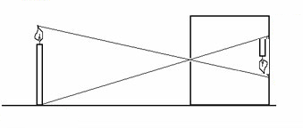

İğne deliği kamera oldukça basit bir model / teknik, az ışıklı ortamlarda pek
başarılı değil; bugünlerde delik yerine mercek (lens) kullanılıyor, böylece
lensin farklı noktalarına düşen ışık hüzmeleri arka planda görüntü oluşumu için
odaklanıyor / toparlanıyor. Merceklerin işleyişi hakkında biraz genel bilgi;
mercekte farklı noktalar ışığı değişik şekillerde "kırarlar'' (refract), ve bu
kırılma odaklama amaçlı kullanılır.

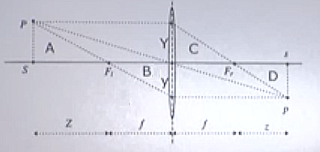

Üstteki mercek te bir perspektif yansıtma oluşturur.

Odak noktaları ilginç, merceğin solunda ve sağında iki $F$ noktası var. Bu
noktaların mercege aynı uzaklıkta olması şart değil, ama eğer mercek
simetrik ise (üstteki gibi) o zaman uzaklık eşit. 

Merceğin işleyişine göre, herhangi bir $P$ noktası için diyelim, eksene
paralel giren $P$ ışığı mercekten çıkınca arka odak noktasından geçmeli,
sol odak noktasından giren $P$ ışığı mercekten çıkınca eksene paralel
gitmeli. Böylece pek çok farklı yerden geçen ışık hüzmeleri aynı yerde
odaklanıyor, iğne deliği kamerasına kıyasla daha fazla ışığı
toparlayabilmiş oluyoruz. 

Üstteki modele göre perspektif yansıtmanın formüllerini nasıl türeteceğiz?
Resimdeki iki üçgen $A,B$ önemli; mesela $P$ noktasını alıp yerini
değiştirsem bu üçgenlerin şekli değişecektir. $A$ üçgeni $P$ noktasının
yüksekliği üzerinden $Y$'yi veriyor, $B$ üçgeninin sağ kısmı ise
$y$'yi. Oranlar şöyle,

$$ \frac{Y}{Z} = -\frac{y}{f} \iff y = -f \frac{Y}{Z} $$

Eksi değeri görüntünün ters dönmesinden ileri geliyor, mum örneğinde mumun tepe
taklak olmasında bu durumu görüyoruz. Dersin ilerisinde negatif işareti
kullanmayacağız, görüntüyü tekrar çevirilmiş kabul edeceğiz. Ayrıca zihinde
canlandırmanın kolay olması için mercekten geçtikten sonra üzerine görüntü düşen
algılayıcı düzlemi sanki mercek ile dış nesne arasındaymış gibi de hayal
edebiliriz. Matematiksel olarak bu iki işlem (hem imajı dikey olarak, hem de
imaj perdesini mercek arkasından önüne almak) $x,y$ eksenlerinin işaretlerinin
tersini kullanmak demektir. Bundan sonra işlemlerimizi bu şekilde yapacağız,
aklımızda olsun.

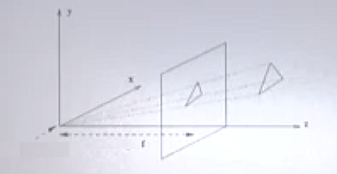

Perspektif transformasyonu $\pi$ o zaman şu şekilde gösterilir, 

$$ 
\pi: \mathbb{R}^3 \to \mathbb{R}^2; \qquad 
X \to x = \pi(X) =  \left[\begin{array}{l}
f \frac{X}{Z} \\ f \frac{Y}{Z}
\end{array}\right]
$$

3D objeyi 2D'ye çevirmek böyle oluyor. Görüldüğü gibi oldukça basit bir işlem,
tek pürüz, işlemin gayrı lineer olması, çünkü $Z$ ile *bölüyoruz*. Eğer bir
matris ile bu işi yapıyor olsaydım (ki bu çarpma, toplama işlemleri anlamına
gelirdi), bu matrisin tersi ile geriye gitmek kolay olurdu. Ama üstteki durumda
işimiz zorlaştı, çünkü gayrı lineer bir işlem yaptık. Bu zorluk tüm dersimiz
boyunca bizi uğraştırmaya devam edecek.

Fakat en azından notasyonel olarak işimizi biraz kolaylaştırabiliriz, eğer $x$'i
ve $\pi(X)$'i $Z$ ile çarparsak, sağ tarafta bölümden kurtulmuş oluruz, ayrıca 2
boyutta homojen kordinat sistemine geçersek

$$ 
Zx = Z \left[\begin{array}{r}
x \\ y \\ 1
\end{array}\right]  = 
\left[\begin{array}{rrrr}
f & 0 & 0 & 0 \\
0 & f & 0 & 0 \\
0 & 0 & 1 & 0
\end{array}\right]
\left[\begin{array}{r}
X \\ Y \\ Z \\ 1
\end{array}\right] = K_f \Pi_0 X
$$

Böylece gayrı lineer kısmı ayırmış olduk, ve en sağdaki eşitlikte görüldüğü gibi
sadece lineer bir çarpımla iş görebiliyoruz. Ayrıca içinde $f$'ler olan matrisi
$K_f$ ve $\Pi_0$ olarak ayrıştırabiliriz,

$$ K_f =
\left[\begin{array}{rrr}
f & f & 0 \\
0 & f & 0 \\
0 & 0 & 1
\end{array}\right], \qquad
\Pi_0 =
\left[\begin{array}{rrrr}
1 & 0 & 0 & 0\\
0 & 1 & 0 & 0\\
0 & 0 & 1 & 0
\end{array}\right]
$$

$\Pi_0$'ya standart yansıtma matrisi (standard projection matrix) ismi
veriliyor. Bu niye faydalı? Çünkü $\Pi_0$ her durumda aynı, genel (generic) bir
matris. Sadece $K_f$ kameraya özgü bir matris, her değişik $f$ için (ki farklı
kameraların farklı $f$'leri olacaktır) farklıdır.

İlginç bir yaklaşıksallaşma $Z$'yi, yani kameradan olan uzaklığı sabit kabul
etmektir, $Z$ yerine mesela $\lambda > 0$ diyelim; bu argüman der ki "eğer
modellediğimiz 3D noktalar kameradan yeterince uzakta ise $Z$'yi tek bir sabit
ile gösterebiliriz''. $\lambda$ tabii ki gerçek uzaklıktır, çünkü onu $Z$'nin
yerine geçecek şekilde seçeceğiz, ve $Z$ gerçek dünya kordinatından geliyor.

Biraraya Getirelim

Bu noktada her şeyi biraraya getirmeye uğraşalım - perspektif, kamera
hareketi... $X_0$ dünya kordinatlarında (dikkat hareket eden kamera kordinatında
değil) bir 3D nokta. Bu noktayı kameranın katı gövde hareketi üzerinden kamera
kordinatı $X$'e çevirmek istiyoruz,

$$ X = RX_0 + T $$

Homojen kordinatlarda, yani $X$ vektörünün sonuna 1 ekleyerek $X =
\left[\begin{array}{cccc} X&Y&Z&1 \end{array}\right]^T$

$$ X = gX_0 = \left[\begin{array}{rrr}
R & T \\ 0 & 1
\end{array}\right] X_0 $$

Üstteki matrisin tersi alınabilir olduğunu hatırlayalım. Homojen formatına
geçmemizin bir sebebi de buydu zaten, ki üstteki matris tersi alınabilir
olabilsin. Tamamını bir araya koyunca,

$$ \lambda x = K_f \Pi_0 g X_0 $$

Eğer odak uzaklığı (focal length) $f$ biliniyorsa görüntü kordinatlarını
değiştirerek onu 1'e normalize edebiliriz, ki bu duruma $K_f$'i üstteki
formülden çıkartmak mümkündür,

$$ \lambda x = \Pi_0 X = \Pi_0 g X_0 $$

çünkü iki üstteki formüldeki çarpımlara sağdan sola bakarsak dünya
kordinatından kameraya, oradan iki boyutlu görüntüye, ve $K_f$ olduğu
durumda odak uzaklığı üzerinden ölçekleme yapılıyor. Üstteki iki formülü ve
benzer form'ları sağdan sola okumak lazım.

Piksel Kordinatları

Dönüştürme, değiştirme daha bitmedi! Bir tane daha dönüşüm lazım, 

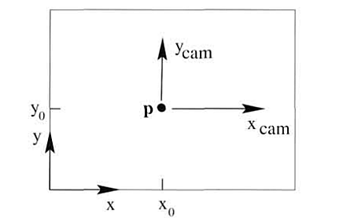

Şimdiye kadar yaptıklarımız bize görüntüyü üstteki resim gibi verecek. Dış
dünyadaki objeler $x_{cam},y_{cam}$ kordinatlarına göre eksenlerin altına ya da
üstüne düşebilecekleri için eksi, artı değerlere sahip olabilecekler. Fakat biz
kameradan gelen değerleri hep artı değer olarak görmek istiyoruz, bu amaçla
kordinat merkezini sol alt köşeye taşımak lazım, $o_x,o_y$ ile bunu yaparız.

Ayrıca kameranın görüntüsü dikey olarak yatay durumundan daha "yassı''
olabilir, bu durumda görüntüdeki pikseller de bir dikdörtgeni
andıracaklardır. Halbuki dış dünyayı herhangi bir yönde yassılaşmış olarak
değil, eşit ölçeklerde görmek isteriz, eğer varsa bu eksikliği nötralize etmek
için yatay / dikey ölçeklemeyi düzeltmemiz gerekir, buna kaykı -skew- düzeltmek
deniyor) $s_\theta$ ile yapılır, fakat pratikte biz bu durumun olmadığını farz
edeceğiz.

Bir ölçekleme daha, piksel kordinatları birim ölçekte değil ise bunu da
$s_x,s_y$ ile düzeltebiliriz. 

Hepsi bir arada tek matris $K_s$ içinde

$$ K_s = \left[\begin{array}{rrr}
s_x & s_\theta & o_x \\
0 & s_y & o_y \\
0 & 0 & 1
\end{array}\right] $$

Hepsi bir arada

$$ 
\lambda
\left[\begin{array}{c}
x' \\ y' \\ 1
\end{array}\right]
=
\underbrace{
\left[\begin{array}{rrr}
s_x & s_\theta & o_x \\
0 & s_y & o_y \\
0 & 0 & 1
\end{array}\right]
}_{K_s}
\underbrace{
\left[\begin{array}{rrr}
f & f & 0 \\
0 & f & 0 \\
0 & 0 & 1
\end{array}\right]}_{K_f}
\underbrace{
\left[\begin{array}{rrrr}
1 & 0 & 0 & 0\\
0 & 1 & 0 & 0\\
0 & 0 & 1 & 0
\end{array}\right]}_{\Pi_0}
\left[\begin{array}{r}
X \\ Y \\ Z \\ 1
\end{array}\right]
$$

Elimizde pek çok transformasyon matrisi var artık. Peki bu matrislerden hangisi
kameranın içsel yapısıyla alakalıdır acaba? Yani marka ABC satın alıyorum, ya da
onun yerine marka XYZ alıyorum; bu iki kamera arasındaki imalatla alakalı hangi
parametreler birinden ötekine değişir? Odak uzaklığı $f$ bunlardan biri, bu
parametre kameranın görüntü uzaklaştırma, yakınlaştırma (zoom in, out), yani
donanımı ile alakalı bir durum.

$K_s$ matrisi de kameranın iç yapısıyla, donanım ayarlarıyla alakalı. Mesela bir
kameradaki çözünürlüğü değiştirdiğimiz zaman $K_s$ içindeki değerleri
değiştirmemiz gerekir.

O zaman bu iki matrisi birleştirebiliriz, $K = K_sK_f$, ki $K$'ye içsel parametre
matrisi (intrinsic parameter matrix) adı verilir.

$$ K = K_sK_f = \left[\begin{array}{rrr}
fs_x & fs_\theta & o_x \\
0 & fs_y & o_y \\
0 & 0 & 1
\end{array}\right] $$

Daha kısa olarak $\alpha_x = fs_x,\alpha_y=fs_y$. En-boy oranı (aspect
ratio) ise $\sigma = \alpha_x/\alpha_y$.

Devam edelim,

$$ \lambda x = K\Pi_0 X = K \Pi_0 g X_0 = \Pi X_0 $$

Dikkat, yeni bir $\Pi$ matrisi var, bu bir $3 \times 4$ matris ve $\Pi =
K\Pi_0g$ olarak tanımlı. Bu matrise genel yansıtma matrisi (general projection
matrisi) adı veriliyor. $\Pi = (KR, KT)$ yani.

$K$ matrisi içsel parametreler ise, dışsal parametreler $g$ içinde. Bir
kamerayı hareket ettirdiğimizde içsel parametreleri aynı kalacak, dışsal
parametreler 6 serbestlik derecesi üzerinden değişecek.

Konumuzdaki çoğu uygulama iki ana dala ayrılabilir, kamera kalibrasyonu bilinen
durum, ya da bilinmeyen durum. Kamera bizimse hesaplarımıza başlamadan önce onu
inceleyip, odak uzaklığını kendimiz set edip kalibrasyonu öğrenebiliriz, yani
$K$ bilinir. Bu kolay senaryo. Kalibrasyonsuz durum da olabilir; elimizde sadece
arka arkaya "bir'' kameradan gelmiş görüntüler var, ama kamera hakkında hiçbir
şey bilmiyoruz. İtiraf etmek gerekirse bu senaryo oldukça işleri zorlaştırıyor.

Not: Bazı görüntü dosyalarının içinde içsel parametreler kaydedilmiş
olabiliyor bu arada, İnternet'ten bir sürü resim indirip 3D tekrar
oluşturma yapmak istenirse bunu akılda tutmak faydalı.

Tüm bunlardan sonra $x',y'$ formülüne dönelim, unutmayalım üstteki
transformasyonlar lineer değil demiştik, $Z$ ile, yani $\lambda$ ile bölüm
gerekiyordu, o zaman nihai sonuç

$$ 
x ' = \frac{\pi_1^TX_0}{\pi_3^TX_0}, \qquad
y ' = \frac{\pi_2^TX_0}{\pi_3^TX_0}, \qquad
z' = 1
$$

ki $\pi_1^T,\pi_2^T,\pi_3^T \in \mathbb{R}^4$ yansıtma matrisi $\Pi$'nin satırları. 

[Küresel perspektif izdüşümü, yarıçapsal yamultma (radial distortion),
preimage, coimage atlandı]

Ekler

[1]'deki programı kullanarak kamera matris parametrelerindeki değişimin
görüntüye nasıl yansıdığını görebiliriz. Her resim tek bir parametrenin
değiştirilmesiyle elde edilmiştir. 

Odak Uzaklığı

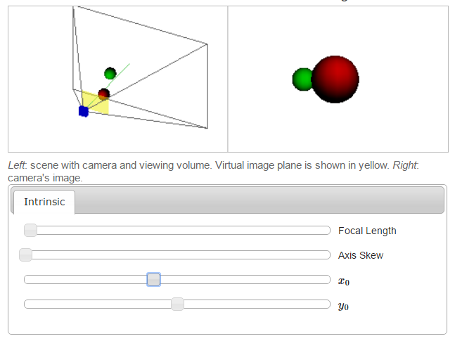
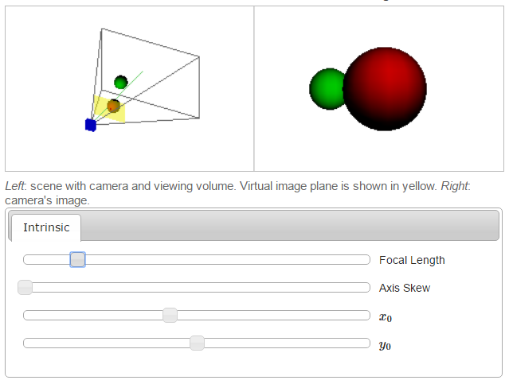

Kaykı, $x_0$

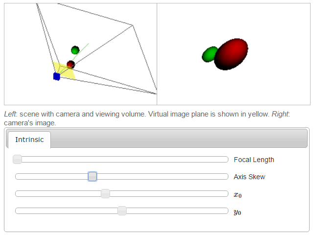
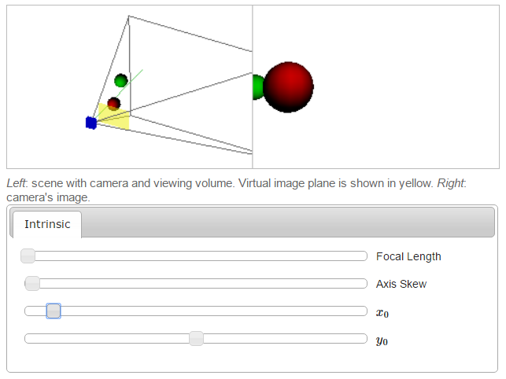

$y_0$

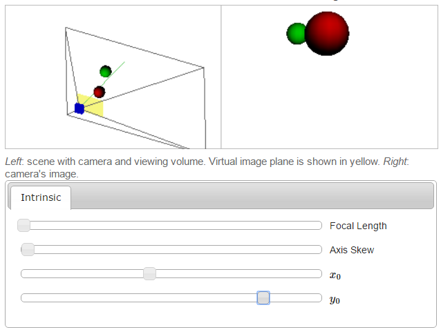
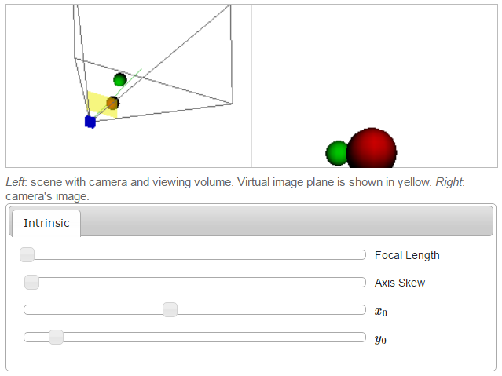

Kaynaklar

[1] Kyle Simek, Dissecting the Camera Matrix, Part 3: The Intrinsic Matrix,
[http://ksimek.github.io/2013/08/13/intrinsic/](http://ksimek.github.io/2013/08/13/intrinsic/)

