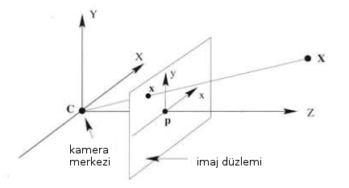
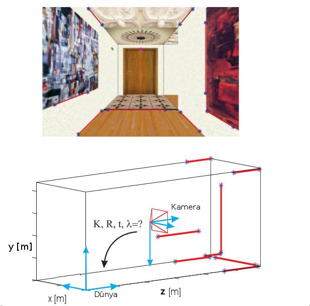
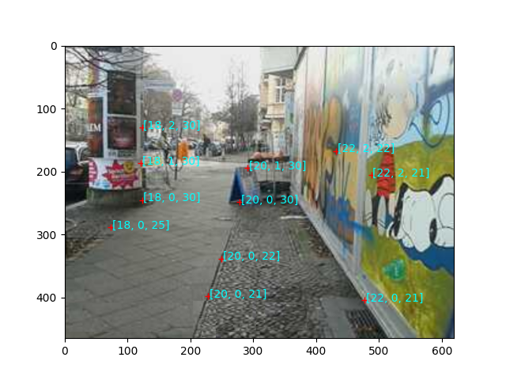

# Yansıtma Matrisini Bilinen 3D-2D Eşlemelerinden Hesaplamak

Çoğu kaynakta ve bu ders anlatımlarında kameraya yansıtılan görüntü, dünya
kordinatları kavramları birbirine karışık şekilde gösterildi.



Fakat dünya kordinat sistemi, kamera merkezi gibi kavramları birbirinden
ayırmamız gerekiyor. Çünkü uygulamalarda kamera z kordinatı üzerinde
durmuyor ve kamera merkezi ile dünya merkezi birbirinden farklı, ayrıca
çoğunlukla ne $P$'nin ne de onu oluşturan içsel parametre matrisi
(intrinsic parameter matrix) $K$ biliniyor.

Önce kameranın nerede olduğuna bakalım. Kamera çoğunlukla dünya merkezinden
değişik bir yerdedir, mesela elle tutulan bir cep telefonu durumunda boy
yüksekliğinde ve $z$ kordinatına yönünde (ama üzerinde olmayabilir) doğru
tutulmaktadır. Önündeki objelerin yerleri dünya (world) kordinatlarına
göredir, ayrıca kameranın kendisi dünya merkezinden o noktaya bir
döndürülme ve taşınma (rotation and translation) sonucu gelmiştir.



Bu döndürülme ve taşınma matrislerini $R,T$ olarak tanımlarsak,

$$ P = K \left[\begin{array}{c|c} R & t \end{array}\right]$$

olduğunu görmüştük, ve bu matris 3 x 4 boyutundadır, ki $K$ içsel parametre
matrisi idi. Ayrıca biliyoruz ki $P$'yi baz alarak bir $X_i$ üç boyutlu
noktasının iki boyutlu noktaya yansıması

$$ \lambda_i x_i = PX_i$$

olarak hesaplanıyor. Kordinatlar homojen kordinatlar, yani (vektörleri bir
kerelik net olması için koyu renkle gösterirsek)
$\mathbf{x}_i = \left[\begin{array}{ccc}x_i&y_i&1\end{array}\right]^T$,
aynı şekilde
$\mathbf{X}_i=\left[\begin{array}{cccc}X_i&Y_i&Z_i&1\end{array}\right]^T$.

$P$'yi nasıl hesaplarız? Bu hesap için elimizde belli sayıda dış dünyada üç
boyutlu ve onun iki boyutlu yansımalarını içeren, birbiri ile eşlenmiş bir
veri seti olduğunu varsayacağız. Bu veriyi elde etmek zor değil,
profosyonel ölçümler için kamera önüne belli uzaklıkta, gerçek boyutları
kesin bilinen bir obje konur, ve kamera görüntüsünde bu cismin bilinen
noktalarının nereye tekabül ettiğine bakılır, vs. Ya da kabaca yeri bilinen
objelerin piksel yerleri kaydedilir. Dış dünyada şöyle bir resim olduğunu
düşünelim,


Bu resimde ölçümleri bir dünya merkezine göre almak lazım. Resimde kamerayı
ben tutuyorum, ve şimdi ölçümler için merkezin 20 metre arkamda ve 20 metre
solumda olduğunu farzediyorum ve kameranın yerden yüksekliğini 2 metre
kabul ediyorum. Şimdi bu merkeze göre resimde görülen bazı noktaları elle
kendim seçerim, ve kabaca onların uzaklıklarını biliyordum, ona göre üç
boyutlu uzaklık atayıp, ayrıca bu noktaların hangi piksel kordinatında
olduğunu bir imaj programı üzerinden yine kendim bulup bu eşlemeyi bir yere
kaydederim. Görsel olarak irdeleme kolay olsun diye bunları aynı resim
üzerinde ekrana basarsak,

```python
w = 620; h = 465
from PIL import Image
im = Image.open('out-cam.png')
plt.imshow(im)
x = [[228, 398],\
     [249, 338],\
     [123, 245],\
     [121, 186],\
     [278, 248],\
     [488,205],\
     [291,194],\
     [432,167],\
     [73,288],\
     [477,404],\
     [123,130]]
X = [[20,0,21],\
     [20,0,22],\
     [18,0,30],\
     [18,1,30],\
     [20,0,30],\
     [22,2,21],\
     [20,1,30],\
     [22,2,22],\
     [18,0,25],\
     [22,0,21],\
     [18,2,30]]
for i in range(len(x)): 
    plt.plot(x[i][0],x[i][1],'r+')
    plt.text(x[i][0]+2,x[i][1]+2,str(X[i]),color='cyan')
plt.savefig('out-cam2.png')
```




Bunlar çok mantıksız üç boyutlu değerler değiller herhalde. 

$P$'nin hesabına gelelim. Her veri noktası $i$ için elimizde bir
$\lambda_i x_i = PX_i$ denklemi olduğuna göre, önce her bu tür denklemi
$PX_i-\lambda_ix_i=0$ olarak düzenlersek ve bu denklemleri üst üste gelecek
şekilde koyarsak,

$$ 
\left[\begin{array}{ccccccc}
X_1^T & 0 & 0 & -x_1 & 0 & 0 & \dots \\
0 & X_1^T & 0 & -y_1 & 0 & 0 & \dots \\
0 & 0 & X_1^T & -1 & 0 & 0 & \dots \\
X_2^T & 0 & 0 & 0 & -x_2 & 0 & \dots \\
0 & X_2^T & 0 & 0 & -y_2 & 0 & \dots \\
0 & 0 & X_2^T & 0 & -1 & 0 & \dots \\
\vdots & \vdots & \vdots & \vdots & \vdots & \vdots &  
\end{array}\right]
\left[\begin{array}{c}
p_1^T \\ p_2^T \\ p_3^T \\ \lambda_1 \\ \lambda_2 \\ \vdots
\end{array}\right] = 0
$$

sistemini elde ederiz. $p_1,p_2,p_3$ degiskenleri $P$ matrisinin
satırlarıdır. Üstteki matris daha fazla veri noktası için sağa ve aşağı
doğru uzayacaktır tabii.

Üstteki matrisi, $M$ diyelim, görüldüğü gibi hazırladıktan sonra, ve
çarpılan kolon vektörüne $v$ dersek artık,

$$ Mv = 0$$ 

denklemini çözebiliriz. Bu denklemi yaklaşıksal olarak çözmek için problemi
bir $||v||=1$ şartına bağlı olmak üzere $||Mv||$ minimizasyon problemi
olarak görebiliriz, yani "sıfıra olabildiğince yaklaşma problemi'' olarak,
ki bu problem çözümü için SVD kullanılabilir, daha fazla detaylar [3]
yazısında. Peki $||v||=1$ şartını nasıl getirebiliyoruz? Bunun sebebi
homojen kordinat sisteminin getirdiği bir avantajla alakalı; homojen
kordinat sistemindeki noktalar "belli bir ölçek (up to scale)'' içinde
tanımlıdır, ve mesela 2 boyutlu bir nokta ve herhangi bir sabit $\alpha$
için
$\mathbf{x} = \left[\begin{array}{ccc}x&y&w\end{array}\right] =
\left[\begin{array}{ccc}\alpha x& \alpha y& \alpha w\end{array}\right] =
\left[\begin{array}{ccc}x/w&y/w&1\end{array}\right]$
noktalarının hepsi aslında aynı 2 boyutlu noktadır. Bunun sonucu olarak $M$
de belli bir ölçek içinde tanımlı olacaktır, ve o zaman $||v|| = 1$ farz
edebiliriz. Bu tabii ki hesabımız için faydalı oldu yoksa SVD bazlı
minimizasyon kullanamazdık.

```python
from scipy import linalg

def compute_P(x,X):
    n = x.shape[1]
    if X.shape[1] != n:
        raise ValueError("Number of points don't match.")
        
    M = np.zeros((3*n,12+n))
    for i in range(n):
        M[3*i,0:4] = X[:,i]
        M[3*i+1,4:8] = X[:,i]
        M[3*i+2,8:12] = X[:,i]
        M[3*i:3*i+3,i+12] = -x[:,i]
    print M.shape
    U,S,V = linalg.svd(M)
    
    return V[-1,:12].reshape((3,4))

xx = np.array(x)
# h'den cikar cunku imaj programlari sol ustu (0,0) olarak kabul 
# ediyor, bizim hesap icin sol at (0,0) olmali
xx[:,1] = h-xx[:,1] 
xx = np.hstack((xx,np.ones((len(x),1))))
XX = np.array(X)
XX = np.hstack((XX,np.ones((len(X),1))))

P = compute_P(xx.T,XX.T)
print P
```

```
(33, 23)
[[ -4.01225744e-02   5.31972373e-03  -1.06308256e-02   9.71131258e-01]
 [ -9.79700368e-04  -2.64464969e-02  -1.09893337e-02   2.33086445e-01]
 [ -1.80165364e-05   5.44992018e-06  -3.40782252e-05   8.40827305e-04]]
```

$P$'yi hesapladık. Bu $P$'yi şimdi resme bir üç boyutlu şekil yansıtmak
için kullanalım. Mesela iki metre solumdan bir metre sağımdan çıkan yerden
uzağa doğru yol üzerinde giten iki tane çizgiyi iki boyuta yansıtalım.

```python
res1 = np.array([[18, 0, 20+i, 1.] for i in np.linspace(0,30,100)])
res2 = np.array([[21, 0, 20+i, 1.] for i in np.linspace(0,30,100)])

X3 = np.dot(P, res1.T)
X3 = X3 / X3[2]
im = Image.open('out-cam.png')
plt.imshow(im)

for xx in X3.T: 
    plt.hold(True)
    if xx[0] > w or xx[0] < 0: continue
    if xx[1] > h or xx[1] < 0: continue
    plt.plot(xx[0],h-xx[1],'r.')

plt.hold(True)

X3 = np.dot(P, res2.T)
X3 = X3 / X3[2]
for xx in X3.T: 
    plt.hold(True)
    if xx[0] > w or xx[0] < 0: continue
    if xx[1] > h or xx[1] < 0: continue
    plt.plot(xx[0],h-xx[1],'r.')

plt.savefig('out-cam4.png')
```


$R,T$ Hesabı

Bilinen $P$ ve $R,T$ üzerinden $K$'yi hesaplamak için
$\left[\begin{array}{c|c}R&t\end{array}\right]$'nin cebirsel olarak neyi
ifade ettigini hatırlayalım,

$$ 
\left[\begin{array}{c|c}
R & t
\end{array}\right] = 
\left[\begin{array}{ccc|c}
r_{1,1} & r_{1,2} & r_{1,3} & t_1 \\
r_{2,1} & r_{2,2} & r_{2,3} & t_2 \\
r_{3,1} & r_{3,2} & r_{3,3} & t_3 
\end{array}\right]
$$

Çoğunlukla üstteki matrise bir ekstra
$\left[\begin{array}{cccc}0&0&0&1\end{array}\right]$ satırı eklenir, 
böylece matris kare haline gelir, ve böylece dönüş ve taşınmanın basit
çarpım olarak ayrıştırılabilmesi sağlanır. 

$$ 
\left[\begin{array}{c|c} 
R & t \\  \hline 0 & 1
\end{array}\right] =
\left[\begin{array}{c|c} 
I & t \\  \hline 0 & 1
\end{array}\right]
\left[\begin{array}{c|c} 
R & 0 \\  \hline 0 & 1
\end{array}\right]
$$

$$ 
= \left[\begin{array}{ccc|c}
1 & 0 & 0 & t_1 \\
0 & 1 & 0 & t_1 \\
0 & 0 & 1 & t_1  \\
\hline
0 & 0 & 1 & 1
\end{array}\right]
\left[\begin{array}{ccc|c}
r_{1,1} & r_{1,2} & r_{1,3} & 0 \\
r_{2,1} & r_{2,2} & r_{2,3} & 0 \\
r_{3,1} & r_{3,2} & r_{3,3} & 0 \\
\hline
0 & 0 & 1 & 1
\end{array}\right]
$$

$P$ Üzerinden $K,R,T$

$K$'yi hesabı için şunu hatırlarız: Her matrisin bir QR ayrıştırmasının
olduğunu biliyoruz. O zaman eldeki $P$'yi ayrıştırarak $R,t$'yi bilmeden
direk $K,R,t$ hesaplarını yapabiliriz.

```python
K,R = linalg.rq(P[:,:3])
T = np.diag(np.sign(np.diag(K)))
if linalg.det(T) < 0: T[1,1] *= -1
K = np.dot(K,T)
R = np.dot(T,R) 
t = np.dot(linalg.inv(K),P[:,3])
print K
print R
print t
```

```
[[  2.99407581e-02   5.97285792e-03   2.86183659e-02]
 [  0.00000000e+00  -2.79384510e-02   6.37066885e-03]
 [  0.00000000e+00   0.00000000e+00   3.89309986e-05]]
[[-0.88366792 -0.15133543  0.44297698]
 [-0.07045937  0.9785196   0.19373918]
 [-0.46278126  0.13998922 -0.87534937]]
[ 12.47297147  -3.41799407  21.59788692]
```

Gerçi ayrıştırma özgün (unique) değil, bir işaret belirsizliği olabiliyor,
ama bunun çaresi var, detaylar için [1, sf. 108]. Bu hesabın bize ne
verdiğini tekrar vurgulamak lazım - sadece $P$'ye bakarak hem $K$'yi hem de
kameranın ne kadar hareket ettiğini bulmuş olduk. Bu kuvvetli bir özellik.

Bu şekilde bulunan $R,t$ belki ölçümlerin kalite kontrolu için
kullanılabilir. Mesela $R,t$'nin ne olduğunu kesin biliyorduk, ama $P$
ayrıştırması bize beklediğimizden farklı bir $R,t$ verdi. O zaman belki
2D-3D eşleştirmesi daha iyi olabilirdi.


Kaynaklar

[1] Solem, *Computer Vision with Python*

[2] *Dissecting the Camera Matrix, Part 2: The Extrinsic Matrix*, [http://ksimek.github.io/2012/08/22/extrinsic/](http://ksimek.github.io/2012/08/22/extrinsic/)

[3] Bayramlı, Lineer Cebir, *Lineer Cebir ile Minimizasyon*


