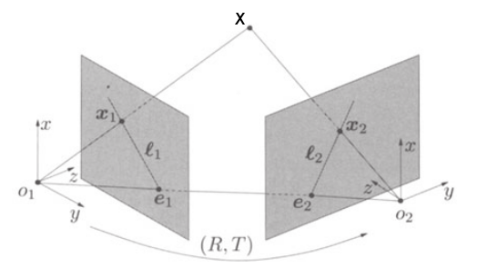
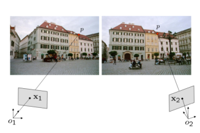
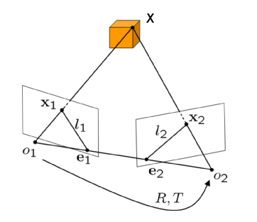
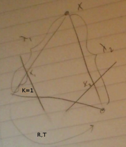
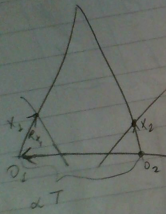
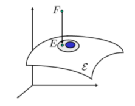

# Ders 8

İki Görüntüden Tekrar Oluşturma (Reconstruction from Two Views)

Problemi formüle edelim. İki faraziyemiz olacak. Faraziyeler şart, çünkü zor
problemler ile uğraşıyoruz, ve bazı faraziyeler ile işimizi kolaylaştırmamız
gerekli. Araştırmacılara tavsiyem yeni bir problem üzerinde uğraşıyorlarsa ise
güçlü faraziyeler ile başlayıp çözüm alanını kısıtlamaları ki bu şekilde çözüm
daha rahat bulunabilsin; ve yer geldiğinde kısıtlamalar gevşetilebilir. Bunu
vurguladım çünkü bazı öğrencileri görüyorum, herşeyi tek seferde yapmaya
uğraşıyorlar, sonra o koca problem için bir program alelacele kodlanıyor, ve
program işlemeyince moralleri bozuluyor, vs. Önce kısıtlı başlayın, sonra
genelleştirirsiniz.

Faraziyeler şunlar;

1) İki imajdaki aynı objelerin her iki görüntüdeki ilginç noktalarını ve o aynı
noktaların birbirleri ile nasıl eşleştiğini biliyoruz.

2) İki imaj statik bir dünyayı resmediyor, yani 1. ve 2. görüntü arasında
resimdeki objeler hareket etmiyorlar.

3) Kameranın iç parametreleri sabit ve biliniyor.

Bu bilgilere ve faraziyelere dayanarak ve eğer kameranın izafi yerini ve
duruşunu biliyorsak 3D yer bilgisini üçgenleme (triangulation) ile
hesaplayabiliriz.

Çözmeye uğraşacağımız bir kameranın dış parametreleri ve görüntüdeki objenin 3D
yeri. Elimizde iki resim var, resimdeki ilginç noktaların eşleşmesi var,
kameranın katı gövde hareketini, ve $X$'i bulacağız.

Üstteki aslında çetin bir tavuk-yumurta problemi. Eğer kamera hareketini
biliyor olsaydım iki görüntüdeki eşlemesini bildiğim noktalar üzerinden
hemen 3D yer hesaplayabilirdim. Mesela cep telefonlarında artık hareket
algılayıcıları oluyor, bu bilgi yeterince kesin olsa $R,T$'yi hemen bulmuş
olurdum, imajlara bakmak gerekmezdi. O zaman üstteki resimde gösterilen iki
çizginin kesiştiği noktayı üçgenleme ile bulurdum, ve 3D noktası $X$
bulunmuş olurdu. Bu hesap çok basittir. Ya da tam ters yönden, $X$'i bir
şekilde biliyorsak kamera hareketi hesaplanabilir. Eğer elimizde yeterince
nokta var ise çözüm tek olacaktır. 3D tekrar oluşturma hesaplarının zorluğu
bu iki bilgiyi de aynı anda kestirmemiz gerektiğidir.

Bu derste takip edeceğimiz yöntem önce kamera hareketini, sonra obje yerini
bulmak. Dediğimiz gibi bu problem yumurta-tavuk problemi, fakat bu iki problemin
birbiriyle ilişkisini kesmek (decouple) mümkün.

Tipik bir resim üzerinde görelim,

Manzara iki farklı yönden görüntülenmiş. Birinde olan bazı noktalar diğerinde
olmayabilir ama çoğu nokta iki tarafta da var. Mesela bir 3D noktası $P$'yi
düşünelim, bu nokta bir bakış açısında 2D $x_1$ noktasına, diğerinde $x_2$
noktasına düşüyor. Kamera merkezleri $o_1$ ve $o_2$. İki bakış açılı örnek
böyle. Bu derste üstteki gibi, yani iki bakış açı üzerinden hesaplarla oldukça
çok uğraşacağız, fakat çoklu bakış açısından da bu hesapları nasıl
genelleştirebileceğimizi göreceğiz [dersimizin adına sadık kalmak lazım!].

Notasyonu netleştirelim (üstteki gibi bir resim daha)

Kamera orijin noktaları $o_1,o_2$ görülüyor. Bu iki orijini bir düz çizgi ile
birleştirelim, bu çizginin her iki görüntü düzlemini kestiği noktalar $e_1,e_2$
eş kutuplar (epipoles) olarak isimlendirilir. $X,e_1,e_2$ noktalarının üzerinde
olduğu düzlem ise eş kutupsal düzlemdir (epipolar plane).

Notasyon böyle. Peki o zaman tekrar oluşturma (reconsruction) problemini nasıl
tanımlarız? Aslında bu problemi bir maliyet (cost) fonksiyonu üzerinden
formülize etmek oldukça basit. Bilimde pek çok problem belli bazı parametrelerin
hesapsal tahminiyle alakalıdır, ve bu tahmini yapabilmek için tipik olarak bir
maliyet tanımlanır, ki bu maliyet fonksiyonu verilen belli parametre değerleri
için bu değerlerin iyi mi kötü mü olduğunu cevaplar. Tabii bir sonraki adım o
maliyeti minimize etmeye uğraşmak, ve bu minimizasyonu sağlayan "optimal''
parametreleri bulmaya uğraşmaktır.

Diyelim ki elimizde iki değişik açıdan alınmış görüntüde eşleşmesi yapılmış 100
tane nokta var, $x_1^j,x_2^j$, $j \in \{1,..,100\}$, yani $j$ bir indis. Bu
noktalar 3D $X_j$ noktalarından geliyorlar, tahmin etmeye çalıştığımız onlar -
bilinmeyen değişkenler. Ayrıca $R,T$ de bilinmiyor tabii, 6 tane bilinmeyen
değişken de buradan geliyor. Yani bilinmeyen parametreler çok, 100 x 3 (çünkü
$X_1$'in 3 tane öğesi var) artı 6 tane bilinmeyen var. Optimizasyon bağlamında
bu 306 boyutlu bir uzayda iş yapmaya çalışacağız demektir, ve bu pek iyi bir şey
değil!

Problemi çözmek için yansıtma hatasını minimize etmeye uğraşabiliriz, 

$$ E(R,T,X_1,..,X_{100}) = 
\sum_{j} || x_1^j - \pi(X_j)||^2 + || x_2^j - \pi(R,T,X_j)||^2
$$

Üstteki formülün eşitliğin sağ tarafının ilk teriminde kendimizi 1. kameranın
kordinat dünyasına alıyoruz; 3D $X$ noktalarını kameraya yansıtıyoruz, ve
aradaki hatayı hesaplıyoruz. İkinci terimde 2. kamera kordinat dünyasındayız,
aynı $X$ noktalarını bu sefer rotasyon, yer değiştirme sonrası 2. kameraya
yansıttıktan sonra o kameradaki yansıtma hatasını hesaplıyoruz. Minimizasyonun
amacı $E()$ içindeki parametrelerin en optimal olanlarını bulmak ki $E$ hatası
en az olsun.

Üstteki yaklaşıma demet ayarlaması (bundle adjustment) ismi veriliyor; demet
çünkü pek çok parametreyi aynı anda vererek optimize etmeye uğraşıyoruz. Tek
problem maliyet fonksiyonu içbükey (convex) değil. Optimizasyon dersinden
hatırlayabileceğimiz üzere eğer elimizde çok boyutlu ve içbükey olmayan bir
problem var ise, bu kötü haber, bu çözümü büyük ihtimalle bulamayacağız
demektir. Bilim dalımız aslında hala bu problemi nihai olarak çözmek için yoğun
araştırma yapıyor, çünkü çözüm bulunabildiği zaman bile çözüm özgün değil, vs.

Üstteki problemin çözümü için iki değişik yaklaşım var. Birisi problem tanımını
olduğu gibi almak, ve bir şekilde "becerikli'' bir algoritma ile minimizasyonu
iyi becermeye uğraşmak. Mesela bir yaklaşıma göre birkaç nokta ile işe başlanır,
minimize edilir, sonra ötekiler eklenir ve rafine ede ede nihai sonuca
erişilmeye uğraşılır. Eğer varılan sonuçtan memnun olunmadıysa, optimizasyon
başlangıç noktası rasgele olarak tekrar seçilir, ve rutin tekrar işletilir,
böylece iyi başlangıç noktası ile daha iyi sonuca varılmaya uğraşılır, fakat
tahmin edileceği üzere bu kolay bir iş değil.

Bu derste takip edeceğimiz yöntem farklı maliyet fonksiyonlarıyla çalışmak; bu
fonksiyonlar orijinal maliyete benzeyecekler, fakat biraz daha basit oldukları
için minimize edilmeleri daha kolay olacak. Mesela $R,T$ ile $X$ noktalarının
arasındaki ilişki kesilecek, bu parametreler ayrı ayrı optimize edilecek. Bu
ilişki kesimi nasıl oluyor? Biraz sihirli bir yaklaşım gibi geliyor kulağa,
kullanacağımız numara eş kutupsal kısıtlama (epipolar constraint) kavramını
devreye sokmak, böylece 8-nokta algoritmasını (8-point algorithm) elde etmiş
olacağız.

Kamera matrisi $K$'nin bilindiğini varsayıyoruz. Ayrıca $K = 1$ alacağız, yani
her şeyin kameranın odak uzaklığının birimi üzerinden tanımlı olduğunu
farzedeceğiz. Birinci kamera için sadece bilinmeyen derinlik bilgisi bilinmeyen
bir yansıtma var. İkinci kamera için rotasyon ve yer değiştirme sonrası ardından
bir yansıtma var. Yani,

$$ \lambda_1 x_1 = X, \qquad \lambda_2 x_2 = RS + T 
\qquad (1)
$$

Resim üzerinde

Yani $X$'den $x_1$'e gelmek demek sadece $\lambda_1$ ile ölçeklemektir.  Aynı
durum dönme ve yer değişim sonrası $x_2$ için de geçerli. Tatmin etmemiz gereken
iki denklem bunlar. Bu iki denklemi birleştirerek ve diğer noktaları ekleyerek
yavaş yavaş $X$'i dışarı atmaya uğraşacağız. İlişki kesmeyi bu şekilde
yapacağız. 1. denklemi 2. denklem içine koyalım,

$$ \lambda_2 x_2 = R(\lambda_1x_1) + T $$

İki tarafı soldan $T$'nin eksi bakışımlı hali $\hat{T}$ ile çarpalım ($\hat{T}v
\equiv T \times v$). Niye?  Çünkü biliyoruz ki bir vektörün kendi eksi bakışımlı
matrisi ile çarpımı sıfırdır (ya da vektörün kendisi ile çapraz çarpımı sıfır
verir), böylece eşitliğin sağındaki $T$'den kurtulmaya uğraşıyoruz. O zaman

$$ \lambda_2 \hat{T} x_2 = \lambda_1 \hat{T} R x_1  $$

Böylece $T$'den kurtulmuş olduk, aynı zamanda $X$'den de kurtulmuş
olduk. Dolaylı olarak $X$ hala formülde tabii, çünkü $\lambda_1$ ve $\lambda_2$
3D noktaya olan uzaklıklar, ve $\lambda_1 x_1$ mesela bize 3D noktasını verir.

Devam edelim, üstteki ifadeyi $x_2$'ye yansıtalım. Niye? Çünkü üstteki eşitliğin
sol tarafındaki $\hat{T}x_2$ bir çapraz çarpım, ve bu çapraz çarpım bize
$x_2$'ye dikgen bir vektör verir, ve eğer bu vektörü $x_2$'ye yansıtırsam sıfır
elde ederim, yani sol taraf yokolur. Ayrıca $\lambda_1$ ile bölerim. Geri
kalanlar,

$$ x_2^T \hat{T} R x_1 = 0 $$

olur. Buna eş kutupsal kısıtlama ismi veriliyor. Formül ilginç çünkü iki 2D
noktası $x_1,x_2$ ve döndürme, yer değiştirme arasında bir ilişki kuruyor, 3D
nokta bilgisi ortada yok. Bu bize bir kabiliyet kazandırdı, buradan hareketle
diğer bilinen 2D nokta eşlerini alarak, ve üstteki sınırlamayı kullanarak
bilinmeyen $R,T$'yi hesapsal tahmin etmeye uğraşabilirim.

(1)'den üstteki formüle gelmek için bazı transformasyonlar yaptık, bunlardan
bazılarının tersi alınabilir olmadığına dikkat; mesela son adımda $x_2$'ye
yansıtma yaptık, bu durumda $x_2$'e dikgen olan bilgi yokolmuş oldu. Ya da
$\hat{T}$ ile çarpım işlemi - $\hat{T}$ tersi alınabilir bir matris olmadığı
için bu işlemi de geriye almak mümkün değil. Yani son iki adımın ikisinde de bir
şeyler kaybetmiş oluyoruz aslında. Tabii kaybettiklerimiz yanında
kazandıklarımız var, daha önce belirttiğimiz gibi, 3D bilgisi ile uğraşmak
zorunda değiliz artık. Belli kısıtlamalarla işe başladık, bazı transformasyonlar
sonunda daha zayıf bir kısıtlama elde ettik, ama bir avantaj elde ettik.

Üstteki önemli bir formül, biraz daha üzerinde durmak iyi olur. Formüle bazen
gerekli kısıtlama (essential constraint) ya da iki lineerli kısıtlama (bilinear
contraint) deniyor. Ayrıca formülün ortasındaki $\hat{T} R$ çarpımına, ki bir
$3 \times 3$ matristir, gerekli matris (essential matrix) ismi veriliyor.

Genel kural olarak bir kavrama bir isim verilmişse, hatta birden fazla isim
verilmişse, o konunun önemli olduğunu ve çoğu zaman pek çok kişi tarafından
araştırılmış olduğu sonucuna varabiliriz.

Kolaylaştırmalar ardından buraya geldik, fakat $R,\hat{T}$ çözümü hala zor; $E =
\hat{T}R$ bilindiği durumda bu çarpımdan $\hat{T}$ ve $R$'yi nasıl çıkartacağız?

O hesaba gelmeden önce eş kutupsal kısıtlamanın geometrik anlamına yakından
bakalım. Amacımız bir düzlem tanımlamak, ve düzlemin olma şartını eş kutupsal
sınırlamaya bağlamak.

Eğer 1. kamera orijin kabul edilirse $x_1$'e giden vektör $\vec{o_1x_1}$ olur,
ya da sadece $x_1$. Bu vektörü 2. kamerayı orijin olacak şekilde transforme
edersek $Rx_1$. Bir diğer vektör 2. kamera orijinli $x_2$ noktası /
vektörü. Ayrıca $o_2$ çıkışlı ve $T$'ye oranlı (proportional, $\propto$ işareti
oradan geliyor), bir vektör daha var. Bu üç vektör üzerinden (üçlü çarpımla
-triple product-) bir paralelepipe hacmi hesaplanabilir, ve eş kutupsal
kısıtlama formülünün söylediği bu hacmin sıfır olmasıdır, yani bir düzlem
olmasıdır (sıfır hacimli obje düz demektir)

$$ hacim = x_2^T (T \times Rx_1) = 0 $$

ki o da dolaylı olarak $o_1,o_2$'den çıkan ve $x_1,x_2$'den geçen huzmelerin bir
yerde birleşiyor olmaları anlamına gelir. Artık 3D noktadan bahsetmeye gerek
yok, sadece iki huzmenin kesişiyor olması yeterli. Kesişiyorlarsa bir düzlem
vardır, kısıtlamanın söylediği de budur.

Gerekli matris $E = \hat{T}R$ demiştik, tüm gerekli matrislerinin uzayı gerekli
uzay olarak adlandırılır,

$$ \varepsilon \equiv \bigg\{ 
\hat{T}R \mid R \in SO(3), T \in \mathbb{R}^3
\bigg\}
$$

$E$'den $\hat{T},R$ çıkartmak matris ayrıştırması çağrışımları yapıyor olabilir;
ve hakikaten de Huang ve Faugeras'ın 1989 tarihinde ispatladığı bir teoriye göre
sıfır olmayan bir $E \in \mathbb{R}^3$ matrisi bir gerekli matristir sadece ve
sadece $E = U \Sigma V^T$ şeklinde bir Eşsiz Değer Ayrıştırması (Singular Value
Decomposition -SVD-) var ise, ve bu ayrıştırma $\Sigma =
diag\{\sigma,\sigma,0\}$ olmalı, $\sigma > 0$ için, $U,V \in SO(3)$.

Bu teori gerekli matrisler ve SVD arasında bir eşdeğerlik (equivalence)
tanımlamış oluyor, gerekli matrislerin SVD'si olmalı, ve bu SVD'nin iki eşsiz
değeri olmalı, en küçüğü sıfır, en büyüğü $\sigma$ olacak şekilde ve ondan iki
tane var. Bu çok faydalı çünkü sonuç itibariyle olabilecek mümkün matris
seçeneklerini daraltmış oluyor, ki bu iyi. Gerekli matrisi hesaplayan
optimizasyonumuz bu bilgiyi kullanabilir.

Bir sonraki adım eldeki bir gerekli matristen rotasyon ve yer değişimi
çıkartmak. Ufak bir problem - bu sonuç özgün değil, pratikte 2 tane mümkün çözüm
olabilir. Ama iyi haber $E = U\Sigma V^T$ sonrası alttaki çözümlerden sadece
biri anlamlı pozitif derinlik bilgisi verir.

$$ 
(\hat{T}_1,R_1) = (UR_Z(+\pi/2)\Sigma U^T, UR_Z(+\pi/2)V^T)
$$

$$ 
(\hat{T}_2,R_2) = (UR_Z(-\pi/2)\Sigma U^T, UR_Z(-\pi/2)V^T)
$$

Formüller biraz çetrefil gözüküyor, evet. İspat için [1, sf. 116]. Yani eğer
gerekli matrisi tahminsel hesaplayabiliyorsak, onu kullanarak rotasyon ve yer
değişimini üstteki formüllerle hesaplayabiliriz.

Algoritma

Bir 3D tekrar oluşturma algoritması şöyle olabilir; iki görüntüdeki birbiriyle
bağlantılı 2D noktalar birbirleriyle eş kutupsal kısıtlama üzerinden
ilişkideler. O zaman

1) Belli sayıda eşlenmiş noktayı kullanarak eş kutupsal kısıtlama üzerinden
$E$'yi hesapla.

2) $E$'den $R,T$'yi hesapla. 

Adım \#2 için iki seçenek var. Birincisi direk $E$'yi hesaplamak, ama bu
matrisin gerekli (essential) uzayda olma zorunlulu olduğu için onu gerekli uzaya
yansıt. Yine bir pürüz; Biliniyor ki bu yöntem optimal altı (suboptimal). Diğer
seçenek eş kutupsal kısıtlamalardan $E$'yi hesaplarken o optimizasyon içinde ek
bir kısıtlamayla çözümü gerekli uzayda olmaya zorlamak.

Pratikte ikinci seçeneği kodlamak külfetlidir, çünkü bu bir gayrı lineer, dertli
kısıtlı optimizasyon, ayrıca ek kısıtlamalar SVD'nin her üç eşsiz değeri
üzerinde olmalıdır... Biz lineer, lineer cebirsel bir yaklaşım tercih ediyoruz.

8-Nokta Algoritması

Algoritmanın ismi en az 8 noktaya ihtiyaç duymasından geliyor.  Bu algoritma
için $x_2^TEx_1 = 0$ kısıtlamasını farklı bir şekilde tanımlamaya çalışacağız.

Bu kısıtlama $E$ merkezli bir ikili lineerlik (bilinear) içeriyor. Bu ne
demektir? Bir tekrar düzenleme ile bu kısıtlama ifadesini "$E$'nin öğeleri
çarpı $x_1,x_2$ öğeleri'' şeklinde ifade edebiliriz demektir. Bunun için önce
$E$ matrisinin öğelerini "açarak''' düz bir vektör içine dizelim. Üstsimge $s$
hatırlarsak yığma (stacking) operatörüydü,

$$
E^s =\left[\begin{array}{ccccccccc}
e_{11} & e_{21} & e_{31} & e_{12} & e_{22} & e_{23} & e_{31} & e_{32} &
e_{33} \end{array}\right]^T \in \mathbb{R}^9
$$

olacak. Şimdi

$$ a \equiv x_1 \otimes x_2 $$

tanımlayalım, ki $\otimes$ Kronecker çarpımı. $x_i = \left[\begin{array}{ccc}
    x_i & y_i & z_i \end{array}\right]^T$ üzerinden üstteki çarpımın açılımı

$$ a = \left[\begin{array}{ccccccccc} 
x_1x_2 & 
x_1y_2 & 
x_1z_2 & 
y_1x_2 & 
y_1y_2 & 
y_1z_2 & 
z_1x_2 & 
z_1y_2 & 
z_1z_2 
\end{array}\right]^T \in \mathbb{R}^9 $$

Bu tanımlar sayesinde eş kutupsal kısıtlama

$$ x_2^TEx_1 = a^TE^s = 0 $$

olarak yazılabilir. Böylece bilinen değişkenleri bilinmeyenlerden net bir
şekilde ayırmış olduk, bilinen her şey $a^T$ içinde, bilinmeyenler $E^s$
içinde. Ayrıca kısıtlama bir skalar çarpım haline geldi, ve bu çarpımın
söylediği bir şey var, sonuç sıfır olduğu için $a,E^s$ birbirine dikgen
(orthogonal) vektörler. Eşlenmiş bir çift 2D nokta için yapılanlar bunlar. Tüm
$n$ nokta çiftleri için üstteki denklemi bir lineer sistem haline getirebiliriz,

$$
\chi E^s = 0, \qquad \chi =
\left[\begin{array}{cccc} a^1 & a^2 & \dots & a^n \end{array}\right]^T
$$

Yani $\chi$ içinde $a$ vektörleri bir kolon olarak yanyana diziliyorlar. Lineer
Cebir dilinde "$E$'nin ne olduğunu bilmiyoruz ama biliyoruz ki o $\chi$'in
sıfır uzayında yaşıyor'' diyebiliriz. Bir pürüz bu sıfır uzayından gelen çözümün
özgün olmaması.  $\chi E^s = 0$'i tatmin eden herhangi bir çözüm vektörünün
katları da çözümdür, yani sonsuz tane çözüm vardır.

Bunun negatif sonucu ölçek bilgisini, 8 ya da kaç tane nokta daha olursa olsun
hiçbir zaman gerçek ölçekte tahmin edemiyor olacağımız. İki ev resmine bakıyoruz
mesela, fakat belki maket bir evin resimleri bunlar!  Robot kodlamasına bu
problem çok ortaya çıkar, mesela biz görsel kamera ile yol bulan bir quadcopter
kodu geliştirdik, ek olarak sonar algılayıcısı eklememiz gerekti ki bu eksik
olan ölçek bilgisini elde edebilelim.

Pratikte hesapları kolaylaştırmak için $o_1o_2$ uzaklığı 1'e eşitlenir, yani
birim $o_1o_2$ uzaklığı haline gelir; hesapların sonucu bu birim üzerinden
raporlanmış olur.

Fakat pozitif yönde şu da var; sıfır uzayının *tek boyutlu* olmasını
garantileyebilirsek, evet oradaki çözümün katları da çözümdür ama en azından
ölçekleme problemi tamir edilince elimize tek çözüm geçer. Bunu
garantileyebiliriz; en az 8 nokta gerekliliği (ve algoritmanın ismi) buradan
geliyor. Bunun için $\chi$'nin kertesi tamı tamına 8 olmalıdır. Eğer 8'den daha
fazla eşli nokta var ise bunun zararı yok. Ama daha az var ise, mesela 7, o
zaman sıfır uzayı iki boyutlu olurdu, ve özgün çözüm elde edilemezdi.

Patajolik durumlarda 8'den daha fazla nokta çifti bile özgün nokta bulmaya
yetmez; mesela tüm noktaların 3D dünyada aynı düzlem üzerinde olduğu durumda. O
zaman çözüm dejenere çözümdür, çünkü $a^i$ vektörleri birbirinden bağımsız
değildir. Örnek olarak mesela ev resminde 2D nokta çiftlerinin hepsi evin ön
duvar üzerinden alınmış ise, bu problem çıkartır. Ama bazı noktalar evin ön
duvarı, diğerleri yoldan, diğerleri evin arkasındaki ağaçtan, vs. geliyor ise
8-nokta algoritması düzgün işler.

$E$'nin artı ya da eksi işareti tekrar oluşturulamıyor. Her $E$ için iki $R$ iki
de $T$ mümkündür, yani mümkün $R,T$ çiftleri 4'tür. Ama pratikte $E$'nin
işaretini bulmak kolaydır.

Ayrıca, daha önce söylediğimiz gibi, çoğunlukle hesaplanan $E^s$ öğeleri bir
gerekli matrise tekabül etmez, bir gerekli matrisi bulmak için $E^s$'i gerekli
uzaya yansıtmamız gerekir, yani en yakın gerekli matrisi hesaplamamız gerekir.

$\chi E^s = 0$ hususunda bir nokta daha, eşlemelerde hata olabileceği için
bu ifade tam olarak çözülemeyebilir. O zaman, ona en yakın olabilecek
çözüme erişmeye uğraşırız; yani $||\chi E^s||^2$'yi en az kareler
bağlamında minimize edecek $E^s$'i hesaplarız. Bu minimizasyon $E^s$'i
$\chi^T\chi$'nin en ufak özdeğerine tekabül eden özvektörü olarak seçmek
ile mümkün olabilir. Tabii $\chi^T\chi$ özvektör hesabı ile $\chi$ eşsiz
değer ayrıştırmasının ilişkisi var, bkz [2], ve [3].

Yansıtma için kullanacağımız teorinin ispatı [1, sf. 119]'da. Herhangi bir $F$
matrisini alalım, ki bu matrisin SVD'si

$$
F = U \textrm{diag}
\{ \lambda_1,\lambda_2,\lambda_3\} V^T
$$

olsun,

$$
\lambda_1 > \lambda_2 > \lambda_3
$$

olmak üzere. O zaman Frobenius normu $|| F - E||_f^2$'i minimize eden matris $E$

$$
E = U \textrm{diag} \{ \sigma,\sigma,0 \} V^T , \qquad \sigma =
\frac{\lambda_1+\lambda_2}{2}
$$

Yani $F$'nin SVD'sini alıp buradan gelen en büyük iki eşsiz değerinin
ortalamasını $E$'nin SVD'sindeki en büyük iki eşsiz değer yapıyoruz, $E$'nin en
küçük eşsiz değerini sıfır kabul ediyoruz, bu kadar. Niye bu basit ortalamanın
işlediği teorinin ispatında.

Algoritma `8nokta` $\left(x_1^i,x_2^i\right)$

  * Gerekli matrisin yaklaşık halini bul.
  * $\chi = \left[\begin{array}{cccc} a^1 & a^2 & \dots & a^n \end{array}\right]^T$'yi hesapla,  ki $a^i = x_1^i \otimes x_2^i$.
  * $||\chi E^s||$'i minimize edecek şekilde $E^s \in \mathbb{R}^9$'i bul, yani
    $\chi = U_\chi \Sigma_\chi V_\chi^T$ ayrıştırmasında $V_\chi$'nin 9. kolonunu al,
    çünkü o kolon en küçük eşsiz değere tekabül ediyor. 
  * $E^s$'i tersine yığma işlemiyle $3 \times 3$ $E$ vektörüne aç. 
  * Gerekli uzaya yansıtma yap; $E = U diag\{\sigma_1,\sigma_2,\sigma_3\} V^T$.
  *  $E$ belli bir skalara kadar tanımlı olduğu için $E$'yi normalize edilmiş \\
    gerekli uzayına yansıt, $\sigma_1,\sigma_2,\sigma_3$ yerine 1,1,0 değerleri kullan.
  * $R,\hat{T}$'yi hesapla. Dört mümkün çözüm $R=UR_Z(\pm \pi/2)V^T$,$\hat{T}=UR_Z(\pm\pi/2)\Sigma U^T$
  `return` $R,\hat{T}$ 

8'den daha az nokta mümkün mü? Evet. [Atlandı]

Eğer sadece rotasyon var ama yer değiştirme yok ise, 8-nokta algoritması
işlemez, çünkü o zaman $\hat{T}$ sıfır olacak, gerekli matris te sıfır
olacak. Bu tür durumlar hiç yok değil, tatilde çekilmiş fotoğraflarda oluyor
(hoca sadece kendi etrafında dönerek ardı ardına fotoğraf çeken turist taklidi
yapıyor, bu durumda yer değişimi yok, rotasyon var.

[statik olmayan manzara yorumları atlandı]

Kaynaklar 

[1] Sastry, *An Invitation to 3-D Vision*

[2] Bayramlı, Lineer Cebir, *PCA*

[3] Bayramlı, Lineer Cebir, *Rayleigh-Ritz Teoremi*

