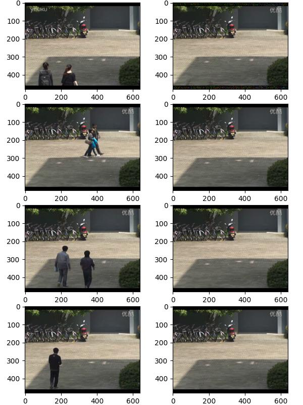

# Arkaplan (Background) Tespiti

Durağan bir kameranın sürekli aldığı görüntülerde arka plan tespiti
(background extraction) yapmak için şu andaki en iyi teknikler
istatistiki. Ana fikir şu; arka plan demek bir tür değişmezlik,
statiklik ima eder, o zaman görüntüdeki her pikselin en çok aldığı
piksel değeri (gri seviyesi ise 0..255 arası değerler, RGB ise onun üç
boyutlu hali) arka plan olarak kabul edilmelidir.

Tabii ki arka planın önünde, üzerinde farklı objeler gelip
gidecektir. Eğer kamera bir yola bakıyorsa, yoldan bazen arabalar
geçer, bir kampüs içini gösteriyorsa insanlar yürürler. Bu sebeple her
pikselin en çok aldığı değeri matematiksel olarak temsil edebilmemiz
gerekiyor.

Örnek olarak bir video'daki spesifik bir pikselin aldığı değerlere
bakalım, bu değerlerin histogramını çıkartalım. Bu bize o spesifik
pikselin aldığı değerlerin frekansı, istatistiksel özelliği hakkında
bir fikir verecektir. Örnek video [1]'den indirilebilir, ve alttaki
dizinde olduğunu farzedelim,

```python
vfile = '/opt/Downloads/skdata/campus_vibe_video4.mp4'
```

Video bir kampüste kaydedilmiş, kamera hareket etmiyor sadece önünde
olanları gösteriyor. Şimdi bu video karelerinin `coord` noktasındaki,
kordinatında aldığı değerlere bakalım. Video renkli ama bu ilk rapor
için biz gri seviyelere bakabiliriz, yani RGB değerlerini alıp
grileştiriyoruz sonra o noktadaki gri değerlerin frekansına bakıyoruz.

```python
import time, datetime, cv2
cap = cv2.VideoCapture(vfile)
frame_index = 0
N = 3600
coord = (40,130)
pixvals = np.zeros(N)
for i in range(N):
    ret, frame = cap.read()
    gray_frame = cv2.cvtColor(frame, cv2.COLOR_BGR2GRAY).astype(np.float32)
    pixvals[i] = gray_frame[*coord]
cap.release()    

plt.hist(pixvals)
plt.savefig('vision_20bg_04.jpg')
```


Histogram üstteki gibi çıktı. Kabaca ilk bakış bize 45 değeri
etrafında bir gruplanma gösteriyor, 70 etrafında daha az ama yine de
mevcut bir tepe var, bir diğeri 100 etrafında. Yani `coord`
noktasındaki piksel çoğunlukla koyumsu bir rengi olan bir yeri
gösteriyor, ve arada sırada önünden daha aydınlık renkleri olan şeyler
geçiyor. Belki açık gri renkli tişört giymiş bir kaç öğrenci oradan
geçmiş.

Bu rapor bize arka plan tespitinde izlenebilecek tekniğin ipuçlarını
veriyor. Üstteki histograma bakarak eğer bir arka plan seçmek istesek,
bunu frekansların maksimum olduğu değer üzerinden yapabilirdik, bu
örnekte aşağı yukarı 45 değeri.

### KDE

O zaman şöyle bir yaklaşım tasarlanabilir. Bir video'nun karelerini
işlerken her pikselin o ana kadar aldığı değerlerin dağılımını
modelle, ve bir arka plan gerektiğinde tüm bu dağılımların maksimum
değerini bul (yani maksimum frekansa tekabül eden piksel değeri) ve o
değerleri arka plan resmi olarak kabul et. Bu yaklaşımı histogram ile
kodlayabilirdik, fakat daha pürüzsüz bir dağılım saptamamıza yardım
edecek bir teknik KDE tekniğidir [1]. Bu teknikle aynen histogramda
olduğu gibi önceden saptanmış belli $x$ noktaları (histogram için
kutucuk) üzerinden hesap yapıyor olsak bile KDE Gaussian toplamlarını
temsil ettiği için daha az ayrıksal gözüken sonuçlar almamızı sağlar.

KDE değerlerini artımsal olarak güncellemeyi de biliyoruz [1], hatta
bu güncelleme sırasında eski değerlere daha az önem vermeyi de
öğrendik, böylece algoritmamiz güncel olan bir arka plan varsayımını
sürekli bilip, istediğimiz anda bize verebilir. Üstte işlediğimiz
video üzerinde bunu görelim,

```python
from PIL import Image
import time, datetime, cv2

N = 400                    # "hafiza" faktoru (daha yuksek = daha yavas guncelleme)
bandwidth = 40.0           # Gaussian bant genisligi
num_bins = 32              # PDF temsil etmek icin kac tane nokta secelim
bin_centers = np.linspace(0, 255, num_bins).astype(np.float32)
alpha = 1/N

cap = cv2.VideoCapture(vfile)
fps = int(cap.get(cv2.CAP_PROP_FPS))
print(f"Frame rate: {fps} FPS")

pdf_model = None
fig, axes = plt.subplots(nrows=4, ncols=2, figsize=(5,7))
g_row = 0
for frame_index in range(3600):
    ret, frame = cap.read()
    gray_frame = cv2.cvtColor(frame, cv2.COLOR_BGR2GRAY).astype(np.float32)
    H, W = gray_frame.shape
    if pdf_model is None:
        pdf_model = np.ones((H, W, num_bins), dtype=np.float32) / num_bins

    diffs = gray_frame[..., None] - bin_centers[None, None, :]
    new_pdf = np.exp(-0.5 * (diffs / bandwidth) ** 2)
    new_pdf /= (new_pdf.sum(axis=-1, keepdims=True) + 1e-8)  # normalize
    pdf_model = (1 - alpha) * pdf_model + alpha * new_pdf
    if frame_index in [220,1200,1900,3500]:
        background_bins = pdf_model.argmax(axis=-1)  # index of most likely bin
        background = bin_centers[background_bins].astype(np.uint8)
        t = datetime.datetime.now()
        print(f"Frame {frame_index}, Time {t}: saving background snapshot")
        background_bins = pdf_model.argmax(axis=-1)  # index of most likely bin
        background = bin_centers[background_bins].astype(np.uint8)
        axes[g_row, 0].imshow(gray_frame, cmap='gray')
        axes[g_row, 1].imshow(background, cmap='gray')
        g_row = g_row + 1        
    
plt.tight_layout(pad=0, w_pad=0, h_pad=0)
plt.savefig('vision_20bg_01.jpg')
cap.release()
cv2.destroyAllWindows()
```


Resimde sol kolondakiler video'nun belli anlarda alınmış kareleri, sol
kolondaki ise algoritmamizin o andaki arka plan tasavvuru. Görüldüğü
gibi video o anda insanlar gösteriyor olsa bile, KDE kümemiz hala arka
planın ne olduğunu biliyor. Bu saptamayı her piksel için sürekli
hesaplanan KDE'ler üzerinde `pdf_model.argmax` işleterek
yapıyor. Çağrı `argmax` bilindiği gibi bir vektör üzerinde işletilince
o vektördeki maksimum değerin indisini verir. Bizim örneğimizde indis
değerleri seçilmiş gri değer seviyelerinin indisi, mesela bu seviyeler
`[0., 8.2, 16.4, ..., 255]` olabilir eğer ikinci indisteki frekanslar
yüksekse `argmax` sonucu 8.2 değerini elde ederiz. Not: Gri seviyesi
8.2 anlamsız olabilir fakat 0 ila 255 değerini 32 eşit aralığa bölünce
bazı değerler kesirli oluyor. Problem değil arka plan resmini
grafiklerken kesirli gri değerlerini en yakın tam sayı gri değerine
yuvarlayabiliriz.

### GMM

Üstte parametresiz istatistik kullanarak gri seviyelerini
halledebildik. Peki renkli resim işliyor olsaydık ne yapardık? Aynı
KDE tekniği burada da işler mi?

Renkli resimler problemli olabilir.. Bu durumda tek gri seviyesi
yerine her piksel için üç tane R,G,B değerini takip etmemiz
gerekiyor. Eğer aynı KDE yaklaşımını kullanmak istesek ve yine renk
skalasını mesela 32 parçaya bolsek, bu bize 32 x 32 x 32 ~ 32K tane
nokta verir, ve bu sadece tek piksel içindir. 640 x 480 boyutlu resim
kareleri için 640 x 480 x 32 x 32 x 32 yani 10 milyar KDE noktası
takip edilmesi gerekecektir. Bu algoritmaya çok fazla yük
yaratacaktır. Bu durumda KDE tekniğinden uzaklaşmak gerekiyor.

Fakat temel olarak bize gereken nedir? Bize gereken birden fazla odak
noktasi, tepe noktasi olabilen bir dagilim teknigi, ve cok boyutlu
verileri rahat bir sekilde halledebilen bir matematiksel yapi.

Gaussian Karışım Modeli [3] bu ihtiyaçları karşılayabilir. Bir
Gaussian'ın veri boyutunu 1'den 3 seviyesine çıkartmak onun kapsadığı
yer açısından patlama yaratmaz. Gaussian için gereken $\mu$, $\Sigma$
parametreleri 1 x 3 ve 3 x 3 boyutundadir, ve bu artış sadece üç katı
seviyesinde bir artıştır. Çoklu tepe takip etmek istiyorsak her piksel
için bir Gaussian yerine mesela üç Gaussian tasarlayabiliriz, ve
onların karışımlarını yine 1 x 3 boyutlu bir "ağırlık vektörü" ile
takip edebiliriz. Demek ki her piksel için depolanması gereken rakamlar
1 x 3 + ( 3 x (3 x 3 + 1 x 3)), yani 39. Bu idare edilebilir bir
büyüklüktür.

Tekrarlamak gerekirse her piksel seviyesinde bir GMM tasarlıyoruz, ve
video'nun her karesindeki piksel RGB değerlerini o piksel GMM'ini
güncellemek için kullanıyoruz. Arka plan çıktısı almak gerektiğinde
bir GMM'in karışım seviyesi en yüksek olan Gaussian'inin tepe
noktasını arka plan RGB değeri olarak kabul ediyoruz.

Ayrıca GMM güncellemesini artımsal olarak ta yapabildiğimiz için [4]
geriye dönük olarak sürekli toptan işlem yapılmasına da gerek yok,
aynen KDE'lerde olduğu gibi son video karesini alıp onun değerlerini
mevcut son GMM modeli üzerinde hızlı güncelleme yapmak için
kullanabiliyoruz. EWMA benzeri eski veriye daha az önem verme burada
da kullanılabilmekte, böylece en son değerlerin ima ettiği arka plan
bulunabilmiş oluyor.


```python
import cv2, time, datetime

K = 3
lambda_forget = 0.005 
min_variance = 15.0   
snapshot_frames = [220, 1200, 1900, 3500]
resize_width = 640 

cap = cv2.VideoCapture(vfile)
ret, frame = cap.read()

if resize_width is not None:
    h0, w0 = frame.shape[:2]
    scale = resize_width / float(w0)
    frame = cv2.resize(frame, (resize_width, int(h0 * scale)))

H, W, C = frame.shape

frame_index = 0
fig, axes = plt.subplots(nrows=4, ncols=2, figsize=(6,8))
g_row = 0

pi_g = np.ones((K, H, W), dtype=np.float32) / K

means = np.zeros((K, H, W, C), dtype=np.float32)
for k in range(K):
    noise = np.random.normal(scale=4.0*(k+1), size=(H,W,C)).astype(np.float32)
    means[k] = frame.astype(np.float32) + noise

covars = np.ones((K, H, W, C), dtype=np.float32) * 225.0

inv_covars = 1.0 / np.maximum(covars, min_variance)
det_covars = np.prod(covars, axis=-1, keepdims=True)

def diag_gauss_pdf(x, mean, inv_covar, det_covar):
    eps = 1e-6
    exponent = -0.5 * np.sum((x - mean)**2 * inv_covar, axis=-1)
    denom = np.sqrt((2*np.pi)**C * np.maximum(det_covar.squeeze(-1), eps))
    return np.exp(exponent) / np.maximum(denom, eps)

eps = 1e-12

for frame_index in range(3550):

    ret, frame = cap.read()
    if not ret:  break        
    if resize_width is not None:
        frame = cv2.resize(frame, (resize_width, int(frame.shape[0]*resize_width/frame.shape[1])))
    
    frame_f = frame.astype(np.float32)

    likelihoods = np.zeros((K, H, W), dtype=np.float32)
    for k in range(K):
        likelihoods[k] = diag_gauss_pdf(frame_f, means[k], inv_covars[k], det_covars[k])

    numerator = pi_g * likelihoods
    denominator = np.sum(numerator, axis=0, keepdims=True) + eps
    responsibilities = numerator / denominator

    pi_g = pi_g + lambda_forget * (responsibilities - pi_g)
    pi_sum = np.sum(pi_g, axis=0, keepdims=True) + eps
    pi_g = pi_g / pi_sum

    for k in range(K):
        r_k = responsibilities[k]
        pi_k = pi_g[k]           
        denom = np.maximum(pi_k, eps)
        ratio = (r_k / denom)[..., None]

        delta = frame_f - means[k]
        means[k] = means[k] + lambda_forget * ratio * delta

        delta_sq = delta * delta
        covars[k] = covars[k] + lambda_forget * ratio * (delta_sq - covars[k])

        covars[k] = np.maximum(covars[k], min_variance)

        inv_covars[k] = 1.0 / covars[k]
        det_covars[k] = np.prod(covars[k], axis=-1, keepdims=True)

    k_bg = np.argmax(pi_g, axis=0)
    rows, cols = np.indices((H, W))
    background = means[k_bg, rows, cols].astype(np.uint8)

    frame_uint8 = frame.astype(np.uint8)

    if frame_index in snapshot_frames:
        t = datetime.datetime.now()
        print(f"Frame {frame_index}, Time {t}: saving background snapshot")
        axes[g_row, 0].imshow(cv2.cvtColor(frame_uint8, cv2.COLOR_BGR2RGB))
        axes[g_row, 1].imshow(cv2.cvtColor(background, cv2.COLOR_BGR2RGB))
        g_row += 1

plt.tight_layout(pad=0, w_pad=0, h_pad=0)
plt.savefig('vision_20bg_02.jpg')
cap.release()
cv2.destroyAllWindows()
```



Sonuçlar üstte görülüyor. Aynı fotoğraf karelerinde bu sefer renkli olarak arka
plan çıktısı alabildik. GMM doğru bir arka plan hipotezini bulmayı başardı.

Canlı Video'da Hareket Eden Bölge Tespiti

Eğer bir video'da canlı olarak hareket eden cisimleri, kişileri takip
etmek istesek arka plan tespiti bu ihtiyaç için faydalı, sonuçta
hareket eden bölgeler o ana kadar bilinen arka plan resminden "farklı
olan" pikseller diye tanımlanabilir. Alttaki kod tam da bunu yapıyor.
O andaki video karesi ile arka plan arasında `absdiff` hesabı yapıyor,
elde edilen piksel kordinatları üzerine bazı ek filtreleme işlemleri
yaparak (ufak bölgeleri atmak, çok az farkları elemek gibi) geri kalan
bölgeler etrafında bir kırmızı dikdörtgen çiziyor. Sonuç altta
görülebilir.


[gmm_online_rect.py](gmm_online_rect.py)

Kaynaklar

[1] [Video 1](https://www.dropbox.com/scl/fi/oczbpoicx243wd857doti/campus_vibe_video4.mp4?rlkey=0h026033fbwho59frsq3ewuu1&st=7axsjn6x&raw=1)

[2] Bayramli, *Istatistik, Parametresiz İstatistik (Nonparametric Statistics)*

[3] Bayramli, *Istatistik, Gaussian Karışım Modeli (GMM) ile Kümelemek

[4] Bayramli, *Istatistik, Artımsal (Incremental) GMM


