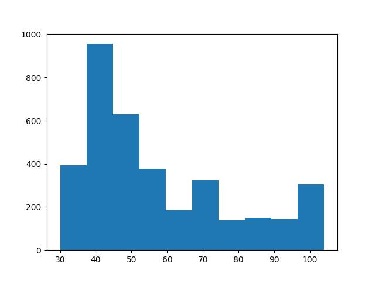

# Arkaplan (Background) Tespiti

```python
vfile = '/opt/Downloads/skdata/campus_vibe_video4.mp4'
```

```python
import time, datetime, cv2
cap = cv2.VideoCapture(vfile)
frame_index = 0
N = 3600
pixvals = np.zeros(N)
for i in range(N):
    ret, frame = cap.read()
    gray_frame = cv2.cvtColor(frame, cv2.COLOR_BGR2GRAY).astype(np.float32)
    pixvals[i] = gray_frame[40,130]
cap.release()    

plt.hist(pixvals)
plt.savefig('vision_20bg_04.jpg')
```



KDE

```python
from PIL import Image
import time, datetime, cv2

N = 400                    # "hafiza" faktoru (daha yuksek = daha yavas guncelleme)
bandwidth = 40.0           # Gaussian bant genisligi
num_bins = 32              # PDF temsil etmek icin kac tane nokta secelim
bin_centers = np.linspace(0, 255, num_bins).astype(np.float32)
alpha = 1/N

cap = cv2.VideoCapture(vfile)
fps = int(cap.get(cv2.CAP_PROP_FPS))
print(f"Frame rate: {fps} FPS")

pdf_model = None
frame_index = 0
fig, axes = plt.subplots(nrows=4, ncols=2, figsize=(5,7))
g_row = 0
for k in range(3600):
    ret, frame = cap.read()
    gray_frame = cv2.cvtColor(frame, cv2.COLOR_BGR2GRAY).astype(np.float32)
    H, W = gray_frame.shape
    if pdf_model is None:
        pdf_model = np.ones((H, W, num_bins), dtype=np.float32) / num_bins

    diffs = gray_frame[..., None] - bin_centers[None, None, :]
    new_pdf = np.exp(-0.5 * (diffs / bandwidth) ** 2)
    new_pdf /= (new_pdf.sum(axis=-1, keepdims=True) + 1e-8)  # normalize
    pdf_model = (1 - alpha) * pdf_model + alpha * new_pdf
    if frame_index in [220,1200,1900,3500]:
        background_bins = pdf_model.argmax(axis=-1)  # index of most likely bin
        background = bin_centers[background_bins].astype(np.uint8)
        t = datetime.datetime.now()
        print(f"Frame {frame_index}, Time {t}: saving background snapshot")
        background_bins = pdf_model.argmax(axis=-1)  # index of most likely bin
        background = bin_centers[background_bins].astype(np.uint8)
        axes[g_row, 0].imshow(gray_frame, cmap='gray')
        axes[g_row, 1].imshow(background, cmap='gray')
        g_row = g_row + 1        

    frame_index += 1
    
plt.tight_layout(pad=0, w_pad=0, h_pad=0)
plt.savefig('vision_20bg_01.jpg')
cap.release()
cv2.destroyAllWindows()
```


GMM

```python
import cv2, time, datetime

K = 3
lambda_forget = 0.005 
min_variance = 15.0   
snapshot_frames = [220, 1200, 1900, 3500]
resize_width = 640 

cap = cv2.VideoCapture(vfile)
ret, frame = cap.read()

if resize_width is not None:
    h0, w0 = frame.shape[:2]
    scale = resize_width / float(w0)
    frame = cv2.resize(frame, (resize_width, int(h0 * scale)))

H, W, C = frame.shape

frame_index = 0
fig, axes = plt.subplots(nrows=4, ncols=2, figsize=(6,8))
g_row = 0

pi_g = np.ones((K, H, W), dtype=np.float32) / K

means = np.zeros((K, H, W, C), dtype=np.float32)
for k in range(K):
    noise = np.random.normal(scale=4.0*(k+1), size=(H,W,C)).astype(np.float32)
    means[k] = frame.astype(np.float32) + noise

covars = np.ones((K, H, W, C), dtype=np.float32) * 225.0

inv_covars = 1.0 / np.maximum(covars, min_variance)
det_covars = np.prod(covars, axis=-1, keepdims=True)

def diag_gauss_pdf(x, mean, inv_covar, det_covar):
    eps = 1e-6
    exponent = -0.5 * np.sum((x - mean)**2 * inv_covar, axis=-1)
    denom = np.sqrt((2*np.pi)**C * np.maximum(det_covar.squeeze(-1), eps))
    return np.exp(exponent) / np.maximum(denom, eps)

eps = 1e-12

for frame_index in range(3550):

    ret, frame = cap.read()
    if not ret:  break        
    if resize_width is not None:
        frame = cv2.resize(frame, (resize_width, int(frame.shape[0]*resize_width/frame.shape[1])))
    
    frame_f = frame.astype(np.float32)

    likelihoods = np.zeros((K, H, W), dtype=np.float32)
    for k in range(K):
        likelihoods[k] = diag_gauss_pdf(frame_f, means[k], inv_covars[k], det_covars[k])

    numerator = pi_g * likelihoods
    denominator = np.sum(numerator, axis=0, keepdims=True) + eps
    responsibilities = numerator / denominator

    pi_g = pi_g + lambda_forget * (responsibilities - pi_g)
    pi_sum = np.sum(pi_g, axis=0, keepdims=True) + eps
    pi_g = pi_g / pi_sum

    for k in range(K):
        r_k = responsibilities[k]
        pi_k = pi_g[k]           
        denom = np.maximum(pi_k, eps)
        ratio = (r_k / denom)[..., None]

        delta = frame_f - means[k]
        means[k] = means[k] + lambda_forget * ratio * delta

        delta_sq = delta * delta
        covars[k] = covars[k] + lambda_forget * ratio * (delta_sq - covars[k])

        covars[k] = np.maximum(covars[k], min_variance)

        inv_covars[k] = 1.0 / covars[k]
        det_covars[k] = np.prod(covars[k], axis=-1, keepdims=True)

    k_bg = np.argmax(pi_g, axis=0)
    rows, cols = np.indices((H, W))
    background = means[k_bg, rows, cols].astype(np.uint8)

    frame_uint8 = frame.astype(np.uint8)

    if frame_index in snapshot_frames:
        t = datetime.datetime.now()
        print(f"Frame {frame_index}, Time {t}: saving background snapshot")
        axes[g_row, 0].imshow(cv2.cvtColor(frame_uint8, cv2.COLOR_BGR2RGB))
        axes[g_row, 1].imshow(cv2.cvtColor(background, cv2.COLOR_BGR2RGB))
        g_row += 1

plt.tight_layout(pad=0, w_pad=0, h_pad=0)
plt.savefig('vision_20bg_02.jpg')
cap.release()
cv2.destroyAllWindows()
```


Anlik Islem


[gmm_online_rect.py](gmm_online_rect.py)

[devam edecek]

Kaynaklar

[1] [Video 1](https://www.dropbox.com/scl/fi/oczbpoicx243wd857doti/campus_vibe_video4.mp4?rlkey=0h026033fbwho59frsq3ewuu1&st=7axsjn6x&raw=1)

[2] Bayramli, *Istatistik, Parametresiz İstatistik (Nonparametric Statistics)*

