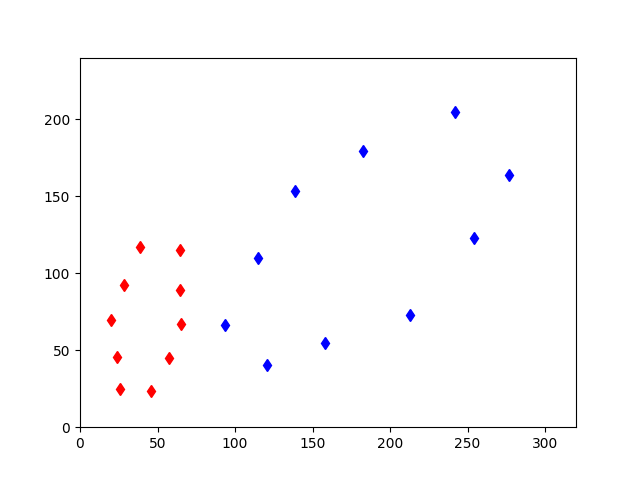
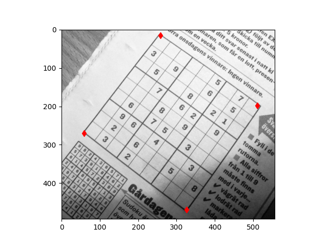
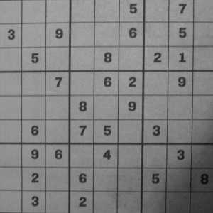

# İki Boyut Nokta Eşleşmesi, Homografi, Video Stabilizasyonu

Oldukça çok ortaya çıkan bir imaj işleme problemi şudur: elimizde iki nokta
grubu var, bu noktaların arasındaki eşleşmeyi biliyoruz. Öyle bir $H$
ilişkisi bulmak istiyoruz ki verili $x$ noktasınının (homojen) kordinatını
$x'$ noktasına taşısın, yani eldeki her veri noktasının ima ettiği eşleşmeyi
bulsun. 

Örnek

```python
x1 = [[25.8064516129,25.0],[23.87096,45.625],
      [20.0,69.375],[28.387,92.5],
      [38.709,116.875],[64.5161290323,115.0],
      [64.516,89.375],[65.16,66.875],
      [57.4193,45.0],[45.80645,23.75]]
x2 = [[93.548,66.25],[114.838,110.0],
      [138.709,153.125],[182.580,179.375],
      [241.935,204.375],[276.77,163.75],
      [254.193,123.125],[212.903,73.125],
      [158.064,54.375],[120.6451,40.625]]

x1 = np.array(x1)
x2 = np.array(x2)
plt.plot(x1[:,0], x1[:,1], 'rd')
plt.plot(x2[:,0], x2[:,1], 'bd')
plt.xlim(0,320)
plt.ylim(0,240)
plt.savefig('vision_30vstab_02.png')
```



Yani kırmızı noktaları mavi noktalara çeviren ilişkiyi arıyoruz. Bu
transformasyonda ne var? Sağa doğru bir yer değiştirme (translation),
ölçekleme (scaling), ve saat yönüne doğru bir döndürme (rotation). Bu tür
2D-2D ilişkilerine homografi adı veriliyor. Aradığımız alttaki türden bir
formül [3],

$$ x' = H x$$

yani her $x$ noktası $H$ üzerinden $x'$ haline gelecek. $H$ matrisi homojen
kordinatları baz alır,

$$ 
\left[\begin{array}{r} x' \\ y' \\ w' \end{array}\right]
\left[\begin{array}{rrr}
h_1 & h_2 & h_3 \\ h_3 & h_4 & h_5 \\ h_6 & h_7 & h_8 
\end{array}\right]
\left[\begin{array}{r} x \\ y \\ w \end{array}\right]
$$

$H$ matrisinin bazı şekilleri vardır, mesela 

$$ 
\left[\begin{array}{r} x' \\ y' \\ 1 \end{array}\right]
\left[\begin{array}{rrr}
a_1 & a_2 & t_x \\ a_3 & a_4 & t_y \\ 0 & 0 & 1
\end{array}\right]
\left[\begin{array}{r} x \\ y \\ 1 \end{array}\right]
$$

Ya da matris içindeki bölgeleri vektör / matrisler ile özetlersek,

$$ 
x' = \left[\begin{array}{rr} A & t \\ 0 & 1 \end{array}\right] x
$$

Üstteki transformasyona ilgin transformasyonu (affine transformation)
deniyor, yamultma (warping) denen işlem budur. Bu transformasyon $w=1$
şartını korur.

Eğer $H$ şu türden olursa,

$$ 
\left[\begin{array}{r} x' \\ y' \\ 1 \end{array}\right]
\left[\begin{array}{rrr}
s\cos(\theta) & -s\sin(\theta) & t_x \\ 
s\sin(\theta) & s\cos(\theta) & t_y \\ 
0 & 0 & 1
\end{array}\right]
\left[\begin{array}{r} x \\ y \\ 1 \end{array}\right]
$$

Ya da 

$$ 
x' = \left[\begin{array}{rr}
sR & t \\ 0 & 1
\end{array}\right] x
$$

Dönüş $R$, taşınma $t$, dönme $\theta$, ölçekleme $s$. Bu transformasyona
ölçeklemeye (scaling) izin veren bir katı (rigid) transformasyon
deniyor. "Katı'' demek $s=1$, yani noktalar arası mesafeler değişmeyecek
demek, daha büyük $s$ ile tabii ölçekleme olabilir, mesafeler artabilir,
ama mesafe oranları yine aynı kalır, ayrıca döndürme de -rotation-
yapılabilir. Bu transformasyona yansıtsal (projective) ismi de
verilir. Yansıtsal transformasyonun ilgin transformasyondan daha esnek /
kuvvetli olduğu bilinir.

Not: ilgin transformasyon ve onu kestirme hesabı bazen literatürde iki
boyutlu kordinat sisteminde ve $x' = R x + t$, yani rotasyon artı yer
değişimi gibi bir formda da görülebilir, biz homojen sisteme geçerek her
ikisini aynı matris $H$ içinde ve tek çarpım operasyonu ile gösterebilmiş
oluyoruz. Homojen, tek matrisli formda hesap yapmak daha kolay.

Homografi hesabının kullanım alanları geniş; mesela elde olan iki imaj
arasında birbirine uyan noktaları biliyorsak, $H$'yi hesaplayarak tüm imaj
üzerinde bir değişim matrisi hesaplamış oluruz. 

Yansıtsal $H$ hesabı için direk lineer transform (direct linear transform
-DLT-) tekniği var. Eldeki tüm eşleşmeler için alttaki sistemi yaratırız,

$$ 
\left[\begin{array}{rrrrrrrrr}
-x_1 & -y_1 & -1 & 0 & 0 & 0 & x_1x_1' & y_1x_1' & x_1' \\
0 & 0 & 0 & -x_1 & -y_1 & -1 & x_1y_1' & y_1y_1' & y_1' \\
-x_2 & -y_2 & -1 & 0 & 0 & 0 & x_2x_2' & y_2x_2' & x_2' \\
0 & 0 & 0 & -x_2 & -y_2 & -1 & x_2y_2' & y_2y_2' & y_2' \\
 &  \vdots &  &  \vdots &  & \vdots &  &  \vdots & 
\end{array}\right]
\left[\begin{array}{r}
h_1 \\ h_2 \\ h_3 \\ h_4 \\ h_5 \\ h_6 \\ h_7 \\ h_8 \\ h_9 
\end{array}\right] = 0
$$

Bu sistem $x' - Hx = 0$ sistemini temsil etmiş oluyor, ne kadar fazla nokta
olursa üstteki matris o kadar aşağı doğru genişleyecektir (öğe ayarlaması
öne göre yapılacak tabii). Mükemmel $H$ bulunamayabilir, ama sıfıra
olabildiğince yaklaşmak için üstteki problemi bir minimizasyon problemi
olarak görürüz, SVD bu çözümü bize sağlar. 

```python
import numpy.linalg as lin

def H_from_points(fp,tp):
    if fp.shape != tp.shape:
        raise RuntimeError('number of points do not match')
        
    m = np.mean(fp[:2], axis=1)
    maxstd = np.max(np.std(fp[:2], axis=1)) + 1e-9
    C1 = np.diag([1/maxstd, 1/maxstd, 1]) 
    C1[0][2] = -m[0]/maxstd
    C1[1][2] = -m[1]/maxstd
    fp = np.dot(C1,fp)
    
    m = np.mean(tp[:2], axis=1)
    maxstd = np.max(np.std(tp[:2], axis=1)) + 1e-9
    C2 = np.diag([1/maxstd, 1/maxstd, 1])
    C2[0][2] = -m[0]/maxstd
    C2[1][2] = -m[1]/maxstd
    tp = np.dot(C2,tp)
    
    nbr_correspondences = fp.shape[1]
    A = np.zeros((2*nbr_correspondences,9))
    for i in range(nbr_correspondences):        
        A[2*i] = [-fp[0][i],-fp[1][i],-1,0,0,0,
                    tp[0][i]*fp[0][i],tp[0][i]*fp[1][i],tp[0][i]]
        A[2*i+1] = [0,0,0,-fp[0][i],-fp[1][i],-1,
                    tp[1][i]*fp[0][i],tp[1][i]*fp[1][i],tp[1][i]]
    
    U,S,V = lin.svd(A)
    H = V[8].reshape((3,3))    
    
    H = np.dot(lin.inv(C2),np.dot(H,C1))
    
    # normalize and return
    return H / H[2,2]

x1h = np.ones((len(x1),3))
x1h[:,:2] = x1
x2h = np.ones((len(x1),3))
x2h[:,:2] = x2
A = H_from_points(x1h.T,x2h.T)
res = np.dot(A, x1h.T).T
res = res.T / res[:,2]

plt.plot(x1[:,0], x1[:,1], 'rd')
plt.plot(x2[:,0], x2[:,1], 'bd')
plt.plot(res.T[:,0], res.T[:,1], 'bx')
plt.xlim(0,320)
plt.ylim(0,240)
plt.savefig('vision_30vstab_03.png')
```


Çarpı ile işaretli noktalar kestirme hesabı yapılan $H$ ile kırmızı
noktaların transform edilmesiyle elde edildi. Gerçek noktalara oldukca
yakın! 

İlgin transformasyon matrisinin hesabı için üstteki metotta $h_7=0,h_8=0$
kullanmak yeterli. Alternatif bir yöntem de var, daha fazla detay için [3,
sf. 76]. 

İmaj Bölgesi Çekip Çıkarmak

Üstteki tekniğin ilginç uygulamalarından biri; diyelim ki bir imajın belli
bir bölgesindeki görüntüyü eşit kenarlı olacak şekilde çekip çıkarmak
istiyorum, mesela alttaki Sudoku oyun karesini,

```python
from scipy import ndimage
from PIL import Image

im = np.array(Image.open('sudoku81.JPG').convert('L'))
corners = [[257.4166, 14.9375], 
           [510.8489, 197.6145], 
           [59.30208, 269.65625], 
           [325.598958, 469.05729]]
corners = np.array(corners)
plt.plot(corners[:,0], corners[:,1], 'rd')
plt.imshow(im, cmap=plt.cm.Greys_r)
plt.savefig('vision_30vstab_04.png')
```



Kenarları kırmızı noktalarla ben seçtim, şimdi o bölgenin alınıp eşit
kenarlı halde gösterilmesini istiyorum. Bu ne demektir? Bu seçilen her köşe
noktasının eşit kenarlı bir karenin köşelerine transform edilmesi demektir,
mesela bu köşeler $(1,300),(300,300),..$ gibi olabilir (imajın en uç
noktaları). Sonra daha önce yaptığım gibi $H$ hesaplarım, ve o bölgedeki
tüm pikselleri alıp hesapladığım transformasyonu onlara uygularım,
`scipy.ndimage.geometric_transform` bu işi yapar.

```python
from scipy import ndimage
import scipy
import imageio

fp = [ [p[1],p[0],1] for p in corners]
fp = np.array(fp).T
tp = np.array([[0,0,1],[0,300,1],[300,0,1],[300,300,1]]).T
H = H_from_points(tp,fp)

def warpfcn(x):
    x = np.array([x[0],x[1],1])
    xt = np.dot(H,x)
    xt = xt/xt[2]
    return xt[0],xt[1]
im_g = ndimage.geometric_transform(im,warpfcn,(300,300))
imageio.imwrite('vision_30vstab_05.png', im_g)
```



Video Stabilizasyonu

Elde tutulan kamera ile kaydedilen görüntülerde titreme çok
olabilir. Mesela şurada [1] bizim cep telefonu ile kaydettiğimiz bir örnek
var. Bu görüntüyü yazılım ile stabilize etmek mümkün mü? Cevap evet - ve
çözüm şaşırtıcı derecede basit.  [4]'ün tekniği şöyle özetlenebilir: bir
video'yu baştan itibaren kare kare işlerken, her karede ilginç köşe
noktaları (Harris tekniği ile) buluruz, ve bu noktaların bir sonraki
resimdeki eşlerini elde ederiz, bu artık görüntü işlemede demirbaş haline
gelmiş bir işlem. Sonra tüm eşlemeleri kullanarak her video karesi için bir
homografi / transformasyon hesaplarız, bu transformasyon matrisi içinde
$x,y$ değişimi, yani taşınma, ve $a$ açısı ki döndürme bilgisi vardır. Bu
bilgileri $dx,dy,da$ olarak biriktiririz.

Tüm kareler işlenince başa dönüp tüm bu değişimlerin kümülatif toplamını
alarak $x,y,a$ zaman serilerini oluştururuz. Bu zaman serileri üzerinde bir
yürüyen ortalama (moving average) hesabı yaparız, bu bize
pürüzüşleştirilmiş zaman serileri verir. Şimdi kümülatif serinin pürüzsüz
seriden olan farklarını buluruz, ve her kare için bu farkı alıp, onunla bir
$H$ oluştururuz ve bu $H$ ile bir önceki kare üzerinde yamultma yaparak onu
"düzeltiriz''. Bu kadar.

Bu teknik niye işliyor? İşliyor çünkü üstte gösterdiğimiz türde video'larda
"beklenen" bir "akış'', bir nokta eşleşmesi var. Düz yürüyoruz, kamera
ileri dönük, ortadaki pikseller dışa doğru eşleşmeli, sağdakiler daha sağa
doğru, vs.  Bu beklentiyi hareketli ortalama ile hesaplamak mümkün, ve
ondan olan sapmaları kameranın istenmeyen titremesi olarak algılıyoruz, ve
düzeltiyoruz.

```python
import cv2, numpy as np, pandas as pd

fin = "/opt/Downloads/skdata/bwalk1.mp4"

cap = cv2.VideoCapture(fin)
N = int(cap.get(cv2.CAP_PROP_FRAME_COUNT))
fps = int(cap.get(cv2.CAP_PROP_FPS))

status, prev = cap.read()
prev_gray = cv2.cvtColor(prev, cv2.COLOR_BGR2GRAY)
(h,w) = prev.shape[:2]

last_T = None
prev_to_cur_transform = []
for k in range(N-1):
    status, cur = cap.read()
    cur_gray = cv2.cvtColor(cur, cv2.COLOR_BGR2GRAY)
    prev_corner = cv2.goodFeaturesToTrack(prev_gray,
                                          maxCorners = 200,
                                          qualityLevel = 0.01,
                                          minDistance = 30.0,
                                          blockSize = 3)
    cur_corner, status, err = cv2.calcOpticalFlowPyrLK(prev_gray,
                                                       cur_gray,
                                                       prev_corner,
                                                       None)
    prev_corner2 = []
    cur_corner2 = []
    for i,st in enumerate(status):
        if st==1:
            prev_corner2.append(prev_corner[i])
            cur_corner2.append(cur_corner[i])
    prev_corner2 = np.array(prev_corner2)
    cur_corner2 = np.array(cur_corner2)
    T, inliers = cv2.estimateAffine2D(prev_corner2, cur_corner2)
    last_T = T[:]

    dx = T[0,2];
    dy = T[1,2];
    da = np.arctan2(T[1,0], T[0,0])
    prev_to_cur_transform.append([dx, dy, da])
    prev = cur[:]
    prev_gray = cur_gray[:]


prev_to_cur_transform = np.array(prev_to_cur_transform)
trajectory = np.cumsum(prev_to_cur_transform, axis=0)
trajectory = pd.DataFrame(trajectory)
smoothed_trajectory = trajectory.rolling(window=30).mean()
smoothed_trajectory = smoothed_trajectory.bfill()
new_prev_to_cur_transform = prev_to_cur_transform + \
                            (smoothed_trajectory - trajectory)
new_prev_to_cur_transform = np.array(new_prev_to_cur_transform)

T = np.zeros((2,3))
cap = cv2.VideoCapture(fin)
out = cv2.VideoWriter('/tmp/out.avi', cv2.VideoWriter_fourcc('P','I','M','1'),
                      fps, (w, h), True)

for k in range(N-1):
    status, cur = cap.read()
    T[0,0] = np.cos(new_prev_to_cur_transform[k][2]);
    T[0,1] = -np.sin(new_prev_to_cur_transform[k][2]);
    T[1,0] = np.sin(new_prev_to_cur_transform[k][2]);
    T[1,1] = np.cos(new_prev_to_cur_transform[k][2]);
    T[0,2] = new_prev_to_cur_transform[k][0];
    T[1,2] = new_prev_to_cur_transform[k][1];
    cur2 = cv2.warpAffine(cur, T, (w,h));
    out.write(cur2);
    cv2.waitKey(20);
```

`cv2.estimateAffine2D` çağrısı katı transformasyonu hesaplayan bir
çağrıdır, aynen `H_from_points` gibi.

Üstteki kodu [1] üzerinde uygularsak stabilizasyon yapıldığını
göreceğiz. Sonuç [2]'de. C++ kodu `vidstab.cpp`'de bulunabilir.
Derlemek için

```
g++ -c -O3 -Wall `pkg-config --cflags opencv` -D LINUX -fPIC vidstab.cpp
g++ -o vs.exe vs.o `pkg-config --libs opencv`
```

Canlı Zamanda (Real-Time) Stabilizasyon

[4]'ün tekniği toptan (batch) işleyen bir teknik, ortalama alınması,
düzeltme yapılması için video'nun baştan sona işlenmesi, ve geriye
dönülmesi gerekiyor. Düzeltme işlemini canlı olarak yapamaz mıyız?

Bu mümkün olmalı; yürüyen ortalama için [6] yazısına bakabiliriz;
orada işlenen üstel ağırlıklı hareketli ortalama kullanılabilir. Bu
ortalamanın özyineli (recursive) formu da vardır,

$$ z_t = \alpha g_t + (1-\alpha) z_{t-1}$$

ki $\alpha$ kullanıcı tarafından seçilen parametredir, en son verilere ne
kadar ağırlık verileceğini tanımlar. Algoritma şöyle olabilir:
Stabilizasyon için her video karesi işlenirken $dx,dy,da$ farklarını
hesaplarız, bunların kümülatif toplamını da anlık hesaplarız (kolay). Bu
kümülatif $x,y,a$'yı üstteki tanımda $g_t$ olarak formüle veririz, en son
ortalama her zaman $z_t$ içinde olacaktır. Bu ortalamanın kumulatif olandan
farkı, "sapması'' her kare üzerinde düzeltme amacı ile kullanılabilir. Bu
kod `vsonline.py` içinde bulunabilir.

Kaynaklar

[1] Bayramlı, Veri 1 (Video), [File](https://www.dropbox.com/scl/fi/rrz3lgi2s8twqjori87ue/bwalk1.mp4?rlkey=a7sqkieu7nhdqvsv66tnoy1k8&st=ub0zwtig&raw=1)

[2] Bayramlı, Veri 2 (Video), [File](https://www.dropbox.com/scl/fi/ilksx914mxio9srsk6rw0/bwalk1-stab.avi?rlkey=4p0incnspt46bktcpxinhsdm0&st=sqbbebaw&raw=1)

[3] Solem, *Computer Vision with Python*

[4] Nghia Ho, *Simple Video Stabilization using OpenCV*,
    [http://nghiaho.com/?p=2093](http://nghiaho.com/?p=2093)

[5] Bayramlı, *OpenCV 3.0*, 
    [https://burakbayramli.github.io/dersblog/sk/2017/03/opencv-30.html](https://burakbayramli.github.io/dersblog/sk/2017/03/opencv-30.html)

[6] Bayramlı, Zaman Serileri ve Finans, *ARIMA, ARCH, GARCH, Periyotlar, Yürüyen Ortalama*

[7] Bayramlı, *Kalman Filters and Homography: Utilizing the Matrix A*
    [https://arxiv.org/abs/1006.4910](https://arxiv.org/abs/1006.4910)

  