# Birleşme Noktaları, Çizgiler, Hiperdüzlemler (Vanishing Points, Lines, Hyperplanes)

Görüntü işlemede birleşme noktaları ufuk çizginde, dış dünyadaki genel
yapının "aktığı'' yer olarak tanımlanabilir. Mesela önümüzde düz giden bir
yol var ise o yolun ufuk çizgisine değdiği yer birleşme
noktasıdır. Birleşme noktalarının bir nokta olarak ortaya çıkmasının sebebi
3D-2D dönüşümüyle alakalı; üç boyutta parallel olan çizgilerin iki boyuta
(diijal kameraya) yansıması onlarin tek noktada birleşmesine sebep olur.

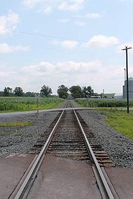
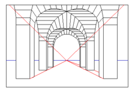
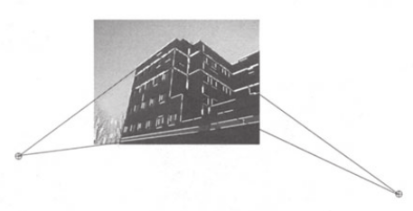

Üstte bazı örnekler görüyoruz. Soldaki imajda birleşme noktası tren
raylarının görülebilen son noktasıdır. Ortadaki imajda kırmızı çizgilerin
birleştiği yer. Bir resimde birden fazla birleşme noktası da olabilir,
mesela sağdaki resimde bu örnek görülüyor. Birleşme noktası imaj dışına da
düşüyor olabilir, yine sağdaki resim.

Görüntülerde derinliği anlamak, bu konuyu incelemek Rönesans'da başladı. Bu
çağda görüntünün ne olduğu ciddi şekilde araştırıldı, ressamlar perspektifi
dikkate alıp, birleşme noktalarını seçip ona göre resimlerini yapmaya
başladılar. Mesela ünlü ressam Raphael'ın *Atina Okulu* adlı resmi [4].

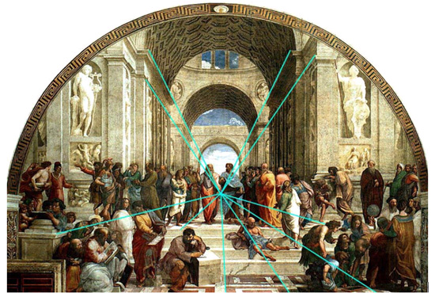

Bu resimde birleşme noktası filozof Sokrat'ın sol elinde, resimdeki tüm
objeler bu noktaya göre şekillendirilmiş.

Birleşme Noktalarını Bulmak

Görüntü işleme çerçevesinde verili herhangi bir görüntüde birleşme
noktalarını bulmak faydalı oluyor; bu noktalar robotik, yer bulma amaçlı
olarak kullanılabiliyor. Çünkü eğer görüntüdeki genel yapının nereye doğru
aktığını bulabiliyorsak, oraya doğru bir fiziksel gidiş de vardır demektir,
ve otonom hareket eden robotlar bu bilgiyi kullanabilirler, ya da bu bilgi
diğer ek görüntü işleme adımları için bir girdi olabilir. Belki elde
tutulan kamera sürekli sallanıyordur, ama birleşim noktasını her görüntüde
doğru bulabiliyorsak bu bu bilgiyi bir stabilizasyon amaçlı kullanabiliriz.

Hesap icin ilk aşama görüntüdeki ana çizgileri bulmak. Ana çizgileri bulmak
artık görüntü işlem biliminde demirbaş haline gelmiş Canny kenar bulucusu
ve Hough transformu ile yapılabilir.

```python
from PIL import Image, ImageDraw
from skimage.transform import  probabilistic_hough_line
from skimage.feature import canny
from skimage import data
import pandas as pd
```

```python
im1 = Image.open('in1.jpg').convert('L')
edges1 = canny(np.array(im1), 2, 1, 25)
lines1 = probabilistic_hough_line(edges1, threshold=10, line_length=30,line_gap=3)
im1 = Image.open('in1.jpg')
for line in lines1:
    p0, p1 = line
    plt.plot((p0[0], p1[0]), (p0[1], p1[1]))
plt.imshow(im1)
plt.savefig('vision_40lines_08.png')
```

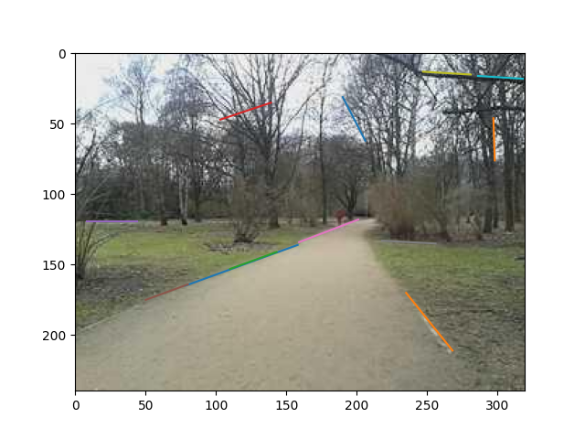

```python
im2 = Image.open('in2.jpg').convert('L')
edges2 = canny(np.array(im2), 2, 1, 25)
lines2 = probabilistic_hough_line(edges2, threshold=10, line_length=30,line_gap=3)
im2 = Image.open('in2.jpg')
for line in lines2:
    p0, p1 = line
    plt.plot((p0[0], p1[0]), (p0[1], p1[1]))
plt.imshow(im2)
plt.savefig('vision_40lines_09.png')
```

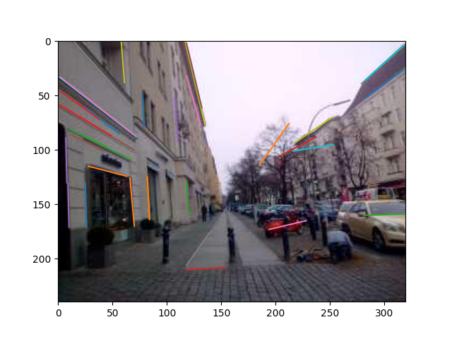

Hough transformuna verilen `threshold`, `line_length`,
`line_gap` parametreleri algoritmanın hassasiyetini ayarlıyor, mesela
`line_length` bulunan çizgilerin en az kaç piksel olması gerektiğini
tanımlıyor.

Bir sonraki adım bu ana çizgileri alıp onların birleşebilecek olanlarını
seçmek, ve en çok birleşim yapabilenleri üzerinden bir birleşim noktası
bulmak. Ama önce iki boyutta çizgiler nasıl formüle edilir, ve kesişim
nasıl bulunur, onu görelim.

Çizgiler

Bir çizgiyi $ax+by+c = 0$ genel formülüyle gösterebiliriz. $a,b,c$
parametreleri özgün olarak iki boyutta bir çizgiyi tanımlayabilir, bu
formülü tatmin eden sonsuza kadar tüm $x,y$ değerleri çizginin
parçasıdır. 

Üstteki formülü lise matematiğinden bilinen $y=mx+i$'e ilişkilendirmek
için, ki $m$ eğim (slope) ve $i$ kesi (intercept),

$$ ax+by+c = 0 $$

$$ by = -ax -c$$

$$ y = -a/b x -c/b$$

Yani eğim $m=-a/b$, kesi $-c/b$. Bu bilgiyi vektörel bir yön tanımlamak
için şöyle düşünebiliriz, eğime göre $x$ yönünde atılan her $b$ adımı için
$y$ yönünde $-a$ adımı atılacağına göre (ya da $-b$ için $a$ adımı), vektör
alttaki gibi olur.

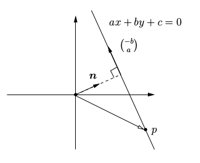

Birkaç örneği grafikleyelim,

```python
import pandas as pd

def plot_line(a,b,c):
    # Formula is ax+by+c = 0 
    x = np.linspace(-20,20,1000)    
    m = -a/b # slope
    i = -c/b # intercept
    y = m*x + i
    plt.plot(x,y,'.')

l1 = np.array([1,1,-5])
plot_line(l1[0],l1[1],l1[2])
l2 = np.array([2,-1,10])
plot_line(l2[0],l2[1],l2[2])
plt.xlim(-10,10)
plt.ylim(0,30)
plt.grid(True)
plt.savefig('vision_40lines_01.png')
```

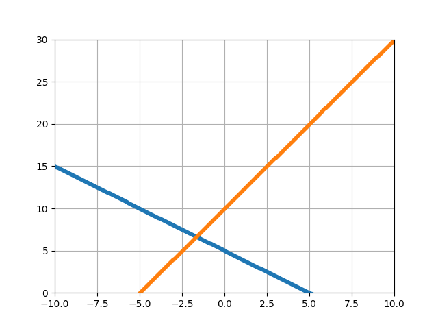

Homojen Kordinatlar, Kesişim

Homojen kordinatların $(u,v,1)$ şeklinde olduğunu hatırlayalım, ki
$(uw,vw, w)$ aynı kordinat oluyordu, çünkü bir homojen kordinatin
3. hücresinde ne varsa tüm kordinat degerlerini onunla bölebiliyorduk [1].

Kartezyen düzlemde çizgi denklemi $ax+by+c=0$'i şu şekilde görebiliriz,
$x,y$ çizgi üzerinde birer noktadır, homojen bağlamda $x=u/w$, $y=v/w$
olsun, o zaman $w$ ile çarparak, yani bu homojen $(u,v,w)$ noktasını ileri
/ geri hareket ettirerek tüm çizgiyi kapsayabiliriz. Bu tanımları Kartezyen
çizgi denklemine geri sokarsak, çizgiyi homojen olarak
tanımlayabileceğimizi görürüz,

$$ au + bv + w = 0$$

Bu denklem homojen çizgi denklemi olarak biliniyor. Yani bir çizgiyi 

$$ \ell = (a,b,c)$$

homojen kordinatlarıyla tanımlayabiliriz. $\ell$'in sıfır olmayan herhangi
bir katı aynı çizgiyi tanımlayacağına göre $\ell$'yi bir yön olarak
düşünmek te mümkün, ve çizgi için yönden başka bir şeye zaten ihtiyaç yok.

Tüm bu tanımlara göre $p=(u,v,w)$'nin homojen kordinatta bir nokta olduğunu
düşünelim. O zaman $p$'nin bir çizgi üzerinde olması demek, $p$ ve
$\ell$'nin noktasal çarpımının sıfır olması demektir,

$$ p \cdot \ell = 0$$

Değil mi? Çünkü 

$$ 
au + bv + cw = 
\left[\begin{array}{r}
a \\ b \\ c
\end{array}\right] 
\cdot
\left[\begin{array}{r}
u \\ v \\ w
\end{array}\right] = 0
$$

O zaman iki çizginin kesişimini şöyle buluruz. Diyelim ki iki çizgi $\ell_1$
ve $\ell_2$'nin kesişme noktası $p$, o zaman

$$ \ell_1 \cdot p = 0, \qquad \ell_2 \cdot p = 0$$

ki herşey homojen kordinatta. Üstteki tanımlardan şu sonuç çıkıyor, $p$ hem
$\ell_1$ hem de $\ell_2$'ye dikgendir. İki vektöre dikgen olan üçüncü bir
vektörü nasıl buluruz? Çapraz çarpımla! Yani $p = \ell_1 \times \ell_2$. O
zaman kesişim noktasının hesabı gayet basit, mesela üstteki örnek için

```python
p = np.cross(l1,l2) 
print p / p[2]
```

```
[-2  6  1]
```

Hakikaten de kesişim noktasının $x=-2,y=6$'da olduğunu görebiliyoruz. 

Aynı mantıkla iki noktadan geçen bir çizginin formülünü bulmak için şunun
doğru olduğundan hareket edebiliriz,

$$ p_1 \cdot \ell = 0, \qquad p_2 \cdot \ell = 0$$

O zaman bilinen iki noktadan geçen çizgi bu iki noktanın (homojen
kordinatındaki) çapraz çarpımıdır! 

Örnek

(3,1) ve (-4,5)'den geçen çizginin formülü nedir? 

Cevap

Bu formül 

$$ \ell \cdot (3,1,1) = 0$$

$$ \ell \cdot (-4,5,1) = 0$$

denklemlerini tatmin etmelidir. O zaman çizgi 

```python
print np.cross(np.array([3,1,1]), np.array([-4,5,1]))
```

```
[-4 -7 19]
```

olacaktır. Yani çizgi formülü $4x + 7y - 19 = 0$. 

Yol bulmak amaçlı yol sonunu gösteren kesişim noktasını bulmak için bir
algoritma şöyle olabilir,

1. Görüntüdeki yeterince büyük olan tüm çizgileri bul (çizgiler Hough
transformdan başlangıç bitiş noktaları ile tanımlı, bunları çapraz çarpımı
ile çizgi formülüne çevir).

2. Tüm çizgiler arasındaki ikili kombinasyonlara teker teker bak, ve
aralarındaki kesişim noktasını hesapla. 

3. İmajın orta noktasına uzak olan noktaları ele. 

4. Ortalamayı al.

```python
import itertools

def vanish(fin):
    im = Image.open(fin).convert('L')
    edges = canny(np.array(im), 2, 1, 25)
    lines = probabilistic_hough_line(edges, threshold=20, line_length=30,line_gap=3)
    im = Image.open(fin)
    new_lines = []
    for line in lines:
        p1 = np.array([1,1,1]); p1[:2] = line[0] 
        p2 = np.array([1,1,1]); p2[:2] = line[1] 
        new_lines.append(np.cross(p1,p2))
    res = []
    for (l1,l2) in itertools.product(new_lines,new_lines):
        if np.all(l1==l2): continue
        inters = np.cross(l1,l2) 
        inters = inters / inters[2]
        if np.sqrt((160-inters[0])**2 + (120-inters[1])**2) < 100: 
            res.append(inters)
    res = np.array(res)
    vanish = res.mean(axis=0)
    return im, lines, vanish
```

```python
im, lines, vp = vanish('in1.jpg')
for line in lines:
    p0, p1 = line
    plt.plot((p0[0], p1[0]), (p0[1], p1[1]))
plt.plot(vp[0], vp[1],'rd')
plt.imshow(im)
plt.savefig('vision_40lines_11.png')
```

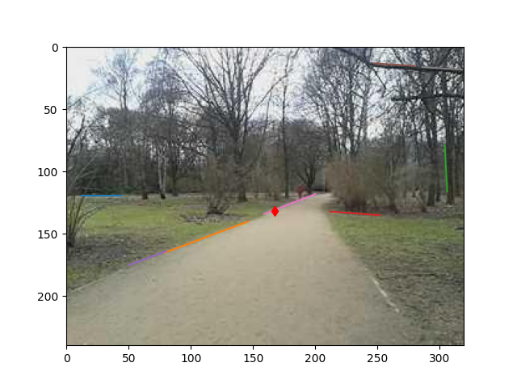

```python
im, lines, vp = vanish('in2.jpg')
for line in lines:
    p0, p1 = line
    plt.plot((p0[0], p1[0]), (p0[1], p1[1]))
plt.plot(vp[0], vp[1],'rd')
plt.imshow(im)
plt.savefig('vision_40lines_12.png')
```


Farklı birleşim nokta hesapları [2, sf. 21]'de bulunabilir.

Hiperdüzlemler

Hiperdüzlemler ve yarı uzaylar (halfspace) konusuna da bakalım. Bu kavram
Destek Vektör Makinaları tekniği için çok önemli.

Bir düzlemi tanımlamak için bir vektör yeterli, mesela 2 boyutta düşünelim,
$\left[\begin{array}{cc}1 & 2 \end{array}\right]^T$ vektörü, bu vektöre
dikgen olan tüm vektörlerin uzayı sonsuza giden bir çizgi oluşturur. Örnek
[4, sf. 378], orijinden geçen çizgi.

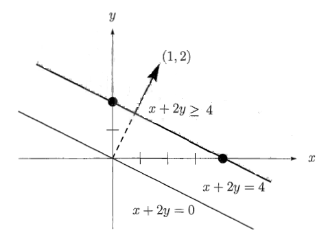

Bu çizgi $x + 2y = 0$, $w^Tu = 0 $ olarak ta temsil edilebilir, vektör çarpım
sonucunun sıfır olduğuna dikkat, bu dikgenlikten ileri geliyor. İkinci çarpımda
notasyon değişti, $u = \left[\begin{array}{cc}x & y \end{array}\right]^T$, ve $w
= \left[\begin{array}{cc}1 & 2 \end{array}\right]^T$ oldu, ama sonuç aynı.

Bu çizginin tüm uzayı ikiye böldüğü de söylenebilir, ortaya iki yarı uzay ortaya
çıkartarak.

Yarı uzayın nasıl tanımlandığını anlamadan önce, eğer $x + 2y = 0$'i 2 yukarı
çıkartmak istesek, $x + 2y = 4$ kullanabileceğimizi görelim, grafikte görüldüğü
gibi. O zaman $x + 2y = 4$ çizgisinin böldüğü yarı uzaylar,

$$ x = 2y \ge 4  $$

$$ x = 2y < 4  $$

olarak tanımlanabilir, çünkü bir çizginin üstünde ya da altında kalmak üstteki
şekilde eşitsizlikler olarak ortaya çıkartacaktır.

Bazı örnekler, ve grafikleme rutinleri görelim,

```python
def plot_sep(w,color='blue'):
    Q = np.array([[0, -1],[1, 0]])
    x = np.linspace(-20,20,1000)
    w2 = np.dot(Q,w[:2])
    m = w2[1]/w2[0]
    y = m*x + (-w[2]/w[1])
    plt.plot(x,y,'.',color=color)

a = np.array([1., 2., -4])
plot_sep(a)
plt.xlim(-5,5)
plt.ylim(-5,5)
plt.grid(True)
plt.savefig('14_4.png')
```

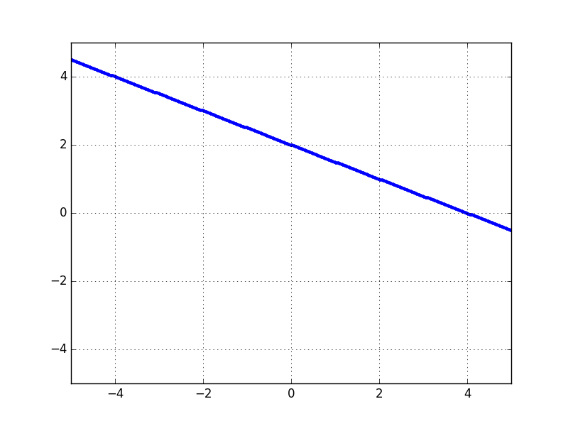

Noktaların çizginin neresine düştüğünden hareketle bazı $wx + b$ sonuçları

```python
a1 = np.array([2., 2., -50.])
plot_sep(a1,color='green')
a2 = np.array([-1., 1., -4.])
plot_sep(a2,color='blue')

pt = np.array([10.,10.,1.])
plt.plot(pt[0],pt[1],'gd')
print np.dot(a1,pt)
print np.dot(a2,pt)

pt = np.array([14.,15.,1.])
plt.plot(pt[0],pt[1],'rd')
print np.dot(a1,pt)
print np.dot(a2,pt)

pt = np.array([8.,18.,1.])
plt.plot(pt[0],pt[1],'rx')
print np.dot(a1,pt)
print np.dot(a2,pt)

plt.xlim(5,15)
plt.ylim(0,20)
plt.savefig('14_5.png')
```

```
-10.0
-4.0
8.0
-3.0
2.0
6.0
```

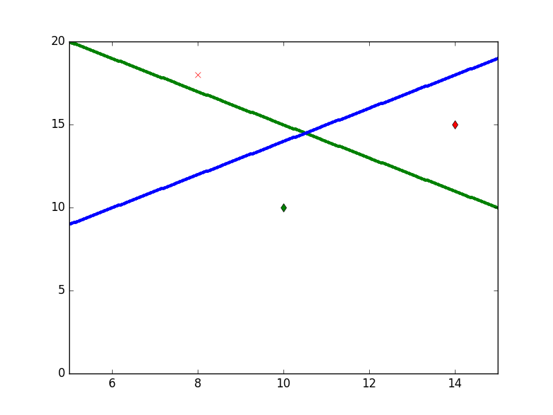

Kaynaklar 

[1] Jia, *Problem Solving Techniques for Applied Computer Science*,
    [http://web.cs.iastate.edu/~cs577/](http://web.cs.iastate.edu/~cs577/)

[2] Hoiem, *Representations and Techniques for 3D Object Recognition and Scene Interpretation*

[3] Strang, *Linear Algebra and Its Applications, 4th Ed*

[4] Taylor, Kubovy, *The Role of Perspective*, [http://www.webexhibits.org/sciartperspective/perspective3.html](http://www.webexhibits.org/sciartperspective/perspective3.html)


