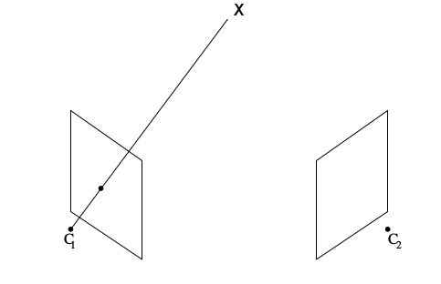
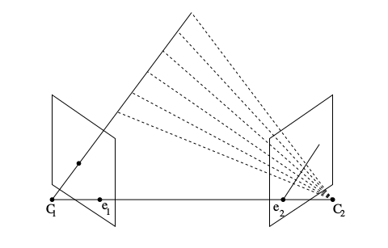
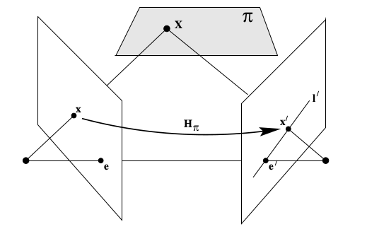
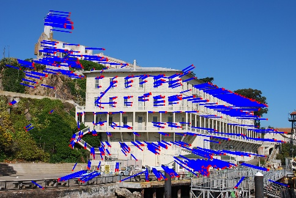
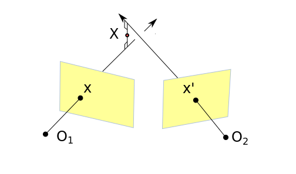
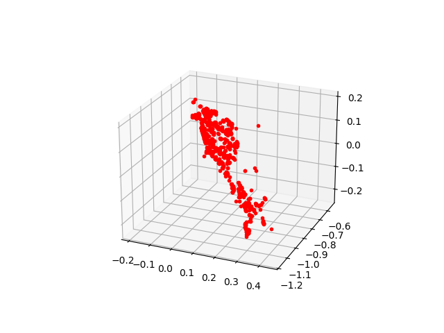
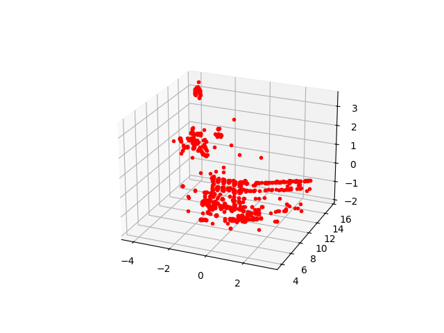

# İki İmaj Kullanarak 3 Boyutta Tekrar Oluşturmak (3D Reconstruction from Two Images)

Temel Matris (Fundamental Matrix)

8'inci derste vazgeçilmez matris (essential matrix) konusunu görmüştük. Şimdi bu
bölümdeki eşkutupsal kısıtlamanın (epipolar contraint) bir daha üzerinden
geçelim, ama bu sefer temel matrisi merkez alalım. Aslında vazgeçilmez ve temel
matrisler birbirine çok yakınlar, temel matris vazgeçilmezin içinden kalibre
edilme faraziyesinin çıkartılmış hali. [1, sf. 257] diyor ki vazgeçilmez
matriste her şey vazgeçilmez değilmiş demek ki (!).

Kalibrasyon, yani $K$ nasıl çıkartılır? Diyelim ki bir kamera matrisi
$P = K[R | t]$ olarak tanımlı ve $x = PX$ görüntüdeki bir piksel
noktası. Bilinen bir $K$ varsa onun tersini $x$'e uygulayarak
$\hat{x} = K ^{-1}x$ noktasını elde edebiliriz, o zaman
$\hat{x} = [R | t]X$ olur. Burada $\hat{x}$'i bir tür "normalize edilmiş''
kordinat sistemindeki bir görüntü pikseli olarak düşünebiliriz, bu sistem
sanki kalibrasyonu birim matris, yani $I$ olan bir kamera sistemidir. Aynı
şekilde $K ^{-1} P = [R|t]$ normalize kamera matrisi olarak adlandırılır.

Şimdi eşkutupsal kısıtlamaya tekrar bakalım. Altta soldaki resimde üç
boyutlu gerçek dünyada bir $X$ noktası var, bu noktadan merkezi $C_1$'de
olan kameraya bir çizgi çekiyoruz. Bu çizgi üzerindeki her nokta aslında
aynı piksel noktasına tekabül ediyor. Değil mi? Bu aslında bir bilgi
kaybıdır, o çizgi üzerindeki tüm noktalar aynı piksele yansırsa bir şeyler
kaybediliyor. Bu kaybedilen derinlik bilgisi. Neyse, şimdi bu çizgi
üzerindeki tüm o noktaların ikinci bir kameradaki yansımalarını
düşünelim. Bu tüm değişik yansımalar ikinci kameranın görüntüsünde bir
çizgi oluştururlar (aynı piksel değil bu sefer, çünkü başka bir
kameradayız), bu çizgiye eşkutupsal çizgi diyoruz (alt sağda).




Aynı duruma tek bir $X$ için bakalım,



Demek ki ilk kameradaki iki boyutlu bir $x$'i alıp ikinci kameradaki $x'$
noktasına transfer eden bir fonksiyon var, buna $H_{\pi}$ diyelim. Tranfer
2D-2D, yani iki boyuttan iki boyuta bir geçiş, bir homografi, ve $\pi$
düzlemi üzerinde bu geçiş oluyor. İkinci kameradaki eşkutupsal çizgi
$l' = [e']_x x'$ ile elde edilir, çünkü hatırlarsak iki noktadan çizgi elde
etmek için çapraz çarpım lazım, ya da vektörlerden birinin eksi bakışımlı
hali ile normal çarpım (altsimge $_x$ eksi bakışımlılık dönüşümünü temsil
ediyor). O zaman, ve $x' = H_\pi x$ olduğu için,

$$ l' = [e']_x x' = l' = [e']_x H x = F x $$

de denebilir. İşte bu denklemin $[e']_xH$ kısmına temel matris $F$ denir.

Eşkutupsal kısıtlama nedir? Bu kısıtlama

$$ x'^T F x = 0$$

ifadesidir. Bu ifade doğru çünkü eğer $x$ ve $x'$ birbirlerine karşılık
noktalar iseler, o zaman $x'$ eşkutupsal çizgi $l' = Fx$ üzerinde olmalı,
yani $0 = x'^T l' = x'^T F x$.

Nokta Karşılıkları ve 8-Nokta Algoritması

İki resimden üç boyutta tekrar oluşturma için önce $F$ matrisini hesaplamak
gerekiyor. Oradan vazgeçilmez matris $E$'ye geçeceğiz, sonra $E$ içinden
$R,T$ matrislerini çıkartabiliriz.

$F$'den $E$'ye geçiş basit, $E = K^TFK$. İspat: Eğer eşkutupsal kısıtlama
türetiminde normalize edilmiş noktaları kullansaydık
$\hat{x}'E \hat{x} = 0$ elde ederdik, ve $\hat{x}$ ve $\hat{x}'$ yerine $x$
ve $x'$ kullanırsak, $\hat{x} = K ^{-1}x, \hat{x'} = K ^{-1}x'$, o zaman
$x'^TK^{-T}E K ^{-1}x = 0$ elde ederiz, bu demektir ki $E = K ^T F K$.

$F$ hesabına dönelim. Elimizde iki imaj var, Alkatraz adasının iki değişik
yerden fotoğrafı [2,3]. Bu iki imaj üzerinde önce birbirine tekabül eden
noktaları bulacağız. Bu iş için OpenCV'nin ORB adı verilen nokta özelliği
(feature) çıkartan işlevini kullanabiliriz, onun yerine SIFT, SURF te
olabilirdi.

```python
from mpl_toolkits.mplot3d import axes3d
import scipy.linalg as lin
import cv2

dir = "/opt/Downloads/skdata"
img1 = cv2.imread(dir + "/alcatraz1.jpg")
img2 = cv2.imread(dir + "/alcatraz2.jpg")

detector = cv2.ORB_create( nfeatures = 10000 )

def detect_features(frame):
    keypoints, descrs = detector.detectAndCompute(frame, None)
    if descrs is None: descrs = []
    return keypoints, descrs

FLANN_INDEX_LSH    = 6
flann_params= dict(algorithm = FLANN_INDEX_LSH,
                   table_number = 6, # 12
                   key_size = 12,     # 20
                   multi_probe_level = 1) #2


kp1, des1 = detect_features(img1)
kp2, des2 = detect_features(img2)

matcher = cv2.FlannBasedMatcher(flann_params, {})
matches = matcher.knnMatch(des1, des2, k = 2)

matches = [m[0] for m in matches \
           if len(m) == 2 and m[0].distance < m[1].distance * 0.75]

print ('uyan noktalar', len(matches))

pts1 = []; pts2 = []

for i in range(len(matches)):
    pt_a = kp1[matches[i].queryIdx].pt
    pt_b = kp2[matches[i].trainIdx].pt
    pt_a = np.array(pt_a).astype(int)
    pt_b = np.array(pt_b).astype(int)
    if np.sqrt(np.dot(pt_b-pt_a,pt_b-pt_a)) < 200:
        pts1.append(pt_a)
        pts2.append(pt_b)
        cv2.line(img1, tuple(pt_a), tuple(pt_b), (255, 0, 0), 5)
        cv2.circle(img1,tuple(pt_b), 5, (0,0,255), -1)

h,w,d = img1.shape
tmp = cv2.resize(img1, (int(w/4),int(h/4)))
cv2.imwrite('vision_20recons_01.jpg',tmp)

for pt in pts2: cv2.circle(img2,tuple(pt),5,(0,0,255),-1)
tmp = cv2.resize(img2, (int(w/4),int(h/4)))
cv2.imwrite('vision_20recons_02.jpg',tmp)

pts1 = np.array(pts1)
pts2 = np.array(pts2)

h,w,dum = img1.shape
pts1[:,1] = h-pts1[:,1]
pts2[:,1] = h-pts2[:,1]
```

```text
uyan noktalar 1289
```




Birinci resimde saptanan ORB noktalarının ikinci resimdeki noktalara nasıl
nasıl eşleştiğini (yine birinci resimde) gösterdik, ikinci resimde o
resimdeki eşleşme noktaları görülüyor. Noktalardaki kayma kameranının
hareketi hakkında bir ipucu veriyor bize, hareketi çıplak gözle bile
görebiliyoruz. Temel matrisi hesaplayınca daha net bir sonuç alacağız
tabii.

8-Nokta Algoritması

Daha önce $E$ için 8-nokta algoritmasını gördük, benzer bir hesap $F$ için
de var. Bu arada 8 nokta dedik daha fazlasına da izin veren bir çözüm
yöntemi SVD ile mümkün. Çözülecek sistem eşkutupsal kısıtlamadan başlar,
$i=1,2,..$ olacak şekilde her $x_1^i,x_2^i$ eşleşmelerini bir
$x_1^i F x_2^i = 0$ hesabını içinde barındıran bir $Af = 0$ sistemi
yaratabiliriz, $x_1^i = (x_1^i,y_1^i,w_1^i)$ ve $x_2^i=(x_2^i,y_2^i,w_2^i)$
olacak şekilde,

$$ 
\left[\begin{array}{ccccc}
x_2^1x_1^1 & x_2^1y_1^1 & x_2^1w_1^1 & \dots & w_2^1w_1^1 \\
x_2^2x_1^2 & x_2^2y_1^2 & x_2^2w_1^2 & \dots & w_2^2w_1^2 \\
\vdots & \vdots & \vdots & \vdots & \vdots  \\
x_2^nx_1^n & x_2^ny_1^n & x_2^nw_1^n & \dots & w_2^nw_1^n
\end{array}\right]
\left[\begin{array}{c}
F_{11} \\ F_{12} \\ F_{13} \\ \vdots \\ F_{33} 
\end{array}\right] = 0
$$

ki $f$ içinde $F$'nin öğeleri var. Üstteki çarpım yapılınca teker teker her
satırda eşkutupsal kısıtlamayı elde edebileceğimizi görebiliriz. $Af = 0$
sistemi yaklaşık olarak SVD ile çözülebilir.

```python
def compute_fundamental(x1, x2):
  n = x1.shape[1]
  A = np.zeros((n, 9))
  for i in range(n):
    A[i] = [x1[0, i] * x2[0, i],  x1[0, i] * x2[1, i],  x1[0, i] * x2[2, i],
            x1[1, i] * x2[0, i],  x1[1, i] * x2[1, i],  x1[1, i] * x2[2, i],
            x1[2, i] * x2[0, i],  x1[2, i] * x2[1, i],  x1[2, i] * x2[2, i],
           ]

  U, S, V = np.linalg.svd(A)
  F = V[-1].reshape(3, 3)

  U, S, V = np.linalg.svd(F)
  S[2] = 0
  F = np.dot(U, np.dot(np.diag(S), V))
  return F / F[2, 2]
```

Eğer biraz önce bulunan noktalar üzerinde uygularsak,

```python
def make_homog(points):
  return np.vstack((points, np.ones((1, points.shape[1]))))
print (compute_fundamental(make_homog(pts1.T),make_homog(pts2.T)))
```

```text
[[ 9.72179429e-08  1.72737429e-06 -1.74727581e-03]
 [-8.39498472e-07  9.04878124e-07 -2.19855069e-03]
 [ 8.74608699e-04  2.38371775e-04  1.00000000e+00]]
```

Dahası da var. Bu hesap fena değildir, fakat $F$ gibi kritik bir hesap için
daha sağlam bir yaklaşım tercih ediliyor. RANSAC adı verilen metotla
verilen tüm eşleşme noktalarından ufak örneklemler toplanır, her örneklem
üzerinde üstteki hesap uygulanır, ve elde edilen sonuçlara bakılarak gerçek
$F$'e yaklaşıp yaklaşılmadığı kararlarlaştırılmaya çalışılır, en iyi,
stabil olan nihai sonuç elde tutulur. Detaylar için [1, sf. 291]. OpenCV
`cv2.findFundamentalMat` çağrısı $F$'yi RANSAC ile
hesaplayabilir. Sonra $E$, onu $R,t$ parçalarına ayırırız, vs., böyle devam
ederiz.

```python
# kamera matrisi biliniyor
K = np.array([[2394,0,932],[0,2398,628],[0,0,1]])

F, mask = cv2.findFundamentalMat(pts1, pts2, cv2.FM_RANSAC, 3.0, 0.99)
print ('F', F)
E = K.T.dot(F).dot(K)
print ('E', E)
R1,R2,t = cv2.decomposeEssentialMat(E)
print ('R1',R1)
print ('R2',R2)
print ('t',t)
```

```text
F [[ 3.23525233e-08  4.38638128e-06 -1.14468511e-03]
 [-4.85059031e-06  2.48532709e-07  1.50124300e-02]
 [ 9.19665040e-04 -1.62050730e-02  1.00000000e+00]]
E [[  0.18541995  25.1813903    3.92643503]
 [-27.84632704   1.42916348  25.53332459]
 [ -5.01866937 -28.68220729  -0.1042787 ]]
R1 [[ 0.00756453 -0.15206339  0.9883418 ]
 [-0.17952009 -0.9725189  -0.14825492]
 [ 0.98372522 -0.17630573 -0.03465508]]
R2 [[ 0.99321306 -0.02705221  0.11311937]
 [ 0.02918137  0.99942599 -0.01720867]
 [-0.11258891  0.02039286  0.99343237]]
t [[ 0.74947563]
 [-0.11258766]
 [ 0.65238815]]
```

Üçgenleme (Triangulation) 

Yer değiştirme, rotasyon matrislerini biliyoruz, oradan her kamera için
yansıtma matrisleri $P,P'$'yi oluşturabiliriz. Peki bu matrisleri
kullanarak üç boyutta gerçek nokta $X$'leri nasıl hesaplarız?  Halen
elimizde sadece iki boyutlu imaj noktaları var, 3D dünya noktaları
yok. $X$'leri hesaplamak için daha önce gördüğümüz direk lineer transform
metotunun benzerini uygularız. Bu gerekli çünkü her iki kameradaki
yansımadan oluşan hatalar, vs. sonucu mesela iki kameradan direk çizgi
çekerek kesiştikleri yeri bulmaya çalışsak, alttaki durum ortaya çıkar,



O zaman yaklaşıksal bir çözüm gerekli, üstteki hata ortaya çıksa da, bu
hatayı olabildiğince minimize etmeye uğraşmalıyız. 

Birbirinin eşi olan iki piksel noktası için elimizde $x = PX, x' = P'X$
denklemleri var, bu denklemde $X$ aynı dikkat edersek, çünkü aynı 3D
noktasının iki kameradaki değişik yansımaları var. Bu denklemleri
birleştirerek bir $AX=0$ sistemi ortaya çıkartabiliriz [1, sf. 312], ve bu
sistem minimize edilebilir. Çapraz çarpım ile homojen ölçek faktörünü
çıkartırsak, mesela ilk imaj için

$$ x \times (PX) = 0$$

Bu bize üç denklem verir, 

$$ x(p^{3T}X) - (p^{1T}X) = 0 $$

$$ y(p^{3T}X) - (p^{2T}X) = 0 $$

$$ x(p^{2T}X) - (p^{1T}X) = 0 $$

ki $p^{iT}$ $P$ matrisinin satırlarıdır. Bu denklemler $X$'in öğelerine göre
lineerdir. Bu sistemden hareketle $AX=0$'daki $A$ şöyle, 

$$ A = \left[\begin{array}{c}
xp^{3T} - p^{1T} \\ 
yp^{3T} - p^{2T} \\
x'p'^{3T} - p'^{1T} \\
y'p'^{3T} - p'^{2T} 
\end{array}\right]$$

Her iki imajdan iki denklem alındı, toplam 4 denklem oldu. Bu denklem SVD
ile, ya da $AX=b$ şeklinde tekrar düzenlenip 2. derste gördüğümüz sözde ters
(pseudoinverse) ile çözülebilir. Altta bu yöntem takip edildi,

```python
import scipy.linalg as lin

def triangulate_point(u1, u2, P1, P2):
  A = [[u1[0]*P1[2,0]-P1[0,0],u1[0]*P1[2,1]-P1[0,1],u1[0]*P1[2,2]-P1[0,2]],
       [u1[1]*P1[2,0]-P1[1,0],u1[1]*P1[2,1]-P1[1,1],u1[1]*P1[2,2]-P1[1,2]],
       [u2[0]*P2[2,0]-P2[0,0],u2[0]*P2[2,1]-P2[0,1],u2[0]*P2[2,2]-P2[0,2]],
       [u2[1]*P2[2,0]-P2[1,0],u2[1]*P2[2,1]-P2[1,1],u2[1]*P2[2,2]-P2[1,2]]]
  B = [[-(u1[0]*P1[2,3]-P1[0,3])],
       [-(u1[1]*P1[2,3]-P1[1,3])],
       [-(u2[0]*P2[2,3]-P2[0,3])],
       [-(u2[1]*P2[2,3]-P2[1,3])]]
  A = np.array(A)
  B = np.array(B)
  X = lin.lstsq(A,B)[0].T[0]
  res = np.array([X[0],X[1],X[2],1])
  return res

def triangulate(x1, x2, P1, P2):
  X = [triangulate_point(x1[i, :], x2[i, :], P1, P2) for i in range(len(x1))]
  return np.array(X).T
```

Test amaçlı olarak bilinen `P1,P2` ve yine iki boyutta eşliği bilinen
noktalarla üçgenleme yapalım, sonra elde edilen üç boyutlu noktaları
kameralara yansıtalım ve başladığımız imaj noktalarına uyuyor mu kontrol
edelim.

```python
P1 = np.eye(4)
P2 = np.array([[ 0.878, -0.01 ,  0.479, -1.995],
              [ 0.01 ,  1.   ,  0.002, -0.226],
              [-0.479,  0.002,  0.878,  0.615],
              [ 0.   ,  0.   ,  0.   ,  1.   ]])
# Homogeneous arrays
x1real = np.array([[ 0.091,  0.167,  0.231,  0.083,  0.154],
                   [ 0.364,  0.333,  0.308,  0.333,  0.308],
                   [ 1.   ,  1.   ,  1.   ,  1.   ,  1.   ]])
x2real = np.array([[ 0.42 ,  0.537,  0.645,  0.431,  0.538],
                   [ 0.389,  0.375,  0.362,  0.357,  0.345],
                   [ 1.   ,  1.   ,  1.   ,  1.   ,  1.   ]])
X = triangulate( x1real.T, x2real.T, P1, P2 )
X /= X[3]
x1 = np.dot(P1[:3],X)
x2 = np.dot(P2[:3],X)
x1 /= x1[2]
x2 /= x2[2]
 
print ('X', X)
print ('x', x1)
print ('x2', x2)
```

```text
X [[ 1.00277411  2.00859585  3.01259205  1.00350223  2.01053989]
 [ 4.01217675  4.01023497  4.01743619  4.02955748  4.01893278]
 [11.01977032 12.02833872 13.04162674 12.0914948  13.05493008]
 [ 1.          1.          1.          1.          1.        ]]
x [[0.09099773 0.16698863 0.23099818 0.0829924  0.15400618]
 [0.36408896 0.33339891 0.30804717 0.33325553 0.3078479 ]
 [1.         1.         1.         1.         1.        ]]
x2 [[0.4200205  0.53709008 0.64501081 0.43105574 0.5379661 ]
 [0.38890029 0.37453124 0.36194221 0.35671322 0.34517828]
 [1.         1.         1.         1.         1.        ]]
```

Ana problemimize dönelim; şimdi ikinci kamera için ayrıştırmadan elde
edilen $R,t$ sonuçlarını kamera matrisi $K$ ile çarparak $P_2$ oluşturulmak
lazım ($P_1$ birim matrisi, o biliniyor), ve böylece her imaj nokta eşleri
için üçgenleme yapacağız. Fakat 8. derste bahsedildiği gibi $E$'nin
ayrıştırmasından dört türlü farklı $R,t$ olasılığı ortaya çıkıyor, bu
sonuçların her biri denenmeli. Altta bunu yapıyoruz, yani her seçenek için
bir üç boyutta tekrar oluşturma yapacağız, ve sonuçları farklı grafiklerde
göstereceğiz.

```python
for i,P in enumerate(((R1,t),(R1,-t),(R2,t),(R2,-t))):

    P1 = K.dot(np.hstack(P))
    P00 = np.float64([ [1,0,0,0],
                       [0,1,0,0],
                       [0,0,1,0]])
    P0 = K.dot(P00) 

    X = triangulate(pts1, pts2, P0, P1)

    fig, ax = plt.subplots(1, 1, subplot_kw={'projection': '3d'})
    ax.plot(X[0], X[2], X[1], 'r.')
    ax.view_init(elev=23., azim=-67)
    plt.savefig('vision_20recons_03_%d.png' % i)
```






Galiba alt sağdaki resim Alkatraz'a daha çok benziyor. Gerçek dünya
uygulamalarında "kamera önüne düşen en çok nokta hangisinde'' gibi ek
kodlar geliştirip gerçek 3D sonucu bu şekilde elenebiliyor. 

Kaynaklar

[1] Zisserman, *Multiple View Geometry in Computer Vision 2nd Edition*

[2] Bayramlı, *Resim 1*, [https://www.dropbox.com/scl/fi/fy280cfv76a0wqhm08zf6/alcatraz1.jpg?rlkey=837qf9yvut7v0ha25q5qfm6gb&st=th3vk7f5&raw=1)

[3] Bayramlı, *Resim 2*, [https://www.dropbox.com/scl/fi/mtqme2tbkfogoryxhjeg5/alcatraz2.jpg?rlkey=wn153s6fjoppjizw2619p1wt6&st=c0s25ki8&raw=1)

