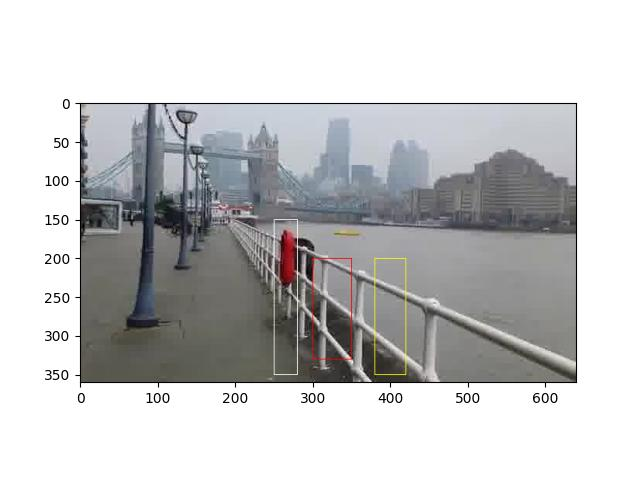

Kovaryans Uzakligi


```python
from PIL import Image, ImageDraw

def cov_box(A, xx, yy, box):
    xmin,ymin = box[0]
    xmax,ymax = box[1]
    filt = (xx >= xmin) & (xx <= xmax) & (yy >= ymin) & (yy <= ymax)
    xxc = xx[filt]
    yyc = yy[filt]
    A_filtered = A[yyc, xxc, :]
    features = np.zeros((len(xxc), 5))
    features[:, 0] = xxc
    features[:, 1] = yyc
    features[:, 2:] = A_filtered    
    features_centered = features - np.mean(features, axis=0)
    covariance_matrix = (features_centered.T @ features_centered) / (len(xxc) - 1)     
    return covariance_matrix

def frobenius_distance(A, B):
    if np.isnan(A).all() or np.isnan(B).all(): return np.inf
    C = np.linalg.solve(A, B)
    eigvals = np.linalg.eigvals(C)    
    log_eigvals = np.log(np.abs(eigvals))    
    dist_sq = np.sum(log_eigvals**2)
    distance = np.sqrt(dist_sq)
    return distance


box1 = [(300,200),(350,330)]
box2 = [(380,200),(420,350)]
box3 = [(250,150),(280,350)]

image = Image.open("t00100.jpg")
A = np.array(image)
M, N, d = A.shape

x = np.linspace(0, N - 1, N).astype(int)
y = np.linspace(0, M - 1, M).astype(int)
xx, yy = np.meshgrid(x, y)

c1 = cov_box(A, xx, yy, box1)

c2 = cov_box(A, xx, yy, box2)

c3 = cov_box(A, xx, yy, box3)

print (frobenius_distance(c1,c2))

print (frobenius_distance(c1,c3))

img = ImageDraw.Draw(image)  
img.rectangle(box1, outline="red")
img.rectangle(box2, outline="yellow")
img.rectangle(box3, outline="white")
plt.imshow(image)
plt.savefig('vision_50colreg_05.jpg')
```

```text
2.4203367108521308
8.200977783832409
```



Kaynaklar

[3] Forstner, *A Metric for Covariance Matrices*, [https://www.ipb.uni-bonn.de/pdfs/Forstner1999Metric.pdf](https://www.ipb.uni-bonn.de/pdfs/Forstner1999Metric.pdf)

[4] Porikli, *Region Covariance: A Fast Descriptor for Detection and Classification*,
    [URL](https://www.porikli.com/mysite/pdfs/porikli%202006%20-%20Region%20Covariance%20A%20Fast%20Descriptor%20for%20Detection%20and%20Classification.pdf)