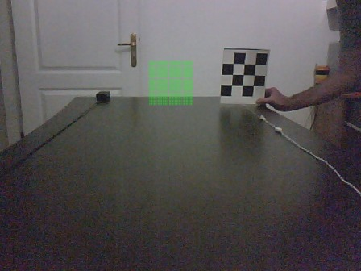
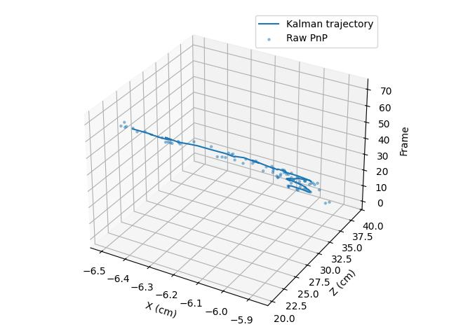
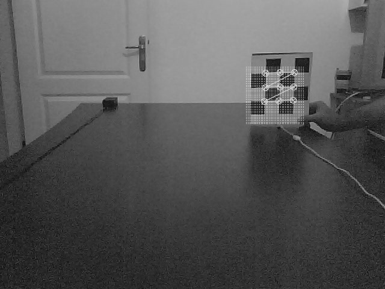
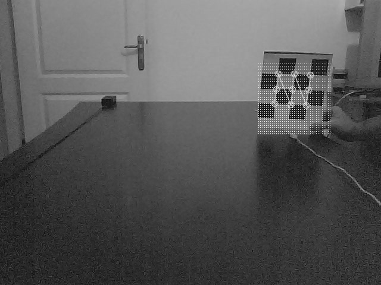

# Obje Takibi, Filtreler

Video görüntülerinde obje takibi için filtreleme kullanmak mümkün, bu
teknik ile iki boyutlu yansımadan üç boyutlu konum bilgisini takip
edebiliriz. Kalman Filtreleri (KF) ile görüntüde ilgilendiğimiz objeyi her
seferinde iki boyutta "bulmalıyız'', yani bu objenin örüntüsünün ne
olduğunu önceden biliyor olmamız gerekir, ve onu sonraki resimlerde takip
etmemiz gerekir. Bulduğumuz, iki boyutlu kordinat değerleridir, yani
ölçümsel büyüklüklerdir, ardından KF'in en son konumuna göre ürettiği
tahmin ile aradaki fark KF'i düzeltmek için kullanılır.

Ölçümsel dönüşümü temsil eden H'e ben onun temeli olan yansıtma
(projection) kelimesinden gelen P matrisinden bahsedelim. Yansıma matrisi
görüntü (vision) literatüründe iğne delik kamerası (pinhole camera)
modelinden ileri gelen bir matristir ve bu matrisi hesaplamak ayarlama /
kalibrasyon (calibration) denen apayrı bir işlemin parçasıdır. OpenCV
içinde kalibrasyon için fonksiyonlar var, biz de bunları denedik,
kalibrasyon için kullandığımız resimlerle alakalı olmalı, elde edilen
sonuçlardan memnun kalmadık. Alternatif olarak şunu yaptık; resimde görülen
yeşil yüzey bizim programın oluşturduğu hayali bir yüzey. Filtrenin o anki
tahminini P üzerinden görüntüye yansıtarak bu yüzeyi oluşturduk, böylece
deneme / yanılma yöntemiyle pek çok P değerini deneyerek, yüzeyin resimde
görülen masanın sonunda çıkacak şekilde olmasını sağladık. Yansıtma için
kullanılan $K$ matrisi, yansıtma metotu ve başlangıç imajı altta:



### Kalman Fitreleri

Amacımız düz bir yüzey üzerinde hareket eden, üzerinde 4×4 karelik bir
satranç tahtası deseni bulunan bir kartonun, video görüntülerinden üç
boyutlu hareketinin nasıl takip edilebileceğini sistematık ve formel
bir çerçevede açıklamak. Geometrik olarak doğru ve istatistiksel
olarak tutarlı bir yöntem kullanmak istiyoruz.

Ele alınan yöntem iki ana bileşenden oluşur:

1. Görsel poz kestirimi (pose estimation) — her karede nesnenin 3D
konumu

2. Durum uzayı modeli + Kalman Filtresi — bu konumların zaman içinde
düzgünleştirilmesi.

Fiziksel senaryo

- Nesne: Üzerinde 4×4 karelik satranç tahtası baskısı olan düz bir karton
- Hareket: Masa üzerinde, yaklaşık sabit hızla, yatay doğrultuda
- Kamera: Sabit, tek kamera (monoküler)

Temel varsayımlar

1. Satranç tahtası düzdür (planar)
2. Tahtanın gerçek dünya geometrisi biliniyor (kare aralıkları eşit)
3. Kamera iç parametreleri (intrinsics) yaklaşık olarak biliniyor
4. Hareket, kısa zaman aralıklarında sabit hız modeliyle iyi temsil edilebilir

Bu varsayımlar, problemi hem iyi tanımlı hem de çözülebilir hale getirir.

Geometri ve Dinamiğin Ayrılması

Bu yaklaşımda kritik tasarım kararı şudur: Görüntü geometrisi ile
zaman dinamiğini birbirinden ayırmak

Bu ayrım sayesinde:

- Görüntüden 3D poz kestirimi ayrı bir problem olarak ele alınır
- Zaman içindeki hareket, durum uzayı modeli ile temsil edilir

Bu mimari, hem matematiksel olarak tutarlı hem de pratikte kararlı bir çözüm sunar.

Satranç Tahtası ve İç Köşeler (Önemli Detay)

4×4 karelik bir satranç tahtası:

- 4 × 4 kare
- ama yalnızca 3 × 3 iç köşe içerir

OpenCV’nin `findChessboardCorners` fonksiyonu kareleri değil, iç köşeleri bekler.

Bu yüzden kullanılan boyut:

```
board_size = (3, 3)
```

Bu detay gözden kaçarsa:
- Hiç köşe bulunmaz
- Takip tamamen sessizce başarısız olur

Poz Kestirimi (Pose Estimation) – solvePnP

Temel ilke

Elimizde şunlar var:

- 3D noktalar: Satranç tahtasının gerçek dünyadaki köşe koordinatları
- 2D noktalar: Görüntüde tespit edilen köşeler
- Kamera matrisi: `K`

Bu bilgilerle aşağıdaki geometrik problem çözülür:

"Bilinen 3D noktaların, görüntü düzlemindeki 2D izdüşümlerinden,
nesnenin kamera koordinat sistemindeki konum ve yöneliminin
kestirilmesi"

Sayısal çözüm (OpenCV)

```python
ok, rvec, tvec = cv2.solvePnP(object_points,
                             image_points,
                             K,
                             distCoeffs)
```

Çözüm sonucunda elde edilen büyüklükler:

- `rvec`: Nesnenin yönelimini temsil eden dönme vektörü (Rodrigues gösterimi)
- `tvec`: Nesnenin kamera koordinat sistemindeki öteleme vektörü

`tvec = [X, Y, Z]` doğrudan metrik 3D konumdur.

Bu aşamadan sonra:

- Projeksiyon matrisi tahmin etmeye
- Homojen koordinatlarla oynamaya
- Filtrenin içine kamera modeli sokmaya

gerek yoktur.

Neden X–Z Düzlemi Takip Edildi?

Fiziksel senaryoda:

- Y ekseni (yükseklik) neredeyse sabittir
- Asıl bilgi:
  - X → yatay hareket
  - Z → kameraya uzaklık

Bu yüzden Kalman filtresinin durumu şöyle tanımlandı:

```
x_t = [X, Z, dX, dZ]
```

Bu, problemi:

- Daha düşük boyutlu
- Daha kararlı
- Daha yorumlanabilir

hale getirir.

Kalman Filtresi Modeli

Durum geçiş modeli (sabit hız)

$$
X_{t+1} = X_t + dX_t · \Delta t
$$

$$
Z_{t+1} = Z_t + dZ_t · \Delta t
$$

Matris formunda:

```
F = [[1, 0, dt, 0],
     [0, 1, 0, dt],
     [0, 0, 1,  0],
     [0, 0, 0,  1]]
```

Ölçüm modeli

Ölçüm, doğrudan PnP’den gelen konumdur:

```
z_t = [X, Z]
```

Bu nedenle ölçüm matrisi basittir:

```
H = [[1, 0, 0, 0],
     [0, 1, 0, 0]]
```

Model tamamen doğrusal olduğu için klasik Kalman filtresi yeterlidir.

Kodu `track-chess-kf.py` içinde bulabiliriz.

Notasyon ve Semboller

| Sembol | Açıklama |
|------|---------|
| \(X, Y, Z\) | Nesnenin kamera koordinat sistemindeki 3D konumu (metrik birimler) |
| \(X, Z\) | Bu çalışmada takip edilen yatay (X) ve derinlik (Z) bileşenleri |
| \(dX, dZ\) | İlgili eksenlerde hız bileşenleri |
| \(x_t\) | Kalman filtresinin \(t\) anındaki durum vektörü \([X, Z, dX, dZ]^T\) |
| \(z_t\) | Ölçüm vektörü (PnP’den elde edilen \([X, Z]^T\)) |
| \(rvec\) | Nesnenin yönelimini temsil eden Rodrigues dönme vektörü |
| \(tvec\) | Nesnenin kamera koordinat sistemindeki öteleme vektörü \([X, Y, Z]^T\) |
| \(K\) | Kamera iç parametrelerini içeren kamera matrisi |
| \(F\) | Durum geçiş matrisi (sabit hız modeli) |
| \(H\) | Ölçüm matrisi |
| \(Q\) | Süreç gürültüsü kovaryans matrisi |
| \(R\) | Ölçüm gürültüsü kovaryans matrisi |

```python
import pandas as pd

df = pd.read_csv("trajectory.csv")
print(df.head())

import matplotlib.pyplot as plt
from mpl_toolkits.mplot3d import Axes3D  # noqa

fig = plt.figure()
ax = fig.add_subplot(111, projection='3d')

ax.plot(df["kf_X"], df["kf_Z"], df["frame"],
        label="Kalman trajectory")

ax.scatter(df["raw_X"], df["raw_Z"], df["frame"],
           s=5, alpha=0.4, label="Raw PnP")

ax.set_xlabel("X (cm)")
ax.set_ylabel("Z (cm)")
ax.set_zlabel("Frame")

ax.legend()
plt.tight_layout()
plt.savefig('vision_60track_02.jpg')
```



Başlangıç Salınımı (Zig-Zag) Neden Normal?

Elde edilen sonuçlarda başta küçük bir zig-zag görülmesi doğaldır:

- Başlangıçta hız bilinmiyor (0 varsayılıyor)
- İlk ölçümlerle hız öğreniliyor
- Filtre kısa bir “ısınma” (burn-in) süreci yaşıyor

Bu, Kalman filtrelerinde beklenen ve sağlıklı bir davranıştır.

İstenirse:
- İlk iki ölçümden hız tahmin edilerek
- ya da RTS smoother uygulanarak

tamamen giderilebilir.

Sonuç ve Değerlendirme

Bu yaklaşım ile:

- Görsel geometri doğru yerde çözüldü
- Kalman filtresi yalnızca zaman dinamiğini üstlendi
- Ayar gereksinimi ciddi şekilde azaldı
- Elde edilen yörünge fiziksel olarak anlamlı hale geldi

Özet olarak, kullanılan modelleme yaklaşımı hem geometrik hem de
istatistiksel açıdan tutarlıdır ve uygulamada güvenilir sonuçlar
üretir.

Bu mimari, daha ileri çalışmalar (RTS smoothing, ivmeli hareket
modelleri, faktör grafik tabanlı yaklaşımlar) için sağlam bir temel
sunmaktadır.

Takip sirasinda daha onceki bazi kodlardan alinan ciktilar alttadir.




### Parcaçık Filtreleri (Particle Filters)

Parçacık filtreleri (PF) bir dağılımı ayrıksal olarak temsil
edebilirler. Diyelim ki tek boyutlu bir dağılımı 100 öğe içeren bir dizin ile
temsil edebiliriz, o zaman dağılımın değerlerini 100 tane noktada taşımamız
gerekir.  Bunun faydaları her türlü dağılım şeklini temsil edebilmemiz. Gaussian
ile sadece tek bir tepe noktası olabilir, fakat ayrıksal temsil ile 2, 3,
istediğimiz kadar tepe noktası olan bir dağılımı temsil edebiliriz. Bu sayede
birden fazla gayrı lineer hipotezi aynı anda işletebiliriz. KF ile tepe noktası
en iyi tahminimizdir (mesela.. satranç kartonu masa ortasında), PF ile birkaç
tahmini aynı anda hesaplatmak mümkün olabilir.

PF kodlaması $x_t$ için iki tane veri yapısı gerekir. Biri dağılım
değerlerini temsil eden parçacıklardır, diğeri dağılımdaki önemini
temsil eden ağırlıklardır.  Filtreleme mekanığı KF'e benzer, önce bir
geçiş uygulanır, ki bu geçiş kararsızlığı arttıracaktır, ardından
gözlem verisi ve bir hata fonksiyonu üzerinden dağılım güncellenir. Bu
işlem sırasında hatası yüksek olan parçacıklar cezalandırılır, onların
ağırlığı azalır, ötekilerinki yükselir.

Bu uygulamada PF'in dışarıdan gelen gözlem verisine ihtiyacı var, veri
muhakkak gürültülüdür, [3]'te görülen yüz takip örneğinde olduğu gibi,
ve gözlem verisi görüntüde yeri saptanan satranç tahtası deseni
*piksel* olacaktır, ki bu değerler bir yansımayı temsil ediyor, gizli
bilgi objeşnin üç boyuttaki yeri var, bize gelenler onun iki boyuttaki
yansıması. BU desenin iki boyutta belli köşe noktalarını alıyoruz.

Şimdi PF'e gereken olurluk hesabı için her parçacığın iki boyut yer
hipotezine göre eldeki verinin ne kadar "mümkün" olduğu hesaplanır. Bu
hesaplara göre iyi tahmin etmiş olan parçacıklar ödüllendirilir,
diğerleri cezalandırılır.

Kodlar `track-chess-pf.py` içinde bulunabilir.

Kodlar

[track-chess-kf.py](track-chess-kf.py),
[track-chess-pf.py](track-chess-pf.py)

Kaynaklar

[1] Bayramlı, [Örnek  Video 1](https://www.dropbox.com/scl/fi/unbrewsp6vbhcslquqmpx/chessb-left.avi?rlkey=bcplm61t2kix3rti8nfpj55qx&st=1y9rflqg&raw=1)

[2] Bayramlı, [Örnek  Video 2](https://www.dropbox.com/scl/fi/pkjruc2u1g80cbn7ke6yw/chessb-right.avi?rlkey=3tl0x0c8tieo2z9j8tmzlspn1&st=075xba1m&raw=1)

[3] Bayramli, *Istatistik - Monte Carlo, Entegraller, Sıralı Monte Carlo*

