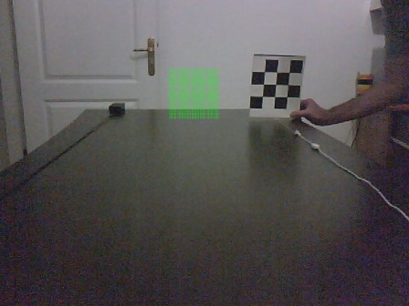

# Obje Takibi

Video görüntülerinde obje takibi için filtreleme kullanmak mümkün, bu
teknik ile iki boyutlu yansımadan üç boyutlu konum bilgisini takip
edebiliriz. Kalman Filtreleri (KF) ile görüntüde ilgilendiğimiz objeyi her
seferinde iki boyutta "bulmalıyız'', yani bu objenin örüntüsünün ne
olduğunu önceden biliyor olmamız gerekir, ve onu sonraki resimlerde takip
etmemiz gerekir. Bulduğumuz, iki boyutlu kordinat değerleridir, yani
ölçümsel büyüklüklerdir, ardından KF'in en son konumuna göre ürettiği
tahmin ile aradaki fark KF'i düzeltmek için kullanılır.

Parçacık filtreleri (PF) ile yine konum ve ölçüm fonksiyonu ikilisi var,
fakat ölçüm ile konumdan üretilen tahmin arasındaki uyumu bir olasılık,
olurluk (likelihood) olarak belirtmemiz gerekiyor, ki böylece PF tahminde
başarılı olan parçacıklara daha fazla önem verebilsin, ve hipotezler o
yönde devam etsin. 

Alttaki örnekte OpenCV kütüphanesinden elde ettiğimiz 2 boyutlu değerleri
ölçüm $y_t$ için kullanacağız. Değerler OpenCV'nin bir satranç tahtası
şeklinin köşe noktalarını `cvFindChessboardCorners` ile buluyor (ve
onları `cvDrawChessboardCorners` ile onları resimde gösteriyoruz).

Elimizdeki "gürültülü'' ölçümler iki boyutlu noktasal değerler. Gürültülü çünkü
kamera bize bu imajları aktarırken hata eklemiş olabilir, OpenCV fonksiyonu
hesabı yaparken hata eklemiş olabilir, bir sürü olasılık var.

Kalman Fitreleri

Bu örnekte, ayrıca, ilk kez KF ortamında boyut değişikliği olasılığını net bir
şekilde görebiliyoruz. Gizli konum bilgisi $x_t$ 3 boyutlu bir nokta, ama
elimizdeki ölçüm 2 boyutlu bir "yansıma''. Yansıma sırasında kaçınılmaz olarak
değer kaybediliyor, bir boyutun bilgisi ortadan yokoluyor. Ama tüm bu
bilinmezlere rağmen Kalman filtresinin bizim için gizli bilgiyi hesaplamasını
istiyoruz.

Bu problemde $\Phi$ matrisi ne olacaktır? Obje takibi konularında $\Phi$'nin ne
olduğunu hayal etmek daha kolay, $\Phi$ matrisi iki zaman dilimi arasındaki
"hareketi'' temsil edecek. Bu problemdeki ek bir kolaylık bu hareketi önceden
bildiğimiz, ve hareketin tek yönde olduğu. Yani resimde benim tuttuğum kartonu
ne kadar hızla hareket ettirdiğimi ben önceden probleme bildiriyorum. Yer
değişikliğini $d$ olarak tanımladım, ve $\Phi$ şöyle oldu:

$$ 
\Phi = 
\left[\begin{array}{rrrr}
1 & 0 & 0 & 0 \\
0 & 1 & 0 & 0 \\
0 & 0 & 1 & d \\
0 & 0 & 0 & 1
\end{array}\right]
$$

Dikkat edersek $\Phi$ 4x4 boyutunda, 3x3 değil. 3 boyutlu kordinatları temsil
etmek için homojen kordinat sistemini kullandığımız için böyle oldu, o sebeple
zaten $x_t$ de 4x1 oldu, ona uymak için $\Phi$'nin değişmesi gerekiyordu. $\Phi
x_t$ çarpımının hakikaten kartonu hareket ettirdiğini göstermek için bu çarpımı
bir örnek üzerinde yapalım: Diyelim ki $x_t =
\left[\begin{array}{cccc}a_1&a_2&a_3&a_4\end{array}\right]$ o zaman $\Phi x_t$
ya da $x_{t+1}$ şu hale gelir:
$\left[\begin{array}{cccc}a_1&a_2&a_3+d&a_4\end{array}\right]$.


Bakıyoruz, hakikaten de d kadarlık bir yer değişimi z kordinatı, yani
derinlik üzerinde eklenmiş. Test amaçlarımız için d = -0.5 aldık, yani
satranç tahta kartonunun her zaman diliminde kameraya doğru 0.5 cm
ilerlediğini belirttik. Tabii bu da kabaca bir tahmindi (her ne kadar
hareketi yaptıran ben olsam bile!), ama filrelemenin gücünü burada
görüyoruz. Benim tahminimde "gürültü'' yani "hata payı'' var, ölçümde
gürültü var, tüm bunlar üst üste konsa bile filtre yine de gizli konumu
bulacak.

Ölçümsel dönüşümü temsil eden H'e ben onun temeli olan yansıtma
(projection) kelimesinden gelen P matrisinden bahsedelim. Yansıma matrisi
görüntü (vision) literatüründe iğne delik kamerası (pinhole camera)
modelinden ileri gelen bir matristir ve bu matrisi hesaplamak ayarlama /
kalibrasyon (calibration) denen apayrı bir işlemin parçasıdır. OpenCV
içinde kalibrasyon için fonksiyonlar var, biz de bunları denedik,
kalibrasyon için kullandığımız resimlerle alakalı olmalı, elde edilen
sonuçlardan memnun kalmadık. Alternatif olarak şunu yaptık; resimde görülen
yeşil yüzey bizim programın oluşturduğu hayali bir yüzey. Filtrenin o anki
tahminini P üzerinden görüntüye yansıtarak bu yüzeyi oluşturduk, böylece
deneme / yanılma yöntemiyle pek çok P değerini deneyerek, yüzeyin resimde
görülen masanın sonunda çıkacak şekilde olmasını sağladık. Yansıtma için
kullanılan $K$ matrisi, yansıtma metotu ve başlangıç imajı altta:



```python
from numpy import *

K = array([[700., 0., 300.],
           [0., 700., 330.],
           [0., 0., 1.]])

def proj_board(im, xl, yl, z):
    h,w = im.shape[:2]
    for x in arange(xl-9, xl+9, 0.5):
        for y in arange(yl-9, yl+9, 0.5):
            X = array([x, y, z])
            q = dot(K, X)
            q = [int(q[0]/q[2]), int(q[1]/q[2])]           
            if q[0] >= w: return
            if h-q[1] >= h: return
            if h-q[1] < 0: return
            im[h-q[1], q[0]] = 255
```

O noktaya gelince istediğimiz P değerini bulmuş oluyorduk. Yansıtma
matrisleri 3x3 olur, KF buna bir dördüncü [0 0 0] satırı ekleyerek onu 4x3
H haline getiriyor.

KF'in başlangıç noktası olarak P'yi bulmak için kullandığımız masa sonunu
kullandık. Kararsızlık ölçütü Q için, ki bu değişken bir Gaussian
kovaryansıdır, $Q = I \cdot 150 cm$ değerini kullandık, yani oldukça büyük bir
kararsızlık değeri kullandık. Sebep başlangıç değeri olan masa ortasını
seçtik, ve takip edeceğimiz satranç tahtasının nerede olduğunu bilmiyoruz,
"emin değiliz''.  Bu kararsızlığı sayısal olarak programa bildirmiş olduk.

```python
import sys; sys.path.append('../../tser/tser_083_kf')
import util
from kalman_3d import *
import cv2

dim = 3
if __name__ == "__main__":    
    fin = sys.argv[1]
    cap = cv2.VideoCapture(fin)
    N = int(cap.get(cv2.CAP_PROP_FRAME_COUNT))
    fps = int(cap.get(cv2.CAP_PROP_FPS))
    kalman = Kalman(util.K, mu_init=array([1., 1., 165., 0.5]))
    
    for i in range(N):
        ret, frame = cap.read()
        h,w = frame.shape[:2]
        #proj_board(frame, 1, 1, 160) # basla
        gray = cv2.cvtColor(frame, cv2.COLOR_BGR2GRAY)
        status, corners = cv2.findChessboardCorners( gray, (dim,dim))
        is_x = []; is_y = []
        if status: 
            cv2.drawChessboardCorners( gray, (dim,dim), corners, status)
            for p in corners:
                is_x.append(p[0][0])
                is_y.append(p[0][1])

        if len(is_x) > 0 : 
            kalman.update(array([is_x[5], h-is_y[5], 1.]))
            util.proj_board(gray, 
                            kalman.mu_hat[0], 
                            kalman.mu_hat[1], 
                            kalman.mu_hat[2])
        if i % 10 == 0: 
            cv2.imwrite('/tmp/kf-out-%d.jpg' % i, gray)
        cv2.imshow('frame',gray)
        cv2.waitKey(20)
    
```

Kalman filtreleri (KF), eğer kararsızlık Gaussian olarak gösterilebiliyorsa çok
faydalı, ve hızlı bir yöntem. Bir KF bellekte çok az yer tutar, 3 boyutlu bir
Gaussian için 3x1 boyutunda bir ortalama vektörü, ve 3x3 boyutunda bir kovaryans
matrisi yeterlidir, yani 3 + 9 = 12 sayı.


Parcaçık Filtreleri (Partıcle Filters)

Parçacık filtreleri (PF) bir dağılımı ayrıksal olarak temsil
edebilirler. Diyelim ki tek boyutlu bir dağılımı 100 öğe içeren bir dizin ile
temsil edebiliriz, o zaman dağılımın değerlerini 100 tane noktada taşımamız
gerekir.  Bunun faydaları her türlü dağılım şeklini temsil edebilmemiz. Gaussian
ile sadece tek bir tepe noktası olabilir, fakat ayrıksal temsil ile 2, 3,
istediğimiz kadar tepe noktası olan bir dağılımı temsil edebiliriz. Bu sayede
birden fazla gayrı lineer hipotezi aynı anda işletebiliriz. KF ile tepe noktası
en iyi tahminimizdir (mesela.. satranç kartonu masa ortasında), PF ile birkaç
tahmini aynı anda hesaplatmak mümkün olabilir.

PF kodlaması $x_t$ için iki tane veri yapısı gerektirir. Biri dağılım
değerlerini temsil eden parçacıklardır, diğeri dağılımdaki önemini temsil eden
ağırlıklardır.  Filtreleme mekaniği KF'e benzer, önce bir geçiş uygulanır, ki bu
geçiş kararsızlığı arttıracaktır, ardından gözlem verisi ve bir hata fonksiyonu
üzerinden dağılım güncellenir. Bu işlem sırasında hatası yüksek olan parçacıklar
cezalandırılır, onların ağırlığı azalır, ötekilerinki yükselir. Her parçacık
için hata fonksiyonu şudur:

$$
w^{[i]} = \frac{1}{1 + (y^{[i]} - p^{[i]})^2  )}
$$

$y^{[i]}$ gözlem değeri, $p^{[i]}$ geçiş uygulandıktan sonra elimizdeki
tahminimizdir, ki bu KF dünyasındaki $\Phi x_t + Q$'nun karşılığıdır. PF için
hareket geçişi şöyle hesaplanır: Bir birörnek (uniform) dağılımdan örnekleme
yapılır, ve bu örneklenen değerler $x$'e eklenir. Örnekleme için z-kordinatı
için $Unif (-0.1, -1)$'i, x kordinatı için $Unif (-40, 40)$'i kullandık. Yani
ileri doğru 0.1 ve 1 santimetre arasında bir hareket ekliyoruz, ve sağa ve sola
dönük olarak 80 santimetrelik bir kararsızlığı hesaplara ekliyoruz.

Üstteki formülde $(y^{[i]} - p^{[i]})^2$ e niye 1 değeri eklediğimiz açıktır
herhalde, bu sayede hata fonksiyonunun olasılık değerlerini andıran bir sonuç
döndürmesini istiyoruz. Çok ufak hatalar için $1 + hata$ bölünendeki 1'i
bölecek, ve 1'e yakın bir değer geri getirecek. İstediğimiz de bu zaten, küçük
hataların daha büyük ağırlığa, büyük hataların ise tam tersine sebep olmaları.

Tekrar örnekleme (resampling) sürecinde parçacıklar tekrar düzenlenerek ağırlığı
çok olan parçacıkların ağırlığı az olanlara göre daha fazla tekrarlanmasını
istiyoruz. Dikkat: tekrar örnekleme süreci yeni parçacık değerleri yaratmıyor,
sadece mevcut olanları tekrarlıyor ya da onları atlıyor.

```python
import sys; sys.path.append('../../tser/tser_085_pf')
import cv2
import util
from PF import *

dim = 3
if __name__ == "__main__":    

    fin = sys.argv[1]
    cap = cv2.VideoCapture(fin)
    N = int(cap.get(cv2.CAP_PROP_FRAME_COUNT))

    pf = PF(util.K, 200)

    for i in range(N):
        ret, frame = cap.read()
        h,w = frame.shape[:2]
        gray = cv2.cvtColor(frame, cv2.COLOR_BGR2GRAY)
        status, corners = cv2.findChessboardCorners( gray, (dim,dim))
        is_x = []; is_y = []
        if status: 
            cv2.drawChessboardCorners( gray, (dim,dim), corners, status)
            for p in corners:
                is_x.append(p[0][0])
                is_y.append(p[0][1])

        if len(is_x) > 0: 
            pf.update(array([is_x[5], h-is_y[5], 1.]))
            mu_x = pf.average()
            util.proj_board(gray, mu_x[0], mu_x[1], mu_x[2])

        cv2.imshow('frame',gray)
        if cv2.waitKey(20) & 0xFF == ord('q'):
            break        
    
      
```

Kaynaklar

[1] Bayramlı, Sample Video, [https://drive.google.com/uc?export=view&id=1gq6J3mPFj4UMbkmi3vDrXKwa9IdtxNLH](https://drive.google.com/uc?export=view&id=1gq6J3mPFj4UMbkmi3vDrXKwa9IdtxNLH)

[2] Bayramlı, Sample Video, [https://drive.google.com/uc?export=view&id=1F8G5ROkD76YIRKOM5W9iVj6Jok4-CQxp](https://drive.google.com/uc?export=view&id=1F8G5ROkD76YIRKOM5W9iVj6Jok4-CQxp)


