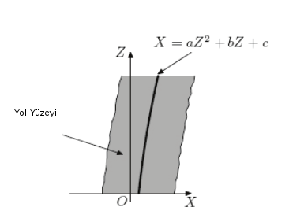
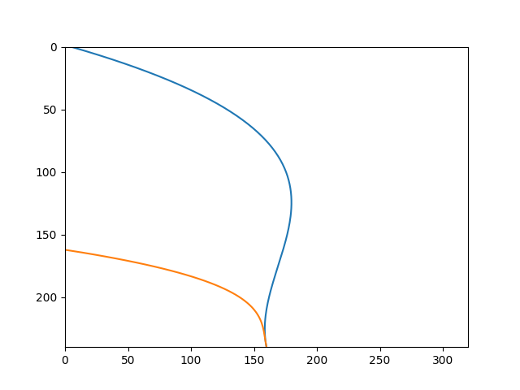
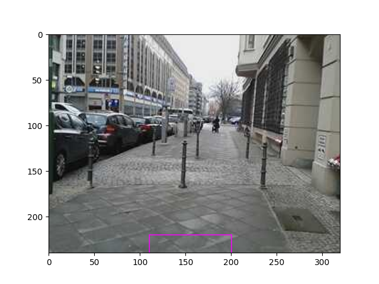
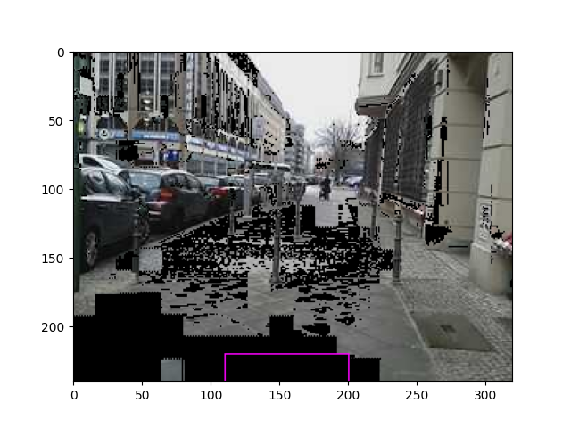
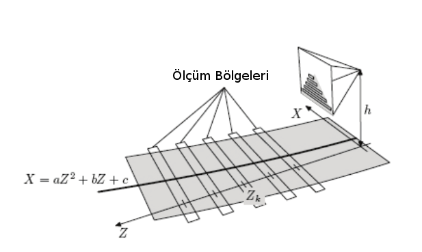
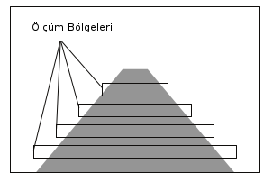
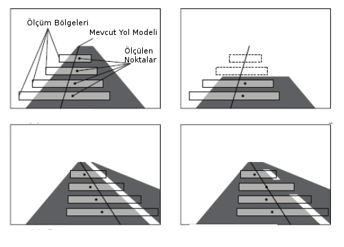
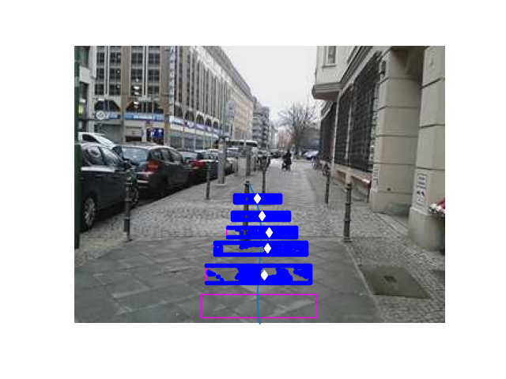
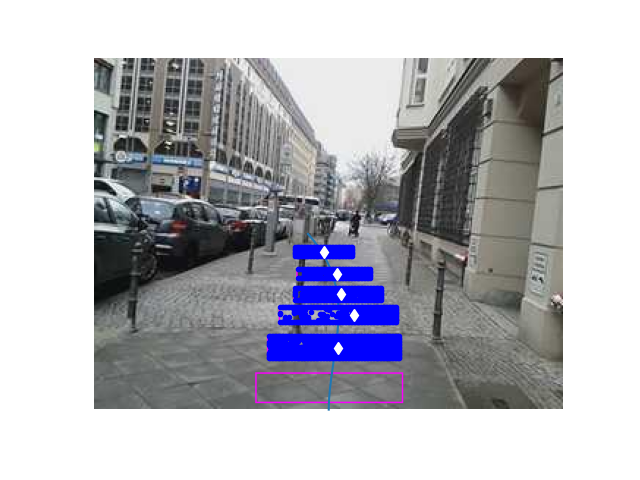
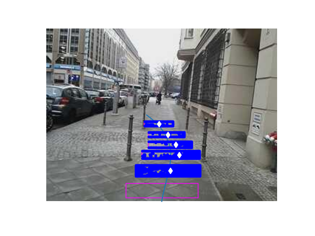

# Yol Bulmak, Takip Etmek (Road Detection)

Bir arabanın önünde ya da elde tutulan tek bir kamera görüntüsü ile
(monocular vision) önümüzdeki açık yolu nasıl buluruz? Sürücüsüz arabalar
için bu önemli bir konu, çözüm için farklı teknikler var. 

[1]'deki çözüm şöyledir: yolu kameranın görüntüsünün alt ortasından çıkan
bir eğri olarak modelle, sonra "yol piksellerini'' bul; bunun icin
görüntünün alt ortasındaki (yani hemen önümüzdeki) ufak bir kutudaki
pikseller ile yol piksellerinin aşağı yukarı aynı renkte olacağından
hareket et, sonra yolu temsil eden eğrinin o piksellere en iyi uyumlu
formunu bulmak için filtreleme işlemi kullan.



Üstteki figürde yol modelinin kuşbakışı görünümü var. Eğri karesel bir
formül olarak seçilmiş, biz küpsel form kullanacağız, ve $z$ yerine $y$
kullanacağız, çünkü [1]'deki yaklaşım $z$ derinliğine göre eğrinin $y$
noktalarını yansıtma ile ayarlıyor, biz basitlik amaçlı olarak önceden
seçilmiş bir yansıtmaya göre bilinen $y$ seviyelerini baz alacağız. Dikkat:
İmajın alt ortasından çıkan bir eğriyi temsil etmek için $y$ bazlı formül
kullanıyoruz, yani

$$ y = ax^3 + bx^2 + cx + d$$

yerine 

$$ x = ay^3 + by^2 + cy + d$$

Bunun sebebi belli bir $x$ noktasından çıkan küpsel eğriyi $x$ temelli
temsilin zor olması. Fakat eksenleri değiş/tokuş yapınca çıkış noktasını kesi
(intercept) üzerinden basit bir şekilde temsil edebiliriz. Mesela (320,240)
boyutlarındaki bir resmin alt ortasından çıkan eğri

$$ x = ay^3 + by^2 + cy + 160 $$

ile gösterilir. İki tane eğri örneği görelim ($a,b,c,d$ sabitleri
`pols` içinde),

```python
yy = np.linspace(0,320,200)
pols = [ -4.08661281e-05,   0.79580150e-02,  -2.02432986e-01,   160.]
xx =  pols[3] + pols[2]*yy + pols[1]*yy**2 + pols[0]*yy**3
plt.plot(xx,240-yy)
pols = [ -4.08661281e-04,   0.79580150e-02,  -2.02432986e-01,   160.]
xx =  pols[3] + pols[2]*yy + pols[1]*yy**2 + pols[0]*yy**3
plt.plot(xx,240-yy)
plt.xlim(0,320)
plt.ylim(240,0)
plt.savefig('vision_70road_05.png')
```



Yol Pikselleri 

Bu pikselleri bulmak için önce alt ortadaki bir kutu içine düşen HSV
piksellerinin üç boyutlu histogramını hesaplıyoruz. Bu bize bir ayrıksal
dağılım veriyor. Sonra bu dağılımı kullanarak imajdaki tüm piksellerin o
dağılıma ait olma olasılığını hesaplıyoruz. Belli bir eşik değerini geçen
pikselleri yol pikseli olarak işaretliyoruz. 

```python
from PIL import Image, ImageDraw, ImageFilter
import pandas as pd, zipfile

def draw_boxes_color(bs, im):
    arr = np.asarray(im)
    draw = ImageDraw.Draw(im)
    colors = ['magenta','green','white','red','yellow']
    for i,b in enumerate(bs):
        fr = b[0]; to = b[1]
        
        # Transform y-coordinates for Pillow
        y0_transformed = arr.shape[0] - fr[1]
        y1_transformed = arr.shape[0] - to[1]

        # Ensure y0 <= y1 for Pillow's rectangle function
        bnew = [(min(fr[0], to[0]), min(y0_transformed, y1_transformed)),
                (max(fr[0], to[0]), max(y0_transformed, y1_transformed))]
        
        draw.rectangle(bnew, outline=colors[0])
    plt.imshow(im)
    
def eval(x, H, edges):
    i=np.argmax(x[0]<edges[0])
    j=np.argmax(x[1]<edges[1])
    k=np.argmax(x[2]<edges[2])
    return H[i-1,j-1,k-1]

def get_pixels(box, im):
    arr = np.array(im)
    (yw,xw,d) = arr.shape
    (bx1,by1) = box[0]; (bx2,by2) = box[1]
    by1 = yw-by1; by2 = yw-by2
    x1 = min(bx1,bx2); x2 = max(bx1,bx2)
    y1 = min(by1,by2); y2 = max(by1,by2)
    arr = arr[y1:y2, x1:x2, :]
    return arr

with zipfile.ZipFile('mitte.zip', 'r') as z:
     im = Image.open(z.open('105.jpg')).convert('HSV') 

box = [(110,0),(200,20)]

bins = (8,8,8)
bim = get_pixels(box, im)
bnim = np.reshape(bim, (bim.shape[0]*bim.shape[1], 3))
H, edges = np.histogramdd(bnim, bins=bins, density=True, range=[(0,255),(0,255),(0,255)])
imm = np.array(im)
nim = np.reshape(imm, (imm.shape[0]*imm.shape[1], 3))
e = map(lambda x: eval(x, H, edges), nim)
ee = np.array(list(e)) 
ee = np.log(ee + 1e-10)
imm2 = np.array(im)
nim2 = np.reshape(imm2, (imm2.shape[0]*imm2.shape[1], 3))
nim2[ee > -15] = [0,0,0]
imm2 = np.reshape(nim2,imm2.shape)
im2 = Image.fromarray(imm2,'HSV')

fig=plt.imshow(im2)
draw_boxes_color([box],im2)
plt.savefig('vision_70road_06.png')

fig=plt.imshow(im)
draw_boxes_color([box],im)
plt.savefig('vision_70road_07.png')
```





Fena değil; yol ortasındaki direkler yol sayılmadı, ve genel olarak yolun
gidişini görebiliyoruz. 

Filtreleme

Elimizde yol pikselleri var. Bir eğri modeli var. Şimdi herhangi bir yol
hipotezinden başladık diyelim, yol piksellerinin bu model üzerinde
düzeltme yapmasını nasıl sağlayacağız? Eğer Kalman Filtresi (KF)
kullanacaksak sonuç bir ya da daha fazla boyutlu reel sayılar olacak, o
zaman ölçüm ne olacak, hata ne olacak? [1]'in kullandığı dahiyane fikir
şudur: Yol hipotezi / modeli üzerinde eşit büyüklükte, belli aralıklarda,
belli sayıda (bu çok önemli) şerit olduğunu düşünürüz,



İki boyuttaki yansıması



Filtreleme için tüm bu şeritler içine düşen yol piksellerini buluruz. Bu
piksellerin kordinatlarının ortalamasını alırız, bu bize bir $x$ kordinatı
verir. İşte ölçüm budur, çünkü eğer yol hipotezi mükemmel olsaydı kutu
içindeki tüm pikseller yol olurdu, onların ortalaması yine modelin
hesapladığı $x$ olurdu. Eğer böyle değilse, mesela soldan bir dışarı taşma
var ise ortalama modelin sağına düşer, sağdan taşma var ise, modelin soluna
düşer. Bu bize düzeltme için gerekli ölçümü sağlar. 



Sonlu sayıda kutu var demiştik, mesela 5 (iki üstteki figürdeki gibi), o
zaman ölçümümüz 5 boyutlu olacaktır. 

Ayrıca KF modeli için $F,H$ matrisleri gerekiyordu. Kalman sistemini
hatırlarsak,

$$ x_k = Fx_{k-1} + Q $$

$$ z_k = Hx_k + R $$

$H$ bize konum bilgisini dışa dönük bir tahmine çevirme imkanı verir. Konum
bilgisi yol eğrisinin son halidir, o zaman $a,b,c,d$ katsayılarını
içerecek.  Ölçüm ve model için önceden seçilmiş $y$ noktaları
kullanılacağız, bunlar $y_1,y_2,..,y_5$ olsun, o zaman $H$ ve $H x$ çarpımı
suna benzer,

$$ 
Hx = 
\left[\begin{array}{rrrr}
y_1^3 & y_1^2 & y_1 & 1 \\
y_2^3 & y_2^2 & y_2 & 1 \\
y_3^3 & y_3^2 & y_3 & 1 \\
y_4^3 & y_4^2 & y_4 & 1 \\
y_5^3 & y_5^2 & y_5 & 1 
\end{array}\right]
\left[\begin{array}{r} a \\ b \\ c \\ d  \end{array}\right]
= 
\left[\begin{array}{r}
a y_1^3 + b y_1^2 + c y_1 + d \\
a y_2^3 + b y_2^2 + c y_2 + d \\
a y_3^3 + b y_3^2 + c y_3 + d \\
a y_4^3 + b y_4^2 + c y_4 + d \\
a y_5^3 + b y_5^2 + c y_5 + d 
\end{array}\right]
$$

ki $d = 160$ ve $F = I$, yani birim matrisi. $H$ matrisi eğri modelini alıp
bize ölçüm ile karşılaştırılabilecek bir sonuç veriyor. Tüm bu tahmin,
düzeltme işlemleri KF matematiğinin içinde oluyor tabii. Şimdi ardı ardına
üç resim üzerinde KF güncelleme kodunu görelim,

```python
import sys; sys.path.append('../../tser/tser_083_kf')
import kalman
from PIL import Image, ImageDraw
import pandas as pd, zipfile

# her kutu (y-kordinati, genislik, yukseklik) ile tanimli
boxes = [(5,50,20),(35,45,15),(60,40,10),(75,30,8),(90,25,6),(105,20,6)]
yy = np.linspace(0,120,1000)
kf = kalman.KalmanFilter(dim_x=4, dim_z=5)
kf.x = np.array([[-4.08661281e-05,   0.59580150e-02,  -2.02432986e-01, 160.]]).T
kf.P = np.diag([1e-4,1e-4,1e-4,1e-4])
kf.F = np.eye(4)
H = [[ylev**3, ylev**2, ylev, 1 ] for (ylev, bwidth, bhight) in boxes[1:]]
kf.H = np.array(H)
kf.R *= 10.

def rcurve(yy, kf): return kf.x[0]*yy**3 + kf.x[1]*yy**2 + kf.x[2]*yy + kf.x[3]

bins = (8,8,8)

top = 120
import itertools
idxs = [(i,j) for (i,j) in itertools.product(range(240,0,-1),range(0,320)) ]
idxs = np.array(idxs)

with zipfile.ZipFile('mitte.zip', 'r') as zz:
    for i in (105,106,107):
        f = plt.figure()
        xx =  rcurve(yy, kf) # egriyi ciz
        f = '%d.jpg' % i
        im = Image.open(zz.open(f)).convert('HSV')      
        boxes2 = []
        for (ylev, bwidth, bhight) in boxes:
            boxes2.append(((rcurve(ylev,kf)-bwidth, ylev),\
                           (rcurve(ylev,kf)+bwidth, ylev+bhight)) )
        draw_boxes_color(boxes2, im)

        bim = get_pixels(box, im)
        bnim = np.reshape(bim, (bim.shape[0]*bim.shape[1], 3))
        H, edges = np.histogramdd(bnim, bins=bins, density=True, 
                                  range=[(0,255),(0,255),(0,255)])
        imm = np.array(im)
        nim = np.reshape(imm, (imm.shape[0]*imm.shape[1], 3))
        e = map(lambda x: eval(x, H, edges), nim)
        ee = np.array(list(e))
        ee = np.log(ee + 1e-20)        

        f=plt.imshow(im)

        h = np.array(im).shape[0]
        plt.plot(xx,h-yy)

        z = []
        for (ylev, bwidth, bhight) in boxes[1:]:
            low_left = (rcurve(ylev,kf)-bwidth, ylev)
            up_right = (rcurve(ylev,kf)+bwidth, ylev+bhight)
            boxes2.append((low_left,up_right))
            mask = (idxs[:,1] >= low_left[0]) & (idxs[:,1] <= up_right[0]) & \
                   (idxs[:,0] >= low_left[1]) & (idxs[:,0] <= up_right[1] )
            mask2 = (ee > -15.0)
            idxs2 = idxs[mask & mask2]
            m = idxs2.mean(axis=0)
            z.append(m[1])
            plt.plot(idxs2[:,1], h-idxs2[:,0], '.b')
            plt.plot(m[1], h-m[0], 'wd')
            
        z = np.reshape(np.array(z),(5,1))
        plt.axis('off')
        plt.savefig('out-%d.png' % i)
        kf.predict()
        kf.update(z)
```







Görülüyor ki ilk başta kutulardan bazıları bir direk üzerindeydi, bu
sebeple ölçüm modelin sağına düştü. Düzeltme yapıldı, ve birkaç döngü
sonrası son resimdeyiz, ve direkler arasındaki yolu gösteriyoruz. 

Kaynaklar

[1] Procházka, *Road Tracking Method Suitable for Both Unstructured and Structured Roads*


