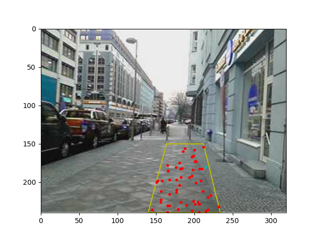
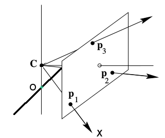
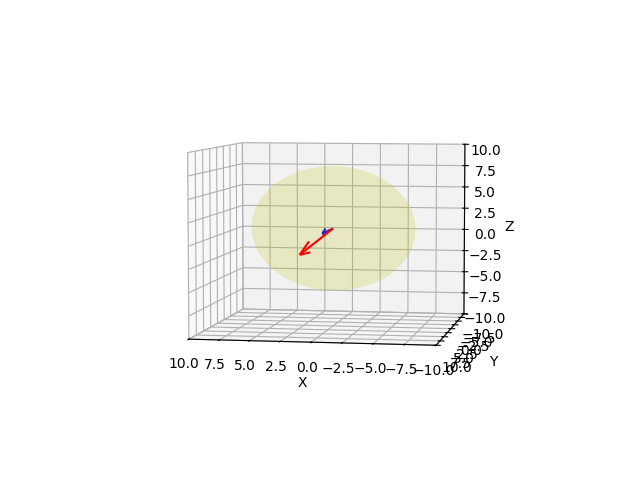
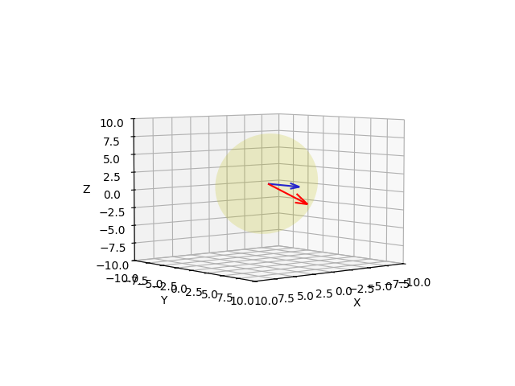
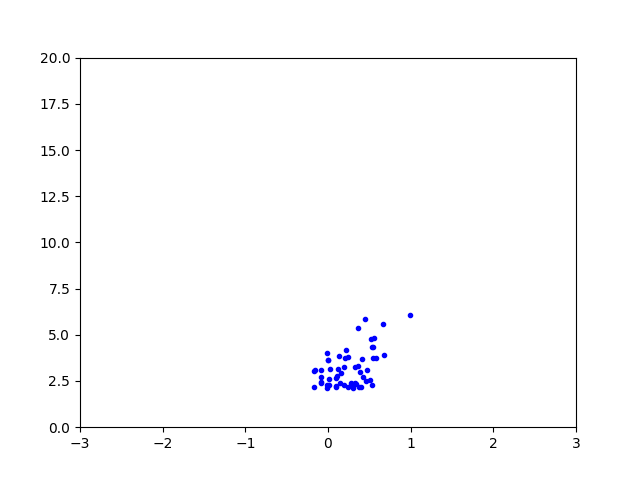

# Geri-Yansıtmayla 3D Işın Hesabı (Back-projecting a 3D Ray), ve Düzlem Mesafesi

Üç boyutlu bir noktanın iki boyuta yansımasında derinlik bilgisinin
kaybolduğunu gördük, birden fazla üç boyutlu nokta aynı piksele tekabül
edebiliyor. Bu durumda sadece piksel kullanarak obje mesafe ölçümünü tek
bir görüntü üzerinden nasıl yapabiliriz? 

Eğer derinlik bilgisini kaybettiysek o zaman resimde bilinen diğer bazı
faktörleri yanyana koyarak bir uzaklık hesaplayabiliriz belki. Mesela
alttaki resimdeki kırmızı piksellerin mesafesini bulmak istiyorum.

```python
from PIL import Image
import util

im = np.array(Image.open('mitte.png'))
plt.xlim(0,320)
plt.ylim(240,0)
plt.imshow(im)
h = np.array(im).shape[0]

np.random.seed(1)
quad = np.array([[140,0],[164,90.],[212,90],[234,0]])
util.plot_quad(quad, h, 'y')
N = 1000 
random_points = np.random.uniform(0, 320, (N, 2)).astype(np.int)
random_points = random_points[random_points[:,1] < 240]
mask = np.array([util.inside_quad(quad, p)[0] for p in random_points])
plt.plot(random_points[mask][:,0], h-random_points[mask][:,1], 'r.')
p1 = np.array([215, 180, 1.])
plt.plot(p1[0], p1[1], 'c.')
plt.savefig('vision_80ray_02.png')
```



Problem öyle ki bu piksellerin yolu temsil eden pikseller olduğunu
biliyorum. Bu bilgiyi nasıl elde ettim? Renksel bazlı, ya da iki boyutta
imajı parçalara bölmeyi çok iyi yapan bir algoritmam var belki, vs. ve bu
sayede o piksellerin caddeye ait oldugunu biliyorum. O zaman, bu bilgi elde
varsa, bu bana bir şey kazandırdı: üç boyutta bu piksellerin {\em hangi
  düzlemden} geldiğini biliyorum artık. Bu düzlem $xy$ düzlemidir, orada
$z=0$.

Bir numara daha: bir piksele bakarak onun kesin üç boyutlu yerini
hesaplayamayabilirim. Ama bir piksele tekabül eden, onu oluşturan kamera
merkezinden dünyaya doğru fırlayan bir ışının (ray) kesin formülünü
hesaplayabilirim.



Mesela örnek kırmızı piksellerden biri $p_1$ noktası olabilir, kamera
merkezi $C$'den bir ışın fırlatıyoruz, bu ışın $p_1$'i oluşturuyor ve dış
dünyadaki bir $X$ noktasına doğru gidiyor.  Şimdi bu iki fikri biraraya
koyarsak, elde bir düzlem, bir çizgi var; üç boyutlu yer nasıl bulunur?
İkisinin kesiştiği yer ile! Bu nokta yol noktasının üç boyutlu
kordinatıdır.

Kamera Merkezi

Bu yazıda kamera merkezinin bilindiğini varsaydık. Ama eğer bilmeseydi, ve
elde sadece $P$ matrisi olsa, kamera merkezini nasıl hesaplarız onu
görelim. Biraz önceki resmi işlerken kameranın yerden 1 metre yükseltilmiş
olduğunu farzedeceğiz (bunu biliyoruz), fakat bazen bu bilgi verilmemiş
olabilir. Bu durumda dışsal matristen başlayabiliriz.

Dışsal (exintrinsic) matrisler dış dünya kordinatlarının kamera
kordindatlarına nasıl transform edildiğini tarif ederler. Bunun yerine
kamera duruşunu modelleyip oradan geriye gidersek aynı noktaya gelmiş
oluruz [1].

$$ 
\left[
\begin{array}{c|c} R & \boldsymbol{t} \\ \hline  \boldsymbol{0} & 1 \\ \end{array}
\right]
 = 
\left[ \begin{array}{c|c} R_c & C \\ \hline \boldsymbol{0} & 1 \\ \end{array}
\right]^{-1} 
$$

$$ 
= \left[ 
\left[ \begin{array}{c|c} I & C \\ 
  \hline \boldsymbol{0} & 1 \\ 
  \end{array}
\right]
\left[ \begin{array}{c|c} R_c & 0 \\ 
  \hline \boldsymbol{0} & 1 \\ 
  \end{array}
\right]
\right]^{-1}
$$

$$ 
= \left[
  \begin{array}{c|c} R_c & 0 \\ 
  \hline \boldsymbol{0} & 1 \\ 
   \end{array} 
  \right]^{-1} 
\left[ \begin{array}{c|c} I & C \\ 
  \hline \boldsymbol{0} & 1 \\ 
   \end{array}
\right]^{-1}
$$

$$ 
= \left[\begin{array}{c|c} R_c^T & 0 \\ 
\hline \boldsymbol{0} & 1 \\ 
\end{array}
\right]
\left[ \begin{array}{c|c} I & -C \\ 
\hline \boldsymbol{0} & 1 \\ 
\end{array}
\right]
$$

$$ 
= \left[\begin{array}{c|c} R_c^T & -R_c^TC \\ 
\hline \boldsymbol{0} & 1 \\ 
\end{array}
\right]
$$

Birbirine tekabül eden hücrelere bakınca 

$$ t = -R_c^TC$$

O zaman 

$$ C = -R_c^T t$$

Burada $R_c$ $P$ yansıtma matrisinin ilk üç kolonundan oluşan
matristir. Ayrıca kamera merkezinin içsel matris $K$'ye bağlı olmadığına
dikkat. 

Sözde Ters ile $X$

Şimdi $X$ bulmak lazım. Bir fikir akla geliyor, $PX = x$ olduğuna göre,
$P$'nin tersini alıp bu tersi soldan iki tarafla çarpsak olmaz mı (solda
$P$ yokolur, $X$ kalır)? Burada bir problem var, $P$ matrisi $3 \times 4$
matrisi, kare matris olmadığı için tersi alınamıyor. Bu hesap için
2. derste işlenen sözde ters (pseudoinverse) işlemini
kullanacağız. Hatırlatarsak, $P$'nin sözde tersi $P^{+}$

$$ P^{+} = P^T(PP^T)^{-1}$$

işlemidir, ki $PP^{+} = I$. Ama $PP^T$ çarpımı sayısal iyi sonuçlar
vermeyebilir (çarpımlar çok büyür), endişeye gerek yok, sayısal
kütüphaneler sözde ters işlemini SVD üzerinden çözüyor (çok hızlı),
bkz. 2. ders.

O zaman $P^{+}x$ ile bahsettiğimiz ışındaki bir noktayı buluruz. Dikkat,
sadece birini buluruz, diğer noktalar da mümkündür. Ama o noktalar bizi
ilgilendirmiyor (şimdilik) elimizde iki nokta olacak, biri kamera merkezi
diğeri bu hesaplanacak olan, bu ikisi yeterli. Ondan önce üstteki hesabın
gerçekten bir $X$ verip vermediğini kontrol edelim, hesaplanan noktayı
tekrar geri kameraya yansıtırsak ne olur?

$$ P (P^{+}x) = Ix = x$$

Hesap doğruymuş demek ki. Işın hesabı yapalım. Bir önceki resimde $p_1$'e
benzeyen bir nokta iki üstteki resimde mavi renkli gösterildi. Bu piksele
doğru giden bir çizgi neye benzer?

```python
from mpl_toolkits.mplot3d import Axes3D
import scipy.linalg as lin
import sys; sys.path.append('../vision_02')
import plot3d

K = [[ 282.363047,      0.,          166.21515189],
     [   0.,          280.10715905,  108.05494375],
     [   0.,            0.,            1.        ]]
K = np.array(K)
R = np.eye(3)
t = np.array([[0],[1.],[0]])
P = K.dot(np.hstack((R,t)))
C = np.array([0., 0., 1.])

X = np.dot(lin.pinv(P),p1)
X = X / X[3]
XX  = np.copy(X)
XX[1] = X[2]; XX[2] = X[1]; XX[2] = -XX[2]
w = 10
f = plt.figure()
ax = f.gca(projection='3d')
xvec = C - XX[:3] 
xvec = -xvec
ax.quiver(C[0], C[1], C[2], xvec[0], xvec[1], xvec[2],color='red')
ax.set_xlim(0,10);ax.set_ylim(0,10);ax.set_zlim(0,10)
ax.quiver(0., 0., 1., 0, 5., 0.,color='blue')
plot3d.plot_plane(ax, [0., 0., 1.], [0, 5., 0.], color='y', size=7)
ax.set_xlabel("X")
ax.set_ylabel("Y")
ax.set_zlabel("Z")
ax.set_xlim(-w,w);ax.set_ylim(-w,w);ax.set_zlim(-w,w)
ax.view_init(elev=5, azim=100)
plt.savefig('vision_80ray_04.png')
ax.view_init(elev=5, azim=50)
plt.savefig('vision_80ray_05.png')
```




Mavi renkli ok kameranın imaj düzlemine dik (normal) olan vektör. Kırmızı
olan ok $p_1$'e işaret eden üç boyutlu çizgi. 

Şimdi tüm noktaları yapalım. Altta ilk gösterilen kod iki noktayı baz alan
sonsuza giden çizgi ile bir düzlem (bir nokta, bir normal ile tanımlı)
arasında kesişmeyi hesaplayan çağrıdır, bkz [3]. Üstteki gördüğümüz kırmızı renkli pikselleri alıp teker teker onların
ışınını bulacağız, sonra bu çizginin $xy$ düzlemi ile kesişmesini
bulacağız. $xy$ düzlemini tanımlamak için bir nokta, bir de normal vektör
lazım; en basit nokta orijin, yani $(0,0,0)$, normal ise dik yukarı giden
birim vektör $\left[\begin{array}{ccc} 0&0&1 \end{array}\right]^T$.  Kamera
matrisi $K$'yi biliyoruz, çünkü kamerayı biz kalibre ettik, detaylar için
[2].

```python
def intersect(n,V0,P0,P1):
    """
    n: duzleme normal vektor
    V0: duzlemdeki herhangi bir nokta
    P0: P0P1 cizgisinin bir ucu
    P1: P0P1 cizgisinin diger ucu
    """
    w = P0 - V0;
    u = P1-P0;
    N = -np.dot(n,w);
    D = np.dot(n,u)
    sI = N / D
    I = P0+ sI*u
    return I

import scipy.linalg as lin

xx = np.ones((len(random_points[mask]), 3))
xx[:,0] = random_points[mask][:,0]
xx[:,1] = h-random_points[mask][:,1]

xyp = np.array([0,0,0])
xyn = np.array([0,0,1.])

for x in xx:
    X = np.dot(lin.pinv(P),np.array(x))
    X = X / X[3]
    XX  = np.copy(X)
    # Y-Z degistir, Y'nin isaretini degistir
    XX[1] = X[2]; XX[2] = X[1]; XX[2] = -XX[2]
    Xi = intersect(xyn, xyp, XX[:3], C)
    plt.plot(Xi[0], Xi[1],'b.')

plt.xlim(-3,3)
plt.ylim(0,20)
plt.savefig('vision_80ray_03.png')
```



Üstteki görüntü kırmızı piksellerin 3 boyutta, caddedeki kuşbakışı
görüntüsü. Noktalar mantıklı, bir sağa kayış var, bu doğru çünkü her ne
kadar iki boyutlu görüntüde noktalar yukarı gidiyor gibi dursa da, aslında
kesişme noktasına giden çizginin sağına doğru akmışlar. Bir diğer durum en
altta birkaç metrelik bir kısmın boş olması. Bu da mantıklı çünkü kamera
direk altını göremiyor, en yakın görebildiği noktalar biraz daha önde
olanlar.

Peki kameranın duruşunu biliyorum, yere paralel, 1 metre yukarıda, direk
düz ileri bakıyor. Bu bilgiyi kullanarak bir üçgen oluşturup, açılarla ve
benzeri şekillerle daha basit şekilde mesafeyi hesaplayabilirdim, niye bunu
yapmadım? Özellikle $P$ matrisini kullanmamızın sebebi eğer yer
değiştirmeyle beraber kamerada dönüş (rotation) durumu da varsa (bu örnekte
yoktu) bu bilginin de $P$ içinde olacağıdır. Bu durumda üstteki sözde ters
ile yine direk bir ışını basit bir şekilde elde edebilirdik. Öteki türlü
çetrefil bir sürü ek hesaplara girmek gerekecekti. Yani tarif ettiğimiz
yaklaşımla her türlü kamera duruşunu idare edebiliriz.

Hesapların metrik olarak bir anlamının olduğuna dikkat. Çünkü yerden 1
metre yüksekte olmayı hesabın içine direk dahil ettik, bu sebeple mesela
uzaklık sonuçları, 2.5 metre, 5 metre gibi anlamlı çıktı. 

Kaynaklar

[1] Kyle Simek, Dissecting the Camera Matrix, Part 2: The Extrinsic Matrix,
[http://ksimek.github.io/2012/08/22/extrinsic/](http://ksimek.github.io/2012/08/22/extrinsic/)

[2] Bayramlı, 
    *Algılayıcı Ölçümleri, Video, Android*, 
     [https://burakbayramli.github.io/dersblog/sk/2017/02/algilayici-olcumleri-video-android.html](https://burakbayramli.github.io/dersblog/sk/2017/02/algilayici-olcumleri-video-android.html)

[3] Bayramlı, *Çok Boyutlu Calculus, Ders 5*


