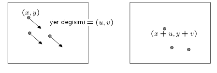
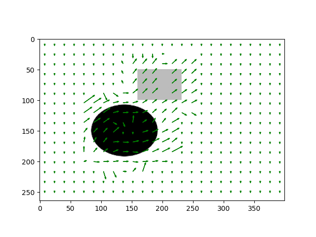
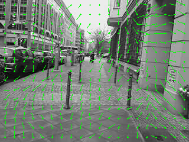

# Piksel Takibi, Optik Akış, Lucas Kanade Algoritması

Hareket halindeki bir kameranın aldığı görüntülerdeki herhangi bir pikseli
nasıl takip ederiz? 

Matematiksel olarak temsil etmek gerekirse, zamana göre değişen 2 boyutlu
görüntüyü bir fonksiyon olarak düşünelim, ki bu fonksiyonun değerleri
ayrıksal olarak, imajın ta kendisi. Bir $I(x(t),y(t),t)$ fonksiyonu piksel
değerlerini veriyor. Bu fonksiyonda $x,y$ ekran kordinatlarına tekabül
ediyor, $t$ ise zaman, $1,2,..$ gibi değerleri indeks değerleri var, mesela
$I(100,200,1)$, bize 1. video karesindeki $x=100,y=200$ kordinatlarındaki
piksel değerini verecek.

$x,y$ değişkenleri parametrize edildi, bir noktayı takip etmek istiyoruz
çünkü, ve $t$'ye göre bu takip edilen noktanın $x,y$ kordinatları belli bir
gidişat yönünde değişiyor.

Şu faraziyeyi yaparak takip problemimizi kolaylaştırabiliriz. Diyelim ki
takip edilen bir nokta, görüldüğü her karede aynı piksel rengindedir. Bu
çok sıradışı bir faraziye değil, resim karelerinden bir araba geçiyor
mesela, ve bu arabanın üzerindeki piksellerin renkleri, en azından iki kare
arasında değişmiyor. Işık seviyesi, gölgede olma, vs. gibi durumlarda biraz
değişebilir, fakat basitleştirme amacıyla bu faraziye geçerlidir. 


Bir diğer faraziye, kameralar hareket ettiklerinde alınan iki görüntü
arasındaki tüm piksellerin yer değişimi genellikle aynı yönde olmasıdır. Bu
değişim yönünü $<u,v>$ vektörü olarak görebiliriz, ve bu değişkenler iki
görüntü arasındaki değişimde tüm pikseller için aynı olacaktır. Bu da
normal, kamerayı alıp mesela sağa doğru hareket ettiriyoruz, ve görüntüdeki
tüm pikseller sola doğru gidiyorlar.



Tüm bunları modelimizde nasıl kullanırız? 

Takip edilen nokta her karede aynı renkte ise, şu ifade doğru demektir 

$$ I(x(t),y(t),t) = \textrm{ sabit } $$

Eğer bu fonksiyonun zamana göre türevini alırsak

$$ \frac{d \ I(x(t),y(t),t)}{dt} = 0$$

sonucu gelir. Eşitliğin sağı sıfır, çünkü bir sabitin türevini aldık. Sol
tarafa Zincirleme Kanununu uygularsak, 

$$ \frac{\partial I}{\partial x}\frac{dx}{dt} +
\frac{\partial I}{\partial y}\frac{dy}{dt} +
\frac{\partial I}{\partial t} = 0
$$

Bu formülde $dx/dt$ ve $dy/dt$, hareket halindeki (zaman geçerken)
noktanın sonsuz küçüklükteki yer değişimi. Ayrıksal bağlamda arka
arkaya iki kare içindeki yer değişimi. O zaman,

$$ \frac{dx}{dt}, \frac{dy}{dt} = u, v $$

Alttakiler ise mesafesel (spatial) gradyanlardır, bunların nasıl
hesaplanacağını çok iyi biliyoruz! 

$$ 
\frac{\partial I}{\partial x}, \frac{\partial I}{\partial y}
$$

Alttaki ise resim karelerinin zamana göre türevidir.

$$ 
\frac{\partial I}{\partial t}
$$

Daha derli toplu olarak göstermek gerekirse ana formül nihai olarak şöyle

$$ I_x u + I_y v + I_t = 0 $$

ya da

$$ 
\nabla I \cdot <u, v> = -I_t
$$

Şimdi $u,v$'nin hesaplanmasına gelelim. Üstteki formülü bir veri noktası
için yazmak yeterli değil. Ama bu formülü hem takip ettiğimiz, hem de onun
etrafındaki pikseller için yazarsak (onların yer değişimi de aynı değil
mi?), ve bu sistemi çözersek, sonuca varabiliriz. 

İki tane bilinmeyenimiz var, ama böylece pek çok formül elde
ediyoruz. Veriler gürültülü olduğu için, aslında bilinmeyenden "daha
fazla" formül elde etmek iyi, bu tür denklem sistemlerine "çok eşitliğe
sahip (overdetermined)" denir, ve böyle tür sistemler En Az Kareler (Least
Squares) ile çözülür. Tüm bunları biraraya koyunca şu ortaya çıkar.

$$ 
\left[\begin{array}{cc}
I_x(p_1) & I_y(p_1) \\
I_x(p_2) & I_y(p_1) \\
\vdots & \vdots \\
I_x(p_k) & I_y(p_k) 
\end{array}\right]
\left[\begin{array}{r}
u \\
v
\end{array}\right] = 
-
\left[\begin{array}{c}
I_t(p_1) \\
I_t(p_2) \\
\vdots \\
I_t(p_k) 
\end{array}\right]
$$

Gradyanların belli noktalarda hesaplandığını unutmayalım, o sebeple $p_1,
p_2$ gibi piksel noktalarını bu fonksiyonlara geçiyoruz. 

Bu sistemi

$$ A \ d = b $$

olarak gösterebiliriz, ki $d = <u,v>$. Sol tarafı $A^T$ ile çarpalım

$$ A^TA \ d = A^Tb $$

Eğer $A^TA$'nin matris tersini iki tarafla çarparsak, $d$ yanlız kalır, ve
sonuç elde edilir. 

Bu denklemi Python Numpy'da `pinv` kullanarak çözeriz.

Test için üç tane resim kullandık, bu resimlerden `flow1-bw-0.png`
başlangıç resmi, bu resmin ortasındaki objeleri GIMP kullanarak elle kopyaladık,
bir üst sağ çapraza doğru, bir alt sol çapraza doğru, ve iki yeni resim elde
ettik (`upright.png`, `dleft.png`). Takip edilen nokta gri dörtgenin
alt sol köşesinde. Lucas Kanade algoritması bu noktayı takip ederek, yeşil ile
işaretledi.

```python
import scipy.signal as si
from PIL import Image

def gauss_kern():
    h1 = 15
    h2 = 15
    x, y = np.mgrid[0:h2, 0:h1]
    x = x-h2/2
    y = y-h1/2
    sigma = 1.5
    g = np.exp( -( x**2 + y**2 ) / (2*sigma**2) );
    return g / g.sum()

def deriv(im1, im2):
    g = gauss_kern()
    Img_smooth = si.convolve(im1,g,mode='same')
    fx,fy=np.gradient(Img_smooth)    
    ft = si.convolve2d(im1, 0.25 * np.ones((2,2))) + \
        si.convolve2d(im2, -0.25 * np.ones((2,2)))
                    
    fx = fx[0:fx.shape[0]-1, 0:fx.shape[1]-1]    
    fy = fy[0:fy.shape[0]-1, 0:fy.shape[1]-1];
    ft = ft[0:ft.shape[0]-1, 0:ft.shape[1]-1];
    return fx, fy, ft

im1 = np.asarray(Image.open('flow1-bw-0.png'))
im2 = np.asarray(Image.open("upright.png"))
fx, fy, ft = deriv(im1, im2)
print (fx[:5])
```

```text
[[32.07763979 48.21839171 58.5675253  ... 63.94363287 62.82211772
  58.56746171]
 [26.32259667 39.56753942 48.05993696 ... 52.47151812 51.55121378
  48.05988478]
 [14.51156379 21.81345859 26.49529034 ... 28.92738099 28.42002014
  26.49526157]
 [ 5.34221958  8.03030516  9.75385292 ... 10.64919146 10.462414
   9.75384233]
 [ 1.3027865   1.95831957  2.37863452 ...  2.59697728  2.55142858
   2.37863194]]
```

```python
import scipy.signal as si
from PIL import Image
import numpy.linalg as lin

def lk(im1, im2, i, j, window_size) :
    fx, fy, ft = deriv(im1, im2)
    halfWindow = np.floor(window_size/2)
    curFx = fx[int(i-halfWindow-1):int(i+halfWindow), 
               int(j-halfWindow-1):int(j+halfWindow)]
    curFy = fy[int(i-halfWindow-1):int(i+halfWindow), 
               int(j-halfWindow-1):int(j+halfWindow)]
    curFt = ft[int(i-halfWindow-1):int(i+halfWindow), 
               int(j-halfWindow-1):int(j+halfWindow)]
    curFx = curFx.T
    curFy = curFy.T
    curFt = curFt.T

    curFx = curFx.flatten(order='F') 
    curFy = curFy.flatten(order='F') 
    curFt = -curFt.flatten(order='F') 
    
    A = np.vstack((curFx, curFy)).T
    U = np.dot(np.dot(lin.pinv(np.dot(A.T,A)),A.T),curFt)
    return U[0], U[1]

def test(image1,image2,output): 
    x=165
    y=95
    win=50
    im1 = np.asarray(Image.open(image1))
    im2 = np.asarray(Image.open(image2))
    u, v = lk(im1, im2, x, y, win)
    plt.imshow(im1, cmap='gray')
    plt.plot(x,y,'+r');
    # 3 ile carptik cunku vektor degisimi iyi hesaplandi ama
    # grafikleme icin cok ufakti, ikinci yesil nokta iyi gozuksun
    # diye onu biraz buyuttuk
    plt.plot(x+u*3,y+v*3,'og')
    plt.savefig(output)

test('flow1.png','flow2.png','vision_85lk_03.png')
```


```python
test('flow1.png','flow3.png', 'vision_85lk_04.png')
```



Bu matematiksel modele alternatif bir bakış şöyle olabilir. İki imaj karesi
içinde birincisine $I(x,y)$ ikincisine $H(x,y)$ diyelim, burada $t$
üzerinden parametrizasyon olmasın; $x,y$ pikselinin $H$ içinde $u,v$ kadar
yer değişiminden sonra, bu noktaların $I$'de geldiği yerdeki grilik değerinin
aynı olduğunu (yine) farzediyoruz. Sonra $I(x+u,y+v)$'nin birinci
dereceden Taylor Açılımını yapıyoruz, 

$$ I(x+u,y+v) = I(x,y) + \frac{\partial I}{\partial x}u + 
\frac{\partial I}{\partial y}v + ...
$$

ya da

$$ I(x+u,y+v) \approx I(x,y) + \frac{\partial I}{\partial x}u + 
\frac{\partial I}{\partial y}v 
$$

Grilik aynılığını ise şöyle belirtebiliriz

$$  I(x+u,y+v) - H(x,y) = 0$$

Taylor açılımını üstteki formülde $I$ yerine geçirelim

$$ I(x,y) + 
\frac{\partial I}{\partial x}u + 
\frac{\partial I}{\partial y}v - H(x,y) = 0
$$

$H$'in yerini değiştirelim

$$ I(x,y)  - H(x,y) + I_xu + I_yv = 0$$

Şu ifade $I(x,y) - H(x,y)$ nedir? Bunlar iki imajın, sonrası ve öncesi
arasındaki fark değil midir?  O zaman bu hesabı imajın zamana göre alınmış
türevi olarak görebiliriz, yani $I_t = I(x,y) - H(x,y)$. Yerine koyalım

$$ I_t + I_xu + I_yv = 0$$

$$ I_xu + I_yv = -I_t $$

Böylece aynı denkleme erişmiş olduk. Bu aslında normal, birinci
dereceden Taylor açılımı ile tam diferansiyel denklemi (ve Zincirleme
Kanununu) birbiriyle çok yakından alakalı.

Ufak Piksel Değişimleri

Konu hakkında bir nokta daha şu; Lucas-Kanade yöntemi 1. derece Taylor
açılımı kulladığı için ufak piksel değişimleri için geçerlidir, çünkü
Taylor açılımı yerel bir noktaya çok yakın bölgelerde bir fonksiyona
yakın sonuçlar verir. Bu da aklımızda bulunsun.

OpenCV

OpenCV ile optik akış kullanımı altta görülüyor. 

```python
import pandas as pd, zipfile
import numpy as np
import cv2

def draw_flow(img, flow, step=16):
    h, w = img.shape[:2]
    y, x = np.mgrid[step/2:h:step, step/2:w:step].reshape(2,-1).astype(int)
    fx, fy = flow[y,x].T
    lines = np.vstack([x, y, x+fx, y+fy]).T.reshape(-1, 2, 2)
    lines = np.int32(lines + 0.5)
    vis = cv2.cvtColor(img, cv2.COLOR_GRAY2BGR)
    cv2.polylines(vis, lines, 0, (0, 255, 0))
    for (x1, y1), (x2, y2) in lines:
        cv2.circle(vis, (x1, y1), 1, (0, 255, 0), -1)
    return vis

prevgray = cv2.imread('106.jpg', cv2.IMREAD_GRAYSCALE)
gray = cv2.imread('107.jpg', cv2.IMREAD_GRAYSCALE)
flow = cv2.calcOpticalFlowFarneback(prevgray, gray, None, 0.5, 3, 15, 3, 5, 1.2, 0)
cv2.imwrite('pde_lk_01.png', draw_flow(gray, flow))
```

```text
Out[1]: True
```



Kaynaklar

[1] Collins, *Introduction to Computer Vision*,  [http://www.cse.psu.edu/~rtc12/CSE486/](http://www.cse.psu.edu/~rtc12/CSE486/)

[2] Khurram Hassan-Shafique, *CAP 5415 Lecture Notes, Spring 2003*

[3] Suhr, *Kanade-Lucas-Tomasi (KLT) Feature Tracker Feature Tracker*, [http://web.yonsei.ac.kr/jksuhr/articles/Kanade-Lucas-Tomasi%20Tracker.pdf](http://web.yonsei.ac.kr/jksuhr/articles/Kanade-Lucas-Tomasi%20Tracker.pdf)


